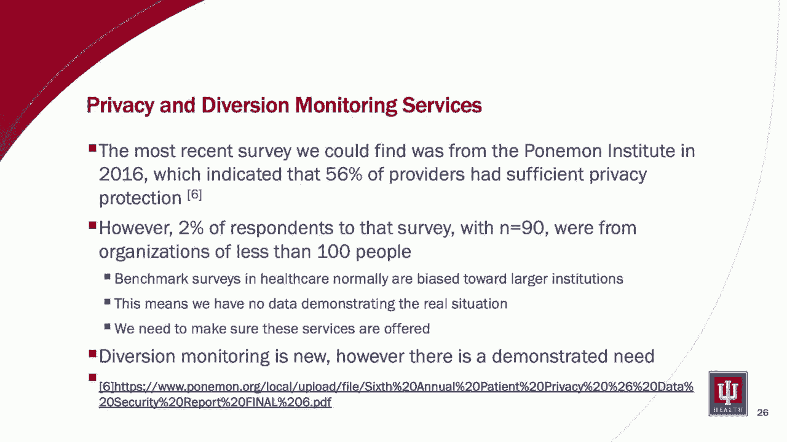
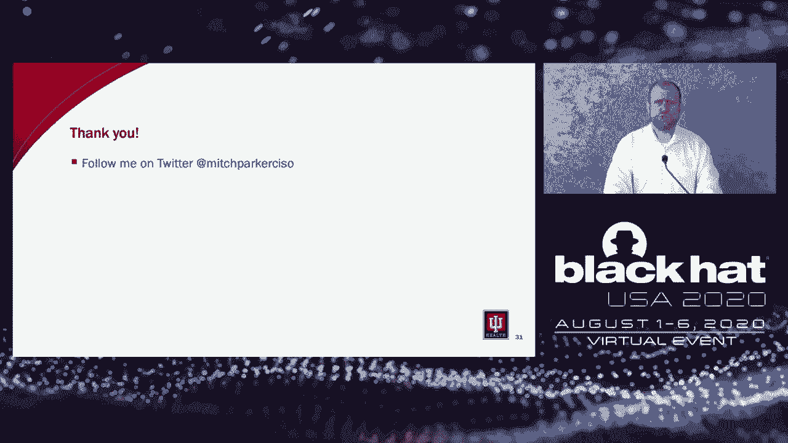

# 课程 P80：81 - 云的阴暗面：EMR安全控制缺失如何加剧阿片类药物危机 🏥💻

## 概述

在本节课中，我们将探讨电子病历系统安全控制的缺失如何被利用，从而加剧了阿片类药物危机。我们将分析一个真实案例，了解其背后的安全漏洞、社会影响，并讨论一系列可行的解决方案，以帮助资源有限的小型医疗机构加强其EMR系统的安全性。

---

## 云的阴暗面

上一节我们概述了课程主题，本节中我们来看看问题的核心背景。

阿片类药物危机已导致大规模成瘾和处方止痛药滥用。成千上万人死于阿片类药物成瘾，家庭因此破碎，甚至有婴儿一出生就带有毒瘾。西弗吉尼亚州甚至设有专门为成瘾者子女服务的日托中心。我们的社会支持网络已被拉伸至极限，甚至已经崩溃。我们今天讨论这个问题，既有充分的理由，也有不可推卸的责任。

那么，为什么我要在黑帽大会上谈论这个问题？因为造成这场危机的一个主要根源，是对一个本应用于辅助医生开药的电子病历系统进行了不正当的操纵。

---

## 案例：Practice Fusion 公司

上一节我们了解了问题的严重性，本节中我们来剖析一个具体案例。

几个月前（2020年2月），一家名为Practice Fusion的电子病历公司以1.45亿美元与司法部达成和解。原因是该公司允许其一家合作制药公司的市场营销部门操纵系统，使其产品在处方建议中持续被推荐。这种操纵直接导致了人员死亡和成瘾。

我们所说的这种颠覆性操纵是一个安全问题，而针对小型机构，我们尚未解决这个问题。那么，这家EMR公司是谁？

公司名为Practice Fusion，现已成为Allscripts的一个部门。它最初是一家独立公司，为小型诊所提供由广告支持的免费电子病历系统。然而，从一开始这就存在争议。他们因涉嫌违反《斯塔克法案》和《反回扣法规》而备受争议，因为他们在EMR中显示广告。

2015年，他们未能实现财务目标，创始人兼CEO离职。2018年，在涉嫌调查的疑云下，Allscripts以1亿美元收购了该公司。我们的研究表明，这个价格仅为当时市场估值的十五分之一。

---

## 小型医疗机构的困境

上一节我们介绍了涉事公司，本节中我们来看看其客户群体——小型医疗机构面临的挑战。

他们的客户是谁？他们拥有大量负担不起大型EMR系统，甚至无法从UPMC或Mercy Technology Services等大型供应商那里租赁系统的小型诊所。2018年，他们拥有10万家诊所客户。

以下是一些关键数据，说明了为什么这个问题至关重要：
*   根据美国医学会2018年的政策研究视角报告，56.5%的临床医生在医生人数不超过10人的诊所工作（样本量：3,339）。
*   来自同一来源，54%的医生拥有自己的诊所（样本量：3,500）。
*   根据美国医学会2018年发布的2016年医生薪酬报告，64.2%的诊所所有者其薪资基于个人生产力（即接诊患者数量，样本量：2,900）。

这对我们意味着什么？这意味着医生和我们一样需要工作来支付账单。他们的收入取决于他们接诊和结算的患者数量。当所有者工作如此繁重时，可用于雇佣员工的利润空间很小，不足以像大型医疗系统那样雇佣专门的EMR系统专家。

此外，还有一些更严峻的经济事实。根据美国医院协会2018年的图表手册，26.4%的医院总利润为负，30.6%的医院运营利润为负。这意味着许多你可能去的医院正在亏损。然而，无论你是小型诊所还是大型医院，对电子病历的要求却是相同的。

---

## 什么是电子病历？

上一节我们讨论了经济背景，本节中我们来明确一下核心概念。

电子病历是临床医生办公室纸质病历的数字版本。它包含你在某一诊所内的医疗和治疗历史。与纸质记录相比，它有一些优势。例如：
*   允许医生跟踪数据随时间的变化。
*   识别哪些患者需要进行预防性筛查或检查。
*   检查患者的健康状况，如血压读数、疫苗接种情况或整体体检。
*   监控并提高诊所内的整体护理质量，这与几年前一项名为“核心指标”的倡议相关。
*   现在还可以与其他医疗系统、支付方和业务伙伴对接。正如我们在COVID-19疫情中看到的，它们现在也与医疗设备和远程监控系统对接。

---

## EMR 如何工作？安全漏洞何在？

上一节我们定义了EMR，本节中我们来看看它的使用方式和存在的安全漏洞。

医生如何使用它？他们可以通过远程桌面、VDI或Citrix界面、网页、移动设备应用或桌面应用来访问。EMR与医疗设备、计费系统等众多接口相连。它们通常通过中央目录服务（通常是Microsoft Active Directory，也可以是Samba）进行身份验证。此外，医生还需要从外部进行远程访问，一个主要需求是让医生在下班后完成病历记录。

根据我个人经验，几乎每次实施EMR上线时，都有医生希望我帮助他们设置个人设备以访问EMR，因为他们晚上有数小时的工作要做。这是与许多医务人员合作的常态。

这就引出了我们要讨论的一些安全漏洞。首先，EMR需要获得认证才有资格获得联邦报销资金，并实际用于存储患者记录。美国有一个代表政府进行认证的非营利组织，叫做健康信息技术认证委员会。然而，这只是其中一部分。你不能仅仅使用一个认证系统就拿到钱。你必须完成年度风险评估、完成风险管理计划并跟进安全发现。未能做到这些将导致来自卫生与公众服务部民权办公室的罚款。

我们深入研究了一下，因为我们不能空谈。我们查阅了卫生与公众服务部自2015年以来在其网站上发布的每一份关于HIPAA和解的新闻稿。我们确定了导致OCR处罚的以下五个关键因素：
1.  未完成风险评估。
2.  未完成风险管理计划。
3.  未跟进风险评估。
4.  未在60天内妥善报告数据泄露事件。
5.  少报了受数据泄露影响的患者数量。

我们查看的许多组织是价值数十亿美元的公司。如果这些数十亿美元的公司都无法做好这五件事，那么小型诊所能够做到的可能性有多大？如果他们不做这些，他们也就不会审查对EMR系统的更改、不会审查临床决策支持警报的更改、不会审查谁有访问权限，并且除了勾选复选框外，不会提供相关的培训。

---

## 复杂因素： pretexting 攻击

上一节我们列出了常见违规原因，本节中我们来看一个日益普遍的威胁。

我想提出另一个复杂因素，这在过去几年实际上非常普遍。我们称之为 pretexting（借口欺骗）攻击。由于互联网上提供了大量关于我们医务人员的信息，pretexting 电话急剧增加。许多犯罪分子冒充政府监管机构或专业协会，使用伪造的来电显示或电子邮件打电话要求人们更新信息。

我个人见过州政府机构被冒充。电子邮件方面，他们使用看起来非常相似的域名。使用这种方法获取个人信息并不困难。当你掌握了所有这些个人信息后，打电话给帮助台获取某人的用户名和密码，从而获得系统访问权限，也并不困难。

因此，正如我的朋友们乐于听到的，这存在第二阶段。
1.  从互联网获取国家执业标识符和公共信息。
2.  使用伪造来电显示给诊所打电话获取个人信息。
3.  获利。特别是当诊所没有双因素认证时。

---

## 其他复杂因素与案例剖析

上一节我们介绍了 pretexting 攻击，本节中我们看看其他漏洞，并深入分析 Practice Fusion 的案例。

其他复杂因素有哪些？
1.  **系统访问缺乏双因素认证**：虽然开具阿片类药物处方的实际流程需要双因素认证，但基本的系统访问通常不需要。这意味着你可以在不需要双因素认证的情况下，更改那些需要双因素认证的流程，包括对EMR的管理员访问权限。这不是EMR本身的失败，而是我们如何保护它们的失败。

这仅仅是理论吗？不。Practice Fusion 几乎给我们上了一堂生动的实践课。这一点非常重要，因为它揭示了我们在保护EMR安全方面的缺陷，我们今天将讨论如何修复。

那么他们是谁？公司由 Ryan Howard 于2005年创立（绝对不是前费城人队MVP）。它为医生提供由广告支持的免费云端EMR，这意味着更少的IT投资，这对于当你三分之二的薪水基于接诊患者数量时至关重要。你必须接诊大量患者才能负担得起IT并维持运营。

这里有一点个人背景。大约17年前，我在一家医生办公室工作。我记得的一件事是，医生本人像打乒乓球一样在各个办公室之间奔波，因为他每20分钟就要看一个病人，还有另外两位医生和他一起看诊。经营一家小型医生诊所所需的工作量是未被充分认识的。那里没有人懒惰，工作绝对疯狂。他们必须支付员工工资，而唯一的方法就是接诊越来越多的患者。小型医生诊所的职业倦怠非常真实。

事实是，如果你花钱维持那个办公室的员工，并且你必须那样奔波来赚钱，你就不会把钱花在合规上，也负担不起高端的EMR。此外，根据《华盛顿邮报》的报道，Practice Fusion的大部分收入来自广告。这难道不是个问题吗？

根据《反回扣法规》42 U.S.C. § 1320a-7b(b)，是的。我那段话的翻译是：“在一个用于接收联邦和参议院项目资金的产品中投放广告，会让你陷入严重的麻烦，因为它可能影响服务的提供方式。” 这本质上就是问题的关键。你在里面投放广告，就有可能影响联邦资金的使用方式，而且不是好的影响。

根据司法部的和解协议，Practice Fusion的另一条业务线是向制药商推销自己，愿意定制临床决策支持警报。根据和解协议，某制药公司X支付了100万美元，以在EMR中添加一个定制的临床决策支持警报。我们不点名那家公司的原因是：首先，司法部知道；其次，该领域有四家公司，我们想给你正确答案；第三，作为和解的一部分，法律要求Practice Fusion让公司官员和任何其他相关人员接受司法部调查，这意味着该公司正在接受刑事调查。

为什么这很重要？因为他们支付100万美元编写的这些由营销人员撰写的警报，在2016年7月至2019年春季期间，向医生推荐了2.3亿次缓释阿片类药物。他们能够从统计上证明，收到这些警报的医生开具缓释阿片类药物的比率高于未收到的医生。

一点背景：我来自费城，我来自90年代末费城经历阿片类药物危机的时期。那时，缓释阿片类药物正在夺去青少年的生命。在费城，他们称之为“Oxy 80”的药物导致许多青少年丧生。所以这是东海岸人们多年来一直看到的情况。但不幸的是，全国其他地方现在也看到了我们很久以前看到的情况。

**欺骗等于死亡**。这个用于提供虚假信息的计算机系统版本，在危机中导致了极易上瘾药物的错误处方。我把它放在这里，我希望PowerPoint有闪光标签，因为一个营销部门导致了人员死亡和成为瘾君子。我不知道还有更好的说法。它说明了影响小型供应商的许多安全漏洞。

---

## 解决方案：四项改进措施

上一节我们深入分析了安全漏洞的严重后果，本节中我们来看看如何解决这个问题。

我们将讨论如何使用四种方法来解决这个问题。
1.  进一步澄清《斯塔克法案》安全港条款，允许大型供应商向小型供应商提供网络安全服务。
2.  让小型供应商利用大型供应商的资源，为其EMR实例提供临床决策支持服务。
3.  将隐私监控服务作为销售的服务包的一部分。
4.  讨论如何增强EMR本身的安全性，要求双因素认证，并加强对创建警报或进行配置更改的登录控制。

---

## 1. 修订法规以支持安全捐赠

上一节我们列出了四项措施，本节中我们详细探讨第一项：法规修订。

我们发现了《斯塔克法案》安全港措辞中相关的三个部分。
1.  设备租赁要求公平市场报酬，且不基于转诊的数量或价值。
2.  管理服务要求公平市场价值报酬。
3.  要求诊所预付服务费用的15%。

你最近看过隐私和安全软件的价格吗？你在小型医生办公室工作过吗？要求某人预付某人服务费的15%？这不会发生。这样做的诊所数量将无限趋近于零。

那么提出了什么建议？2019年10月，卫生与公众服务部提议修订我刚才谈到的这些法律，以允许捐赠网络安全产品和服务。然而，这不包括补丁、维护或硬件。换句话说，可以给你设备，但你不能更新它。正如我们在许多问题中看到的，特别是Windows 7不再支持这一事实，这是一个失败的主张。

因此，在2020年1月，我们的朋友健康部门协调委员会提出了一些进一步的修正案，包括允许捐赠补丁和维护、允许捐赠硬件，以及更重要的是，为捐赠者提供责任保护。换句话说，我们给小型诊所一些东西，如果发生什么事，他们不能起诉我们。

但我们认为这还不够。因此，我们提议两项进一步的修正案。
1.  将转移监控软件作为网络安全服务的一部分。
2.  允许捐赠的服务包括药物转移监控以及潜在问题的警报。许多大型医疗系统已经在实施这一点。优秀的软件将转移调查的时间从一个月缩短到 literally 不到一天。

隐私监控方面，许多诊所没有这个。你应该能够让诊所能够监控并收到潜在患者隐私违规的警报，并且可以捐赠这项服务，使他们能够真正做到这一点。为什么这很重要？

下面的链接讲述了佛罗里达州发生的一个案例，一名女子刚刚被判入狱几年，因为她曾在多家小型诊所工作。她会用智能手机拍摄患者的个人信息。最终，她利用这些个人信息进行身份盗窃。为什么这相关？因为他们是从一名机密线人那里发现此事的，而不是从EMR或诊所。是有人告诉警察他们看到了这些记录。没有诊所知道她在做这件事。如果一个机密线人必须通知诊所和警察发生了什么，那就真的存在一个大问题。

---

## 2. 与大型供应商建立伙伴关系

上一节我们讨论了法规支持，本节中我们看看如何利用现有的大型系统资源。

与大型医疗系统或服务组织建立杠杆式合作伙伴关系或可转售协议，以使用他们的EMR。为什么？因为一个在各个办公室之间像乒乓球一样奔波的医生，不会花那么多时间监控CDS警报。他们会付钱让别人来做。利用他们的专业知识，利用他们的人员配置。支付服务费用以帮助监控这些警报，并利用他们的医嘱集和警报来减少阿片类药物处方。美国许多大型医疗系统已经开展了重要工作，并拥有减少阿片类药物处方量的优秀项目。这些项目是由国内一些顶级的急诊医学和成瘾医学医生完成的。尽可能利用这一点。因为你无法做到他们所做的。

---

## 3. 隐私与转移监控服务

上一节我们提到了利用伙伴关系，本节中我们强调隐私和转移监控的具体必要性。

我在这一领域做了很多研究，只能找到Ponemon研究所2016年的最新调查，该调查显示56%的供应商拥有足够的隐私保护。然而，当你查看其背后的实际数据时，只有2%的受访者（样本量为90）来自少于100人的组织。

这引出了关于医疗保健的一个观点。许多基准调查通常面向大型机构，这意味着我们没有数据来展示真实情况。我们必须确保这些服务能够提供给小型诊所。转移监控是新的，然而，诊所对此有明确的需求。

谈到隐私和转移监控，你不能脱离这两者单独谈论安全。你正在防范恶意软件、蠕虫和勒索软件。实际上我们做得相当不错。然而，我们并没有防范身份盗窃、转移和连锁效应。当然，正如我们刚刚解释的，也没有防范好奇的团队成员查看病历并利用这些信息谋取个人利益。

---

## 4. 加强 EMR 自身安全

上一节我们讨论了外部服务，本节中我们最终回归到EMR系统自身安全的改进。

我想从这里开始说，我与大多数主要的EMR公司合作过。在过去五年中，他们在改进安全方面做了令人难以置信的工作。他们实际上应该为此受到赞扬。他们已经将EMR从主要是桌面应用程序转变为在许多安全领域达到一流水平。我们为开具阿片类药物处方提供了双因素认证，并且有许多优秀的公司为此提供出色的解决方案。

然而，我们仍有改进的空间。我们不能安于现状。谈到EMR安全，我们将讨论四个可以改进的领域。
1.  **要求双因素认证进行管理或配置更改，而不仅仅是开处方**。我们需要限制谁可以在EMR中进行更改。因此，作为提供的网络安全服务的一部分，你需要包含这一点。再次强调，另一个现实生活中的例子是我曾合作过的一位放射科医生。我们正在讨论PACS安全和PACS认证。他提出的一个问题是，通常在许多这类系统中，你会授予过多的访问权限，以便人们能够访问他们需要的内容。因此，当你授予某人在某一区域进行更改的权限时，实际上也可能授予他们更改临床内容的权限。这是那位医生向我指出的。所以我们需要非常明确谁有权进行更改，并确保因为我们授予某人访问某个屏幕的权限，而没有任何所谓的“隐藏惊喜”，比如现在他们有权更改规则和警报。是的，这确实会发生。
2.  **确保提供良好的配置更改报告**，说明进行了哪些更改。目前，许多大型组织依靠其内部治理来正确进行变更管理。这对我们来说意味着，人们无法获得人类可读的结果，并且他们依赖EMR外部的系统来做到这一点。没有一个非常简单的方法让某人按下一个按钮就能得到那份报告，说明过去一周进行了以下更改。因此，我们需要能够获得那份配置更改报告，显示谁更改了什么，以便你可以根据现有的治理系统进行验证。这是我一直在努力研究的事情，也涉及到用户访问审查。HIPAA安全规则要求我们至少能够审查过去一年的访问权限。因此，我们必须做的是把那份报告拿出来。你不能让一个超负荷的员工去查看“哦，这些访问权限正确吗？我得查看700个人。” 这会出现错误。你需要确保分解任务，以便让工作过度的医务人员或管理员能够真正看到他们需要做什么。
3.  **用户界面是安全的最大挑战**，但我们需要改进它。
4.  **继续与供应商合作，确保其系统访问得到充分保护并使用双因素认证**。进行 pretexting 攻击太容易了，获取系统访问权限也太容易了。是的，双因素认证确实有帮助。我经常引用微软今年早些时候在RSA上的演讲，他们讨论了在所有账户泄露事件中，99.9%发生在没有启用双因素认证的用户身上。当你的样本量是10亿个账户时，这是一个相当好的样本量。因此，我们必须努力确保访问安全并使用双因素认证，即使是小型诊所也不例外。

---

## 总结与启示

本节课中我们一起学习了电子病历系统安全漏洞如何被利用并造成深远的社会危害。

我们的主要收获如下：
最大的收获是，小型诊所更容易遭受其关键系统的电子化颠覆，因为缺乏资源来实际审视其运作方式。换句话说，当你知道没人在看时，进行更改很容易。

你需要与大型医疗系统建立合作伙伴关系，因为这是满足正确操作EMR所需资源的关键，不仅涉及网络安全，还涉及治理、管理和避免颠覆，就像这里发生的情况一样。这是一个公司利用他们知道没人在看的事实而采取行动的案例，结果造成了悲剧性后果。

此外，争取将网络安全纳入《斯塔克法案》条款，并增加隐私和转移监控的附加条款，以便我们能够帮助那些小型供应商，帮助他们解决我们讨论过的安全问题以及其他问题。这是关键，因为现实地说，隐私和转移软件非常昂贵。如果我们能让超过半数的美国诊所获得这些工具，我们将极大地帮助这些人了解真实情况，而不是一无所知。

我们有一个案例，机密线人通知警方，然后警方不得不通知医疗机构发生了数据泄露。我们不想处于那种境地。我们需要处于一个能够立即抓住那些人并阻止其工作的境地。医疗机构、医生和患者之间的关系是一种信任关系。我们