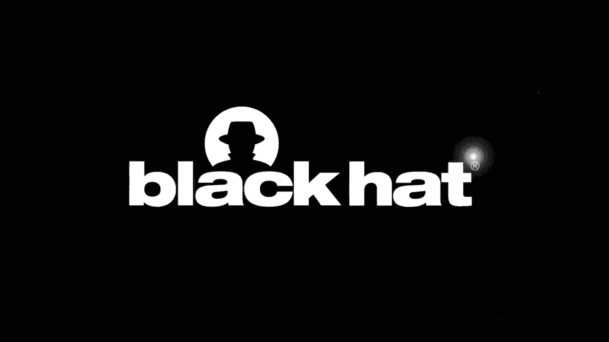
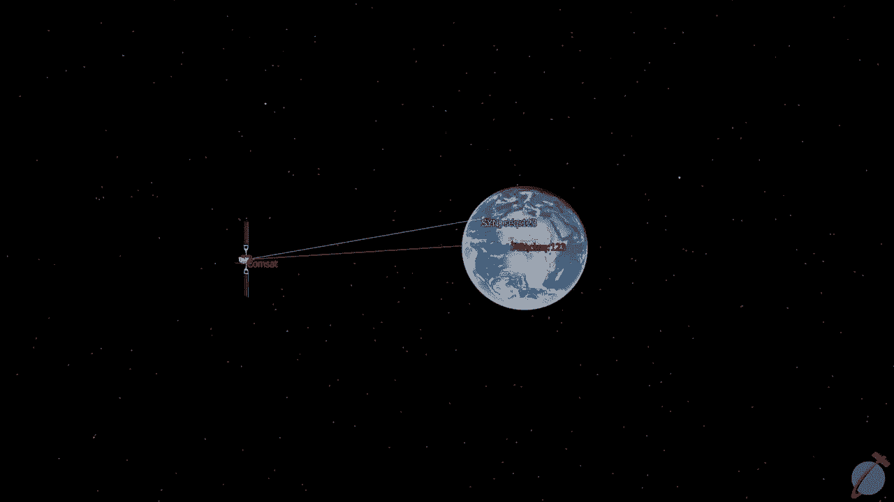

# P81：82 - Whispers Among the Stars - A Practical Look at Perpetrating Satellite Eaves - 坤坤武特 - BV1g5411K7fe

 It's August 2018。

 A sysadman logs into the control panel of a wind turbine in southern France to update， its firmware。

 More than 600 km away， his PHP session token appears on my screen。 Eight months later。

 an Egyptian oil tanker pulls into the port of Stax， Tunisia with。

 a malfunctioning alternator on board。 For my vantage point， more than 1，500 km away。

 I learned that the ship will be out of commission， for at least a month。

 and I learned the name and passport number of the engineer who's， flying in to fix it。

 This this summer， 13，000 meters above the Atlantic Ocean， the accountant of a Polish。

 real estate group puts the finishing touches on their annual financial report。

 The word document she prepares reaches my computer at the same time it arrives in the。

 inbox of her colleagues at one of Europe's largest commercial real estate groups。

 How does this kind of thing happen， and what can we do to protect this information in the， future？

 I'm James Pivour， I'm a PhD student at Oxford University， where I research satellite cyber。

 security。 And today， I want to talk about the results of more than two years of experiments looking。

 at the real world use of satellite broadband。 I do this work with a bunch of talented people from both the UK and Switzerland。

 and I'm， honored to share what we found。 So this started out as a fairly small project。

 We wanted to replicate some really cool findings from the mid to late 2000s。

 These researchers discovered that there were these television satellites that were being。

 used for internet signals， and that if you had the right equipment， you could receive。

 deeply sensitive information that was being transmitted unencrypted across these feeds。

 Now a lot has changed both about the way we use the internet and the way we use satellites。

 since 2005。 And so what I wanted to do is update this research and take a broader systemic look at。

 it。 So we ended up conducting a series of case studies looking at different domains， specifically。

 people on land， at air， and in the sea。 In total， we analyzed signals from 18 satellites in geostationary orbit with a combined coverage。

 area that exceeded 100 million square kilometers。 To put that into perspective。

 it means we were able to intercept signals from parts of， the United States， the Caribbean， China。

 and India， a massive potential attack area。 And we found across all 18 of these satellites that sensitive information was still being leaked。

 in clear text。 Both in those older protocols that have had vulnerabilities that have been known since。

 the 2000s， as well as newer protocols that have come to replace them。

 And this wasn't just some boring data。 These were interesting companies and interesting individuals。

 We saw sensitive traffic from at least nine members of the Fortune Global 500。

 Traffic from passengers flying on six of the 10 largest airlines in the world by passenger， count。

 Sensitive data from maritime companies， who together account from more than 40% of the。

 world's cargo shipping capacity by volume。 We even traffic from government agencies。

 like the postal service of an Eastern European， country or an Air Force jet belonging to a North African nation。

 We even saw traffic from people like you， people who might be browsing Wi-Fi in a remote。

 coffee shop or updating their Instagram while on a cruise。

 Before I delve into the contents of this traffic and kind of how we got at it though。

 it's important to have a basic understanding of what satellite communications look like。

 So we're going to run through a very simple scenario。

 We have a satellite here in geostationary orbit。 That means it's 30。

000 kilometers away from the Earth's surface and always looks like， it's in the same spot in the sky。

 We have a customer here in the middle of the Atlantic Ocean on a cargo ship and they。

 want to visit a website hosted in Ireland。 We'll say Google。com。 To do this。

 they'll use a V-SAP terminal on their boat which is provided by a satellite。

 internet service provider who operates at Ground Station here in Madrid。

 We'll also imagine an attacker way down here in Accra who wants to intercept his communications。

 despite being very far away。 So how does this all play out？ First。

 the customer in the cargo vessel points their satellite dish at a spot in the sky and。

 says get me Google。com。 The satellite doesn't do much。

 It's essentially a dumb bent pipe and just beams that signal right back down to the Ground。

 Station in Madrid。 You'll notice this beam is very narrow and focused。

 meaning our attacker in Accra can't， intercept this communication。 It passes right over their head。

 Once a signal reaches the internet service provider in Madrid， they convert whatever weird。

 satellite protocols are being used to normal IP traffic and routed across a terrestrial。

 internet just like you would if you were visiting a website at home。

 The ISP gets a response from Google， bundles it back up into satellite protocols and beams。

 it into space。 It's worth noting that when I say beams into space， this is not a quick process。

 Geostation in your orbit is far away and the speed of light is only so fast。

 So we're talking about 700 milliseconds of latency for this kind of communication。

 Once we finally make it to orbit， the last step is to beam the signal back down to Earth。

 But with a critical difference， this time we're going to send them in a really wide beam。

 because we want to cover as many customers as possible and satellites are very expensive。

 So what you see here is that the radio waves carrying that response from Google hit our。

 attacker's dish in Ghana at the same time as they reach our customer in the middle of。

 the Atlantic Ocean。 This is the crux of satellite eavesdropping。

 An attacker can reliably expect to intercept one direction of the communications from a。

 vast distance away from their target。 If we compare this to a hypothetical vulnerability and say Wi-Fi or GSM。

 where the attacker has， to be in your neighborhood or in your city。

 an attacker listening to satellite communications。

 could be in a different country or a different continent from their victim。

 So how does this actually play out？ What does an attacker need to pull off this attack and listen to these signals？

 Is there a nation-state actor？ There are companies out there that develop these specialized modems for intelligence。

 collection purposes that allow governments to essentially listen to whatever satellite。

 signals they want。 You build a big multi-million dollar ground station like this one and you're off to the。

 races。 Unfortunately， they don't give this kind of equipment to PhD students。

 So we had to come up with a way to try to use consumer equipment， essentially home television。

 equipment， to listen to these signals。 We purchased this simple flat panel satellite dish。

 although honestly any satellite dish， would do something that's already resting on your roof or off of Craigslist or Gumtree。

 for basically free。 And then we used a PCIe satellite tuner card。

 These are widely available for people who want to watch satellite television on their， computer。

 We used a higher-end professional model which tends to cost between $200 and $300 but you。

 could get away with a much cheaper one and a $50 to $80 price range at the cost of not。

 being able to reliably listen to some of the more complicated modulation schemes。

 So once we have this equipment， the next task is to actually listen to a satellite with， it。

 Figuring out where to point our dishes easy， the locations of the satellites are public。

 information， but figuring out what to listen to is a little more complicated。

 So I'll show you what it looks like in the lab。 What we're going to go ahead and do is use this tool called EBS Pro which is designed。

 to help people find satellite television channels to listen to。

 And we're going to use it to try to hunt for some internet feeds。

 We're going to point our satellite dish at a spot in the sky that we know has a satellite。

 and we're going to scan the KU band of the radio spectrum to try to find signals against。

 the background noise。 This particular satellite is at an unfortunate angle and it has very low signal quality but。

 hopefully we'll find a couple of channels that we can delve into a little bit deeper。

 The way we'll identify channels is by looking for distinct humps in the radio spectrum like， these。

 As they stick out against the background noise， we can guess that there's something going， on there。

 We'll tell our card to tune to this one and treat it as a digital video broadcasting for。

 satellite feed。 After a few seconds we get a lock on that feed meaning we successfully found and connected。

 with the satellite。 What we're going to go ahead and do is connect to this slightly weaker one because I know。

 it has something interesting in it for the demo。 You'll see the signal to noise ratio here is atrocious。

 We're likely going to lose a lot of data but hopefully we'll find something interesting， anyway。

 I'm going to next jot down some basic information about this feed， the frequency， the polarization。

 and the symbol rate。 That's because this tool will only take us so far。

 It's designed for television and what we really want is raw data out of that digital。

 video broadcasting feed。 To do that we're going to use a tool that's provided with the PCI-E card by the device。

 manufacturer as part of its drivers。 So I'll go ahead and connect to that satellite feed that we discovered and try to make it。

 just a short recording for us to play around with。 I'll save it to the desktop。

 Now the amount of data that's going to go into this file is hugely variable。

 It might be a megabyte of data in a week， it might be a terabyte of data in a week。

 It really depends on the satellite you're listening to and the equipment we're using。

 In this case I'm just going to record a couple of kilobytes and then we're going to see if。

 there's anything in there indicating that it's internet traffic。

 There's no dark magic to this process。 I'm just going to look through that raw binary file for the string HTTP which we'd expect。

 to see in an internet capture but wouldn't expect to see in a television feed。

 And sure enough if we take a look here we see the output of what looks like a soap API。

 At this point we have found a security vulnerability。

 This is internet traffic that wasn't intended for us that we were able to intercept using。

 freely available tools and cheap off the shelf equipment。

 But what we want to do as an attacker is understand a little bit more about the semantics of this。

 connection。 What ports are being used， which IP addresses are working together。

 what do the packets actually， look like？ And to do that we have to look a little deeper into this file。

 So there are two protocols we looked at。 The first I'm going to talk about is MPEG-TS。

 Now you might be saying MPEG isn't that a video streaming format？ And you'd be exactly right。

 MPEG is widely used for streaming satellite television feeds as video as well as many other。

 videos across the web。 And over the years it's had additional features built in。

 Things that allow you to say pause live satellite television。

 And so these interactivity features have been sort of hacked together to enable encapsulation。

 layers for sending internet traffic。 Because MPEG is such a widely used standard。

 there's great tooling already out there for， working with it。 In fact。

 if you get a high enough quality signal recording， you may just be able to open the。

 file directly in Wireshark。 As a result， this is where a lot of prior research has looked。

 The research from the mid to late 2000s that I was talking about was mostly about kind。

 of connecting all the tools in the right way and then using Wireshark or using one of these。

 existing tools to parse the files。 However， MPEG is sort of dying。

 It's still popular for satellite internet， but it's getting replaced by more intuitive。

 protocols like generic streaming encapsulation or GSE。 GSE is much simpler。 It takes an IP payload。

 it wraps it in a generic GSE stream which is a bunch of different fragments。

 and then puts that into that digital video broadcasting feed。

 This is particularly popular we found among enterprise customers who rent an entire satellite。

 transponder for their networks。 These enterprise customers have a lot more money than we do。

 And so they have a lot nicer equipment。 They tended to be using receiver hardware that cost them the tens or even hundreds of。

 thousands of dollars。 And so the signals they were sending had more complicated modulations than our cheap hardware。

 could keep up with and we were often losing huge chunks of these feeds resulting in corrupted。

 files。 To fix this， we wrote a forensic tool called GSE Extract that tries to reconstruct meaningful。

 IP data out of a corrupted GSE recording。 The way it does this is by cheating。

 It makes some general assumptions about where the start of an IP packet would go or where。

 a fragment should belong in a stream that wouldn't work if we were trying to build a。

 robust satellite modem but allow us to figure out what to do with between 50 and 70 percent。

 of the actual packets that we're receiving on our dish which is way better than existing。

 tools that would just kind of throw an error message。

 Hopefully by the time you're watching this presentation， GSE Extract will be on my research。

 group's GitHub。 We're still going through some responsible disclosure work to make that happen so it may。

 be a little bit delayed。 But in the interim， if you're interested in some of the technical details。

 there's a much， more deep technical description of it in the appendix of an academic paper we published。

 a little while back。 Alright， we're in a pretty good spot right now。

 We have the equipment we need to listen to satellites。

 We know that we can parse feeds in the digital video broadcasting for satellite standard。

 And depending on what's inside that， we can use existing tools or a tool we wrote ourself。

 to convert it into a PCAT file。 The next step is really to understand what this means for customers at land。

 at sea， or in the sky。 Across all three of those domains though。

 there's some general things we found。 The first is that these satellite ISPs did not seem to be employing any encryption by。

 default。 That is to say， customers may choose to encrypt their traffic。

 but ISPs were sending traffic， over the satellite feed in the same security characteristics it had when it reached that。

 modem at the customer's home。 This isn't to say that there aren't ISPs out there that offer encrypted satellite internet。

 just that we weren't looking at them。 What this means is that an attacker who's listening to your satellite signal gets to。

 see what your internet service provider would expect to see。 Every packet that comes to your modem。

 every bit torrent you download， every website you。

 visit passes over that link and could be intercepted。

 But it gets even worse if we look at enterprise customers because a lot of them were operating。

 what was essentially a corporate LAN network over these satellite feeds。 For example。

 imagine a cruise line that has a bunch of Windows devices aboard at ships。

 This Windows local area network with all that internal LDAP traffic and FTP traffic will。

 be broadcast over the satellite link， giving an eavesdropper perspective from behind the， firewall。

 a very unique angle for a wireless eavesdropper to get on a corporate IT environment。

 So let's talk about terrestrial customers。 What I was really interested in here is privacy because these are kind of your normal home。

 internet users。 Now you might be saying， "Wait a minute， James， you're just trying to scare me。"。

 Because I know when I open my browser， I see this nifty lock icon which tells me that。

 my traffic is encrypted so an eavesdropper can't see its contents。 I would say to you。

 convenient made up straw man that actually the case is a little bit。

 more complicated than that because our ISP vantage point gives us some unique perspectives。

 on what you're doing。 For example， your DNS queries are likely still sent unencrypted so we can piece together。

 your internet browsing history in which websites you're visiting。

 Even those TLS certificates which are protecting the contents of your traffic are also fingerprinting。

 the servers you're talking to and the services you're connecting to。

 Now this raises some intuitive privacy concerns。 We don't want just anyone knowing your web browsing history but it gets much worse if。

 you ever slip up。 A good example of this is this lawyer in Spain。

 We intercepted this email conversation that he was having with a client about an upcoming。

 court case。 Now obviously this raises serious concerns for attorney client privilege and personal。

 communications privacy but in our threat model it gets even worse because at this point。

 we know every website this lawyer visits。 We have access to the contents of his email inbox and we know his email address。

 So we can say hey this guy goes to paypal。com we can go to paypal click that I forgot my。

 password link， put in the email address that we've hijacked and steal his PayPal account。

 or any other account。 This kind of shows how an eavesdropper who's eavesdropping on all of your connections like。

 an internet service provider can do significantly worse harm to you than someone who's only a。

 man in the middle on a specific connection。 Another thing we were curious about that didn't really exist back in 2005 when this research。

 started was IoT and connected critical infrastructure systems and we found that a lot of these were。

 operating in securely over the satellite link。 A good example is this login page for a Cisco router that was being run by one of Europe's。

 largest electricity providers and what we see here are admin credentials being sent unencrypted。

 Now I've blocked out most of the sensitive data but if you have a keen eye you'll note。

 that the host IP address here is publicly routable meaning anyone with a web browser could use。

 these credentials to login and start screwing around with that electricity providers network。

 configurations。 Another good example is something I mentioned at the start。

 We found that a lot of wind turbines use satellite which makes sense because they're。

 in remote locations that may not have a wired connection。

 These terminals will often also have a connection， a control panel for changing settings of the。

 power station and we found out that the credentials for these were often being sent in clear。

 text over the satellite link and that they were publicly routable meaning that anyone on。

 the internet could combine that and start messing around with electricity infrastructure。

 Now we didn't actually do this so there may be a second layer of protection behind this。

 login page that we didn't account for but it's at least intuitively concerning that these。

 credentials are being broadcast in clear text。 Let's head out to see。

 So the maritime use case is interesting because each boat is kind of an independent entity。

 and has its own operational technology and its own purpose and its own function and so。

 we had these terabytes and terabytes of maritime traffic and we wanted to understand kind of。

 how hard it would be to identify specific ships in that massive amount of data。

 So we picked a hundred random IP addresses and devised a basic fingerprint consisting of。

 DNS queries， TLS certificates and some strings from the first couple of bytes of their traffic。

 to see if we could actually de-anonymize these IP addresses and tie them to specific ships。

 in the ocean。 We're able to do this in a specific case study with about 10% of the vessels we looked at。

 which are listed here。 I've blacked out their names for privacy reasons but you can kind of get a feeling from this。

 table of the scope of potential impact。 So the smallest fleet we looked at was this single vessel fishing fleet that was using。

 some kind of software to tell it where fish was over the satellite feed。

 On the flip side we see this massive container ship， one of the larger ships in the world。

 for one of the larger shipping companies in the world operating in the same IP space as。

 that random fishing vessel。 Beyond just being able to identify ships we were also able to identify operational technology。

 on board them。 A good example of what this means is this sub-sea repair ship operated by a major petroleum company。

 What we saw on board was traffic that indicated the presence of a vulnerable box running Windows。

 Server 2003。 If you were trying to target this oil company you might consider deploying CVEs that targeted。

 the specific software not just on that ship but against their entire fleet which likely。

 has a similar software build out。 One specific piece of operational technology we were curious about is something called。

 an ECTUS terminal or an electronic chart displaying information system。

 ECTUS terminals are essentially like GPS nav systems for boats。

 They tell you where it's safe for your boat to go and where it's legal for it to go and。

 there's been a lot of security research on them which makes sense because if someone。

 messes with your navigational charts and say hides a sandbar and causes your oil tanker。

 to run aground that could be extremely catastrophic。

 What we found is that a lot of customers are still using older formats that don't have。

 the cryptographic protections that have been designed to protect against these attacks。

 or they're using proprietary formats that don't seem to have ever had these protections。

 Now you might be saying wait a minute James you're a passive eavesdropper。

 Certainly you might be able to get yourself a free nautical chart if you wanted but how。

 could you possibly tamper with the contents of this traffic？

 And it turns out it's not as hard as you would think because of the way these charts。

 are often updated。 For example this specific ship got its chart updates via a publicly routable FTP service。

 that was running on board。 We were able to capture the logging credentials over the satellite feed and whenever someone。

 sent a chart update they would log into the FTP service， copy the files over and then。

 this files we deployed to the ECTUS terminal。 Deploying a malicious chart or a piece of target in malware is simply a matter of getting。

 the right username and password and logging in from any computer connected to the internet。

 Likewise a very common mode in the industry for getting chart updates is via email services。

 There's nothing inherently insecure about this。 You get an email it says attached to your latest chart you copied onto a flash drive。

 you plug it into your ECTUS terminal。 But in this case the captain happened to be using an insecure email server running pop。

 with no encryption and so we got essentially a template of the sort of information we need。

 to send to convince him to copy a false chart or a piece of malware onto his ship's critical。

 information systems。 So it's fun to talk about operational technology but there are real people aboard vessels with。

 privacy concerns like billionaires aboard their super yachts。

 Now I know standing up at a security conference and being like think of the billionaires isn't。

 the most popular thing to do but this story is really fun。

 So we were listening to traffic from this Greek billionaires yacht and one day his captain。

 forgot his Microsoft account log in and so the account reset password was sent over clear。

 texts on his satellite feed。 At this point we had a route where we could have potentially hijacked this captain's account。

 and targeted an extremely high net worth individual via targeted social engineering attacks。

 You might also imagine that billionaires have certain things about their web browsing history。

 or patterns that they don't want to be public knowledge and certainly not at the scale of。

 a satellite signal。 Another situation that we ran into that was pretty common is crew members have to share。

 certain data with port authorities about their visa and their passport status。

 This particular port authority had them do that via a public HTTP service meaning that。

 we were able to get for example from this cargo vessel lists of all the crew members。

 their date of birth and their passport numbers shouted in clear text across an entire continent。

 Let's head out to the skies。 I was particularly interested about the aviation case because it's our newest one。

 2020 was going to be the year we collected tons of satellite aviation data and really。

 got a feel for how it's used in the industry。 And then people stopped flying on airplanes。

 The coronavirus pandemic meant that the amount of traffic we were getting in April was a tiny。

 fraction of the amount we were getting in February。

 And I was originally really frustrated about this。

 But then I realized there was a bit of a silver lining here。

 You see back in February the traffic we were getting have a lot of garbage。

 People browsing Facebook on their flight for example which isn't all that interesting。

 But in April when the plane started flying empty the only traffic in these networks was。

 related to like the operation of the airlines or the airplane。

 It was just the most interesting bits。 And even now as traffic picks up the sort of people flying aren't tourists。

 They're people who have important meetings or board business executives that are leaking。

 somewhat interesting data in their own right。 Since we had this unique opportunity to make airplane networks be quiet so we could focus。

 on what mattered。 We wanted to test a theory that comes from a researcher whose work I really admire。

 Ruben Santa Marta does a lot of satellite communications research on terminal hardware。

 So like think satellite modems and stuff。 And he has his blog post from a little while back where he looked at in flight entertainment。

 systems。 Now we knew we were seeing traffic from in flight entertainment systems and said this。

 claim he makes in his article intrigued us。 He posited that the sat comes side of this IFE environment might cross a historic red。

 line that separates the parts of the plane that keep you happy and entertained and the。

 parts of the plane that keep it in the sky and going in the right direction。

 So we wanted to go through our traffic captures and see if there was any data that crossed。

 this red line and prove that systems on both sides shared the same satellite feeds。

 And we would have missed it if it wasn't for the pandemic。

 But we ended up catching on to something that I'll call the loneliest EFE or electronic。

 flights bag。 So an electronic flight bag is a terminal in the cockpit that gives important information。

 in the pilot。 It's a lot like an act is terminal but for airplanes it has navigational information and。

 weather updates and this particular Chinese airline had made a mistake someone fat finger。

 to password and so it wasn't able to log into the wireless network it was trying to connect， to。

 And so every query it said it was getting bounced off of those satellite dishes and back。

 onto our interception feed。 And so we're able to fingerprint the traffic patterns understand what the internal API's。

 were doing and understand what sort of information was being sent across the signal。

 Based off of this we're able to verify that other EFE terminals and other airplanes belonging。

 to this airline were also operating in the satellite space。

 Now what this suggests is that at least in this specific case a piece of flight critical。

 hardware is operating in the same underlying network as the person who's four rows back。

 browsing Instagram。 There might be a firewall in the plane to stop people from messing around but at the satellite。

 level it's one and the same。 Another piece of airplane hardware we're interested in is something called a femtosel。

 These are essentially miniature cell towers that they'll put into airplanes so that you。

 can use your cell phone like you were on the ground you know send and receive text messages。

 and so forth。 And often you might connect to one of these accidentally if you like forgot to put your。

 phone in airplane mode。 And what we found is that the front end of these is still fairly secure it uses GSM or。

 LTE which have some built in security protection so that they may be imperfect but the back。

 end was being sent in clear text over the satellite feed。

 And we're able to intercept text messages that were coming to customers on flights who。

 may have not even known that they were connected to this cell tower。

 A great example of how bad this can get is this intercept here。

 This is from a gentleman who received his negative coronavirus test result while he's， in a flight。

 Now that's a huge relief to anyone sitting next to him on the airplane but for the rest。

 of us who care about information security it's deeply concerning to see sensitive medical。

 data shout across an entire continent in clear text。

 You might also imagine if you use for example SMS as a second factor for authentication how。

 it could be used in a account hijacking attack。 So we talked a lot about kind of passive eavesdropping attacks but one thing that I was。

 curious about is can we do anything active in these networks we don't have any equipment。

 to transmit radio signals we don't have any license to do that but is there another way。

 And we ended up proving is that it's possible to reliably engage in TCP session hijacking。

 attacks in some of these networks。 TCP session hijacking is a fairly simple cyber security attack。

 You intercept TCP sequence numbers which allow you to impersonate the end point of a TCP。

 three way handshake and essentially play as a party to a connection that you're not。

 You were able to actually do this against our own connections to a device inside a real satellite。

 network although we weren't able to test this in every network because it's a little。

 bit more active and we had to do it responsibly。 Depending on the network configuration an attacker can reliably hijack and impersonate。

 people who are on the other side of that satellite hop。

 Here's an example of how that might play out。 So just like before we have someone in Ireland but this time it's a maritime office that。

 wants to check a website that's hosted on the ship in the ocean。

 And so what they'll do is they'll start a TCP through a handshake with a sin message。

 And this sin message has a sequence number attached that they'll beam up in this space。

 And to prove your party to this conversation you have to essentially know this randomly。

 selected number so that you can prove that you got the first part of this handshake。

 The attacker has no trouble knowing this。 It hits their satellite dish just like it hits the cargo vessel。

 But the attacker has a significant advantage because in the next step where they have to。

 prove their knowledge of this information they can go much faster than that signal over the。

 space link。 This is because our attacker is connected to terrestrial internet。

 In this specific case our attacker is actually in a craw in Ghana which has an extremely。

 fast backbone link to the UK and is a short hop from Ireland。

 So 100% of the time they can get their spoofed acknowledgement message to the maritime office。

 while the real message is still in space。 This causes the maritime office to start a conversation with the attacker thinking they're。

 talking to the ship。 That acknowledgement message from the office will be dropped by the ship。

 The ship will think oh this is a glitch， it's malicious and just ignore it。

 But the attacker now has free rein to pretend like they're the vessel and send whatever。

 information they want to the maritime back office。

 This shows how if you think about kind of the physical characteristics of space like。

 the fact that orbit is far away and there's a lot of latency in these networks you can。

 come up with some pretty unique attacks that combine the knowledge you get from space with。

 the access to the internet you have on the ground。

 So obviously this is research in real world networks and so ethics and legality is an important。

 component of doing it responsibly。 We were very careful to adhere to all of our legal obligations and go beyond that。

 In particular you may notice that I haven't named and shamed any companies today and that's。

 a very conscious choice。 We don't want this to be a report about X-Cruise line is leaking your personal information。

 We want to talk about a systemic issue that affects almost every customer of satellite。

 geostationary broadband。 We of course responsibly disclose these vulnerabilities reaching out to some companies as much as a。

 year ago as well as some of the customers who are most affected by these breaches。

 And generally people were pretty receptive。 We were able to talk to some CISOs about the vulnerabilities and they're at least aware。

 of the risks although it's unclear what they've decided to change。

 And we only had one company threatened to sue us which is pretty good for this kind of。

 wide reaching systemic research。 We've also kind of explained to them why it's in the public interest and we think they're。

 on our side now。 We got a huge boost to our disclosure effort actually thanks to the Federal Bureau of Investigation。

 who released this threat intelligence notification。

 The interesting thing about this notification which they sent to the maritime industry to。

 describe our research was that it came up almost a month before our paper was publicly。

 available online and yet it cited specific details from one chart in this PDF document。

 Now the only people with access to this document were our academic peer reviewers and a handful。

 of organizations we had responsibly disclosed to。 So as a researcher it's a little concerning how the FBI managed to get their hands on this。

 data。 But if you're ever curious about whether or not these threat intelligence networks can。

 provide something of value it's pretty clear that at least in this case the FBI is able。

 to get a good scoop。 So let's talk about mitigations and how we can defend against these sorts of attacks。

 It's really tempting to say the satellite operators are just lazy and incompetent。

 They should just encrypt it and it'll all be better。 The reality is much more complicated。

 Remember how I was talking about how space is far away and the speed of light is only。

 so fast and that TCP through a handshake we were targeting？

 It turns out TCP is really slow over those satellite feeds because of all the hops you。

 have to make in the sky。 And so as a result satellite internet service providers have built a tool called a performance。

 enhancing proxy which is essentially a benevolent man in the middle attacker。

 It intercepts and kind of modifies your TCP sessions on both sides of the satellite link。

 to make it feel fast。 Unfortunately if you use standard end to end encryption like just installing a VPN this。

 will stop the ISP from being able to engage in that benevolent man in the middle attack。

 and it will slow your satellite speeds to a crawl。

 Now in reality maybe you should just accept this right there's some data that's so sensitive。

 that it should either be sent encrypted or not sent at all。

 That said for a lot of people it's not a performance trade off。

 For example with those pop emails when you're intercepting if you use a TLS encrypted email。

 client instead you wouldn't see a performance difference but your data would be protected。

 And finally internet service providers can make tiny tweaks to their peps that improve。

 security against those TCP sequence hijacking attacks by messing with the sequence numbers。

 in those packets while they're messing with other things。

 Now we think some ISPs already do this probably accidentally but it definitely stops that。

 specific attack。 In the longer run though this isn't quite as good as we'd like。

 We want it to be intuitive and effortless to encrypt your traffic。

 So we're building a tool that we call QPEP。 It's a combination of kind of a performance enhancing proxy and a traditional kind of。

 tunneling VPN and it uses the quick protocol which is a UDP based alternative to TCP that。

 is encrypted by default。 And the basic idea here is that individual customers can protect their data over the satellite。

 link without sacrificing the performance of their connections。 The idea of QPEP is simple。

 We wanted to build an open source tool this isn't a commercial product we're not trying。

 to sell anything instead we want to build a tool so that people in the security community。

 have a playground where they can start to mess with these sorts of problems。

 We include a bunch of like Python libraries that you can have a simulated test bed without。

 having any satellite equipment in your house just the ability to like run a Docker container。

 and all the code is written in Python and go to make it accessible and easy to hack on。

 The end goal is really about empowering individuals to encrypt their satellite traffic and make。

 conscious choices about how their data is being sent。

 If we look at just kind of the difference of using a bespoke tool like QPEP on the right。

 versus a very good but traditional VPN that doesn't think about satellites like open。

 VPN on the left you can see why a customer would care and you can also see why someone。

 would be tempted to leave their protocols unencrypted because the performance difference。

 is so enormous。 I think recognizing that when performance and privacy trade off there are many people。

 who will choose performance is an important step in to figuring out how the security。

 community can provide solutions to the sat comes world and to other communications environments。

 like it。 So to sum things up the basic idea of this talk is that satellite traffic today can be。

 intercepted by someone who's really far away。 When we talk about these geo networks an attacker can be in a different country or a different。

 continent and still be listening to communications yet customers of satellite internet are not。

 acting that way from the biggest companies in the world to individuals in a coffee shop。

 people are leaking deeply sensitive information over satellite feeds。

 We think that this is solvable we understand how these problems arose from performance considerations。

 and we think if we attack that underlying premise that performance and security have。

 to trade off in geostationary sat comes we can provide a solution as a security community。

 that fixes this traffic and it's easily adoptable。

 So to sum things up I think the core message of this talk is very simple and that is that。

 the next top is unknown the internet is a weird web of devices and systems that are。

 connected in ways that you can never predict you might connect to a secure Wi-Fi hotspot。

 or a cell tower but the next hop could be a satellite link or a wiretapped ethernet cable。

 Having the right the ability and the knowledge to encrypt your own data and choose to do。

 that is critical to protecting against this class of attack whatever domain you think， about it in。

 Thank you so much for listening to my presentation I'm happy to answer any questions。 Oh cool。

 So yeah I guess one question that came up that I thought was pretty interesting is a。

 couple of people were kind of asking about the underlying equipment that we used and I。

 would say that we chose to use kind of commercial general purpose satellite equipment instead。

 of software defined radios and stuff because the stuff the underlying protocols that are。

 used are the same ones that you would expect to see on a television feed and so by kind。

 of using the underlying tools that these fees are designed for we're able to kind of get。

 to the interesting bits a little bit faster which was really useful。

 Another interesting question that I encountered here came from let me see。

 So there were a couple of people talking Andrew here in particular talking about kind。

 of the latency in these TCP networks and how easy it is to do session hijacking attacks。

 and because geostationary orbit is so far away we're talking about 30，000 kilometers。

 up into the sky you get quite a lot of time your terrestrial connection might have like。

 70 milliseconds of latency where satellite connection would have around 500 milliseconds。

 of latency to actually get that packet up in this space and back and get a response back。

 to you meaning that attacker can reliably win kind of these internet wide race condition， scenarios。

 Another question that I had was kind of around whether or not it's possible to intercept。

 like military satellites and stuff and we encountered like a little bit of government traffic。

 specifically there was a North African nation with an Air Force jet that we saw the traffic。

 from but generally there are like premium services that are offered by some satellite。

 ISPs that kind of employee encryption protocols or military providers will have their own sort。

 of black box encryption products that prevent these attacks。

 So it's more the commercial side that we saw but that doesn't necessarily mean that the。

 tools the military using are fully secure just that we haven't really analyzed the security。

 of them。 I guess if I were to answer one last question real quick there's been some discussion about。

 whether or not it's like patchable at the protocol layer if this is something that V。

 SAP providers could do in the same way that like cell tower providers do and I think this。

 is definitely an option but because of the way commercial incentives work a lot of satellite。

 ISPs don't really feel the need to encrypt kind of their whole network especially that。

 has even a small performance impact。 They'd rather say you know customers know their own risk so they should encrypt their。

 data。 I just think that in reality customers pretty clearly don't seem to know their own risk。

 So I'm going to quickly check if there are any other questions。

 Oh yeah so GSE Extract is not on my GitHub right now。

 Unfortunately we're still kind of going through a process to be sure we don't release an attack。

 tool into the wild before there are kind of mitigations in place to stop people from。

 causing harm with it but I'm really hopeful it comes out soon。

 And there were some questions about the frequency band。

 I think that KU band is not the only environment where this would apply。

 I'd expect it to work in KA band and CBN communications from geo but we haven't looked。

 at those because we just didn't have the equipment on hand to do it。

 It could be pretty interesting to play around with that。

 And in terms of lower orbit I think that it's way easier for customers to use a VPN in Leo。

 So my hope is that these attacks would be much harder to pull off。

 It's also more complicated on the attacker side because you need a little bit more sophisticated。

 work with equipment especially if you don't have the parts that are actually provided to。

 you from the service provider。 So awesome。 Thank you all so much for listening to this briefing。

 I really enjoyed doing this research and seeing all your questions in the chat。

 If you have any other questions that I missed you can always email me。

 My email is at the end of the slide deck there at james。provore@cs。ox。act@uk or I'm on Twitter。

 at James before and I'd be happy to answer any questions。 Thank you so much。 [BIRDS CHIRPING]。

