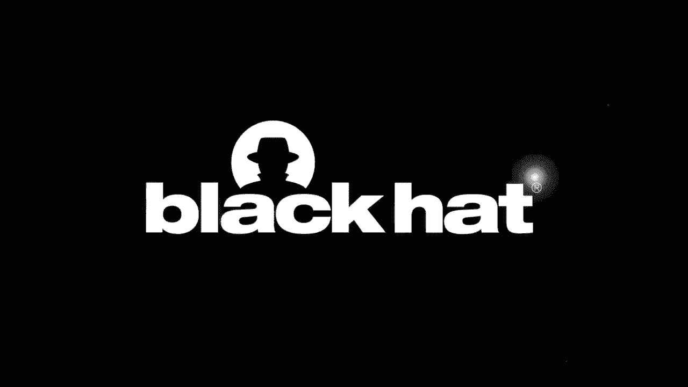
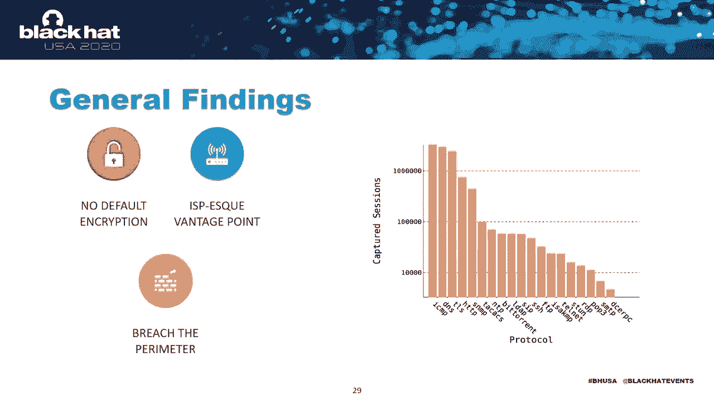
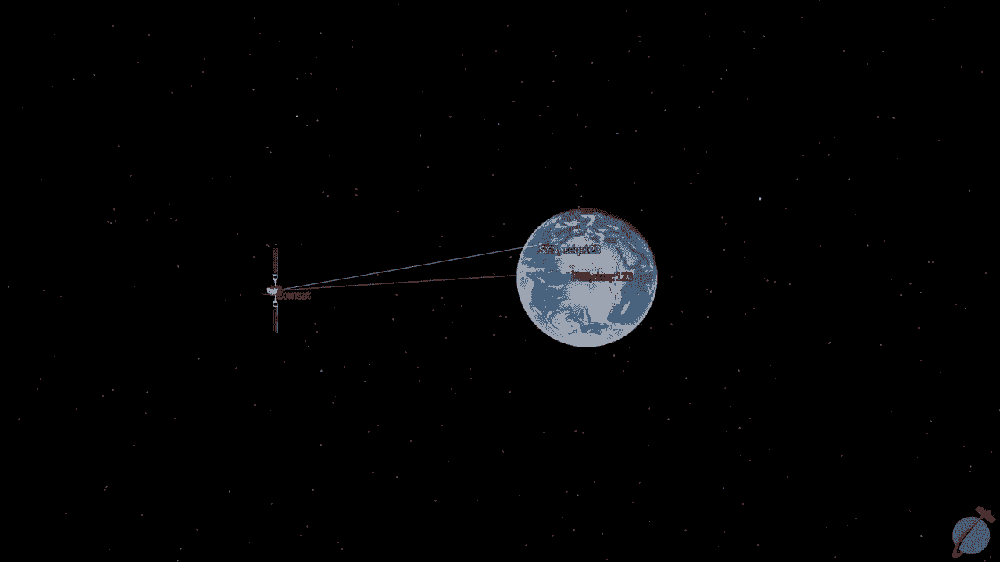

# 课程 P81：82 - 星间低语：卫星窃听的实践观察 🛰️🔍



在本节课中，我们将学习卫星通信安全。我们将探讨攻击者如何利用廉价的消费级设备，从数千公里外拦截通过卫星传输的敏感信息，并了解其背后的原理、影响及防御措施。

---

## 概述：卫星通信如何工作？

在深入了解攻击细节之前，我们需要理解卫星通信的基本模型。这有助于我们看清安全漏洞所在。

想象一个典型的场景：一艘位于大西洋中部的货船上的客户，想要访问位于爱尔兰的网站（例如 Google.com）。

以下是通信流程：

1.  客户通过船上的 **VSAT终端** 发出请求。
2.  信号被发送到地球静止轨道上的一颗卫星（距离地表约36，000公里）。
3.  卫星充当“弯管”，将信号转发给位于马德里的地面站。
4.  地面站的互联网服务提供商将卫星协议转换为普通IP流量，通过地面互联网路由到目标网站。
5.  返回的响应被打包回卫星协议，并**以宽波束形式**发送回地球，以覆盖广大区域内的所有客户。

**关键的安全问题**在于最后一步：返回的响应信号以宽波束广播。这意味着，携带Google响应的无线电波在到达大西洋中部客户的同时，也会到达加纳的攻击者的天线。

**公式化描述攻击窗口**：
`攻击者位置 ∈ 卫星下行波束覆盖区域` → `攻击者可拦截通信`

这与Wi-Fi或GSM攻击不同，后者的攻击者需要靠近目标。而卫星窃听者可以与受害者身处不同的国家甚至大洲。

---

## 攻击者需要什么装备？🛠️

上一节我们介绍了卫星通信的基本原理和漏洞窗口，本节中我们来看看发动此类攻击实际需要哪些条件。

你可能会认为这需要国家级的资源或昂贵的专业设备。然而，研究发现，使用消费级设备就足够了。

以下是构建一个简易卫星监听站所需的装备清单：

*   **卫星天线**：一个普通的平板卫星天线即可。甚至可以从二手市场免费或低价获得。
*   **卫星调谐卡**：一块PCIe卫星电视调谐卡，用于在电脑上接收卫星信号。专业型号约200-300美元，更便宜的型号（50-80美元）也可用，但可能无法可靠接收更复杂的调制信号。
*   **软件工具**：
    *   **EBS Pro**：用于扫描和发现卫星信号。
    *   **厂商驱动工具**：用于从数字视频广播流中录制原始数据。
    *   **分析工具**：如Wireshark或自定义解析工具（如GSE Extract），用于从原始数据中提取网络流量。

**核心步骤代码化描述**：
```python
# 概念性伪代码
1. dish.point_to(satellite_coordinates)  # 将天线对准公开的卫星位置
2. spectrum = tuner.scan_ku_band()       # 扫描KU波段频谱
3. for peak in spectrum.find_peaks():    # 寻找频谱中的峰值（信号）
4.     if feed.contains_internet_traffic(): # 判断是否为网络流量
5.         raw_data = record_feed()      # 录制原始数据流
6.         packets = parse_with_gse_extract(raw_data) # 解析为网络数据包
```

整个过程无需“黑魔法”。攻击者只需扫描公开的卫星，寻找非电视信号的“峰值”，录制数据流，然后在原始二进制数据中搜索如“HTTP”这样的字符串，即可发现未加密的网络流量。

---

## 我们发现了什么？敏感数据大泄露 📡📂

掌握了监听方法后，我们进行了一系列案例研究，分析了来自18颗地球静止轨道卫星的信号，覆盖面积超过1亿平方公里。我们在所有卫星上都发现了以明文形式泄露的敏感信息。

这些数据并非无关紧要，而是来自各行各业的重要实体：

*   **《财富》全球500强企业**：至少9家成员公司的敏感流量。
*   **全球十大航空公司**：其中6家的乘客流量。
*   **海事公司**：占全球货船运力超40%的公司。
*   **政府机构**：如某个东欧国家的邮政服务，或某个北非国家的空军喷气式飞机。
*   **普通个人**：在偏远咖啡馆浏览Wi-Fi或在游轮上更新Instagram的用户。

问题根源在于，许多卫星ISP默认不加密流量。客户可以选择加密，但ISP会以流量到达客户调制解调器时的安全状态原样通过卫星发送。这意味着，攻击者能看到ISP预期看到的一切。

对于企业客户，情况更糟。许多企业通过卫星链路运行公司局域网（LAN）。例如，游轮上的Windows局域网，其内部的LDAP、FTP等流量都会通过卫星广播，使窃听者获得一个独特的、位于防火墙后的视角来观察企业IT环境。

---

## 陆地用户：隐私的脆弱边界 🏠🔓

我们首先关注陆地用户，因为他们是普通的家庭互联网用户。你可能会想：“当我打开浏览器时，会看到锁形图标，说明我的流量是加密的，窃听者看不到内容。”

然而，从ISP的视角看，情况更复杂。即使内容加密，元数据也会泄露大量信息：

*   **DNS查询**：很可能仍以明文发送，可以拼凑出用户的浏览历史。
*   **TLS证书**：虽然保护了内容，但其本身会“指纹识别”用户正在连接的服务器和服务。

这引发了直观的隐私担忧。更糟糕的是，一旦用户失误，后果严重。

**案例：西班牙律师**
我们拦截了一名律师与客户关于即将开庭的案件的电子邮件通信。这不仅严重违反了律师-客户保密特权和个人通信隐私，在我们的威胁模型中更糟的是：此时我们知道了该律师访问的每个网站、其邮箱内容以及邮箱地址。利用这些信息，我们可以尝试重置其PayPal或其他账户密码，实施账户劫持。

这表明，一个能窃听你所有连接（如ISP）的攻击者，比仅针对特定连接的中间人攻击者能造成更大的伤害。

---



## 物联网与关键基础设施：暴露的控制权 ⚡🏭

我们好奇的另一个领域是物联网和关键基础设施系统。我们发现许多此类系统通过卫星链路不安全地运行。

**案例1：欧洲大型电力提供商的路由器**
我们发现了其Cisco路由器的登录页面，管理员凭证以明文发送。登录页面的主机IP地址是公开可路由的，这意味着任何拥有网页浏览器的人都可以使用这些凭证登录并篡改该电力提供商的网络配置。

**案例2：风力涡轮机**
许多风力涡轮机使用卫星通信（因为它们位于可能没有有线连接的偏远地区）。这些终端通常也有一个用于更改电站设置的控制面板。我们发现，这些控制面板的登录凭证经常以明文通过卫星链路发送，并且其IP地址也是公开可路由的。

我们并未实际进行登录尝试，因此可能存在第二层保护。但登录凭证以明文广播这一事实，本身就令人担忧。

---

## 海上目标：追踪与识别船只 🚢🌊

海上用例很有趣，因为每艘船都是一个独立的实体，拥有自己的运营技术。我们拥有数TB的海事流量数据，并想了解从这海量数据中识别特定船只的难度。

我们随机选取了100个IP地址，设计了一个包含DNS查询、TLS证书和流量前几个字节中字符串的基本指纹，试图将这些IP地址去匿名化，并与海洋中的特定船只关联。

我们能在约10%的案例中成功做到这一点。从表格中（船名已隐去）可以感受到潜在影响的范围：从使用软件通过卫星信号寻找鱼群的单船渔船队，到世界上最大航运公司之一的巨型集装箱船。

除了识别船只，我们还能识别船上的运营技术。

**案例：海底维修船**
我们发现船上存在运行Windows Server 2003的易受攻击设备。如果攻击者想针对这家石油公司，可能会考虑部署针对该特定软件的漏洞利用，不仅针对这艘船，还可能针对其整个可能使用类似软件构建的船队。

---

## 电子海图显示与信息系统：导航风险 🗺️⚠️

我们特别关注一种称为**ECDIS终端**的运营技术。ECDIS本质上是船舶的GPS导航系统，告诉船员哪里可以安全、合法地航行。已有大量关于其安全性的研究，这很合理，因为如果有人篡改导航海图（例如隐藏沙洲），导致油轮搁浅，后果可能是灾难性的。

我们发现，许多客户仍在使用不具备密码学保护的老旧格式，或使用似乎从未有过这些保护的专有格式。

你可能会问：“你只是一个被动的窃听者。也许你能免费获得海图，但如何篡改流量内容呢？”

事实证明，由于海图更新的方式，这并不像想象中那么难。

**更新方式1：公开可路由的FTP服务**
某艘船通过船上运行的公开可路由FTP服务获取海图更新。我们通过卫星信号捕获了登录凭证。部署恶意海图或目标恶意软件，只需获得正确的用户名和密码，然后从任何联网计算机登录即可。

**更新方式2：电子邮件服务**
行业中海图更新的一种非常常见的方式是通过电子邮件。这本身并无不安全之处：你收到一封带有最新海图附件的邮件，将其复制到U盘，然后插入ECDIS终端。但在本例中，船长恰好在使用未加密的POP3邮件服务器。因此，我们获得了所需信息的模板，可以用于说服他将虚假海图或恶意软件复制到船舶的关键信息系统上。

---

## 空中目标：飞机上的数据泄露 ✈️📱

航空案例尤其令人感兴趣。2020年本应是收集大量卫星航空数据的一年，但新冠疫情导致航班锐减。这起初令人沮丧，但后来我们发现了一个好处：航班空载时，网络中的流量只与航空公司或飞机的运营相关，正是最有趣的部分。

我们想验证研究员Ruben Santamarta的一个理论：他推测，机上娱乐系统的卫星通信端，可能跨越了将让你快乐娱乐的部分与让飞机保持飞行方向的部分分隔开的历史红线。

我们梳理流量捕获数据，寻找是否有任何数据跨越这条红线，以证明两边的系统共享同一个卫星馈源。多亏了疫情，我们最终捕捉到了一些东西——我称之为“最孤独的EFB”。

**案例：电子飞行包**
EFB是驾驶舱内为飞行员提供重要信息的终端。这家中国航空公司的某个EFB因密码输入错误，无法登录其试图连接的无线网络。因此，它的每次查询都被弹到卫星天线，并进入我们的拦截馈源。我们得以分析其流量模式，了解内部API的行为以及通过信号发送的信息类型。基于此，我们验证了该航空公司其他飞机上的EFB终端也在同一卫星空间运行。

这表明，至少在这个特定案例中，一个飞行关键硬件与后排正在浏览Instagram的乘客运行在同一个底层网络中。飞机内部可能有防火墙，但在卫星层面，它们是同一个网络。

---

## 主动攻击：TCP会话劫持 ⚔️🔄

我们讨论了很多被动窃听攻击，但我好奇的是：我们能否在这些网络中进行一些主动攻击？我们没有发射无线电信号的设备，也没有相关许可，但有没有其他方法？

我们最终证明，在某些网络中，可以可靠地进行**TCP会话劫持攻击**。

TCP会话劫持是一种相对简单的网络安全攻击。攻击者拦截TCP序列号，从而能够冒充TCP三次握手的端点，本质上扮演非连接方的角色。

由于卫星链路的高延迟（约500毫秒），而攻击者通过地面互联网连接速度极快，攻击者可以赢得这场“竞赛”。攻击者可以抢先向通信一方发送伪造的确认包，使其误以为正在与攻击者对话，从而劫持会话。

**攻击示意图核心**：
```
1. 合法用户A发送SYN包（含序列号X）给用户B，通过卫星链路。
2. 攻击者C同时收到SYN包（因为宽波束）。
3. C利用地面网络低延迟，抢先向A发送伪造的SYN-ACK包（使用序列号X+1）。
4. A收到C的伪造包，认为与B的连接已建立，开始与C通信。
5. B的合法响应稍后到达A，但会被A忽略（因序列号不匹配）。
```
这展示了如何结合从太空获得的知识和在地面拥有的互联网接入，利用太空网络的物理特性（距离远、延迟高）设计出独特的攻击。



---

## 道德、法律与披露 ⚖️🤝

显然，这是在真实世界网络中进行的研究，因此道德和合法性是负责任地进行研究的重要组成部分。我们非常谨慎地遵守了所有法律义务，并超越了这些义务。

我们选择不点名羞辱任何公司，因为我们希望讨论的是一个影响几乎每个地球静止宽带卫星客户的系统性问题，而非针对特定公司的报告。

我们当然也进行了负责任的漏洞披露，联系了一些公司以及受这些漏洞影响最严重的客户，最早的联系可追溯到一年前。大多数人的反应是积极的。我们能够与一些CISO讨论漏洞，他们至少意识到了风险。只有一家公司威胁要起诉我们，对于这种广泛系统性的研究来说，这已经算不错了。

有趣的是，美国联邦调查局在我们的论文公开发布前近一个月，就向海事行业发布了一份威胁情报通知，描述我们的研究并引用了我们PDF文档中特定图表的细节。这让人有些担忧FBI是如何获得这些数据的，但也表明这些威胁情报网络确实能提供有价值的信息。

---

## 如何防御？缓解措施与解决方案 🛡️🔐

现在，让我们来谈谈如何防御这类攻击。很容易简单地说卫星运营商懒惰无能，他们应该加密一切。但现实要复杂得多。

还记得我们谈到太空距离遥远、光速有限，以及我们针对的TCP握手吗？由于卫星链路中的多次跳跃，TCP在这些馈源上确实很慢。因此，卫星ISP构建了一种称为**性能增强代理**的工具，本质上是一个“善意的中间人”。它在卫星链路的两端拦截并修改TCP会话，使其感觉更快。

不幸的是，如果你使用标准的端到端加密（如安装VPN），这将阻止ISP进行那种善意的中间人攻击，从而将你的卫星速度拖慢至爬行。

现实中，也许你应该接受这一点：有些数据非常敏感，要么加密发送，要么根本不发送。然而，对许多人来说，这不是一个性能权衡问题。例如，对于那些被拦截的POP3邮件，如果你使用TLS加密的邮件客户端，就不会看到性能差异，但你的数据会受到保护。

最后，互联网服务提供商可以对其PEP进行微小的调整，通过篡改数据包中的序列号（同时也在处理其他事情时）来提高针对TCP序列号劫持攻击的安全性。我们认为一些ISP可能已经无意中这样做了，但这绝对能阻止那种特定攻击。

---

## 未来展望：QPEP与加密的未来 🚀🔒

从长远来看，这还不够理想。我们希望加密流量变得直观且不费力。

因此，我们正在构建一个名为**QPEP**的工具。它结合了性能增强代理和传统隧道VPN的理念，使用**QUIC协议**（一种基于UDP、默认加密的TCP替代方案）。基本思想是，单个客户可以在不牺牲连接性能的情况下，保护其卫星链路上的数据。

QPEP的理念很简单：我们想构建一个开源工具（不是商业产品），让安全社区的人们有一个可以开始研究这类问题的平台。我们包含了许多Python库，你可以在没有卫星设备的情况下，仅通过运行Docker容器来模拟测试环境。所有代码都用Python和Go编写，使其易于访问和修改。

最终目标是赋予个人加密其卫星流量的能力，并有意识地选择其数据的发送方式。

如果我们比较使用像QPEP这样的定制工具（右侧）与使用不考虑卫星特性的优秀传统VPN（如OpenVPN，左侧）的区别，你就会明白客户为何在意，以及为何有人会 tempted 让其协议保持未加密状态——因为性能差异非常巨大。

认识到在性能和隐私需要权衡时，许多人会选择性能，这是弄清楚安全社区如何为卫星通信世界及其他类似通信环境提供解决方案的重要一步。

---

## 总结与核心信息 📝✨

本节课中，我们一起学习了卫星通信安全的现状与挑战。

本次演讲的基本观点是：当今的卫星流量可以被远在千里之外的人拦截。在地球静止卫星网络中，攻击者可以在不同的国家或大洲监听通信。然而，卫星互联网的客户，从世界最大的公司到咖啡馆里的个人，都没有以此为前提采取行动，导致敏感信息通过卫星馈源大量泄露。

我们认为这个问题是可以解决的。我们理解这些问题是如何从性能考量中产生的，并且认为，如果我们挑战“在静止卫星通信中性能与安全必须权衡”这一基本前提，作为安全社区，我们可以提供一种易于采用的解决方案来修复这种流量。

总而言之，我认为本次演讲的核心信息非常简单：**下一跳是未知的**。互联网是一个由设备和系统组成的怪异网络，它们以你永远无法预测的方式连接。你可能连接到一个安全的Wi-Fi热点或蜂窝塔，但下一跳可能是卫星链路或被窃听的以太网电缆。**拥有加密自己数据的能力和知识，并选择这样做，对于防御这类攻击至关重要，无论你从哪个领域考虑它。**

---

**演讲者**：James Pavur  
**联系方式**：james.pavur@cs.ox.ac.uk | Twitter：@JamesPavur