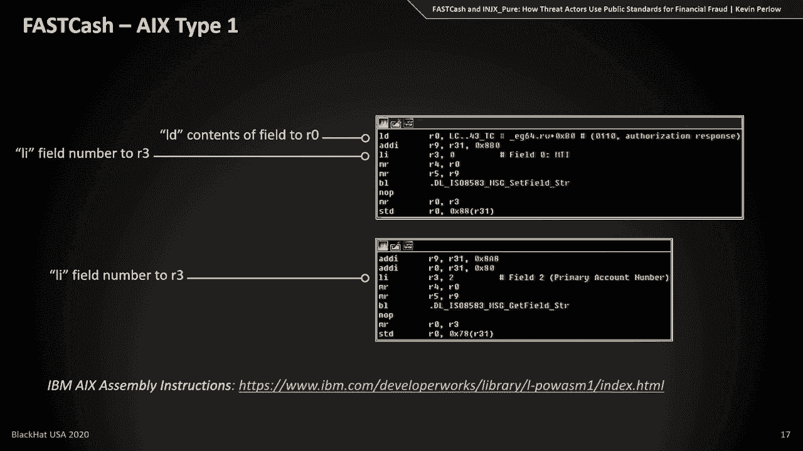
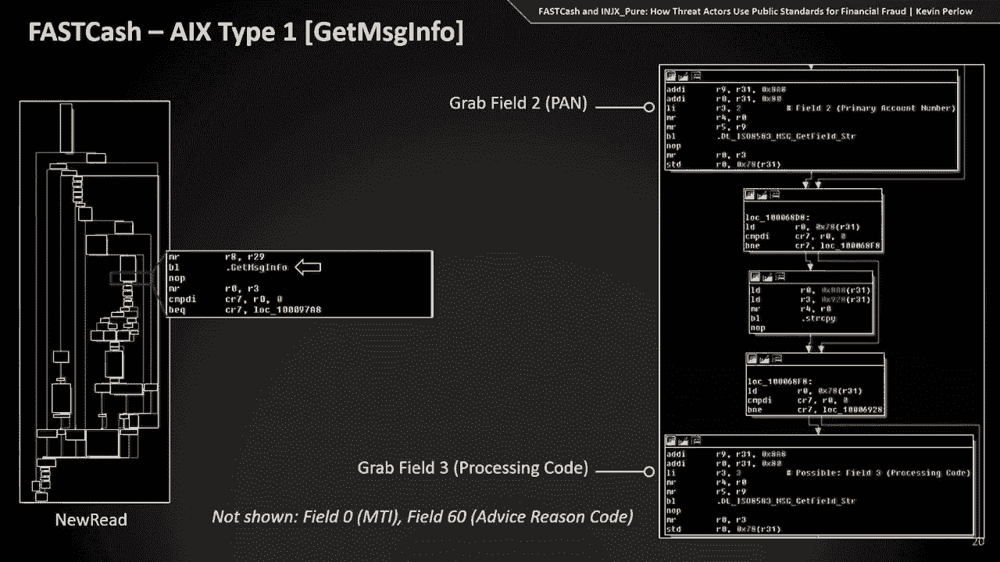
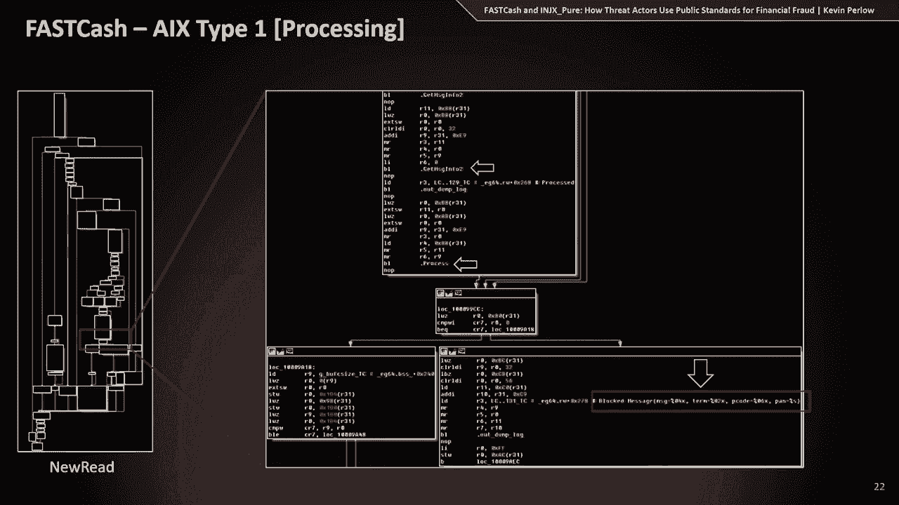
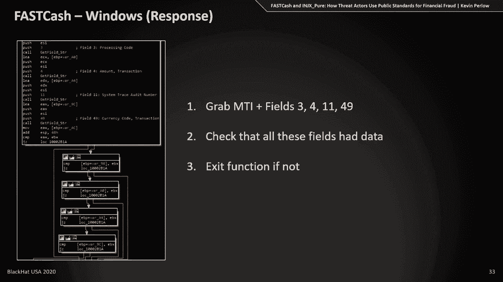
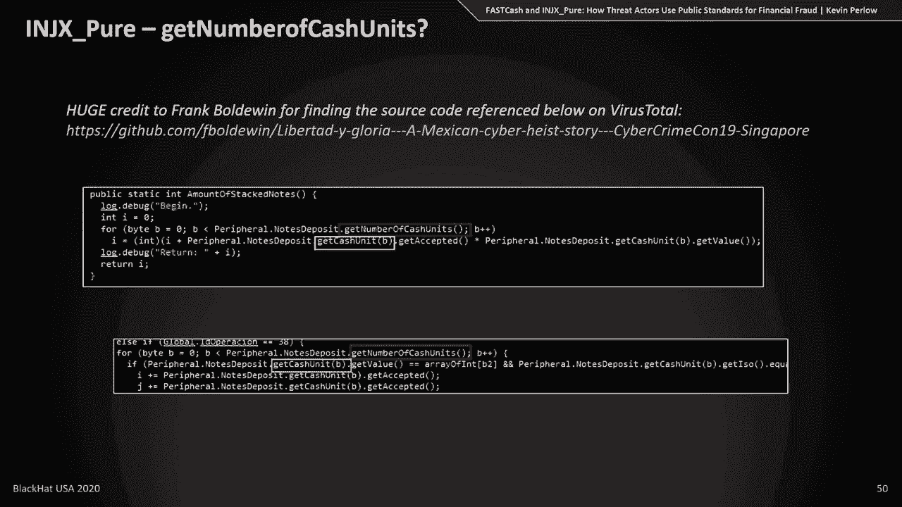
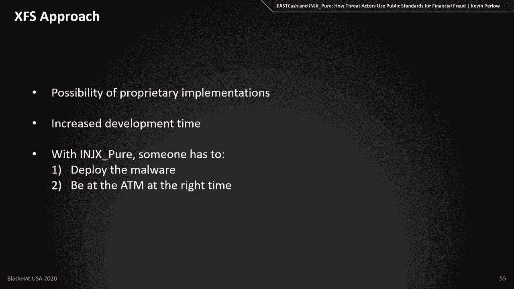

# P82：83 - FASTCash and INJX_Pure - How Threat Actors Use Public Standards for Financi - 坤坤武特 - BV1g5411K7fe

 Hello everyone and hello people of the future。

 My name is Kevin Perlow and I am the Technical Intelligence Team Lead at a financial institution。

 Today， I'm going to be discussing a concept called Financial Payment Standards。

 So I'm going to be discussing two standards here。 The ISO 8583 standard which is for cards and the extensions for financial services standard。

 which is a， you can think of it as an API for interacting with hardware on an ATM。

 I'm going to be discussing how thread actors incorporate these two standards into two pretty。

 specific malware families， fast cash for ISO 8583 and injects pure extensions for financial。

 services。 And in the context of how these malware families work and sort of the inner mechanisms of them。

 I'm also going to be discussing the advantages and drawbacks that come with integrating these。

 payment standards into a malware family。 So jumping right in。

 the first thing I want to discuss is ISO 8583。 Now ISO 8583， as I said。

 is a standard for financial card transactions。 So any time that you go to an ATM or any time you go to a point of sale device at a grocery。

 store to do， say a self checkout， all of those are going to create an ISO 8583 message and。

 an ISO 8583 transaction。 And what this is is a standardized set of fields and a standard structure of fields for。

 transmitting the data from your card and from for your transaction over to a payment switch。

 from that payment switch to a bank and then on back to approve or reject the transaction。

 that's happening。 This is the basis of the fast cash malware。

 which is what we're going to talk about in， just a few minutes。 But first。

 just an example on the screen， this is very literally an ISO 8583 message and。

 this is sort of what all the fuss is about。 So just breaking this down into a couple of different parts。

 There are three parts to one of these messages。 There's a message type identifier。

 which you can think of as sort of a file header or， message header。

 And that has some metadata about what type of message something is。 There is a bitmap。

 which will indicate what fields are present in one of these messages。

 And then there's the data elements， which are those fields。

 And so the purpose behind items two and items three there are that there are over 100 different。

 options， such as the primary account number， the transaction date and time， and all sorts。

 of other data that can happen or that can be tied to one of these transactions。

 And so you don't necessarily want to transmit all of these because most transactions don't。

 use all of these fields。 The bitmap just is there to specify which ones are there for the payment switch to look at。

 I do need to break down the message type identifier just a little bit further。

 There are four parts to this。 So there is a version， which is the first digit。

 There is a message classification， a message function， and then finally the source of the， message。

 Where do the message originate from the bank or the ATM or some other entity？

 So going into the example message that we had on the screen before， if we break this down。

 into a couple of parts， we can see the first four digits， as I mentioned， are the message。

 type identifier。 And so the first digit of those four digits indicates the version。

 And in this case， this is version 1987 of the ISO 8583 standard。

 The second digit here is the classification。 And this is really important for the fast cache malware that we're going to be talking。

 about。 The classification indicates whether or not something is a financial message， which in this。

 case it sets it to so it is， or whether it's a chargeback or an authorization。

 The third digit indicates whether something is a request or whether it's a response coming， back。

 And then finally， as I mentioned， the fourth part is the source of the message。

 So breaking this particular example down， and this is just one that I pulled online。

 and made a couple of changes to。 The first thing we have is the bitmap。

 And this one specifies a couple of fields that are present。

 So we're going to look at the first three of the four that are specified。 Field two。

 which is the primary account number。 Field seven， which is the point of service entry mode。

 And excuse me， field seven， which is the transaction date and time。 And field 22。

 which is the point of service entry mode。 And if you want to decode a bitmap manually。

 that's a bit too time intensive。 But there are some options there on the bottom of the screen for you to take a look at on。

 your own time。 Most people， though， just run these through a decoder and they have it tell them。

 hey， these are the fields that are in a message。 So real quick。

 here you can see data element two or field two。 And this is the primary account number。

 The first two digits in this specify how long the primary account number is。 And in this case。

 the first two digits are 16。 So the next 16 digits are this user's primary account number。

 And this is just， again， one from an example online。 It's， of course， not a real one。

 Here you can see just a timestamp in UTC。 And finally。

 the point of service entry mode for this transaction。

 And this one's pretty important for when we get to the Windows fast cash malware。

 But at this point of service entry mode is set to 011。

 The first two digits in this indicate whether something or indicate how something was entered。

 into the terminal。 So in this case， this is a manual entry， meaning someone typed in the data。

 But if you look at something where the digits are set to nine zero， that would indicate a。

 card swipe。 And so there are a couple other options in that regard。

 The last digit in this or the third digit in the point of service entry mode indicates。

 whether or not a terminal has pin capabilities。 And of course。

 most terminals these days do have pin capabilities。 But this way。

 the device doesn't send a message back saying， hey， can you enter your pin when。

 there's no pin to be entered？ It's sort of a safeguard against that。

 So those are the core principles that we need to know for working with the fast cash malware。

 Now what is the fast cash malware？ If you're unfamiliar with this malware family。

 this belongs to a very specific subset of North， Korean threat actors that also engage in swift heists。

 Sometimes people use fast cash to or they use fast cash as a term for that threat actor。

 I wouldn't necessarily recommend that。 And sometimes people use this term Lazarus group for just broad North Korean activity。

 But this malware is tied to a very specific set of activity from North Korean threat actors。

 There's a very small cluster of tools and techniques that go along with what they do。

 So what this malware does is it is injected into a payment switch and it is intended to。

 either fraudulently approve， ISO 8583 messages from the attackers sitting at ATMs and allow。

 them to withdraw money or if the transaction isn't originating from an attacker， it can。

 transparently pass that transaction to and from the bank and no one would ever know that。

 anything happens。 That's the general idea behind this malware family。

 And we're going to look into the reverse engineering and how this integrates with ISO 8583。

 There are three types that have been at this point all three are actually in public in。

 the public domain。 We're going to look at two of them。

 We're going to look at the first AIS type which was the one that you assert reported back。

 in I believe 2018。 And we're going to look at the Windows type which is one that came out。

 I guess you could， say came out or was used last year。

 Now all three of these are tailored to the environments that they work in。

 And the reason for that is that there are slightly different implementations of ISO 8583 depending。

 on your own architecture and depending on the payment provider that you use。

 So whether you use Visa or MasterCard or Star or something along those lines， there are。

 going to be some different implementations or interpretations of the standard。

 So jumping right into the reverse engineering for AX type one， if you were to open the US。

 cert report and then you were to open the sample yourself in IDA， you're going to see。

 just a few small differences。 One of them is that the strings that I guess you could say should be there。

 won't be there， in your sample。 And so this first slide here is just to kind of give you some tips on how you can go and。

 collect those strings。 You've got to probably write a script for it but I personally I just did it manually。

 You can go into this section of hex， look at the offset that it specifies and what you。

 get is just a pointer to the string that you're supposed to be working with。

 So this one is actually a debugging message and there are a lot of these， there are a。

 lot of debugging and logging messages within this malware to help the threat actors operate。

 because what they're doing is fairly complex。 But we don't need to worry too much about that。

 For the purposes of this talk， I've got all of the strings labeled。

 What is significantly more interesting is the strings and the interaction for how some。

 of the functions that are built into the malware are called。

 So on this slide you can see a couple of different function calls and these are pre-named within。

 the malware。 There is get field string and set field string on this slide。

 There are a few others like copy field string。 All of those are related to interacting with an ISO 8583 message。

 And so the important reverse engineering concept that you need when you're looking at one of。

 these is to understand that there is a pattern for how these work。

 So before set field string is called， for example， there is a load into register three， for a digit。

 And that digit is going to be the field that is manipulated。 And above that。

 there is a load into another register for a string and that's actually the。

 data that's going to go into that field。 So as long as you know that pattern。

 you can really do the reverse engineering for all of， this。 And get field string is very similar。

 There's a load for the fields that is going to be retrieved。 But in this case。

 since it's not setting any data， there's no data load。

 Once you have all of those principles in mind， you can go through and map out how this malware。

 works。 And so the way you would read this graph here is from left to right and top to bottom。

 So you can think of this as， again， this malware is injected into the payments budget into。

 software and the payments budget rather。 And a new ISO 8583 message comes in。

 And this will intercept that message and call this function new read。 From there。

 it will call check sock and check sock will call get IP， I need address and。

 it will perform a check for a valid IP to make sure that the message is originating。

 from where it's supposed to be。 And then it will move on sequentially down the line to check for flags and then read receive。

 and so on and so forth。 We're not going to go into every single one of these。

 We're going to go into some of the important ones for this payment standard。 So again。

 the first thing here is a check sock function。 And I have on the left side of the screen the。

 I guess you could call it like the overhead， for the new read function。

 When check sock is called it performs an IP address whitelisting check it wants to make。

 sure that the transaction is coming from a valid internal IP address。

 There's nothing too much to worry about there。 But as we kind of move along and on the left again on the screen you can see how we're。

 progressing sort of through this code。 Once it does the whitelisting check it's going to retrieve a bunch of information from a。

 couple of different fields。 So the fields that it's mainly interested in at first are the message type identifier。

 the primary account number， the processing code and then it also pulls the advice reason， code。

 And it's depending on what data that it sees there it has two options。

 It can either transparently pass this message onto the bank because the primary account。

 number didn't line up with a whitelist that the threat actor set up for example or some。

 of the fields that were supposed to be there weren't there。

 And if any of those things are the case it will send that onto the bank and nothing it。

 will be as though nothing ever happened the bank will send a proper response and that response。

 will go back to the ATM。 On the other hand if it does see data that it's interested in and we'll dive into the。

 mechanics of that a little bit more in the Windows one it can generate one of three types。

 of responses。 So here there are a generate response transaction one and response transaction two。

 And there is also a response inquiry and I'll dive into those in just a second as well。

 But depending on this fraudulent response that it generates and sends back to the ATMs it。

 will assuming all of that works it will log that it's blocked that message and it will。

 send that response back and then the process will repeat。

 So diving into transaction type one and transaction type two is actually very similar to transaction。

 type one。 The malware will intercept the I-suite 5v8a3 message it's going to again pull those fields。

 that I had mentioned but then it's also going to copy it'll dive into this and it'll copy。

 a bunch of data from the original I-suite 5v8a3 message。

 There are some different fields here and I've got a full list on the next slide。

 All of the data that a copy is it's used to construct the message that's going to go。

 back to these ATMs and part of that is because the ATMs probably although we don't know for。

 sure but we can we can make an assessment that the ATMs probably expect to receive data in。

 a certain way。 Again this is all environment specific stuff so we have to make some inference that we。

 have to make a sense about what the threat actor is doing。

 So with that in mind the fields that it's going to copy are the primary account number。

 process and code and so on and so forth。 There's a long list of these things here and then for transaction type two it's the same。

 list but minus a couple of tracks to fields。 Now once it does that it reconstructs the message and sends that back。

 It's going to generate a random transaction amount as part of this process and then the。

 ATM will allow the threat actor to withdraw cash。 So the other type of response that it can make here is the inquiry response。

 So this is a response to a balanced inquiry。 If you walk up to an ATM and you put your card in and you say hey how much money do I。

 have this is actually the type of transaction that would come back。

 Now I think the threat actors probably set something like this up to allow them to test。

 their malware。 I can't really think of any other reason for doing something like this but it would be。

 very obvious to a threat actor if this were working properly with a balanced inquiry and。

 you'll see why in just a second。 So inside of the balanced inquiry it copies fields in a very similar way to that transaction。

 amount but there's also this format string which I have is kind of the multicolored thing。

 on the top right there。 So this format string is very important it's for determining how or it's for the structure。

 of information that's going to go back into field 54 which is the field that handles all。

 of your account balances。 And so breaking this format string down just a little bit we have three or we have two kind。

 of non important items and one very important item。

 So the non important ones here it will say that the amount type is set to zero one which。

 indicates that the amount going back is something called a ledger balance for the purposes of。

 this malware not not too important we'll see an available balance a little bit later， on。

 But the main thing here is the currency code and so this currency code is set to 356 which。

 is the Indian rupee and what you can infer from something like that is that for whatever。

 reason the ATMs on the receiving end of this expect to receive data in that's a nomination。

 and so you can make some assumptions and do some open source research and I can't really。

 go into victimology and I talk like this but that will it will make it pretty clear as。

 to why this might be the case and why or who this victim probably was。

 So once those are set there's also a randomized amount of currency that goes along with this。

 and that gets sent back to the ATMs as well as a fraudulent balance and great response。

 So putting all of that together we have injected the malware into the software on a payment。

 switch we have done some preliminary checks anytime in I-8583 message comes in to see。

 if it's one that we're interested in。 If it is one that we're interested in we've taken some decision points and we've either。

 passed a transaction on or we have blocked the transaction and sent a fraudulent response。

 either a fraudulent withdrawal or a fraudulent balance inquiry。

 Now again I don't have time to go into type two of the AAX malware but this graph is here。

 in case you want to reverse engineer it on your own time。

 If you can reverse the first one you can reverse the second one the concepts are the same there。

 are just some structural differences and this AAX type two is sort of a bridge to the windows。

 one and so from a high level perspective you can if you were to look at this graph you would。

 see that a lot of the payment logic has been consolidated and so that's really what we're。

 going to look at for the windows version as well is how they consolidated and sort of。

 changed this payment logic。 So within the windows version we have once all of that same stuff happens a white list。

 they've added a black listing function in but it's done the IP address check it's done。

 all of these decision points it is going to go into what I call the generate response。

 parent it's sort of a new function that was added into this malware。

 So the response parent is responsible for taking in some additional data and doing some additional。

 checks before proceeding with whether or not to generate a fraudulent response。

 The response parent has two checks the first check is that it is going to look for field。

 zero the MTI and it's going to check whether or not field zeros third and fourth digit are。

 set to zero zero。 If we think back to our original example we had a financial message that was zero to。

 hundred and that indicated that something was a financial request。

 So here it's looking to see if something was also zero to hundred or zero one hundred。

 to indicate that's also a request as opposed to if it were zero to ten which would indicate。

 that something was a financial response。 The malware doesn't want to intercept a financial response because it wants to just pass that。

 back on to the device that's expecting that response。

 So that's the first check the second check is for the point of service entry mode。

 Now the point of service entry mode again if you think back to that example it's how。

 the data was entered into its terminal and here is checking that the data in the point。

 of service entry mode field starts with a nine which indicates that this was a car transaction。

 rather than manually entering it and that's just an operational expectation from the threat。

 actor that there aren't people here just manually entering in a whole bunch of data。

 So assuming those checks pass it will jump into a response workflow and this does is a。

 little bit of redundancy here but this will again grab the MTI and then it's going to。

 grab a whole bunch of fields that you can see here on the screen and the first check。

 here is to just see do these fields have data in them and one of these is field three which。

 is used in just a second as well but for the most part that's all this check is concerned。

 with initially and if these fields don't have data in them the malware can't or doesn't。

 expect to be able to process this properly and so it's going to exit the it's going to。

 exit this workflow。 Now assuming all those checks are met the next set of logic here is for looking at that。

 processing code which is in field three if the processing code starts with a three that's。

 going to indicate that this is a balance inquiry and we'll see a workflow like we looked at。

 before and that we'll look at again if it starts with a zero it's going to indicate that。

 it needs to do a fraudulent transaction response and then finally if it's none of those things。

 it's going to return an invalid pan response to the user。

 So I have here all three options kind of on the screen and this is how they look in IDA。

 if you were to screenshot it out and we see that format string show up again I know it's。

 a little bit hard to see on the graphics so I've kind of put it in multicolor again on。

 this next screen but we have as part of our balance inquiry response instead of the Indian。

 rupee we have changed the currency to Turkey's currency and that's pretty important again。

 this would indicate that for whatever reason and most likely it would be tied to victim。

ology that for whatever reason the malware expects or the AT the malware expects to。

 interact with an ATM that in turn expects the currency to be turkeys and so that's a。

 pretty important threat intelligence factoid there that you can pull out of something like。

 this and it kind of gives you an idea of how this can be a little bit more victim specific。

 than just something that works everywhere and again I have the other the other two options。

 here for one of those responses so that essentially is the fast cash malware next I'm going to。

 kind of jump into extensions for financial services but while I do that I would consider。

 these three points as sort of a frame of reference for comparison so the first point is that a。

 lot of things need to go right when you're when you're working with malware like this it's。

 pretty challenging to interact with all of these devices at that level and so it interacts。

 with all of these protocols and so when you're doing that and a lot can go wrong and that's。

 why the malware has a whole bunch of logging information inside of it to help the threat。

 actors out I think those are the two main things the other thing is that there are some pretty。

 heavy operational requirements that you need to set up you need programmers that can do。

 this and can make these changes on the fly you also need a network of money mules basically。

 people that are there to withdraw the cash from the ATMs and so if you're a North Korean。

 threat actor not the easiest thing to set up and then finally you need access to this。

 network and you need to get pretty far into the network in order to get access to that。

 payment switch and and to you know take a stab at this so it's pretty challenging but it does。

 allow the threat actors to operate the ATMs without putting anything on the ATMs and to。

 do these cash ads。 So with that in mind the next thing I want to talk about is something。

 called extensions for financial services you can think of this as a standardized API for。

 how software vendors are supposed to write their software for interacting with an ATM so。

 any ATM you go to is able to withdraw cash it's able to you can actually deposit cash there。

 has all these blinking lights all of those things go into the extensions for financial。

 services standard and we're actually going to be looking at one called JXFS which is。

 Java extensions for financial services now we're going to be looking at this in the context。

 of a specific family but if you're interested more in traditional XFS malware there are。

 some links that I have here and there are a couple of common API calls none of these。

 actually appear in this particular family but they are ones that you'll see fairly often。

 within other ATM malware that's out there but we're interested in this malware family。

 called injects pure now I can't go too much into the incident that in which this malware。

 was used but this is an ATM malware family that relies on both XFS and a proprietary。

 ATM implementation the reason I want to go into this is less to talk about how the malware。

 dispenses cash because I think that's been kind of done to death and in open source and。

 it's not super interesting what I want to talk about instead is what people can do to。

 an ATM once they get this level of access and so that's really the context that we're going。

 to be looking at this malware and are kind of the frame of minds we should have and we'll。

 see some pretty interesting capabilities there that aren't necessarily built into this malware。

 but could have been so within JX peer the operators can do some pretty traditional or。

 they can perform some pretty traditional actions of course it's a TML or so they can dispense。

 cash they can query device information and that's really used to kind of find out how。

 much cash is in the ATM and they can execute arbitrary code all of those things are pretty。

 common to any ATM our family and honestly aside from dispensing cash they're common to。

 any malware family just in general but we're going to focus we're going to dial in on the。

 cash dispensing function and the XFS components that follow that if you are interested in a。

 floor versus engineering of it it's again it's been kind of done to death in an open source。

 and so here are three just references for that the third one we are actually going to reference。

 again and that one's a very good one and so we'll come back to that but the important。

 thing that you need to know about this malware is that the threat actors essentially deployed。

 this malware to a bunch of ATMs and the malware when it runs it creates an HTTP server and。

 that server can accept get and post requests that carry out those commands that I mentioned。

 before and that's really the core concept there are two workflows to kind of get you。

 to this spot if from from the malware's viewpoint the one we're going to be looking at is the one。

 that is just directly responsible for all of the different commands so we're going to dial in on。

 this dispensing commands but the other ones are up there this sits within the server that's created。

 and I have that here on the screen basically it opens a listener on a high port and just listens。

 for those requests so within this dispensing commands there are two possible branches that。

 the malware can take it can query I call it querying the device information but it's really querying。

 the cassette information and it can dispense cache and so dialing in just on the first one the query。

 we can see a couple of different exafest call outs here so we have get cache unit we have。

 dispenser call and we have get number of cache units so these are things where if you're looking。

 at the code these are not standard Java calls whereas pretty much everything else is and they're。

 not standard JavaScript calls and again pretty much everything else is in that regard as well。

 so these look like they could be exafest implementations so how do we how do we figure that out well if。

 we take get cache unit and we throw it into the magic Google box you will get this Google book。

 it's some sort of ATM book I think it's in German it's from like 2004。

 and you can see here that call to get cache unit within this JXFS implementation within this book。

 we'll return this dot cache unit not super illuminating if you're trying to figure out what。

 this is doing but it at least indicates that this is probably we're probably on the right path to。

 determining that this is exafest so the next stop and probably the the better stop once you know。

 about it is to go to the actual documentation and so if you go to the send documentation and you look。

 at book 5 which holds all of the different I guess API calls for this malware or sorry for。

 exafest if you go in there and you look for get cache unit you will indeed see an entry in the。

 official documentation for get cache unit and this with a little bit more research this essentially。

 returns the information about the money that is stored in the ATM in different cassettes and。

 there is there are some differences between how this is written out here and how the malware or。

 sorry yeah how the malware uses it and how the proprietary ATM software uses it but essentially。

 this you could call this an exafest implementation and I would be comfortable saying that the developers。

 for the ATM probably just built their implementation on top of on top of exafest rather than in place。

 of exafest so that handles one of the API calls but what about get number of cache units i've got。

 to give a huge shout out to Frank Baldwin who did a presentation last year more specifically on how。

 this malware works and and the context in which it was used but one of the things he discovered was。

 that the ATM software as part of the incident response was actually uploaded to virus total so。

 i'm not going to just paste some of all of the vendors code you know all over the place on here。

 but i'm going to show the relevant things so get cache unit sits within this atms code for peripheral。

 under the context of peripheral dot notes deposit dot get cache unit and the same goes for get number。

 of cache units and what i want to talk about here is less about what these are doing but and more about。

 what the threat actors could have done so under that peripheral dot notes deposit call are a。

 bunch of other fairly mundane calls in terms of interacting with the ATM but they would allow。

 the threat actors to to query a lot of this types of uh a lot of these types of information。

 so most of these aren't super exciting um there's some extra calls for retrieving more information。

 about the cache units if you haven't heard enough about the cache units uh you can get the media status。

 you can get some other settings nothing too groundbreaking but it does give the threat actors a little bit。

 more information so the next step here if you're interested in threat actor capabilities on an ATM。

 is to actually back that up as uh like one notch and instead of looking at peripherals dot notes。

 deposit you would look on the ATM software for just what the peripherals did and again this is something。

 the threat actors had access to so looking at just the peripheral class instead of notes deposit。

 there are some other options you can call peripherals dot screen and peripherals dot host dot system。

 service and dot pin pad and under each of those are some actions that you can take the most important。

 ones i think are this idea of disabling and enabling keys uh why might a threat actor want to do something。

 like that well if you're trying to coordinate a cache out uh it what you might want to do is。

 maximize the amount of cache that is actually sitting in an ATM and if you just let people use。

 the ATM all day you might be sending a money mule to an ATM to pick out cash or to pick up cash rather。

 and there might be none in there or there might not be as much in there as it could be so this creates。

 an option for threat actors to perhaps disable and enable keys on an ATM to stop it from functioning the。

 way it's supposed to so that other people try and use it and have to walk away from it um that is。

 sort of a high variant strategy because if you have an ATM that's not working you raise the risk that。

 someone's going to go look at it but depending on how you're timing this if you do that say late at。

 night uh or earlier in the morning those are some options that a threat actor could take if they're。

 willing to kind of roll the dice a little bit on how much money they're taking out uh there are。

 some other things that i haven't listed here they're a bit more mundane um one is you know the blinking。

 blinking lights on an ATM you can make those blank all you want but from a security standpoint you know。

 go for it that we're more worried about people taking the money out i think。

 but those i think that really speaks to the capabilities that a threat actor has there so kind of just。

 circling back on um that are kind of closing the loop on the rest of this we have uh one other part。

 of the dispense function which is just the actual dispensing of cash and so dispense itself is possibly。

 an xfs implementation i can find it in the documentation but it's implemented um significantly。

 differently i think within the uh proprietary code that that's available so it's a little bit unclear。

 if this one is built on top of xfs or built in place of xfs um but again it you know it speaks to。

 the threat actor capabilities when they're interacting with a device like this and so that is really。

 what i wanted to talk about from the extensions for financial services approach so if we think about。

 the fast cash malware and we think about this kind of in the same context in fast cash we were able。

 to send people to an ATM and they would you know run a card into it and as long as it's one of the。

 threat actor's cards it would fraudulently approve a transaction here we have a threat actor who。

 developed proprietary malware um they were uh the way this works is they would have sent people to。

 those atms at a specified time to have the cash come out of an atm and and you know via post request。

 and then they would withdraw that cash themselves and so that's sort of the comparison approach there。

 one of the problems here is there's some increased development time because they had to develop。

 malware specific for this atm um and they also had to work with some proprietary implementations when。

 they did that that might not necessarily be documented so that's a little bit challenging and testing。

 is always a little bit challenging um and and so those are some of the things that kind of come up。

 there but you know ultimately they did have the opportunity to uh run an attack like this。

 and so with that i will teleport myself back to the future and back to another room and i'll have。

 just this slide up there if you want to see some concluding thoughts but at this point thank you。

 for listening to my talk and i'm happy to take as many questions as i can。

 all right so first of all thank you all there are two things i want to just uh mention before i go。

 into a couple of the questions that came up during the talk the first is there is a slight。

 slight error on one of the slides which is data elements 60 i have listed as being the advice reason。

 code that is the advice reason code uh for certain payments which has been not all of them that's。

 actually a private reserve field that is corrected than the slides that are uh going to be uploaded。

 the second thing i would mention is that there's a white paper that covers a little bit more on。

 aax type two and also has some of the some additional context and tooling listed so feel free to check。

 that out when that goes up online tonight um there are a couple of questions that came in and。

 we're on about uh 45 seconds a lay here so if you hear me say this and you have a question it means。

 you should type it um one of the questions that came up is uh can i elaborate on what a payment。

 switch is so that's a great question um i probably could have done a little bit of a better job on that。

 a payment switch is a device that sits in between uh all of the payment devices and a bank that needs。

 to approve transactions so um you've got atms and you've got um uh your grocery store point of sale。

 devices and this payment switch will process all of the messages coming into those and decide whether。

 or not to forward those on to a bank and then when the bank decides whether or not uh it wants to。

 approve or disapprove transaction request it'll send that to the payment switch and the payment。

 switch will send it out it's a way of just processing all of the different types of data that are coming。

 in and so that's why it's so important to the ecosystem so another good question that came up。

 was well should we just change the i so 85 83 standard i would never recommend that and it would。

 also be impossible even if i thought that were a good idea um but the i so 85 83 standard is the。

 card payment standard for absolutely everything um there are some things that go along with card。

 payments um such as um uh like in vid transactions for for example and that was something i thought。

 someone might ask and i think this is kind of related to it um there are different ways to do。

 these card transactions that could randomize the data um but ultimately um and by randomize it i mean。

 they may make it less predictable for what's supposed to be going back to an ATM so uh those。

 things might make it harder to do these types of attacks um but ultimately what's happening here。

 is that the payment switch is compromised and there's nothing wrong at all with uh the payment。

 standard being used the ATMs are working the way they're supposed to be in in a very real sense。

 they're processing these messages um so that rolls into the next thing which was um i think uh cat was。

 the one that asked how do you even detect and attack like this uh the i don't give official。

 recommendations but um i touched on this a little bit in the white paper all of the。

 mechanisms for getting to this point where your payments were just compromised all of those are。

 or almost all of the tooling used by this thread actor uh the fast cash thread actor specifically。

 involves power shell and involves scheduled tasks or created services and those are all pretty。

 standard things that you can and should be looking for in in your enterprise so if you've got that。

 kind of endpoints detection then it just becomes a question of identifying uh those anomalies and。

 and having the right analysts and having those analysts do the right analysis on all of those。

 things so uh by the time it gets to the payment switch and this cash out happens you'll detect。

 because the money you know all your ATMs will be empty all of a sudden um and so you don't the。

 idea is to stop it before it gets to that point it's i'm probably not supposed to say it's too late。

 but it is basically too late at that stage um now um i have another question here from Sean which is。

 how does injects pure actually get on to a payment switch or the atm so injects pure doesn't get。

 onto a payment switch and i think that's good to touch on too um injects pure is uh different。

 adversaries uh method so this is a latin america adversary i can't really talk about the context for。

 a couple different reasons but um they deployed of them malware um directly onto uh the atms um i。

 don't think i can really disclose how they did that but i can tell you that that's not a novel like a。

 bowl atm hour deployment is not necessarily a novel technique um so thinking about one that's。

 an open source uh if you can read korean um a couple years ago there was there was one in south korea。

 where there was an issue where they used i think the antivirus um management tool to deploy malware。

 to a bunch of atms so i'm not going to comment on whether or not that's what happened here um but。

 that's the type of attack you're looking at to get that there now what that means though and the。

 difference between these two attacks is that someone's got to be there to pick up that cash that's getting。

 automatically dispensed and if you go on twitter you can see some examples of uh where someone wasn't。

 there and cash just got like spat out onto the ground um so wanted to touch on that um and clarify that。

 i know that question wasn't too late um i think that uh there's one other thing i did want to talk。

 about here which is um the question of you know so we've got all this technical intelligence and。

 i've got kind of a minute or two to touch on this like how does um how does all of this like fit into。

 a threatened intelligence picture so it's not enough to just track that uh there are all these。

 technical characteristics of the smellware and to understand how it works you certainly need to。

 do that but you also need if you're in this industry to be um doing really good collection with uh。

 other pure financial institutions because this data is rare and these attacks are rare um but。

 they're so impactful so that will help you build an operational picture out of it and it will also。

 help you build a strategic intelligence picture in terms of starting to make business decisions or。

 starting to make security level decisions at a at a bigger scale um on on these types of topics。

 and with that i think we have uh run through questions and i think we are about out of time。

 so i just want to say thanks again for everyone for tuning in to this i know it's tough to sit through。

 a lot of webcasts but it really means a lot to me and i really appreciate it so thank you。

 [no audio]。