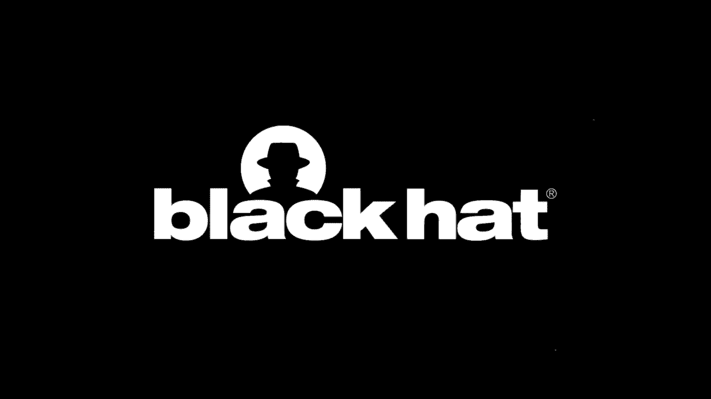

# 课程 P82：金融支付标准与恶意软件分析 🏦💻

在本节课中，我们将学习金融支付领域的两个核心标准：**ISO 8583**（银行卡交易标准）和**金融服务扩展**（XFS，特别是J/XFS，即ATM硬件交互的API标准）。我们将探讨威胁行为者如何将这两个标准整合到两个特定的恶意软件家族中：**FASTCash**（利用ISO 8583）和**INJX_Pure**（利用XFS）。我们将分析这些恶意软件的工作原理、内部机制，并讨论将支付标准集成到恶意软件中的优势与弊端。

---

## ISO 8583 标准详解 💳

上一节我们介绍了课程概述，本节中我们来看看第一个核心标准：ISO 8583。这是一个用于金融卡交易的国际标准。无论您是在ATM取款，还是在超市的自助结账机刷卡，都会生成一个ISO 8583消息来完成交易。

该标准定义了一套标准化的字段和结构，用于将卡片和交易数据从终端（如ATM）传输到支付交换机，再到银行，最后返回以批准或拒绝交易。这正是FASTCash恶意软件运作的基础。

一个ISO 8583消息由三部分组成：
1.  **消息类型标识符**：类似于文件头，包含消息类型的元数据。
2.  **位图**：指示消息中存在哪些字段。
3.  **数据元素**：即具体的字段内容。

由于一个交易可能涉及超过100个不同的可选字段（如主账号、交易日期时间等），但并非所有交易都需要所有字段。位图的作用就是指明本次交易具体包含了哪些字段，以便支付交换机处理。

消息类型标识符可进一步拆分为四个部分：
*   **版本**：第一个数字，表示ISO 8583标准的版本（例如，1987版）。
*   **消息分类**：第二个数字，指示消息是金融类、冲正类还是授权类等。这对FASTCash恶意软件至关重要。
*   **消息功能**：第三个数字，指示消息是请求还是响应。
*   **消息来源**：第四个数字，指示消息源自银行、ATM还是其他实体。

让我们看一个示例消息：`0210`。我们可以这样解析：
*   第一个数字 `0`：表示1987版本。
*   第二个数字 `2`：表示这是一个金融类消息。
*   第三个数字 `1`：表示这是一个请求。
*   第四个数字 `0`：表示消息来源为收单方（如ATM）。

紧随其后的位图和数据元素则包含了交易的具体信息，例如主账号、交易时间戳以及服务点输入模式。服务点输入模式（例如 `011`）尤其重要，它指明了数据如何输入终端（如手动输入`01`或刷卡`90`）以及终端是否具备PIN码输入能力。

---

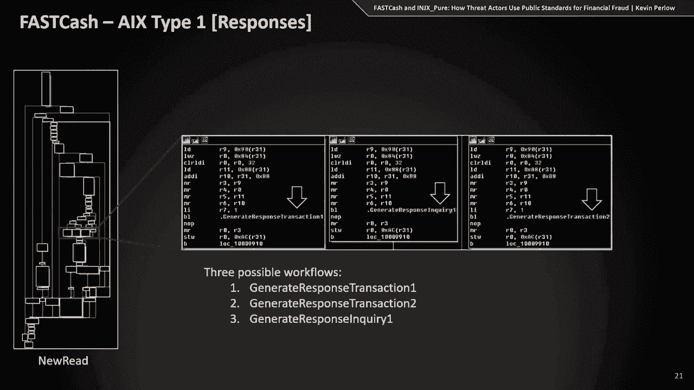

## FASTCash 恶意软件分析 🦠

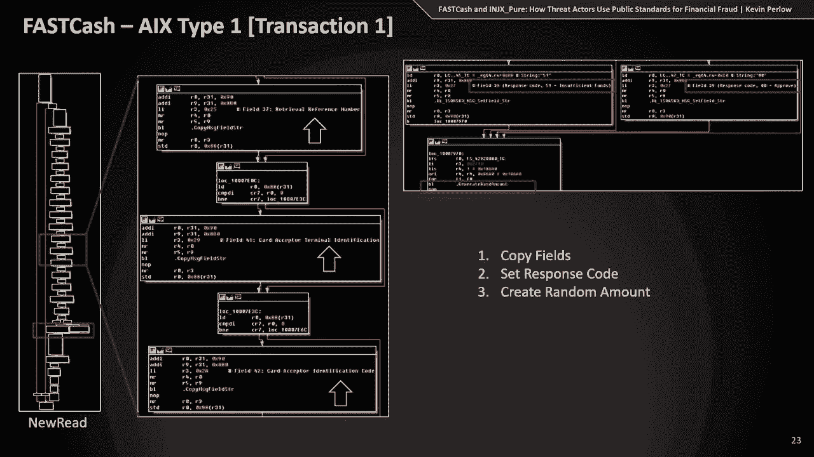

上一节我们了解了ISO 8583标准，本节中我们来看看威胁行为者如何利用它。FASTCash恶意软件与专门从事SWIFT银行劫案的一小撮朝鲜威胁行为者相关联。

该恶意软件被注入到支付交换机中，其核心目的是：拦截经过的ISO 8583消息。如果消息来自攻击者控制的ATM（使用特定卡片），则**欺诈性地批准交易**，允许取款；如果交易来自合法用户，则**透明地传递**该消息至银行，使其正常处理，从而不被察觉。

该恶意软件有针对不同环境的多个变种。我们将重点分析两个：**AIX类型一**和**Windows类型**。

### AIX 类型一分析

在逆向工程中，识别其与ISO 8583交互的函数是关键。恶意软件包含诸如 `get_field_string` 和 `set_field_string` 等预命名的函数，用于操作ISO 8583消息字段。

其工作流程可以概括如下：
1.  新ISO 8583消息到达被注入的支付交换机软件。
2.  恶意软件函数 `new_read` 拦截该消息。
3.  调用 `check_sock` 函数进行IP地址白名单检查，确保交易来自有效的内部IP。
4.  检索关键字段：消息类型标识符、主账号、处理代码等。
5.  根据检索到的数据进行判断：
    *   如果数据不符合攻击者预设的条件（例如，主账号不在白名单），则透明传递消息给银行。
    *   如果数据符合攻击者条件，则生成三种欺诈响应之一。

以下是该恶意软件可能生成的响应类型：
*   **交易响应类型一/类型二**：用于欺诈性取款。恶意软件从原始消息中复制一系列字段（如主账号、处理码等），用于构建返回给ATM的响应消息，并生成一个随机的交易金额，从而允许取款。
*   **查询响应**：用于响应余额查询请求。这可能是攻击者用来测试恶意软件是否正常工作。它会构建一个格式字符串，用于填充字段54（账户余额字段）。例如，在早期变种中，该格式字符串将货币代码设置为`356`（印度卢比），这暗示了受害者的地理位置。

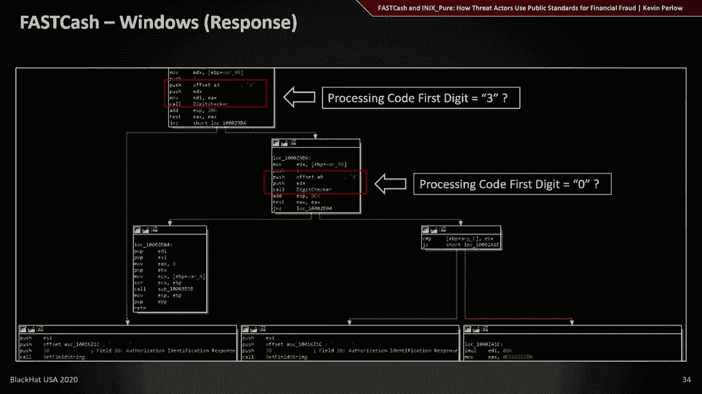

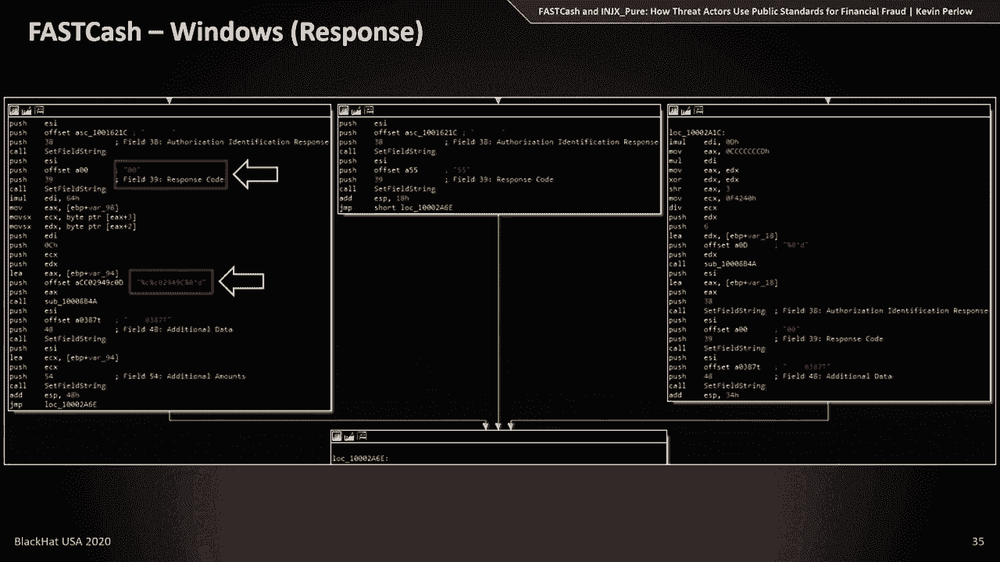

### Windows 类型分析

Windows版本的工作流程更为整合。在通过IP检查后，它会进入一个称为“响应父函数”的新逻辑。

该函数执行两项关键检查：
1.  检查**消息类型标识符**的第三、四位是否为`00`，以确保拦截的是请求（如`0210`）而非响应。
2.  检查**服务点输入模式**字段是否以`9`开头，以确认这是一笔刷卡交易（而非手动输入），这符合攻击者的操作预期。

通过检查后，恶意软件会根据**处理代码**（字段3）决定后续操作：
*   如果以`3`开头：执行**余额查询响应**流程。
*   如果以`0`开头：执行**欺诈交易响应**流程。
*   否则：返回“无效主账号”响应。

值得注意的是，在Windows变种的余额查询响应中，格式字符串的货币代码变成了土耳其的货币，这再次提供了关于受害者情况的重要威胁情报线索。

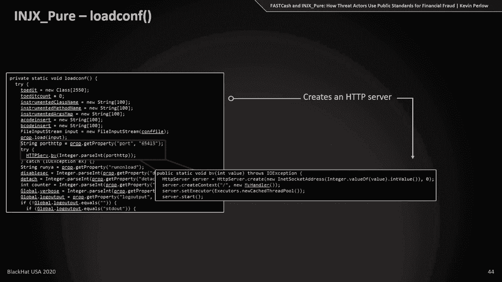

### FASTCash 攻击的挑战与特点

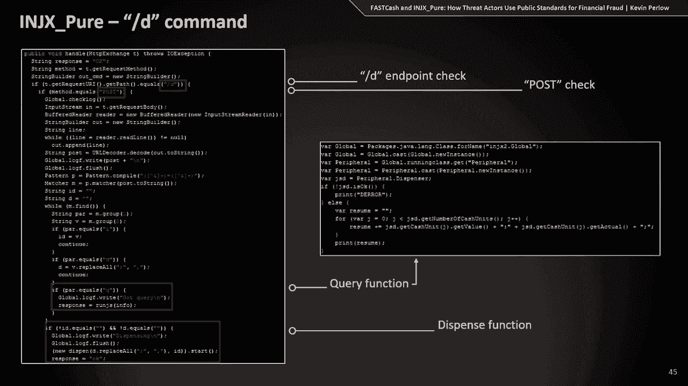

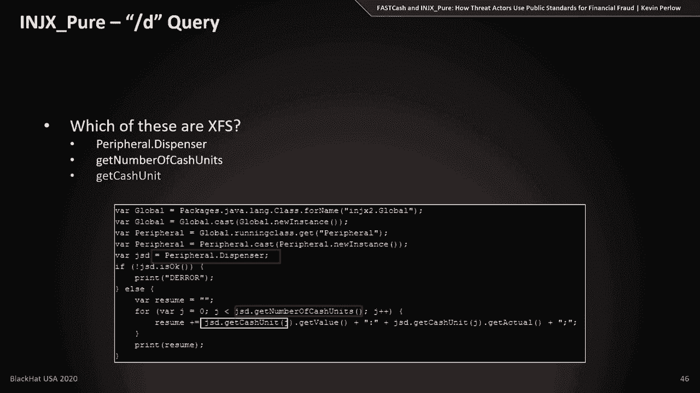

结合以上分析，我们可以总结出实施此类攻击的几点挑战和特点：
*   **高度复杂与依赖环境**：与支付协议和设备交互非常复杂，容易出错，因此恶意软件内包含了大量调试和日志信息以辅助攻击者操作。同时，攻击需要针对特定的支付环境（如Visa、MasterCard的不同实现）进行定制。
*   **沉重的运营要求**：需要能够实时修改恶意软件的程序员，以及一个在ATM端提取现金的“钱骡”网络。
*   **需要深度网络渗透**：攻击者必须能够深入金融网络，直接访问并入侵支付交换机。
*   **优势**：这种攻击允许威胁行为者在不触碰ATM本身的情况下远程操纵ATM进行现金窃取。

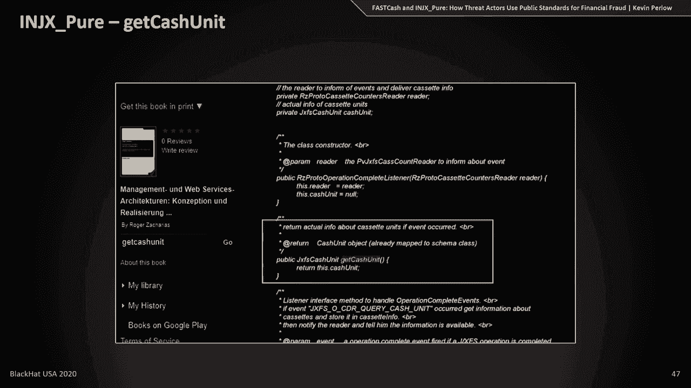

---

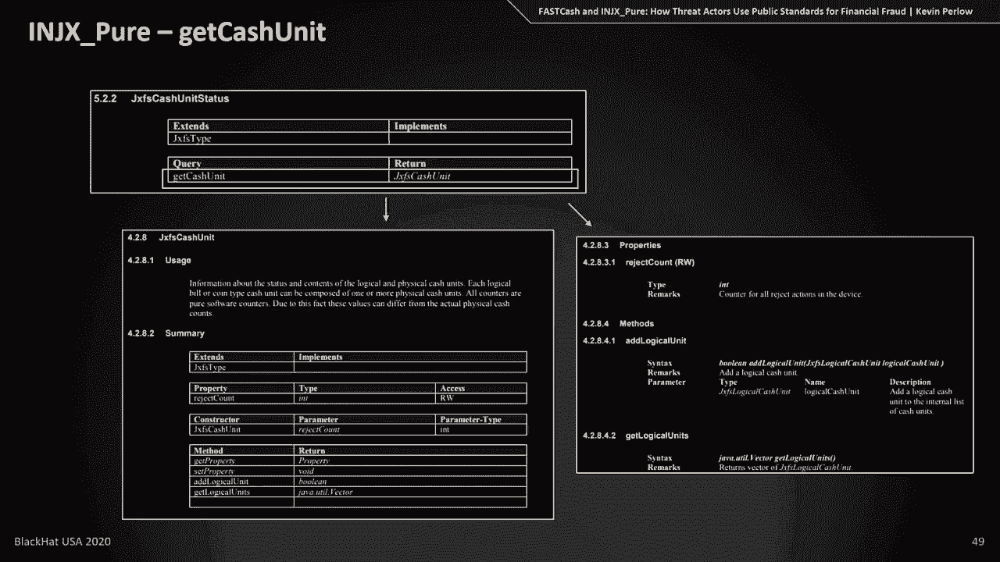

## 金融服务扩展与 INJX_Pure 恶意软件 🏧

上一节我们深入探讨了基于ISO 8583的FASTCash，本节中我们来看看另一个标准：**金融服务扩展**。XFS可以看作是一个标准化API，规定了软件供应商应如何编写与ATM硬件（如读卡器、出钞器、显示屏）交互的软件。我们将重点关注 **J/XFS**（Java XFS）。

我们将通过 **INJX_Pure** 这个ATM恶意软件家族来审视XFS的利用。与FASTCash不同，INJX_Pure是直接部署在ATM终端上的恶意软件。它创建一个HTTP服务器，接受GET/POST请求来执行命令。

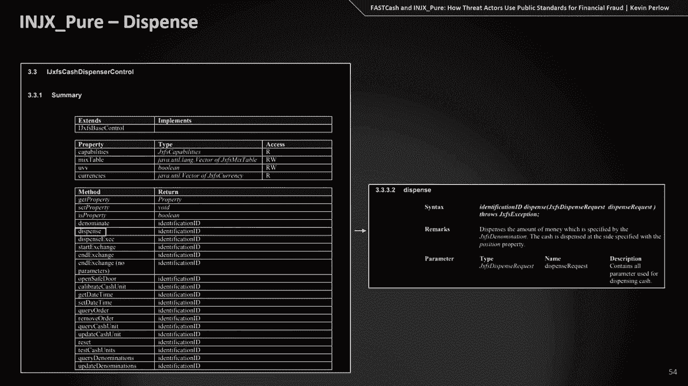

其核心功能包括：
*   查询设备（钞箱）信息。
*   分发现金。
*   执行任意代码。

我们重点关注其**现金分发功能**以及与XFS的关联。在逆向代码中，可以观察到非标准的Java或JavaScript调用，例如 `getCashUnit` 和 `getNumberOfCashUnits`。通过搜索和查阅官方XFS文档，可以确认这些是标准的J/XFS API调用，用于获取ATM内各个钞箱的现金信息。

更有趣的是，通过分析事件响应中上传至VirusTotal的受害ATM专有软件代码，我们可以推演威胁行为者在获得此级别访问权限后的**潜在能力**。除了标准的XFS调用，专有软件可能还暴露了其他类和方法，例如：
*   `peripherals.screen`: 控制屏幕。
*   `peripherals.pinpad`: 控制PIN码键盘。
*   其中，**禁用/启用按键**的功能尤其值得关注。攻击者可能利用此功能在“钱骡”取现前暂时阻止普通客户使用ATM，以确保机内有充足现金。

这种基于XFS的攻击方式与FASTCash形成对比：
*   **FASTCash**: 攻击支付交换机，欺诈批准交易，“钱骡”使用特定卡片在ATM正常取款。
*   **INJX_Pure**: 直接攻击ATM，通过远程命令让ATM在指定时间吐钞，“钱骡”直接取走现金。
*   **挑战**: INJX_Pure需要针对特定ATM型号开发恶意软件，可能涉及未公开的专有实现，增加了开发和测试难度。

---

## 总结与问答环节 🎯

本节课中，我们一起学习了金融支付领域的两个关键标准（ISO 8583和XFS），并分析了威胁行为者如何将它们武器化，融入到FASTCash和INJX_Pure恶意软件中，以实施针对ATM和支付系统的复杂攻击。

**关键要点总结：**
1.  **标准被滥用**：金融基础设施依赖的合法标准（ISO 8583, XFS）可能成为高级恶意软件的核心组件，使其能够隐蔽、有效地进行欺诈。
2.  **攻击链差异**：FASTCash代表了一种“上游”攻击（入侵支付交换机），而INJX_Pure代表了一种“下游”攻击（直接控制ATM）。两者都需要精心的策划和运营支持。
3.  **情报价值**：分析此类恶意软件不仅能了解其技术细节，还能从中提取关键的威胁情报（如针对的货币、地理区域），并理解攻击所需的运营能力，从而更好地进行防御规划和威胁追踪。

**常见问题解答：**
*   **什么是支付交换机？** 支付交换机是位于所有支付设备（ATM、POS机）和银行之间的关键设备。它处理所有传入的交易消息，决定将其转发给哪家银行，并将银行的批准/拒绝响应返回给终端设备。
*   **如何检测此类攻击？** 在资金被窃取（ATM被取空）时检测为时已晚。防御重点应放在攻击链的前期阶段，例如监控攻击者入侵网络、获取支付交换机访问权限时使用的常见技术（如PowerShell、计划任务、服务创建等）。
*   **INJX_Pure如何部署到ATM上？** INJX_Pure通常通过直接攻击ATM管理网络进行部署（例如，利用管理工具批量推送恶意软件），这与FASTCash入侵核心支付系统的方式不同。
*   **这些技术分析如何融入威胁情报？** 单纯的技术特征分析是不够的。需要结合来自金融行业的可靠信息共享，以构建完整的运营图景和战略情报，从而为更高层次的安全决策和业务规划提供支持。