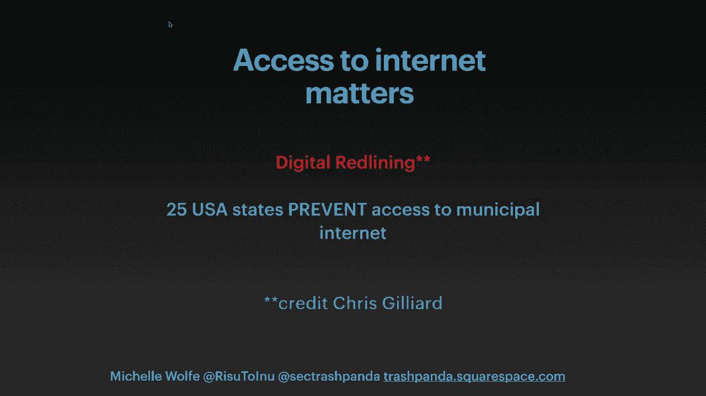
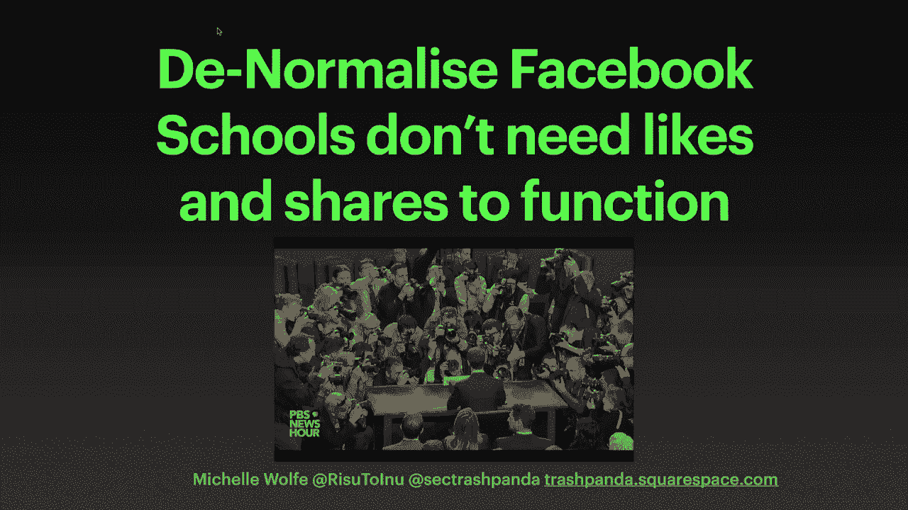
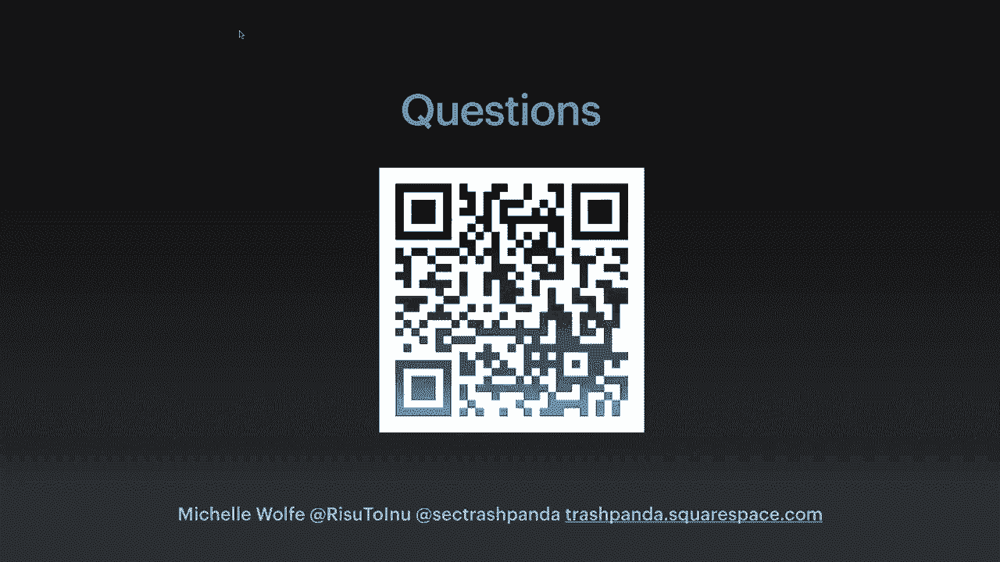

# 课程 P83：教育科技（EdTech）的终极高级持续性威胁（APT）🛡️

## 概述

在本节课中，我们将探讨教育科技（EdTech）领域存在的关键隐私与安全问题。我们将了解数据如何被收集和使用，识别当前平台存在的风险，并学习如何提出正确的问题来保护学生、家长和教育者的权益。

---

## 教育中的数据价值与影响 💎

数据常被比作黄金或石油，但这些比喻不够贴切。更恰当的比喻是，数据如同血液或血浆——它是个人化的、可再生的资源。学生从大约三岁进入学前教育开始，其数据就被持续收集和分析。这些数据构成了一个极其丰富且有价值的资源库。

数据的影响如同向池塘投入一颗石子，涟漪会不断扩散。一个学生的作业完成情况、课堂表现、行为记录，甚至家庭地址或特殊教育需求数据，这些看似简单的信息汇集起来，就能描绘出该学生的画像。这种影响可以从个体延伸到家庭、社区、城镇，乃至整个地理区域。

在州、国家乃至全球层面，决策者可能基于这些聚合数据做出判断，例如决定是否在某个区域投资、开设青年活动中心，或评估辅导公司或夏令营的商业潜力。这些决策至关重要。

当学生成长到16或18岁时，他们身上可能已积累约百万个数据点。这些数据将影响他们是否收到特定大学的定向邮件，甚至是否获得实习机会的信息。人们确实关心隐私，但难点在于，如果他们不知道数据正在被收集，就很难产生关切。一旦人们知晓，他们的关注度会显著提升。

---

## 问责制、透明度与信任 🤝

上一节我们讨论了数据的广泛影响，本节我们来看看教育环境中的问责与透明问题。在教育环境中工作的我，必须对学生及其数据保持百分之百的透明和负责。

我甚至不能未经犯罪记录审查，就随意进入其他学校或与女童子军等学生团体交谈。我必须证明我的意图、原因和计划。然而，我每周都会与学校或家长交流，发现他们常常仅仅因为应用“好看、闪亮、免费”就下载或购买，而完全忽略了问责与透明度。

通常，只有在提出正确问题时，这些信息才会浮现。近期巴克莱银行的一项研究显示，在美国针对儿童（包括面向家长和学校的应用）的近20%应用中，其软件开发工具包（SDK）并未遵守儿童在线隐私保护法（COPPA）。这意味着，即使SDK本身支持“默认隐私设计”，这些默认设置也未被启用。因此，像地理位置、联系方式等关键信息，可能在用户甚至尚未创建账户或表示同意前就被共享了。这是错误的，缺乏问责与透明。

因此，当有人推荐一个平台时说“嘿，我们想与您合作”、“这个平台很棒”或“这是免费的”时，我们必须提问：“我的数据会怎样处理？”、“你们为什么需要这些数据？”。我们稍后会回到这个问题。

信任也至关重要。作为教育者或负责照看儿童的人，我们处于“代替父母”的位置。一旦孩子跨入校门，他们就是我们的责任。如果我们让家长下载或使用某个应用，他们会信任我们。如果我们告诉同事将使用某个平台进行考勤、行为管理、座位安排或评分，大家也会假定它是可信的。

同时要记住，教育者并不愚蠢，但他们不像在Netflix或谷歌工作的员工，有长达一周的入职培训和无数合规课程。许多学校可能连电子邮件都很少用，仍在使用纸质文件，却突然要使用功能复杂、涉及隐私的应用。人们可能只是假设这些应用已经过检查，是完全安全的。

教育类应用的平均服务条款长达五页左右，几乎没人会通读。将这些不透明、不透明、不负责任的应用引入学校并推广使用，是一项重大的责任。就我个人而言，如果我推荐或认可某个应用、软件或公司，那一定是在经过深思熟虑并提出正确问题之后。

---

## 教育中的不平等与数字红线 🚧

上一节我们强调了问责与透明，但我们也必须诚实地面对现实。尤其是在2020年的当下，我们不应假装学校里的每个人都了解自身偏见、都是反种族主义者或完全公平。

有人说高中时光是人生中最美好的日子，但这可能有些过于美化。如果我们诚实面对，许多人会记得学校并不总是公平的。如今，许多边缘化群体家庭的父母仍能感受到这种不平等和不公。

在任何存在权力的组织中，无论是警察还是教育机构，都存在滥用权力的可能。我并非暗示教师、学校或教育科技是邪恶的，而是强调我们必须意识到，我们不应通过技术加剧不平等和不公。

我们还需要意识到“数字红线”问题。这个概念由克里斯·吉利亚德提出，源于金融服务中的“红线”歧视。在美国，约有25个州因法律限制而无法提供市政互联网服务，这完全出于企业利益。

当我们讨论个人数据被使用和解读产生的涟漪效应时，别忘了在衡量学生参与度或作业完成情况之前，这本身就假设了平台运行正常（而事实并非总是如此），并且假设每个人都有公平的技术访问权。

如果学生共享一台设备（通常是安卓手机），而许多平台只兼容iOS，或者网络连接不稳定，那么即使学生非常努力、家庭非常重视教育，他们也可能无法完成任务。这些都是需要考虑的问题，我们将在讨论在线监考时再次提及。

---

## 主要教育科技平台及其问题 📱

现在进入核心部分。以下列表并非详尽无遗，但涵盖了主要类型。如果列出所有平台及其第三方数据共享方，可能需要数小时和数十页幻灯片。

*   **左侧平台**：主要针对年轻人和学校设计。可能结构更清晰，相对“更安全”。
*   **中间平台**：与学校合作，但也涉及校外（甚至监狱）场景。包括在线监考和监控软件。
*   **右侧平台**：最初并非为教育设计，但因疫情进入教育领域，同样存在问题。

让我们从右侧平台开始解释问题所在。以Zoom为例（并非针对它，我们都知道其暴露的问题），核心问题仍在于问责、透明，以及我们需要自问：这些公司为何进入教育领域？

如果你说自己是教师，人们可能会想：“哇，假期真多”（没错），或者“她可能赚得不多”。教育行业本身并不以高薪著称。那么，这些平台如何盈利？很多时候，答案在于第三方数据，或者向机构收取额外费用。但即使与全美所有学校签约（可能性极低），也难以获得巨额收入。

因此，我们必须提问：你们为何进入这个领域？动机是什么？如果现在免费，六个月或一年后是否会收费？我曾在非营利组织和公司工作，亲眼见过先免费提供，后要求付费的情况。

这也关乎信任。我曾作为非营利组织代表进入学校，发现校长甚至不知道我们在与他们的学生合作，或者有外部硬件进入了学校。虽然未造成严重伤害，但这破坏了信任。如果你告诉教育者“我能为你做这个”，你就有责任保持开放和尽责。否则，就是将教育者、学生和家长置于风险之中。

例如，Teams或Zoom最初并非为学校设计，因此存在漏洞。因为涉及儿童，会吸引最恶劣的人试图进行骚扰或伤害。再比如Teams，在企业中，你可以安全地分享会议记录。但在学校，如果教师不小心，学生和家长就可能看到本不该看到的会议录像。这些在企业环境中可行的小功能，在教育世界中可能并不适用。

---

## 监考软件、监控与生物识别技术 🚨

中间部分的平台，特别是**监考软件和监控软件**，是我们需要重点讨论的，也是大家可以在课程结束后采取行动的一个方面。

学校中的生物识别技术应用存在诸多问题。生物识别（如指纹支付餐费、面部扫描入校或测温）在教育环境中**没有合法地位**，不符合比例原则，也不合法。无论是根据COPPA、GDPR还是其他法规指南，都**没有理由**收集儿童的生物特征数据。

我可以理解FBI工作人员可能需要面部扫描，但学校不需要。我们再次面临信任问题。考试是人生的重要环节，即使在家上学也难以完全避免。当你参加需要监考的考试时，仍可能面临生物识别或人工智能（AI）的审查，这非常有害。

正如之前所说，学校可能加剧不平等。如果你被标记为“异常”，面部识别软件或体温扫描无法识别你的肤色，或者监考AI认为你的行为“异常”，你可能会被判定失败。对于富裕家庭，他们可以申诉、重考。但对于那些受“数字红线”影响、网络访问不稳定、需要费尽周折才能找到一个安静房间和稳定网络的学生来说，一次考试失败可能意味着失去实习、签证、奖学金或工作的机会。这是高风险博弈，而不仅仅是“作业没交上”那么简单。

另一个问题是平台本身经常出故障。我们遇到过Pearson等平台内容错误、功能失灵的情况。如果你布置作业，可能一半学生看不到。对于大规模在线课程，可能有成千上万的学生无法联系到你，或者他们的反馈不被采信。

在科技领域，我们有时会疏远用户，导致他们不愿投诉。我常问家长和学生：“你们投诉了吗？提交工单了吗？”他们往往回答：“没有，我只是买了新设备”或“干脆不用了”。人们可能感到自己很蠢，或者选择更换设备而非报告问题。这会产生严重的连锁反应，因为即使开发者本意是好的，他们也可能根本不知道问题存在。

---

## 如何做出改变：提问、拒绝与赋能 💪

那么，我们如何做出改变？关键在于**提问**、**拒绝**和**赋能**。

**提问**：你需要问**为什么**（为什么需要这个平台？）、**如何**（它将如何运作？）以及**为了什么**（它能为我们做什么？持续多久？数据将去向何方？）。

**拒绝**：“不”本身就是一个完整的句子。“我想退出”、“我不想用这个”、“我们不应该使用生物识别技术”。对于学校食堂使用指纹支付，必须提供其他选项。我几乎没见过谷歌员工用指纹支付餐费，但学校却在这样做。这对于那些因移民身份等原因无法使用生物识别的人是不公平的。如果需要无现金支付，应有替代系统。对于生物识别、监考等技术，我们需要说“不”，并且现在就说。

**赋能**：我们需要让教育者参与每一个决策和开发过程。这目前并未实现。当我听到有人说“我们将与教育者合作”时，我很高兴，但这不应仅仅意味着与那些获得苹果或谷歌教育者徽章的人交流（这些认证几乎不涉及隐私或安全内容，更多是关于如何使用具体工具）。我们需要关注真正重要的问题。

对于儿童，“为了儿童”意味着我们关心他们、照顾他们、保护他们的数据并教育他们。我们能做的最重要的事情之一，就是通过数字素养教育，**教导他们了解自己的权利**，知道有哪些关于他们的信息被收集，以及如何选择同意或退出。这能培养他们的韧性。

我们不应教导他们进入一个像监狱一样、需要面部识别或生物识别才能进入、支付基本饮食，并且参加考试后还需等待5-7天让AI审查录像以判定行为是否得当的学校。监考软件环视房间不仅是为了查看是否有小抄，还能看到墙上的物品、房间里是否有其他人。这些信息都能透露大量个人隐私，我们需要保护每个人免受其害。

---

## 总结与资源 📚

本节课中，我们一起学习了教育科技领域的关键隐私与安全问题。我们探讨了数据的价值与广泛影响，强调了问责制、透明度与信任的重要性，指出了教育中现存的不平等与“数字红线”现象，分析了各类教育科技平台（特别是监考与生物识别技术）存在的风险，并最终学习了如何通过提问、拒绝和赋能来做出积极改变。

保护学生和教育环境中的数据隐私与安全，需要我们每个人的关注和行动。提出正确的问题，对不合理的做法说“不”，并积极赋能所有利益相关者，是构建更负责任、更公平的教育科技生态的关键。

以下是一些可供进一步参考的资源（原演示文稿中的二维码链接了本演讲的文字稿及定期更新的资源列表）：
*   关于教育科技隐私与安全的研究报告（如巴克莱银行研究）。
*   关注“数字红线”及相关社会公正议题的学者与论述（如Chris Gilliard）。
*   关于儿童在线隐私保护（如COPPA、GDPR）的法规指南。

---
**注**：本教程根据提供的演讲内容整理，力求忠实于原意并符合所有指定格式要求。原演讲中的幻灯片提示（如“”）已移除，以确保行文连贯。核心概念已通过**加粗**、归类列表和具体问题描述（如**提问**、**拒绝**、**赋能**）进行强调。