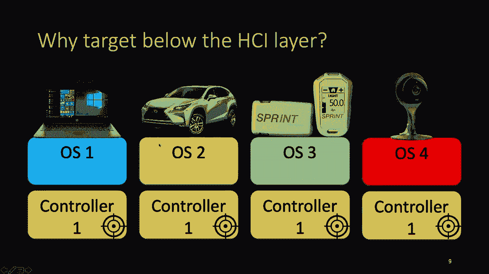
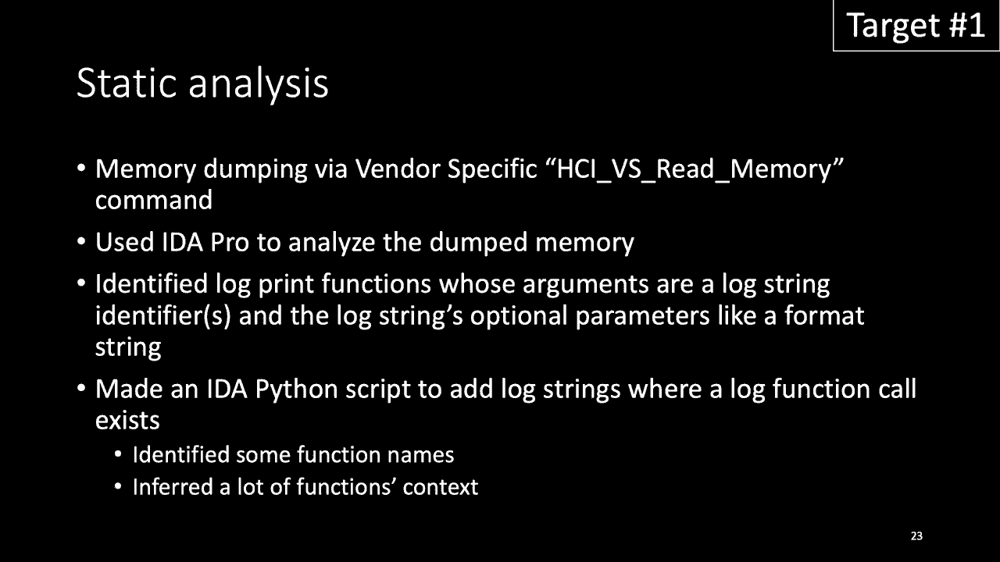
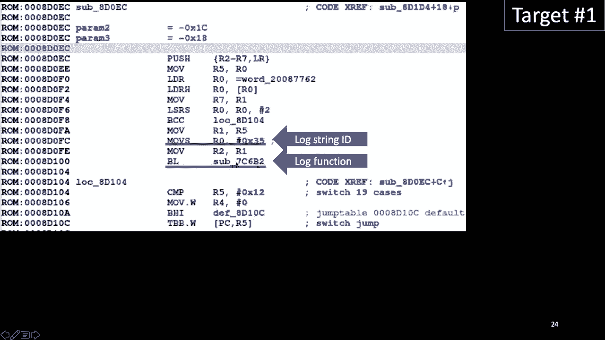
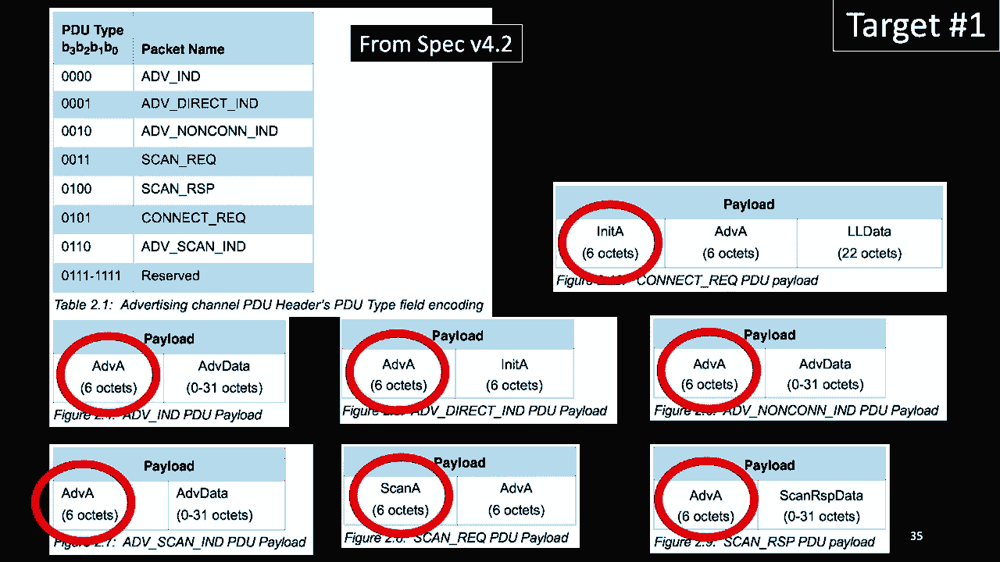
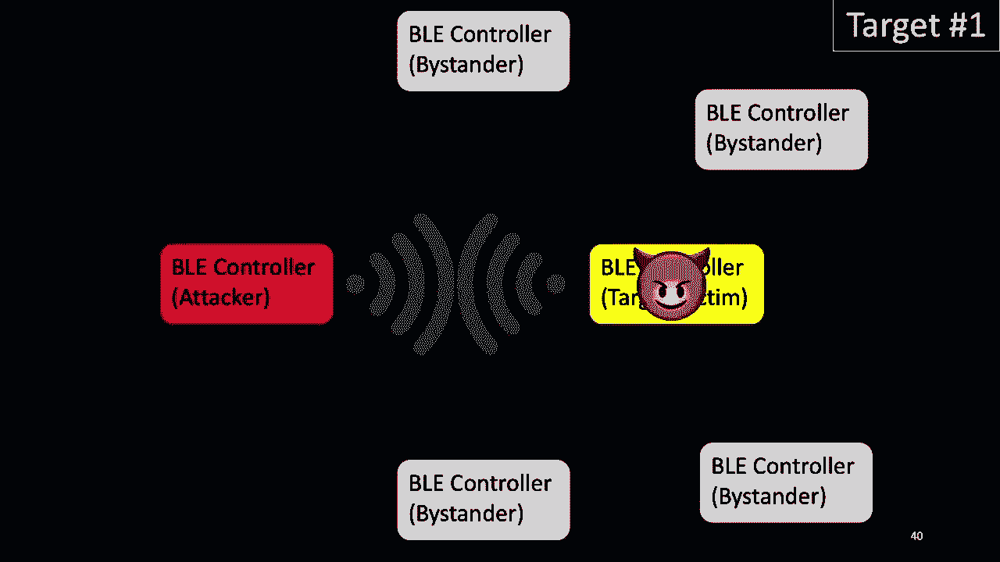
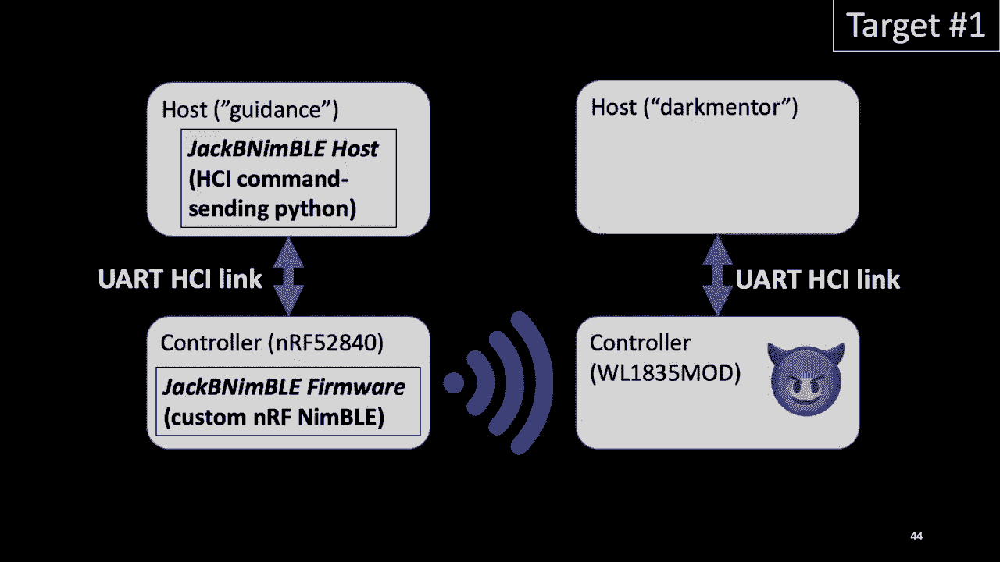
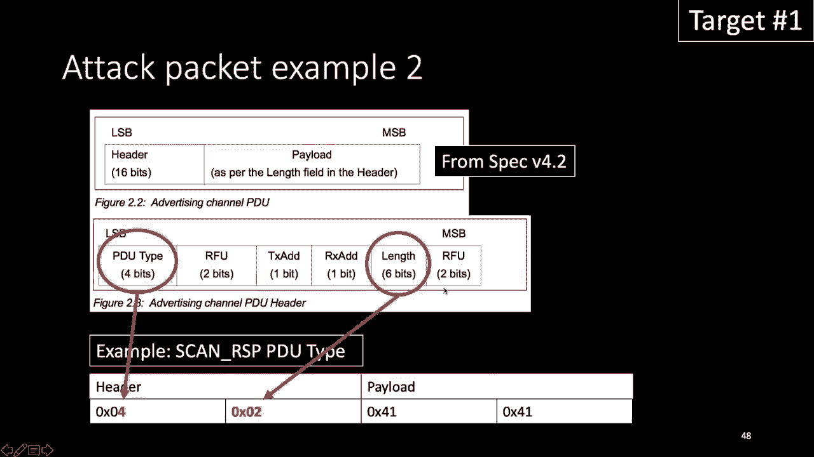
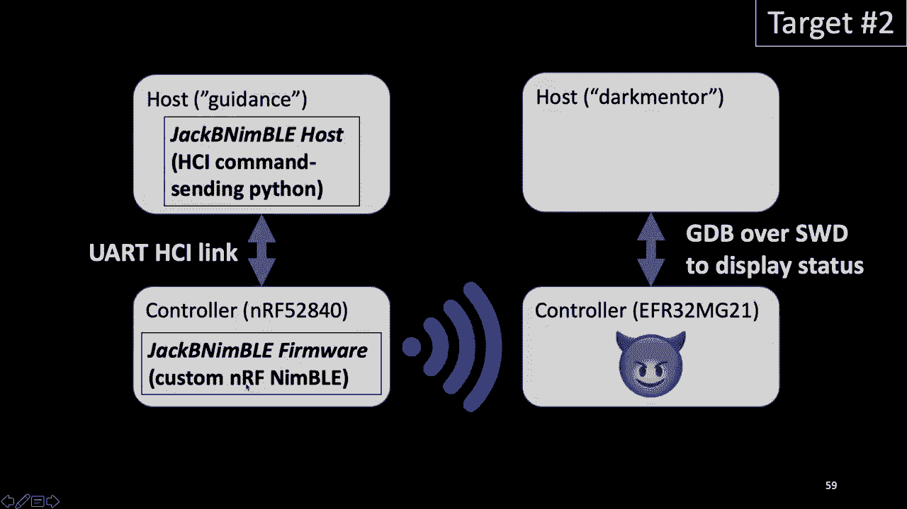
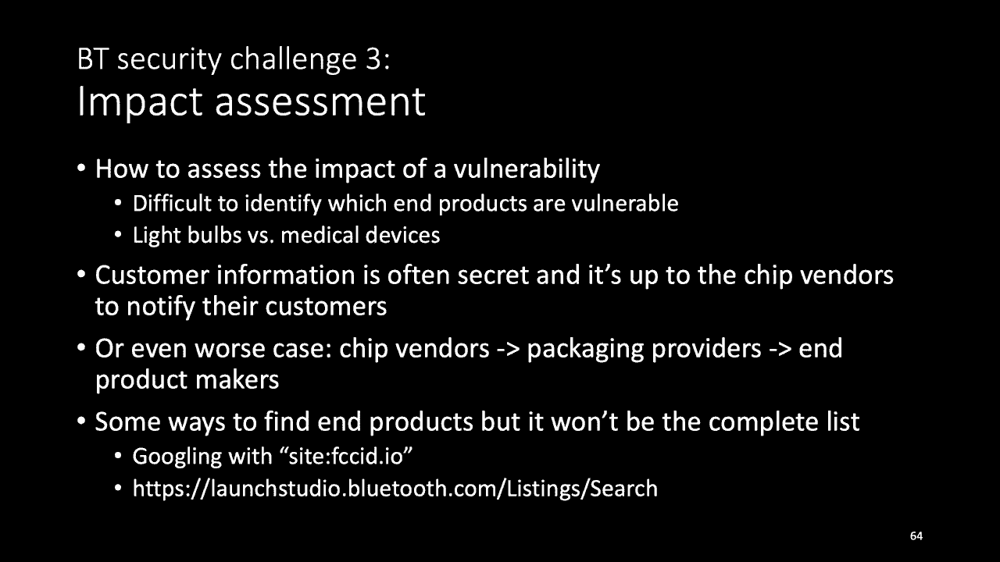

# P85：86 - Finding New Bluetooth Low Energy Exploits via Reverse Engineering Multiple - 坤坤武特 - BV1g5411K7fe

 Hello， I'm Veronica Kova。 Today I'm going to talk about over the air， Bluetooth Low Energy hacking。

 I have been in a security field for many years and in 2018 I wanted to do something they。

 had not done before。 I started a company and has been focusing on research in Bluetooth security。

 Today I'm going to share my story from knowing almost nothing about Bluetooth to find the。

 remote code vulnerabilities in the firmware level。 First。

 I started the Bluetooth security by surveying the existing Bluetooth security， researchers。

 Then I read about Bluetooth specification which is actually pretty large。

 But I didn't read all of it。 I generally focusing on the length field and embedded headers that programmers likely。

 make mistakes。 And I look for open source implementations because sometimes documentation was very vague。

 And for Bluetooth classes I couldn't find any open source implementations。

 But I found Zephyr and Apache-Mai NIMBLE that is Bluetooth Low Energy open source implementation。

 But today I'm going to talk about mainly focusing on the BLE because that's the one that I。

 had been focused on recently。 And here there is a BLE stack and there are many protocols。

 And for the dual chip configuration these protocols belong to host。

 And these two protocols belong to the BLE controller。

 And the specification defines how host controller interface should be implemented。 Through the HCI。

 host generate HCI commands to BLE controller。 And BLE controller generate HCI events to send back the result to the host。

 And when you receive BLE packets it also generates HCI events to the host。

 And for this here single chip configuration these all protocols will be located on the。

 BLE controller。 But for this configuration the specification does not define how HCI should be implemented。

 So it is up to the implementer。 They can use memory queue or they can choose just not having an explicit HCI layer。

 But this though I will focus on this link layer。 When I studied this research in mid 2018 there was literally zero control of specific vulnerabilities。

 But now there are 14 of them including a beta classic and BLE vulnerabilities。

 On this 14 there are only three proven BLE RC vulnerabilities。

 The first one you probably heard of is bleeding bit。

 And the two are the vulnerabilities I am going to talk about today。

 And let's see why an attacker is interested in finding this low layer vulnerabilities。

 Let's say an attacker found a PC specific vulnerability。

 In this case the attacker can only attack a single class of the devices。

 But even attacker find a vulnerability on this controller layer and this controller。

 used for different classes of devices he can attack PC or he can attack car medical devices。

 or IoT devices。 And beyond this low layer in order to attack this low layer it does not require either。

 authentication or pairing。 The attacker just needs to be nearby the device。

 And I am going to talk about four vulnerabilities on this low layer today。

 I prepared demos for the two RC vulnerabilities and I will briefly explain to other vulnerabilities。

 But before talking about the vulnerabilities I wanted to talk about how I set up my lab。

 in order to start vulnerability hunting。

 And here is a development board。 I recommend to start with development dev boards because it's easier to actually find。

 vulnerability and make an exploit because development board in many cases you can do the hardware。

 debugging。 But it's easier to find vulnerability and make an exploit compared to the end product。

 My lab has more than a dozen dev boards but I'm just showing you these two of them because。

 I'm going to talk about it today。 And there is here some severe converters。 Just if you have been。

 if you have some experience with the software development it's just like， a pre-NET。

 You are the basic or the easiest way to debug hardware。 And I happen to have one here。

 the leftmost one， this severe converter running around in， the house。

 And I use this one however it does not have a CTS and RTS lines。

 And it took me for a while to figure it out even how to see the UI messages。

 So I do recommend if you are getting the severe converter get ones that has a CTS and RTS， lines。

 And here is hardware debuggers。 These here two upper ones are for open OCD。

 But using open OCD requires slightly more work than the Sega jail link debuggers。

 For the beginners or the hobbyist I recommend using this Sega jail link。

 For the hobbyist you can use this education license however for the commercial you will。

 have to get the commercial license。 And since I am forcing backwards I had to have a way of power on and off these backwards。

 So I use U-HOP control and then this here the USB HOP。

 So the forger can turn it on and off my target。

 And when you generate the arbitrary BLD packets there should be a way to look at them so you。

 can confirm the packets are generally properly。 I use the Uber tools。

 This is very easy to use and it has a very good display。

 However it looks like software has not been updated very recently so it does not support。

 newer Bluetooth protocol features。 And luckily there are these sniffles was introduced at the end of the 2019 at hardware。

io。 And sniffles does support newer Bluetooth specification Bluetooth protocol features。

 And here is a Nordic device and I use Nordic device to generate the arbitrary packets。

 I start with another 52 A32。 It's because the Zephyr and Nimble has a lot of documentation and examples using this。

 device。 That is because the documentation was written a while ago and this one was older。

 The problem using this older one was in order to use UART I had to connect my serial converter。

 to some of the individual GPIO。 And it is kind of conversant when you move around this dashboard there are multiple cables。

 coming out of it。 So I end up using NRF 5840。 The good thing about this board is it supports the virtual comp port so you need only one。

 USB cable。 And with this hardware you need a software and today I am going to release the Jack Bin。

 Nimble。 Using this Jack Bin Nimble software you can generate an arbitrary BLE link layer packets。

 and it will be easy to extend to make your own fuzzer。 Jack Bin Nimble comes into two parts。

 The first one is a firmware。 I made a modification to the Nimble because Nimble does not generate a packet that violates。

 Bluetooth specification but we do want to generate the packets that doesn't comply with。

 the specification。 And in order to discount or country this former I made a host code here。

 And this host code is written in Python and this Python code is responsible for making。

 this arbitrary packet and give it to the former and then the former will not send these packets。

 Now we have a set up and let's look at a specific chip。

 The first tag is Texas Instruments WL-1835 mod chip and this chip is supported to the， version 4。

2 and this case of developed a board was slightly different from other development。

 board units in that it does not have hardware debugging exposed。

 And also in this chip the BLE link layer is baked into ROM which means the end product。

 they use this chip will have the same ROM contents as this device， this development board。

 And the host or the end product in order to pack the functionality box or the security。

 vulnerabilities。 The host use a TI provided patch and redirect control floor into a different new code。

 And TI also provide some tools for the developers and one of them is a TI tester and lower。

 And what does this HCI tester does？ I just mentioned about the patch file and the patch file is in binary format and if you。

 use a HCI tester this tool will translate this binary format to human readable strings。

 In the case of lower when I look at just the UR messages traffic the UR messages actually。

 is in binary format。 And if you attach this lower to your this lower will display log messages in strings。

 And you would just saw this diagram in case of this TI chip is belong to this dual chip。

 configuration。 And in the demo you will see how I actually generate some HCI commands in order to control。

 this TI device。

 So now I have this development board and I just need to start from this one-day board。

 So I open this patch file using the HCI tester and I could see there are many vendor specific。

 write memory because the patch file is in order to patch this chip。

 That means there can be read memory and I found a read memory in one of the files that， TI provides。

 And in the file next to the read memory there was an op-code。

 I took that op-code and used the HCI tool which is Linux tool and I could dump the accessible。

 memory from this dev board。 And one big step I could reverse this firmware better was after the identifying this log。

 function。 I mentioned about the lower。 So this log function sent these log messages in binary format to the UART。

 And based on this in the colors of the base looking at the colors of this log function。

 I could identify some of the function names and then some code context。

 And here's an example。 So just open this format and dump the memory with the IDA。

 There's not no information because there's no symbols。

 But here this function turns out to be one of the log wrapper functions。

 And the first argument is the log string ID。

 And after identifying this many log function wrap， like a log wrapper functions I could。

 see that this particular wrapper set the log level to two。

 There is a level from one to six and it expects two parameters for the log form a string here。

 because you expect the two parameters here。 And for the ID。

 once this function takes this ID it adds 3580 to this number。 And then figure it out。

 It needs to basically use this string。 And based on this string。

 now I can see the function here name is this string。

 And I made an IDA script to repeat this process。

 And now I have a lot of study analysis information。 However。

 in many cases this is not enough to identify the vulnerability or the actually。

 exploit the vulnerability。 So I made a further。 I mentioned about the Jack Finimbo。

 So Jack Finimbo is basically called extracted from this further。

 And why I was generating arbitrary packet and when I crashed the device， the information。

 I'm looking at was not enough。 And I will show you example in the next slide。

 So I before sent an engineer like to read the hard for to hard both handler code and。

 they found that there is a flag in the memory。 If I set the flag， I could see way more information。

 And also， if you have a way of hardware debugging， I can just check the register values or the。

 memory values on the fly。 But since I don't have that。

 I patch this binary in order to read some register values。

 or the memory address values。 And here is an example of the lower。 If I don't patch a binary at all。

 this is a default a case what you can see in the lower。

 And this particular case is why I was making the proof of concept code。

 And I actually over wrote the PC value which we're going to trigger the hard fault。 And in here。

 just repeat the same similar information here just repeatedly。 So now。

 I patch the binary and let's look at the first patch here。

 And this one actually shows the just before step before flow occurs。 And here。

 you don't need to worry about this log string here。

 I just pick a string ID that takes two parameters。 This is the important information。

 So I wanted to print out what's the source address and what's the length value for the， memcopy。

 And here， when I print out， it's a heap address。 And please remember this one because when I talk about actual vulnerability。

 I'll mention， this source address again。 And also this length value here。

 And I took the code just before memcopy is called。

 And another patch I've done is I mentioned about the hard fault handler。

 And I set the flag to one so I can see more information at the time of the crash。 Now。

 I see all the register values and the state information。 And in the following。

 there is a heap memory information as well。 And now let's talk about the vulnerability that end to remote code execution。

 Actually， I found this integer on the floor a while long ago。 When I disassembled this format。

 I identified the memcopy first and looked around all the， colors。

 And I could identify this integer on the floor right away and reach can yield to the step。

 of a overflow。 But at the time， I didn't have a way of just reaching this code path。

 So after making the fuzzer， I was able to crash the device and then I could see the actual。

 vulnerability can be reachable and exploitable。 And guess what？

 This mistake is exactly the same as a bleeding bit， but in the different code ways。

 In the case of bleeding bit， it was a heap overflow， but mine is a stack overflow， which。

 means an attacker can exploit this more reliably。

 And let's see when an attacker takes place。 A victim starts scanning， then an attacker here。

 you can just send the malicious advertisement， packet。 And as you see here， little authentication。

 nor the pair you require， just scanning a malicious， packet。 That's it。

 And now let's take a look at the assembly code。 In this function， as you see here。

 the function allocates a stack buffer space for hex2c。 And the next is the。

 I actually skipped a little bit of instruction here because it was， just irrelevant。

 Because R6 value is a PDEU length， PDEU is a packet data unit length， and then I will。

 show you the format in the very next slide。 It takes the length of value and subtract 6 here。

 Here there is an integer on the floor。 If R6 value is small than 6。

 this end of R6 here becomes really big number。 The next instruction is unsigned byte extension。

 which means it will eliminate the three most， significant bytes and then leave only the last least significant byte。

 Hold on here。 And I want you to actually remember this part why I'm emphasizing because when I talk about。

 another， my dose vulnerability， this actually a big role here， this instruction。

 And this R6 becomes here length is a big number equals to the length field。 And the next R1。

 if you remember from the previous slide， one of the previous slide， this R5， value has the。

 I have a buffer address here。 It goes to here， the source address。

 And destination address here is a stack address here。 So you see there is a stack buffer overflow。

 And this is how this packet looks， advertisement packet looks like。 This length field here。

 this is from the version 4。2。 This 6 bit comes here and reaches the R6 value。

 And if I put less than 6， then there is an integer on the flow。

 And let's see why the programmer make those kind of mistake。 According to the stack buffer， 4。2。

 there are seven period types。

 And all of them has at least actually 6 byte data here。 So programmer can think as， okay。

 there is a packet length， I can just subtract 6。 However， if it is a malicious packet。

 it can be small than the 6。

 Now I started developing the exploits。 But then the problem was because of the background BLE traffic。

 I could not control this heap， context， I could not control the heap context well in order to make a reliable exploit。

 So I come up with an attack， it is a quiet place attack。 There are lots of those attacks。

 those vulnerability including one of mine。 And any other successful attack can be a those attack。

 Let's see here， there is an attacker and he wants to attack this BLE controller。

 But now he sees a lot of nearby device， BLE devices。 And he wants to quiet them down。

 And you can just kill all of them using those attacks。

 Then finally this attacker can just send a malicious packet targeting this victim。

 Now here is the thing， I'm not a real attacker and I cannot kill the old neighbor's BLE devices。

 So my solution is I have a bucket， a paint bucket。

 I made a fairly case of this paint bucket。 And here， in order to reduce the background BLE noise。

 this is the artificial in fabric， and I wrap my devices using the tin foil。

 And I also actually when I wrap these old devices into the bucket， I put the Uber to。

 verify actually the background noise has been reduced。 And let's take a look at the demo。

 I set up my Jack pinimbo here and I'm going to attack this TI device。

 [ No audio ]， [ No audio ]， [ No audio ]， [ No audio ]， [ No audio ]， [ No audio ]， [ No audio ]。

 [ No audio ]， [ No audio ]， [ No audio ]， [ No audio ]， [ No audio ]， [ No audio ]， [ No audio ]。

 [ No audio ]。

 [ No audio ]， [ No audio ]， [ No audio ]， [ No audio ]， [ No audio ]。

 [ No audio ]。

 [ No audio ]， [ No audio ]， [ No audio ]， [ No audio ]， [ No audio ]。

 [ No audio ]， [ No audio ]， [ No audio ]。

 [ No audio ]， [ No audio ]， [ No audio ]， [ No audio ]， [ No audio ]， [ No audio ]， [ No audio ]。

 [ No audio ]， [ No audio ]， [ No audio ]， [ No audio ]， [ No audio ]， [ No audio ]， [ No audio ]。

 [ No audio ]。

 [ No audio ]。

 [ No audio ]， [ No audio ]。

 [ No audio ]。

 [ No audio ]， [ No audio ]， [ No audio ]， [ No audio ]， [ No audio ]， [ No audio ]， [ No audio ]。

 [ No audio ]。

 [ No audio ]， [ No audio ]。

