# 课程 P85：86 - 通过逆向工程发现新的蓝牙低功耗漏洞 🕵️‍♀️

在本节课中，我们将学习如何通过逆向工程来发现蓝牙低功耗（BLE）协议栈底层的远程代码执行漏洞。课程将涵盖从搭建研究环境、分析固件到实际漏洞利用的完整流程。

## 概述

我是 Veronica Kova，在安全领域工作多年。2018年，我决定涉足一个全新的领域，并成立了一家公司，专注于蓝牙安全研究。今天，我将分享自己从对蓝牙几乎一无所知，到在固件层面发现远程代码漏洞的经历。

## 研究起点

上一节我们介绍了课程背景，本节中我们来看看我是如何开始蓝牙安全研究的。

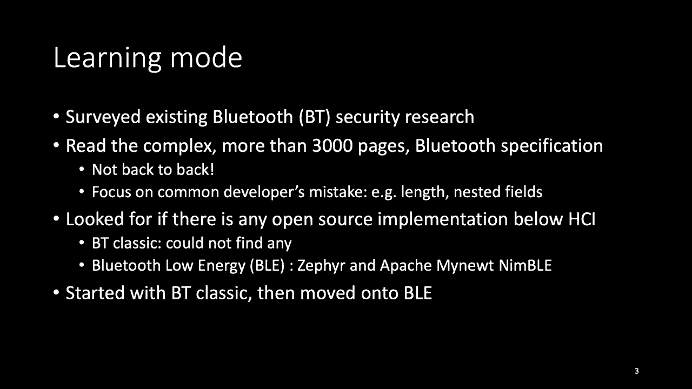

首先，我通过调查现有的蓝牙安全研究来入门。然后，我阅读了蓝牙规范，这份文档非常庞大，但我并未通读全文。我主要关注**长度字段**和**嵌入式头部**，因为程序员在这些地方容易出错。同时，我也会寻找开源实现，因为有时文档描述非常模糊。

对于蓝牙经典协议，我找不到任何开源实现。但我找到了 **Zephyr** 和 **Apache Mynewt NimBLE** 这两个蓝牙低功耗的开源实现。

## 聚焦蓝牙低功耗

今天我们将主要关注BLE，这是我近期研究的重点。下图展示了BLE协议栈，其中包含许多协议。

在双芯片配置中，这些协议属于主机，而这两个协议属于BLE控制器。规范定义了主机控制器接口应如何实现。通过HCI，主机生成HCI命令发送给BLE控制器，控制器则生成HCI事件将结果返回给主机。当接收到BLE数据包时，控制器也会向主机生成HCI事件。

在单芯片配置中，所有这些协议都位于BLE控制器上。但对于这种配置，规范并未定义HCI应如何实现，这取决于实现者。他们可以使用内存队列，也可以选择不设置显式的HCI层。

不过，本次研究我将重点关注**链路层**。在2018年中我开始这项研究时，公开的特定漏洞几乎为零。但现在，包括蓝牙经典和BLE漏洞在内，已有14个。在这14个中，只有3个是经过验证的BLE远程代码执行漏洞。

第一个你可能听说过，是 **BleedingBit**。另外两个就是我今天要讲的漏洞。

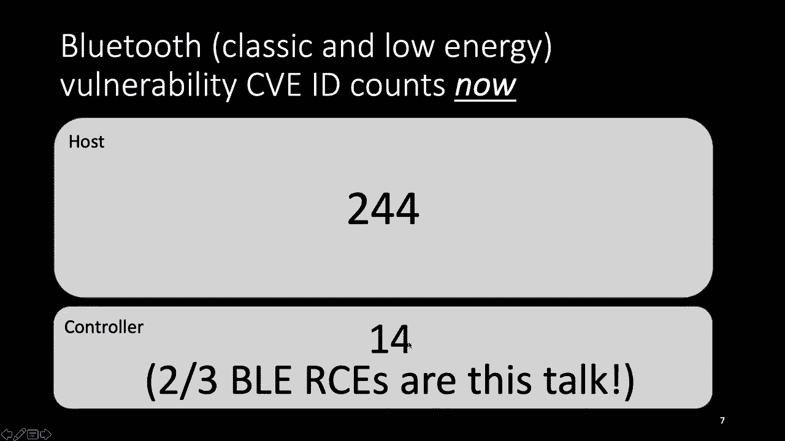

## 攻击者为何关注底层漏洞

上一节我们提到了几个关键漏洞，本节中我们来看看攻击者为何对底层漏洞感兴趣。

假设攻击者发现了一个PC特定的漏洞。在这种情况下，攻击者只能攻击单一类别的设备。

但是，如果攻击者在控制器层发现漏洞，并且这个控制器被用于不同类别的设备，那么他就可以攻击PC、汽车、医疗设备或物联网设备。

此外，要攻击这个底层，既不需要认证，也不需要配对。攻击者只需要在设备附近即可。

今天我将讨论这个底层的四个漏洞。我为其中两个远程代码执行漏洞准备了演示，并会简要解释其他漏洞。

## 搭建研究实验室

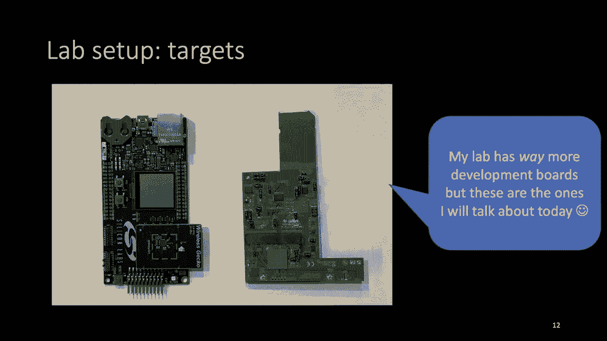

在讨论漏洞之前，我想先谈谈如何搭建实验室以开始漏洞挖掘。

这里有一块开发板。我建议从开发板开始，因为相比最终产品，在开发板上更容易发现漏洞并制作漏洞利用程序。开发板在很多情况下可以进行硬件调试。

我的实验室有十几块开发板，但今天只展示其中两块。

这里还有一些串口转换器。如果你有软件开发经验，这就像是一个“printf”调试——最基本或最简单的硬件调试方式。我手边有一个最左边的串口转换器。

然而，它没有CTS和RTS线路。我花了一段时间才弄清楚如何查看UART消息。因此，我建议如果你要购买串口转换器，请选择带有CTS和RTS线路的型号。

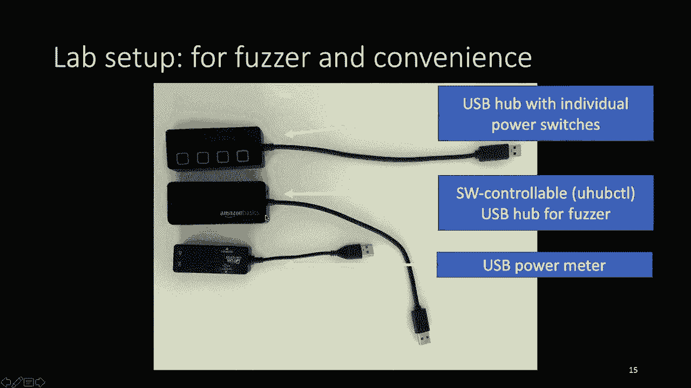

这里是硬件调试器。上面两个用于OpenOCD，但使用OpenOCD需要比Segger J-Link调试器稍多一些工作。对于初学者或爱好者，我推荐使用Segger J-Link。爱好者可以使用教育许可证，但商业用途则需要购买商业许可证。

由于我研究的是开发板，我需要一种方法来控制它们的电源开关。所以我使用了USB集线器控制器，通过这个USB集线器，我可以用脚本控制目标的开关。

## 数据包生成与嗅探工具

当你生成任意的BLE数据包时，需要有一种方法来查看它们，以确认数据包格式正确。我使用 **Ubertooth** 工具，它非常易于使用且显示效果很好。

然而，该软件似乎近期没有更新，因此不支持较新的蓝牙协议功能。幸运的是，2019年底的Hardwear.io大会上引入了 **Sniffle**。Sniffle支持较新的蓝牙规范和协议功能。

这里还有一个Nordic设备，我用它来生成任意数据包。我从nRF52 DK开始，因为Zephyr和Nimble有大量使用该设备的文档和示例。这是因为文档是很久以前编写的，而这是较旧的型号。

使用这个旧型号的问题是，为了使用UART，我必须将串口转换器连接到某些单独的GPIO引脚上。当移动这块开发板时，有多根电缆连接，这很不方便。所以我最终使用了 **nRF52840 Dongle**。这块板子的好处是它支持虚拟COM端口，因此你只需要一根USB线。

## JackBle Nimble 工具

有了硬件，还需要软件。今天我将发布 **JackBle Nimble**。使用这个软件，你可以生成任意的BLE链路层数据包，并且很容易扩展为你自己的模糊测试工具。

JackBle Nimble 分为两部分：
1.  **固件**：我对Nimble进行了修改，因为Nimble不会生成违反蓝牙规范的数据包，但我们确实需要生成不遵守规范的数据包。
2.  **主机代码**：这部分用Python编写，负责制作任意数据包并将其交给固件，然后固件会发送这些数据包。

现在我们已经完成了环境搭建，让我们来看一个具体的芯片。

## 案例分析：德州仪器 WL-1835MOD 芯片

第一个目标是德州仪器的WL-1835MOD芯片，它支持蓝牙4.2版本。这块开发板与其他开发板略有不同，它没有暴露硬件调试接口。

此外，在这块芯片中，BLE链路层被固化在ROM中。这意味着使用该芯片的最终产品将拥有与此开发板相同的ROM内容。最终产品的主机为了修补功能错误或安全漏洞，会使用TI提供的补丁，并将控制流重定向到不同的新代码中。

TI还为开发者提供了一些工具，其中之一是 **TI Tester and Logger**。这个HCI测试工具是做什么的呢？我刚刚提到了补丁文件，补丁文件是二进制格式。如果你使用HCI测试工具，它会将这个二进制格式翻译成人类可读的字符串。

对于Logger，当我查看UART消息流量时，消息实际上是二进制格式。如果你连接这个Logger，它会以字符串形式显示日志消息。

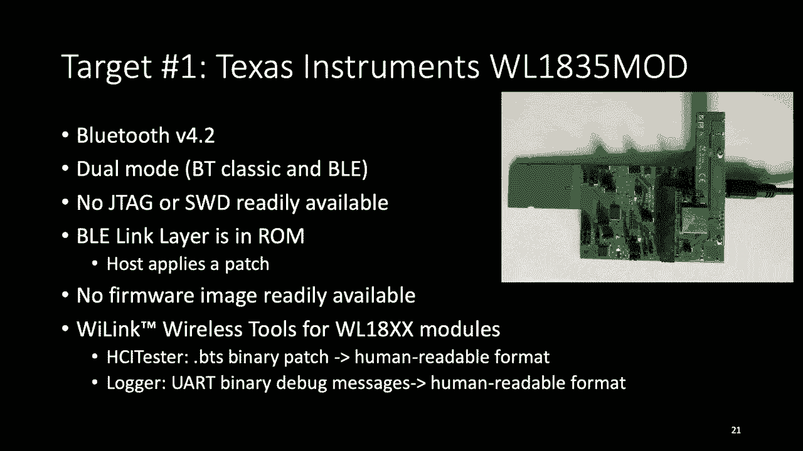

你刚才看到的图表中，TI芯片属于双芯片配置。在演示中，你将看到我如何实际生成一些HCI命令来控制这个TI设备。

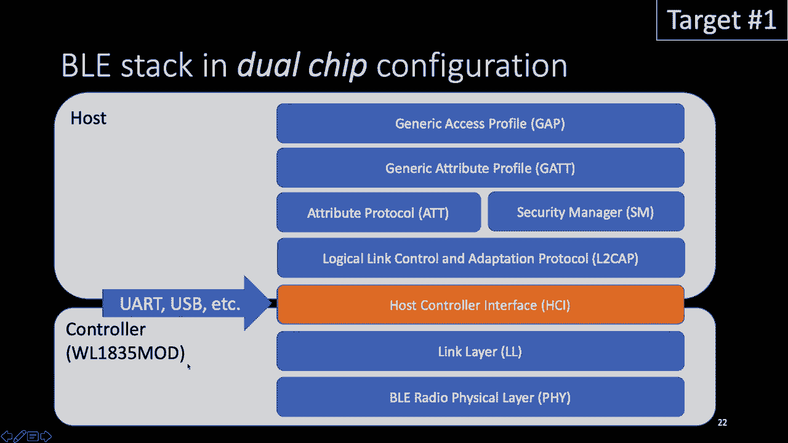

## 逆向工程与漏洞发现

现在我有了这块开发板，我需要从这块单板开始研究。我使用HCI测试工具打开了补丁文件，可以看到许多供应商特定的“写内存”命令，因为补丁文件是为了修补芯片。

这意味着也可能存在“读内存”命令。我在TI提供的一个文件中找到了一个读内存命令。在该文件中的读内存命令旁边，有一个操作码。

我获取了那个操作码，并使用Linux工具`hcitool`，成功从开发板转储了可访问的内存。在识别出日志函数后，我在逆向固件方面迈出了一大步。

我提到了Logger。这个日志函数以二进制格式将日志消息发送到UART。基于这一点，通过查看这个日志函数的调用者，我可以识别出一些函数名和代码上下文。

这是一个例子。用IDA打开这个格式并转储内存，没有任何信息，因为没有符号。

但这个函数实际上是日志包装函数之一。第一个参数是日志字符串ID。

在识别出许多这样的日志包装函数后，我发现这个特定的包装器将日志级别设置为2（级别从1到6），并且它期望日志格式字符串有两个参数。

对于ID，一旦函数获取这个ID，它会将数字加上3580。然后它需要基本上使用这个字符串。基于这个字符串，我现在可以看到这里的函数名就是这个字符串。

我编写了一个IDA脚本来自动化这个过程。

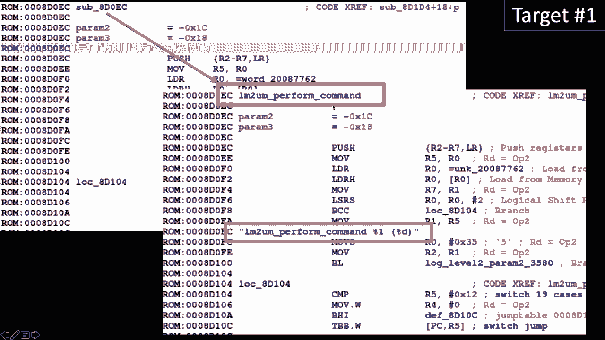

## 深入分析与二进制补丁

现在我有了很多静态分析信息。然而，在许多情况下，这不足以识别漏洞或实际利用漏洞。所以我进行了更深入的工作。我提到了JackBle Nimble，它基本上是从模糊测试工具中提取出来的。

当我生成任意数据包并使设备崩溃时，我查看的信息并不足够。我将在下一张幻灯片中展示例子。

在发送模糊测试数据包之前，我喜欢阅读硬故障处理程序代码，发现内存中有一个标志。如果我设置了这个标志，就能看到更多信息。

此外，如果你有硬件调试的方法，你可以实时检查寄存器值或内存值。但由于我没有，我通过打补丁来读取一些寄存器值或内存地址值。

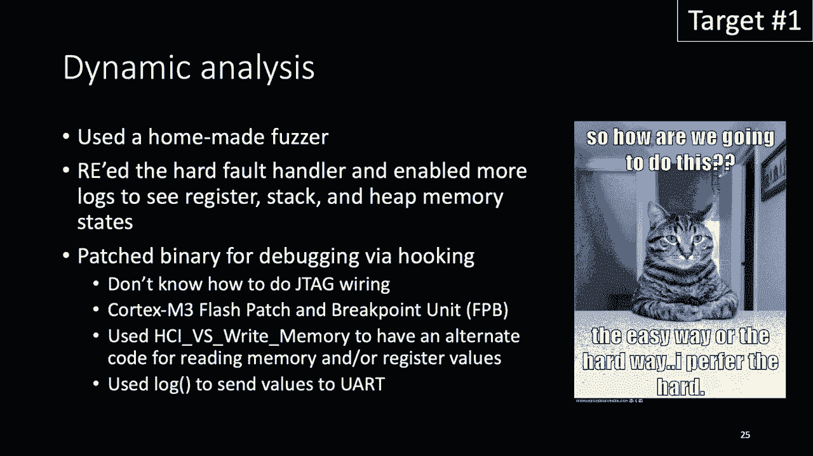

这是一个Logger的例子。如果我不对二进制打任何补丁，这是你在Logger中默认能看到的情况。

这个特定情况是我在制作概念验证代码时发生的。我实际上覆盖了PC值，这将触发硬故障。在这里，只是重复显示类似的信息。

现在，我对二进制打了补丁。让我们看看第一个补丁。

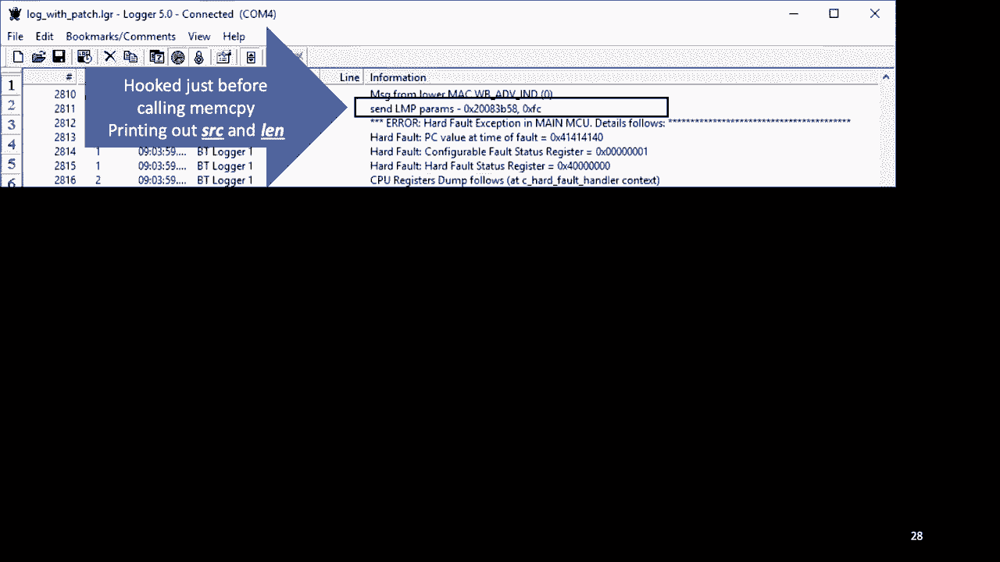

这个补丁实际上显示了在溢出发生之前的步骤。你不需要担心这里的日志字符串，我只是选择了一个接受两个参数的字符串ID。这是重要的信息。

我想打印出`memcpy`的源地址和长度值。在这里，当我打印出来时，它是一个堆地址。请记住这一点，因为当我谈论实际漏洞时，会再次提到这个源地址。还有这里的长度值。

我获取了在调用`memcpy`之前的代码。

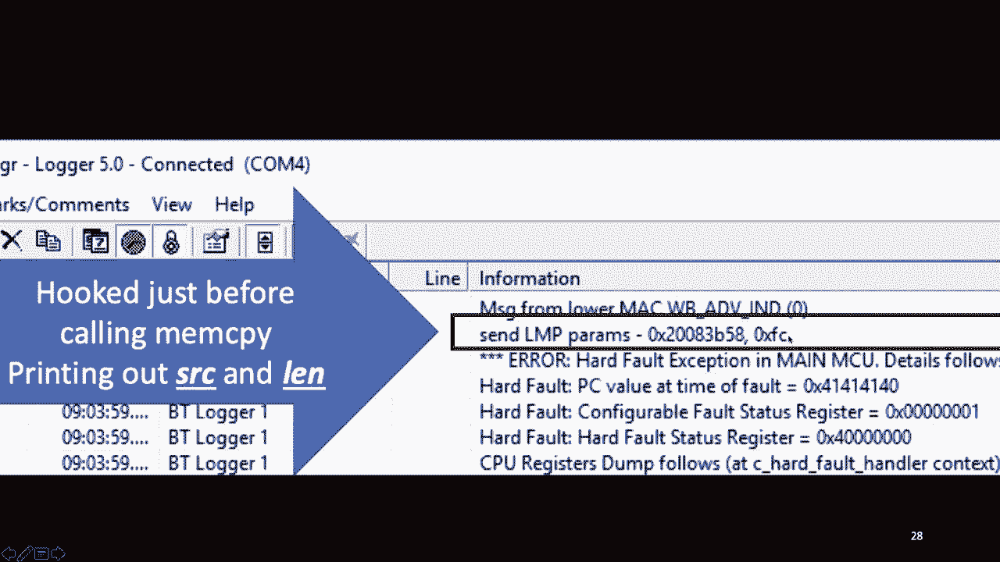

我做的另一个补丁是关于硬故障处理程序的。我将标志设置为1，以便在崩溃时看到更多信息。现在，我看到了所有的寄存器值和状态信息。随后还有堆内存信息。

## 漏洞分析：整数下溢导致栈溢出

现在让我们谈谈导致远程代码执行的漏洞。实际上，我很早就发现了这个整数下溢。当我反汇编这个固件时，我首先识别出了`memcpy`，并查看了所有调用者。

我可以立即识别出这个整数下溢，并可能导致溢出。但当时，我没有办法到达这个代码路径。

在制作了模糊测试工具后，我能够使设备崩溃，然后我发现这个漏洞实际上是可到达且可利用的。你猜怎么着？这个错误与 **BleedingBit** 完全相同，只是发生在不同的代码路径上。

在BleedingBit的案例中，它是堆溢出，而我发现的是栈溢出，这意味着攻击者可以更可靠地利用它。

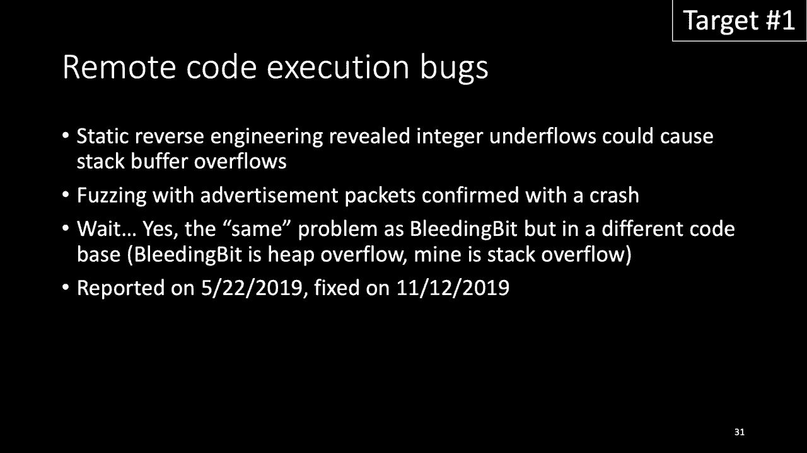

## 攻击场景

让我们看看攻击何时发生。受害者开始扫描，然后攻击者在这里可以发送恶意的广播数据包。正如你所见，这里既不需要认证也不需要配对，仅仅是扫描一个恶意数据包。就这样。

## 汇编代码分析

现在让我们看一下汇编代码。在这个函数中，如你所见，函数为`0x2C`字节分配了栈缓冲区空间。

接下来，我实际上跳过了一些指令，因为它们无关紧要。因为R6值是PDU长度（PDU是协议数据单元长度），我将在下一张幻灯片中展示其格式。

它获取长度值，然后在这里减去6。这里存在一个整数下溢。如果R6值小于6，那么这里的R6会变成一个非常大的数字。下一条指令是无符号字节扩展，这意味着它将消除三个最高有效字节，只留下最低有效字节。

请注意这里。我希望你记住这部分，我强调它是因为当我谈论另一个DoS漏洞时，这条指令实际上起着重要作用。

这里的R6变成了一个等于长度字段的大数字。下一个R1，如果你还记得前面的一张幻灯片，这个R5值包含了缓冲区地址。它作为源地址传到这里。而目标地址是这里的栈地址。所以你看，这里存在栈缓冲区溢出。

## 数据包格式与程序员错误

这就是广播数据包的样子。这个长度字段来自蓝牙4.2规范。这6位到达这里，成为R6值。如果我放入小于6的值，就会发生整数下溢。

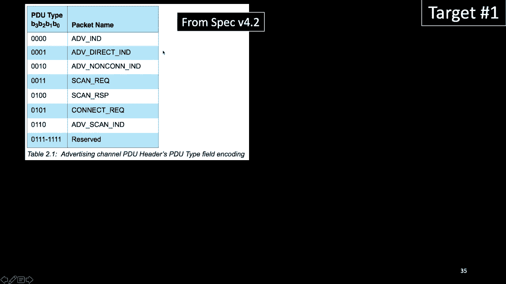

让我们看看程序员为什么会犯这种错误。根据蓝牙4.2规范，有七种广播类型。

它们都至少有6字节的数据。所以程序员可能会想：“好吧，有一个数据包长度，我可以直接减去6。”然而，如果是一个恶意数据包，它的长度可能小于6。

## 开发漏洞利用程序与“安静之地”攻击

现在我开始开发漏洞利用程序。但问题是，由于背景BLE流量，我无法很好地控制堆上下文来制作可靠的漏洞利用程序。

所以我想出了一种攻击方式，即“安静之地”攻击。有很多此类攻击，包括我的一个漏洞。任何成功的攻击都可以是这种攻击。

看这里，有一个攻击者想要攻击这个BLE控制器。但他现在看到附近有很多BLE设备。他想让它们安静下来。他可以使用DoS攻击杀死所有设备。

然后，攻击者最终可以向这个受害者发送恶意数据包。

现在的问题是，我不是真正的攻击者，我不能杀死邻居的所有BLE设备。所以我的解决方案是，我有一个桶，一个油漆桶。

我制作了这个油漆桶的法拉第笼。为了减少背景BLE噪声，这是人工制造的屏蔽层，我用锡纸包裹我的设备。

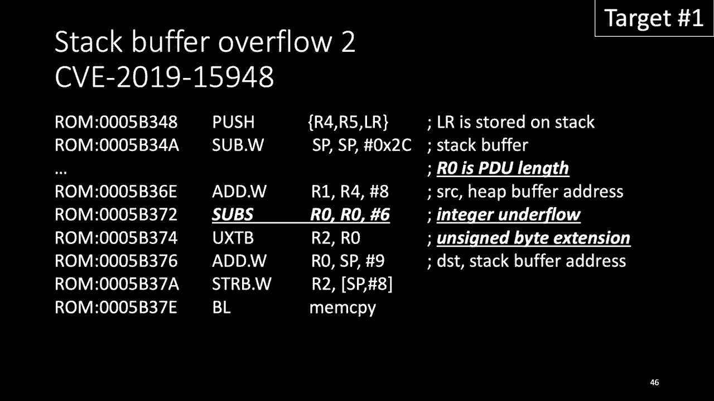

实际上，当我把这些设备包起来放进桶里时，我还使用了Ubertooth来验证背景噪声确实减少了。让我们看一下演示。

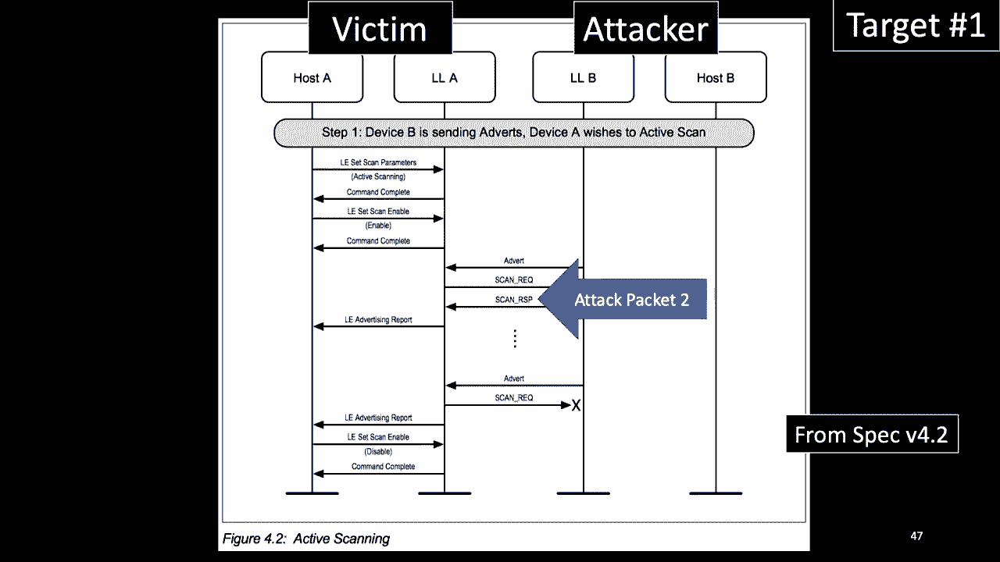

我在这里设置了我的JackBle Nimble，准备攻击这个TI设备。

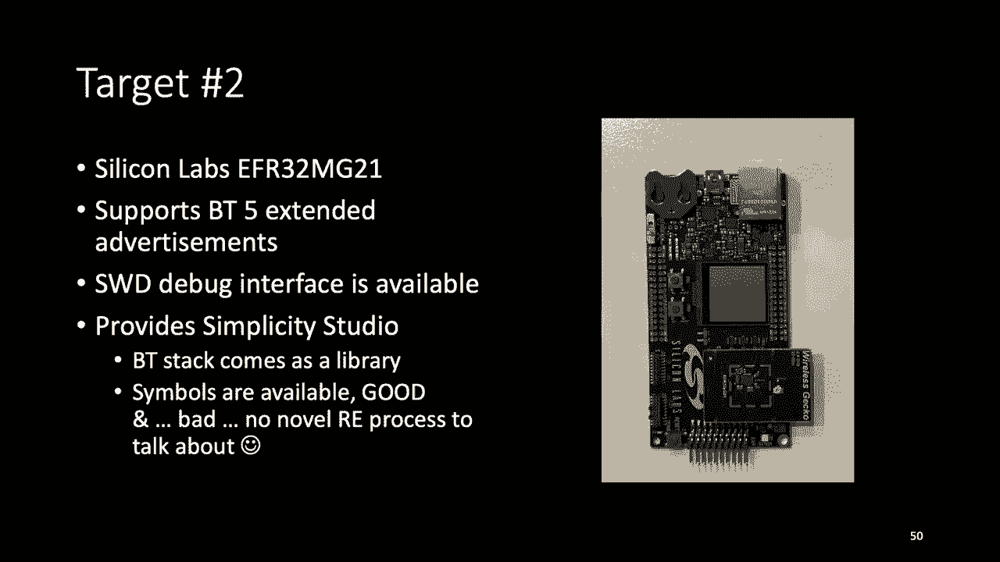

（演示部分无音频内容，此处省略多张演示截图）

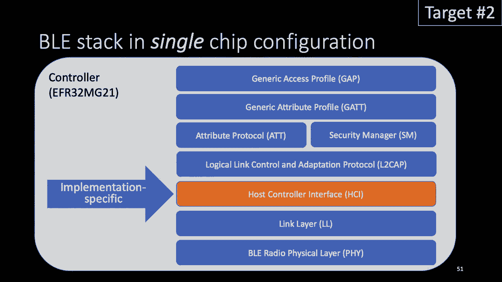

## 总结

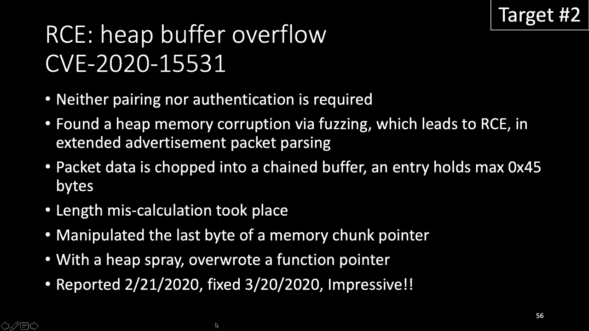

在本节课中，我们一起学习了通过逆向工程发现蓝牙低功耗漏洞的完整流程。我们从搭建研究环境开始，介绍了必要的硬件和软件工具，如开发板、调试器、数据包嗅探工具以及自研的JackBle Nimble模糊测试框架。

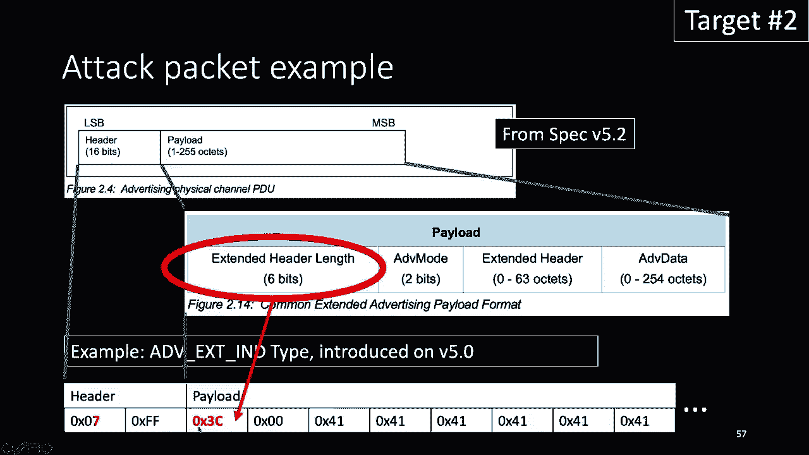

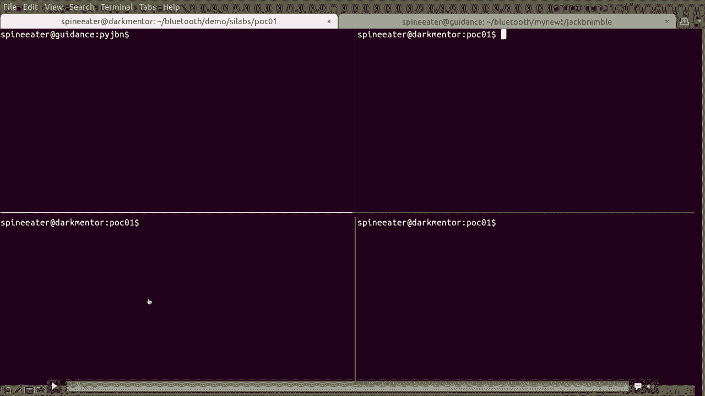

我们深入分析了一个具体的案例——德州仪器WL-1835MOD芯片，展示了如何通过静态分析、动态调试和二进制补丁来理解固件逻辑、识别日志函数，并最终发现一个关键的整数下溢漏洞，该漏洞可导致栈缓冲区溢出和远程代码执行。

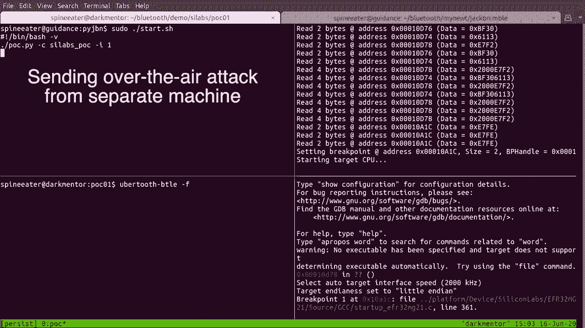

课程还探讨了攻击者为何青睐底层协议漏洞，以及在实际利用中如何克服环境干扰（如“安静之地”攻击）。整个过程强调了在协议规范边缘、长度处理和内存操作等关键位置寻找程序员错误的重要性。

通过掌握这些方法，你可以开始自己的蓝牙安全研究，在物联网设备日益普及的今天，发现并帮助修复潜在的安全风险。