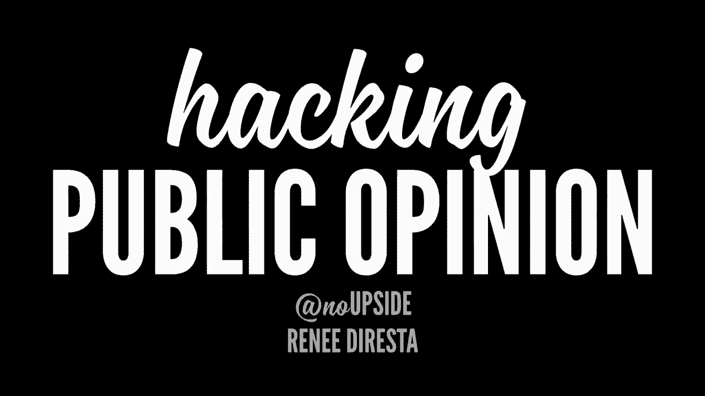
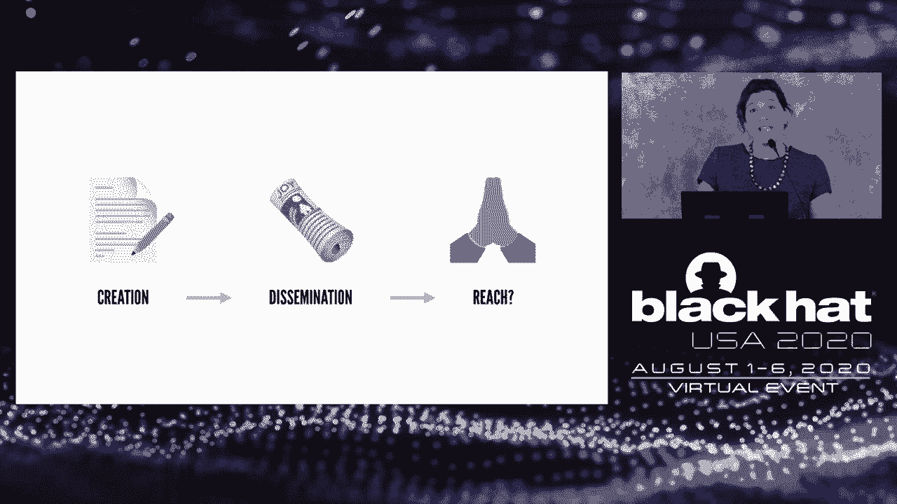
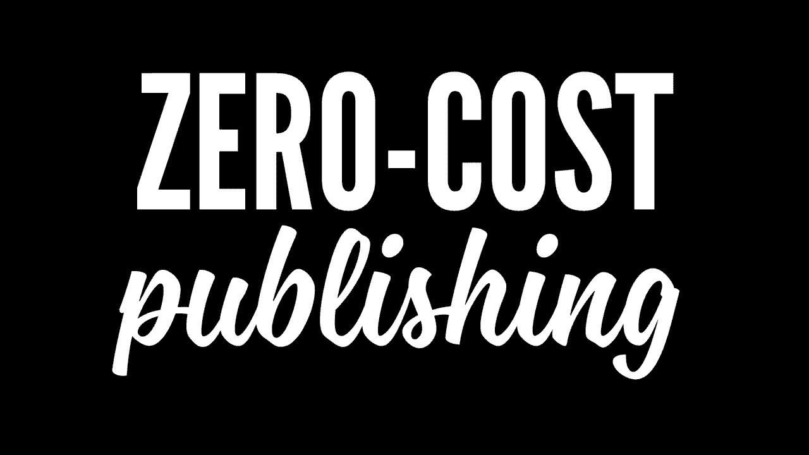
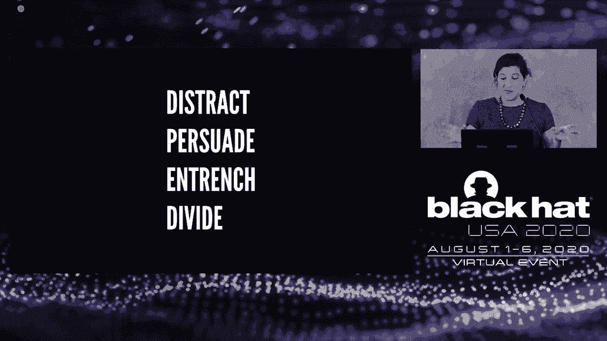
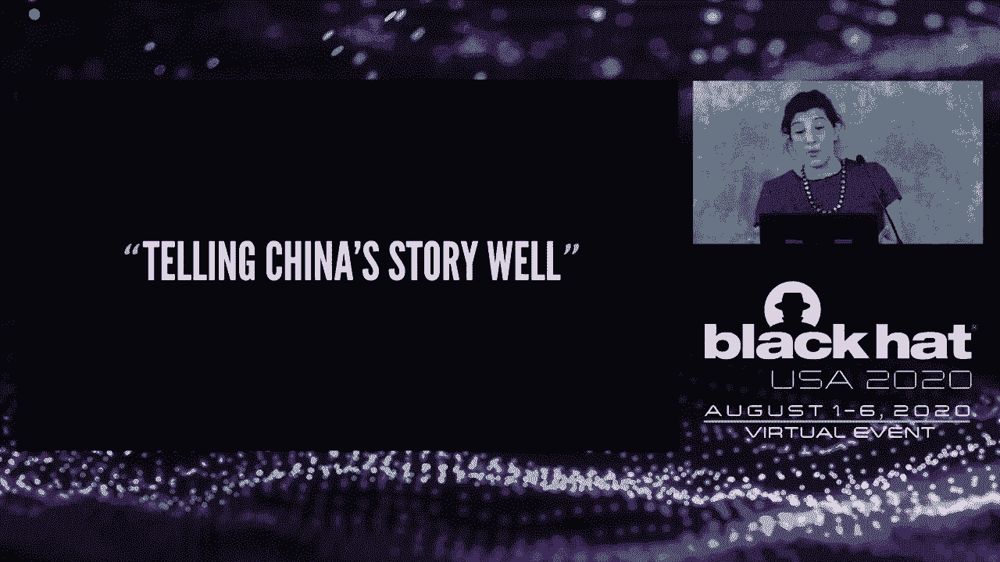
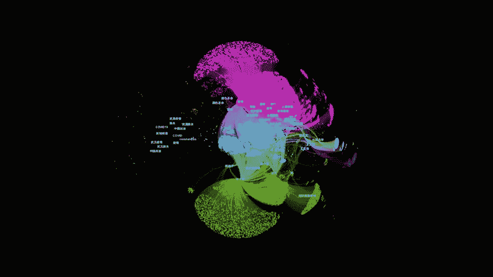
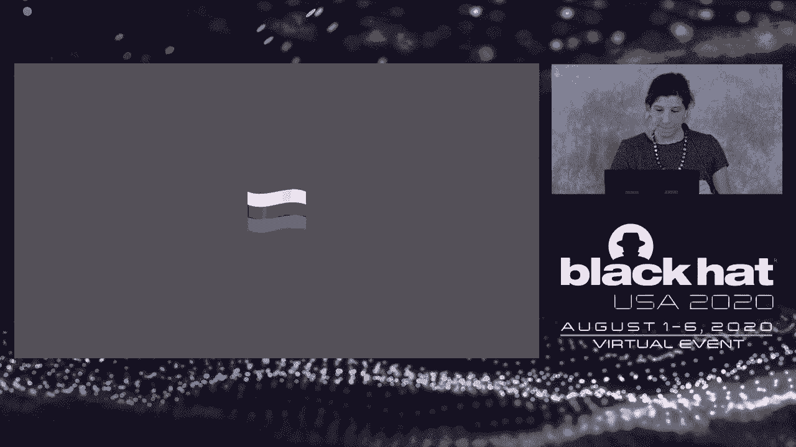
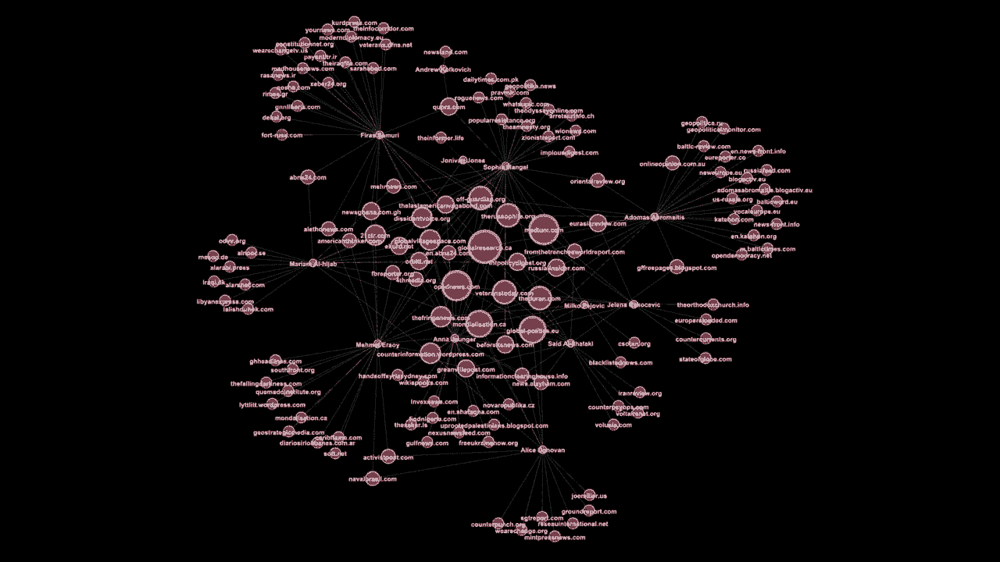

# 课程 P86：87 - 黑客舆论 🎯

在本节课中，我们将学习现代信息战的演变。我们将探讨国家行为体如何利用社交媒体和网络技术，通过一系列从公开到隐蔽的策略来塑造和“黑客”公众舆论。课程将涵盖核心概念、具体案例（以中国和俄罗斯为例）以及这些操作对企业和选举等现实场景的潜在影响。

---

## 核心概念定义

在深入案例之前，我们首先需要明确几个核心概念。理解这些术语是分析后续信息操作的基础。

*   **错误信息**：指无意中传播的错误信息。分享者通常出于告知社区的善意，但信息本身不准确。
*   **虚假信息**：指**故意传播的误导性信息**。分享者带有影响和欺骗的意图，明知信息是错误的。
*   **宣传**：指**带有特定议程的信息**。其目的是说服、分散注意力或促使受众采取某种行动或产生某种感受。宣传不一定在事实上不准确或具有欺骗性。
*   **影响力代理人**：指**为他人服务以影响受众，而受众对此并不知情的人**。他们听命于某个权势人物、情报机构或国家政府。
*   **网络渗透**：这个概念对本课程听众而言无需额外定义，它指的是侵入计算机系统以获取信息或造成破坏的行为。

---

## 信息传播的演变

上一节我们定义了核心概念，本节中我们来看看信息传播方式如何随着技术发展而演变，这为现代信息战创造了条件。

从印刷媒体时代到广播媒体时代，信息创作和传播的门槛逐渐降低，受众规模扩大，但始终存在编辑和财务上的“守门人”。

互联网时代，特别是社交平台的出现，彻底改变了这一格局。以下是其关键变化：

1.  **创作门槛降至极低**：博客实现了零成本出版，任何人都可以创建内容。
2.  **平台解决分发问题**：社交平台内置了受众网络。用户发布简短内容，平台算法自动将其推送给关注者或好友圈。
3.  **算法主导的策展**：在信息过载的背景下，**算法负责筛选、推荐、排名和放大内容**，决定了用户看到什么。这些算法是可以被“游戏”（操纵）的。

综上所述，每个社交平台都拥有庞大的固定受众、精准的定向投放能力以及决定内容可见度的算法。所有这些平台共同构成了一个**低成本、便捷、能全球触达海量用户的社交媒体传播生态系统**。这个系统的结构、功能、政策和设计，为现代影响力活动设定了“游戏规则”。

---

## 从影响舆论到“黑客”舆论

上一节我们了解了社交媒体生态系统如何形成，本节中我们来看看国家行为体如何利用这个系统进行“信息操作”。

当我们将讨论从一般的影响力活动，聚焦到由国家行为体执行、服务于地缘政治目标的**信息操作**时，策略就从“塑造公众舆论”升级为“**黑客公众舆论**”。这意味着使用 manipulative（操纵性）和 misleading（误导性）的战术，来“劫持”前述的技术生态系统。

早在2004年，国家行为体就开始意识到他们也可以利用这套基础设施，将社交网络变成庞大的宣传和虚假信息机器。他们可以：
*   使用**虚假账户**（现代版的影响力代理人）。
*   **操纵算法**。
*   创建**误导公众的前端媒体**。
这些操作可以快速、廉价地执行，因为他们本质上是在按系统设计的方式使用它。

国家行为体开展的宣传活动通常采取以下四种形式之一：
*   **分散注意力**：让目标受众关注其他事情。
*   **说服**：让人们相信某个事实或产生某种感受。
*   **固化立场**：创建专注于特定身份认同的群体，强化人们的既有立场和身份。
*   **分裂**：利用固化立场，凸显不同群体间的分歧，放大现有的社会裂痕。

如果我们用现代互联网的视角更新之前的“创作-传播-希望”模型，现在信息操作的流程是：国家行为体创建人设和内容，将其播种到社交媒体和初始目标受众中，通过算法操纵或大规模发帖进行协调放大，然后**获取有机分享**。这才是内容传播的真正动力。达到一定热度后，主流媒体会进行报道，形成更大范围的传播。

---

## 案例分析：中国

从理论转向实践，我们首先来看中国的案例。中国正在成为信息操作领域的重要参与者。

中国在公开和隐蔽的叙事管理方面拥有数十年的经验，其能力最初是为控制国内信息而开发的，现在正向外扩展。在媒体宣传方面，研究者常用一个“单色谱”的比喻来描述内容的可归属性：

*   **白色（公开）**：如《中国日报》、《人民日报》。明显可归属于中国共产党，属于**公开宣传**。
*   **灰色**：如内容农场（大量发布附和中共论调或虚假政治故事的网站）。其与国家的关联性被隐藏，难以直接归因。
*   **黑色（隐蔽）**：涉及主动误导和**不真实**行为。例如，在Twitter上冒充新闻媒体攻击香港抗议者的账户，后被Twitter归因于中共并删除。

中国信息操作的主要目标是“讲好中国故事”，侧重于**说服**，有时是**分散注意力**。

其完整的频谱信息操作体现在：
1.  **公开宣传机构利用社交媒体**：尽管Facebook在中国被禁，但CGTN等中国官媒在Facebook上拥有数亿粉丝，明显是针对海外受众。它们使用Facebook的广告工具来扩大全球影响力。
2.  **隐蔽的社交媒体活动**：借鉴国内“五毛党”策略，在Facebook和Twitter上使用水军账号和虚假媒体。例如，在2019年香港抗议和2020年新冠疫情等事件中，创建大量账号进行叙事引导。

然而，数据分析显示，这些隐蔽社交媒体活动的**参与度非常低**。例如，2020年6月被删除的一批账号中，92%的粉丝数少于10，平均每条推文的互动数仅为0.81。账号创建仓促，使用批量用户名和库存头像，策略粗糙，更像沙特阿拉伯使用的低质量机器人内容，而非俄罗斯式的复杂操作。

**结论**：中国是一个资源丰富的对手，在某些领域（如广播宣传）能力强大，并致力于改进社交媒体策略。但我们必须清醒评估其实际影响力，目前其社交媒体组件在很大程度上是失败的，不应被夸大。

---

## 案例分析：俄罗斯

相较于中国，俄罗斯在信息操作方面被认为是“业界标杆”。它不仅致力于全频谱宣传，还展示了更复杂的影响力代理人操作、媒体操纵以及网络渗透能力。

俄罗斯同样拥有全频谱的叙事能力：
*   **白色**：如“今日俄罗斯”。
*   **灰色**：如转载GRU（俄军总参谋部情报总局）旗下虚假媒体内容的博客。
*   **黑色**：如冒充美国“黑人的命也是命”活动家的网站。

在社交媒体上：
*   **公开层面**：RT等官媒的页面粉丝数虽不及中国官媒，但**受众参与度却高出一个数量级**。它们擅长制作针对特定区域、意识形态和人口结构的病毒式内容。
*   **隐蔽层面**：“互联网研究机构”（IRA）是关键角色。它制作**以表情包为主的、身份导向的内容**，旨在**固化和分裂美国社会**，而非直接说服。其策略是在左右两派同时创建内容，激化内部矛盾。

IRA的独特之处在于其**影响力代理人模式**。它不满足于发布内容，还积极尝试**招募受众成为行动的积极参与者**，通过私信提供资金和后勤支持，以渗透目标社区。这使线上影响转化为线下行动成为可能。

更重要的是，俄罗斯将信息操作与**网络渗透**紧密结合，形成了“**黑客与泄露**”模式：
1.  GRU（如APT28）黑客入侵公共官员或机构。
2.  获取的材料通过虚假网络人设（如“Guccifer 2.0”）传递给记者。
3.  IRA将这些内容制作成表情包，在国内推动新闻周期，促进在美国受众中的分享。
4.  RT等公开宣传机构报道泄露内容，同时否认黑客身份。

这样，**从网络入侵到隐蔽社交媒体，再到公开宣传，所有信息操纵工具被协同用于一次行动中**，极大增强了效力。

---

## 影响与应对

通过前面的案例，我们看到了国家行为体如何系统性地操作信息。本节我们将探讨其广泛影响以及可能的应对思路。

信息操作的影响是深远的。以美国2020年大选为例，可能面临的风险包括：
1.  **黑客与泄露**：极具新闻价值，能改变竞选期间的新闻周期。
2.  **投票机被黑**：即使未改变投票结果，声称成功入侵也会造成混乱。
3.  **群体渗透与叙事放大**：招募本地人或放大已有煽动性叙事，以破坏对选举合法性的信心。

需要认识到，这些操作之所以能引起共鸣，是因为社会本身存在深刻的分歧、合理的不满、两极分化和对制度信任度低。**一个具有抵抗力的社会系统更难被“黑客”**。

威胁不仅限于政治。企业同样面临风险：
*   与外国政府或公司存在商业竞争的跨国公司，可能遭遇声誉攻击。
*   在敏感社会议题上立场鲜明的公司，可能陷入被恶意放大的社交媒体争议。

对于企业而言，识别和应对这类攻击是一个新挑战，目前通常由首席信息安全官负责。

应对“黑客舆论”的威胁不纯粹是技术问题，也不仅限于社交媒体。我们需要：
*   **将社会和媒体生态系统视为一个整体**，进行更多“红队”演练，主动设想可能的操纵方式。
*   **加强信息安全专业人员与信息操作研究人员之间的沟通**，以更好地理解社交网络操纵如何与网络渗透相结合，从而预测和缓解这类攻击。

---

## 总结

本节课中，我们一起学习了现代信息战的演变与核心机制。我们明确了错误信息、虚假信息、宣传等概念，追溯了信息传播从印刷时代到社交媒体的变化，并深入分析了中国和俄罗斯如何利用全频谱手段（从公开宣传到隐蔽社交媒体，再到网络渗透）来“黑客”公众舆论，服务于其地缘政治目标。最后，我们探讨了这些操作对选举和企业的广泛影响，并指出应对这一复杂威胁需要跨领域的协作和系统性的思维。