# 课程 P87：88 - 心理博弈：利用数据解决人为因素问题 🧠

在本节课中，我们将探讨如何利用数据分析来理解和解决网络安全中的人为风险因素。我们将学习如何预测员工的安全行为，并探索超越传统培训的、更有效的干预方法。

---

## 引言：人为风险——安全领域最大的未解难题

大家好，我是玛莎·塞多娃。今天我将与大家探讨“心理博弈”，即如何利用数据来解决人为因素问题。

在开始之前，我想简单介绍一下我的背景。我16年的职业生涯始于担任专注于俄罗斯网络威胁的防御分析师。之后，我有机会在Salesforce创建并领导安全参与团队，工作了大约五年。在此期间，我专注于组织中所有人为风险因素，并推动人们接受更安全的结果和行为。

我对人为因素的关注促使我在2017年初创立了Elevate Security。如今，Elevate Security是领先的人为风险管理平台。在我的整个职业生涯中，我真正关注的是人在我们防御体系中的角色，以及其在保护组织安全方面的弱点。

我一次又一次地注意到，我们常常是让员工“不得不”去做安全措施。我一直在思考一个问题：如果员工是“想要”去做安全措施，而不是“不得不”去做，那会是什么样子？带着这个问题，我开始探索安全领域之外的概念，如行为科学和积极心理学，这些学科真正研究我们如何以及为何会做出某种决策。

在过去的10年里，我一直在将行为心理学和网络安全领域结合起来，以创建更强大的人为因素防御体系。今天，我想和大家分享我在解决这个问题时的一些观察和见解。

---

## 问题的严重性：人为风险无处不在

我所看到并深信的是，人为风险是安全领域最大、尚未解决的问题之一。让我解释一下原因。

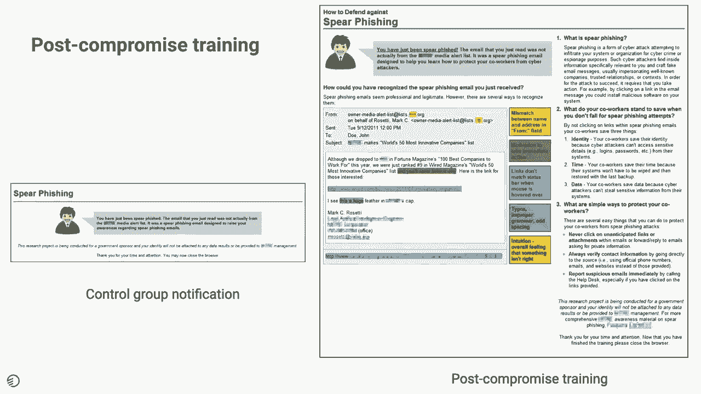

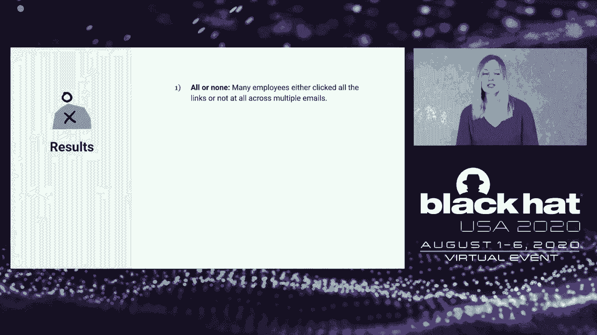

如果你打开今年的《威瑞森数据泄露调查报告》，你会发现人为因素或与人类行为相关的风险，是导致数据泄露成功的主要原因。无论是网络钓鱼、凭证窃取、滥用权限，还是因错误或不当处理敏感信息而导致的意外行为，一次又一次地，人为错误（无论是有意还是无意）都在持续为我们的组织制造重复的漏洞。

今年也不例外。回顾过去五年，你会发现网络钓鱼和凭证窃取一直是我们安全行业试图解决的前三、四、五个问题。为什么会这样？是因为我们没有投入足够的技术吗？还是因为我们没有有效地探索这个问题？

我认为，这是因为人为风险是安全领域最大、未经质疑和未被充分探索的问题。我这么说是因为，如果你走进当今几乎任何一家组织，你都会发现他们采用相同的方法来解决这个问题：那就是让员工参加“一刀切”的年度安全培训。员工们会静音、快进到最后，然后强行通过测验。事实证明，这种方法在解决这个普遍存在的问题上完全无效。

我们目前为员工设定的方法主要是合规导向的，难以衡量其影响，并且是真正的“一刀切”方法。今天，我想介绍一种解决这个普遍问题的新方法，以及我们如何利用组织内已有的数据来理解公认最佳实践的有效性，了解在组织中何处寻找人为风险，并探索超越当今最佳实践的各种有效补救技术。

---

## 一项关键研究：传统培训的局限性

为了开始我们的讨论，我想介绍一项我发现的极具影响力且研究充分的研究。在我们当今的社会和安全实践中，有一种做法叫做“模拟钓鱼”。这项研究找到了一组1500名员工，在几个月内向他们发送了三封有针对性的鱼叉式网络钓鱼邮件。这些邮件声称包含与员工相关的信息。

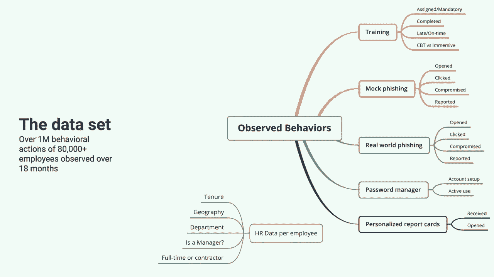

这个练习的目的是，如果用户点击了鱼叉式网络钓鱼邮件，他们会在犯错后立即获得培训；如果没有点击，他们则不会收到任何通知。研究团队期望看到，如果一个人收到这样的钓鱼邮件，他们会怎么做。他们预期的结果是：第一，由于点击后会接受培训，鱼叉式网络钓鱼链接的点击率会降低；第二，人们会增加报告可疑邮件的频率。这是完全合理、符合逻辑的预期和结果。

事实上，这正是我们大多数安全团队目前在实践钓鱼恢复能力时所做的事情。这就是干预措施的样子。对于一组他们选择不给予培训的控制组员工，他们只是收到一个通知，上面写着：“嘿，那是一封钓鱼邮件，你点击了它。”而在右侧，点击后接受培训的小组会收到一封培训邮件，上面写着：“这是一封鱼叉式网络钓鱼邮件。这是你本可以识别它的方法，以及你可以做些什么来保护你的同事。”

他们发现的结果实际上相当令人惊讶。首先，他们发现员工实际上将自己分成了不同的群体：许多员工要么点击了所有链接，要么一个都没点。其次，他们发现员工对第一封收到的邮件的反应表现，是预测他们在接下来几个月内对后续鱼叉式网络钓鱼邮件反应的一个非常好的指标。也就是说，如果你很可能点击第一封，你就更可能点击未来的所有邮件；如果你没有点击第一封，你很可能也不会点击未来的邮件。

至于培训，他们发现培训根本无关紧要。他们发现，当员工点击并接受培训，然后收到未来的钓鱼邮件时，他们是否接受过培训对其表现没有任何影响。那些确实接受了培训的员工在培训页面上只停留了几秒钟，这表明他们根本没有阅读或吸收任何内容。

在阅读这项研究并理解该领域的做法时，我们得出了几个关键问题，希望进一步分析。第一个问题是：如果人们倾向于要么全点要么全不点，我们能否找到预测你作为雇主会落入哪种群体的指标？你会在特定的安全行为（如网络钓鱼、报告、恶意软件感染率）方面成为好的还是差的安全执行者？关于培训，如果培训内容无关紧要且人们会跳过它，我们是否有更有效的方法来创建干预措施，以提高这些技能集并改变员工的行为？

---

## 我们的研究：预测安全行为

我和Elevate Security的团队决定解决这两个问题。在接下来的内容中，我将向大家介绍我们在这两个领域的研究发现。

首先，让我们从“我们能否预测安全行为？”这个问题开始。在深入探讨之前，我想给大家一些关于我们如何进行这项研究以及我们用于分析的数据集的背景信息。

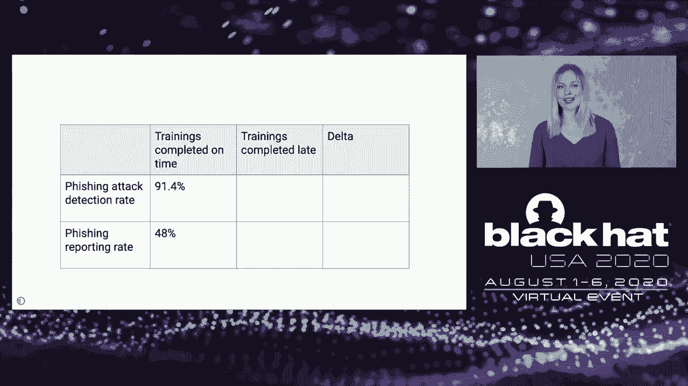

Elevate Security平台与组织已有的现有安全工具集成，这些安全工具映射回员工的安全行为。例如，在恶意软件方面，我们关注的是员工是否下载了恶意软件、是否执行了、是否需要被阻止。在敏感数据处理方面，是否存在已知的违规行为，是否有人发送了不该发送的邮件，是否上传了不该上传的内容。因此，我们关注的是各种不同的行为集。

然后，我们将这些数据与人力资源数据集进行映射，以创建风险映射和热图，显示组织中哪些是好的、哪些是差的趋势。对于这项特定研究，我们观察了全球超过80,000名不同员工在18个月内的超过一百万种不同的行为动作。据我所知，这是迄今为止观察到的关于人为风险的最大行为数据集。

我们观察的行为类型包括几个类别。首先是培训：他们是否参加了培训？是否完成？是按时还是逾期完成？是哪种类型的培训？是基于计算机的培训还是沉浸式培训？我们查看了与网络钓鱼相关的某些安全行为，包括模拟钓鱼和真实世界的钓鱼：员工是否打开了邮件？是否点击了链接？是否造成了危害？是否报告了？密码管理器采用情况：他们是否在使用账户？是否在积极使用？以及个性化的报告记分卡（稍后会谈到）：他们是否收到了？是否打开了？

至于人力资源数据集，我们查看了与员工相关的几个要素：他们在公司工作了多久？他们属于哪个地理区域？是亚太地区、欧洲中东非洲地区还是美洲地区（特别是北美）？他们是否是经理？他们的合同状态是什么？是全职还是兼职？

我们查看数据集的第一件事是：能否根据你作为员工的HR数据来预测好的或差的行为？我们首先研究的是密码管理器的使用：谁最有可能使用密码管理器？我们创建了一个决策树来解读这个数据集。你可以这样理解这个决策树：我们根据最具预测性的属性以及可以对数据进行分组的方式来分割数据。落在左侧的分支表示对问题的回答是“是”，落在右侧的分支表示回答是“否”。

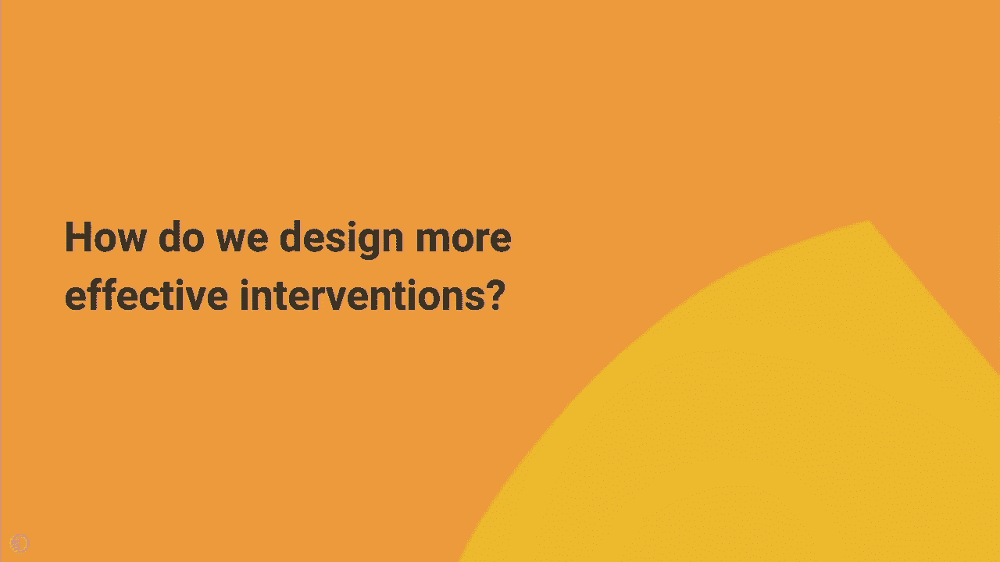

我们分割数据的第一个问题是：你是否在美国境外？然后我们将该数据集进一步分割：你是否在欧洲境外？或者你的任期是否少于两年？接着，我们根据员工池和之前提到的最可能的预测因素，将该数据集按不同的任期分组进行分割。

我们发现了两个类别：最不可能使用密码管理器的群体和最可能使用密码管理器的群体。我们发现，在亚太地区、在公司工作超过1.3年的员工，在我们的数据集中最不可能采用并定期使用密码管理器。而在美国、在公司工作超过1.3年的员工最可能使用。我们发现，地理位置是预测密码管理器使用可能性的一个更强指标（在这个具体例子中是美国 vs. 亚太地区）。而任期虽然也是一个预测因素，但对划分群体的能力影响较小。

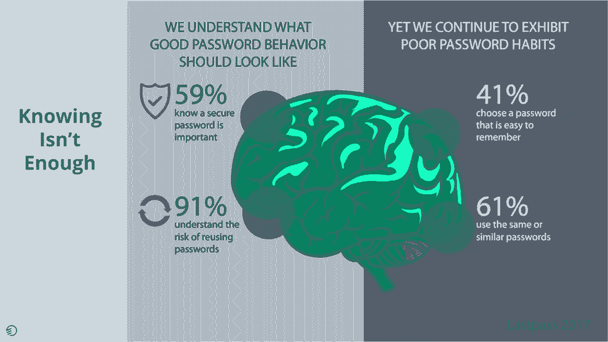

接下来我们研究的是钓鱼攻击：谁最可能成为钓鱼攻击的受害者？类似地，我们创建了一个单独的决策树，并根据几个不同的分割点进行划分。第一个问题是：你在公司的任期多久？是否少于3年？你是否是全职员工？你是否位于美国？然后通过几个属性，包括你是否在亚太地区内外、你的团队规模多大、你的任期多久，我们再次发现了最可能点击和最不可能点击的两个群体。

我们发现，对于钓鱼攻击，最可能点击的是任期短的合同工，且他们所在团队规模较大。最不可能点击的是在美国、在公司工作超过三年但少于16年的员工。在这种情况下，任期是预测对钓鱼攻击恢复能力的一个比任何其他属性都强得多的指标。真正有趣的是，如果你在公司的时间少于三年或多于16年，对组织而言具有同等的风险。

以上是基于HR数据的分析。我们想提出的下一个问题是：员工是否表现出某些行为属性，可以让我们预测他们是否会成为好的或差的安全执行者？我们拥有大量数据集的一个方面是培训完成情况。作为员工，当你被分配培训时，你的响应速度如何？你是按时完成安全培训，还是逾期完成？

我们查看了所有定期按时完成培训的员工，发现他们的钓鱼检测率平均为91%，这意味着他们对钓鱼攻击的平均点击率约为9%。他们报告钓鱼攻击的频率约为48%。相比之下，在我们观察的所有公司和所有员工中，如果你逾期完成培训，你在钓鱼攻击检测和报告攻击方面的表现都更差。

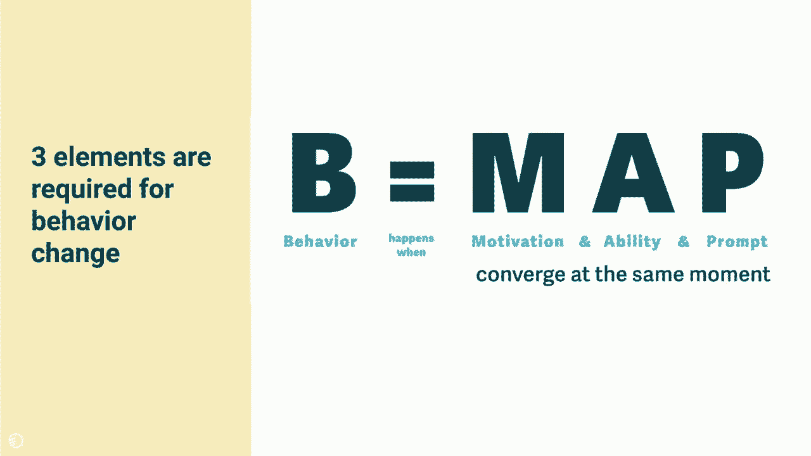

这不是一个关于知识的问题，因为两组人都实际完成了培训。这反映了我认为安全有多重要：它值得我花时间吗？我会在截止日期前完成，还是需要被催促才去做？因此，其中的差异是明显的差异——虽然不是巨大的数字（2%和6%），但它清楚地表明，如果你培训逾期，你在钓鱼方面的表现确实更差，在报告方面也更差。

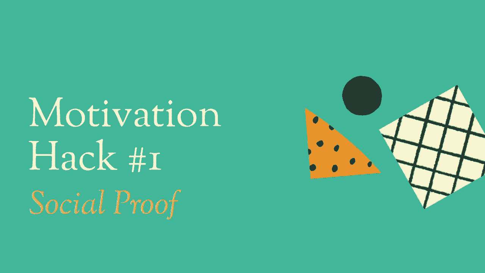

仅凭这一点，这可能只是一个小指标或预测因素，但如果你将其与我们查看的其他属性（例如你所在的地区或你的任期）结合起来，你会发现这些属性存在更常见的群体模式。例如，如果我们观察一组新入职、培训逾期且位于美国境外的员工，你会看到更高的点击率和更低的报告率。

---

## 超越知识：动机是关键

既然我们已经识别了行为上的落后群体以及预测这些安全行为好差的方法，下一个问题就是：我们该怎么办？如何为员工决定更有效的干预措施？

回顾我们本次演讲开始时提到的研究，我们采取的干预方法是培训。我点击了链接，然后我接受了培训。但我们在那项研究中发现，员工并没有花时间消化培训内容，并且在后续收到的钓鱼邮件中也没有应用培训所学。

培训试图为我们解决的问题是知识。我们作为安全从业者假设，如果我们的员工知道得更多，他们就会采取不同的行动。但问题是，仅仅知道是不够的，重要的不是我们的员工知道什么，而是他们做什么。如果我们只看知识，我们发现它只能让我们走一小段路。

LastPass在2017年进行了一项非常出色的研究，他们采访了数百名平台用户，发现很大比例的用户知道什么是安全密码，知道这很重要，理解重复使用密码的风险，然而他们的知识并没有转化为行动。因为当我们查看他们使用的密码时，他们选择了容易记住的密码，并且在很大比例的情况下重复使用它们。因此，我们知道的和我们做的之间的差距是巨大的。

我们一次又一次地看到这种情况，甚至不仅仅是在安全领域。如果知识就足够了，那么每个吸烟者都会收到关于吸烟致命的广告，我们的社会就不会有吸烟者了。然而，这并不是我们今天面临的现实。

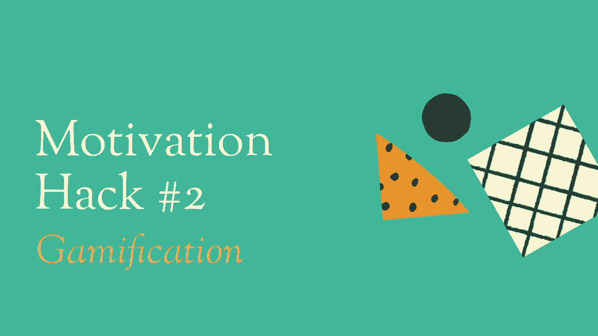

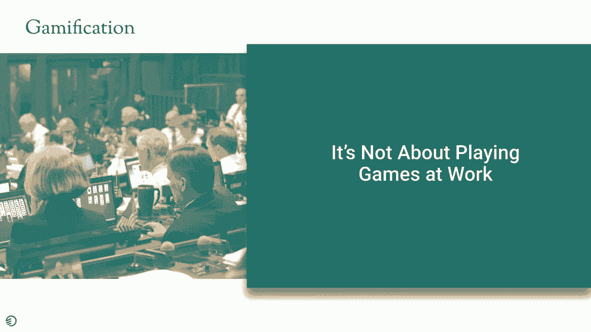

那么，如果知识不够，我们缺少的拼图是什么？我们缺少的是动机。如果我没有动力去学习所需的信息，然后选择应用它，我将永远不会改变我的行为。无论我知道这是一个多么好的做法，我都永远不会停止点击钓鱼链接，永远不会停止报告。

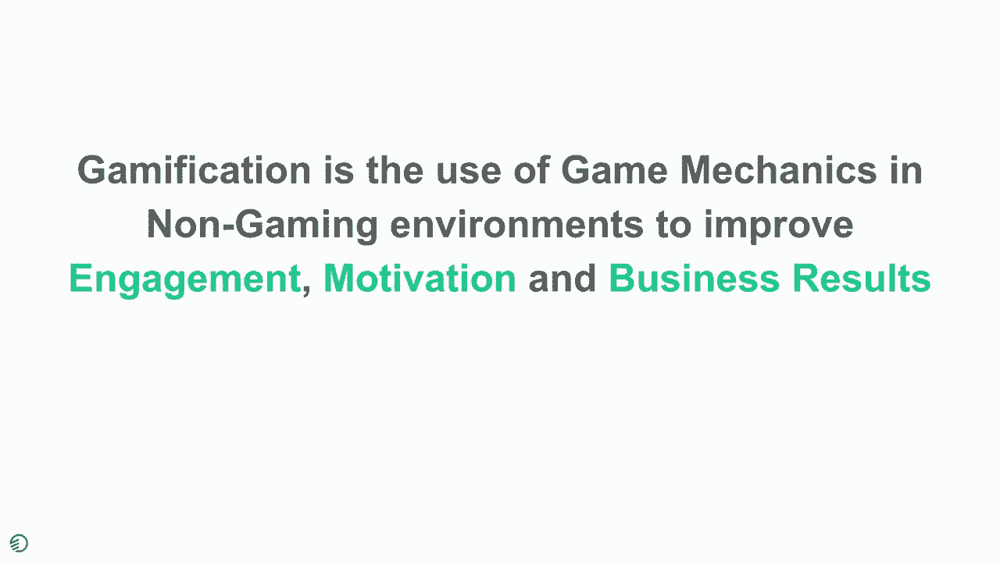

在深入探讨动机在实施中的样子之前，我想给大家介绍一点行为科学理论，以便你理解这如何映射到更大的图景中。在行为科学概念中，行为改变的公式由三件事组成，它们必须同时发生：我必须**有动机**去做某事，我必须**有能力**去做某事，我需要有一个**提示或触发器**来提醒我去做某事。

例如，如果我想去跑步，我需要有减肥的动机，我需要有能正常工作的双脚和合脚的跑鞋，我需要被提醒去做——可能需要朋友过来说“我们去跑步吧”，或者手机上的闹钟提醒“玛莎，该去跑步了”。如果这些因素中任何一个缺失或比例不足，你就不会看到行为发生。我可能有能力去跑步，但如果我不在乎，那也没用，你不会让我去跑步。因此，所有这些都需要在正确的数量和正确的时间存在，行为才会发生。

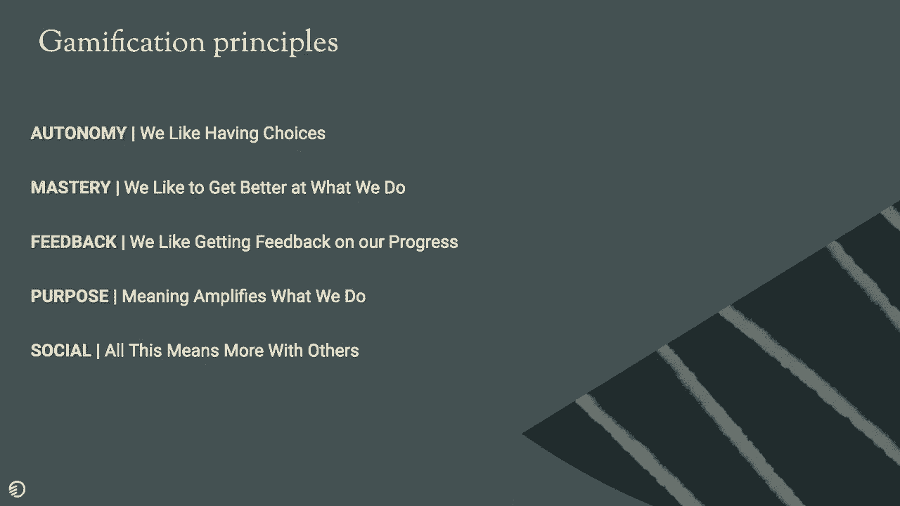

回顾钓鱼培训的例子，我们发现，即使人们有能力，他们也没有动力去做。甚至可能他们既没有能力也没有动力。

---

## 三大动机提升技巧

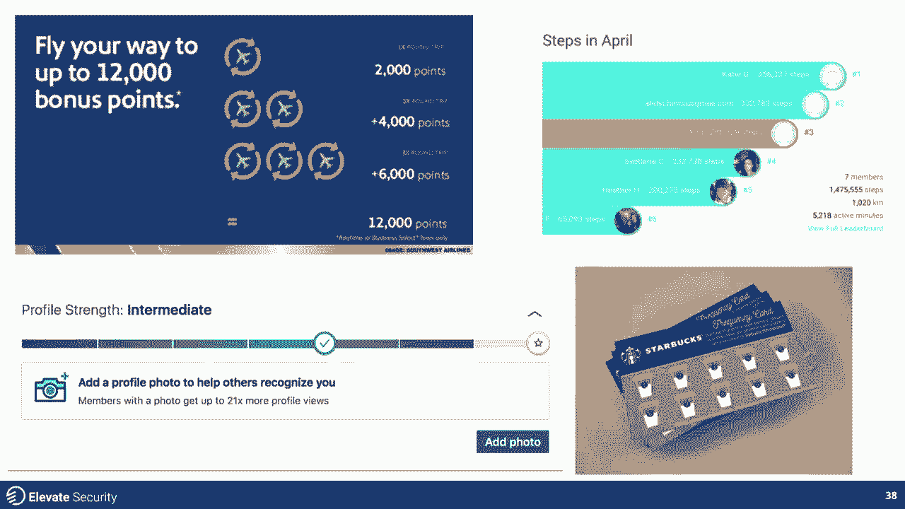

让我们看看如何解决动机问题。我想向大家介绍我们在研究中应用并看到在改变人们行为方面产生惊人影响和效果的三种动机提升技巧。这些都是你可以带回家并应用到你自己组织中的技术。

### 技巧一：社会认同

第一种技巧是我最喜欢的之一，叫做“社会认同”。社会认同出现在我们生活的许多方面。它是我们被亚马逊上的五星评价所影响的原因。它是当我们去酒店预订网站，查看有多少其他人正在看这个房间时的原因。或者你是否知道这个房间一天内被预订了41次？社会认同告诉我们，其他像你一样的人正在做这种行为，这就是良好行为的样子，这就是“正常”的样子。

我们人类来自群体心态，不断环顾四周，以确定什么是可接受的行为？我应该做什么？因此，广告、营销甚至心理学都发现了这一点，并在与普通最终用户的沟通中使用它。我们一次又一次地看到这种情况，激励人们采取行动，比如退房或购买商品。

我最喜欢的社会认同例子之一是能源账单和能源消耗中的应用。O-Power公司开始应用社会认同，将你的能源使用情况与邻居进行比较，让你知道你与最高效的邻居相差多远，从而节省了数十亿美元的能源浪费。

大约两年前，Facebook和佐治亚理工学院合作进行了一项非常棒的研究，该研究实际上追踪了使用社会认同对Facebook平台上多因素身份验证采用率的影响。他们发现，当他们向登录用户展示一个控制提示，写着“嘿，安全对你有好处，请采用MFA”时，有一定数量的人采用了。但当他们为其创建了社会背景，说“嘿，你知道吗，你的108个朋友已经在使用这种安全措施了，你也应该使用”，采用MFA的效果提高了1.36倍。

我们在包括钓鱼报告、密码管理器采用等行为中应用了类似类型的社会认同。通过获取组织中员工行为的数据集，你可以将每个员工的行为与其同龄群体进行比较。当我们将自己的行为与我们认识的人进行比较时，我们更有可能改变这些行为以符合我们的规范。

例如，如果你能向我展示，我通过点击鱼叉式网络钓鱼链接导致计算机受损的次数远多于我所在部门和公司的其他人，我们发现员工更有动力参与进来，不仅仅是想要参与改变他们的行为，而且更有动力参加后续培训。这有助于他们纠正技能。事实上，当我们呈现这类信息时，我们发现参与这种沟通的员工每月参与率超过60%，以跟踪他们随时间的变化。

我们还使用了一种利用名人社会认同的概念。名人社会认同是指当你向我展示某个富有、有名或我认识并敬仰的人正在做某种你希望我效仿的行为时。我们在广告中经常看到这种情况，例如，著名的体育明星使用耐克鞋，我们也想买那些鞋，因为如果对那个人来说足够好，对我也足够好。同样，对于密码管理器采用，我们指出组织中使用密码管理器的最高级别人物，从而为员工创造一种社会规范。他们会说：“哦，这很棒。”这就是社会认同的应用方式。

### 技巧二：游戏化

我想介绍的第二个动机提升技巧是游戏化。在深入探讨游戏化之前，我想澄清一下游戏化是什么以及不是什么。游戏化不是在工作时玩游戏。它常常被误解为“如果我把大富翁带到工作场所，那就是游戏化”，其实不是。

游戏化是分解使游戏成功的要素，并将其应用于商业以提高结果。我们研究游戏机制的原因是，游戏已经发展成为一个价值数十亿美元的产业，它知道如何让人们“想要”做某事，而不是“不得不”做。原因在于游戏利用了人类内在的某些东西。它利用了我们对参与、被激励和玩耍的渴望。

但我们在游戏化和游戏设计的研究中发现，要使某事物（包括游戏）成功游戏化，有五个关键要素。第一个是**自主性**：我们作为玩家喜欢有选择。不要告诉我该做什么，给我向左或向右的选择。这让我对体验有拥有感。**精通**：我喜欢在我所做的事情上变得更好。如果你能给我工具，我将有动力去改进。我们并不总是喜欢赢得关卡，我们喜欢尝试到达那里的过程。**反馈**：我在这个特定行动上的进展如何？我是变好了还是变差了？**目的**：我为什么要做这件事？这背后的意义是什么？最后一点是**社交性**：当我们与他人联系时，这一切都更有意义。

我想向大家展示游戏化在我们日常生活中的样子。它无处不在，无论你是否注意到它。它存在于我们的航空里程积分中。这游戏化了忠诚度。它游戏化了航空公司继续推动我们使用其航空系统的能力，为了奖励、状态、休息室使用权和提前登机，我们改变了购买习惯和飞行模式，以保留更多的奖励积分或里程积分。

Fitbit等设备跟踪我们的步数并与同龄人比较，也是同样的道理。我们努力升级。它通过忠诚卡驱动我们的咖啡购买习惯。你知道，你有一张打10次的卡，第11次免费。我不断得到反馈：我已经完成了9/10。这对我来说，目的是另一杯免费咖啡，但我被游戏化以继续重复一种行为。甚至填写你的LinkedIn个人资料也是游戏化的。看看你有多强，你几乎就要达到那颗金星了，你只需要再做一步——回到反馈，回到精通，达到100%填满个人资料。

这就是我们在商业中使用它的方式。为什么不在安全领域使用呢？

让我展示几种我们看到它发挥作用的方式。在左侧，你看到一个安全强度图表。我们发现这在传达员工安全强度方面非常有效。它可以针对一种行为，也可以针对几种行为组合。但当我们能够向员工传达：“你知道吗？你的钓鱼表现是五分之二？”让它更友好一点，说在一个从“脆弱”到“坚不可摧”的尺度上，你还有一段路要走。这样，我们融入了反馈元素，提供了精通的机会，并给了人们一种目的感。正如你所见，我们需要你达到“坚不可摧”的原因是因为你需要帮助我们保护公司。

因此，不仅仅是说“嘿，参加这个培训”，而是说“这里是你需要做的事情，以成为一个更具恢复能力、安全意识更强的员工”。在最右侧，我们看到一个类似的排行榜。这与我们在游戏中看到的相同概念：你在顶级排行榜上的位置如何？你能围绕行为做同样的事情吗？我们发现这对高管和销售人员来说非常有效。如果你能向他们展示特定行为（以报告为例）的趋势，与像你这样的人相比如何？你在排行榜上的位置如何？

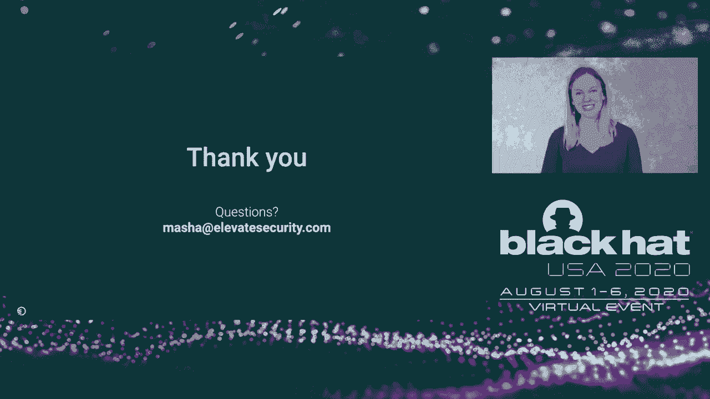

中间一个是状态等级。在游戏中，这可能是我们称之为“连胜