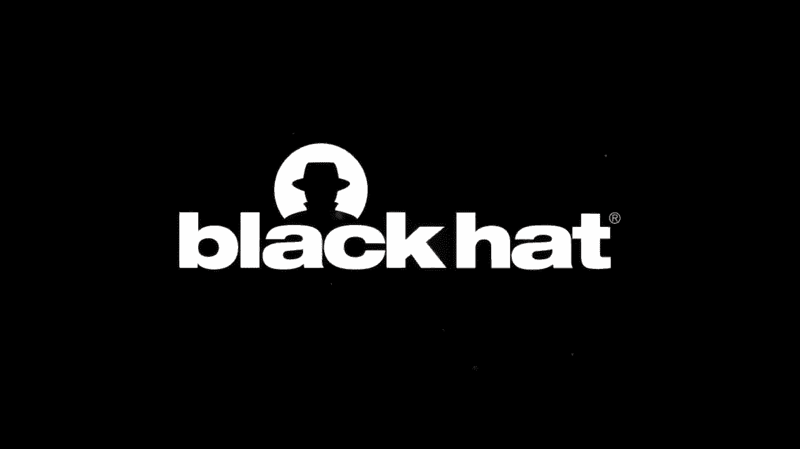
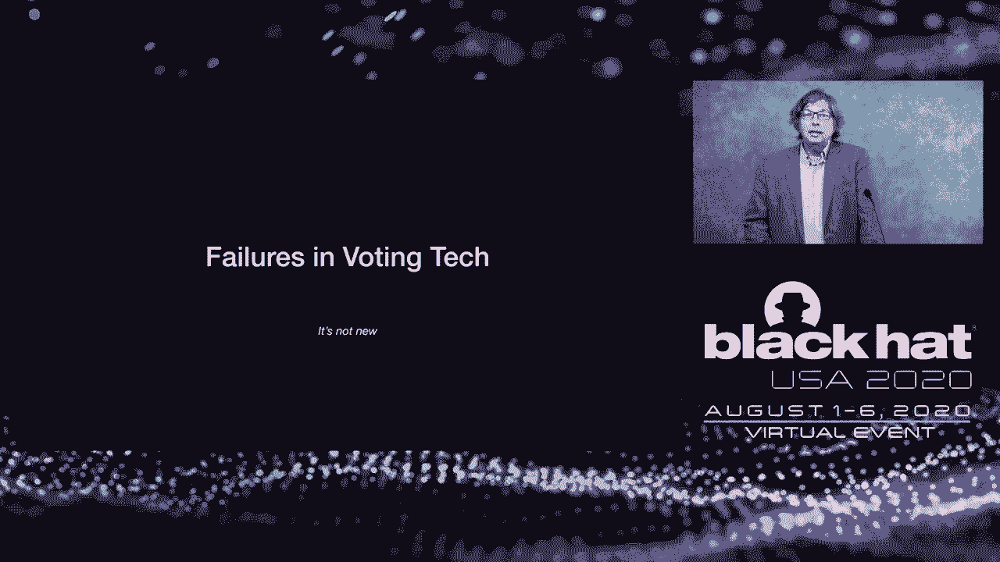
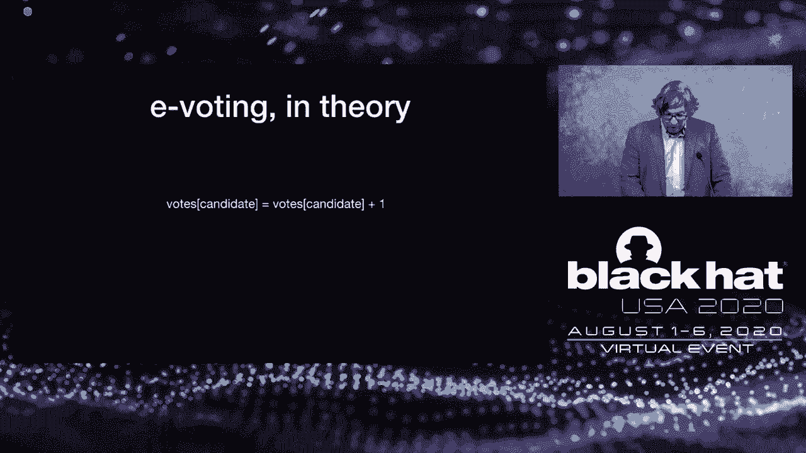
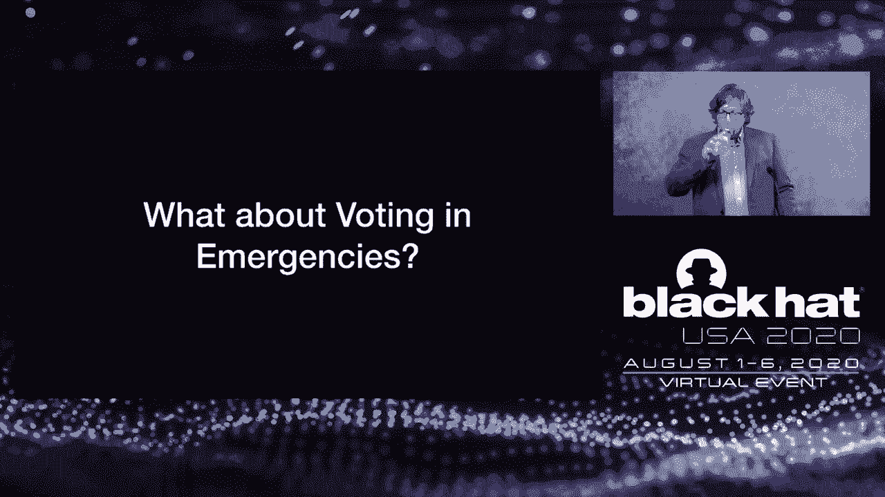
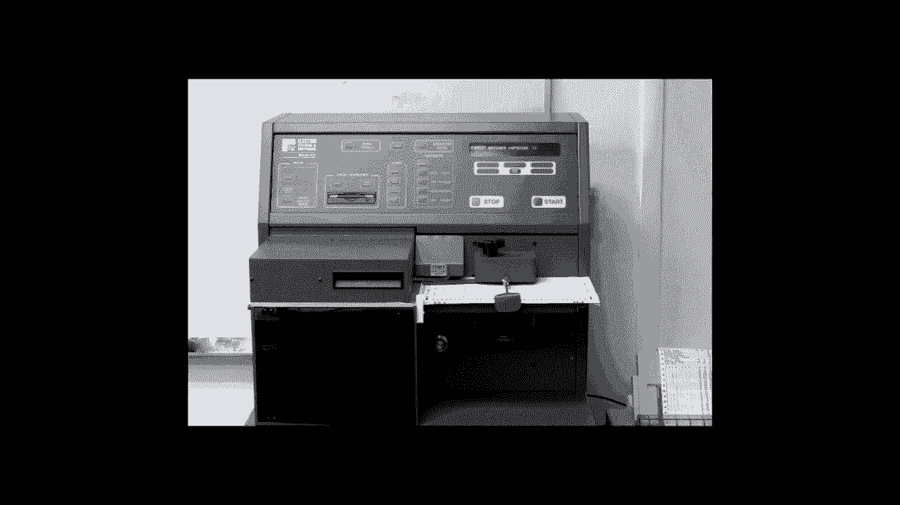

# 课程 P88：89 - 全球疫情下的民主压力测试：选举完整性 🗳️

在本节课中，我们将学习在2020年全球疫情的特殊背景下，如何审视和保障选举的完整性与安全性。我们将探讨选举技术的历史演变、当前面临的挑战，以及如何在紧急情况下确保民主进程的稳健运行。

***

## 引言：技术、安全与选举的交汇

1999年，我们推出了首个SAS安全解决方案。自那时起，我们便致力于逐步扩展我们的云平台，一次增加一个IT、安全和合规应用。最终成果是一个集成的、基于云的IT、安全和运营平台。如今，我们将云平台的统一力量延伸至EDR领域。

***

## 欢迎来到Black Hat USA 2020

大家好，欢迎来到Black Hat USA 2020，这是我们首次举办的虚拟Black Hat活动。尽管今年的活动完全在线举行，但Black Hat团队和董事会已尽一切努力，为大家提供与以往同样高标准的Black Hat内容。这包括近80场已于昨日结束的技术培训，以及涵盖全球最新安全研究的18个轨道上的90场Black Hat简报会。

除了培训和简报会项目，我们还有大量对所有参会者开放的内容。在Black Hat Arsenal中，有近60个开源工具正在演示，我们的赞助商和合作伙伴也带来了许多关于当前趋势和最佳实践的会议。今年的主题演讲和评审委员会锁钥演讲也对所有参会者开放。我们准备了内容丰富的议程，希望大家能享受这次体验。

现在，我很高兴欢迎Jeff Moss发表开幕致辞。在介绍他之前，先简单了解一下Jeff。除了创立Black Hat和DEF CON，Jeff还曾担任ICANN的副总裁兼首席安全官。他是美国国土安全咨询委员会的顾问，也是全球网络空间稳定委员会的委员。请大家和我一起欢迎“黑暗切线”Jeff Moss。

***

## Jeff Moss的开幕致辞

大家好，我是Jeff Moss，欢迎各位参加首届Black Hat简报会虚拟版。今年，我们无法坐在拉斯维加斯，看着我在舞台上穿着闪亮的鞋子，伴随着烟雾机和激光光束。相反，我们将在家里通过屏幕观看。

那么，今年我们为大家准备了什么？我们有一个庞大的阵容。首先，我想延续过去20年的传统，告诉大家今年有哪些来自世界各地的人参与了这次活动，因为他们无法亲自到场。和往常一样，今年有创纪录数量的其他国家参与者。目前有117个国家参与其中，我将列举那些只有……是的，只有30人或仅有一人代表的国家，让大家感受一下活动的规模和范围，同时也鼓励世界各地的人们，无论身处何地，都可以参与安全领域。这确实是一个思想共同体。

以下是国家列表：
*   阿富汗
*   美属萨摩亚
*   安道尔
*   安哥拉
*   阿塞拜疆
*   巴林
*   玻利维亚
*   英属维尔京群岛
*   文莱
*   喀麦隆
*   萨尔瓦多
*   佛得角
*   冈比亚
*   格鲁吉亚
*   危地马拉
*   洪都拉斯
*   冰岛
*   马其顿
*   马耳他
*   毛里求斯
*   黑山
*   莫桑比克
*   尼日尔
*   卢旺达
*   苏丹
*   坦桑尼亚
*   多哥
*   委内瑞拉
*   越南
*   津巴布韦（我希望明年他能带个朋友来，这样我们就能把他从这个名单上移除了）

我们每年做的另一件事是提供奖学金。我们试图找到一种方法，帮助那些在信息安全领域没有高薪工作机会的人，培养技能，找到进入专业领域的途径。他们的途径是什么？因此，Black Hat设立了奖学金，我们出于多种原因免费发放通行证。今年，我们将奖学金分发给了多个不同的组织。

以下是奖学金发放情况：
*   Blacks and Cyber：25份
*   COVID-19 Leaf Scholarship：71份
*   行政女性论坛奖学金：50份
*   学生奖学金：85份
*   退伍军人奖学金（去年新设）：30份
*   安全与隐私领域女性奖学金：40份

总计为本届会议提供了301份奖学金。这太棒了。我为此感到非常自豪，也很高兴Black Hat每年都在扩大这个项目，为我们的社区带来新鲜血液、新想法和更多样性，因为这确实非常需要。

你们中有多少人去年想到，今年会生活在自己的赛博朋克未来中？过去一年，我更多地意识到，我在90年代读到的那些小说，比如诺曼·曼瑟或威廉·吉布森的《震荡波骑士》等经典作品中的场景，似乎正在当下发生。对我来说，最生动的部分是隐私和公民自由的迅速侵蚀，以及网络上威权主义的快速扩张。公司和国家政府之间，无论是在税收、碎片化的互联网、路由还是责任问题上，都在以极快的速度进行斗争。就像其他一切一样，这场疫情加速了我的赛博朋克未来。

我提到这一点，是因为我想提醒大家，我们都是其中的一部分。即使我们只是其中的一小部分，我们构建的技术、创造的东西都将成为那个未来的一部分。这将留给未来的政府和世代去应对。我的意思是，我们至今仍在使用FTP，它已经有35到40年的历史了。我们还没有完全转向IPv6或DNSSEC，而这些技术也已经有几十年的历史了。所以，我们今天所构建的东西，很可能在未来几十年内仍会存在。

因此，当我们在做决策时，请记住这一点：在隐私和安全之间存在权衡。其影响不再是理论上的，而是变得越来越现实。面部识别是最近一场关于隐私和公民自由的斗争。这引出了我的第二个想法：几年前说存在东方和西方，或者开放的互联网与碎片化的互联网，可能听起来有些疯狂。但现在看来，这并不疯狂。你可以看到，在那些奉行西方法治价值观的国家与那些更倾向于威权或政党集中控制的国家（如中国、朝鲜、俄罗斯等）之间，战线正在划定。

我认为现在正在发生的是，技术供应链、社交媒体、收集你数据的方式以及这些数据如何与政府共享，都在迅速重新调整。这种调整速度如此之快，以至于你可能都没有意识到。例如，一家中国公司可能持有一家美国公司的大量股份，他们可能获得一些数据，而这些数据最终可能传回中国，而你却毫不知情。这在最初建立合作关系时可能并未被考虑到。

因此，我认为在未来几年，我们可能会看到美国出台一些关于工业技术转让或工业政策的政策。美国是世界上少数几个没有工业政策的国家之一。现在我们有了白宫的5G战略，我们与华为有一些斗争。我认为在未来五年内，我们将拥有自己的工业政策，然后就会像世界上其他国家一样。

在这场斗争进行、游说者们争斗的同时，我希望大家记住，所有这些决策都需要考虑到隐私、人权和公民自由。因为我相信，最终将会有两种类型的网络：尊重法治的网络和不尊重法治的网络。

那么，2020年的主要战场是美国的总统大选。这里充满了干扰、错误信息和部署的新技术。这就是为什么我们将邀请Matt Blaze作为我们的主题演讲嘉宾。

现在，我很荣幸地介绍一下Matt。我关注Matt的职业生涯已经很长时间了。我最自豪的事情之一是他参与破解警方使用的加密无线电通信，以指出该技术存在的问题。他为公共知识领域做出了巨大贡献，一直致力于公共教育，关心并帮助社区。他是Tor项目的主席，也是四年前与我共同在Defcon创建投票机黑客村的联合创始人。这个村庄产生了巨大影响，并成功说服了几个州改变他们购买的投票机技术。他曾多次向美国国会提供专家证词。他是一位选举安全专家，目前是华盛顿特区乔治城大学计算机科学与法律系的McDivot讲席教授，专注于大规模隐私、密码学和安全性。显然，今年他的时间都集中在选举安全上。

接下来，我们将聆听Matt谈论全国疫情期间的选举完整性。非常感谢您为这次虚拟Black Hat抽出时间。我真的很期待明年能亲自见到您。

现在，我想介绍Philippe Courtot，他是QALIS的首席执行官，也是今年Black Hat简报会的白金赞助商。对于那些不了解Philippe和QALIS的人，他们是Black Hat的长期赞助商，非常相信我们的使命，并且近20年来一直是顶级赞助商。Philippe在2004年因将按需技术引入网络和安全领域而获得了SC Magazine编辑奖。这听起来可能有些奇怪——“按需技术”，但请记住，这是在云计算和SaaS出现之前。随着QALIS的发展，它确实成为了一家开发和提供安全服务的SaaS安全公司。几年后，他开发并共同创立了CSO Interchange，为安全领域的信息共享提供了一个论坛。随后，他被SC Magazine Awards Europe评为2011年度CEO。你可以看到从SaaS前时代到SaaS、云计算，QALIS在每个阶段都在适应。因此，Philippe带来了一定程度的前瞻性视野。正因为如此，我期待他今天上午对大家的评论。

***

## Philippe Courtot的致辞

谢谢Jeff如此精彩的介绍，也感谢您在如此困难的时期保持了Black Hat的精神，我们确实非常怀念必要的人际互动。欢迎大家。首先，我鼓励大家积极参与Black Hat在线平台，并访问商业组织。

现在，我非常荣幸地介绍我们的主题演讲嘉宾，他其实不需要太多介绍。他目前是乔治城大学计算机科学与法律系的McDavid讲席教授，是大家熟知的Tor项目董事会成员，也是一位杰出的密码学家。今天，他将与我们分享在如此严重的疫情期间，所面临的技术、经济和政治挑战。

女士们，先生们，有请Matt Blaze。

***

## Matt Blaze的主题演讲：压力测试民主——全球疫情下的选举完整性

大家好，我是Matt Blaze。首先，非常感谢邀请我今天上午来做这个主题演讲。我将谈论选举安全，这将是一个与四五个月前我会做的演讲非常不同的演讲。我们将讨论在紧急情况和疫情背景下，如何对我们的民主进行压力测试，以及如何思考选举安全。

在美国，技术与选举密切相关。但情况并非总是如此。事实上，美国早期的选举很少使用技术。选举基本上就是把人们聚集在一个房间里，让他们举手投票。当社区里的每个人在选举日都挤进市政厅变得不切实际时，这种方法就不再可行了。因此，在美国历史的早期，我们就开始采用技术机制进行选举。

我们最早使用的技术，也是当时大多数民主国家使用的技术，是简单的纸质选票。人们将选票投入票箱，然后在当天结束时进行计票。你可能不认为这有什么技术含量，但它实际上具有一些非常有趣的安全特性。如果你拿一张纸，没人看它，你把它投进票箱，然后在当天结束时摇晃票箱，并确保你在当天开始时检查过票箱是空的，在结束时是满的。只要票箱本身没有被篡改，你就有很高的信心相信你投的票会被计入，而且你可以很好地观察这个过程。它还带来了一个在举手投票时没有的新特性：选票保密性。没有人能知道你投了谁的票，但只要你相信票箱没有被篡改，计票过程具有高度完整性，你就能确信你的票被按照你的意愿计入了。

这是一个相当有趣且高标准的安全要求，后续的其他技术都必须满足这个标准。在美国大部分地区，我们已经从手工计票的实体票箱，转向了其他更先进的技术，比如机器计票的选票。我们有很多需要投票的事项，我们可能会在某种可以通过机器而非人工进行统计的东西上投票，或者直接在像那些老式的杠杆投票机这样的技术上记录我们的投票。我们还有投票计算机，我们以某种方式借助计算机来投票。

所有这些技术的共同点是，我们对选举结果的信心越来越依赖于我们对所使用的机制的完整性的信心。因此，我们不仅要信任参与选举的人，还要信任我们依赖的选举技术是安全的、具有高度完整性的，并且能真实反映我们的投票方式。

这是一个难题。早在疫情之前我就经常这么说。我已经从事选举安全工作近二十年了。我是一名研究计算机安全的计算机科学家，这个领域充满了极其困难的问题。但我认为，我从未遇到过比公民选举的安全性和完整性更困难的问题。从根本上说，它比你能想象到的或我们做的几乎任何其他事情都要复杂和困难几个数量级。

其中一个原因是，选举的一些要求是相互矛盾的。从技术的角度来看，最大的矛盾在于我们有两个相互冲突的要求，改进其中一个会损害另一个。这两个要求是**保密性**和**透明度**。我们希望无法发现别人如何投票，甚至无法在胁迫下向他人证明我们如何投票。但我们也希望透明。我们希望确信我们的投票被按照投票意图计入，并且整个系统对其他人也是如此。因此，我们有一个要求说你不能发现任何关于某人如何投票的信息，另一个要求说你希望能够审计一切，并确保每个人的投票都被按照他们的意图计入。当你思考实现这一目标的方法时，装有纸片的票箱似乎做得相当好。除非你开始变得非常聪明，否则几乎没有其他方法能接近这个标准。

但这并不是选举的唯一难点。另一个难点是应用本身的严苛性。特别是，如果你发现了违规行为，几乎不可能重新进行选举。选举必须在某个日期前得到认证。即使你发现了广泛的违规行为，重新进行选举的后果以及在当选者就职日期之前再次组织全州或全国选举的后勤困难，使得这几乎是不可能的。

接下来，我将从法律和结构的角度谈谈美国的投票是如何运作的。我们想到总统选举，这是联邦职位，也是每个人都在想的，尤其是11月的大选。这当然是我们最关注的选举。但实际上，联邦政府在投票过程和机制方面的实际参与非常少。联邦政府设定了相当宽泛的标准，主要是在宪法中。国会有权制定法律，但通常不愿行使。在实践中，每个州都制定自己的规则、法律，并对自己州内进行的选举有自己的要求。在大多数州，选举实际上是由地方政府（通常是县）来运行的。为了让你了解其规模，美国有超过3000个县。如果你加上负责为其居民进行选举的乡镇和其他政府实体，那么有超过5000个政府实体负责选举的一切事务。因此，没有一个单一的地方可以在全国范围内改变一切。此外，当我们亲自投票时，我们通常是在我们所在社区的投票站（称为选区）投票。每个县、每个政府内部可能有数百甚至数千个选区。这是一个规模相当大且非常分散的运作。

就不同竞选的数量以及人们（即使在同一县内）可能看到的不同类型的选票数量而言，美国选举是世界上最复杂的。每个人都投票选举总统，每个州的人都投票选举他们的州参议员，但我们也有非常地方性的选举，比如学区选举等等。因此，即使在一个选区内，不同的选民最终也可能得到几种不同的选票。所有这些都必须由通常资源非常紧张的地方政府来管理。一般来说，选举是由县预算支付的。因此，当我们谈论投票系统和选举管理时，我们是在与道路维修和消防服务等事项竞争资源和预算。

为了让你了解其规模，2016年大选中，美国有近117，000个不同的投票站和178，000种不同的选票。有一个庞大的临时工作人员队伍，每个投票站大约有4到10人（取决于当地情况），他们大多只在选举日当天工作，并接受一两天关于选举程序的培训。当你亲自投票时，他们可能就是你的邻居。2016年，全国共投出了1.388亿张选票，约占合格选民的60%。如果你还记得2016年，那是一场竞争非常激烈的总统选举，大约60%的投票率，这在美国标准下被认为是相当高的。其中，约17%是通过提前投票亲自投出的，约24%是通过邮寄投出的，剩余的8200万张选票是在当地选区亲自投出的。因此，我们主要是亲自投票。这是全国大部分地区的普遍做法，尽管有些州更依赖或几乎完全依赖邮寄投票。但每个州都允许某种形式的邮寄投票，比如缺席选票等。

那么，这一切有多安全？有多可靠？有多稳健？风险非常高。衡量风险的一种方式（我喜欢的方式）是，想想用于进行政治竞选活动的资金数额，这远远超过了我们实际进行选举所花费的资金。因此，那些花钱影响你投票方式的人，比那些试图确保一切顺利进行、每个人都有机会投票并且选票被正确计入的人，拥有更多的资源。

传统上，我们担心腐败的候选人及其支持者做一些事情，比如购买选票、增加选票、从票箱中取出选票或干扰计票。我们有很多机制使这在实践中变得困难，事实上，通常也确实很难做到，尽管我们会稍微谈谈技术如何影响这一点。但更令人担忧的是，这些系统旨在防范这种传统威胁，但在2016年之前，我们并未真正大规模考虑过另一种威胁：外国国家对手。外国国家对手与传统选举系统中的攻击者有些不同，因为他们可能不想选择赢家。他们可能仅仅满足于扰乱整个进程，质疑结果的合法性，或者使人们难以投票或知道谁赢了。这是一个更容易实现的目标，并且可能有许多不同类型的攻击方式，而不仅仅是那些你想实际选择赢家的攻击。

因此，我们必须问的一个好问题是：考虑到这个非常广泛的威胁模型，我们想要使用的任何特定投票技术是有助于制造麻烦，还是有助于防止麻烦？它是让我们更可靠还是更不可靠？答案往往是两者都是。所以，这通常不像说这项技术完全好或这项技术完全坏那么简单。这通常是一个权衡和风险建模的问题。

让我们谈谈投票技术可能如何失败。这不是一个新问题，甚至不一定与计算机技术的引入有关。

你可能从2000年佛罗里达州重新计票中认出了这张图片。这是一位非常有耐心的选举法官，正在仔细检查一张选票，以确定选票上打出的孔是否反映了机器计票的结果，并试图通过观察这个物理制品来更多地了解选民的意图。这张图片有趣之处在于，当时它每晚都出现在新闻中，全国每家报纸、每个新闻节目都有这样的图片，展示了佛罗里达州使用的技术是多么过时，以至于不得不诉诸于此。但事实上，我认为这张照片的意义现在已经发生了逆转，我们现在可以把它看作不是这个系统弱点的例证，而是这个系统优点的例证。因为一个人，尽管眼睛可能很疲劳，但可以看着选票，更好地了解选民实际想做什么。我们可以讨论和争论这个标记是给一个候选人还是另一个候选人，并就选民的意图达成一个人性化的共识。我们不必盲目依赖技术告诉我们的东西。我们可以运用自己的判断，也许能做得比技术的局限性更好。

想想佛罗里达州出了什么问题，这很有趣。佛罗里达州的投票机实际上并没有涉及计算机，只有制表机涉及计算机。事实上，它甚至不使用电力。投票亭里唯一的电力是用来点亮灯泡，以便你在投票时能看到自己在做什么。这是一个打卡系统，选票会被插入一个带孔的小屏幕后面，一张纸模板会告诉你哪些孔对应哪些候选人。这项技术的有趣之处在于，你有一个小触笔，你会在与你选择的候选人相关的位置上打一个孔。但随着时间推移，与你选择的候选人相关的、从选票上打出来的小纸板片会开始在那个候选人选择的位置后面堆积起来。在正常情况下，这不是什么大问题，因为后面有足够的空间。但如果你在当天晚些时候有大规模的投票率，那么为更受欢迎的候选人投票实际上会变得物理上更困难，因为他们会有更多的纸板片。因此，你无法像这里第68位那样打出一个大孔，而只能像中间那样打出一个凹痕。制表机通过光线穿过每个位置来读取，它不认为你投了任何人的票，因为它仍然是不透明的，尽管一个人看着它很容易就能看出，哦，是的，你试图在那个位置打孔。另一种可能性是，你打出了一个小的活页，当选票堆叠在一起时，这个活页在放入阅读器时可能会闭合。结果是，我们花了很长时间，不得不进行繁琐的重新计票，最终因为最高法院裁定选举需要得到认证而中途停止。这引起了争议，虽然获胜者对