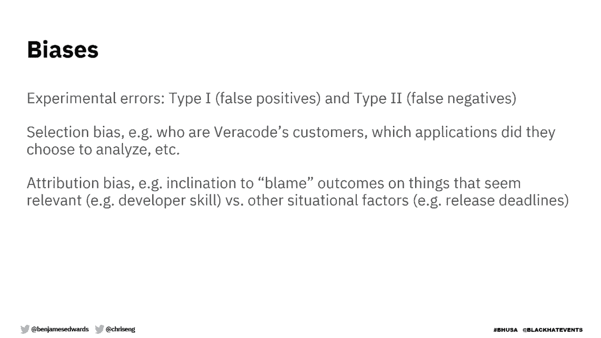
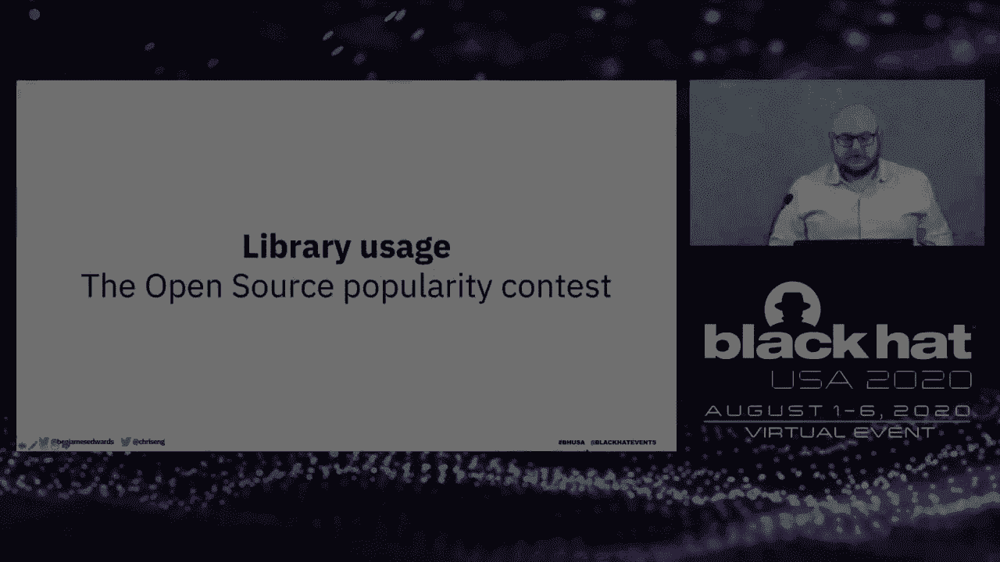
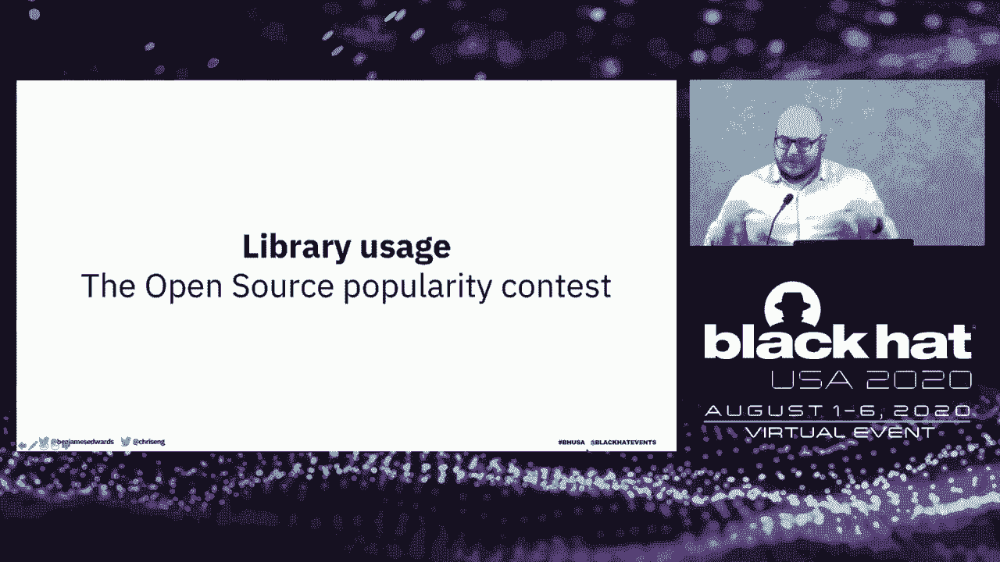
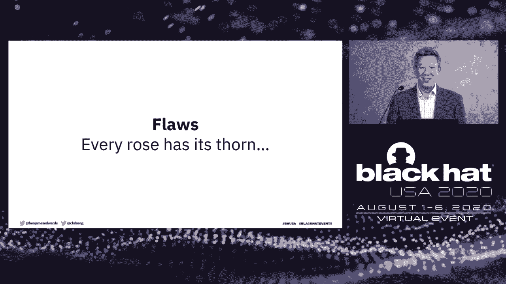
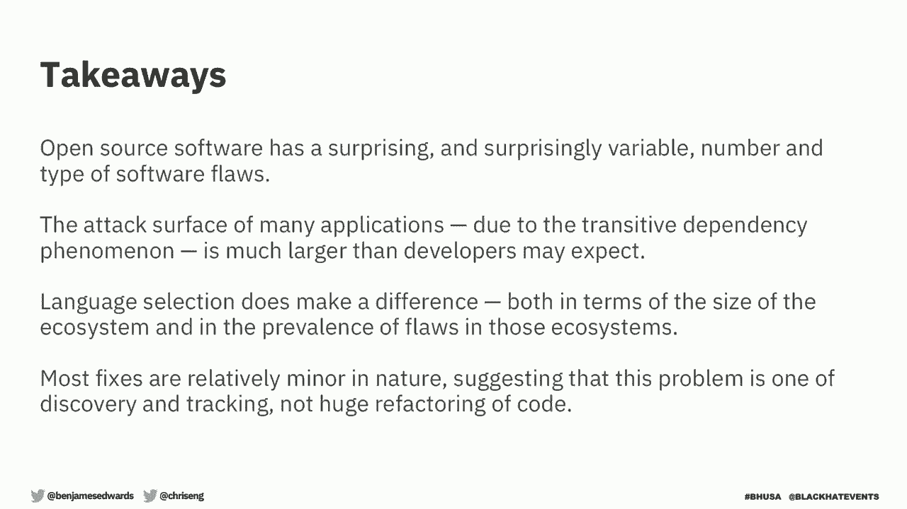

# P89：90 - The Devils in the Dependency Data Driven Software Composition Analysis - 坤坤武特 - BV1g5411K7fe

 Most of you have probably heard the analogy that open source is free as in， puppy。 That is。

 you're responsible for the care and feeding and there's often。

 times a lot more work than you realize。 When you build software using open-source， libraries。

 you get the good along with the bad。 You get the functionality that。

 you wanted so you don't have to reinvent the wheel but then you also get all the。

 vulnerabilities that are inherent in that code base。 Today we're going to talk。

 about software composition analysis。 Specifically， what does real-world。

 software look like from the purpose from the perspective of library usage and， inherited risk？

 We'll use data science to uncover some new quantitative insights。

 on how open-source libraries impact application risk and we think you'll be。

 surprised by some of the findings so I'm going to start with a quick preview。

 Here are some of the things we're going to show you today。 Even the smallest， library。

 162 lines of code， can introduce flaws into your application and there。

 are a lot of small libraries in the JavaScript ecosystem。 Most libraries are。

 not even directly included but they're actually included by other libraries。 In other words。

 one library will include another which may include another and。

 that's something that developers often don't realize。 We'll show you that more。

 libraries doesn't always mean more problems。 You can actually build an。

 application with hundreds sometimes thousands of libraries without introducing。

 a ton of vulnerabilities。 There are a lot better ways to prioritize fixes than by。

 severity alone so we'll show you a few different techniques that you can use。

 to make sure that you're fixing what matters most。 And then finally we'll show。

 you that 81% of patchable vulnerabilities can be fixed with a minor。

 library update and most updates are small even when one update may introduce a new。

 vulnerability which then you have to patch again and create this chain so。

 we'll do some analysis of that as well。 A little bit about us。 My co-presenter Ben。

 senior data scientist and scientist， Spent his whole career in data science。

 I'm Chief Research Officer at Veracode and I've sent my whole career in。

 application security and so that's why we think you should spend the 40 minutes。

 listening to us today。 All the data in this report comes from the Veracode。

 State of Software Security which is something that we release annually since， 2010。

 We take all the customer data from the scans that we do for our， customers。

 we anonymize it and then we report on trends that we're seeing in， application security。

 As that data set has gotten larger and larger we have。

 teamed up with the SCIENTIA Institute who is specifically good at doing data。

 science on cybersecurity data and so they've helped us with the last few， editions of this。

 These reports give us and the readers insights into industry， performance。

 It allows our customers to benchmark themselves against their peers。

 and it gives security practitioners and developers advice for improving app， sec。

 One other note is that this talk includes more than what's covered in the， report。

 We did this update chain analysis which was not in the report so。

 that's going to be tagged onto the end。 Also we've made a point to tag every chart。

 or figure that we've used that was from the report so that you can cross。

 reference it back if you happen to go read the real report。 You can grab the。

 report on the Veracode website or on the SCIENTIA website。 So today's agenda。

 We'll go over the data sources for the study and some inherent biases。 We'll talk。

 about library usage both direct and transitive。 We'll talk about the flaws。

 that we saw in those libraries and some of the patterns that we uncovered。 Then。

 we'll get into that funnel of fixed prioritization。 How do you get at that。

 huge amount of fixing and patching to do in the most appropriate order？ And then。

 what do those update chains look like when one library patch introduces a new， vulnerability？

 As far as I know this is the largest known quantitative study of。

 application security findings anywhere out there and it has been since its， inception。

 This particular report covers 12 months and that includes 85，000， unique applications and 351。

000 unique libraries。 Any report based on data that。

 comes from an automated testing tool is going to have certain biases in it and。

 so I want to acknowledge those。 There are always going to be false positives。

 That's things that the tool finds that are not actually there and they're going。

 to be false negatives。 Problems that are there that the tool is unable to detect。

 Then there's selection bias。 As I mentioned this data set is based on Verico's， customers。

 So anybody who's not a Verico customer or who doesn't take。

 application security seriously enough to be using a tool is obviously not， included。

 Customers also choose which applications they want to analyze so， that gives a bias as well。

 Finally there's an attribution bias which is more of， an interpretation。

 As you're reading the report， as you're watching this， presentation。

 you may have the inclination to blame the outcomes that you see on。

 things that may seem relevant but are not actually the reason why things happened。

 So another way of thinking about this is that we can tell you about what we see。

 but we can't always tell you why。 We can speculate on that。 So now that the。

 disclaimers are out of the way， I'll hand it over to Ben to start diving into the， data。

 Thanks for that introduction Chris。 I'm really excited to be here。 This is my。

 first Black Hat briefing and remarkably you know I wish it could be under。

 different circumstances but I'm really excited to talk to you about the research。

 we have today。 So the first question we need to ask when we're thinking about。

 library usage and the security implications of that is exactly how these。

 libraries are being used in applications。 And so the most basic question is just。

 how many libraries get included in an application。 So let's look at this first， chart here。

 Along horizontal axis we have the number of libraries included in an， application。

 Notice that it's on a log scale here。 So equal distances apart here。

 imply orders of magnitude gain rather than kind of a constant gain。 We do this。

 sometimes so we can have a better idea of widespread distributions when things。

 get really disparate lot of variance。 And then the dots here represent how many。

 libraries get included in an application at various levels。 So on the far left。

 side the blue dots this is the 10th percentile。 This means that about 10% of。

 applications have less than that blue dot number for specific language。 And the。

 right hand side the yellow dots these are applica- this is the top end the， 90th percentile。

 So about 10% of applications have more libraries than this。 And the middle is the geometric mean。

 You can think about this like the median。 It， gives us a good idea of kind of the typical application but it's robust to。

 that big variance we see here。 So there's a few things we want to point out。 So first。

 of all there's just a large spread large difference among languages。 So you have。

 languages like JavaScript where it's typical to have hundreds of libraries。

 included in an application。 And on the upper end sometimes thousands I think the。

 top end is something like a couple thousand libraries get included in a， single application。

 Whereas other languages like Python。net these have a， couple dozen。

 And so this really illustrates kind of the philosophy and。

 the culture that's built up around these languages。 Whereas you have。

 JavaScript and Ruby which kind of have smaller libraries that have single， functionality。

 So they're they're putting in the wrapping up a single function to， a package that gets pulled in。

 Whereas these other languages are kind of more， complete you have families of functions together that get wrapped up in a library。

 that get imported。 So both of these have security implications。 So with lots of。

 small packages you're potentially bringing in lots of code developed by。

 lots of different people increasing that risk surface。 But even with the kind of。

 more unified packages you may be pulling in things that you don't need。

 functionality that exposes that risk surface potentially。 So kind of both ends。

 of these things neither is better than the other but they both have their， security implications。

 Now the obverse of this is how popular are some， applications how many or how popular are some libraries。

 So how many applications， use a specific library。 So for this visual along the horizontal axis we have。

 the percent of applications that are using any particular library and the dots。

 here are actually individual libraries。 The color of the dots indicates kind of。

 how dangerous they are and Chris is going to go into this more a little bit， later。

 But the dark blue indicates that there's no known flaws the kind of gray。

 blue there indicates we know there are some flaws。 The light blue means there are。

 flaws and there are proof of concept exploits for those flaws。 And the yellow。

 means we've actually seen those exploited in the wild。 So again we've。

 broken it up by language here。 JavaScript the odd duck out here at the top again。

 We have libraries and JavaScript that are used in more than 90% of。

 applications which is just really remarkable that there are libraries out。

 there that it's almost guaranteed that it will be included in an application。

 We're going to talk specifically about what those are because JavaScript is such a， strange duck。

 And then as we kind of go down we see things like dot net and。

 swift at the bottom there where even the most popular libraries aren't even used。

 in half or in the case of swift like a third of applications。 So there are no。

 must-has for those but of course you know JavaScript and Ruby in the middle we。

 have lots and lots of libraries that are used very very commonly。 And so kind of。

 as an illustration let's take a minute to talk about JavaScript。 Because it is so。

 weird we really need to talk about it and get an idea。 So on the right-hand side。

 here you have the top 10 libraries used in JavaScript。 And notice that top one， inherits used in 92。

3% of applications and even like the bottom of the top 10 is， used in 83% of applications almost 84%。

 So what we really want to do is kind of， dive in and think about these and do a little bit of a case study。

 So as we know， JavaScript applications are incredibly small， incredibly numerous。 I like to think。

 about left pad。 That was an incredibly small library。 All it did was add， characters。

 pad out of string for in JavaScript。 A developer pulled it off。

 GitHub and broke like half of the internet。 And so that's kind of the same， thing we're seeing here。

 Really small libraries particularly the top three all， have less than a thousand lines of code each。

 And in fact that top library， inherits only has 36 lines。

 And what all that does is is replicate some， functionality that's in jQuery。

 And if it's not available from jQuery natively it， reimplements it。

 The other ones have less than a thousand lines of code。

 Debug and MS we're going to talk about them a little bit more in a second。

 Is array which is makes this top 10 at six only has four functional lines of code。

 and does exactly what you think。 So again these are getting pulled into。

 applications really frequently。 So that's not to say that even though they're。

 really small that they're not prone to flaws。 In fact the top the two and three。

 libraries debug in MS have versions that have known flaws with CVEs。 They're。

 both denial service CVEs and they're both you know these are really popular。

 libraries that get pulled in a lot。 And they have flaws even though they're only。

 790 and 162 lines respectively。 So it is certainly something that we need to。

 think about that even if you have small functionality that's wrapped up in a。

 package you could be increasing your risk surface by bringing it in。 So when。

 I've been talking about this so far as the popularity of libraries and。

 libraries that come into applications I've been glossing over a big thing which， is versioning。

 So on that previous slide I'm treating all versions is the same。 So if。

 any version of is array gets included in application then we include it in that， in that chart。

 So but it's it's instructive to look at kind of the。

 distribution of versions and see what developers are putting into their， applications。

 So a few things that are just interesting here along the horizontal。

 axis we've got individual version types you can see labeled there and the。

 vertical axis is the number of libraries that have any particular version。 Now。

 just one word of caution we're all I'm only showing libraries here that we。

 manage to parse the version number is in。 Developers do a great job of trying to。

 conform to the semantic versioning system but they don't always do it。 You get， weird things like 1。

2 point revision 7 which is not actually a good semantic。

 versioning number but we're able to parse quite a few of them。 Some interesting。

 takeaways here about 18% of libraries that get included in applications use a。

 major version of zero。 These are these pre-release versions we think you know。

 maybe they have are more prone to flaws although we didn't see a lot of evidence。

 of that and so you know developers are willing to take a risk if it's got the。

 functionality they've got。 The other thing that I just like about this is it's。

 very regular we've got these big spikes at major versions this kind of exponential。

 decay down to the next major version and then another spike again and those kind。

 of blocks also decay as we go to the right。 So there's more about this in the。

 report you know I encourage you to go look if you kind of want to dig out your own， story。

 So when we're talking about including libraries into applications。

 there's really two ways that we can do that。 It's either the developer can。

 directly include it or they can or a library can get included because it was。

 part of another library you know as the saying goes it's turtles all the way down。

 and this is this is pretty obvious right libraries like applications aren't， built in a vacuum。

 Developers are going to use those other libraries that other。

 functionality and bring it in in a way when they need it。 So when a developer。

 includes a library an application they're including every library that that uses。

 and so we're going to talk about there's two different types of dependencies。 One。

 are direct dependencies where that developer just says yes import this and。

 the other ones are the transitive where it resolves all those dependencies and。

 brings all those into the application。 So we wanted to look at different。

 applications and see how they broke down on this kind of direct versus transitive， line。

 So again there's a lot of variation by language so we broke it up by， language to show that。

 On the top here we've got 。net。 Now the blue bars represent。

 applications that have more direct dependencies than transitive and that。

 means about two-thirds of the inclusions are or two-thirds or more of the， inclusions are direct。

 So about 90% of applications fall in this for 。net fall。

 into this category that almost everything is direct。 We're about only 9。3。

 which is more than two-thirds of the application libraries are transitive。

 dependencies and then about 1% are balanced。 And so we can see kind of as we。

 go down and look at the different languages there's again quite a bit of， variation。

 So Swift has this big chunk that there's a lot of balance where we've。

 got a lot of direct and transitive dependencies and then kind of the bottom。

 we've got Ruby and JavaScript again these web applications with smaller。

 libraries where it's mostly transitive dependencies。 So when we saw those。

 applications with 1400 dependencies in JavaScript it's likely that most of。

 those were dependencies of libraries not directly things that were pulled in by， the developer。

 And so this is a lot of risk surface a lot of flaws that might。

 be included in an application that is not directly thought about by the。

 developer it's just pulled in automatically in your build system。 So。

 definitely something that we need to be cautious about。 And then so what is。

 what's the implication for flaws here？ So two flaws I'm just and Chris is going。

 to get to this directly after me but as a baseline about 70% of applications。

 have a library with some sort of flaw in it on the first scan。 And then if we look。

 at kind of the breakdown of those flaws across the dependency type more than a， plurality 46。

6 are transitive dependencies that is most of the flaws。

 that get included in an application are from these transitive dependencies not。

 direct inclusion of libraries。 About 42% are direct inclusion and then。

 occasionally we have both so somebody imports a library but it's also included。

 as a transitive dependency and that has a flaw in it。 And so this this is I think a。

 really important point is that when you're developing your application and。

 you're pulling in libraries you don't just have to worry about the flaws of。

 things you're directly including but you have to worry about things that are。

 pulled in by those library developers those dependencies。 And so it's really。

 about managing that kind of fan out and those dependencies as it goes。 So Chris。

 is now going to dive into talking about the flaws where they show up in。

 different languages and the types of flaws in different applications that， we've seen。

 Now that we understand the library ecosystem let's take a look at。

 the flaws that we inherit by using them。 Here was showing a scatterplot where we。

 compare the number of libraries included in the application on the x-axis with。

 the number of vulnerable libraries on the y-axis。 One black dot represents one。

 application and when there are lots of them in the same spot we use color to。

 indicate the density or the count of applications。 So the brighter the color。

 the more data points at that particular location。 Also be aware as you're looking。

 at this that both axes use a log scale。 There's a few interesting notes here。 For， Java。

 JavaScript and Python we see a definite scaling relationship。 The more。

 libraries that are included in the application the more of those have flaws。

 And this is the most obvious in the Python chart where you see that。

 concentration line the green bright spot trending with a clear path up and， towards the right。

 So the more libraries you include the more vulnerabilities you， get。 Ruby is kind of a mixed bag。

 You see dots all over the place but you also， see a small concentration of apps around the hundred libraries mark where。

 there's about 20 of those libraries that are vulnerable。 There's a little bit of a， blue area there。

 Now go。net and PHP are interesting in the sense that most of the。

 concentration is near the bottom of the chart。 Indicating a very small number of。

 flaws even as the number of libraries included increases。 So this tells us one， of two things。

 Either the library ecosystem itself is safer or that developers in。

 those languages are actually better at avoiding the bad libraries more on that， later。

 So what you take away from this is that in nearly every language there are。

 applications with hundreds or even thousands of libraries that still have。

 zero or very few flaws and those are represented by the black dots sort of as。

 close to the access as possible。 So it is possible to have those very large。

 applications without introducing a ton of flaws。 So that's nice to know。

 It's a simpler view but still broken down by language。 We think the data points。

 shown in blue are the most interesting in illustrating the point that language。

 selection has a real impact on open source risk。 On the horizontal axis is the。

 percent of libraries in that language that contain at least one flaw。 On the。

 vertical axis is the flaw density of the average number of flaws per vulnerable， library。

 Let's start with Go。 Go has a high percentage of libraries with flaws but。

 an overall low number of flaws per individual library。 Now compared with Go。

 PHP has an even higher rate of flawed libraries and over double the density of。

 flaws in a given library。 So if you pick a PHP library at random there's a better。

 than 50% chance it contains a vulnerability。 So going back to what we saw。

 in the previous slide it would actually appear that Go and PHP developers are。

 pretty good at picking safer libraries despite these really bad odds。 Swift and， 。

NET are both very different ecosystems from the other languages tied to a。

 particular operating system and deployment style。 Both of these languages。

 have a low percentage of flawed libraries and 。NET does better than Swift on both。

 metrics despite a library population that's over 17 times bigger。 Now instead of。

 language let's look at the types of vulnerabilities that crop up most often。

 Most people are familiar with the OWASP top 10。 Three of those categories in the。

 OWASP top 10 shown in blue account for nearly three quarters of all the， vulnerabilities。

 Cross-set scripting is probably not a surprise。 It's been around， forever。

 It's fairly prevalent but the others may be just a surprise。 For example。

 A8 in secure deserialization is number two and when we looked at first party code。

 deserialization came in eighth place but here for third party is second。 I'd also。

 expected injection to be a lot higher but it shows up only 8。8% which is less。

 than a half of what we see for broken access control。 So it's not exactly what。

 we expected it to be。 Now we take all this data and we break it down by both。

 language and flaw category we can actually see where the hotspots are。 I put。

 a star by the categories that were in the top three on the previous slide。 So to。

 read this chart take any row and column say A1 and PHP and that tells you that， 18。

6% of PHP libraries bring along with them at least one injection， vulnerability。

 The darker the cell the worse the situation。 If we look at broken。

 access control and cross-site scripting A5 and A7 we can see they're not only top。

 three overall but they're in the top three regardless of language。 But looking。

 at the bottom row insecurity serialization is heavily weighted towards， Java and PHP。

 Now we expect to see a lot of in Java because the first really modern。

 talk that brought attention to this category covered zero days and gadget， chains in Java。

 This was a few years ago。 Apache Commons， Spring， Ruby， some of those。

 But apparently PHP has a lot of it too。 So insecure。

 deserialization ended up at number two overall almost entirely because of the。

 volume from Java and PHP。 If you look vertically PHP just seems to be full of。

 bugs no matter which category you look at。 So it's easy to look at this data and be。

 overwhelmed with the sheer amount of vulnerable code that we inherit simply。

 by developing software the same way that everybody else does by borrowing， functionality。

 So in this section we'll look at some ways to prioritize what's， most important to fix。

 There are few different ways that we can take this， huge list of vulnerabilities and filter it down。

 You can think of it like a funnel。 Everything goes in the top and then what we care about most comes out the。

 bottom。 So the first filter is pretty easy to understand。 Not all vulnerabilities， have exploits。

 Vulnerability reports contain a pretty wide variety of， information。

 Sometimes a researcher will publish a very detailed advisory with。

 information on how to reproduce the vulnerability or how to exploit it。 Other。

 times a library maintainer will roll the fix into a release that doesn't really。

 give much information about how the attacks might work。 Most people don't have。

 the skill to develop an exploit but there are websites that crowdsource proof of。

 concept exploits for known vulnerabilities。 Exploit DB is one of them。

 and then there's some commercial products like Metasploit and Canvas that provide。

 weaponized exploits which are essentially just more reliable versions of proof of， concept exploits。

 So we use some data from Canis security that cross-reference。

 known vulnerabilities with publicly available exploits which gives us a first。

 cut as to which vulnerabilities are more likely to be exploited。 So on average the。

 blue vertical line 20。7% of all vulnerable libraries have a proof of。

 concept exploit but as you can see it varies widely by language and once again。

 PHP is that unfortunate leader。 And when you look at exploit availability by OASP。

 top 10 the outliers in the chart are the same three categories that we saw， before。

 So not only are they more prevalent they're more likely to be， exploited especially A8 and A5。

 Now you see that cross-set scripting is a little， bit further down only less than 10% of available exploits but often times。

 cross-set scripting is so easy to exploit that you don't need to release a tool。

 So I would suspect that that number in reality is a little bit underreported。

 and probably a little bit higher。 In general a skilled attacker can create an。

 exploit for most of these so treat any of these numbers as minimums but still。

 using this chart combined with the previous one you'd probably prioritize。

 patching for a PHP de-sturalization bug before a Python injection bug right。

 even though they might still have the same high CVSS score high impact one。

 represents more risk to the application than the other because of that presence， of an exploit。

 Now prioritizing the vulnerabilities that have a public， proof of concept exploit gets us from 97。

4% of applications down to 52。3%， that's pretty good but there's more。

 Let's look at a couple other factors you， can use to prioritize even further。

 Kana security provided us some， additional data that tells us which vulnerabilities are being actively。

 exploited in the wild。 Now they do this by collecting telemetry data from。

 various network security vendors to demonstrate that。 Now obviously it's。

 impossible for any of these tools to detect every attack。 The accuracy is。

 dependent on having good IOCs but it's still something we can use。 So if you。

 apply that filter now you're down to only 25% of applications。 Finally we can look。

 at how the application actually uses the vulnerable library。 Libraries have a。

 lot of code in them aside from those tiny JavaScript ones。 In plenty of cases an。

 application may be dependent on a vulnerable library but not actually。

 executing any of the vulnerable code。 So for example let's say I download a。

 math library because I want to use the square root function and it's a vulnerable。

 library but the vulnerability is in the Fourier transform function which is。

 something that I never call。 So even though I'm using the library it's。

 impossible for an attacker to trigger that vulnerability because I don't use， that function。

 So the varicode product where this data comes from looks for an。

 execution path and if it sees one with a high degree of confidence it flags it to。

 say this application is definitely using the vulnerable library function。 So if we。

 use this as our final filter that gets us down to 1% of applications。 And this is。

 not to say we should ignore all the other library flaws。 None of these filters， are perfect。

 There's false negatives at every stage but this gives us a framework。

 for prioritizing what's most likely to be exploited and what's most important to， fix。

 One more piece of good news is that most fixes are minor。 If you've ever。

 been a developer you know that a library upgrade can have side effects。

 Upgrading to a new major version can have a blast radius where stuff breaks， unexpectedly。

 So for example an API or a config setting might be deprecated and。

 so that would break other code that you're using that depends on those， deprecated things。

 A minor version or patch is usually safe though。 So of the， 73。

8% of libraries that do have an update available the vast majority of。

 them 81% are a minor version or less minor patch or revision。 Meaning there's a。

 really good chance you're gonna be able to apply that update without breaking， anything。

 So let's say you're using a vulnerable library and you patch it。 That's。

 great but oh no now you find out the new version has a different vulnerability so。

 you have to patch again to get rid of that one。 This could go on forever and， ever right？

 Well maybe not we wanted to figure this out because otherwise you just。

 have to you know you're in this never-ending cycle。 So Ben did some extra analysis on。

 these scenarios to understand what these update chains actually look like and so。

 I'll hand it back over to him to talk about what he's found。 All right so as。

 Chris said things are never that easy so we really need to look at what these。

 update chains look like。 So when you go to update a library what's the next step。

 And so before we kind of dig into the statistics and dig into the data and see。

 what it's like it's instructive to think about it ahead of time and think about。

 what possibilities there are。 So let's start with the good possibilities and， there's two。

 The best would be there's a single update to a known version to a， version with no known flaw。

 That is we just kind of move to the next version and， it's fantastic。

 The next thing that's maybe less ideal but still good is if we。

 can do multiple updates and get to a version with no known flaw。 So you can。

 update your library a couple times maybe you have to step through like major or。

 minor versions but you do get to that version with no known flaw。 Now the less。

 ideal version is that there's no update available at the end of that chain and。

 that can either be immediately there's no update available or after multiple。

 steps there's no update available。 Now this isn't exactly the worst thing in。

 the world because if an update is available it may update a portion of the。

 library that was flawed that you're using and new flaws that get introduced or。

 not necessarily don't necessarily affect your application。 They're not on。

 that execution path or they're in a portion of the application that's never。

 exposed in a way or that you can control in a different way。 Now there is one last。

 possibility that we actually didn't think about ahead of time but found in。

 the data is that the suggested updates are circular。 So occasionally we'll have。

 a library version update another version update and then we'll get to an end。

 point and I'll say no if you want to avoid this new flaw you should downgrade。

 to a previous version and so when this happens it's it's not ideal so you kind。

 of have to pick your poison and where in this circle it might be that your flaw， is。

 Now that's fine so we wanted to look at these all possibilities and see what。

 it looks like and then ask some questions about what these chains are。 So first of。

 all is just what is the proportion of those possibilities where do these end？

 How many steps occur in that change and are they going to significantly， increase that update size？

 So where we said we had mostly patch and minor， versions are we gonna have to now move to mostly major versions if we check out。

 the chains and thankfully I mostly have good news for you。 So how did the chains， end？

 About a little over two thirds end in this version that we had has no known， flaw。

 So about 34% get to that multiple steps to a version that's。

 unflawed and then about 33% it's just a single step so that's good we can still， do that。 The 26。

2 that's what you saw before these are libraries that have no， one step update and then about 6。

4 you might have those multiple steps and kind， of get stuck and there's nothing to go to。

 Now blessedly these circular updates， are where only about half percent of the time so you may have to kind of pick the。

 least worst option in those update chains as you go。 So that's that's good， news for us。

 The next question how long are these chains？ Most are relatively。

 short so across the horizontal axis here we've got the update chain length we。

 just looked at all those lengths and we can see that most are length one。 The。

 colors here is whether the final version has flaws or not the blue is no flaws the。

 yellow has flaws and in fact 90% of the chains that end in a version that。

 doesn't have a flaw actually are less than less than or equal to four steps。

 So you're only gonna have to do three updates before you get to that end chain， three little jumps。

 Now interestingly enough occasionally we get these really。

 long ones like 33 updates to the final version but again those are blessedly。

 rare and you know because that ends in a version that still has a known flaw you。

 may be able to pick something else along the way that has a flaw that's more。

 amenable to your application and it's a little safer。 So it's about managing kind。

 of what those flaw types are。 Now as we've seen over and over again these things。

 vary by language and so 。net tends to have these really long update chains and in。

 fact on average has these has about seven steps before you get to an unflawed。

 version or and the end of the chain。 You know the other end is go which only。

 has about averages about one step。 Interestingly here like this is the one。

 place JavaScript is in the middle of the pack which is about four steps before you。

 get to the end of the chain。 So as always you know the language choice makes a， big difference。

 So this is the last visual I'm gonna show you and there's a。

 lot going on here so we're just gonna take a minute to kind of parse it a。

 little bit and it's actually easier to look at than you think it is。 So what。

 this is is really kind of a bar chart that shows how the different proportions。

 change across each bar。 So on the left hand side we have kind of the type of， updates we have。

 So we can either have those one step chains the multi step。

 chains that end in a nice clean version that can end in a flawed version or。

 there's no update available that's that yellow chunk at the top。 And then in the。

 middle we can see this like the 73。4% of flaws that's the height of the bar that。

 have any kind of update available。 Just one step and we can get to something。

 that's different has a different type of flaw that you might be able to accept。

 And what we've done is we've colored this by the size of the update。 So that blue。

 at the bottom is the patch the kind of gray in the middle is the minor version。

 and that lighter gray at the top is in the major version。 And so these are the。

 proportions that we saw in the in the previous chart that Chris showed。 And what。

 we can see is how that how those flow from left to right and how those change。

 change as we go through these chain updates。 So on the far right version it。

 shows how those proportions have kind of changed for major minor and patch， versions。

 And so what we see here is where we had mostly patch versions on that。

 single update to fix the flaw。 On the right hand side we have mostly minor， versions。

 So that that blue that goes across the minor version it shows you。

 know about a third of them that were patch updates on that first step end up。

 being minor version updates in that in the chain step。 Interestingly like most。

 of the patch stays the same and we see most of the minor versions stay minor， versions。

 A few go up to major version updates and then about 10% of those go。

 and don't actually have an update at the end of the chain。 So that's what was kind。

 of different flows show。 So this is like a good outcome again about two-thirds of。

 our flaws you know have that that good ending and still most of those about。

 75% are small updates minor versions are less。 And so we're in we're in good shape。

 even though we know that you can do multiple updates we're still gonna end。

 up with a clean version most of the time that's gonna be a small update。 So。

 that's the last visual I have I'm just going to end with a few takeaways and。

 then we can get to some questions that I will answer in a month and a half when。

 I present this on a webinar。 So the first takeaway is open source software has a。

 surprising and surprisingly variable number of types and quantity of software， flaws。

 I don't think it would come to a surprise from anybody that yes open。

 source software has flawed but the extent and the the types and the changes were。

 something that's really interesting and pulling those apart and understanding。

 how those interact with applications and their use I think led to some surprising， results。

 I think this idea that most of the flaws that come in or come from。

 transit defense dependencies is really important to understand。 So when you're。

 writing an application you're pulling in all that data you have to understand。

 or pulling in all those libraries you have to understand it's not just the。

 libraries you're directly including it's everything that those library。

 developers used and those library developers used and those library， developers used。

 So you potentially have to manage you know hundreds of。

 developers when you pull in one library and really it is about management it's。

 not just the it's about management prioritization it's not just fix。

 everything update everything it's about fixing the stuff that's important things。

 that have that proof of concept things that have that exploit in the wild things。

 that can be update that can be fixed with just a minor update those are easy。

 things to do and not necessarily they don't mean a huge refactor of the code。

 And then of course language selection does make a difference developers don't。

 always have the luxury of picking the language ahead of time but sometimes they。

 do and if you're worried about security in your application and know kind of what。

 the application your building is some of this can give you guidance on what。

 language you might want to select versus shy away from。 And so I think these are。

 all just kind of interesting lessons that we can take away and you know there's。

 lots of interesting questions that get brought up in this research and we're。

 looking forward to working on that in the future。 But until then I'm excited to。

 hear about your questions thanks for making my first briefing a memorable one。

 And let's talk a little bit。 [BLANK_AUDIO]。