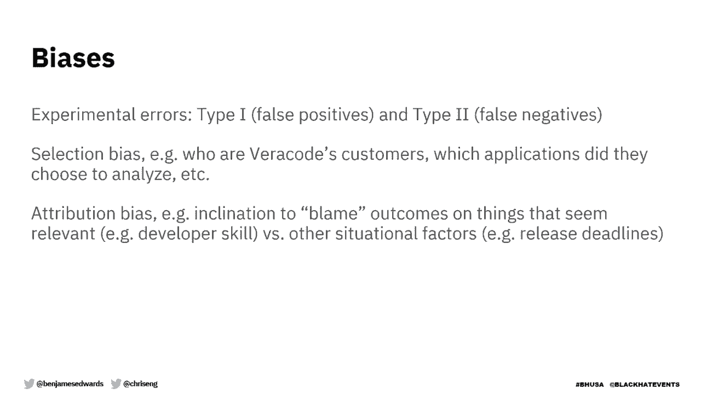
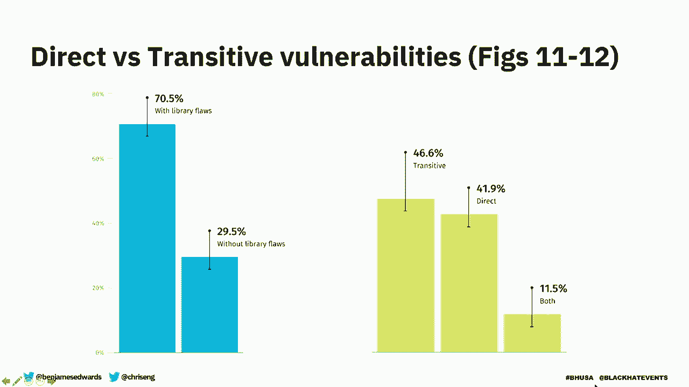
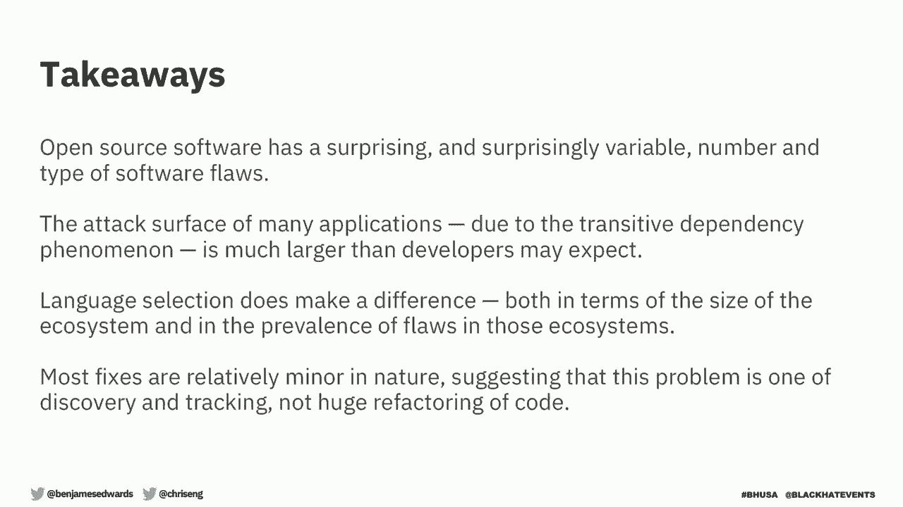

# 课程 P89：依赖数据驱动的软件成分分析中的“魔鬼” 🔍

在本节课中，我们将学习软件成分分析。具体来说，我们将从库的使用和继承风险的角度，探讨真实世界软件的真实面貌。我们将利用数据科学，揭示关于开源库如何影响应用风险的新量化见解。我们相信，其中一些发现会让你感到惊讶。

## 数据来源与固有偏差 📊

上一节我们介绍了课程概述，本节中我们来看看本次研究的数据来源及其固有偏差。

本报告中的所有数据均来自Veracode的《软件安全状况》报告。该报告自2010年起每年发布。我们收集所有客户扫描数据，进行匿名化处理，然后报告在应用安全领域观察到的趋势。

任何基于自动化测试工具数据的报告都存在某些固有偏差。这些偏差包括：
*   **误报**：工具发现但实际不存在的问题。
*   **漏报**：实际存在但工具未能检测到的问题。
*   **选择偏差**：数据集基于Veracode的客户，不包括非客户或不使用安全工具的用户。
*   **归因偏差**：读者可能倾向于将观察到的结果归因于看似相关但并非实际原因的因素。

我们可以告诉你我们观察到了什么，但并不总能解释其原因。

## 库的使用情况：直接与传递依赖 📦

现在我们已经了解了数据背景，接下来深入探讨库的使用情况。

我们首先需要了解应用程序中包含了多少库。不同语言之间存在巨大差异。例如，JavaScript应用程序通常包含数百个库，有时甚至达到数千个。而Python或.NET应用程序可能只包含几十个库。

以下是关于库流行度的关键发现：
*   JavaScript生态系统中存在大量小型库，有些甚至只有几行代码。
*   即使是非常小的库（例如仅162行代码）也可能引入安全缺陷。
*   大多数库并非由开发者直接引入，而是作为其他库的依赖被间接引入，即**传递依赖**。

关于版本分布，大约18%被引入应用程序的库使用主版本号为0的预发布版本。

## 库中的安全缺陷与模式 🐛

理解了库的生态系统后，我们来看看使用它们所继承的安全缺陷。

我们绘制了散点图，将应用程序包含的库数量（X轴）与包含漏洞的库数量（Y轴）进行对比。分析发现：
*   对于Java、JavaScript和Python，包含的库越多，存在的漏洞也越多。
*   在几乎所有语言中，都存在包含数百甚至数千个库但漏洞极少或为零的应用程序。
*   不同语言在漏洞普遍性和密度上差异显著。例如，随机选择一个PHP库，其包含漏洞的几率超过50%。

在漏洞类型方面，OWASP Top 10中的三个类别（跨站脚本、失效的访问控制、不安全的反序列化）占据了所有漏洞的近四分之三。特别是，不安全的反序列化在第三方代码中尤为突出，主要来自Java和PHP库。

## 修复优先级漏斗：聚焦关键问题 🎯

面对海量的漏洞，很容易让人不知所措。本节我们将探讨如何确定修复的优先顺序。

你可以将优先级排序想象成一个漏斗。所有漏洞从顶部进入，我们最关心的那些从底部出来。以下是几个过滤层级：

**第一层：是否存在公开漏洞利用**
*   平均20.7%的含漏洞库存在概念验证性漏洞利用。
*   此比例因语言和漏洞类型而异。存在漏洞利用的漏洞风险更高。

**第二层：是否在野被利用**
*   通过收集网络安全厂商的遥测数据，可以识别正在被主动利用的漏洞。
*   应用此过滤器，可将需关注的应用程序比例降至25%。

**第三层：应用程序是否实际调用漏洞代码**
*   应用程序可能依赖一个有漏洞的库，但从未执行存在漏洞的代码路径。
*   如果工具能高置信度地识别出执行路径，则只标记那些确实使用了漏洞函数的应用。
*   应用此最终过滤器，可将比例降至1%。

这套框架能帮助我们优先修复最可能被利用、最重要的漏洞。此外，81%可修复的漏洞只需进行**次要版本**或**补丁版本**更新即可解决，这大大降低了升级风险。

## 更新链分析：打补丁的连锁反应 ⛓️

假设你修复了一个有漏洞的库，但发现新版本又引入了不同的漏洞，于是不得不再次打补丁。这种情况会无限循环吗？

我们对这种更新链场景进行了额外分析。以下是可能的结果：

**理想情况**
*   **单步更新**至一个无已知缺陷的版本。
*   **多步更新**后最终到达一个无已知缺陷的版本。

**不理想情况**
*   **无可用更新**：立即没有或经过多步后没有可用更新。
*   **循环更新**：建议的更新路径形成闭环，需要权衡选择。

分析结果显示：
*   约三分之二的更新链最终能到达无已知缺陷的版本。
*   大多数更新链相对较短，90%以无缺陷版本结束的链长度小于等于4步。
*   即使经过多步更新，最终大部分（约75%）仍是较小的更新（次要版本或补丁）。

## 总结 📝

本节课我们一起学习了软件成分分析的关键发现：

1.  **开源软件风险多变**：开源库中安全缺陷的数量、类型和分布因语言和生态而异，且常常出人意料。
2.  **警惕传递依赖**：大多数缺陷来自**传递依赖**，而非开发者直接引入的库。管理依赖树至关重要。
3.  **明智地确定优先级**：修复所有漏洞不现实。应优先关注存在**公开漏洞利用**、在**野被利用**或应用程序**实际调用**的漏洞。
4.  **更新通常是可行的**：绝大多数（81%）可修补的漏洞可通过**次要版本或补丁**更新修复，且更新链分析表明，通常能到达一个安全的版本。
5.  **语言选择的影响**：开发者在选择编程语言时，其关联的库生态系统安全状况是一个值得考虑的因素。

通过数据驱动的分析，我们可以更清晰、更高效地管理第三方代码带来的安全风险，将精力集中在最关键的防御点上。