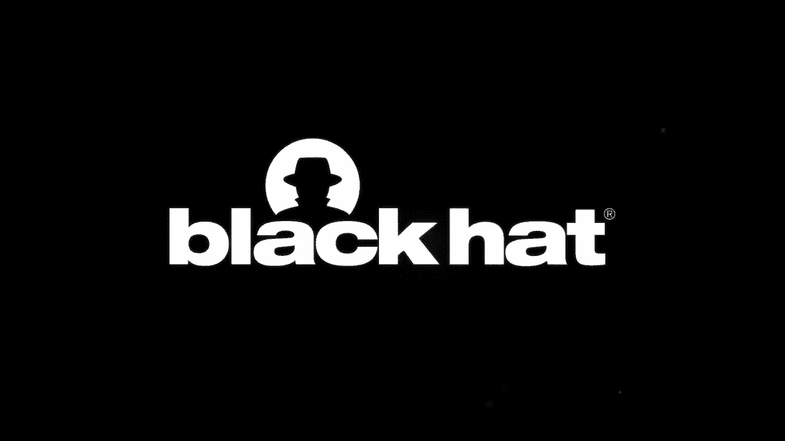
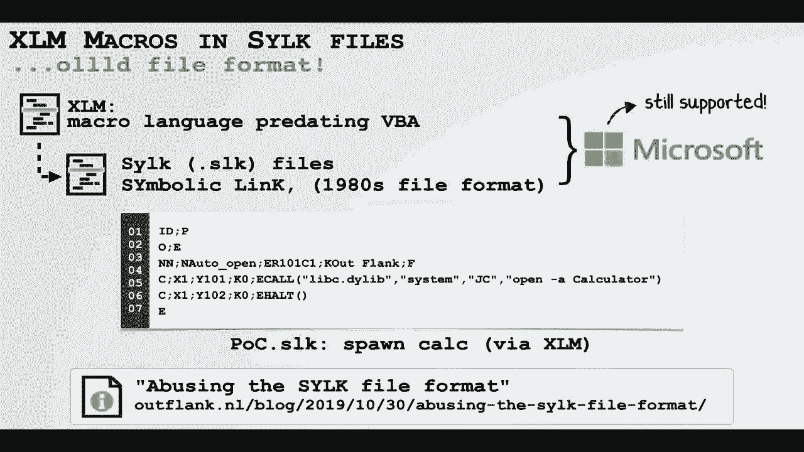
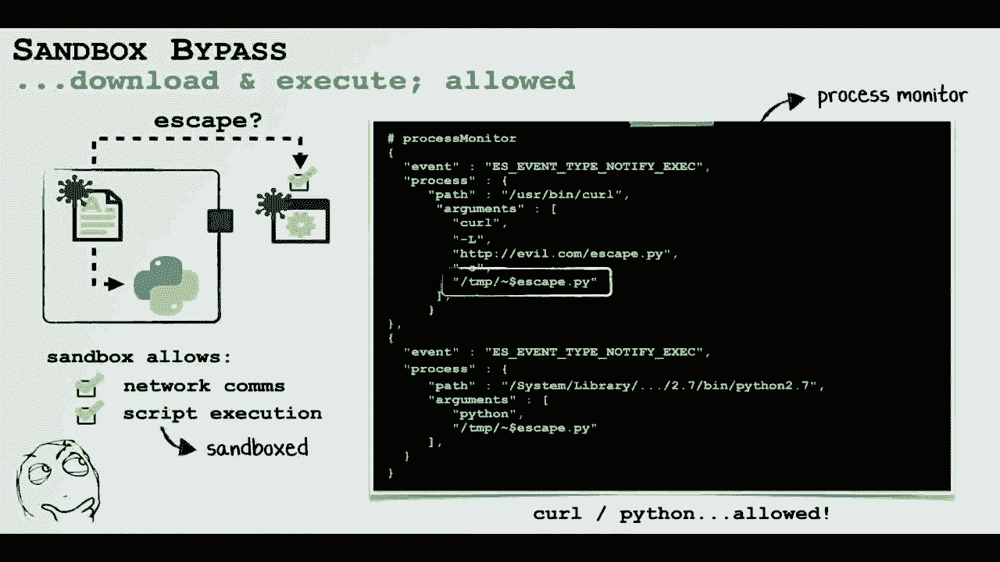
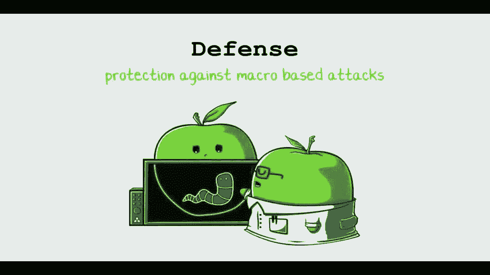
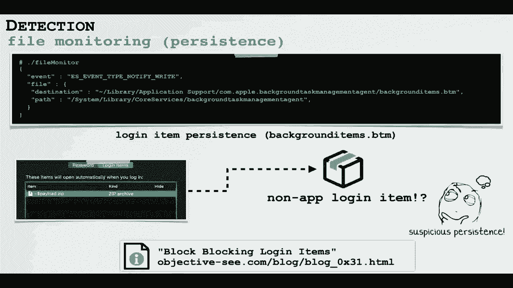
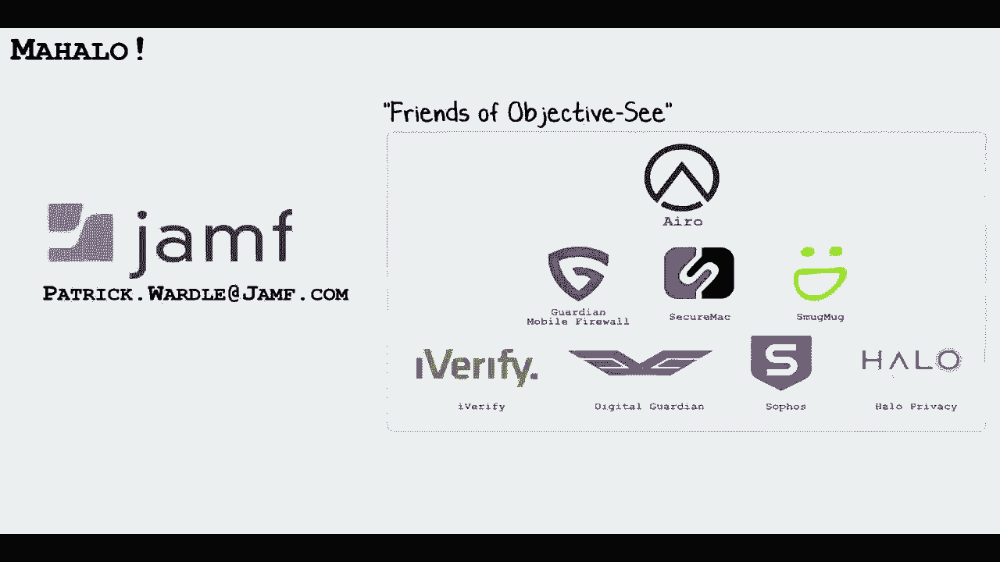

# 课程 P9：09 - macOS 上的 Office 攻击 🎯

在本节课中，我们将学习关于 macOS 上恶意 Office 文档的知识。我们将首先了解近期针对 Mac 用户的宏攻击，然后探讨分析这些攻击的方法。接着，我们会深入研究一个结合了多个零日漏洞的新型攻击链，该链旨在绕过沙箱和苹果最新的安全机制。最后，我们将讨论检测和阻止此类攻击的通用方法。

## 近期针对 Mac 用户的宏攻击 📈

上一节我们介绍了课程概述，本节中我们来看看什么是宏以及近期针对 Mac 用户的攻击案例。

宏是嵌入在 Microsoft Office 文档中的可执行代码。它允许用户在文件中添加可执行逻辑。例如，可以在 Word 文档中插入一个宏，使其在打开时弹出一个显示“Hello World”的窗口。如果用户启用了宏，并且代码被放置在 `AutoOpen` 子程序中，那么每次打开文档时，这段代码都会自动执行。

从安全角度看，在文档中嵌入可执行代码是一个糟糕的主意，攻击者多年来一直在滥用此功能。著名的“梅丽莎”病毒（Melissa virus）早在 1999 年就出现了，它正是一种宏病毒。尽管微软已添加了一些缓解措施（如警报和沙箱），但威胁并未完全消除。

传统上，这类基于宏的攻击主要针对微软 Windows 系统，原因有二：第一，宏是微软的产物，只能在微软产品中运行；第二，过去 Windows 电脑，尤其是在企业环境中，更为普及。然而，这种情况正在改变，Mac 电脑在初创公司和企业中的使用越来越广泛，这意味着黑客有了更多的攻击目标。

以下是近期针对 Mac 用户的宏攻击案例：

*   **2017年**：一个看似关于特朗普当选的文档。如果用户打开并允许运行宏，系统就会被感染。
*   **2018年**：一个关于比特币的文档。同样，允许宏运行会导致系统被控制。此攻击最有趣的一点是其嵌入的利用代码能够绕过微软 Office 的沙箱。
*   **2019年**：来自 Lazarus APT 组织（通常与朝鲜有关）的文档。这表明高级持续性威胁（APT）组织也开始利用宏来攻击 macOS。

## 分析恶意文档的方法 🔍

上一节我们回顾了近期攻击案例，本节中我们来学习如何具体分析这些恶意文档，包括提取嵌入的宏代码和分析其有效载荷。

首先，我们需要能够提取嵌入的宏代码。虽然 Microsoft Office 文档的文件格式细节超出了本课程范围，但幸运的是，我们无需深入了解。有一些优秀的工具可以轻松完成此任务。

我最喜欢的工具是 GitHub 上的 **OLE Tools** 工具套件。使用 `olevba` 命令并传入可疑文档，该工具会解析文档并将任何嵌入的宏代码输出到标准输出。此外，也有一些在线网站可以上传文档进行分析和宏提取。

现在，让我们具体看看之前提到的恶意宏代码做了什么。

以下是针对每个案例的分析：

*   **2018年“特朗普”文档**：使用 `olevba` 提取宏后，可以看到一个名为 `Fisher` 的子程序通过 `AutoOpen` 方法调用。该子程序会构建一个 Base64 编码的字符串，解码后通过 Python 执行。解码后的 Python 代码会检查是否有流行的安全产品（如 Little Snitch）在运行，然后从 `securitychecking[.]org` 下载第二阶段有效载荷，使用 RC4 解密并执行。此有效载荷实际上是著名的开源 Python 后门程序 **Empire**。
*   **2018年“比特币”文档**：同样使用 `olevba` 提取宏。其中包含编码的 Python 代码和一个嵌入式属性列表（plist）。解码 Python 代码（Base64编码）后，发现它会连接到某个 IP 地址，下载并执行第二阶段有效载荷。分析时，该命令与控制（C&C）服务器仍在运行，获取的第二阶段有效载荷是 Metasploit 的 `Meterpreter`。有趣的是，攻击者利用了开源工具作为第二阶段有效载荷。此外，该文档最有趣之处在于其能够逃逸微软 Office 的沙箱。安全研究员 Adam Chester 发现了一种巧妙的方法：利用微软 Office 沙箱中一个基于错误正则表达式的例外，允许沙箱内代码在系统任意位置创建文件。攻击者很可能借鉴了 Adam 博客中的代码，将其嵌入到他们的 Office 文档中，从而在未打补丁的系统上实现沙箱逃逸。
*   **2019年 Lazarus 文档**：提取的宏代码相对简单。它只是下载并执行一个名为 `MT.dat` 的第二阶段持久化植入程序。然而，该文档不包含任何沙箱逃逸代码，这意味着如果在较新版本的 macOS 上打开，攻击的持久化部分将会失败。

## 新型零点击宏攻击链 ⛓️

上一节我们分析了现有攻击，本节我们将探讨一个更强大的新型攻击链。你可能会问为什么需要研究这个？因为在我看来，当前所有的宏攻击都存在明显缺陷。

当前攻击的局限性如下：

1.  **用户交互要求高**：打开文档时会出现巨大的宏启用警告，用户必须点击“启用”。大多数用户不会这样做，攻击在第一步就失败了。
2.  **受限于沙箱**：即使宏运行，也受限于 Office 沙箱，无法持久化代码或访问用户文件。
3.  **受限于新安全机制**：在 macOS Catalina 上，苹果引入了公证（Notarization）等新安全机制，可能导致第二阶段有效载荷无法执行。

因此，当前的攻击基本无效。每当微软或苹果修补漏洞或实施新安全机制时，我喜欢深入研究，因为他们的修复往往不彻底或存在缺陷。

现在，让我们逐步了解这个零点击攻击链。

该链始于一个由两位安全研究员发现、后经其他研究员改进的巧妙漏洞。他们发现，即使用户禁用了宏，他们也可以创建一种包含宏的文档，该宏会在无警报、无提示的情况下自动执行。这是通过滥用一种非常古老的微软文件格式 **SYLK 文件**（可追溯到 20 世纪 80 年代）以及一种并非用 VBA 编写、而是称为 **XLM**（不是 XML）的宏语言实现的。由于兼容性原因，微软仍然支持这些旧格式。

研究人员发布了关于这些旧格式及其发现的详细资料。我基于他们的代码创建了一个简单的概念验证：当从互联网下载的恶意文档被打开时，计算器（Calc）会自动执行，且没有任何宏警报。

然而，在最新版本的 Microsoft Office 中，应用程序运行在沙箱内。这意味着即使我们能弹出计算器，也无法持久化后门或访问用户文件。因此，我们需要一种新的沙箱逃逸方法。

我首先查看了微软对 Adam 漏洞的补丁，注意到他们并未修复错误的正则表达式，而是简单地阻止了对某些特定位置（如启动代理目录）的访问。这意味着只要文件名符合那个错误的正则表达式（以 `~$` 开头），我们仍然可以从沙箱内的宏代码中在“几乎任何”位置创建文件。

我们的目标是在沙箱外执行代码以实现持久化和恶意操作。我们注意到可以从沙箱内下载并执行脚本（例如 Python 脚本），虽然这些脚本本身也在沙箱内运行，但这为我们提供了一个起点。

通过一个在沙箱内下载并执行的 Python 脚本，我们可以创建一个 **登录项**。登录项会在用户下次登录时自动执行，并且由于它是由 macOS（而非沙箱内的我们）启动的，因此它不会受到沙箱限制。这证实了我们能够逃逸沙箱。

但不幸的是，我们随即遇到了 Catalina 的新安全机制：文件隔离和公证要求。公证机制要求文件必须经过苹果的“祝福”才能运行。显然，苹果不会“祝福”我们的后门。因此，即使我们将后门持久化为登录项，macOS 也会拒绝执行它。

希望并未完全丧失。如果我们能创建一个 **启动代理**，就可以指定参数并持久化一个非沙箱的、交互式的 shell（通过 bash）。这将是巨大的突破。但问题在于，微软对 Adam 漏洞的补丁明确阻止了创建启动代理。

因此，我们拥有一些碎片，但无法将它们组合起来。我们需要一种方法，让系统或一个不带参数的苹果二进制文件为我们创建启动代理。

这时，事情变得有趣起来。我有了一个随机想法：如果我们创建一个不是二进制文件或应用程序的登录项会怎样？如果我们持久化一个 **ZIP 文件**，系统会如何处理？事实证明，在登录时，文件的默认处理程序会被调用。对于 ZIP 文件，macOS 会自动调用苹果的 **归档实用工具** 来解压文件。

我们记得，由于微软最近的补丁，我们无法直接写入用户的启动代理目录。但是，如果该目录不存在（在默认的 macOS 上确实不存在），我们可以将 ZIP 文件放在用户库目录中（这是沙箱允许的）。然后，我们可以将这个 ZIP 文件持久化为登录项。

我们在 ZIP 文件中放置一个名为 `LaunchAgents` 的目录，其中包含一个启动代理属性列表文件。现在，当我们把这个 ZIP 文件持久化为登录项后，在下次登录时，归档实用工具会自动被调用（因为它是苹果签名的进程），并在沙箱外运行。这意味着它可以为我们解压文件，创建启动代理目录和属性列表文件。

至此，完整的攻击链形成了：

1.  用户打开包含 XLM 宏的 SYLK 文件，宏自动执行（无警报）。
2.  宏下载并持久化特制的 ZIP 文件为登录项。
3.  用户下次登录时，归档实用工具自动调用，在后台解压 ZIP 文件，从而为我们创建启动代理。
4.  再下一次登录时，启动代理自动执行，并运行我们通过属性列表指定的、基于 bash 的交互式后门。
5.  这个 bash 后门在沙箱外运行，因此可以下载文件并移除隔离属性（从而绕过公证检查）。

最终，我们获得了一个沙箱外的交互式 shell。我们可以用它来持久化任何东西，例如一个未经公证的、被改造的 `WindTail` 版本。

## 防御与检测方法 🛡️

上一节我们剖析了复杂的攻击链，本节我们转向防御，讨论如何检测和阻止这些攻击。

首先，作为一名负责任的安全研究员，我将所有这些漏洞报告给了微软和苹果。微软回应称这是一个已知问题，苹果则表示已在后续版本中修复，但均未提供漏洞赏金或致谢。

现在，让我们简要讨论如何检测这些攻击以及其他 macOS 恶意软件。

第一种方法是 **进程监控**，利用苹果新的 **端点安全框架**。我们可以创建一个进程监视器来检测“可疑的子进程”。例如，如果看到 Excel 生成了 `curl` 或 `Python` 这样的子进程，那就是一个危险信号。

第二种方法是监控文件系统以发现 **持久化** 行为。持久化是恶意软件或攻击链逃逸沙箱或确保在系统重启或用户重新登录时自动重新执行的方式。同样，我们可以使用端点安全框架监控与持久化相关的文件创建事件。例如，可以检测到创建了一个指向 ZIP 文件（而非通常的应用程序或二进制文件）的登录项，这是一个巨大的危险信号。

在 Jamf，我们将此类监控逻辑实现在一个名为 **MonitorKit** 的框架中。然后，我们将监控数据以及我们的分析和规则输入到苹果的 **Game Logic Engine** 中进行评估。这为我们提供了强大的、专为 macOS 定制的端点检测能力。基于现有规则，我们甚至能够在没有先验知识的情况下检测到上述攻击链。

## 总结 📝

本节课中，我们一起学习了 macOS 上基于宏的攻击的现状。我们看到，针对 macOS 用户的此类攻击正变得越来越普遍，但幸运的是，当前的攻击手段相对较弱。

然而，我们不应因此自满，因为正如我们所展示的，创建一个零点击攻击链是相对容易的。该链可以在用户打开文档时，逃逸沙箱并绕过苹果所有最新的安全机制（在当时完全打补丁的 macOS 系统上）。

最后，我们展示了通过利用苹果新的端点安全框架，可以通用地检测这些攻击以及其他威胁。希望本课程能帮助你更好地理解和防御 macOS 平台上的 Office 文档攻击。