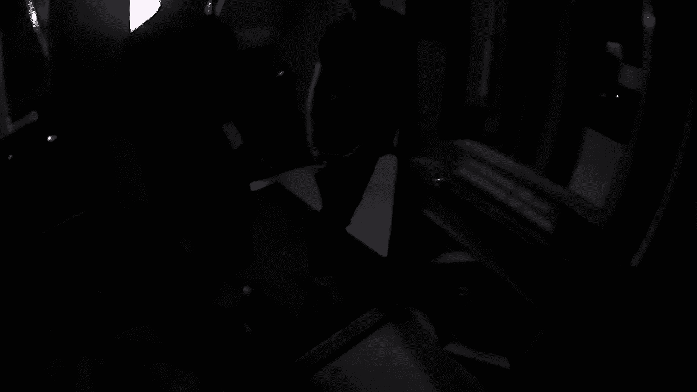
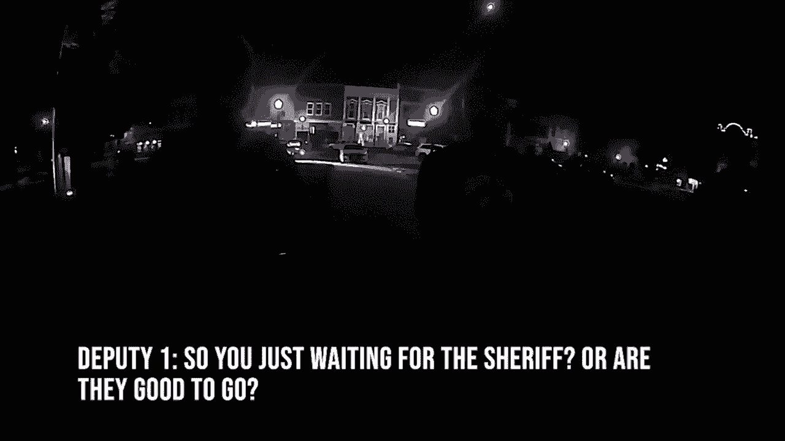
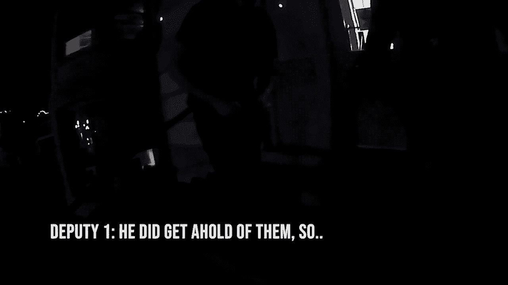
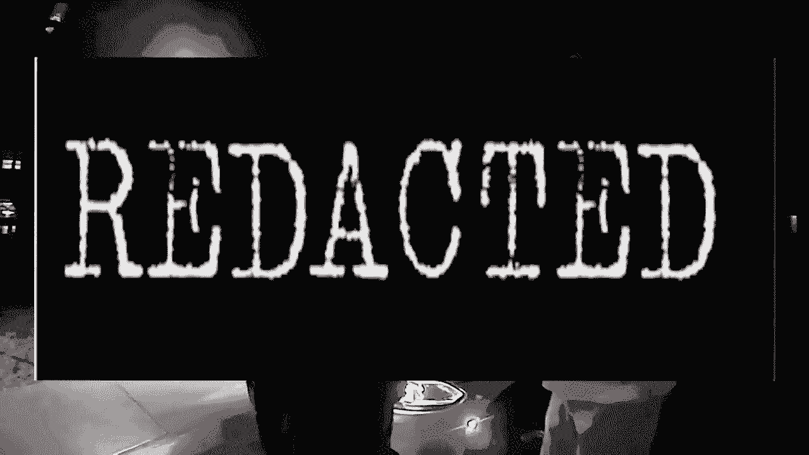
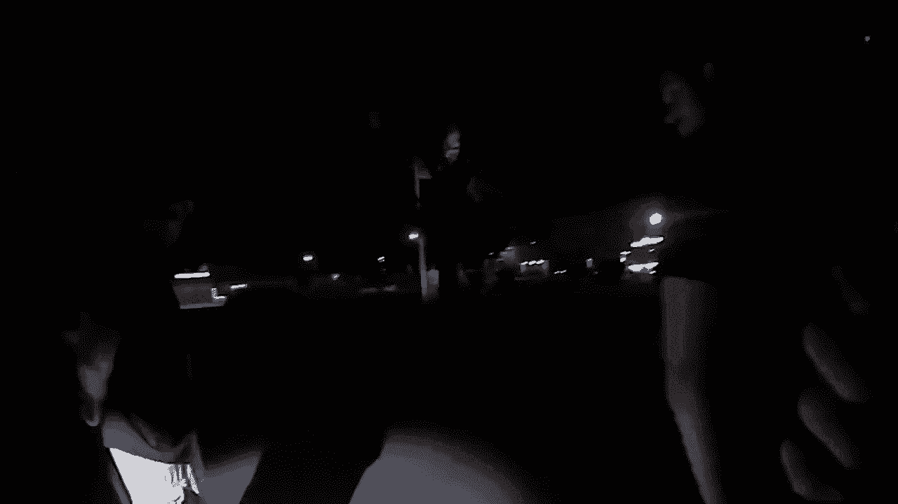
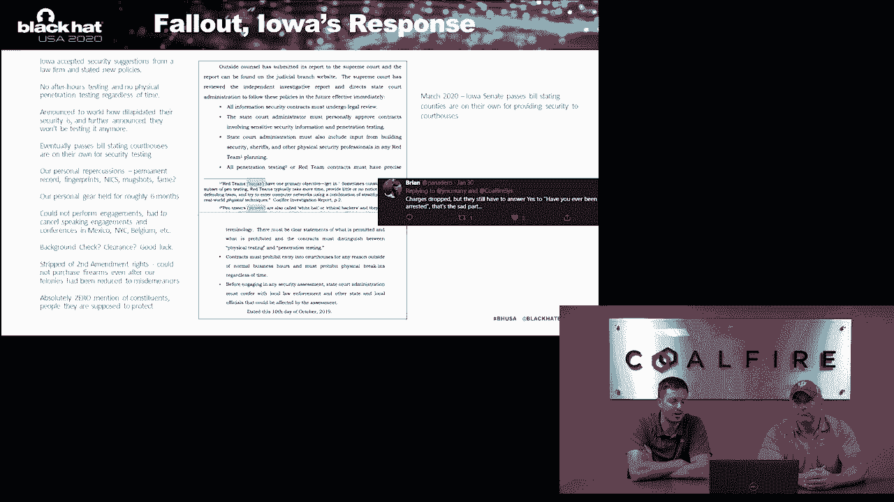
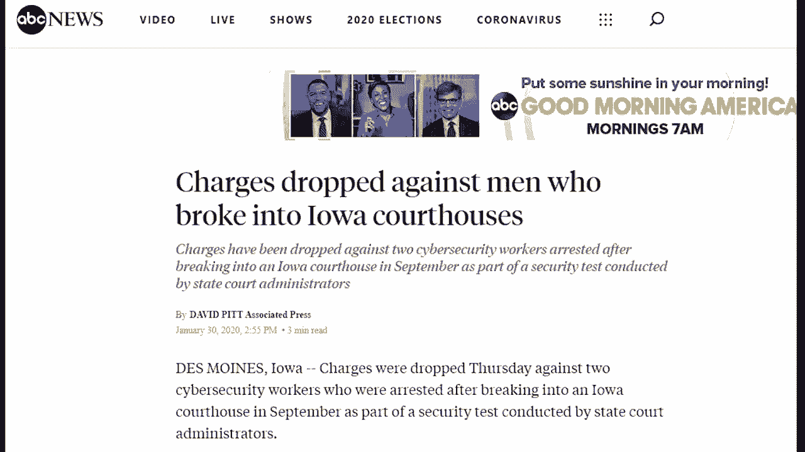
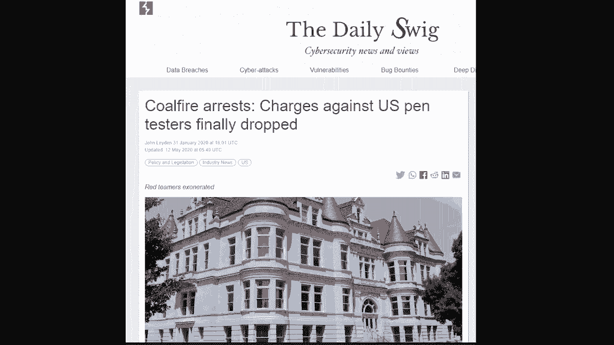
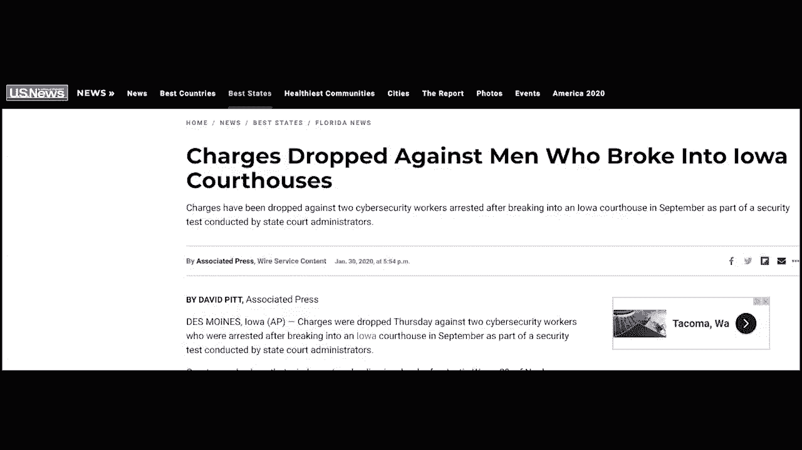

# 物理渗透测试实战案例解析：爱荷华州事件全记录 🏛️

在本教程中，我们将详细解析一次真实的物理渗透测试（Physical Penetration Test）项目，该项目因沟通、授权和法律问题而演变成一起备受关注的公共事件。我们将跟随安全顾问的视角，从项目启动、测试执行到意外被捕，完整回顾事件经过，并提炼出关键的经验教训。

## 概述与背景

本次事件的核心是安全公司Cold Fire Systems为爱荷华州司法部门执行的一次物理安全评估。项目目标是测试多个县法院建筑的安全性，包括在非工作时间尝试进入建筑、访问内部网络并植入设备。然而，在测试达拉斯县法院时，安全顾问被当地警长逮捕，并被指控入室盗窃，引发了关于测试授权范围、沟通流程和法律责任的广泛讨论。

上一节我们介绍了事件的背景，本节中我们将深入探讨项目启动前的关键环节——范围界定。

## 项目范围界定与授权

在渗透测试开始前，与客户进行详细的范围界定（Scoping）和授权（Authorization）是至关重要的第一步。这个过程决定了测试的边界、方法和法律依据。

以下是本次项目范围界定过程中的关键点：

*   **测试类型**： 本次是一个红队（Red Team）评估，涵盖所有攻击性安全服务，但核心是物理安全测试。
*   **测试时间**： 客户最初要求仅进行**非工作时间**（下班后/夜间）的物理测试。经过讨论，客户修改为**白天和夜间**都进行测试，以便将社会工程学（Social Engineering）测试纳入日间评估。
*   **目标地点**： 客户指定了五个需要评估的地点。团队与客户逐栋建筑、逐条线路地讨论了每个地点的具体测试内容、时间范围、允许和禁止的行为。
*   **特殊限制**： 对于某些建筑有具体限制。例如，在刑事司法中心，客户仅授权进行社会工程学测试以进入服务器机房，而非全面的物理渗透。
*   **授权文件**： 授权书（Letter of Authorization, LoA）规定测试从周日开始。这本身就是一个重要信号，表明客户预期测试会在非工作日进行。

**核心概念：授权书（LoA）**
`LoA` 是渗透测试的法律基石，它是一份由客户签署的正式文件，明确授权测试团队在特定时间、对特定目标执行特定活动。其核心作用是提供法律保护，证明测试行为是经过许可的。

范围界定环节的详细沟通旨在避免误解。然而，正如我们将在后续看到的，即使有详细的沟通，授权范围的解释仍可能成为争议焦点。

## 事件相关方

理解事件中各方的角色和立场，有助于厘清后续的矛盾冲突。

以下是本次事件的主要相关方：

*   **Cold Fire Systems**： 执行渗透测试的安全公司。
*   **Gary 和 Justin**： 直接执行测试、后被单独指控的安全顾问。法律上，个人与公司的责任在此被区分。
*   **达拉斯县**： 主要由警长查德·伦纳德（Chad Leonard）和县检察官查克·索纳德（Chuck Sonard）代表。他们是逮捕行动的主导方。
*   **爱荷华州司法部门**： 本次测试的客户，包括主要联系人马克·海德利（Mark Headley）、约翰·胡佛（John Hoover）和安德鲁·雪莉（Andrew Shirley）。
*   **爱荷华州巡警**： 在测试司法部门建筑时遇到，并验证了测试团队身份的执法人员。

上一节我们明确了项目范围和各方角色，本节中我们来看看测试团队在事件发生前几天是如何执行任务的。

## 测试执行过程：周日到周二

测试团队按照计划在周日抵达并开始工作。

**周日（首日行动）**
团队成功进入波尔克县历史法院大楼。他们通过技术手段绕过门禁，并在建筑内停留至凌晨一两点，完成了客户要求的大部分测试内容，获得了超出预期的成果。除了后续需要返回放置无人机外，该地点的测试基本完成。

**周一（侦察与规划）**
团队驱车经过所有目标地点，确认地址信息，并在公共开放时间进入司法部门大楼和达拉斯县法院进行初步侦察。目的是熟悉环境、了解安防布局，为夜间测试制定计划。

**周二（司法部门大楼测试）**
晚间，团队抵达司法部门大楼。在尝试进入时，一名州巡警按预期出现（客户已事先告知该地点在下午5点至早上6点有巡逻）。团队出示了名片并解释了正在进行的授权安全测试，巡警验证后满意离开，未加阻拦。团队随后成功进入大楼，进行权限提升和漏洞检查，并在客户联系人的办公桌上留下了名片。

第二天早上，客户联系人看到名片后发来祝贺邮件，并表示好奇他们是如何进入的。同时，客户方回顾了监控录像，确认了测试时间、方法和性质，但并未提出任何异议或要求停止测试。这一切都符合合同约定。

至此，所有信号都表明测试进展顺利，完全符合客户要求。团队甚至遇到了客户预告会出现的巡警，验证了沟通的有效性。

## 关键转折：达拉斯县法院事件

周二晚上约11:30，团队抵达达拉斯县法院（警长办公室就在法院正后方）。他们发现前门未锁，但为了测试真实安全状态，他们关上门并尝试绕过门禁进入。触发警报后，他们尝试了默认密码未果，决定等待看是否有警方响应（此前在其他地点均未触发有效响应）。

到达三楼并进入一个法庭后，他们发现一名市警察已经在楼下。警方的响应速度极快（约3分钟）。为了避免意外冲突，团队主动走出楼梯间，多次喊话表明正在进行安全评估。约5-7分钟后未得到回应，他们决定下楼。

在下楼后与副警长首次接触时，团队高举双手，询问对方是希望他们出去还是警员进来。副警长示意他们出来。团队出示了Cold Fire名片并解释了来意。副警长通过无线电核实后，告知他们“没问题，一切都核实了，和你们的联系人确认过了，你们可以走了”。

此时，现场气氛轻松，约有9名执法人员在场，双方进行了友好的专业交流，分享故事和经验。然而，当警长（Chad Leonard）抵达后，气氛急转直下。

警长认为，县法院是县属财产，州司法部门无权授权对其进行安全测试。因此，他推翻了副警长的决定，以“入室盗窃”的罪名逮捕了Gary和Justin。警长表现出明显的挫败感和愤怒，并使用不当语言质疑测试人员的专业性，尽管此前其他执法人员都视他们为专业人士。

**核心争议点：法律授权**
警长的核心论点是“授权无效”。然而，事后爱荷华州司法部门委托律师事务所进行的独立审查得出的结论是，根据爱荷华州的法律和判例，**州政府很可能确实负有确保该法院安全的唯一责任**。这意味着州司法部门的授权在法律上可能是有效的。

## 经验教训与总结

本节课中我们一起回顾了爱荷华州渗透测试事件的全过程。我们可以从中总结出以下几点关键教训：

1.  **授权必须明确且无歧义**： 授权书（LoA）应尽可能详细、具体，特别是对于多管辖区域（如州与县）的目标。最好能获得所有相关管辖方（如县当局）的书面知情或同意。
2.  **沟通记录至关重要**： 所有范围界定的讨论都应被记录（如录音）。书面合同可能比较概括，但详细的沟通记录是解决“他说/她说”争议的关键证据。
3.  **法律风险意识**： 渗透测试，尤其是物理测试，存在固有的法律风险。测试团队和客户都需明确理解测试行为可能被误解为真实犯罪，并制定应对预案（如“出狱卡”——紧急联络人信息）。
4.  **客户内部沟通**： 客户机构内部（如州司法部门与县警长办公室）在测试前是否进行了充分沟通，直接影响现场执法人员的反应。本次事件中，明显的内部沟通脱节是导致冲突的主要原因。
5.  **保持公开透明**： 正如事件当事人后来指出的，在受到不公指控时，保持沉默可能让情况更糟。适当的公开澄清有助于维护自身权益，并施加合理的公众压力。

这次事件凸显了在复杂环境中执行高风险安全测试时，技术能力只是基础，缜密的法律准备、清晰的沟通流程和强大的危机处理能力同样不可或缺。