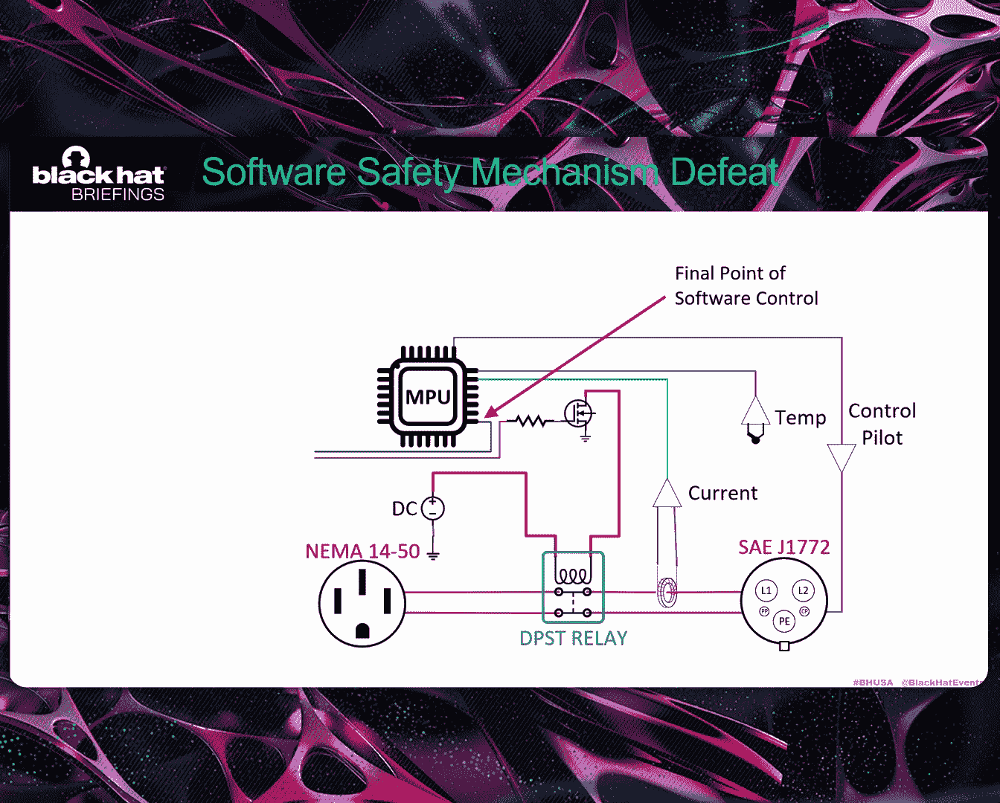

# Peril at the Plug： Investigating EV Charger Security and Safety Failures [4l6hsv8IlWE]

Thank you。 Hello， everyone。 Thanks for coming to our talk。 today。

 We're gonna talk a little bit about EV chargeger， safety and security。 Again。

 my name is Jonathan Anderson， and I have Danos with me。😊，Before we get started。

 we'd like to definitely acknowledge and thank all the Poone participants over the years and all the other people who helped put this research together。

 it just wasn't our effort， it was a whole team。So here is what we're gonna talk about to get started。

 we ask AI to make a little picture for us about our research。 and as you can see。

 it's quite terrible at it。 So it was so funny， I thought we would include it。

 but we're gonna talk first a little bit about the EBSC attack surface。

 And when I say EBSC I also mean EV chargeger。 So I'll be using that term kind of interchangeably。

 then we'll talk about Po to own some results we've seen there。

 we'll dive a little bit deeper into some Os we've seen at Po to O then then also talk a little bit about some of the research questions we wanted to answer after our experiences at Po to O and he'll dive deeper into some EBSC technology we'll talk about the test rig we built to do our testing and our test methodology and then we'll kind of wrap it up with some results。

 mitigations and conclusions。 and hopefully we'll have time from the questions at the end。

 but if we don't we can meet you guys at the wrap room and talk about it there。😊。

So about two years ago， we started Po to own Auto at Tokyo Big site。

 It's quite a fun venue and contest。 Def try to make it out if you can。

 We encourage people to participate in Pooneone。😊，And these are the devices we'll be talking about today。

 and most of these have been in Pona own in the past。

And when you take these devices apart and start looking inside them， you find some commonalities。

 They typically have a main CPU， which runs the GuI， the network， a lot of the major subsystems。

 It typically runs an operating system。 Sometimes it can be a small artto。

 but it could be Linux or Android as well。Then occasionally。

 there's a second processor which controls the power switching and measurement。

 And Thanos will talk more about the design of the power sub a little bit later on。

There's also a lot of devices and peripherals attached which kind of contribute to quite a large attack surface。

 you can see them here， lots of different network types， cloud connections， network protocols。

 so it kind of all adds up again to quite a big surface。Also。

 EV chargers typically come with a mobile application。 That mobile application typically takes。

 you know Wi-fi credentials， delivers them over Bluetooth to the chargers so the charger。

 then connect to the network。 And then， of course， the Apple do control and telemetry and that kind of thing as well。

 and it's a good place to get started reversing if you' want to get into EV charging。

 You can download the app for free and learn a lot about how these systems work。

So let's talk about what we've seen in Poone between 2024 and 2025。 we had a lot of similar results。

 but the thing you will notice is the vulnerabilities aren't going down。

 And then one of the most important things to last year we added a new category called you know the charge protocol modification。

 So if a contestant was able to modify the charging protocol going from the charger to the car。

 we gave them a little bit of extra money。 And so here you can see that four contestants were able to do that successfully。

 And this is critical because this protocol controls how much current flows through the charger。

 And you can get some quite dangerous situations。 if you're able to manipulate this and we'll show you more about this later on。

And then we also added another category called the charge connector compromise。

 So if you're able to compromise an EV charger directly from the charge connector。

 we gave you a bump， and we'll also talk about that here in a second。

So looking at the overall bug classes， maybe you can get an idea of the quality of bugs that are coming through here。

 You know， if you roll up the CWE 12121，2122， which tend to be buffer copy problems。

 size check problems， we've got know 8 or9 between the two years， pretty simple bugs。

 And then if you start looking at the rest， you' got a lot of authentication issues。

 certificate issues， even command injection and stuff。 So overall some pretty low level bugs。

 doesn't look good for the state of the industry， really。So let's dig deeper on a few。

 This was a great attempt by syn active， successful attempt。 You can go look at their blog。

 They have a lot of details。 It's really good。 They They'll go into more detail than I have time for here。

😊，But fundamentally， what they did is they use a little raspberry Pi to in connection with the can controller to downgrade the firmware of the Tesla wall connector and the firmware version that they down graded 2。

 happen to have additional debug services in it， a prior version。

 Then they use these debug services to find the Wi-fi credentials of the controller of the charger。

 then they can jump on this network。And then again。

 use the bug services that the services themselves had a global buffer overflow。

 and I'll say this more than once here， but this particular device had no memory protection。

 so it's kind of a one and done they can jump through their own buffer and they have RCE。

Another one was interesting， also bysonactiveive， it just so happens that the Alll charger has a plastic flap on the side with an allen key。

 and so if you remove that flap， you have access to a USB connector and they found a USB setup packet out of bounds readr。

So they're basically， you can see the code here。 they check to see if the buffer link is nonzero。

 but they don't check for the maximum length。 And so it just so happens that past a set of buffer are some critical function pointers。

 which they can write to。 and then they have flow control。 And again， it's a one and done。

 No memory protections in this device either。 So they're able to jump to their own buffer with R C。

This is another interesting one we see on the wolf box on the bottom left you see this management RFID card with they ship with each device and it's used to reset your device to a factory state unfortunately it's a me fairair classic 1k card so it can be easily cloned and the other unfortunate thing is it resets not only your wolf box but all wolf boxes in existence so you can reset the wolf box to an unpaired state at that point during the pairing process you can extract an encryption key for the firmware and then there's an undocumented firmware update feature which you can use you send an encrypted JSON blob and it applies your malicious firmware to the device。

So this one， probably the most serious Cna while he was researching for the contest。

 found a cloud bug and charge point， which allowed him to access all the connected charge point chargers and install potentially install malicious firmware。

 vendor has been taken a long time to fix this。 it's currently being addressed and you know。

 when you look at all these bugs in total。 You got remote bugs。 You got local bugs。

 You got complete fleet compromise bugs。 And these bugs are all very simple。

 Don't take chains and and have few mitigations。 So。Quite concerning。

So I'll hand it over to Thanos Now。 He's gonna talk about some of the research questions we want to answer after we kind of had had these experience with Pooneone。

Thank you Jonathan and welcome again everyone so what have we established thus far we know there's widespread vulnerabilities and EV chargers。

 we've seen the myriad of attack surfaces being exploited and of course we've seen demonstration of manipulation of the charging protocol。

啊。We also want to consider how much energy is involved in the electrical supply and how much energy are involved in the vehicle and the battery itself now you've got elements that malicious attacker can can utilize to cause some hazardous situations so our questions is going into the research where first of all。

 on an uncompromised charger， what are the inherent safe built in。

 we wanted to baseline those and then on a compromised charger are there secondary safeties that beyond the software safe if it were to be compromised。

 those safeties come to play， if not can the charger handle the excess of current is there damage going to occur。

 what's the scale of that damage will the damage go beyond the enclosure and start to impact the environment and possibly create a problem with infrastructure or hazard to。

These are the things we wanted to understand with the research。

So a couple of the tasks that we needed to accomplish to do this。 we first of all。

 put ourselves in the role of a malicious attacker with these with these capabilities。

 First task is to defeat the software safeties and these devices。

 Secondly is to be able to to draw current through the charger beyond the manufacturing spec。 Again。

 this is based on the。The results we saw at Ponone， and the elements available to an attacker。

A few basics first， these chargers are and the vehicles are designed on J 1772 standard。

That standard outlines level 2 up to 80 amps of charging。 And so you'll see that's。

 that's gonna be our target for the malicious attacker to achieve an 80 m throughput through the charger。

 on the right， you'll see a picture of the charging gun showing the yellow pins being the two high conductor pins protective ground in green。

 and there's two control signals。 The proximity pilot simply。

Informs the vehicle what the state of the cable is if it's plugged in or not。

 the more interesting one to ask is the control pilot， which among other things。

 will relate to the vehicle from the charger what its maximum current should be at any any particular time。

So a typical EV，S E EV chargeger hardware scenario looks something like this。 As Jonathan mentioned。

 the main processor usually handles user interface， communications， plethora of things。 quite often。

 there's a secondary process that will focus on lower level functions。

op sorry this one isn't necessarily immune to compromise。

 There's typically a very feature rich interface， including firmware upgrade of the secondary processor。

 So we believe it's just as vulnerable as the main processor。 There's usually instrumentation。

 and oh sorry， this is the the main control point。 So there's a main relay involved typically driven by one of the processors which bridges the electrical service on the left shown by the NeEma plug to the vehicle on the right。

 shown by the 1772 plug。There' instrumentation。 In this case。

 current is measured to charge current specifically temperature sensor built into the enclosure to measure that temperature。

And then the control pilot signal is generated by one of the other processors。

Diging a little deeper into the。The control pilot signal。

 you'll see it's 1 kHz pulsed with modulated signaling。 Again。

 this relays the maximum current that the vehicle is allowed to draw from the charger per per the standard theres theres it's defined as as low as a 10% duty cycle representing S as up to a 96% duty cycle signifying E E M。

Clearly， the attacker wants to maximize that current for a malicious attack。

Here's an actual example of attacker。Well， in this case， a researcher manipulating the， the。

 the key parameter here is just the duty cycle of the P W P WM signal。 As you can see。

 it's being varied。 And this was at the Poan contest demonstrating that this can be done。

Beyond just exploiting the charger。 So， again， we're now manipulating。

 impacting potentially the current that the vehicle is drawing。

So to achieve the task I mentioned earlier， we needed a way to load the EV chargers with maximum power and pull as much current as possible。

 we devised this fixture， which allows us up to 27 and5 kilowatts of load using resist elements the front。

 you'll see going from left to right is the electrical breaker that we tie to the electrical service the NeEmo plug that most chargers come with。

 the charger or unit under test itself， the charge gun the 1772 plug that goes into the vehicle and we put that into a load bank controller。

We have instrumentation to tell us the amperage and the， and the current， sorry。

 the amperage and the voltageage at the E V。And。And we use bank of smaller wattage heaters。

 as well as a bank of larger wattage heaters to achieve varied degrees of current through。

 through the U chargeger for our testing。So here's the inside the enclosure。

Of the low controller and quickly go over that here again is the 1772 receptacle with the input power。

 We have distribution bars for the main power， the main current through the through the system。

 Wi-fi breakers to allow us control manipulate the level of current lets us not have our hands in here since they're remote controlled。

Of course， a ground bar。Again， our， our current voltage readout， some secondary one for。

 for backup and then some more circuitry to drive the display on top and to measure the actual current。

 And the rear of the unit is the output， which has all the cabling that goes out to the heaters on the backside。

So this is the rig we developed to draw the maximum current through these chargers again above what the rated manufacturer would allow。

So our other task was to actually defeat the compromise the charger， defeat the software mechanisms。

 We needed a way to equalize this among eight different designs and a practical way we devised was the hardware modification。

 we， we located through reversing the hardware where the final point of software control would be。

 This would typically be a processor pin that drove the subsequent hardware to activate that relay。

We broke that net。And brought the， those two traces back to the outside so we could manipulate them depending on the test we want to run。

 We also included some power and ground again， for our， our different types of testing。

What this allowed us to do is install a jumper to recreate the net and test this unit in a non-compromised way。

 again for our baseline testing， or put a jumper in to effectively dislodge software control and safeties from manipulating the relay if there are。

Additional safeties built into the hardware downstream of that point of control。

 they should not be affected by this so they could kick in and interrupt the overcurrent condition and stop the charging。

 If not， this effectively allowed us to push maximum current through the charger again significantly above manufacturer's rating。

Just a quick example of what that modification looked like。 This was the wolf box。 Again。

 we locate the the the key pin that drives the relay circuitry。

 We lift the pin and connect the blue wire。 And then we solder the bran wire just below on the pad。

And we bring that and any some powering ground to the outside。

What you see here is kind of a typical test run。 And I'll quickly set the up before I I turn the video on。

 you can see on the right side of the the unit inter test。

 there's the the the compromised plug in place。 So this was going to run above。

 It manufacturer rating。And also got kicking off here。 So on the left。

 you'll see the thermal imaging camera picking up the high temperature in the frame。

On the right is our。The actual current going through the system， approximately 78 amps at the moment。

 You'll see we're quickly heating at 25 minutes。 We're close to 300 Fahrenheit at this point。

And we continue to heat。 You'll see it peak at about 3，40 before we turn off the thermal imaging。

 at that point， something happens here， which you'll see in a second that interrupts this test。Again。

 this is the cable clearly is one of the hot spots here and you'll see the integrity of the cable holder basically disintegrate。

 it clearly melted off the wall。 So the unit didn't fail yet。

 It's still heating up on the floor there。 but we interrupt up this tests interrupt this test because of the change in conditions。

 But effectively， that's what you'll see on the compromise testing。

 the setup that we're going to be running。う。So some of the results that came out of this testing again。

 we wanted to baseline with uncompromised charges first verify that are indeed software safetyties in place and so we raise the current slowly and sure enough。

 the uncompromised charges for the most part， did acknowledge an overcurrent condition and disengaged the relay and turn the charging cycle off on the bottom left is one of the chargers displaying the overcurrent condition and and they turned off the charging。

 Unfortunately， two of the examples did not they just continued to keep the overcurrent condition in play one of them。

 at least as a EOL doesn't help anybody who who owns this charger but at least the problem isn't still still growing The second example was a little。

Perplexing， because on the right， you'll see the application interface of that charger。

 and it does have a fairly good amount of of safeties in place。

 Ground fault interrupt grounded tech relay stuck。 So we believe there it probably does have overcurrent protection。

 Its just not enabled。 if it could have been in configuration issue in our part。

 or it's just not on by default。 So fortunately， this is an open source design。

 So the community could certainly jump on this and fix that pretty quickly。

Before we get into the modified charger， the compromised chargers。

 I want to mention a couple anomalies that we witnessed。

 this is a unit that believes it's drawing 45 or so amps in actuality， it's pulling 80 amps。

 so this is kind of an indication that even software could have bugs or glitch and have in misreport information。

 In fact， none of the values it's showing even even mathematically correct。

 So it's off in unknown state， but yet it's still allowing 80 amps to go through the system again。

 above its manufacturing rating。Fin anomaly。You'll see this clear case with a lot of condensation behind it。

 I'm not sure exactly why this is happening。 It didn't appear to affect the unit。 However， it's。

 it's very， very odd。 And you know， that definitely the manufacturer should should try to address this。

So let me hand it back over to to Jonathan and he'll cover some of the compromise charger results。

Okay， thanks， Denos。 So we're gonna play a video here。 And just a quick warning。

 It does have some jump scares and pops and crackles and that kind of thing。 So if you're sensitive。

 just be aware。 But what this video is， it's a compilation of all the highlights of the testing。

 we did five days worth of testing all day long。 So we have hours and hours of video。

 And this is a compilation of each one。 So what you're gonna see is a short video clip of a key event。

 And then followed by that maybe a freeze frame of the most important video frame。

 So you can kind of see really what's going on here。 So let's take a look。😊。

So here we'll start out with the Atll device， and in the upper right。

 you'll be able to see the current and voltage being drawn。And so you have an arc flash there。

The cable is degraded and shorted internally to the cable。And as you can see。

 quite a lot of energy is released at that moment。

This one's a bit more interesting。 It's hard to see at this stage。

 but it's already kind of smoking and off gassing some fumes there。 We did a little bit of research。

 and it unfortunately， those fumes tend to be both toxic and flammable。

 And you'll see kind of the consequence of that in a second here。

And so we've clearly had a significant failure and the device continues。Continues to draw 80 amps。

And you can see the flammable fumes exploding as they ignite。

And so there's the example of what happens when the flammable fumes are ignited by the art flash。

And here， you can also see jets of molten copper kind of coming out from the sides there。

And the fumes kind of build up again and has a second， basically small explosion from them。

And then when we remove the device from the text test fixture。

 you can see the the fact that it's heated the back of the plywood itself and the cable holder well。

 are still extremely hot。

So here's kind of a montage or collection of all the key events。 And again。

 you can see the two biggest explosions there were from the flammable gases。

 It's quite concerning we did all our tested and open air was quite breezy and there was plenty of ventilation outside。

 but I can imagine what might happen in a closed one- car garage。

 if it's able to fill with these fumes and then ignite all at once， could be quite violent。

And then again， you can see in the top middle， the wolf box。

 you can see maybe a green colored flame looks like burning copper from the wire itself。

 And then like， you know， like I said， quite， quite violent results and lots of， you know。

 potential danger there。And so one thing you might have already noticed by looking at this is wow。

 the cables seem to be a weak point。 And if you kind of look a little bit about at the math behind it。

 you'll discover that there's a square law relationship between the current draw and the heating so if you double the current you quadruple the heat and that's kind of you're seeing the consequence of that there as Daniels mentioned we see charging cables getting extremely hot above 350 degrees you can get first to be burns at 100 degrees hot enough to melt the cable off the wall and I'll say any cable that didn't flat out。

 fail in a violent way failed in different ways melting together。

 fusing releasing smoke etc cea and none of the cables would be safe to use after that。

We also observed some other damage inside our load box。

 the control pilot circuit was completely vaporized at one point。

 And the reason for this is you can imagine as the cable starts to melt internally。

 the high current conductors kind of short with the signal conductors and then the high current is like routed through the wrong path within the device。

 And we also saw at least three other chargers have this similar kind of damage。

 And if your EV doesn't have quite robust protections on it for these signals。

 there's a good chance your EB would be damaged at this point。So in the end， unfortunately。

 none of the chargesrs we tested were robust in the face of compromise。

 so when the software is under an attacker's control。

 there were no separate hardware mechanisms which prevent it from engaging in this kind of dangerous destruction。

 you know half of the charge we tested failed within an hour and a half the first one failed within an hour and the remainder failed within a period of five and half hour so you charge your EV at night and before you wake up you have a serious situation。

So what can we do about it？You know， probably the first thing people say is oh。

 I have a circuit breaker， no problem it'll save me。 Well it's not really that simple。 you know。

 a common misconception about circuit breakers is that if I have a 60 amp circuit breaker as soon as I draw any current over 60 amps it will immediately trip and that's simply not the case circuit breakers have kind of two independent mechanisms that work together and here we're kind of most concerned with the thermal mechanism right and as the thermal mechanism starts to heat up eventually gets hot enough to trip but let's take a closer look at how a typical EV will be installed by a professional。

 first of all there's some rules that require the breaker to be upsized meaning it won't trip as soon So for a 48 amp charger。

 they're gonna recommend a 60 amp breaker and then it just so happens that typical breaker also has some headroom built into it And so then when you start to combine all these headrooms you get quite a situation where heating can continue to occur and you know。

At at a 48 amp charger can overcurrent by 41% indefinitely。 And we've looked inside these chargers。

 and I don't have the impression that they're designed to handle this kind of continuous overload。

 And for a period of an hour， a charger can draw almost twice the current that it's rated。

 And this is if the breaker is installed correctly。

 right then there's some other factors also at play。 You know。

 breakers are designed to operate at or specified at a fixed temperature。

 So if your breaker boxes outside and it's very cold。 These factors can be even worse， right。

 the breaker could run much longer without tripping。

There's even one manufacturer that recommends oversizing breakers and uses language like put this breaker or an even bigger breaker。

 And， of course， those that will allow even a worse situation to occur， right。

 And then there's also people that think， oh， I'll personally put a bigger breaker in in case I want to upgrade my EV charger later or have the electrician do it that way I can future proof。

 But all this contributes to making the situation much worse。

So what can you do about the cable Well in the bottom right we have a picture just reminding everyone that fire goes up so it may not be obvious but on almost every EV installation you see you've got the coil right below the charger which is clearly going to exacerbate the situation if you ever have this problem so don't mount your coil under your charger there's manufacturers that recommend wrapping the cable around the charger and storing it or using it that way。

 definitely don't do that especially when it's plugged into the car you know basically make sure the cable is not coil and doesn't touch anything but concrete。

 you might think a longer cable is more convenient but a shorter one is actually safer you could try replacing your cable to upgrade it but what it would fail next we don't really know。

过。So nonc solutions， you can try to keep your EV off the network， you can try to disable radios。

 can try to remove antennas， block traffic， you can try to keep it from getting compromised。

 but all this might not really be possible depending on the charger and walk up attacks are still viable in that case。

Some cars do allow limiting of current， so definitely go ahead and if you have that feature in your EV set the allowed current to the same as the charger rating that may help prevent this situation。

 you could try to also purchase an EV charger that's rated for the full 80 amps so under compromise they would pull80ampmps and it's rated for it and it works fine。

 Unfortunately those tend to be twice as much or more as a typical charger。

Then there are also some special breakers that you could use to possibly mitigate damage。

 there's what's called a ZT breaker that might help mitigate damage and then there's some electronic breakers which themselves cost between $1500 and $2000 without install costs and are quite complex but at the end of the day we shouldn't really be having this conversation I think the equipment manufacturers need to deliver a device that's an intrinsically safe even the face of compromise So let's talk about what that would look like right and it's just basically having an independent hardware mechanism that measures the current and interrupts the relay right。

And so a practical application of that looks something like this。 You know。

 you have a current transformer。Then you have a maximum current set point and at manufacturing time that current set point is set to exactly what the charger is capable of handling and no software compromise can touch this safety system。

You would also have a latch to make sure when the safety operated。

 that it stayed in operation until the power was cycled。

 and then you have the actual interrupter itself， which would deenergize the relay。

And just a reminder that's all of this is past where the final point of software control is。

 so that's where an exploit can last touch and this is all downstream of that。

 so this safety will still operate even when the device is compromised。

You can also use a simple fuse。 You know， it's really not our job to design all these hardware solutions。

 Each manufacturer can do whatevers best for them， but none of this is expensive to implement。

So let's talk about some conclusions。 you know， we've clearly demonstrated that loss of life and property are possible consequences when your EV charger is compromised。

 there's definitely going to be some debate， probably even going on in this room right now on whether this is likely which chargers are vulnerable。

 which or not， how many out there are vulnerable but at the end of the day。

 definitely what I know is that the number of chargers at risk is non-zero。

 and so there is a very serious situation。Last year we talked about some mitigation for EV vendors。

 they can go take a look at that， I won't go into detail here。

 you guys are probably familiar with software mitigations。

 but to EV vendors I would just say own this problem， fix it。

 brag about it in the market and you'll win because I would buy your charger if you had these kind of safety mechanisms。

After two years at Podone， responses are mixed， as you saw， some vendors respond quickly。

 some are very slow。 Some don't patch and drag their feet。 don't respond In the charger market。

 I see new chargers on Amazon every day seems to be a race to the bottom in terms of quality and development effort and these new vendors are popping up with the same simple bugs all over again。

 right，And in the end， under no circumstance， should a device continuously draw you know。

 multiples of its maximum rated current。 It's a serious safety issue shouldn't happen。 I mean。

 even smart appliances in your home that could also be compromised。

 I can't think of a single one that can be put into this situation。And apparently。

 vendors need some more push than us just begging them to make their software better。

 I don't expect them to become security experts anytime soon。 And for them。

 a good implementation would be， again， out of reach of compromise and would probably be easily testable by U Las and other independent reviewers。

 right so we could all have more confidence in safety here。And so in the past。

 when we talked about potential impacts of vulnerabilities， this is what the slide that we used。

 I think we came pretty close in the middle we have trip breakers and cause power to be unreliable。

 but I think we might have left off the most important bullet point。

 which is your house might catch on fire right， so hopefully the vendors can take notice of this and make some improvements and just kind of the final conclusions here。

 you know we've demonstrated that there's widespread vulnerabilities。

 don't have confidence that this will change anytime soon。

 we know we can overcurrent devices and stress them and we really need some change in the industry to improve this situation。

And then there's one final bonus here。 We saw this in in an Amazon EV charger listing。

 Thiss kind of illustrates where manufacturers are compared to where the reality is。 They're like。

 oh， we have a red light on the box。 So if you， if you look at the red light。

 you'll know if it's safe or not， and it's just kind of a bit tone deaf。And so we。

 maybe we have some time for questions if you're doing our scavenger hunt。 The code digit is 9。

 I'm told to say。 But anyway， we also have some blogs on E V chargegerrs， EV charger。

 attack landscape and stuff。 You can look at ZDI blogs if， if you're interested there。And also。

 if you want to contact us， you can do that and we're happy to go over to the wrap room and chat with anyone who has further questions and we also brought one of the melted EV cables if you really want to take a look at the damage up close and see what it looks like。

So happy to take questions。