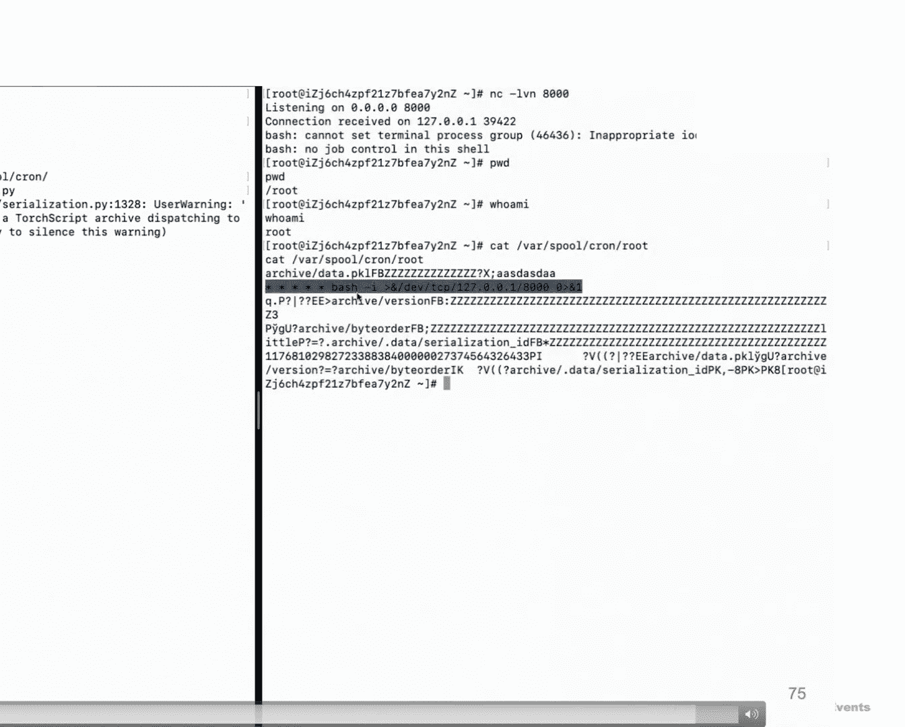

# Safe Harbor or Hostile Waters： Unveiling the Hidden Perils of the TorchScript Engine in PyTorch [rZ0Jnu5gtqo]

Hello， everyone and thanks for coming。 I'm very honored and excited to be here to give a presentation。

 So today my topic is Sa Harour or Ho watersveing the hidden pairs of the Torch screen engine intorrch。

😊，So first， let me briefly introduce ourselves。 So we are all security engineers from Alibaba Cloud。

 and I'm Jianzhou， and I complete this work together with my colleague Li Suoong。

 and we were really looking forward to come here， but unfortunately due to visa application issue。

 wewhile am able to attend the event on site。 So we sincerely apologize for this。 And as a result。

 we will we have to share our presentation through this prerecorded video。

 And if you have any questions about this topic， feel free to contact us via Twitter。

So here this is the agenda， so first is is the introduction and background knowledge and then I will introduce where this story begin and after that I will analyze how this only works and analyze the To screen range and finally is the impact of this vulnerability and some defense recommendation and summary。

So first， introduce you。So what is Pech。 Ptorch is a machine learning framework based on the Torch machine learning library。

 and it was developed by Facebook and now it is an open source project and it is very easy to use and has some really great features and Ptorch is widely used in the deep learning research and natural language processing or called NLB and computer vision。

But to be honest， in the field of machine learning， and there are many。

 many popular frameworks and well known projects like Tensflow and Cur。However。

 according to the official paper with code website and you can see that Pytor has undoubtedly been the most popular machine learning framework and so if someone can find some bugs in such a famous machine learning framework and that will be a really cool thing。

So let's come to the second part where it all began。So in the early days。

 Ptorch used pickle to load and save models for convenience。But however。

 pickle is one of the most well known security issues in Python， and in fact。

 the official pattern document warn that using pickle can be unsafe and especially when loading unt trustedted data。

So in 2021 and someone raised this issue on Github and called for a solution to address the pickle issue。

 and finally， in 2022 and Peth released a notable updates that introduced the whistle impairment。

So let's briefly emphasize the implementation of Wi onlyny and as we can say that when with onlyny is not enabled and this is by default。

 Heych will use pickle to save and load modules and which introduce security risk and however。

 we we set with onlyny parameter and it will use something called with onlyny and pick and this is a restricted pickle to load the model。

And here let's try try to use the only and you can see that by default。 the onlying is set to force。

 and we can easily R via are a evil pick module。 and you can see that we just use this reduce magic method and we will execute Hu my command and we save the module and load the module and you can see that we successfully execute the command and we can without root。

😊，However， when they use this only equal true and it just raise the exception。

 and it seems that the vulnerability is effectively mitigate。😊，And also on the official Pat document。

 you can also see that they consider withholding equal true is safe。

 and at the same time they just warned that loading and trusted checkpoint with votes with onlying equals false must never be done。

And additionally， when similar security issues are discovered in other Pth based components。

 they often fix it by using Ving equals true and here is the example initially VOM will use To dollar without withing equals true and which introduce a security risk and then they just patch this vulnerability by adding the Ving equals true parameter。

So not only will M in general whenever a software is found to be using Toal load without Vsononic or true。

 and the fix is always the same way， just adding this parameter。 But here comes the question。

 can we blindly trust the security of Vsony。So next， next。

 we will dive D P into to how this only works。And earlier。

 we pointed out that withholding is something like a restricted pickle。

 So before we analyze how withholding is implemented when to understand how pickle works。

So pickle is just like an interpreter and it reads an interpreter each of code in sequence。

 Ex executing the corresponding operation。 So here in this case。

 we first encounter the global code and it will execute the load global function and here it will just load the target function and so for example here。

 we will load the system function and we will push it onto the stack and you can see here。😊。

And then since we get the function and we need to construct the parameter。 So first。

 we will execute the un up code， we will execute the uncode function， and it will with a string。

 So here it is Hu my command。 And since the command must be the tu。

 So we need to wrap this string into a tu format。 So we just add a tu1 up code。

 and it will execute the load tu function。 So we can see here after we execute the load unor function。

 and we will push the Hu my string onto the stake。 And after we execute the load tu1 function。

 and it will wrap the Hu my string to a tu and push it onto the stake。😊，So finally。

 since we get the function and it' parameter and we can execute this function。

 and so here we will use the reduce of code and it will use the reduce reduce function and you can see here it will get the argument from a stack get the function from a stack and s and we can achieve command So how does this only address this issue and through the above example and we can roughly sense that the most dangerous part of the peak disization is load global and load reduce So the V only and P code just add some restriction to this dangerous optical code and looking at the code you can see that the load global function just add some white list and blacklist check to prevent security issue and also load reduce function is restricted in a similar way and you can see that it has a white list。

😊，So in general， wasteoning is implemented using a white list and a blacklist。 So how can we bypass。

And a common approach is to exercise the white list and check if there are any potential dangers of code。

 and I did the same， but I didn't find anything useful in the end。

So we are often limited by the fixed way of thinking。 So for example， here。

 most of us may only see the obvious rightlist and blacklist mechanism and just stop here。 however。

 in reality the loading process of To load with without equal true is quite complex。

 So is it possible that there might be some issues elsewhere in this loading process。

So I try to conduct the complex analysis of the with workflow to ensure nothing is missed。

So I started under the entire workflow， and I just stepped through the code and debugging line by line。

 And during one of my exercises， I found this something strange。 And you can see that To J load。

 So what is that。😊，And I have no idea with that。 So I just search on Google。

 and you can see that To store G is used to load the module in the 10 toscript format。

 So now you can understand why we name this topic Yeah。

 we will analyze and exploit the toscript engine。Hello， everyone。

 this part will cover the basics of touch scrap and its cover and its code in。

Toscript is used for deploy model in environments without pass interpreter， such as CPP and mobile。

 It can be comparedd from person code through script or tracing and save as P D file。

 which can be loaded and run in CP P and mobile。 The save and load process involveization。

 I will explain how person code is comparedd to touchscript。

 The serialization and decentsilization process。 the structure of P D fields and finally。

 how it ex execute。First， we can use touch jettyscribe decator toscribe one person function to touch subscribe。

The steps to compile are first price person source code into a S T。 second。

 convert the person S T to a J T S T。 Third， transform the G， I T S T into an I R graph。

The aircraft initially contains many and necessary notes。

 which are limited through optimization to make it more consistent。

Let's take a deep look about the compare process。Before we start。

 I need to show what is function and model in this context。 You can see that one is function。

 The other is a class。 The scripting process for these two are somewhat different。

 so we will introduce them separately。Let's look at the function force。

 The compare process is handled within the script M M MPPL function。There are two main functions。

 Get J， get G I T de and G， I T script compile。 The get G T de function performs two main tasks。

 First， it used the A S T library to convert person code into a person S T。And second。

 it cause build Dev to transform that passenger S T into a surf employment GT S T。G。

 I T compile is a function bound from CP P to person， which is a in the CPP layer。

 It further converts the GAT T S T2 I R within the CP CPP code。

It eventually invokes the two IR function， which finishes the transformation from the。

 from G A T S T to I R。 Additionally， the two I2 I R will also cause some optimization functions to simplify the IR graph。

Now， the function compare process is done。 A high a high level understanding of the process is enough for this sharing。

 If you are interested in the complete source code details。

 you can use the costtic I have provide to navigate through the source code。Then。

 let's look at the model。The overall process is similar to that of functions。

 Exp there is an additional step at the beginning， retrieving all functions from the model。

 It need retrieve functions and compare functions 1 by one， the stops。

FN function is responsible for handling this。Stops F N is an alliance for inform methods to compile in this context。

 Let's see what the inform method to compare function does。In the in method to。

AComp function is first use D IR to get all attributes and methods of the model after filtering。

It saves the methods and need to be export thereby collecting all functions in the model that require confirmation。

Competition。Make stop from method converts the collect functions into JAT T S T using the get GT depth function。

 which is the same one used do during function completion。Back to create script model M。

 the method stops。 variableable stores the G T S T we just converted。

And the create methods and properties from stops function takes method stops as input and is responsible for converting it to I R。

We can see that this castic is similar to the castic for function completion。

 Both eventually finish the conversion into I R function。 Now， the model compare process is done。

Overall， some key steps are the same for function。 Both use get J T depth to convert person to JTS T。

 then convert to I R through to I R。The serialization feature can save models and deploy them to other environments。

 Use touch save to save model as P T file， Use touch load to load P T file as a model。

The person code here is converted from I。 You can。 You will note。

 You will notice it's slightly different from the original code。

Let's see how script function script model isized。 Surcr function has an additional step compared to script model。

 It needs to be converted to script model， first。After that， both call civil for civilization。

During the civilizationization process， some information is stored in the data P and constant P here in pick format。

 Additionally， it saves the person code converted from A R and bug information to the code folder。

To summarize the save process， the touch function first converted to touch model。

The remaining process is the same。First， the I value corresponding to the model isized in pick format as data pick L。

Second， obtain the code and debug info info viathon print and write to code directory。 Third。

 save tensor consent to constant P L。 Now， the serialization is done。

 Let's look at the detail of the P file。The P D field is compressed， compressed chip。

 using zip compression。The field tree after decompression is show above。

And we can use pickle tools to dis dis disassemble it above is the disassembled output of data P。

 The meaning of this pick pick code is create an object named touch please holder model。

And set its training attributee to true。 And the touch placeholder model object is script model。

 So when interpreting data here， model object is great。The constant P L contains pick code。

 which can create high value object with tensor。The touch P field contains person called strings。

It's the same as the content of the code tribute in circuit model。

 because they are obtained in the same way。Okay， now we understand the three most important parts saved in the serialized few data P here。

 constant P here and the source code in the code directory。

 Let's see how these parts are restored into a secret model。We can see that in the detail。

 in the desilized function， the three main parts of theized file are converted into a circuit model。

 Let's look at the function implementation。D satellite lines will call read the chip to read constant P and data here。

 Then well get one model in CPP， which is model in Python。During the decilization process。

 force uning constants vehicle careful to obtain tensor constants， then save in constant table。

Second， unping data， during the process of unpicing data。

 relevant source code is read from the code directory and pressed as needed。

And related concerns are also read from consensus table。

The code pricing process includes convert person code to custom tokens and then transforming tokens into J T S E。

 S T。 And finally， into I R。 This process differs significantly from the earlier person to touch script completion。

To summarize the load process， first， rich main logic via decralize。Second。

 call read chip to read constant P。 convert consent to I values by empirical and save them to consent table。

 Third， call read chip to read data P L restore corresponding I values by force during data P source importer read code fields and constant table to restore I graph I R through。

Press type。呃，Find name type呃 to import name type。Now， the decsralization is done。

 Let's take a look at how touch circuit is running。The air graph consists of many node。

 and every notes contain three parts in output and O code。 Ob code is the key to execution。

The process of executing touch script is to iterate through the I R and convert it into instructions。

Then， interpret the instructions。Every instructions have one O P code。

 There is a switch table here that finds the corresponding process logic through the O P。

 and then execute it。Now， we have a basic understanding of the touch bookflow。While reading the code。

 I discovered something interesting。There is one O B code names O， P。

 and it can do a call on operator table。The operator table contain many functions。

 corresponding to operators。I'm curious about what operators they are。

Some between functions register themselves as operators。

 requiring option instructions to call corresponding functions。

And the register operators class manages these operators and register them by register operator function。

 I pitch the personython code and add one function to output all operators。

 You can see there are over 2000 operators here。A all these of Peter safe。

During our code audit of these operators， we discovered two interesting operators save and from few。

Here we can see the corresponding implicationss of these two functions。

 The same function will save specified value as model to specified field。

This can lead to arbitrary feel rate。But the saved file contains a lot of dirty data。

 which model information。The from file function will read the file。

 which I specified and convert the file content to tensor。Then return the tensor。

 We can get the few content from the tensor。 Now， we know these two operators have vulnerabilities。

But there is still a problem how to call them from touchscript。To get the answer。

 we need to force understand the operator registration process。

The get built table function registers some object member functions to building ops。

And during this process， it also adds perfect to the member functions for rename。Finally。

 the address of these functions and their modified names will be placed into building table。

During the touch script completion process， the two sugar the two sugar value will be triggered where it checks whether the person object exists in building table。

 If it exists， it return a building function。Finally。

 this building function will be inserted into the aircraft graph through emit building call。

Back to the built registration process， We now understand that essence may come from one of these objects in models containing builts。

By testing each object individually for the process of the， of a save function。

 we will find that the save function exists in the touch object。

Item from file can also be obtained in the same way。

So we just need to call touch save or touch from fill to get arbitrary feel read right ability in touchscribe。

Now， we can try writing a file to get R E。 but since there are some dirty characters。

 only specific specific special fields will work， will work。The Utu。

 the obtu coin tab failed because of a promotion mismatch。 Our script use touch save。

 which write fill fills with 6。For four permissions。But the current diamond requires。6，0，0。

Here is one poke video。

You can see we get CE。The vulnerabability， the vulnerabilities we have discussed so far might be more similar to logic vulabilities。

On the other hand， some hackers may prefer the memory related v。

 We have also discovered a few overflow issues。Here， you can see that when we load this model file。

 it triggers a hip overflow as a result， as a result。

 we can observe that hip hip address and the load address of the library are leak。

This is one poke video。But due to time limit， we won't go into them in great detail here。

We hope to share them in the future。Okay， this is the full details of this C V E。

The fix is also relatively simple。It prevents the use of touchscript when you。

 when what only is enabled。So next， what is the impact of this monoity and the entire AI ecosystem is that like this house。

 and the path is the。Fundamental components。 And if there is an issue with pet。

 and just like we have removed one of the bottom level components and security of the entire structure is then compromised。

 And we did a simple search on Github for projects using Vionicco true。

 And you can see that a lot of projects use it in this way。

And here we select two well known projects as examples to illustrate the impact of the vulnerability and one is VOM and the other is transformers。

So what is V IM and VM is the high performance library for large language model inference and optimize for speed and marriage usage。

😊，And so why did I choose it， Because in fact， it happened to have a CVE and CVV just said that it used touched a load function without its only equal2 and which has a security issue。

And they just patch this vulnerability by adding the whistleing parameter。

 and this seems to solve the problem。 But because of the pet issue and all mitigations end up being ineffective。

So the safe harbor we once thought was actual household waters。Also， at the same time。

 I noticed a very interesting phenomenon。 and you can see that in the requirements CPU dot TST。

 and you can see that it just hard coded a Pytorch version and also in the GPU version and you can see that it also hard coded the Py version。

So what does this mean， And this means that even if a Pat released a new patchd version and users of VM cannot update timely because VM has headed this version as a result。

 the they will remain exposed to this vulnerability for a long period。And first。

 let's set up our environment and since the latest version of VOM has already fixed this issue and we need to install an old version exactly 0。

7。3 and you can see that when we install VLM and it will install the old version of pettorch。😊。

And so here we will use this function as an example to demonstrate the existence of the vulnerability。

At first， I didn't think too much about that。 I just want to take the poke from the previous onener and use it right away。

 hoping for a one should success。 And you can see here when we enter the logic we want。

 it will definitely load our model。 So we will we succeed。😊，But in fact。

 just field So why and let's take a look at the previous poll and you can see here after loading the model and we need to invoke this model in order to trigger the forward logic。

 but here after we loaded the model and you can see that it doesn't invoke the model it just get the at attribute and then delete this model So。

Is this really the end。But however， at that point I noticed the exception message it just said that the model object don not have the attribute named at and this error message just provided me with some inspiration。

So at is essentially a keyword in Python and commonly used to deter our dictionary type objects。

 As you can see here， in fact， at is a function。 So can we suppose the function name。

And so I made my first try。 And however， when we write the code in this way。

 I just change the function name from forward to items。 and I run the call。

 but you can see that we still get this error message。

 and why it is still saying that we don't have the item attribute。😊，But however。

 I try to write it in this way and we just call the items function in our forward message and you can see that when we run the code and we successfully trigger the logic。

😊，And so this will very， very strange。 And the reason is that when we retririeving the model functions。

 it defines whether this function needs to be exported for function， not decorating as export。

 and there is a lazy export strategy， So mean that they are only exported if called within export function。

😊，So here you can see that in the left picture and you can see that we just decorated the item function with Tochdo G do export。

 So here the object the model will have the items attribute and in the right window we don't decorate it with Tochdo G export so we need to call it in the exported function。

 So in this way and the object will have the items function。 and if we don't do that。

 our object will not export the item function。 So if we definitely not find this attribute。😊。

Then in the end， we report its responsibilitynerability to VM and they highly acknowledged our work。

 And you can see that the team member just said that this is very interesting because petth document just claim it safe。

😊，And the patch is very simple， you can see that it just changed the version of polytorrch。😊。

And the next is transformers， so transformers is a very popular open source library made by Huging face and provides pre trained models and tools for natural language processing tasks using transformer based architectures。

And also so you can see that transformers also implemented some security handling measures for To load and you can see that it by default will use which only equals true and first。

 set up our environment saying the latest version of transformers has already fixed this issue we need to install the old version 4。

51。3。😊，And this is official usage guide for transformers。

 and you can see that we need to load the model and create a pipeline。

 and then we can start having a conversation。 So for example。

 we can ask the secret to back in a really good kick is and you will got an answer and to use the right ingredients and for the recipe and here you can use my demo report and you can see that my report only has three field one is readmi and another is configured Jason and also have a field named Pat model do bin and this is a text Paty field and if we run the code and you will finally call the To load to load our evil model。

😊，And let me introduce the code and you can see that when we loading a remote report and it will load remote model and by default fields in sequence format or in P formats are allowed。

And like the previous probability， and it will invoke the key function。

So here we can just spoof the function name to key and save the model in our local report。

And and then just load the local report。 and you can see that， of course， we can explore it。😊。

And then I just report this vulner to to the transfer to hugging phase and you can see that it just fix it and they fix it the patch is very simple and you can see that it just checked the page version must be greater or equal 2。

6。😊，And finally， in on defense recommendation and summary。

 So if you are still using an own version of pet watch， please update now。

And here is also some recommendations。 So for the model format perspective and you can see that we should use more secure format like saves。

And also from the model community perspective， we need to scan and flag Malaysias models and also hugging face has already done the relevant works。

 and from the user perspective， we should not know en trustedive model。

 and it is better to note this model in the singlebox。

So any questions？And thanks again for listening。 And if you have any further questions。

 please feel free to contact us at any time。😊。