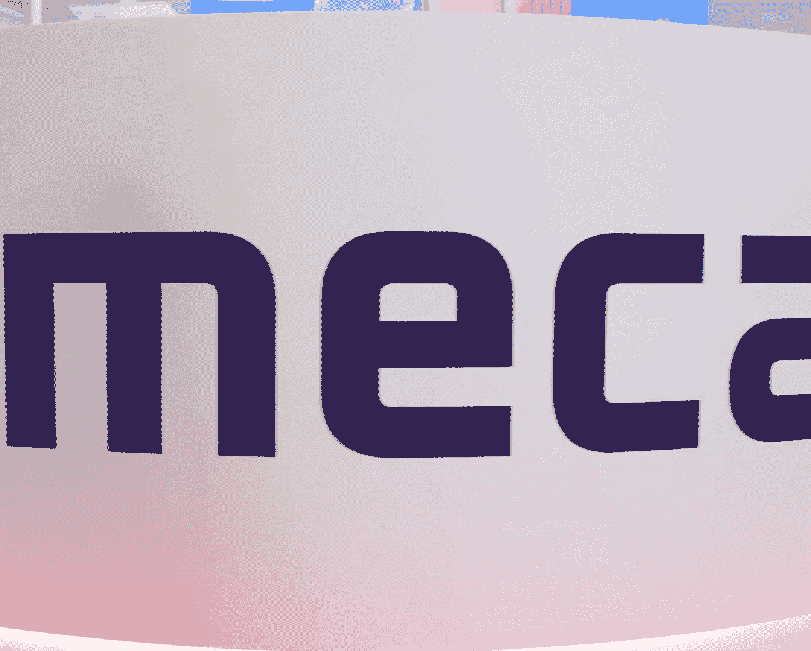

# Securing the Human： How Mimecast Tackles Email Threats and AI Risks [I9vxFR-tzII]

🎼Yeah。なんだがら。Well first and foremost， we're grateful for our customer base that really brought our attention to the fact that email really takes two things to trigger risk。

 it's not only the attackers that are sending malicious emails or phishing attempts to their users。

 it's then a user actually taking action and clicking on those links So for us it's necessary when we talk about securing that riskiest vector that email threats that are coming in that we actually not only have to secure the data that's coming in。

 but the human that ultimately sits behind it here at Minecast for the last couple years。

 we've been acquiring a number of technologies that allow us to take that full view of that human in understanding for example。

 how they're doing around their security and awareness training。

 understanding what risks that they represent around data loss and insider threat while at the same time even being able to enforce those compliance controls that we need in place so for us elevating the conversation from email security to securing the entire human was a logical evolution and most importantly we heard from all of our customers that it was a needed one。

Able to protect their organization better。🎼When it comes to human risk。

 one of the biggest challenges is figuring out who your riskt users are from our data here at Minecast and the billions of emails that we process every day。

 our research showed that 8% of your users lead to 80% of your risk so it begs the question of how do some organizations and gather all of these signals about risk and aggregate them together in a way where they can quickly identify who those riskiest users are。

 and in particular， what users might represent a certain risk if they're being highly attacked。

 for example， on the email security side and at the same time they don't do well in simulated phishing attacks。

 we know that those two vectors come together and actually amplify the level of risk our human risk command center is all about making it easy for administrators and security leaders to spot where their risks are in their organization and apply adaptive controls to those pockets of risk so that they can proactively prevent those risks that are coming in identify future risks and most importantly。

 control and secure all of their best practices。Those users and protect them fully from any of those attacks that might be presented to their business and that's the Human Risk Command center It is the central page by which we're able to spotlight all of those risks in a single pane of glass way。

 delivering that on a silver platter to the administrators who need to make those kind of decisions and apply those adaptive controls to prevent the risk from entering an organization。

GenAI is changing the way in which we all work， I mean。

 from the users inside of your organization to unfortunately the way that the hackers and attackers are trying to gain access to your organization。

 It allows all of a sudden some of the risks that we're able to easily spot before be able to be simply adjusted and bypassed using these AI tools and what this means is that we've got to better secure the users from those GenAI attacks which are folks firing laser targeted。

 accurate phishing attempts at those users and at the same time we need to make sure that your organization and the productivity gains that you're getting from JenAI are essentially secure it as well Our users in today's world are trying to do so many things and they're all very well intentions most of the time what we find is that users don't understand those security best practices where they're going around those security best practices and accessing maybe unsanctioned AI tools in their organization and what this means for us is that we've got to do a great job of understanding what security tools you're implementing your organization。

🎼What Gen AI tools are you allowing your organization to access and then most importantly is make sure that your employees are being redirected to those sanction mechanisms for them to be able to use AI all while at the same time using AI tools in our products to spot these risks that are being presented to users and stop those threats before they come into an organization and I'll tell you I couldn't say this loud enough for everybody to hear but GenAI is changing the way that we all work。

 and we encourage organizations to embrace these technologies that are going to make them more competitive。

 that are going to make them more secure， that are going to make their users more productive。

 but it's really important that we bring a lens of protection around those tools to make sure that their data is not accidentally or purposefully leak in a way where attackers can take advantage of it and that's what we're doing here at Mincast right now securing AI the usage while also applying it to our technologies to get the best threat protection we can on the market。

