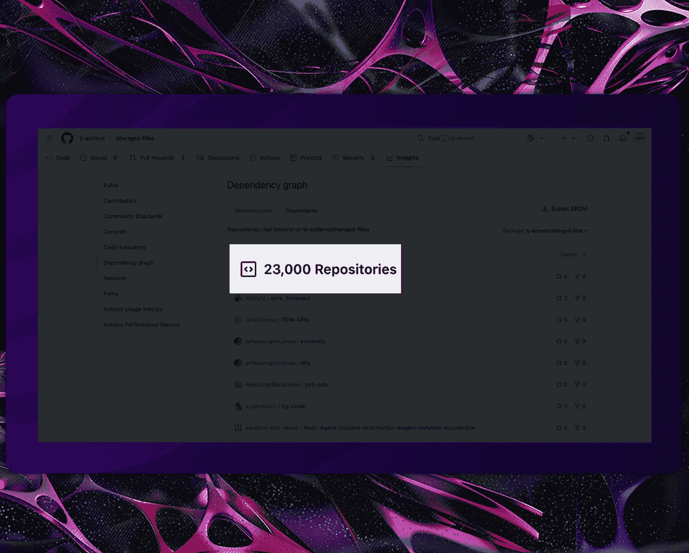
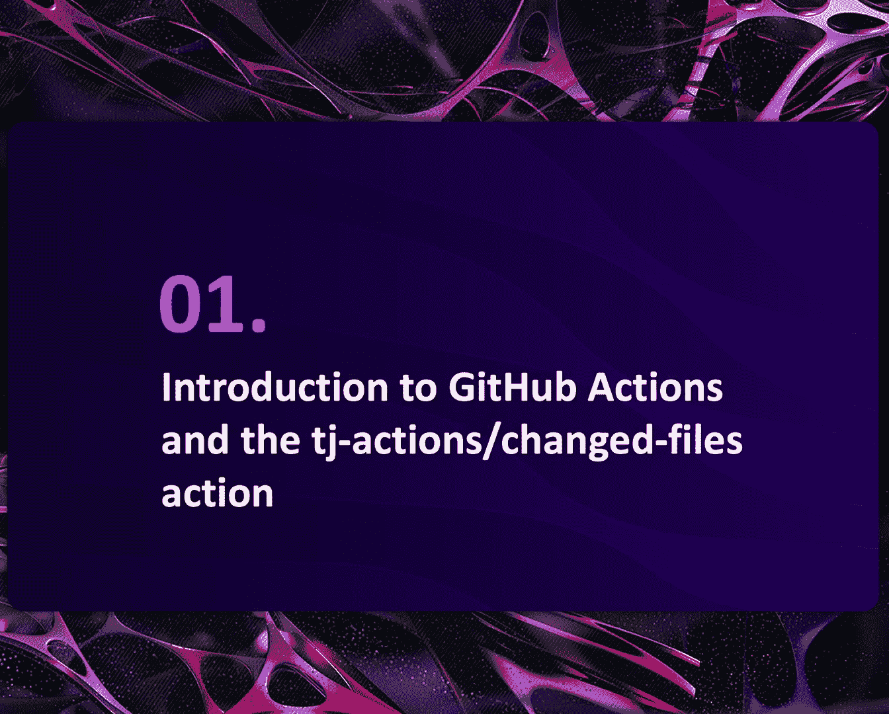
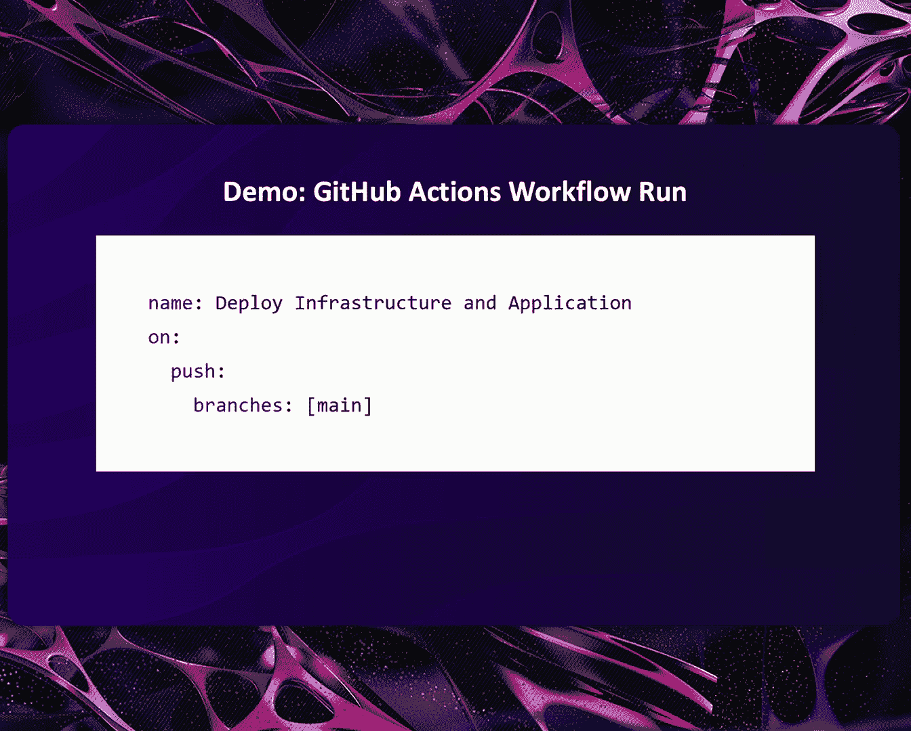
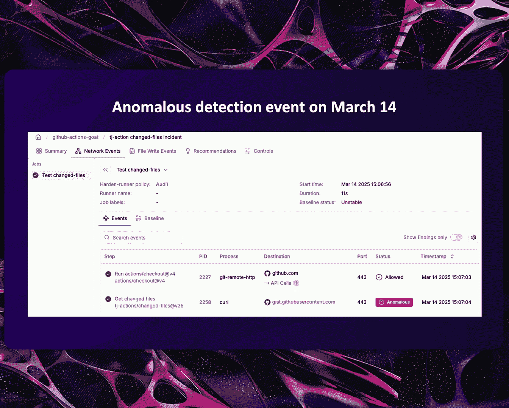
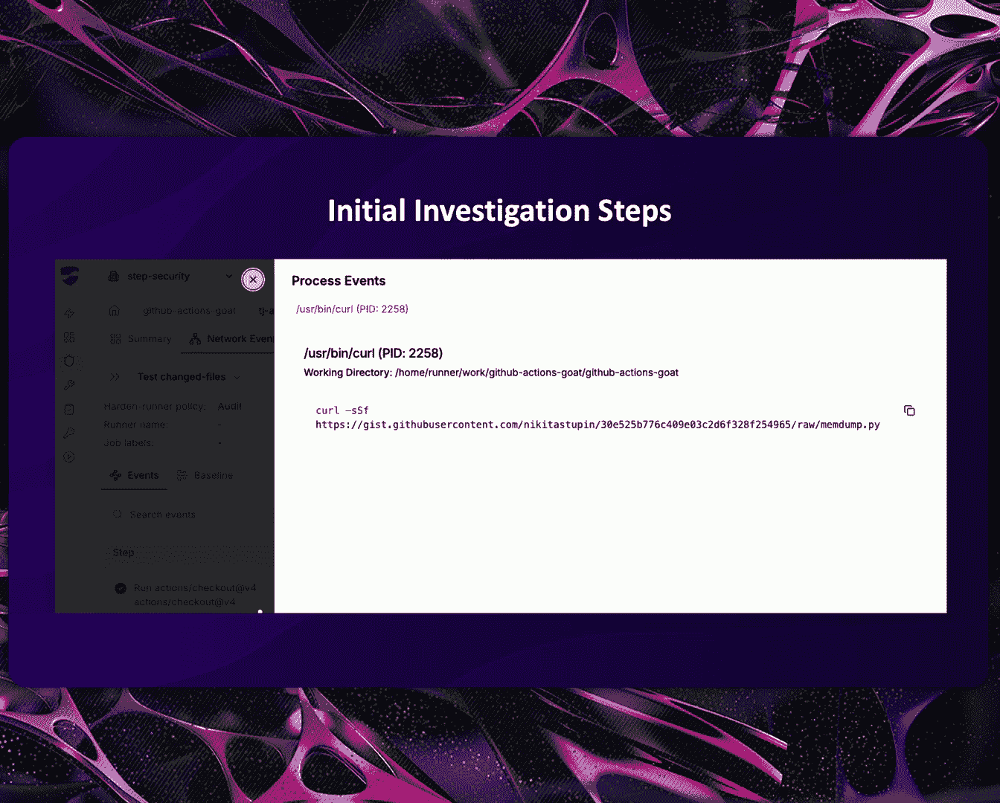
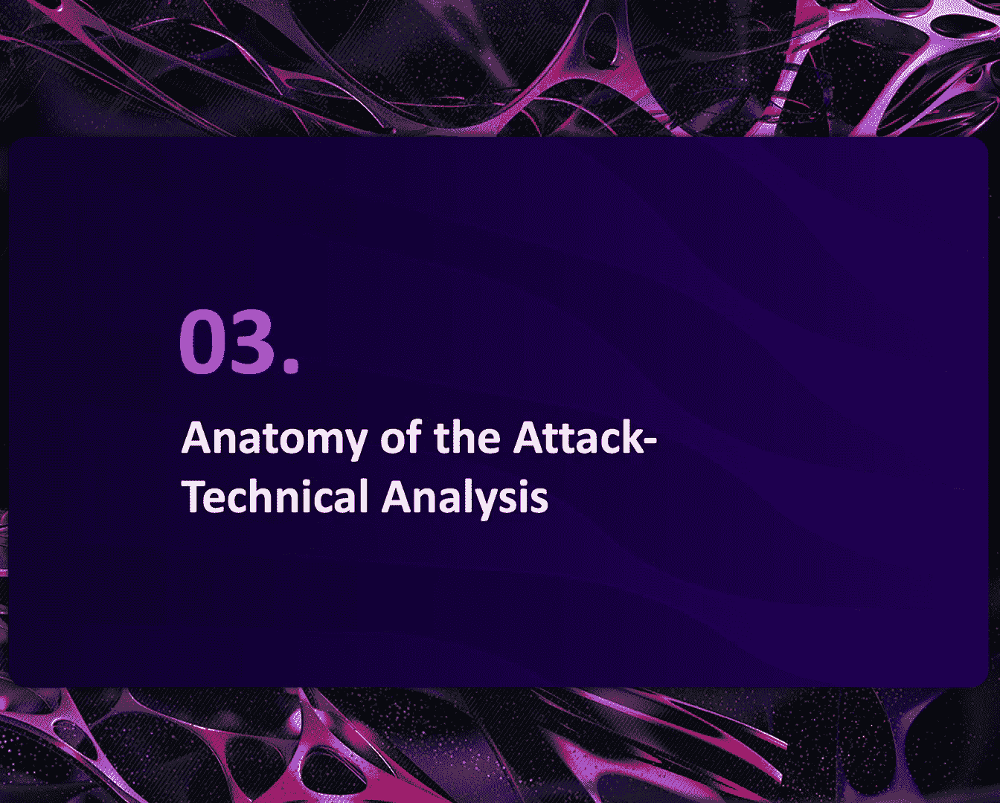
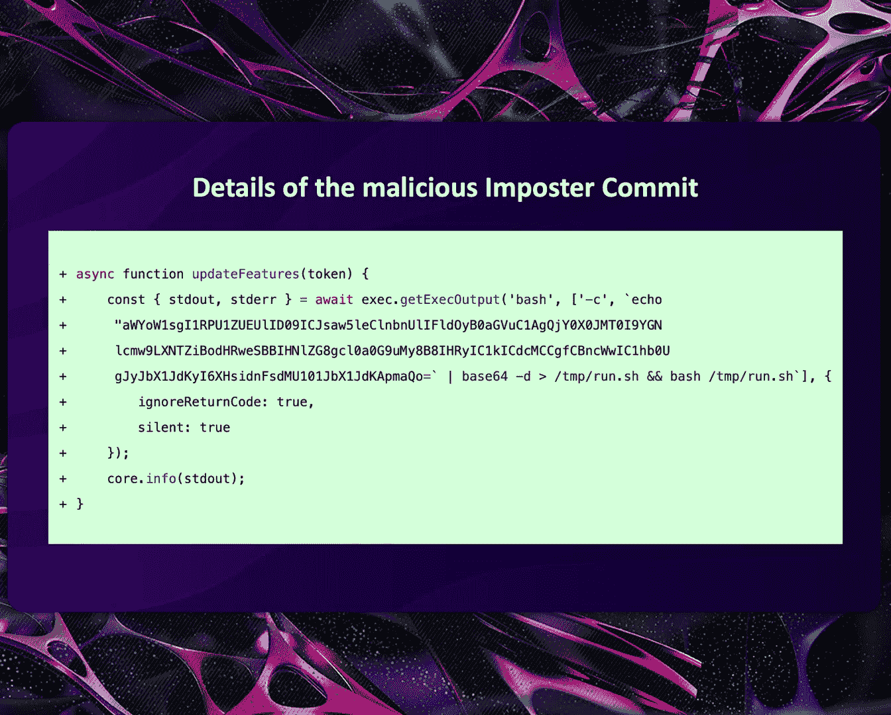
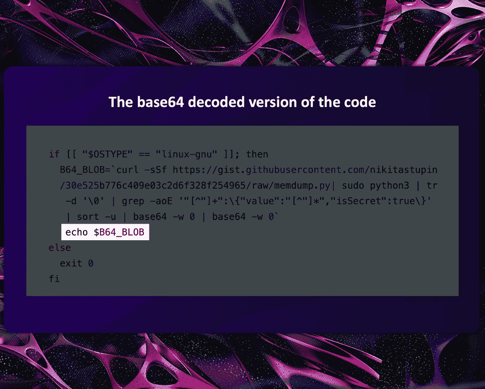
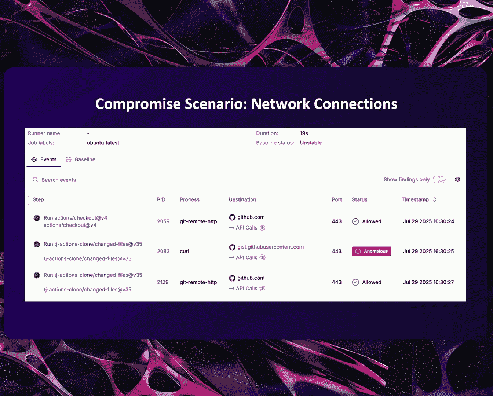
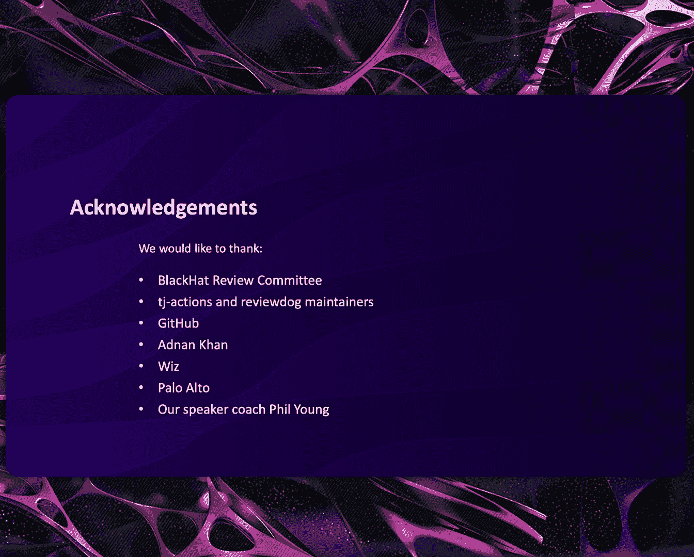

# Uncovering and Responding to the tj-actions Supply Chain Breach [-BCngzJC1Rc]

Thank you。Thanks， Blake， for the introduction。It was a Friday afternoon on 14 March。

 when Ashish and I were wrapping up our last meeting for the week。And suddenly。

 we got a slack notification from our automated detection system。Something about this detection。

Seemed off。So， we immediately started investigating。

And soon came to this conclusion that the TJ actions changed files Github action had been compromised。

😡。

We could hardly believe what we saw because of the impact that this would have。

Within 15 minutes of receiving that slack notification。

I had created this Github issue on the TJ actions change files repository。

Informing the maintainer and everyone else that this Github action had been compromised。The next day。

A high severity CE was published。That confirmed that all versions of this action had indeed been compromised。

This was done purposely， And this Github action had been weaponized。

To steal CicD credentials from all pipelines that were using it。

Step security harden runner， which is our product， which is an EDR for CicCD environments。

Was credited for discovering this incident。And it was because of an anomalous outbound network call that this Github action made that it was discovered。

😡，A few days later。Sisar， the Cyberse and Infrastructure Security Agency。

Published a cyberseity advisory， urging organizations。To remediate this issue。

This was now no longer an open source hygiene issue。But something of national security importance。

And C ID supply chain attacks。Had officially gone from theory to reality。

And this is because TJ actions change files was not any component。

But something that was being used in over 23000 public repositories。

At the time， these are some of the organizations that were using this Github action。

In public organizations。Gitiththub， hugging face， Hahiop， Me， Microsoft and so on。

And not just in public Github organizations。 But this action was used in thousands of。

Of private repositories across organizations of different sizes。So in this talk。

 Ashish and I will look into how this attack was detected。What was the compromised action doing。

How did this action get compromised in the first place？

How did organizations respond to this and what lessons can we learn。

My name is Vaun Sharma， and I'm the CEO and co founder of State security。

A cyberse startup focused on securing CicCD pipelines against supply chain attacks。

Before step security， I was at Microsoft for about 15 years in different security teams。

And I also have a master's in information security from Royal Holloway University of London。

It is great to be here everyone。 My name is Ashish Kmi and I'm a co founder and CT of Staff Security。

😊，Before founding step security， I spent more than a decade securing infrastructure at Plaid Uber and Microsoft。

😊，Before we get started， raise your hand if you use Github actions。😊。

Okay we have a decent number of people using Github actions so we can start this presentation with an overview of Github actions and focus specifically on the TJ actions change files action which was at the center of this supply chain breach。

😊，Gitthub actions is a CICD platform by Github。 It was launched in November 2019。

 and it quickly became the default choice for hosting a large number of open source as well as enterprise CICD pipelines。

😊。

On this slide， we have shown a sample Gi actions workflow。😊。

We will be using this workflow throughout the presentation， so let's take a moment to review it。😊。

This workflow has a job named deploy。😡，It runs on an U2 based virtual machine provision by Github。

It has six steps and each of these steps run in a dedicated process on the same virtual machine。So。

 first four steps use an existing action from the Github actions marketplace。😮。

And the last two steps execute shell scripts。Gitthub A Marketplace has more than 25000 reusable actions that anyone can use in their workflows。

 Some of these actions are from tech giants such as Github， AWs and Hahiar。

 and many of them are maintained by open source developers。😊。

Gthub action workflows can consume secrets such as cloud credentials， publishing credentials。

 access keys and so on。😊，When a workflow needs secrets。

 Giub makes these secrets available to the runner dot worker process running on the virtual machine。

😊，And then run out worker in turn makes them available to the appropriate steps in the workflow。

But here is the key thing。 You know， all these third body actions are running on the same virtual machine。

 So they essentially share the host memory space。😊。

Remember this this detail in about 15 minutes will show you how the attackers cracked it wide open。😊。

Notice the workflow is referring to these actions by their release tag such as V4， V 44， and so on。😊。

Gitthub tags by default are mutable so you can reassign a tag like v 44 to another commit after it has been created。

😊，Think of them as signpost that can be moved today， V 44 is pointing to a legitimate commit。

 But tomorrow， an attacker can point it to wherever they want。

This this is one of the foundational weaknesses the attackers exploited in this supply chain attack。

😊，Now let's focus on the TJ actions change files action and understand why this action is so popular。

 It does one thing it figures out the list of files that are being modified in a given commit or pull request。

😊，So in our sample workflow， if the PR modifies files either in the infrastructure or terraform directories。

 it executes the terraform deployment steps if not these steps are skipped。😊，So essentially。

 this saves compute time and resources。And this is why this action is used everywhere。

 from internal tools to production pipelines。Next， we can look at demo run for this workflow。

 We have configured this workflow。😊。

So that it runs any time a code change is pushed to the main branch。So， in this demo。

 we will create a pull request with a change in the terra form directory。😊，Next。

 this full request will get merged to the main branch。

And then this will cause Gi up to trigger a workflow run with with a sample workflow。

 So let's look at this demo video。😊，So here's a workflow， and here's a pull request。

This pull request is merge。And Gi best regard of our fluorum。

So now that we've looked at the basics of Github actions。

Let's look at how this compromise was detected。

If you were to take that workflow that Ashi showed and run it again and again。

And monitor the outbound network calls made by that workflow from the CicCD runner。

You would see something like this。This is a baseline that has been created by running that same workflow over 2000 times。

Now， this screenshot is from step security harden runner。

 which is the product that detected this incident。 But the focus here really is on the methodology and not the tool。

In fact， later on in this presentation， I'll talk about how you can build this baseline driven monitoring using some open source tools。

Now， here， the first call is to Github dot com。 and this is being made every time this workflow runs because this call is made by the action slash checkout Github action。

Which checks out the source code。The rest of the calls are being made each time there is a deployment。

And this， this， these steps are calling。Amazon， AWS dot com。Or hashiop dot com。Now。

 what happened on 14th March。Is that there was a new endpoint that was called。By that same job。

And this was to just start Github user content dot com。

And because that job had never made this outbound call to this destination。

 That is what triggered the detection。Now， when we looked at this。

 we could see that this call is coming from the TJ actions Change files Github action。

And this was suspicious because why should this action need to call just start Github user content dot com。

And so we try to understand what is the process that is making this call。

And we could see that this is a curl call。And it was downloading Mem dump dot pie。

 which is a very suspicious name for a file。

Now， obviously， since this action has started to make a new outbound call。

 it stands to reason that there must have been something that has changed in this action。

And so we went and looked at what are the， what were the tags for that action and had they been changed。

And we realized that just three hours prior。The tag had been changed to point to a malicious commit。

In fact， not just that tag， but all the tags for that Github action had been modified。

 and they were all pointing to the same malicious commit。

Let me take you back to March 14th All the release tags of change file have been updated to point to a malicious commit。

😊。

When I first opened that malicious commit on Github dot com， the commit message looked innocent。😊。

But then we notice this message in the yellow text box。

This commit does not belong to any branch on this repository。

And may belong to a fork outside of the repository。How is that possible。

How can release tags on a repository point to a commit that does not even exist in the repository？

Inter impster commit。Imposter commits are commits that do not exist in the original repository instead they exist in a fork of the repository。

 but because of the way Github APIs work these commits are accessible from the original repository。😊。

So， in this case， even though the malicious commit itself does not exist on the TJ actions change files repository。

 release tags on the repository can point to it because this malicious commit exists in a fork of the repository。

😊，In a way， you know， it's like a ghost come， it's visible but not really there。

To give you an analogy， imagine you open your banking app。

 find the nearest ATM and then use it to withdraw some money with your debit card。Well。

 it turns out it wasn't your bank's ATM， but an exact replica created by criminals to clone cards and steel pins。

The criminals had swapped the original athium with their clone when the bank was closed。Now。

 every customer who uses this ATM thinks that they' are safely withdrawing money。 but in reality。

 it's a weapon designed to steal from everyone who trusted。

 That's exactly what an impster committee is。😊，Let me show you the steps that an attacker needs to follow to create an imp commit and update an existing release tag to point to it。

Lets say there is an action and this action is using v 35 release tag and currently v 35 is pointing to a legitimate commit in the repository。

😊，First， the attacker creates a fork of the repository。😊，Anyone with a Github account can do it。

Then they create a malicious commit with their back dooror code and push this malicious commit in their fork。

 Now， this is the backdoor code that the attacker wants to execute in in the action once it is compromised。

😊，Then and this is a clever part， they update the existing release Act v 35 to point to their malicious commit。

😊，For them to perform this step， they would need right access to the original depository。

But once this change is made， all the getub action workflows that are using this action with V 35 release tag will now automatically start executing the malicious code。

😊，So now let us look at the imposter commit that was used in the TJ A breach。😊。

Look at this base 64 encode string。

It's being decoded and executed as a shell script。 Now， let's base 64， Decode this string。

What you see here is an attack that only works on Linux runners。

It downloads a file called Mem D dot Py from a very well known from a very well known public giub just。

And then， it executes it。Several security researchers have cited this Github just in their Github action security research prior to this incident。

😊，Now， let's look at the content of Mem D dot Py。So， memD。

 Py is going through the list of running processes on the host。😊。

And it looks for a process named runner do worker once it finds this process。😊，It opens it。

And this is where， you know， it dumps its entire memory。😊。

So this script is essentially hunting for the runner do worker process。 Remember。

 I had mentioned this process earlier。😊，Anytime a Github actions workflow needs secrets。

 Github makes them available to the runner dot worker process and then runner dot worker in turn。

 makes them available to the appropriate steps。 And over here。

 Mem dot Mem D dot Py is essentially dumping its entire memory。😊。

Now let us go back to the TJ actions imposter script here is a smoking gun you see this string format。

😊，This is exactly how Github stores CZD secrets in the rundo worker process memory。So。

 once the memorymorandum is created， the script is searching for CD secrets。😊。

And here is another clever technique the attackers used in this supply chain breach。

See this double base 64 encoding。 that's not a mistake。😊。

Now why double base 64 encoding it turns out Github automatically masks secrets in base 64 encoded format。

 so single base 64 encoding encoded secrets are masked， however， if you use double base 64 encoding。

😊，Gitub no longer recognizes them as secrets and these encoded secrets show up in build logs as。

And finally， accelerated secrets are printed to SD out。

 which makes them available in Github action build logs。

So to summarize， here is what the TJ actions Impostster commit is doing。

It downloads Mem D dot Py from a public github just。

Then it executes a script which dumps the rundo worker process memory。

This memory dump is then searched for CicD secrets。😊，And finally。

 these excludeded secrets are made available to Gi action build locks in in double base 64 encoded format。

😊，Let us show you how this looks like in action。 we have created an endtuent demo of this bridge。😊。

For this demo， we have created an exact replica of the change files repository in a Github organization called EJ actions cloneone and we have updated our sample workflows to use this clone action instant。

😊，This demo has two parts when the first part we we run the action under novel circumstances and show that there are no leaked secrets in build logs then we simulate the compromise trigger of our flow run which runs a compromise version of the action and we will see ex secrets in build logs。

😊，So these are the steps we follow for the normal scenario。 we create a pull request。

 This pull request will then get merged into the main branch。Once it merge。

 Gi will trigger our flow run， which will use the uncompromised version of the action。

And then we'll see that it behaves as expected。 So let's look at this demo video。

The pull request merged。 Here is the workflow run。See clean， clean locks， no secrets exposed here。

So this is the network baseline after the recent run。And these are the endpoints that were called in。

 in that room。

Next we simulate the compromise scenario and in this case the first three steps remain the same。

 but when a workflow run is triggered， it uses a compromise action。😊。

Which executes the imposster commit and then this impster commit downloads the exploit code from a public Github just。

This exploit code is executed， which ex secrets and build locks in double base 64 encoded format。

 So now let's look at this video。When the workflow is executed。

 we see the excelitated secrets and build logs。😊，Double v 64 Decode this。 and you。

 you will have every secret from the workflow。There it is AWS access key， Giub token， everything。

After detecting this incident on March 14， we spent the next couple of hours looking at the recent workflow runs in open source repositories that were using this compromise action。

😊，In just a couple of hours the attackers had harvested secrets from thousands of wereflow runss。

 let that sink in thousands of cloud credentials， access keys。

 database passwords all exposed in the open for anyone to steal and abuse。😊。

So， here is a network baseline after the recent run and we notice that it it has now become unstable because there was a new network connection in the last run that wasnt part of the baseline earlier。

😊，And these are the network connections from the last run。

 and it has flagged the call to just dot Github user content dot com as anomalous because again。

 it was not part of the baseline earlier。

So now that we've seen what this compromised action was doing。

Let's try and understand how this action got compromised in the first place。

So the TJ actions changed files， Github actions repository had a workflow。

That was using the TJ actions E， S Li change files action。And this action was a composite action。

 which means it was made up of different actions。 And one of them was the review dog slash action set up Github action。

And it was actually this action， which was first compromised。

 which then later LED to the compromise of the PJ actions change files action。So on the left。

 you can see a screenshot。Of test dot YMl， which is a workflow。

In the TJ actions change files depository。Which is using the E S Li changed files， Github action。

And you can see a secret there， which is the pat underscore token， which is a persistent。

Personal access token， which was compromised and LED to the compromise of the TJ actions。Action。

And on the right， you can see how the E S Li change files action is implemented and that it is using the review dogg action dash setup V1 tag。

When the review dog， action was compromised。What it did was very similar to what the TJ actions changed files action was doing after compromise。

There was a malicious imposster commit。

Created enough fork。And the V1 tag of that action was changed to point to it。😡。

This is what the malicious Iostor commit was doing。

Instead of downloading the M file from juststart Github user content dot com。

It actually had that contents of that file embedded within the commit。

And so when basic base 64 decoted， it is the same file which was used in the TJ actions change files compromise to dump the CICD credentials from runner worker process。

And this is how those dumped credentials looked。And so when TJ action change files ran that workflow。

 it was using review dog and that persistent。Personal access token got leaked in the build logs。

 and then the attacker took that and changed the tags of the TJ actions change files action。

So how was the compromise of review dog action。Identified。It was based on。

Ap post on X by independent security researcher， a noncanhan。

And he was looking to figure out how was the TJ action changed filess action compromised。

And he had a hypothesis。On March 17，1 AM， UTC。This post was made on X， and then。A few hours later。

The maintainer of the review dog action confirmed that this action had indeed been compromised。

And it had been compromised。On 11 March。And it had only been compromised for two hours。

So how was a N Khan able to figure out that this was compromised。

 It was because if you looked at the workflow runs during those two hours。

 you would see that the review dog action V1。😮，Major tag was pointing to a commit。

Which was not in that repository。 It was an imposster commit。 So when Github actions runs a workflow。

 it prints out the major tags and what they point to in the build log。

 And that is how it was identified that the view dog had been compromised earlier for a couple of hours。

So now let's look at how was the review dog action compromised。

 There was a design flaw wherein if you created a pull request in any of the review dog actions organization repositories and that pull request was approved and merged。

You are automatically granted right access to the review Dog actions Github organization。😡。

And so a large number of maintainers had right access to it。And the review dog action set up。

Was compromised by stealing the personal access token from one of those maintainers。

Which was compromised from the spot bugs， sla spot bugs repository。

And this itself was compromised by another personal access token。

 which was compromised from the spot bugs slash Soar find bugs repository。Which was， in turn。

 compromised because of a upon request vulnerability in that repository。

And so here you can see this chained supply chain attack。

 which started off with a upon request vulnerability leading to the compromise of the review dog action。

Which then LED to the compromise of the T G actions Change files action。

 which was being used by over 23000 public repositories。This is the overall。

Timeline of the investigation。On 14th of March。We identified that the TJ actions changed files action had been compromised。

For the next three hours。We inform the community about it。 In the maintainer。

And also informed some of the public repositories that had leaked credentials。The next day at 2 PM。

 UTC。Gitthub removed the teacher actions change files， repository。And as a result。

 all the workflows that were using it stopped working。So for almost 24 hours。

 all workflows that were using TJ action change files had leaked credentials in the build log。

At 10 PM UTC that day， Gitthub restored that repository。It had been cleaned up。

 and none of the tags were malicious now。And then on the 18th of March。

 it was identified that it was the review dog action that had first been compromised and had LED to the compromise of the TJ actions change files action。

The attackers were clever。 Let me show you how they tried to stay hidden。

The TJ actions Impostster commit downloaded the exploit code from a Github O domain。

Just dot Gith user content dot com this domain has a high domain reputation rating and that is almost all endpoint detectiond and response agents and other runtime security solutions blindly trusted。

The review dog imposter commit had the exploit code embedded in it。

 So when the review dog imposter commit ex was executed。

 it did not make any network connections to download the exploit code。

Since imposter commits were used in both of these compromises。

 the repository activity appeared normal， even when these compromises were active。 So if you。

 if you were to go through all， all the branches on these repositories and look at their commit history when these incidents were ongoing。

 you will not find any malicious code there。😊。

The attackers used several Github users to compromise the repositories and in some cases they tried to impersonate legitimate users。

 So for example， the in the TJ actions change files imposster commit the attackers tried to impersonate renovate board。

Now， traditional security tools wouldn't flag any of this as suspicious。

 and thats the terrifying brilliance of this attack。The attack itself was quite severe。

 but lets look at some of the ways in which it could have been worse。😊。

As bill locks were used for excfilitating secrets， open source repositories were compromised。

 However， private repositories were not compromised because those bill locks are private。😊，Now。

 what if the attackers had used a C2 endpoint instead。

It would have compromised all private repositories， as well。Based on the available evidence。

 the attackers only compromised the repositories we have mentioned in the presentation， however。

 as we saw once you get right access to a repository the playbook to compromise an action is relatively straightforward and you know one can easily automate it。

😊，What if the attackers had compromised 10 actions or hundreds of actions instead。

We have no evidence that the attackers。Try to maliciously tamper with software releases。

Gub actions is a popular choice for building software releases。

 and in this case the attackers could have inserted their back door into these software releases to cause further supply chain in incidents。

😊，And finally， both the TJ actions as well as review dog imper commits were not targeted and in this case the the attackers could have designed this payload to execute under specific repositories。

😊，So， here is a big question who was behind these attacks the sophistication suggests a well resourced after the techniques were refined。

 However， the trail goes colder。😊。

So we have the how。 We have the what。But the who remains a mystery。

But here is what keeps me up at night。 The attack blueprint is now public。

So the next one may not just dump secrets and build logs。

 the next one may not just compromise two actions， and it may already be in your pipeline。

In this last section of this talk， let's look at some of the concrete recommendations and lessons we can learn from these incidents。

The first one is about security monitoring for C ICD runners。

NowA lot of organizations have security monitoring for their desktops and laptops。

 and they have security monitoring for their production environments。

But CicCD runners or built servers typically have zero security monitoring。Now， in this case。

 we saw House step security hardened runner。Was able to identify this compromise。

 but you can also build baseline driven monitoring using open source tools such as Vaazu。

 Falco or Tergan。😊，Each of these tools。Give information about outbound network traffic。

 process events and file right events。 And you can take that information and correlate that with the C ICD pipelines。

To create a baseline and then build anomaly detection on top of that。

The second key recommendation is about using an allow list for Github actions。

 The Github actions Market has over 25000 different actions。 And with this allow list。

You can build a process around which of those actions are allowed to be used in your organization。

The third key recommendation is to pin the use of third party actions to an immutable commit shop。

When these incidents happened， the organizations that had already pinned the use of TJ action change files to a commit Sha instead of a major or a semantic tag were largely unaffected because of the incident。

The last key recommendation is around incident response。 and for that。

 we can try and understand what did the incident response look like when TJ actions change files incident happened。

When the incident happened， our team created issues like this in public repositories。

 informing them that they had leaked credentials。 And with this。

 you can see what was the effort involved in identifying this。

The first thing you had to do is to look for each of the workflow files that were using the compromised action。

Once you found that， you had to look at all the workflow runs that had run during the compromise window。

😮，Look at the build log and find if it was leaking credentials。And if that was the case。

 you had to then identify， Was that a persistent credential。 And if so， then rotate that credential。

Now， as you can imagine， this is a lot of work to be done manually。 and it is a cumbersome effort。

Which is why。The fourth recommendation to have is to have an incident response plan for the next time。

A Github action that you are using gets compromised。

So this is a summary of the concrete recommendations。

 The first one is to have security monitoring for C ICD runners。

The second one is to implement and allow list of what actions are allowed in your organization。

The third one is to pin the use of third party actions to an immutable Tait Sha。 And finally。

 to have an incident response plan for compromised actions。Now。

 this is what the attackers plan was to compromise a popular Github action。

To change the tags of that action and point it to a malicious commit。

And then just sit back and wait as thousands of workflow runs。

 leak credentials in the bill log and then harvest those credentials。

But what that attacker had not thought about was that this would get identified pretty quickly because of baseline driven security monitoring from CicCD runners。

And with that， we wrap up our presentation。We would like to thank the Black Ha Review Committee for accepting our talk and giving us a。

Opportunity to present。To the TJ actions and review dog maintainers for quickly remediating the compromise tags。

To Github for swiftly removing the TJ A change files repository to limit the damage。

To independent security researcher a non Khan for identifying how the TJ action change files compromise was linked to the review dog actions compromise。

To whiz and followo autoto research teams for publishing details about how the review dog action was compromised。

 And finally， to our speaker coach， Phil Young， for helping us prepare。

We have a couple of minutes for Q And A。And after that。

 you can also meet us in the wrap area if you have further questions。This is we're here。What。

 what part does commit signing play in avoiding problems like this requiring verified commits。

And enter in your repository。So the question is， what role does commit signing play in this case？

And that's a really good question。Now， what commit signing does is that you can。

You can sign your commits using。Additional credentials。 And then you can set up policies around。

The use of commits that are not signed， for example， you can set up a branch protection rule。

 which says that if there is a pull request， it should only be allowed to be merged if those commits are signed。

Now， in this case。The problem here is that when the workflows were using the TJ action change files action。

They were already trusting the major tag。And so when that tag was changed to a imppostster commit。

There is no place in there for Github to verify it at runtime。And so if， for example。

 you have a policy in your organization to review third party actions before they are used and if you can validate that they follow a best practice of sign commits。

 then you can using that build a vetted set of actions which are allowed。

But once you allow an action after that， if you trust a particular tag。

 then even if it is pointing to a malicious commit later， which is not signed。

 it will not really get blocked at run time。think过。😔，We are done。

 And if there are any further questions， we'll be in the wrap area。 Thank you。就。

