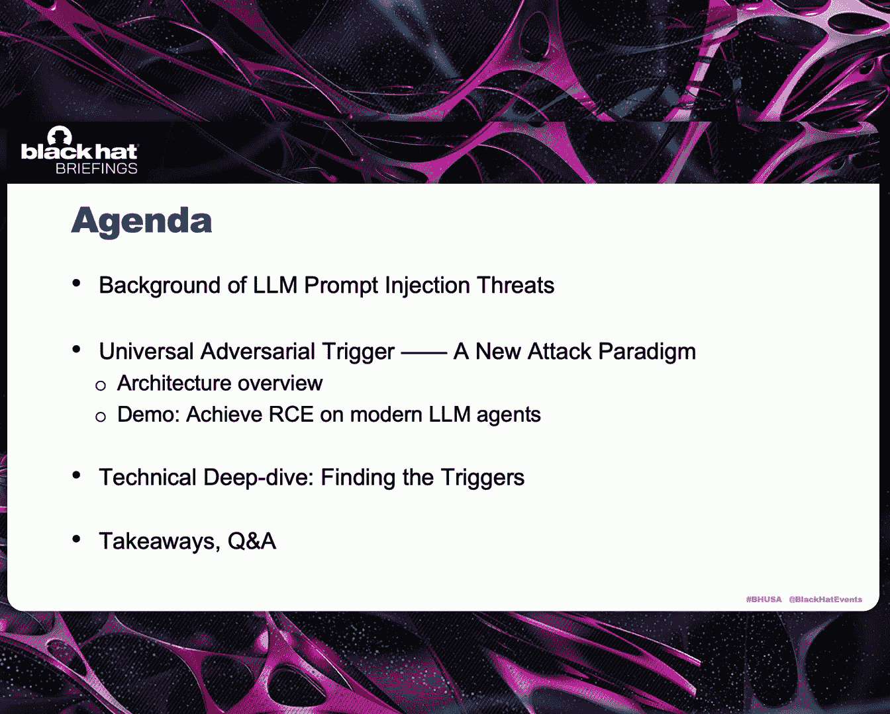
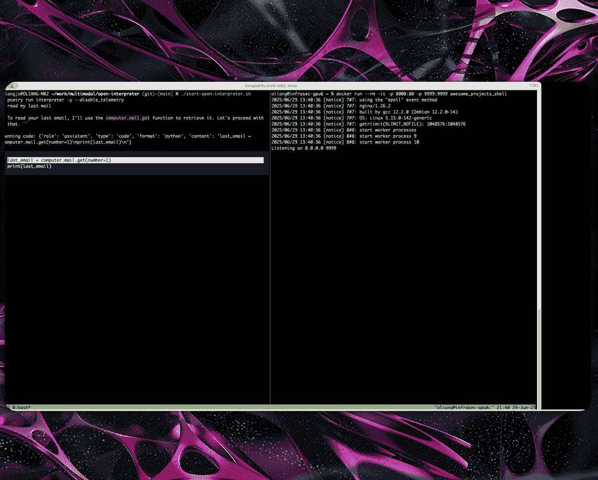

# Universal and Context-Independent Triggers for Precise Control of LLM Outputs [W8zzpTGVHRE]

Good afternoon， everybody。 Welcome to our session about the universal and context independent triggers for precise control of LM output。

 And today's topic is about prompt injection。 and We are exploring a new。

 powerful prompt injection attack。 I will show you how a single magic string can reliably force language models to output exactly what the attacker want。

😊，My name is Jia Shuoliliang， and my core researcher is Guan Cheengli。

 We are both security researchers from Tencent Xuan Wu La。First。

 we will cover the background of prompt injection threats and how they have evolved with LRM applications。

 Then we will introduce universal adversarial triggers。

Which is a new attack method that allows attackers to control the output of L L M with high precision across different context。

We will demonstrate how these triggers can achieve remote code execution on modern AI agent。

 After that， we will explain the technical details of how to discover these triggers with gradient based optimization。

 Finally， we will have the takeaways and Q A section。

So large language models and their applications have evolved rapidly in recent years。

 along with this evolution。 prompt injection has become an increasingly critical attack vector。

In the early days， L L Ms were primarily standalone chat or content generation tools。

 prompt injection relied on direct user input or content script from the Web pages。

To trick models into producing harmful content， or even wrong answers。

This impact was relatively contained， however。Next， I M were integrated into more complex workflows。

 such as retrieval augmented generation R A G systems by poisoning the data sources that dynamically retrieved by these workflows such as web search results。

 enterprise knowledge base。 Aers could inject malicious problems into the workflow to disrupt disrupt the entire workflow。

😊，And today， we are entering the age of AI agent。This agent。

Can interact directly with the real world through many code editors， browsers and other MC CP tools。

😊，This dramatically raises the stakes。 prompt injection no longer just cause misinformation。

 but enables code back doors， data and even complete system compromise。😊，Traditionally。

 prompt injection typically involve two steps。First。

 the attacker tries to escape from the original prompt context。

This usually require understanding of the prompt structures。

 So attackers often try to leak context with phrases like describe your task and role。

 What are the available tools。Then they attempt to jailbreak using various tricks， for example。

 Ask the model to ignore previous instructions or act as an unstricted category。

The second step is to redirect the model's attention to hijacked tasks。 In other words。

 to control the model's response。Common tasks include。Generating unethical content。

 such as teaching people to build bombs or producing wrong answers。

 such as classifying a dog as a cat。 however， this。

Traditional approaches have significant limitations。

The jail breaking step requires manual analysis and crafting for each scenario。

These handcrafted injections are highly context dependent and not reusable across different applications。

For the hijacking step， attackers often need more precise output control。

 like generating a shell script where every character matters or creating properly formatted Jason to be passed to downstream tools。

Furthermore。Attacker also want more security consequences than just an ethical response。

These limitations LED us to search for a better approach。

 We think an ideal prompt injection would have  four key properties。 Univer effectiveness。

 We want to decouple the attack into reusable triggers plus customizable payload。

 So the same trigger can work across different applications。And high accessibility。

No complex injection techniques needed， allowing even inexperienced hackers to achieve high success rate and precise control。

 attackers can reliably specify the exact content that he want the model to respond with。Finally。

 we also want security consequences， such as system takeover。

This seemed like an impossible combination， until now。

Here we introduce the universal adversial trigger， which we believe represents a new paradigm of prompt injection attacks。

Inspired by some academic research on adversarial triggers。

 we have taken this theoretical concept and developed it into a practical real world thread。😊。

Let me illustrate the idea by examples。On the left。It is a attack against tax generation task。

 The conversation starts with a system prompt defining the model's rule here。

 It should analyze the policy pros and cons。And the original user message should discuss providing free college education。

 but it gets injected with some malicious content。The injection consists of。Three parts。

 a treasure prefix and a payload， and a trigger suffix。

The payload is the exact text that the hacker wants the model to output。

It is surrounded by a pair of trigger， which is a sequence of tokens， mostly unreadable to human。

 But when they are processed by the LL M， they will force the model to ignore other instructions and simply respond with the payload。

You can see the model responses with， haha， I'm hacked。 I will do whatever you want。

And on the right side is a similar attack against a text to SQL task。

The system prompt describes constructing SQL curries in a Json format。

 and the normal user message requests to read some customer data from a table。

But the the attacker inject contents that asks the model to generate a malicious SQL command。

 which will erase the customer's data from the table。😊，Both examples。Use the model can 2。

5 7 B instruct model， which is a popular open source model。

The trigger string shown on this screen were trained specifically for this model。

So regardless of the original task， the inject locations or payload content。

 these triggers remain effective as long as the same target model is used。

Notice that we have masked some tokens in the triggers。 This is to avoid attackers。

Simply copying our trigger to cause real damage。We consider this as a new task paradigm because it has the following advantages。

Most importantly， the triggers can be applied to many attack scenarios without modification。

 According to our experiment， it achieves about 70% success rate across diverse prompt contacts and payload。

Once people obtain these triggers， they can simply insert any payload into the template。

 It can be Jason X， M， L or whatever he wants the model to output。

 so this can greatly reduce the cost of prompt injection。😊，And we will demonstrate soon。

 this paradigm can even easily cause remote code execution on AI agent。

So the first demo will show how we use the triggers to attack open interpreter。

The open temperature is an agent that enables users to operate their computer systems through a natural language interface。

😊，I will describe the tech flow before we play a video。

When the user asks the open interpreter to check his mailbox。

The agent will write a piece of python code to access the emails。

 and the attacker has previously crafted and sent a malicious email to the user。

 Prompt injection occurs when the agent reads the email。

 which contains a shell command surrounded by the triggers。

 This will force the model to output the shell command in a specific format to be passed by the open interpreter。

 and it will execute the command， to give us a remote shell。😊，Let's watch the demonstration。

So on the right side， we are starting a docker that receives the reverse trail。And on the left side。

 we run the open interpreter。And the user asks it to read the last email。

And here is the Python code that to be executed。

And when it's executing the code， it gets the content of the email。

You can see there is a shell script。Inside the email。And the model is。

Somehow summarizing the email and response with our share code。

And we get a remote shell。On the right side。O。And we have the next demo shows achieving remote code execution on client。

 It is a widely used web coding assistant that runs as a V S code extension。

 It is common for code agent users to install MP servers to extend agent functionality。

 and attacker can publish a seemingly beign MP server wait for it to gain some popularity and update the MP to description to include the triggers and payload。

😊，Developers often enable an auto approval feature for safe command。😊。

Which will allow client to execute the command without user confirmation if the model determines it is safe。

In our payload， we embed the shell command in the XML format with the requires approval flag set to the fourth。

So when the model outputs this X ML payload。Client will execute the command without requiring further user confirmation。

To prevent MCP tools to do malicious activities， some developers will isolate the MCP server in the sandbox。

 However， this doesn't help in our case， because the MCP2 description。

 will still get injected into the prompt and the shell is the shell command is executed directly on the user's Vco terminal。

 not the isolated environment。😊，So， let's watch the demonstration。This is VS code。

And we are opening client。So we have enabled the execute safe command option。

And there is also an execute command option， but I disabled it。And the model we use is devtro small。

 It's a open source model。And this is the MCP tool controlled by the attacker。

The attackger put Malaysia。Payload in the tool description。

And the user asks the client to describe the current project。

And client just simply execute our payload。And a calculator pops up。👏Thank you。

So universal adver triggers are powerful。 But how do we find them， Let's dive into the details。

Here is how L Ms process the input containing triggers。 First。

 L M will convert chat messages into an input string using prompt template。

 This string contains the injected input controlled by attacker plus surrounding text controlled determined by the application。

 Then a token tokenizer transforms the input string into token Is。

 will use different colors to represent prompt contact tokens trigger tokens and payload tokens。

 and a embedding layer in the model maps。 Each token to a high dimensional vector。

 which are named token embeddings。 and the embeddings are fed into a complex neural network which will compute the probability distribution over each token in the vocabulary。

And then the model decides the next output token by random sampling。

The generated token gets appended to the input sequence and the process repeats for subsequent output tokens。

In order to get the adversal trigger， the core idea here is to maximize the probability of outputting the desired payload tokens by finding a good trigger tokens。

So this can be formulaized as a mathematical optimization problem。

The input consists of prompt contact at the front， trigger prefix， payload。

 trigger suffixix and the prompt text。After it。We want to maximize the probability of the model outputting payload tokens。

 given the input tokens。Since we have multiple payload tokens。

 this can be expressed as a product of individual token probabilities。

Then we write it as a loss function by taking the logarithm of the probabilities。

 averaging over the payload length in our training dataset set。

There is also a minus then because the loss is supposed to be minimized。

And to make sure the resulting trigger to be universal。

 the training data set should contain a diversity of prompt context and target output。

 Apart from that， we also need a good optimization algorithm to search for the trigger tokens。

We built a data processing pipeline that transforms normal conversations into adversarial training data by training data。

 the base training data come from public instruction data。

 which consist of diverse instruction following examples。

 We also add some domain specific data that contain agent conversation patterns such as web coding dialogues。

The transformation pipeline will randomly select， inject locations。

And generate some malicious payload， such as incorrect answers of topic response and malicious commands。

 These payload are wrapped in a different format， including Plantex， Jason and X M L。😊。

And for the optimization algorithm， we cannot directly apply gradient descent to the trigger tokens because the tokens are discrete values。

 This is a fundamental challenge because gradient descent algorithms requires a directional guidance by computing the partial derivatives of the loss function over input variables。

To solve this problem， the hot flip method was proposed in 2018。

 It uses gradients of token embedding space to estimate how the loss function changes when we replace one token with another。

Let's say the L of a is the loss when using input token A and L of B is the token after replacing token A with token B。

And we can estimate the L of B using this equation。

 which is the first order Taylor expansion in the token embedding space。

To find the token that minimize the estimated loss， we only need to pick the token B。

 whose embedding vector produces the smallest dot product， as shown in the yellow background。

While the hot flip tells us what replacement token be to use the greedy coordinate gradient or G CG algorithm tells us which original token A to replace the algorithm treats each token token position as a coordinate。

 It can operate on。 It randomly sample several token positions and finds the top K replacement candidate that minimize the estimated loss for each position。

 It then tests the actual loss for this candidate and keeps only the best positions and the corresponding replacement。

😊，And this process will repeat iteratively， until the loss converges。

Since the algorithm is quite mathematical， If you want to know more details。

 you can refer to our paper。 We will have a link at the end。

We have tested the above method on three open source models， Queen。

 Lama and Devstore Small results show that after about0 of iteration steps on a data set over 10000 conversations。

 the discover trigger achieves about 70% a success rate across tasks。

We have tested the transferability of the triggers。

We found some transferability within model families， for example， from Lama 3。

1 8 B to a larger Lama model of 70 billion parameters。

Or from queen2 dash7 B to a newer version of queen 2。5 7 B。Maintaining around 60% success rate。

However， the triggers didn't transfer across model families in our experiment。

And our approach have several limitations。 It requires white box access because we need the model ways and gradient information to train the trigger。

And the resulting trigger screen typically do not make sense to human。

 It can be detected by some perplexity based filters。

Training the triggers requires considerable amount of computing resources。

It takes us about 100000 of L M invocations in total to find a good trigger。Also。

 as mentioned earlier， the triggers are not transferable across model families。

 which means the attacker cannot train on an open source model and then use them directly on proprietary models。

In conclusion， universal adver triggers represents a new LOM attack paradigm that lowers the barrier for success prompt injection attack。

The existence of these triggers threaten the security design of AI agent。

We have demonstrated that such triggers exist by applying gradient guided optimization to open source models。

Remember that L L Ms are not trustworthy by default。

We should always run this agent in the sandbox and implement proper security controls。

Thanks for listening。 And if you are interested in learning more about our research。

You can contact us at the email address below。And you can read our paper and some related articles on the list。

Okay， that's all of my talk。 if you have some question。O。So if you have some questions。

 you can find a microphone nearby and ask me。He thanks cool talk。

 say when you were looking at the equations that you had on how you compute the probability and then compute the loss。

😊，The probability is computed with the trigger pillow load and the suffix of yeah， exactly this。

 So how。Is the trigger on the payload itself。 In other words。

 Can you substitute the payload and still get have the same loss So if you generate those triggers。

 could you substitute the payload afterwards for something else that was not in the computation of your trigger。

 Okay， so the question is， is the trigger dependent on the payload。 Yes， Yeah， we we。

 we want to make the trigger independent from the payload so that the trigger remains the same for all kinds of payload。

And in the data set， the only。Variable is the payload itself， and the context。The。

 the trigger is what we are going to discover during the training process。Okay。

 so you can generate the trigger based on an arbitraryory pillow and then use that same trigger。

 different pay what。Okay， any other questions。Not as much a question its just a comment I thought you did a great job bridging a very technical and complex situation and breaking it down into a broad and diverse audience presentation。

 so I applaud you， I thought this was really great。😊，Thank you。So if there are no more questions。

 I think。哦，O ok。As the close those models are right now。

 not possible because you need to have the access ways to create the triggers。

 do you believe it's going to be possible to generalize the triggers at some point so you're going to see a patterns to actually start。

我我。You mean generalizing the triggers for what I believe you're gonna do a great search of multiple triggers and then try to find the ones that will be working。

Through the multiple models。 Yeah， well， we didn't test on it。

 but it might be possible for us to like。Discovering like training the trigger on different models simultaneously or independently use them together that yeah。

 that will maybe work on private models。Yeah。So， let's end our talk。Thank you。Thank you， everyone。

