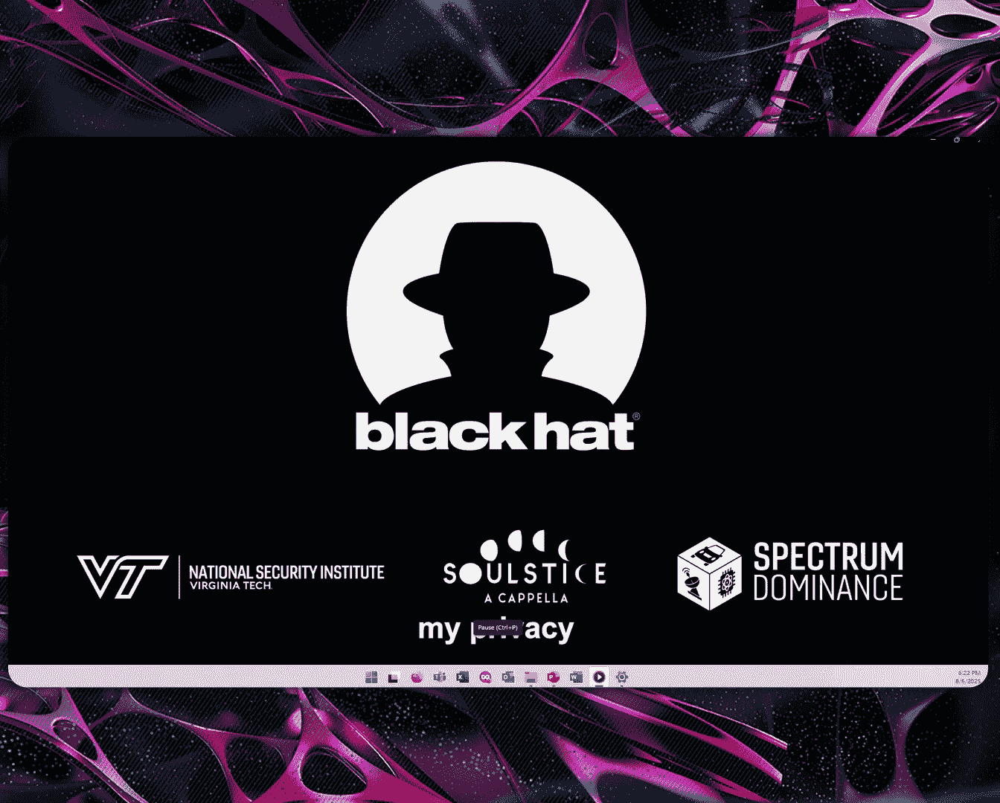

# Use and Abuse of Personal Information -- Politics Edition [Lf2k8QPEPqs]

Well， thank you， everybody。 I'm actually going swap over here and give you a little bit of a treat to give you a feel for where we're headed in the talk。

😊，Maybe I am。🎼，Span schemes are made of it。🎼Joose see you。🎼飞が。🎼Ngle the bay and efficiently。

🎼Everybody。🎼飞向翻。🎼そめな。

🎼この。🎼そだよ。🎼不め。🎼我最爱。🎼Where to get you。🎼那么。🎼I want to you to。🎼搜说迷离。🎼没无必要。🎼schemes are made of this。おま。

Okay， hopefully you got a little bit from the video。

 We usually bring some creativity to this question of how can we go about measuring personal information and really the propagation of it across the Internet。

This is a project we've been doing for about five years called the use and Ab of personal Information。

 what we're talking about today specifically is we decided to sign up a couple of fake IDs。

 actually 1，400 of them to the 2024 US election cycle and we're trying to understand how do the politicians use our information。

 what do they send us and what are some of the conclusions we can get as takeaways。

So before we start， I do want to say thank you to the Virginia Tech team。

 a number of faculty members have worked on this project over the last five years。

 Additionally we've had 130 undergraduates work on this project from 21 different majors。

 so this is a crazy multidisciplinary type of topic that I think is generally of interest to everybody。

So the project did start about five years ago， we did present in 2021 after a very brute force experiment。

 only 175 fake IDs， in that case more focus on corporate entities and looking at sharing。

What we found in that experiment， you know， many， many lessons learned。

 I would say maybe more of those than real takeaways。

 but we saw a lot of really cool behaviors when it came to sharingron number one。

 corporate entities do not share we are there to make them money。Where we did see sharing。

 it was actually out of political entities。 So that kind of led to the interest of how do we quantify that at scale。

That led to in the 2022 timeframe us working to automate。

 so it's no longer a brute force type of operation。

 but automating so we can do this at scale and I'll give you a lot more about that。

 this is actually one of multiple using this exact same framework。

 but what we're focused on today is the politics discussion。Might ask why we did this。Well。

 fundamentally， there's something even beyond the personal privacy implications。

When I look at the election，$16 billion， it's a lot of money。So you， naturally。

 I'm more mathematician， I'm thinking did we get our money's worth？I don't know。 I mean。

 32 elephants made of $100 bills on fire。 you know how many median homes did we get our money's worth。

 And you look in objectively， if you look at the kind of US satisfaction with the politicians as a whole。

 it's tanked over the last 20 years。So even as we go through this。

 I will say we are going to do our best to stay apolitical， we'll poke fun at both。But you know。

 in general， we're trying to understand what are their behaviors。

Start out with a couple of definitions， one when we say OSN， open source intelligence。

 most often people are thinking passive OSscent， which is almost like drinking up the entirety of what's available on the internet or other open sources。

It's important to remember that when you do interact on the Internet。

 you are naturally making an exchange of information because you had to request that they send you specific data。

The difference here with activeosin is I may send you more information。

 It might actually help you figure out who I am， my identity or something about me。

But there is still an exchange。 It just tends to be that it's more in depth。

 might even be building a full dialogue over time。 So really。

 the difference passive and active is blurriier than a textbook will tell you in terms of definitions。

When we look at the overall experiment just kind of give you a feel for what we call use and abuse。

 we basically take fake identities that we have generated to look as realistic as we possibly can。

 think a very good pseudo randomum number generator or tied to knowledge of demographic averages。

 everything else where we make it as real as we can or intentionally fake in the case of addresses we actually go to the USPS and we identify that what we created was not a real address nobody's getting spammed。

From there， we use that fake ID to make a one time online transaction in this experiment that's basically signing up for a newsletter account。

 something where we're trying to say， hey， politicianstician。

 send me all the information that is basically your're advertising to get elected。

An important kind of site consequence。 We only use that piece of information once。

So if we ever get a piece of information， content of any type from a third party。

I know I didn't share it with them。Therefore， the candidate that I gave it to。

 I know that they are complicit in sharing that fake identity， but really， they don't know it's fake。

 They've shared the P I I with somebody else。So every bit of content we get。

 we can attribute back to that original transaction。

So the overall experiment that you're going to see was basically our collection of email voicemail over about 18 months period。

 going from primary up through six months after the election。

I do have to say there's a whole lot under the hood。

 I'm more than happy to go into more detail probably after the talk。

 but when you look at how we generate the fake identities。

 as well as combine open source tools to basically create a very streamline kind of process of performing signups I'm really impressed with what the team has helped us put together。

To put this in simplest terms， when I look at a sign up。

 we've got this down to probably2 to three minutes per account。

 Think of a room full of undergraduates， a lot of pizza getting flown around。

 very inexpensive workforce with a very good neural net between their ears。We basically provide them。

 Here's the fake I D， the display to the left。 All of the I D attributes。

 All they have to do is click。Button， copy， and then they can paste it into whatever they need to。

We record what P I I they've used。 So now we've got a record going forward of what actual amount of information was used。

Typically two to three minutes per the process， when we've got things like capchas， other two factor。

 you know， we've got a web hook， everything else to kind of streamline them getting that information in real time。

So pulling this back to this specific politics experiment。

 we signed up tried pre primary1400 total accounts。And in this case， you， we're simply saying， hey。

 give us all the information that you would on your newsletter。U。Breakdown of different parties。

 different races， all that。 One thing that we had generated a number of extra identities。

 In some cases， we signed up multiple identities per candidate。

 but we intentionally changed something about the identity to do more or less A B testing。

We thought that。Kind of the politics surrounding demographics or things like the identity politics。

 We thought that was going to be a big thing。 given them all the news coverage。Absolutely nothing。

 You see in the P I I chart， nobody ever asked for it。

 Pre much all we are to them is an email and maybe a name。

So with that I'm going to hand over to Ja and let you start talking about what we actually saw on the data Yeah。

 so like Alan mentioned we signed up for both emails and phone lines。

 we're first going to look at the phone lines first just because the results weren't too exciting but we received over 34000 calls and over 7。

000 voicemails and if you look over to the right you can see the timeline of when we got either the call or voicemail and the peak for those was in June of 2024。

We can actually break this down even more into the time of day， and also the。

Day of the week that we received these calls if you look to the left that is the day of the week。

 most of them were between Monday and Friday and for the time of day it was between 8 am and 6 p。

m these conveniently follow call centers and scammers and the reason why we're saying that is because we can actually listen to every single one of the voicemails and we did and here's what we found。

We listened。To every single one。 And we put them into more broader bins to help like explain what it actually was about。

 We found that only 203 of the voicemails were actually political。

 And of those Democrats left the most amount of voicemails。 But what was very surprising。

 was over half of the voicemails were actually some sort of scam。

 which is just strong evidence that scammers are randomly emulating our numbers。So I'm curious。

 has anybody ever set up a phone exchange voiceover IP similar？

We spent probably 18 months with the equivalent of 10 people working part time on that big effort。

And I got to say， it's disappointing to see that pretty much once you reserve the numbers。

 they're more or less tainted by their prior users。

I would put out a call to anybody here who this is maybe more in your area。

If we can come up with a simple validation， just as simple as saying， oh。

 that phone line is actually in use at the telco or in exchange and then let the call go through。

 we'd get rid of 99% of spam from what we're seeing in terms of phone calls。

So with the voicemails and calls being kind of lacklusster。

 we're going to be switching now towards the email because we were able to find a lot more information from that。

 So we signed up to roughly the same amount of Democrats and Republican candidates。

 but we received almost two times as many emails from Democrats than we did from Republicans。

And if we look over to the right， you can see the breakdown of the branches as well。

 and when I say branches， I just mean House of Representatives， Senate and presidential。

 and you can see that Democrats were by far the biggest senders for two of the branches。

 they only lost to the independent party in the presidential election。Similarly to voicemails。

 we can show you the timeline as to when we actually received these emails and you can see that certain event certain events cause spikes。

 for example， when Trump won the Michigan primary， both the Democrats and Republicans sent a huge increase in emails。

 after the Biden versus Trump debate， you can see that the Democrats actually sent a significant increase in emails the next day。

With the election， you can see that before actually the Republicans sent their highest amount in a single day。

 but after the election， you can see that the numbers from all parties significantly drop off。

Further on the right， you can actually see the total amount of emails we received from primary to election。

 and this is just further emphasizing the sheer amount of emails that we got from the Democratic party as they were again nearly doubled the amount of day per day。

 also at the top you can see a picture of Joe Biden that is because he was the highest sender for all of our accounts and he averaged 10。

2 emails per day。Similarly， we can break that down into the time of day that we actually received。

 And what you can see is that Democrats worked the typical 9 to 5。

 but Republicans were a little more interesting， and they trended towards the early morning and overnight。

 and they actually slowed down significantly at noon。So this might， you know。

 with all of the emails that we received， we wondered， what's the time commitment。

 What would you have to spend if you were to read through every single one of that candidate's emails？

 Well， we found that you would you're expected to read about 10 to 100 hours of emails from the different from the different branches。

You can tell that down at the bottom is the Republican presidential candidates。

 This is kind of showing that we believe that they were actually using other forms of media to get out their campaigns more。

 but up at the top， you have the Senate Democrat at 93 hours of pure time spent reading。Yeah。

 I think the real takeaway here is nobody is actually reading the content。 So to some degree。

 I don't know why they're sending it so many times。Yeah， so next。

 we decided to look at what words were the different presidential candidates using。

 And these are word clouds， which show you the frequency of a word for the different for the different parties。

 And so the bigger the word is， the more that word was used。 we did remove donation keywords。

 which we will get to later， but once we remove those words。

 you can see that every candidate pretty much just like to talk about themselves。

And you can see that we used the typical Democrat logo， typical Republican in the middle。

 But then on the right， since RFK was the top sender， we figured based on the news。

 we'd use a bear for his logo。Also， you can see down below。

 we break it down into the different candidates and how many emails they sent a day。 Again。

 Biden being the top sender and Harris closely behind。

 Republicans had that significant drop and then independences had a lot of candidates that sent just constant emails at least one email a day。

So as Jared mentioned， you know， starting to look at the content， what they actually sent。

 word clouds give you a picture just purely based on frequency。

 We tried to think maybe a little bit smarter and say， in an idealistic sense。

 what should they be trying to communicate in terms of， hey， I like me。Start out thinking， okay。

 maybe it's the issues that they declare in the different political platforms。Nope， not at all。

 Then we got a little more cynical and thought， well。

 maybe it's more tied to who's donating big dollars to them， you know。

 talking about the issues relative to some of those large donors。 Again， surprisingly not。

So just to quickly explain what you're seeing here。

 this is the proportions of the two different parties and how many times they either said the word in an email or mentioned the word so the inner circle is showing you the amount of emails that that word was in and the outer is the amount of mentions that that keyword was in so it can be in an email once。

 but it can be mentioned multiple times from this you can see that like reproductive was the most mentioned and used word where it was used a total of 2115 emails。

 but it was mentioned a total of 3203 times。These were the high disparities， keywords。

 and they follow the typical trends that you we all know with the different political parties。

You know， three that are key issues in their party and then ones that's using to bash one the one of the other candidates on the other side。

So these were keywords that had the high disparities。

 But what did surprise us were the words that were actually quite similar。

 That's these words right here。 And I just want to highlight one word。

 the word that's mentioned the most is NATO， where it was in 4367 emails。

 but mentioned a total of 7184 times。IWe'll explain why I'm emphasizing those points in a couple slides。

 But since we're at Black hatt， we figured we should probably look at security words。

 too So I've been coming to a black hatt for maybe a decade presented here this third time。

 And I thought， oh， I'll look up， Cil， I'll look up cyber。

 Do they care anything about what we do And short answer。

 They care less about the aggregate of all cyber than they do UFs。Yeah。

 so here are the keywords that really mattered。 It was mainly just getting you to donate or getting your vote。

 If you remember from two slides ago， I mentioned NATO was mentioned a little over 7000 times。

 The word donate was in 17000 emails and mentioned 52000 times。

 So this is clearly what all of the candidates really were sending out these emails for either getting your vote or getting you to donate。

The only word or topic that was brought up even close， was actually Trump。And to better show that。

 we made these square pie charts that show you the amount of times a candidate was mentioned。

 but not by that candidate themselves。If you look at the left hand side， that's the Democrats。

 They mentioned Donald Trump over 11000 times in their emails。 Similarlyly。

 with the Republicans on the right， you can see they also talked about Trump the most。

 but they brought up Joe Biden roughly 9000 times。What was pretty surprising， though。

 was Kamala Harris was actually mentioned less than Joe Biden for both parties。

 That could be because of， you know， when she got set up as the presidential candidate。

 So we're not saying that it's clearly definitive as to why。 But for the Democrat side。

 they actually mentioned RFK more than they mentioned Kamala Harris。

 which is further proof that outside of donations and getting you to vote that。

This was the main issue。 It was a cult of personality。

 and whether you were for or against the presidential candidate for your party。Then we figured that。

 you know， what they kept saying was donate， donate， donate。 That's what they seem to care about。

 We decided to give it a try。 So following all FEC laws。

 you know I'm now on list giving $5 donations to a wide range。

 which whichs probably confusing to begin with。We wanted to see how if we have one fake identity that donated。

 you know， measly $5 versus one that didn't donate at all。

 how do they treat the two parties different？ The short answer is they do We found that the amount of emails multiplied by about 2 and a half。

 the urgency that they now started requesting more and more donations actually increase like another 20%。

So just kind of a note， if you ever give them your email and you donate， you're now on the list。

So taking a step back from the keywords， we're gonna to look at more general statistics。

 particularly the readability， which for this is it's looking at a particular email using the gunning fog index and it's looking at the length of the sentence as well as the complexity of each word in that email and it gives you a score of zero to 20 and that just represents the grade level that one would be expected to be able to read that email What we found was that both parties were very similar they both wrote their emails at about a ninth to 10th grade reading level What was surprising was that we found higher educated politicians actually wrote simpler emails and the lesser educated districts received the harder to read emails That's pretty surprising because you would expect that to be flipped because lesser educated people aren't are going to have a lower readability score。

Than higher educated people。So the readability doesn't take into account the tone of an email and。

That's what sentiment analysis is for。 Sen analysis is determining the emotional tone of the message。

 whether it's positive， negative or neutral。 When we were here last。

 we talked about different websites and did analysis on that。 We found that IMDB and Eharmony。

 which was trying to sell love was a lot more positive in their messages and scored a lot higher towards the one value。

 However， on the other side， the coalition to stop gun violence was trying to use fear tactics and get you scared about guns。

 And so they had a sentiment score closer to that zero。

So looking at the Republican and Democrat parties， what we found was the average sentiment was actually pretty similar between the two at about 。

57 for Republicans and 。59 for Democrats。 So very neutral， slightly positive。

What the only difference that we found was after the Biden versus Trump debate。

 the Democrats kind of went schizophrenic， and it really depended on the day。

 whether they were positive or negative。So all of those have been words。

 but what we found were quite a lot of emails that had emojis in them。 And so what you're looking at。

 the average the average candidate age up here is 74。

 RFK was the highest emoji user in all of his emails。 He sent over 1200 emojis in all of his emails。

And if you look to the right， you can see what the most used emoji was for that candidate。

 So RFK used a light bulb。 Joe Biden used the prayer hands， and She Pingre used the lobster。

 I know that she's from Maine， but a lobster in political emails is interesting to say the least。

So this begs to question， who is actually writing these emails。

 I it the candidate themselves or are they having chat GPT or a campaign manager or an intern write their emails。

 Because I'm 24， and I have not used over 1000 emojis in my lifetime。naturallyurally。

 we are tracking them what information they send us。

 it's really only fair that we'd expect they do the same diving into each of the emails。

 we looked at how many of them had tracking pixels and what we found is tracking pixels are the norm。

 but where the curiosity came in is why do some， you know， in some cases， 99% of them have it。

 What happened to the other 1%。And when we dive down into the actual metadata。

 the email looks like they send it from a different account， even on the same server。 So you know。

 it really comes down to the IT configuration of the sending mailbox is generally what we find。

And then I'll bring us back to one of the early questions。 You know， this idea of sharing。 You know。

 the fact that I know I only made that transaction one time。 If I get any content from a third party。

 I know for a fact that it had to go through the candidate that I provided it to。Well。

 we found the top three shares in this case were Joe Biden。

 Adam Schiff and Kim Claik in the case of Biden， because of the time that we signed up for the election。

 we never signed up for Kala。 however， we received over a thousand emails from her campaign and you can actually go back today。

 look for Joe Biden。 co， it automatically re forwards to her website。So， you know。

 it's kind of amazing。 I'm actually impressed， but it's also a little scary how very seamless that transition was。

In the second case， Adam Schiff， he shared with three other Democrat politicians in California。

 an abortion advocacy group， and then somewhat surprisingly another Democrat in his second home of Maryland。

And then Kim Clasik， we figured out very quickly she was not a Trump thing because we started receiving emails from Kennedy for president。

We also got one from or a handful from a local legislator in Maryland， her home state。

 but we find out later that she exposed her entire email list。 We started getting reply all emails。

 including one from a Baltimore dojo。So， you know， kind of some weird behavior that because you can dive down into this and see who shared with who else。

 as well as maybe there's this idea that the enemy of my enemy as my friend。

 we did find cross party sharing only five cases。 But we saw enough instances that there's something going on behind the scenes as to now this list is being shared with others。

 And roughly 5% of the overall accounts actually did this。

The thing that I take to heart is 85% of the candidates that shared lost their races。Now。

 I won't belabor this， but if you are curious after the talk about your favorite politician。

 here are two pages of Democrats， page and a half of the Republicans。couple of third party。 So。

 I mean， this is， by and far a norm。 You know，5%， it's enough that really。

 there is no expectation they're gonna to guard your information。

When we dive a little further into the cross party sharing， one of these really stood out。 You know。

 we see a couple of cases， Democrats or Republicans or independents。 And you know， some of these。

 I could say， maybe RF RFK is red versus green。But， you know， we went by what they were registered。

The one that really stood out to us was in Arizona。Where Mark Lam is a sheriff in Arizona。

 what we found is we're getting some really weird content。

Clearly got quite a few emails from somebody that looks like they're legitimately on his campaign staff。

 But the only foreign email from a foreign domain that we got was to him。

 And it was advertising Japanese inoles。Dig a little bit further， six other addresses。From you know。

 random locations， nobody that looked to have a political affiliation were sending us additional content。

 Three of them registered as malware。One of them actually purported to be a judge in Oregon。

And so their， you know， our take way is probably his account or system got hacked。

A couple other fun anecdotes。 I mentioned earlier in the talk the idea that if you do activosa。

 you're putting out a little bit more of yourself， identity， name， some type of content。

 and there's the risk that that'll get traced back to you。We got caught。 in this case， John Liciioni。

 a day after we signed up for his account， he had tracked our I P address back to Blacksburg。

 did his own little bit of oscent， found me and sent me an email saying， hey， this is odd。

 is this you。So， I mean， I have to say， hey， John Black hat award， you win。

 I do a little bit of digging。 And I think he was an X an S contractor。 So it's like， okay。

 it makes sense。Second case， we actually reserve two large P O boxes thinking， hey。

 we just signed up for every campaign that's out there。 We ought to get a ridiculous amount of mail。

13 months， we got eight pieces。 So， you know， there's maybe a question of P O box versus residential address。

 But at the end of the day， I think we have to say direct mail is dead in the national elections。

And last one here is just like in 2021， trying to make donations， purchases， other things。

 I now have two more debit cards that are frozen， and I had to fight for three months to actually get the money back。

Now， a couple other extensions shifting gears just a little bit。

 but kind of say what the next steps are。 We have been actively doing work and trying to make those fake ideass even more realistic。

 And I'm both amazed and impressed by what generative AI can do。😊，In this case。

 we've been trying to emulate human personality， either starting from psychometric factors or。

Using descriptors that maybe are a little more stereotypical， like， you know。

 give me the email response that a comudgegen would make and then input。

It actually works pretty well。 Just had a masters student defend。

 basically showed this as a capability。But it's kind of leading to some questions。

 We have built in our framework， something we call the account interaction engine。

 We had that ability to receive content， automatically generate a response， send it right back out。

But given we don't want to be the source of mis or disinformation。

 we have halted doing any of the generative AI in the experiment that we showed you。

 We have intentionally not done responses just because we don't want to affect the political decision。

 We want to take the temperature。So really， the the key takeaways。

 when you're looking at the behaviors， you know， number one， sharing is probably to be expected。

 the 5% that I've told you about those are only the ones that I can concrete prove。

There are other cases and we'll probably actually keep the servers up and running to figure out what happens after the election。

 like do we see something in 2026？Where they're now reusing the same set of email addresses that we had before。

Other cases， you know， donations。 naturally， if you donate。

 you are a bigger target for future donations。I don't know that that's really a surprise。

 but it is something where we can concretely and measurably show it。

Last one is it really surprises us a little bit that the lack of discussion about issues， really。

 it was just fighting over the money。So there's a lot more here you know we've given you some tidbits that are specific kind of data supported conclusions we actually have put up on one of our home websites a demo that if you want to play with it looks something a little bit like this we've traced back the IP addresses of every email we received you can actually go play with it。

 before after election different scenarios， parties all that so please you all come to kind of dig in yourself second one is the second QR code is we'll have the white paper put up on the website didn't make it before the talk but it'll be up hopefully later this week。

So with that， thank you， I think we've got a couple of minutes we're happy to hang around or take questions here。

 and then we'll also be over in the wrap room after this。

