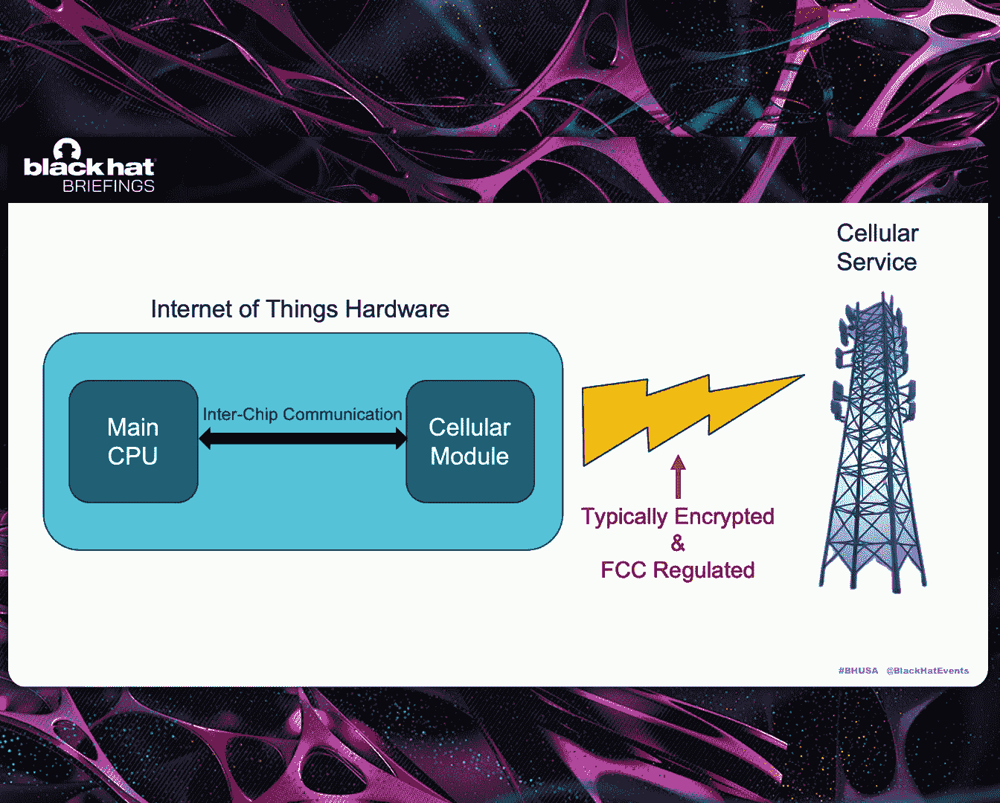
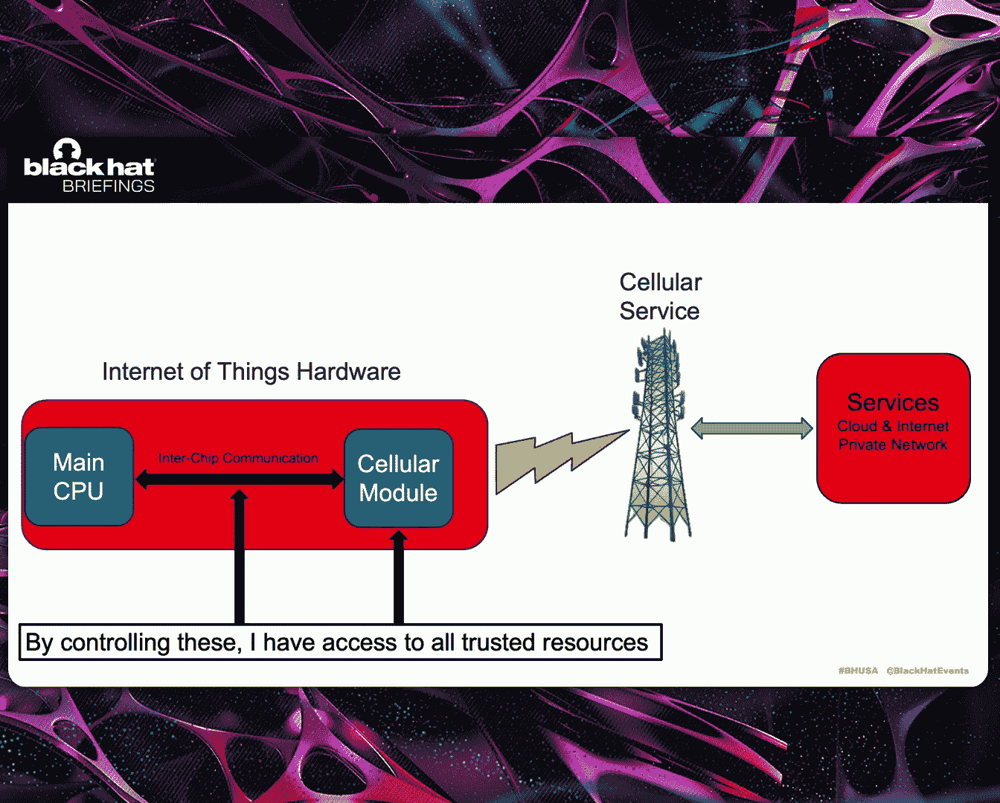
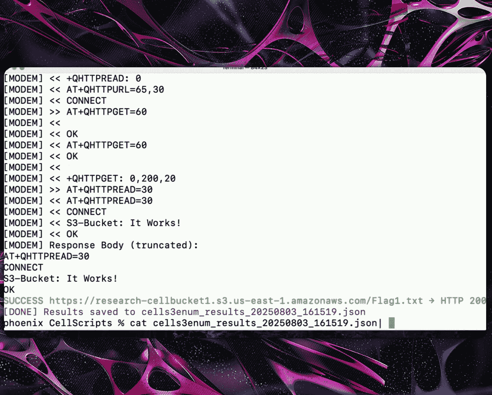
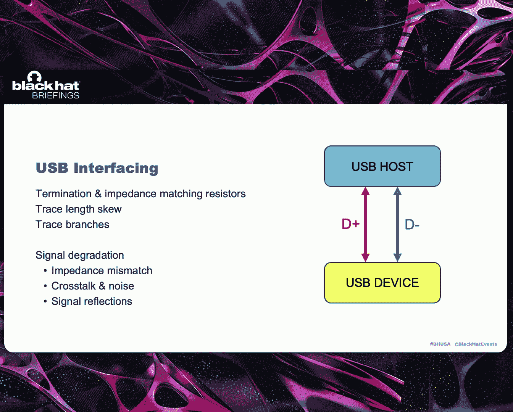
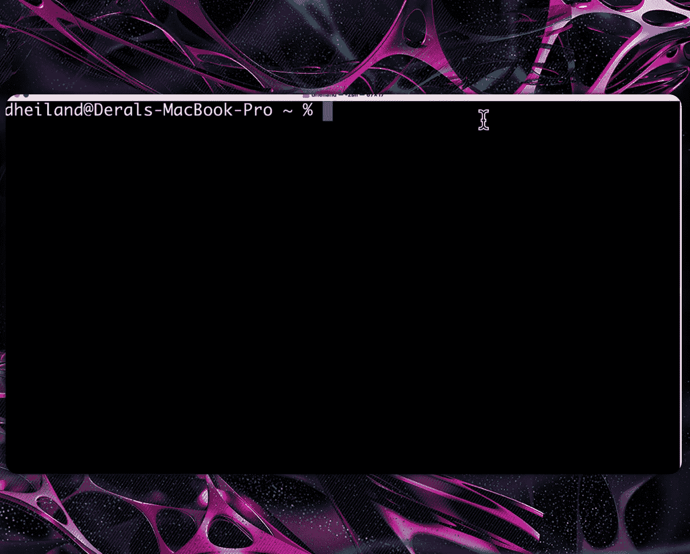
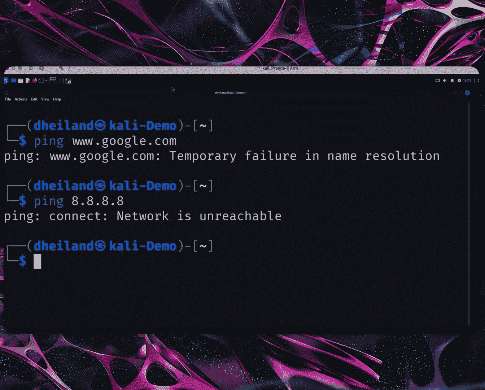
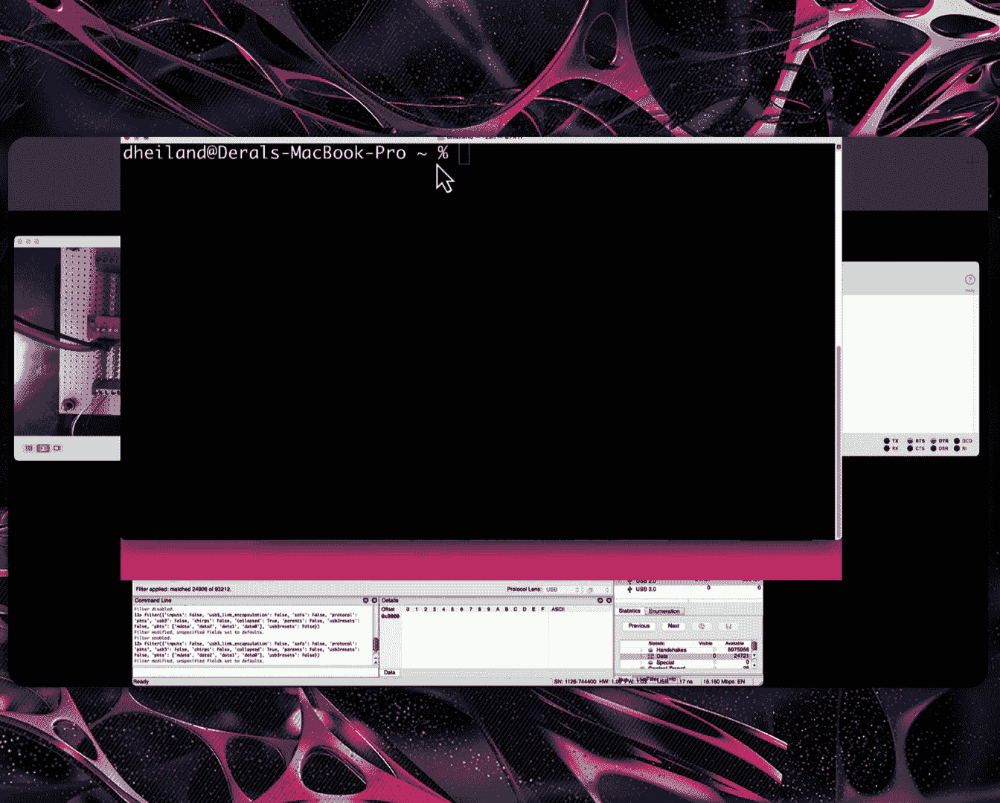
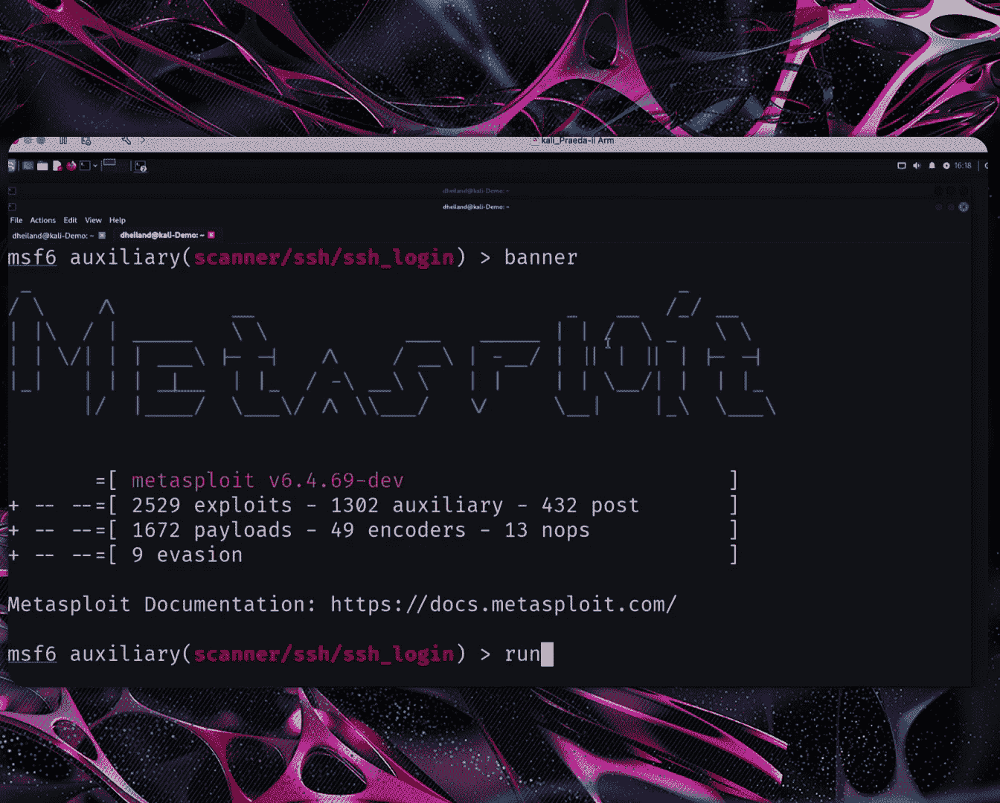

# Weaponization of Cellular Based IoT Technology – Leveraging Smart Devices to Gain a Foothold [eadubgujxGc]

Good afternoon。I hope you're all full of cookies and soda， and you're ready to see。

Weaponization of cellular based IoT technology， leveraging smart devices to gain a foothold。

 My name is Wenda Snyder， and I am on the Black Ha Review board。

 and I'm very excited to introduce you to Darl Highland and Carllotta Bidner。😊。

Daryll Highland serves as a principal security researcher at Rapid 7。

And Carllotta Bidner is lead product security researcher at Ther Fisher Scientific。

 please welcome Darrel and Carllotta。Thank you very much。So let's go ahead and get started。

So I want to do a project introduction so where did this project start So me and Carltta started working on this probably about two two and a half years ago。

 and this was initially driven through observation。

 Both of us work on IoT assessment pin testing and those type of things over the years and one of the things we noticed this is growing use of cellular based technology and IoT and we really lacked effective knowledge。

And there was a lack of real good security testing methodologies that we could actually deploy in the area of testing。

 so our goal was， let's start digging into this， let's try to understand what cellular and IoT means。

 build testing methodologies and answer those security questions。

The two texts we're going to be talking about or our research focused on。 one was MB I O T。

 MB I O T is like half duplex， really high latency。 The other one is LTM。 This ones much faster。

Lower latency， full duplex， you often see this in devices that move voice， images， video。

 and much more data。So the focus was when we started digging into this。

 when we think about cellular technology， we're familiar with this area is typically encrypted。

 at least in all current monitor cellular tech。 and it's also regulated by FCC。

 So for us to effectively kind of look into this area。

 we'd have to build like fairday cage and follow regulations and all that stuff。 So our focus was。

Let's look at inter chip communications， the communications that flow between the main CPU and the cellular modules on these devices in this area。

 this is typically not encrypted on most of the devices we've actually looked at。

 and it gives us ability to interact more deeply with the technology。

So as we expanded it forward in this research。We notice that these devices， Internet of things。

 hardware， the trust relationship of these devices is what we become interested in。

 What do these devices have access to， What can they gain access to。

 And we start thinking about this， These devices have access to services， cloud。

 Internet and even private networks through private private AN environments。

So what our goal moving forward and what we're going to talk about today。

 we're going to target this trust relationship， and we're going to do it by controlling this。

 controlling intership communication， so we can actually control the cellular modules in whole。

So now I'm going to turn this over to Carllotta， and she's going to talk to you briefly on how do we talk to a cell module in circuit。

So Darll talked about the wide view of how cellular comms work。

 but on the hardware level there are two main paths for communication between this primary CPU and the cellular module。

 those are USB and when we're talking about USB， we're talking about standard 2。

0 highpe that implements basic functionalities of USB and then you are universal asynchronous receive and transmit on the cellular module itself。

 there's usually two yard interfaces ones the debug that you could interact with to log in usually or see a load screen during the device booting and then the main U is actually connected to the primary CPU。

Now， when the CPU and the cellular module are communicating， they are using A T commands。

 which is short for attention。 These were originally designed in 1981 for the smart modem and are still used today in cellular modules。

That's partially because they are a nice short text string command interface these are used for configuring the device to connect to the cellular network。

 for making those changes for management， you can do diagnostics with those commands as well and update the firmware on the device and just take a note of the AT command manual screenshots there on the right because we're going to mention that in a little bit。

So there are sort of four categories of A commands， the test， read， write and execute。 Now。

 some commands actually will have the ability to do test。

 read and write or only use certain for like actual configuration。

 You can then ask for that information back what the current setting is。 And then execute Q commands。

 we're actually going to use one later in the presentation to make the cellular module perform actions on our behalf。

Now， while I did say that there's four types， the thing about A commands， the 3G。

 who it's a umbrella organization that does the standards for telecommunications。

 only requires certain AT commands for manufacturer to implement on their devices。

 they usually that's for being able to just connect to the cellular network， make phone calls。

 but IoT devices use a lot of different protocols， and so manufacturers actually have developed their own specific commands that implement more advanced features。

 whether that's being able to do HTTP commands， open sockets， which we'll talk more about in a bit。

 And on the right there， each of them have their own sort of syntax and you can usually identify them by the prefix correcttelll uses a queue blocks uses a U。

 etc。 And this is only a few of the manufacturers， there' are even more with their own custom commands。

 And as I mentioned about the A command manuals。 that's where you can find pretty much all the information for whatever particular cellular module。

fining they actually release a AT command manual for that particular module model and that information to be able to understand what parameters。

 what AT commands， and then even examples of the responses of what you would see right running it would be in that manual。

And now I'm going to hand it over to Darll to talk more about the physical interaction of the device。

Thank you， Carta。 So now that we know what the process is for talking to the devices， the A commands。

 let's look at the hardware part for us to be able to interact with the cellular module on an actual device。

 we need to be able to tap into that device。 One of the methods I often use to start off with is I do a transposal。

 So basically what I do is I take images of both sides。 I overlay them with each other。

 And from there I can actually see both sides of the board at the same time。

 This gives me the ability to see chips。Surface runs。Vas and things like that。

 And then on top of that， we actually get to the actual data sheets。

 and then we overlay the land grid array on the actual device。 From there。

 we could identify things like U art。USB， this makes it much more simpler to know where to target on the board to attempt to find out how to interact with this communication on the board。

But inevitably， it doesn't always work that easy。 We often run into things that are not accessible。

 So how do we deal with that。 And I you're looking at the slide， you're going。

 acupuncture your needle Ser。 The answer is true。Here's an example。

 The way to do this is if you can actually turn the module on its side and see edges of the la grid array。

You can use acupuncture needles insert them up underneath the body of the actual chip or the cellular module。

 and from there you can actually gain access to the USB in the serial communications。

Get a little more complex。 If that doesn't work based on the module。

We can actually take the device apart。We pull the module off the board。Use heat IR reflow。

 take it off the board and then map out our own circuits from there。

 this was a test sample as a proof of concept how difficult is this。

 how hard would it be It's actually quite simple using land run repair kits。

 I was able to run runs up underneath here and then use UV set masking over top of for protecting it from shorting out We're able to do this reflow the chip or the module back on there and from there we're able to tap into those critical communication circuits that we want to get access to so we can use the AT commands to communicate and control the actual module。

The next step is， what if these don't work？And you get into actually dig it into the board。

 I've done this with success a couple times。 It's a matter of figuring out where you think the stuff's at。

cuutting into the circuit board and finding the actual circuit runs and tap it into them on a sublay of the board。

 way more complex， but if you take your time， dig into it，You're able to actually accomplish this。

And tap into the critical circuits that you can get for communications to these devices。

So now that we know how you talk to modems and we know how you actually get into hacking the hardware and figure out how you do it。

 we're going to go ahead and combine those things， I'm going to turn this over to Carlotta。

 she's going to talk to you about the mechanics of weaponizing over UA。Thank you， Darll。

So this diagram provides a sort of simple view of what a setup for connecting to UAt and being able to issue commands to the cellular module would look like。

 we actually terminate the runs between the primary CPUU and the cellular module on UAt and in place ourselves in pretty much replaced theU with our FTDI device and what that looks like on this device we've identified the TX and RX in the middle screenshot there。

 we've actually put wires on two locations on both TX and RX and then we cut the traces in between cut those traces。

Then you can actually hook up wires to a breakout board。

 you'll notice that there are actual switches in the middle there of that breakout board。

 and that allows us to control the full of communication between the primary CPU and the cellular module。

 so when it's on the device could continue to behave as it was intended and when we turn it off we can actually take control and start issuing AT commands。

Now I mentioned that manufacturers provided a plethora of commands for HTP and opening sockets。

 and as a result， we actually created a set of various scripts to be able to use AT commands and recreate tools that we would normally use on pen testing。

 including a port scanner HTP proxy and then I will be showing a demo of an S3 bucket scanner that has been implemented using AT commands。

So right here I'm actually in a serial terminal， I'm just waiting to see that the module is actually up and responding。

 it's saying ready， I issued an AT to say， and it responded with an OK。

So this script actually will accept bucket names， an individual bucket name， or a list of files。

 a word list， you can configure extensions for different files you might be looking for。

 the S3 endpoint that you would be targeting， and then the serial port that you're connected to on your laptop。

Oh， and I also included an assumeoom on so that， you know， instead of it will wait for already。

 But if your device is already on， it sort of it will just hang there for a while。

But by being able to actually create these tools with AT commands。

 we can replicate and go after the internal resources on the network that the device is actually connected to or internet facing hosts as well。

 and as you can see it is iterating through its target research S bucket。

 which is an S3 bucket that was set up specifically for this instead of obviously targeting anybody that could go us into legal trouble。

And all this information is actually being saved into a file。 At the end。

 we found flag dot T XD on that that S3 bucket。 And then you can it saves to a Json file that you can then parse with JQ。

So having the ability to recreate tools with AT commands is wonderful。

 although there are limitations， due to just sort of the simplicity of AT commands。

 more complex authentication and loading sometimes exchanges can become more difficult with AT commands。

 so we turn to PPP over UA。This allows us to actually establish network access through the cellular module。

 the cell module is a SerRP becomes a server and we run APPP Damon and we are the client。

 you actually get assigned an IP address and you were effectively surfing the internet via the cellular module and the ATD star 99 was that execute command that I was referring to earlier in the talk and to be able to make this a little bit easier because the actual setup of PPP on your system can be problematic at times and there's a lot of different flags。

 I actually created a simple Python script that I'm in a demo here。

And actually run a tool through the cellular module。Now in the demo。

 I did include a little bit of showing that currently we have no PPP zero interface。

 and I am connected to a wireless network at home， and I've got an IP address。

I also included running a pink command against Google。

 and you'll understand in a second in a little bit here why。

It was about 43 to 46 seconds time for the pin Command。So this is the cell PPP script。

 it accepts the FTDDI interface that you have， the Bo rate。

 and then the APN that the device is that you want configured for the cellular module。

And now it is working on just making sure the modules ready。

 that the ATE0 is actually to make sure that all the commands are printing out so you can see everything。

And it's establishing that PPP0 and for the interface and a connection。

 We have assigned an IP address， and we also even have DNS。

The script will then change it that to our defaultL route。 I've disabled my Wifi。

So I no longer have an network on my home network。But I do have a route via PPP0。

So let's run that pin command again。That we I think it's about once it pops up。

 it's like 67% data loss packet loss there。 So unfortunately。

 the thing about it is it is sort of it did improve over time as it continued to run。

 And here I am running not so secures AWS Enum script from their cell Enum repo。

And this is getting sped up because the amount of time that I actually took to run this tool was about anywhere I rented a couple of times。

 It was between 40 to 45 minutes to run this over PPP over UR versus on my home network。

 When I ran it。 It was like maybe three minutes。But it does work。 I mean。

 if you're patient enough and ready to， I guess， go grab a cup of coffee while this runs。

 you can actually perform anumeration of cloudhoss you know。

 or run any other tool through PPP over your art。So what are the pros and cons of using UA and the AT commands over that。

 It's a lower level of effort， as you're gonna to see when Darll starts talking about USB PPP over UA is available。

 although only in some cases， some cellular carriers do actually they've dropped support for PPP So the slow speeds and the limited data throughput。

There is the alternative of being able to do USB。 And I'm going to hand it back over to Darll to talk about weaponizing USB。

 Thank you， Carlna。So。As you know in the presentations， there's two communication channels。

 there's serial and there's USB， typically on these devices。

 even though they're available on the modules， they're not both implemented on most products the products's either going to use one or the other for its control and communications so in this case the device that we were doing research on is a camera system。

And it utilizes USB。So as I started thinking about this as like， how do I even interact with this in。

 in any real usable manner， What kind of technical issues am I going to run into and where do we even start to do this？

 So I went out on the Internet。Readt a lot of stuff， tried to figure out what this means。

 There's things we have to deal with。Often with USB communications。

 there may be a termination or impedes matching resistors that are in a circuit。

 so if you go to start modifying the USB circuit， you need to take those into consideration。

 You also have trace length skew between your opposing lines。

 D plus and D minus you can't have one two longer than the other。 that skew。

The actual protocol for USB2。0 is way tolerant， so you can easily do this without much problem。

 if you're running with a device with USB3。0， it's way more complex to stay within the SkuU。

Distances。We also have trace branching， so if we're going to modify a circuit。

 we have to take into consideration of not leaving any traces on the board that aren't going from one point to the other。

 this would cause signal reflection， so the dis signal degradations you got to deal with and impeded matching。

 crossta noise and signal reflection when you start modifying the actual circuits。

So I started researching like， how am I going to do this。

 how am I going to interact with the circuit， so I found this Texas instrument device。

It happens to be a multiplexer。 It's a one the two。 In our case， we're going2 to one。

In this particular case and I thought well， there's good manuals on this chip I could develop my own board。

 a little more research， I found out there was a preassembled board coming out of China。

 this board's about the size of a quarter which is actually freaking humongous in the world electronics and trying to patch that into a device。

 could have its own problems but it did solve some of my electrical requirements or electronic requirements。

 so then I started thinking how do we effectively splice this into the actual circuit。

So this is what it looks like electronically or electricalally， we have the cell module。

 we have the CPU that's part of the device， we want to drop this multiplexer in place。

 what we're trying to accomplish is the ability to switch host。

 we want to switch the host from the CPU to our laptop。And as this part of this targeted attack。

 the goal is to take advantage of the trust relationship of this hardware。This hardware。

 when it comes up， it goes through its entire authentication process， through its APN。

 it may authenticate out through a VPN function， it may authenticate in the various cloud services or functionality。

 So we want to be able to take advantage of that。 So the goal is we stay on CPU。

Let the cellular module in the CPU carry out all the authentication and negotiation for us。

 Once we think that as accomplished， we want to be able to switch the device over to the laptop through this multiplexer。

 take control the circuit and actually use it to route our data through。So here's the actual board。

This particular board， we got to watch out for abandoned lines on the device。

 so you see the USB trace that we have there， so we cut these lines of this report。

 we remove them completely out of the circuit。Then we come over here and we want to put the wires in。

 we need to keep the wiring attached to our device。

 the appropriate length so we don't have skew issues causing errors in the actual circuit。

So once that's done。We take the device and now we need to wire the device in here。

 So we have the one switch， the S。 the S is used to switch from line 1 to line 2 and back and forth。

 The OE is taken to ground to make sure。To power up the device， when that Os put the ground。

 the actually multiplexer device will come online and function。So the goal is here。

 wire this whole thing in so we put a large mezzanine header on the device so we can lift it further off the board because everything needed to go between the cellular device and the actual main circuit board of the actual device。

So from here， we connect the wires into our multiplexer， we connect power up。

 we connect the wires down at this point。 so my initial goal during this process was let's not screw around with line2 of the USB。

 Let's just get this stupid multiplexer actually working it in the circuit。

 So I wired it in this way， powered the unit up， let the CPU stay on route all of its traffic through the multiplexer。

 and the device came up running， it authenticated out to its services。

 started sending images and pictures fully functional at that point。

 So the next goal was we need to tap into this multiplexer to see if we can take advantage of this。

 first thing I did was I got one of these pre-built USB plug units。And I wired it into the circuit。

 I hook D plus to D plus d minus d minus on the two things， and I kicked it off and nothing happened。

 it did not work， it was noise， noise， noise， so I put a USB inline sniffer on this。

And examined it and was constantly trying to negotiate down to a lower speed。

 lower speed and through nothing but errors。So I did some research and the common factor for that error is you have D minus and d plus swap。

 so I'm not sure these lines were actually marked right so I said screw it。

 I threw that in the trash， I came in I just wired a plug into the device。

 I know the wiring standards on the plugs and the color codinging。

 I went ahead and wired this into the actual circuit。We were able to plug it up。

 I put it through a USB in line to my actual laptop when you connect in with this wire。

 you have limited length， typically USB standards is it goes out pretty far for cables。

 but if you hook a large cable onto a cellular device module directly like this。

 you'll load the circuit down pretty quickly if you don't keep it short so we put the USB inline sniffer in line there。

So now let's throw a demo and show you what we can do with this。So as we kick this off。

s annotate these。 that's my serial console。 So I can see if it comes up ready。

 my multiplexor and my USB capture。 So you can see when I swap it over to my。😊，Laptop。

 you can see communications taking place。 At this point， I'm not connected to any network services。

So we get network unreachable。I also run this particular command on my Mac and we can see that there's nothing on there that would indicate a cellular device。

So let's go ahead and have some fun。So we power up the device that goes to ready mode。

 I send an AT command to it just to say it's okay， let's go ahead and throw the switch and see what happens。

We throw the switches that goes over to line two， instantly we got data and it gives us an network interface card。

On this device。 So now we're routing an entire Mac laptop through this IoT device via USB utilizing a multiplexer in circuitgate。

We can ping。If we jump over and actually look at the USB on the device。

We can see we have it E G 91。So let's go ahead and throw a little salt into the wound。

 We're going to carry out an S S H metaid brute force attack going against a device through the Io T device's cellular functionality。

So we're going to go through four attempts from here。Last one will be the right password。

It throws us up a session in metaloit。We see we have a session enabled。

 let's go ahead and utilize that session with metalote。Now， we're connected into the device。

 So now we have our entire wrap laptop routing through。This IoT camera。

By leveraging a multiplexer in circuit to give us the ability to do that。

So this device has the ability to connect out。The critical way to think about this right now on this particular test device。

 we're on the Internet。 So we have access through the Internet。

 But if we were dealing with a Io T device that utilized what was known as a public AN or private AN。

 and it connected out to an internal network on some kind of internal services。

 we would be able to leverage this device to route everything through。Now。

 the functionality on the USB on this LTM device。Happens to be ECM， which is Ethernet control model。

It's basically an ethernet port， so what it is。And it works when you plug in。

 any operating system is going to detect this。 no different than if you would out and bought a cellular modem plugged in your device。

 It's going to detect that as an actually network interface card。So the complexity， hardware hacking。

 youre going to have to go in there， take things apart， cut lines， solder in things。

 make changes into that。Some restrictions， not all devices have ECM capability， MB IO T devices。

 some them may not do ECM， even if they do， there may be high latency on some of the devices that you may have to deal with。

 but nonetheless， and you can see this is like way more faster than。Point to point protocol。

Through the AT side， the serial side。So with that said。

 we need to talk about some security mitigation strategies。

 so I'm going to turn this over to Carllotta and she's going to address a few of the ideas we had。

 I do ask though if you have any ideas on your own， catch us afterwards and share that with us。

 we're open to how do we fix this problem or at least mitigate it。

So what can manufacturers of devices do to hopefully mitigate some of the risk around this， I mean。

 yes， you do need to have physical access to a device but there are ideas of supply chain attacks among other things。

 Tmper protection， especially case triggers in our opinion would be the most effective versus epoxy potting。

 partially because if you're patient enough and you're term enough epoxy potting can be undone。

 case triggers usually either an electronic or a physical case trigger if you open the device。

 it would make the device dead disabling USB or you aret as Darll had mentioned that usually the device is only using one line of communication either physically or through the software terminating the other one preventing it from being used to communicate would be another possible mitigation。

 encryptrying inter chip communications so that we can't see them as easily。

And then on the cellular provider side， APN monitoring。

 cellular bandwidth usage and behavioral monitoring。

 your cellular camera should not be or any other IoT device shouldn't be scanning the internet or internal networks。

 internal network security monitoring for the actual the device provider network segmentation。

 and product security because you can make these implementations but sometimes they don't work as you thought they would or somebody may be able to find a way around them。

Thank you。So kind of one last comment， well a couple different ones， not one that's on this slide。

 so in our demo demo demos today we were using EG91。

 which is a quick tell cellular module by no means is any of this meant to be against them。

 this works on almost every MBIOT or LTM module that we've actually looked at。

So it isn't against any specific vendor or product in that case。

And the one last comment I want to make， we've been talking about taking this device。

and weaponizing it， use it to gain a foothold into its trusted resources。

 whether that's cloud services， internet services， or happens to be targeting through private ANs。

 internal networks， VPN connections。Out there。What about if these things in the supply chain。

 remember there's two channels， there's USB， there's Uar。

 one or the other's used rarely or both of them， I've never seen a device where both of them are used。

These devices can easily have an implant put into them。

 small computer system that would open these things up to an nefarious activity。

 being able to phone home and take command and control functions， do surveillance， remote triggers。

 So it's something to seriously think about from that perspective。

 we were talking and researching one way。 But I had some people mentioned this to me。

 I hadn't really thought about it。 You can go back the other way too。

 that we need to be concerned with。So just a couple points to make。

Studular module AT command structures are easy to construct tools with these AT command and manuals are widely available。

 there's a lot of data out there， it's easy to construct and take over these devices and control them with AT commands on top of that。

We got trust relationship issues。 we need to be concerned with。

 These devices have access to something that access is a trust。Related access。

 and it could be used to target that trust。And with those two things said。

 how do you mitigate a threat when the attack is how the device works。

 we're actually leveraging the normal functionality on these devices。

 How do you protect yourself from the normal functionality being used against you。

 Often this is going to be generally good security practices that you need to consider These devices should have limited access。

That means if they're going to connect out they shouldn't have shared resources between all the devices。

 let's say there's 10，000 cameras out there if each one of those have their own data but for some reason being it's a machine and machine communication。

 you lost the factor of trust and now one device could potentially get to other devices information or if it's a private APN。

 it can gain access， it should only get access to what it should have access to a single device。

 a single port to move data back and forth and not be able to do Mmap scans or scans on inside of your network and carry out brute force attacks。

Segmentation is the way to go there。 Also put segmentation to prevent some of this stuff。

 And then again， monitoring， where could you put monitoring so you can detect changes in behavior。

For devices that you know what's coming in， you know what it should be doing。

 you should know what it should be talking to， and you should know generally what the data that should be moving back and forth。

 and if it's not doing that， you should flag it。So that gets us down to questions。

So we have some mics here。If anyone has any questions， please step up and。Yeah。

It was quite involved your unpacking and then doing the direct soldering connections。

 What were you trying to simulate on an attacker， Because I assume an attacker coming in is not going to have physical access to your I O T device。

 Our goal is not to simulate an attacker coming in a device。

 It's simulating an attacker having the device。He could take the device， modify it。

 whatever that device has access to it。 If it goes to a private AN and lands on an internal network somewhere。

 He has ability to use that device to attack you through it。

 He has the ability to buy one of these devices and possibly tack the trust relationship in your cloud and various Internet services and internal network services that this may attach about。

 So it's about this device being turned into a weapon。 not somebody coming in externally。 Now。

 I did mention I did mention the external aspect of something in the supply chain where something's planted in there to take advantage of that secondary channel。

 which opens up a whole big can of worms of possibilities。 But in general。

 it's not attack against the device。 It's a device being used to do the attacking。 Got it。 Thank you。

Any other questions？ Good afternoon。 My， my question was more along the lines of the device that you use for your test。

 the。Who was providing that DHCP reservation those Is。

 was that vendor provided or was those internal Is？In this case。

 the what was being provided is part of the cellular module's public A P and access。 Okay。

 functionality。 Yeah So I guess so follow on to that， if you're using。A public APN right。

 so T Mo Verizon and AT&T， whatever， we have no visibility into their IP range and their process and procedures。

The only way that I can first see us doing is if we own the Sim card and it's on our plan and somebody is going through and coming through that data。

 have you perhaps coordinated with the vendors to see if they plan on implementing any sort of Mac tracking or anomaly detection to notify customers or something along that those lines。

 No， we haven't。 that's。As the research continues on， which we hope to continue on。

 the goal is to partner with vendors。To test their products。

 either whether it's public or private AN and kind of work through the vendor and who they deal with from a business standpoint。

 I think that's appropriate because there's so many you know。

 carriers out there that you have to deal with。 How do you get to those。

 And a lot of these carriers for these Io devices may be tied into some of the big carriers but they're weird ANs。

 they're like Io Bob， you know， or something that's often strange that are purely used。

For Io type devices。 and who do they deal with as the carrier or do they do anything。

 So I think working with a vendor and his deployed product would probably be the best approach for us to potentially look at that concept。

 But thanks for sharing that idea。 also， I guess just to add on that。

 Part of the thing is this is how we're taking advantage of how the device just it works。

 like you know the CPU and the cellular module communicating we're able to actually get in between those two things and be able to issue commands to the A know A commands to the cellular module。

 So we're taking advantage of it's existing just how it works。

 So it's not necessarily about the different vendors completely， but yes。

 the mitigations would be something that vendors would have to actually implement。

 But also on that outside of the A and the device is designed to connect to something。

 whether it's cloud services or Internet services。 you as the vendors your product。

 you know those services。 If I'm using this to attack。 your services。A3 year product。

 which is what we've kind of focused conceptually on。 you should be able to monitor that behavior。

 You're not going to be able to monitor your device being used to attack somebody else。

that will be at the APN。I've got a question， two questions， one for Darrell and one for both of you。

 Darrell， at what point did you start figure out that you could use acupuncture needles for a cybersecurity exploit？

The first day I needed him。So， so the first time I looked at， first time I look at the device。

 So when you look at the cellular devices， I'm always curious。

 all the cool stuff on most cellular modules is around the outer edge。

 It's not an internal part of it。😊，So obviously， my concept is， I can see this。

 How do I get access to it。 And I had somewhere I couldn't see it， and I actually tried drilling。

 drilling in from the side。 I still think that's doable。 But in that case。

 I need more of a precision drill， was really ready drilled out a hole， which just damaged things。

 But yeah， it's like， you know， necessity drives everything。

Crazy this is for both of you I said AT commands are like way back with like US robotics modems B。

90 v。92 spec where on the internet did you find a complete list of like A and F1 AZ and all those commands that were available that you used on your demo So in particular I had mentioned the manufacturers actually release A command manuals so once you've opened a device and you've identified the actual cellular module whether that's a Lisa or Ubox Lisa 400 or whatever you can actually Google like A command command manual for that cellular module and you will be able to find it。

 it's there for developers to be able to use but and then there is a command although during our previous presentation we mentioned this there is a it's A plus CAC and it will actually print out supported commands for a module although we did find in some cases some were not actually listed。

Some modules would actually support commands and not list them in the output。So。

 but the AT community Mans are really sort of the best place to find the information for that particular module。

 whatever you're looking at。Thank you。Any other questions？Okay， thank you。

 I hope you everyone enjoyed it。 and got something useful out of this。 We're around after this。

 If you want to catch us out here in the hallway， have a further questions or input or feedback。

 please reach out to us。😊。