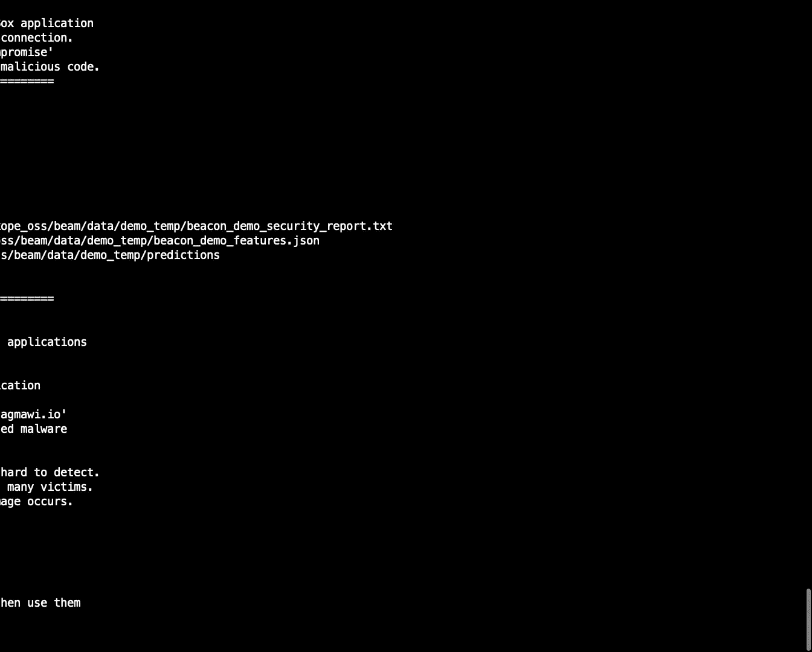
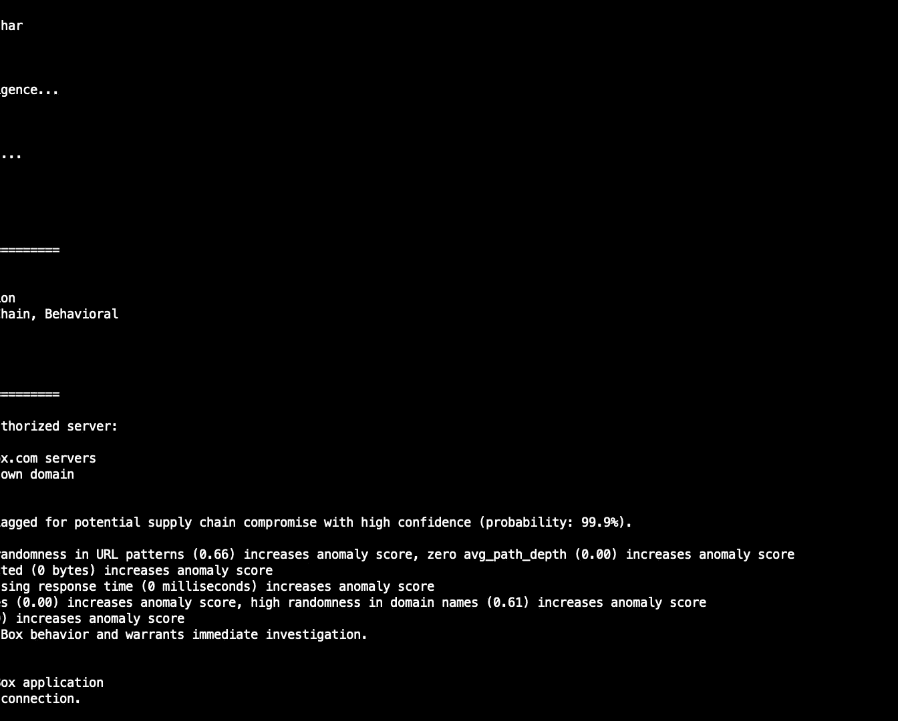
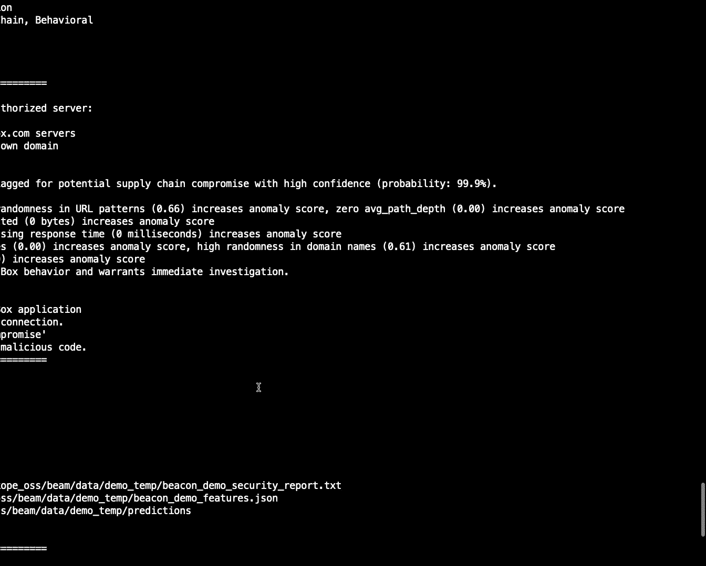
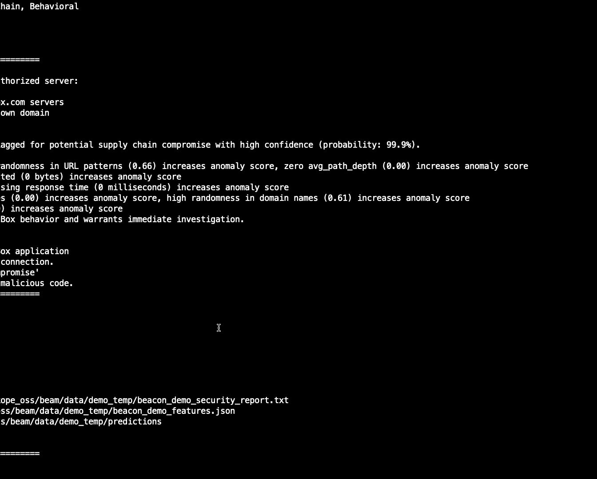

# Your Traffic Doesn't Lie： Unmasking Supply Chain Attacks via Application Behaviour [UGB5W-yJCrQ]

Thank you all for that introduction。 I know it's the second day and everyone's kind of slowly moving along。

 so I appreciate everyone's time to come here about our very exciting project。

 It's something Colin and I have been working on for the last two years。

 It's definitely the most interesting project I've worked on。

 so we're very excited to be here sharing the insights with everyone by way of introduction。

 my name is Dgma Mugeta， and I'm here today with my colleague Colin Esep。😊，Hi everyone。

 thanks for coming。I've been at Netco Thrat Labs for about seven years now。

 and that's been the entirety of my research career。

One fun fact about me is if you ask me to strap on a parachute and jump out of a plane。

 it's not really a big deal， but what I do find terrifying。Is the solar winds compromise。

I was at Netcope when this happened and it was the first major incident that happened while I was there。

And。Because the Solarwinds customers were probably pretty similar。

 I thought to Netcope customers at the time， it kind of struck me how I'm sure there's plenty of organizations that got hit with this who were what we would consider mature in their security posture。

They had。Sock analysts evaluating similars。 they had pen tests， they scanned for vulnerabilities。

 They did all these things。That we're supposed to be doing。And yet this still happened。

And there was a dwell time of more than a year for this thing。

So that really struck me and like many of the members of the security community， I thought。

I've got to do something， to。Prevent this from happening again。And at the time。

 I wasn't sure what that was， but it motivated me to kind of。Think about that， moving forward。

So that inspired the research that Dimalli and I are going to be talking to you about today。

So I'll let Dggno go ahead and show you where this research kind of sits in the rest of the landscape。

Awesome， thank you K， so when we talk about the research that we're going cover。

 it's important to talk about before we do that it's important to talk about what's out there today。

 So if we look at the software development lifecycle from the developer writing code all the way to the software being packaged and run in your customer or your client environment。

 there's actually a variety of places a threat might exist a developer's credentials might be compromised and the code might be modified or an attacker might go straight to the source control management system and compromise that or they might bypass the step and modify the code on the way to the CICD system or they might just go ahead and compromise the CICD system itself。

Or they might go ahead and swap out the artifacts on the way to the distribution endpoint。

 or they might just go ahead and compromise the distribution endpoint itself。

 or they might just skip all of this process altogether。

 and just swap the application on its way to your client or your customer environment。

 And if your software is like any other software out there and it has any dependencies。

 any libraries， then all of these threats exist up that dependency chain as well。

 So when Colin and I got together we started to brainstorm where wed want a detector to be to be put in place。

 We notice that it's in this use section。 right That's where we want to identify a potential compromise。

 We want to have a control in place that identifies when these applications are behaving anomalously when they're behaving potentially maliciously。

 when there's a deviation when there's potential deviation that warrant further investigation。

 And we want to have a way to explain what's going on as well。

And I'll let Colin go over what this looks like。Yes。

 so like Doug Maui said we wanted to sit on the right side of the pipelines so this is where software has been deployed and it's on users devices in a real environment and so in most cases you're gonna to have something like the box client just as an example running and it's communicating with B services what we wanted to find was this case where all of a sudden it's not just communicating with B anymore now it's communicating with some other endpoint which could be malicious。

So that was the goal was to be able to find something like this happening in the network。

And so if we did find something like that in the network， what is it that we want to see。

So in our ideal scenario we'd want to see something that told us， hey， this host at Dgmai IO。

 this communication is anomalous and it would have a certain level of confidence。

 a certain probability that this is an anomaly so in this case let's just say it's 99% sure that this is an anomaly for the box client and then we'd also want to see the reasons why like how did it arrive at that conclusion。

 what's anomaalous about it。And so there's three examples here on the slide that we'd kind of want to see。

 we'd want to see something like this where it says， hey。

 you know what the entropy of this URL or the randomness of the characters within the URL is different than what we normally see for box。

 so that increases the odds by 5 x that this is。An anomaly。The application hosts。

 the typical hosts that this thing communicates with over time associated with the box application。

 this is not one of the ones we've seen before， so that also increases the odds by more than four times and then the path depth。

 this is just saying hey， normally there's some file hashes or some API versioning information that box reaches out to when it's communicating with a server and this time it's not the same length it's a root path that it's communicating with and that increases the odds by 3X。

So if you're anything like me， you might see this and say， you know what。

 this sounds a little bit crazy， you want to monitor a huge organization with thousands of employees located all over the world using tons of different apps。

 doing all different activities every single day and you're telling me you want to find that needle in the haystack to tell me this is strange communication。

That seems like a really difficult problem。So what we found， though。

 was that if we broke it down into the applications and profile applications separately。

It becomes a bit easier。 This becomes more of a tractable problem to solve。

And so what we did was we started looking at applications individually， and it turns out， you know。

 they do use the same servers or domains over and over again。

 they use the same HDTP methods over and over again。 So even though there's some variability。

 they're somewhat predictable in what they're doing day after day。

So with all of those things in mind with our approach。

We went ahead and created an open source tool that we're releasing today。So it's called beam。

 the behavioral evaluation of application metrics。So beamM analyzes network traffic captures。

 it models the applications in the traffic and detects the compromises that might be happening in those applications。

And that's available starting today。Built into it are application models for8 different。

 very common applications。 So at Netcope， we have a ton of different organizations as our customers all across the world in all different industries。

And we're able to see what do they use and so we chose eight of the common applications we see all the time。

 So what this means is that you can go into our repo， download the software and deploy it。

 and today you could detect anomalies with any of these applications without any learning period。

But what we really want to talk about is the research leading up to this。

 So I'll let Mawing kick that off。 A， thank you， Colin。

 So when we talk about the research that went into beam。

 we have to start off by talking about the data。 Where do we get a lot of these insights that we've gotten is by looking at the data and an Necope。

 we've been able to curate about data data for about 2000 organizations resulting in about 56 billion transactions。

 So a transaction here is an HP request response。 So let's say you have a client application it sends a get request out to a server server responds to 200 some Json。

 That request response is what we refer to as a transaction。

 and we have 56 billion of these transactions that we able to get insights from。

 and these transactions came from 4。2 million different devices。 So these are users laptops， desktop。

 servers， etc。 And on these devices or running 1。5 million different native applications。

 So these applications are just like。Coin mentioned these aren't like browsers， right These sorry。

 These aren't like cloud provider sites。 Theyre actually applications people download and install things like Discord。

 the box， client， Slack， Spotify， etcter。 And these applications had 7。

5 million different user agent strings。 So depending on what device they are running on what version was running。

 etc， they might have a different user agent strings。 So these 1。

5 million different applications resulted in 7。5 million different user agent strings。

 So as we go along， the rest of the talk when we talk about the data。 we looked at the data。

 we got insights from the data。 This is what we're referring to。So once we have the data。

 the next thing we did was you followed a threephase approach to building a detector。

 So we're gonna to slowly walk you through these phases the rest of the talk。

 The first phase was attribution。 So we have these transactions the first thing we have to do is identify which application the transaction came from So to do that we kind of gain some insights from the transaction itself and be able to tag it with the application information once we have these transactions for the application。

 The next thing we want to do is collect all of these transactions for the application and kind of build a profile like Colin said。

 what we want to do is we want to kind of capture the essence of how the application is。

 what does it do What's like the data date looking like for this particular application and once we have what that model for that application for any new transactions that come in。

 we check against what we know to be normal for this application and see if there's a deviation and if there is a deviation is it large enough to be an anomaly and if it is。

Anomaly， why， what's the reasoning behind it I' it malicious。

 And that gives us the insights that then we fashion into a detector。

 I'll let Colin go over the attribution step。Yeah， so the first step is attribution so what do we mean by attribution。

 what we mean is that we're looking at some network traffic and we want to identify what applications generated that traffic so we have within beam we have a component that does that so I'll talk a little bit about how that works。

So the first thing we do within the traffic captures is we leverage user agent strengths。 Now。

 typically， this has been avoided by security professionals for a couple of reasons。

Probably the first reason is that it's editable， so if you know how to do it。

 you can modify the user agent string to say anything you want。

And because of that most people don't trust it rightly so， however， I'll say like we mentioned。

 we have a lot of data at Necope and that data comes from the day-to-day activities of people all over the world in different organizations and these people are not sitting there modifying their user agent string every time they're using Slack or Asana or something like that。

 so we have a lot of traffic that we have a high level of confidence in that this is the original user agent that comes from the application。

So that's the first thing。 The second thing is that user agent strings like we're showing on the screen don't follow any sort of standard structure。

 there's no standard out there that says hey， all you vendors that create user agent strings have to adhere to a certain structure so that we can parse it It's just a bunch of text。

 and so it's difficult to deal with so how do we deal with all of that。Well。

 we found that experimenting with some LLMs， we were able to actually get them to summarize what the user agents meant pretty well。

And within beam， we have a Laama model included， but we also built a connector that goes out to Gemini。

 if you have a Gemini account。You can use that API as well。

 So that's one of the ways that we take the user agent string and try to translate it to an application name。

 We also used some libraries that are available for Python that do this as well and what we want to get to is basically just an application name in a version number So we're translating from the user agent down to just say Chrome 134 or B or something like that。

So that's the first step in the process and I'll let Deb Mai walk you through the next step where we model these applications Awesome。

 thank you Colin so now we have the transactions and we've tagged these transactions with the application that it's coming from the next bit we want to do is like we talked about we want to build a model for these applications and we do this by a model training phase so when we started to look at what sort of signals do we want to extract from these transactions Conin and I kind of got together and we started making a list so we definitely want to identify any unusual domain connections that might be happening similar to the sunburst malware we want to see any anomalous repo access that might be happening like the 3CX attack and we absolutely want to see any large outbound unexpected data transfer that might be happening similar to the MoVID incident。

So when we started building this list out， we actually ended up with 185 different signals that we couldn't fit into one slide。

 and we really， really tried to kind of fit at all。 but we just couldn't。

 So what we've done here is we've picked just a few that are exemplary。 And for the full list。

 like we said， we've open source this project。 the code is there。

 So anybody that's curious can kind of go and take a peek。

So the first example is the time the requests take so when you have a client application sends a request out that takes time when the server processes that responds and comes back that also takes time So we want to take these two time values and extract some statistics from them。

 What's the minimum， What's the maximum， What's the median， What's the deviation。

 is it always the same or do we see some strangeness there。

 The second is we want to see the time interval as well。

 so not just how long did the requests take but how long did the requests can between the requests themselves So is it always five seconds is it always 10 seconds。

 is it robotic or is it more bursty， do we see kind of more of a human using an application type of a pattern。

We also want to see if there are any sequences that are present。

 so do we see an application send a get request to a server and then a post request to another server over and over again and that's how it communicates or do we see it just sending a get request to one server or do we not see any sequences at all right how does this application behave on a day- to- day basis？

We also want to see what are the typical HTP methods and statuses。

 do we see an application only use get and post or do we see get post delete or do we see a variety of eight others so we can kind of see what the normal HP statuses and methods are to be able to kind of capture what that essence is。

And then lastly， what are the files that are being moved， if any， right。

 do we see a lot of files being uploaded， Do we see none， What are the file types for these files。

 You could imagine a box， cloud storage app moves a different kind of file set as Spotify a music streaming service right so depending on what kind of file types they move that also matters to how the application is or how the application behaves。

So once we had these 185 features， the next thing we did is Colin and I looked at each other and said。

 okay， let's give this a traveler， let's see if this works right so we did is we picked 20 applications that we saw all across pretty much all the organizations that we saw we had some malware traffic lying around we just threw that in there as well and we set up just one random forest model。

 multiclass classification problem where each application was a class。That's simple straightforward。

 Just a quick test to see if this works。 And what we found is we actually do a fairly good job of actually telling the applications apart from each other。

 even with the small data。 So on the vertical and this heat map。

 you can see on the vertical is the true value and on the horizontal is the predicted value。

 And you can see the kind of shaded blue line from the top left all the way to the bottom right that we can tell of which application is which most of the time。

 there are some instances where it's difficult， as you can see Chrome edge and box are a little bit difficult to apart from each other and we kind of dive into why that is towards the end of the talk。

 Microsoft word and Microsoft Excel are a little bit difficult to tell from each other。

 But generally we do a pretty good job of telling the applications apart。

 and you can see the malware class actually like the fourth or fifth one from the top。

 So we're able to tell that apart from other applications as well。

 So this gave us confidence that pursue building a detector right and we wanted this detector not only。

😊，ToJust give us predictions。 But we wanted to explain why these predictions were coming out the way they were as well。

 So those are the two big things we wanted from this detector。

So what we did is we took as much data as we could。

 as much of the 56 billion transactions as we could we instead of 5000 use 500。

000 observations per application and instead of using one random force model。

 we move to having one X boost model per application so each application would have its own model to be able to capture even better what that application is really doing So more traffic better model better setup up。

And what we found， we just have one sample result here for the box client app。

 We actually do a fairly good job of telling which observations are box and which our observations are not。

 Now， we talked about explainability。What exactly is the model picking up。

 And to help us do this is what we have we have here is a shop plot。

 We'll go over what a shop plot is in a few slides。 But here。

 what it allows us to do is see which features are important for this particular model。

 And you can see for the box model。The client bytes。

 the amount of data that client application is sending to the server is important。

 The cloud storage app， right， So you see the average client bytes， the median， the minimum。

 the maximum， these are all important。Where that data is going is also important。

 So you see the domains， box net， API doc， box do com。

 those are important because that's where typically Box sends the data。

What the server responds back with， the content type is also important。

 So we see here JSO is what the server responds back with。

 So you can see all of these features are helping us kind of dive deep into how B behaves。

 and because of this， we're able to kind of capture。Like I said， the essence。

 the simplified of how box is。And we had similar results for the other applications as well。

 so each application here had its own model， its own feature set。

 its own set of important signals to tell how the application behaves。

 we had similar performance metrics for these pretty high accuracy and true detection rate and low false positive rates for these。

So this gave us a lot of confidence to go into the next part that I'll let call into is my favorite part of the talk。

 and I'll let Colin walk you through it。😊，Yeah， thanks De Molly， so yeah， the next phase here was。

 okay great， we can identify applications and profile them。

 but is this useful in some way can we detect an actual threat with it？

So what we did was we actually set up a red team blue team exercise internally。

 we found a red teammer who does this constantly within Netcope and he agreed to help us out so Mohanraj is our red teamer and basically what we told him was hey we're working on this project we have these apps that we're analyzing out of these common apps what we want you to do is pick one and set up a scenario where you compromise it and communicate with your own C2 server Don't tell us what application you compromised。

 don't tell us anything about your C2。Or how you're communicating nothing。 Don't tell us anything。

 Just do it。 And then we will see if we can find it in the network traffic。

So our job was to model the common apps and then detect this communication。

So Mohan Raj ended up selecting Spotify the list of applications。

 and he set up his command control in something called Github code spaces。

 So for anyone who's not familiar， this is just a service that GitHub runs where you can basically code in the browser and run it and they'll host it for you。

 So that's where he set up his C2 server。And this is just a really simple diagram to show。

 hey we have our victim machine running， Mohenraj infected it， he's got Spotify running。

 it's communicating with Spotify like you would expect。

 and it's also communicating with GitHub code spaces。Now。

 if you're just looking at this traffic in aggregate。

 it probably wouldn't raise any red flags because it's just like， oh。

 maybe it's just developer traffic， they're listening to music and they're using Gitthub codespace as big deal。

嗯。And in this case， there was a Spotify user agent that was communicating with both。So。

Just a quick sample of the victim's machine， we could see that the client is running and it's using this server called Superduperchains Github。

 devev， so that's the C2 URL， and so Mohanj is running a tool there。And the attacker console here。

 So this gave him remote code execution on the victim machine。 And we can see him running。

 Who am I printing the working directory and so on。So， he's successfully。

Set this up where it's communicating back and forth。And then we took the network traffic。

 and we were like， okay， what do we get， Well， sure enough， our proof of concept tool here。

Showed Spotify communicating with this Github do devv。

 And it found that it was an anomaly with 94% confidence。 So we were successful there。

So we went back and showed that to Mohan Raj。And his reaction made us giggle like a couple of schoolgirls。

 so I had to include that here。So I'll let Dag Mai kind of take it from here to explain the explanation under the anomaly。

Awesome， thank you， Col。Yes， Mohan had set this up。 We got the traffic。

 We ran it through an early version of being we were able to detect it But what were we able to detect what exactly did this detection rely on。

 So here we have a shop plot like I mentioned earlier。

 So a plot just to simplify it gives you a list of features that are important for this prediction and which way they swayed did it push it more towards the anom side or push it this is a nonomal towards the blue side。

 So here you can see a list of all the features that are incremented kind pushing it more to the anom side。

 There are few that are blue that are pushing it the other way。

 And I wish we could have more time to go over each one in depth。

 We want have that So we done is we picked5 that we want to quickly go over So first。

 the time taken in milliseconds is off for Sify。 This communication is not how we've seen Spotify communicate as far as the time the requests take So that kind of pushes it towards the anom side。

 The client bites， the sum the average and the minimum or all off Sify。

 This is the kind of data we see the client。Sending to the server。 Now， to Mohan's credit。

 he was trying to be low and slow。 So the amount of transactions that we saw were in line with how Spotify communicates。

 So you see that pushing it a little bit towards the blue。 But overall。

 all the other features were kind of flagging this towards the anonymous。

 So even if he was trying to be low and soul， it' still kind of showed up on our radar。

 we were able to flag it anonymous with 94% confidence。😊，And all that calling over demo。Yeah。

 so with that， we've been showing you up until now the research leading up to this and we wanted to also show you how the tool operates today。

 so I'm going to go ahead and run a demo and this demo is available in the GitHub repo itself so what I'm running right now。

 everybody could run later on whenever they download it。

And basically， what's included in the demo is。

A network traffic capture of the scenario we've been talking about。

 So this scenario is there's a box client and all of a sudden it starts communicating with this Dgmaly do I O server。

And。We have a horror file。

So up the top of the screen， hopefully you can see this。

 there is a H file that's being analyzed by beam here， and so it parss 300 network transactions。

And。Maps them to their applications， and then it runs through the features。

 runs through our detector， and basically says， hey。

 there are seven applications in this network traffic capture， and I have a model for one of them。

 which is box。 So beam automatically says hey， I have models for some of the applications I found。

 I'm going to go ahead and run my detector over。

So it ran the detector in this case， and it found a critical compromise。

 So this is where it's finding the communication with Dg Valley IO。

And then it's just giving you the top five reasons we didn't want to， I mean。

 there's a lot of text here， we didn't want to add even more text with every feature and its outcome。

To the output so it's just showing the top few indicators that contributed to the probability that this is an anomaly and so any traffic capture you run will perform the same way。

 it'll show you the first few and then if you want to see more you can look at a sha plot that gets generated on the file system。

So。With that， let me go back to the slides。And I'll let Do Mai walk through the Sha plot here。

 Awesome， thank you， Colin， Every time we do that demo kind of gives me a little bit of chills。

 We're going through these slides quickly。 So it's kind of fairly easy to assume that you know。

 this is how quickly the research progress。 but it was not。

 There is a lot of trial and error to be able to kind of get to this point。 But nonetheless。

 like Colin said， all of this is available in Bea today。

 So if you download this to run this that par is included。

 you will get a shot plot that looks like the following。Again。

 we won't have time to go through each one。 So we've picked as the top four here to kind of highlight and quickly go over。

 So first is the URL entropy。 So the Shannon entropy of the URL is off for how we see box typically communicate。

 We see a lot more in a box URL trying to identify the file。 what chunk of the file is updated， etc。

Second is the server byte， so the amount of data the server returns back to the application is also off。

 so that pushes it towards the anomalous side。Third is the time it takes again。

Time the requests take is not in line with a box application。

 So that flags it as anomalous a little bit as well。 And then lastly， this is a new one。

 is the key host names， so。Typically， when we see B communicate to servers， to hosts。

This isn't the kind of host we see it communicating to。 Not only is this。

 not any of the hosts we see it communicating to， It's not related to any of the hosts at all either。

 So it's really far out there。 So because of that， this also pushes it to the anomalous side as well。

 And because of these four and many of the other reasons that you see。

 this pushes it towards the anomalous side with about 99% confidence。

So when we talk about the values that are being pushed。

 I just want to highlight here that these are in log odds so when we say this is pushing it in 0。

05 Editive this way， that's actually increasing the odds that this is anomaly by 1。

05 x when it's pushing it by 1。7 this is actually increasing the odds that it's five that it's anomalous by 5。

47 so that's quite a noticeable increase like that's how strange it is for this feature to not be in line with the box traffic everything you've seen about box indicates that this should be how a box application communicates。

So if we go back to the introduction that Colin did。

We said we wanted to build a detector that would flag something like the following。

 Communication to this domain is anomalous， with very high confidence。

And we wanted the explainability behind it。 Why is it that it's anomalous， Well。

 the URL randomness is off。 This isn't how we see the URLs for this particular application。

 So this increases the odds that this is an anomaly by 5 x。

The host that this's communicating to is not in line。 Not only is it not a typical host。

 but it's not related to any host that we know of as well。 So that increases the odds by 4 x。Again。

 the path depth， the information we see in the past。

 the resources that are being hit aren't in line with this application as well。

 similar to the URL of randomness。 So this increases the odds that this is anomaly by 3 x。

 So because of these and many other reasons， we're going flag this as anomalous communication。

And I'll hand it over to Colin to talk about how you can use this for your own models as well。Yeah。

 so you all might be。Watching is thinking that's great that you guys can do all this with eight applications。

 but what about the rest of the applications I run？

And what we wanted to do was address some of that concern and include in beamM the ability to add more models so you can add custom or bespoke models to the portfolio that's running within beamM and all you need is network traffic capture。

 so PAP files and H files are primarily what beamM will take as input。

And so we do have an unsupervised ML component that will take those traffic captures。

 and it'll look for any non browser application and model that。And so。

If you're curious about what the unsupervised models look like， actually， before I go to that。

 I wanted to also mention that。Like anything else with machine learning， more data is better。

 we do have a threshold of at least 100 transactions for any application。

 So if you have a traffic capture and you want to train a new model。

 you need to have at least 100 transactions in there。And if you don't， it'll find the application。

 but it'll say I'm not generating a model。So the unsupervised training， what does that look like。

 well， it's an ensemble and it consists of isolation forest， one class SVM， and an auto encoder。

And so these three contribute to。Being able to find anomalies within the network traffic that you're feeding it。

 So it's slightly different than what we've done at Netcope offline， but this was our first version。

 our best effort of making it available to you today。So。With that。

 I wanted to walk you through another scenario here。Let's say I wanted to create a model for notion。

 So I created a Windows client。 I have a Windows machine running。

 I download the notion client and proxyman。And proxy man just allows us to capture the traffic。

So I set up the client and set up proxymen and then run it and it's communicating with notion capturing that traffic。

 so that generated a hard file for us。And now what I do is I give that ha file to beam as input and tell it to create。

 I tell it to train on that input。And it goes ahead and creates a new model for me。

 So this is kind of what it would look like。And another note。 So like I mentioned。

 we have a threshold of a minimum number of transactions， so。Not only was notionion running。

 but also VS code was running， but it didn't have enough traffic to create a model for it。

So we only have the notion model and then up until now we've also been demoing these compromises。

 so I wanted to show you what does it look like if there is no compromise。

And this is basically what it would look like。 So what I did was I created a new model for notion with a ha file。

 and then I reused that same ha file and ran it through the detector。

And so it didn't detect any anomalies in this case， everything looked good。And so with that。

 I'll hand it back to Dg Maui to talk about next steps。Awesome。Think gone。 So every time we。

Did a travel and did a test。 And we saw when something successful happen。

 There were like two or three other things that came out of it like that we need to improve。

 We need to make better。 right So we tried again， we would want to go over all of these。

 We just don't have the time。 So we picked our three that are top of mind for us。

 These are things we're still working on。 We're still thinking about we actually having conversations about some of these yesterday。

 So if you guys are interested。 or if you have a new clever way of working through any of these challenges。

 Please collaborate with us。 this is an open source project as of today。

 So it's definitely all of this is available。 First what we call high entropy applications。

 like I mentioned， the eight that we have here。 we do really well detecting anomalies for。

 but there are certain applications。 for example， browsers or it's quite difficult。

 And it's difficult because we can't really capture their essence or profile across multiple devices。

 Everyone uses their browser very differently。 So it's very difficult to kind of come up with a feature set to capture all of these。

 So one of the things we're thinking about is maybe using a different feature。

Set for them or maybe even a different strategy altogether for these sort of applications。

Second is additional methods of attribution。 So we're using the user agent strings here。

 and 99 plus percent of the time no one changes it。 it's very reliable， but like Colin mentioned。

 attackers can change this。 sometimes it's set to knowll and in these cases。

 we want to be able to maybe hook into endpoint information like the process or process to be able to use as additional source of attribution for this traffic。

 and then lastly is further support for bespoke model。

 So they Colin mentioned we do a pretty good job already of kind of building models for your bespoke applications。

 but there's definitely room for improvement here， maybe coming up with a new model to add to the ensemble or maybe coming up with a new ensemble altogether。

 So if these are this or any of the other two points are interesting to you guys definitely reach out to us and let us know and I'll hand it over to Colin to talk about where you can do that。

Yeah， thanks。Here you'll see the QR code， which will link you to our GiHub repo and the URL is also down there。

 so this will be available in the slides that they send out。

 but if you guys want to look at it today， feel free。So what are the takeaways here？Well。

 first of all， we just wanted to make sure everybody here kind of left with this idea that supply chain compromises are too terrifying to leave to one type of solution。

 the whole motivation behind this was，We need， different solutions in different spots in order to really address and mitigate against something like solar ones happening again。

The next thing is that if you're interested in beamM。

 it will detect anomalies solely from web traffic， beamm is not a proxy， so it's out of band。

 it's out of the critical path， but you can feed it network traffic captures and get some results。

It also does not decrypt the data itself in any way that's sort of outside the scope of the project。

And then lastly， you can add new models for the applications that you run in your own environments。

So。Yeah， that's about it。 So thank you very much again for your time and please let us know if you have any questions。

 We have like another minute and a half or so， if anybody wants to come up to the mic。

 we'd be happy to take any questions。Yeah， go ahead。 This is super cool。 Thanks。

 Do you think it would be possible to implement in an EDR instead of on the。I'm sorry。

 I didn't catch all of that。 Could you say that again。

 Do you think it would be possible to implement this at EDR level instead of on the network。

 I'm assuming you're doing it at sort of。InD。Yes， yes。

We didn't look at integrating with any particular EDRs， but like Dg Maui mentioned for next steps。

 I think we're very interested in seeing what other data we might be able to integrate with。

 so even if it's not sitting on every endpoint like deployed somewhere being out of band and taking data from EDR would probably be something we're interested in doing。

To actually his related to his question I was thinking that I could use EDR telemetry data in order to feed like by the process all the network activity in order to use the modeling so my question is how easy is would it be to。

New input types to the beam modella。New in types。 So if I can get EDR telemetry to tell me Yeah。

 by process， requests are being made。 I'm going to get that additional signals as well。

 you mean Yeah， and that we I have to profile it based on the process。 And to his point。

I could then use a mechanism to monitor each process to see what that did rather than by user agent string。

 but by the process I on the host side。😔，Yeah， so it's not natively supported。

 but there's no control in place that's keeping you from adding your own signals。

 like we said this is all code that's available so you can easily extend it as well。

 that's actually a really good idea for us to kind of maybe support additional features as well that is a next step like Col mentioned to be able to support endpoint information as well。

 Nothings like to summarize nothing stopping you from adding it。

 It's just not something we support demo if you want to go in that direction can use。第啊。

Event telemetry mechanism TW in Windows to do that rather than relying on a specific。嗯。刘海。Sorry。

 there is one more。Go ahead。Packet headers or。Was in the data。I'm sorry， can you just say that again。

 was all the data he did here， was it all encrypted or was he all worked off just packet headers or did you do something different？

Yeah they're not encrypted basically， this is like assuming you've already sort of proxed the traffic。

 decrypted it， and you could use a PCAP file or a H file as input。So you didn't do anything with。

can capture like from an NDR。Solution from a network Pro response。we've done some packet captures。

 but again， like we said it was decrypted traffic。 So is HP traffic in the packet captures mostly。

 yeah。Thank you，The way the bin actually works right now it's an offline product。

 so you analyze one pickup at a time， It's not like you can run。An instance， and get big。

Live data from all your endpoints and analyze them live and then integrate it with V or something that。

Just one pickup at a time， from one single point at a time。So yeah， go ahead。 No， go ahead。 So it's。

 it's not just one P at time。 You can run it against multiple。 It does support multiple。

 but it's not as。It's not at the stage of where you're thinking of you can deploy it。

 And it's kind of a full flash system just yet。 No， I don't have calling you an a in。5 features。

Sorry， is there any documentation in your Github which talks about these 185 features it's。

 it's yeah， it's in the repo。 Yeah， it's in the repo。 there should be a Python file。 If you。

 if you already have it up。 if you come up by we can show you exactly where it is。

 there should be a Python file that shows you， yeah。I think it is useful。 I mean， maybe we could。没有。

Okay， I think that's our time， so thank you。 Thank you all。Thank you。

