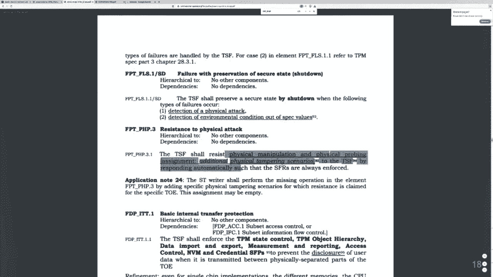
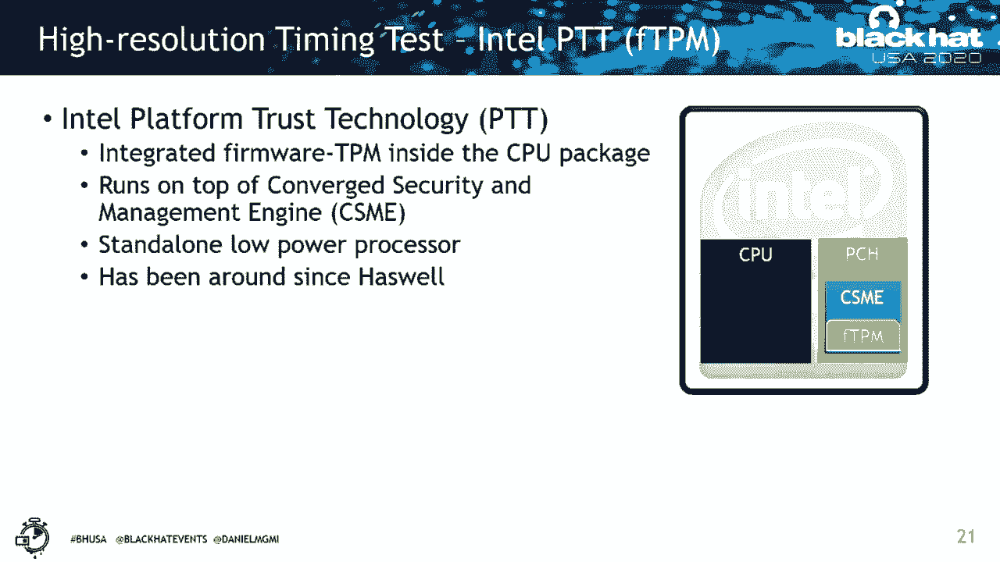
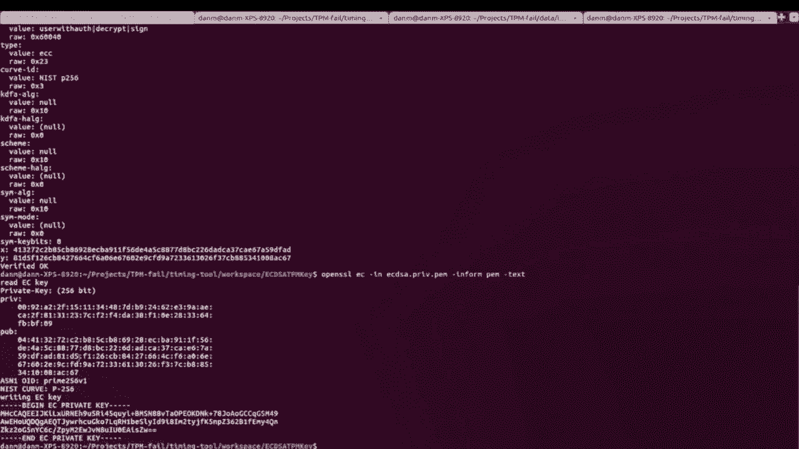
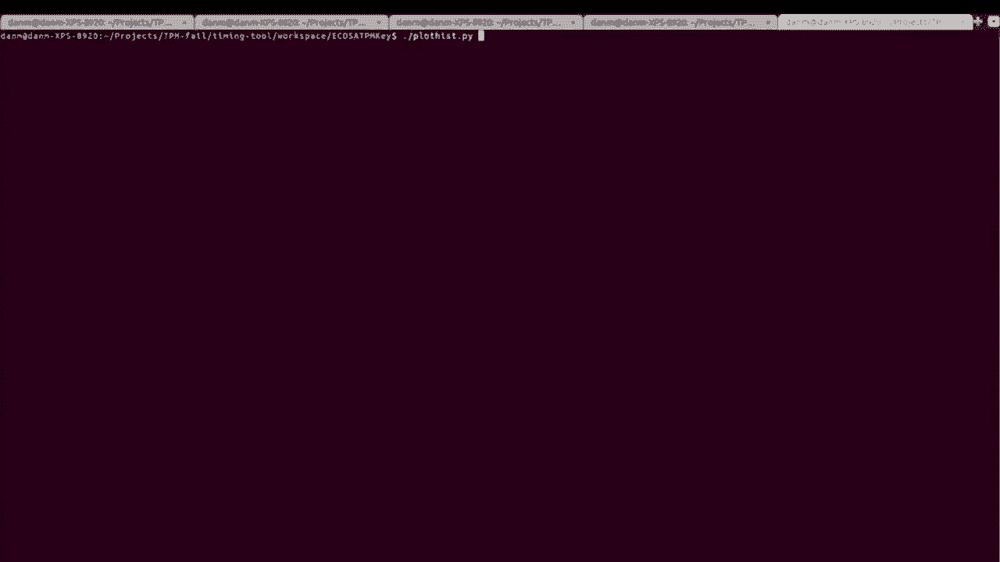
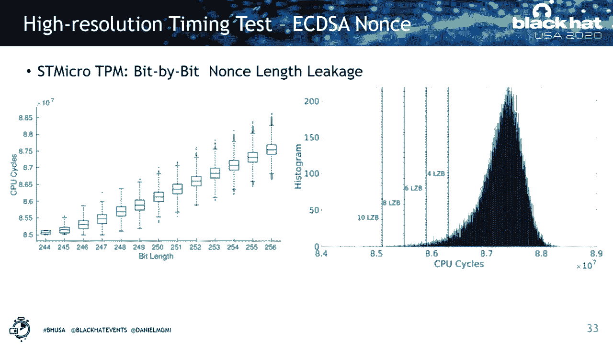
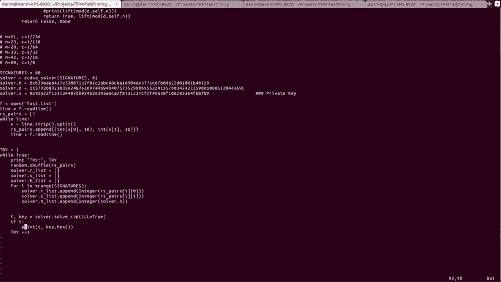
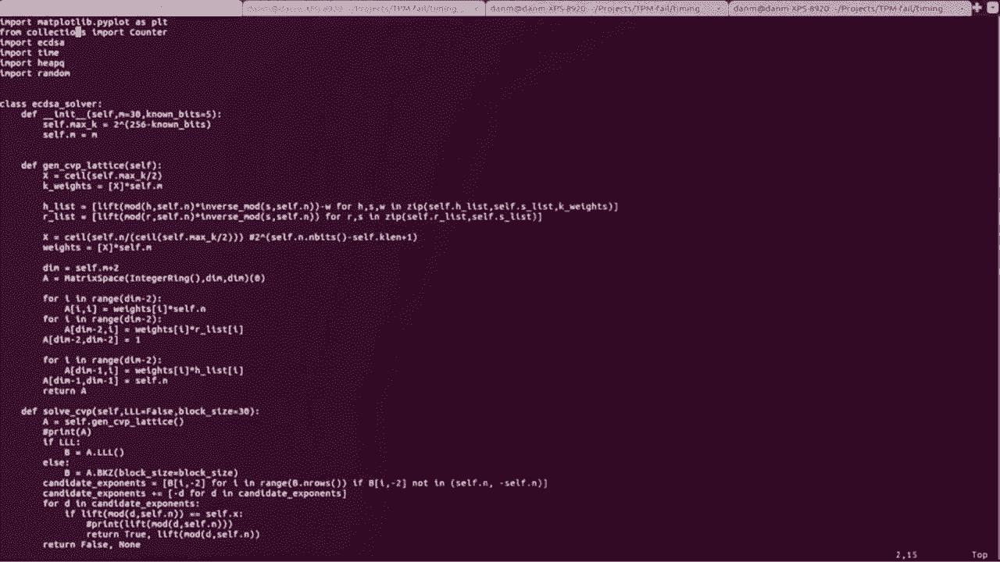
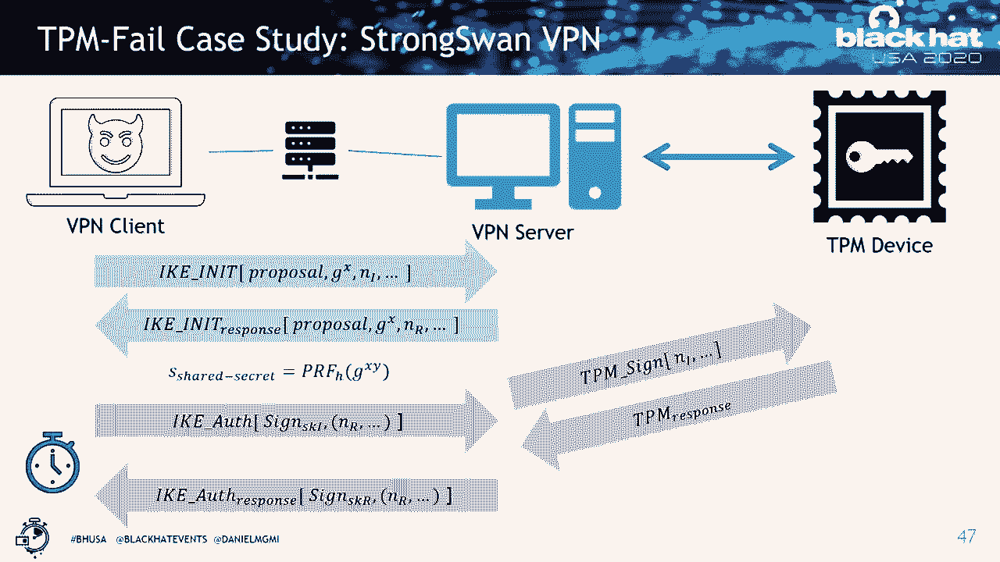

# P10：10 - Remote Timing Attacks on TPMs, AKA TPM-Fail - 坤坤武特 - BV1g5411K7fe

 Hi everyone， thanks for attending my talk。 Today I'm going to talk about TPMFEL， which。

 is related to some vulnerabilities on trusted platform modules that can actually be exploited。

 to leak cryptographic keys from these secure platforms。 My name is Daniel Mo Rimi， I'm。

 a security researcher and I've been working as a PhD student on a few topics like micro。

 architectural attacks， side channels and applying them to break crypto implementations。

 and inter-lesticks。 And you can reach out to me on my Twitter or there are information。

 on my website as well。 Before I start my talk， I would like to also thank my collaborators。

 in some of these works like my advisors Berg Sunar， Nadia Henningard， to Mas Aizenbard。

 and Jan Vishalme。 Before we dive into the topic of this presentation， which is related to。

 side channel crypto analysis， we basically motivate on the fact that on traditional crypto。

 analysis， an attacker try to look at a crypto system at the input and output of this crypto。

 system and try to find some flaws that can be used to leak the crypto key by just finding。

 some design flow and things like that。 A good example of this happened 10 years ago on PlayStation。

 3 that they were using ECDSA nuts in the proper way。 And what happened then was that， so in， ECDSA。

 we have like these fancy equations here that we can compute a signature pair。

 And here in these equations， there is a non-stat， that is a secret value that needs to be generated。

 for each signature uniquely and randomly。 And there is a private key here that is the private。

 key for that message。 And what happened back then is that designers of PlayStation 3， they。

 basically use the same nuts for all the messages and these equations turn to something like， this。

 And when you do that， the problem is that if you just generate two messages and。

 you subtract them from each other， you get a much simpler equation with just one non-variable。

 and you can just calculate the private key from this。 So this is a huge design issue。

 And that's what traditional crypto analysis is about， that people try to find design issue。

 in the actual algorithm or the actual design of some crypto system to break it。 But inside。

 channel crypto analysis， we are not playing the fair， the same fair game。 We actually have。

 more information about the system。 And the idea is that during the execution of a crypto， system。

 we can learn some signal， something like timing channel or other things that can。

 actually be used to perform key recovery in a more efficient way。 And there are lots of。

 different type of side channels。 For example， there is power attack， electromagnetic attacks。

 timing attacks， cash attacks。 And these attacks， they are generally， they have a very complicated。

 thread models because some of them can be conducted on a physical access device scenario。 Some。

 of them can only be done in a local attack scenario， like in the cloud。 And some of them。

 can also be done remotely。 And this actually makes it really complicated for crypto developers。

 to implement an algorithm to be secure against all these different scenarios。 So we mentioned。

 that today talk is about trusted platform module。 So just basic what is trusted platform， module。

 The basic idea is that we know that we cannot really rely on operating system。

 or the hypervisor for root of trust and security， because there are all sorts of attacks that。

 compromise the system software。 Like， there is a route kids， there are different things。

 And we know that even sometimes the CPU cannot be trusted as we have seen by attacks like。

 meltdown and spectra。 So the idea is we need something like hardware based off route of， trust。

 And we have designed things like trusted platform module for instance。 Trusted platform。

 module is a secure element that is standard and it has to support a standard set of functionality。

 And the other promise of this trusted platform module is that it basically defines that security。

 chip that need to be secure against even some of the physical attacks like like tampering。

 and side channel attacks。 And this TPM device is basically when you have one of these， you。

 can simply put all your crypto keys or important asset inside this kind of a safe。 And if the。

 OS or the cloud provider or any of the software level or even anything that runs basically。

 on your CPU get compromised， they cannot subvert the entire control and they cannot access to。

 all of the information。 So what is inside this security chip or trusted platform module。

 there is a specific set of functionalities that is defined by trusted computing group。

 and organization。 And basically based on this definition， this trusted platform module has。

 to support some secure storage and also some cryptographic functionalities like digital signatures。

 And we got to talk about digital signatures more in this talk。 And it's important。 But， in general。

 these digital signatures can help us to execute signing operations more securely。 And nowadays。

 there are lots of software stacks like the Linux software stack or open SSO that。

 they actually support using trusted platform module or TPMs for performing signing operations。

 whether it's RSA or a CDSA。 And another important aspect of these digital signatures is that。

 you can actually use them to perform remote attestation of hardware from the other side。

 of the internet。 You don't know if another party is running the correct firmware， the correct。

 hardware。 And you can use remote attestation to verify some of these promises。 Since 2010。

 trusted platform module version 2 now supports elliptic care of digital signatures and schemes。

 like ECDSA or ECDAA。 And these schemes use elliptic care that are actually more efficient。

 and are actually more popular nowadays。 So one thing we mentioned is that， okay， these。

 trusted platform modules， they have some standard and they need to support a set of functionalities。

 But one thing that we are interested in to know also if these devices actually support any。

 if this standard supports any implementation standard， like how do we know if these hardware。

 devices， the security chips are actually implemented properly。

 So TCD expects designers and developers， of these products to maintain security assurance according to common criteria。

 And the level， of assurance they expect is EAL 4 plus。 And if you go on the TCD website。

 you can also， find a list of devices that actually have proper certificates。 And for instance。

 in this picture， we see some devices from ST microelectronics or new Wotan or Infini and that are listed here。

 And for example， one thing here we looked at is this is like a picture of ST microelectronics。

 that I actually took from the laptop that I'm using today for this presentation。 And we。

 looked at the data sheet of this chip and it shows that， okay， this is this supports resistance。

 against side channel attacks。 And we also looked at the evaluation and here is the link for。

 the evaluation of this TPM chip。 And it's also like we made like we looked at through the。

 different part of this evaluation。 It says， okay， this is the version that is evaluated。

 and this is the date that the evaluation has been conducted。 And there are some interesting。

 information。 Like for instance， the was the RSA and ECC keys are actually used for endorsements。

 of this device， which is the root security key that is used for these devices。 And there。

 is also other things that says， for instance， this device need to maintain security of all。

 the assets inside it。 And the list of assets is defined by the protection profile， the。

 user key or other other keys that are stored in the storage， they all need to be protected。

 for the implementation of these devices。 And more explicitly， it also says that this evaluation。

 supports side channel attacks and timings attacks and attacks like SPAN， DPA， and there。

 is also other information like， yeah， the standard that it needs to support physical manipulation。

 and physical probing is covered。 So we see that basically this says that， okay， this device。

 actually supports mitigation against this side channel attack。 So now the question is， okay。

 should we just rely on this certificate and say， okay， this is done， this is secure device， or not。

 So the first thing we wanted to basically test is the simplest test that's also very。

 practical is a timing test。 Because if we can recover any key from these devices using。

 a timing attack， it's actually very valuable。 And it's an attack that is not intrusive， it。

 can even maybe done remotely。 So to build a testing tool and measure the timing of this。

 TPM device is what we did is that if you looked at the CPU cycle count， because we realized。

 that most of these TPM devices are implemented on a very low cost microprocessor that may。

 run like 100 times slower than CPU。 So using CPU cycle count is a good way to measure time。

 for these devices without any special equipment or anything。 So one of these devices that we。

 looked at initially was called Intel platform trust technology or Intel FTPM。 This Intel FTPM。

 the idea is that they have implemented the TPM features as it is defined by TCG as a module。

 that runs on the CSME or management engine inside the same die as the CPU。 And this management。

 engine also runs its own microprocessor。 So it separates from the CPU。 So even if the CPU。

 gets compromised， you are not supposed to have access to that microprocessor even though。

 if they're on the same die。 And this has been around now for a long time since Haskell and。

 it's very popular because most computers and laptops nowadays， they can just rely on these。

 if they have Intel CPU and they don't need to attach a separate trusted platform or a。

 dedicated trusted platform or to your motherboard。 We did an initial timing test and we realized。

 that if we run a CDSA and this TPM firmware TPM， we see that for different executions of。

 the same CDSA function with the same private key。 The timing operations are actually different。

 for different execution。 And here we see a histogram of different histogram of a number。

 of signature operations and their timing。 So this got kind of our curiosity。 Okay， so。

 we see as timing behavior here， this is interesting， can we do better？ So what we did is that we。

 basically implemented a tool to do this timing measurement more precisely， our tool basically。

 overrides some of the functionality of the Linux kernel stack for TPM。 And this functionality。

 when it's overrided with our tool， we can actually measure the time of the TPM operation as close。

 as possible to the interface of the TPM device。 And by doing that。

 we can get a very high resolution， timing of what's actually going on or if there is anything interesting。

 And when we did that， we saw that， okay， this Gaussian distribution actually become even more separated and we。

 see that there are two different brackets here in this timing operation that is measured。

 with a root axis。 So we use the same key to generate all the signatures。 And this actually。

 told us that， okay， if we use the same key to generate all the signatures， the only thing。

 that is changing is the nonce。 And that could be the reason that we see this timing behavior。

 So we looked at the nonsense for some of the signatures we generated and we realized that。

 there is actually a leakage behavior that is directly correlated with the beach length。

 of the nonce。 So for example， if we execute this signature operation and this is the nonce。

 that is used， we see some some timing like this。 And if there is like four between the。

 off leading zero bit at the beginning of the nonce， we see that the timing is much faster。

 And so on， so we see that for every additional four between the off leading zero bits at the， nonce。

 the signature is generated much faster。 And for instance， if we have like 12 leading。

 zero bit in a signature， the signature may be a slot， maybe faster like for more than。

 three milliseconds， which is a very high timing behavior that maybe even be observable over。

 a network。 And here I prepared basically a demo of how such an such an attack works。

 that we can collect timing measurements。 First we use a script to generate open SSL， generate。

 a CDSA key using open SSL and then we program the device with this key。 So this is script。

 runs， we program the device with a new new key for a CDSA operation。 And if you look at， the key。

 we see that okay， we have generated a 256 bit， a CDSA key。 And yeah。 And here， is the key。

 the private key starts with the Higgs value 92 and so on。 And then we have。

 another script here that basically uses our tool to measure the time and also run a TPM。

 signing operation。 So we use this tool basically to generate signatures and also measure the。

 time of execution of that signature。 And when we run this tool， we see that a new entry has。

 been added that it has some signature pair and some timing values。 And if we keep running。

 this script， we see that okay， another entry as we are。 So in our， for our attack， we basically。

 run this script for a while。 And here we have also a live histogram of what's happening。

 here that we see that as we generate the signature， some of these signatures are faster。 And this。

 means that the bit length of the nonsense was shorter for the signatures。 And this histogram。

 as we see is populated with this bit length value。 And we see that some of these signatures。

 are faster。 And for an attack， we are generally interested for the signatures that are on the。

 left broadcast， because we know that they have some bias in their nuts。

 So this was a vulnerability basically we found an Intel FDPM or an Intel PTT。 And even though。

 this device has some security guarantees like the VPS certificate， but it doesn't have any。

 CC evaluation and it's not listed on trusted computer and group website。 So we were interested。

 to also see if there are similar vulnerabilities in other TPM devices。 So we used our tool to。

 do timing test of a bunch of computers that we had in the lab。 These computers， some of， them。

 they just use the Intel FTPM。 And when we ran this test on Intel FTPM， almost all。

 of the devices that were using this Intel FTPM were vulnerable to this timing behavior。

 And then we also found some interesting thing and interesting other timing behaviors and。

 other devices like a new botan and an infenient。 But the only other interesting vulnerability。

 we found was on ST microelectronic TPM device that we also earlier showed that it's supposed。

 to be resisting as this attack。 And here is basically the histogram we drew for the timing。

 behavior of ST microelectronic。 And we see that even though at the first glance it looks like。

 balanced Gaussian distribution， but we have more samples on the left side and it actually。

 gave us an idea that， okay， this may also have a timing behavior。 So we looked at the。

 nonsense again and we realized that， okay， this is a very similar vulnerability compared。

 to the Intel FTPM， is the assay operation。 But this time is set up for every additional。

 four between the leading zero bits。 We see that for every additional leading zero bits， for。

 every one leading zero bits， we see that the timing is faster。 And we also looked at that， okay。

 there is a linear correlation between the bits length of the nonsense and the timing。

 So this again gives us the similar leakage behavior。 So far we have just talked about， okay。

 we have some vulnerabilities and this ACDSA operation of these devices and this。

 vulnerability tells us some number of bits about the nonsense for ACDSA operation。 But。

 this information by itself is not useful。 We need to use this information to recover。

 something that is more valuable like the private key for ACDSA。 And for this purpose， we basically。

 came up with a systematic attack and this systematic attack， assuming that the TPM is。

 programmed with a private key with an unknown private key， we can basically， what we do is。

 that we collect a list of signatures using this TPM device and these signatures are collected。

 with their timing and we use the timing basically to filter signatures to a group that has some。

 bias， some non-bias。 For instance， we know that all the signatures that are generated。

 in less than X amount of cycle are supposed to be eight bits short， for instance。 And when。

 we have those biases， we basically can use a technical lattice-based attack and using this。

 lattice-based attack we can recover the private key。 So I'm not going to get into the detail。

 of how that is this work。 There are lots of mathematics behind that and it's beyond the。

 scope of this talk。 But the idea is that we can rewrite that ACDSA equation we showed。

 earlier as a simpler equation that has some known values and some unknown values。 And then。

 when we replace the known values with simple variables， we have just this equation that。

 has two unknowns。 And for these two unknowns， we cannot simply calculate any of them because。

 we need at least one of them to calculate the other。 But the reality is we have some information。

 about the value of the non-s or KI。 And this information tells us that KI cannot be bigger。

 than some amount because we know the bit length of KI for some of these signatures。 And this。

 basically resumpled a very well-known problem of hidden number problem that was proposed。

 a long time ago。 And it can actually efficiently be calculated and we can efficiently recover。

 the private key from this if we have enough signatures with this quality。 And what we did。

 is basically we used this information。 We construct a lattice。 This lattice is described。

 in a form of a matrix here。 And this lattice basically form a problem that is well studied。

 in the lattice-based crypto community。 And this problem basically tells us that， okay。

 we want to solve a shortest vector。 And if we solve this problem， we can actually recover。

 the private key。 And surprisingly， this problem can be solved in a polynomial time。 And there。

 are some algorithms like LLL and VKZ that we can execute on this lattice to recover the。

 private key。 And we did that and it actually worked。 And here is also a demo for this attack。

 basically。 So for the same key that we showed earlier， we collected more results。 Here we， have。

 for instance， 25，000 signatures that we generated。 These signatures， now we can， see that， okay。

 these are the histo， these are the Gaussian distributions。 And we are。

 probably more interested in the signatures that are generated faster。 So here， if we look。

 at the value 4。7 to the 10 to the 8， these are the signatures that probably have 8 bit。

 of leading 0 bits because this is the second window here。 So we program this value to our， tool。

 We filter all the signatures that are executed that fast。 And when we filter these， signatures。

 we realize that there is only 99 signature out of this 25，000 signature that。

 they have this quality。 And we saved these 99 signatures and then we use another script。

 that we have a program using Sage。 And this is basically randomly pick 60 different signature。

 from this set of filtered signatures to run the lattice attack。 And here we also have the。

 same private key 92 to check as a ground truth to see if our attack works。 And if our attack， works。

 this function solve CVP is gonna recover the key， if the key matches the key that we。

 have put here as a ground truth， then the attack works。 And here is the simple definition of。

 the lattice in matrix form and running the LLL algorithm in the code。 So if we run this。

 we basically see that our attack works even when we randomly pick different set of samples。

 every time the key， the correct key is recovered。 So this was basically an efficient attack。 We。

 saw that okay， running the attack actually doesn't take that much time。 The only thing。

 that takes time is collecting those signatures because depending on the amount of leakage。

 we have if you have four bit leakage or eight bit leakage， we need to collect different。

 amount of signatures。 And we have some numbers in the paper in more detail。 But the end result。

 is that you can recover the crypto key very efficiently on both Intel FDPM and ST microelectronic。

 especially if you have a local access that's very fast and it just signature generation。

 may take some time。 So after we did this， it was like， okay， we have an almost remote attack。

 on TPM devices， which means that this TPM is even not supposed to leak these keys with。

 a physical attack， but we can already leak these keys from the CPU because we can measure。

 the timing and leak these ACDSA keys。 But can we do these attacks on a real remote like。

 network or remote timing attack like as is known by the community like in the one。 So。

 what we looked at is okay， these TPM devices， they are running with a very slow frequency。

 and because of that， the timing difference for every of these short signatures， the different。

 brackets is different。 For instance， for the Intel FTPM， the time difference for each of。

 those group of peaks we saw is like about more than one millisecond， which means that if。

 you have like 12 bit of zero at one nonce that signature is going to be executed like for。

 more than three seconds faster。 And that means that on most local networks or even some internet。

 networks， this can be kind of observed。 And for instance， here I have like the round-trip。

 time on my local network of pinging and other device in my local network。 And we see that。

 the time it takes to do a round-trip is like less than a millisecond， which means if I。

 have a leakage that is like three millisecond delay， this is something that probably can。

 be observed easily over even a local network。 And even on some remote networks here， if I。

 ping Cloudflare， it takes 20 milliseconds。 So maybe this is even observable over online。

 like internet network。 Well， we didn't do an attack on internet work， but on a local， network。

 we try to see if this what is the impact of this attack on a local network。 So。

 we picked up an application， a VPN application that actually has the instruction how to use。

 a strong song VPN to configure to use TPM for authentication。 So when we configure the。

 strong song VPN to use TPM for authentication， but we realize it's okay。 The first handshake。

 is the same。 There is a D field man key exchange at the first handshake with the server。 And。

 then after this D field man key exchange， both the client and the server， they both have。

 the shared key for encryption of their packets。 But then the client also need to make sure。

 the server is the correct server。 So it's not a impersonated server。 So then the authentication。

 happens in the next IKE exchange protocol。 And then during the next exchange， the VPN。

 server doesn't even have the access to the key。 And it's gonna ask the TPM device， hey。

 this is a message， please sign this for me。 And then the server asked the TPM device to。

 sign the message and the TPM device sign the message。 And then the server just get their。

 response and send it to the client。 And the client can verify that， oh， this server is。

 a legitimate server。 And the good thing about using this TPM is that， okay， now even if the。

 server is compromised， nobody can have access to that private key。 So nobody can impersonate。

 the VPN server。 The draw of the VPN server， basically。 But the bad thing about this is。

 that if we have a vulnerability on the TPM device， then every time there is a handshake。

 you can measure the time。 So here what we did is that after the second handshake， you just。

 drop the connection and we repeat this operation again， and we collect lots of timing measurement。

 They're doing us， we again， apply the same attack that we explained as our local attack。

 on the as the root adversary。 And with the local attack， with the remote attack， we again。

 managed to recover the private key from from VPN server。 And for this attack， we needed。

 like about 44，000 handshakes with the VPN server that we configured on a local network。

 that takes about like five hours to collect this amount of signature。 And the attack is。

 also about 60% of the time is successful with this， with this network。 And here also， we。

 see a comparison of different histograms that we generated for this Intel FTP and vulnerability。

 And we see that for system level adversary， the leakage is almost as clean as if we already。

 know the bias， there is no interesting statistics behind it is just clean leakage。 And for the。

 remote attacks， the leakage is noisier and remote attack with VPN protocol even is more。

 lazy or more noisier。 But what is clear is that there is still possibility to lick the， key。

 And we actually showed that we can recover the private key over a network。 So you may be， surprised。

 okay， why are these such problems on this TPM devices？ And this is not actually。

 the first time that we show such a vulnerability on some deployed crypto products。 Like two years。

 ago， around two years ago， we showed that another product that uses the signature scheme。

 like a signature scheme called E-PID that also use elliptic curve， actually has this leakage。

 And we showed that on Intel SGX product， their secure， their coating on claim that is used。

 as part of the remote attestation is actually vulnerable。 And using a cache attack， we could。

 actually recover the private key for remote attestation。 So this， why is it so easy to。

 break this crypto implementation when it comes to side-channel attack？ The reason is that。

 implementing this crypto implementation is really hard。 It's really hard to implement。

 them to be resistant against all sorts of different side-channel attacks。 If we look at。

 the ACDSA for instance， as we talked a lot about ACDSA， is that there is a simpler equation。

 here that， okay， this is the ACDSA signing operation。 But in reality， there is more going。

 on in the back and implementing this is much more complicated than it seems。 So for elliptic， curve。

 we have like a curve， this is called elliptic curve and it's defined that， okay。

 this is a secure curve。 And then we have two primitive operations。 One operation is called。

 double that after we double the point， we get another point on the same curve here。 And， again。

 for another operation called add， we add two points together and we pass a line。

 through these two points and we get another point here mirrored down there。 And these are。

 the two basic operations， but using these two basic operations， we can implement more。

 complicated operation。 For instance， during the ACDSA signing operation， one complicated。

 operation is the scalar multiplication。 And we can implement a scalar multiplication。

 using a series of double and add operation as we can see that， for instance， multiplying， three。

 seven， 23 different numbers with a point can be done using this island double， operation。

 And this gives us a simple algorithm， we can use this to implement the DCDSA。 But。

 there is not a single implementation of this algorithm and we see that this algorithm。

 has behavior depending on the keybies。 And there are so many other algorithms， there。

 is like double that algorithm that we showed， there is Montgomery double that， there are。

 like a sliding window， fixed window。 So there are so many different ways to implement the。

 same functionality as is part of this ACDSA signature。 And in our case， the showcase we。

 showed in fixed window in Intel FTPM， it was actually a fixed window implementation that。

 was leaking for every four-bit window。 But if you are designing crypto system， this is。

 very difficult because you are not sure what is the Tread model， you may implement this。

 crypto system to run on a cloud， but then later on you may use the same code to run it。

 on an airplane and people have told you not to implement your own crypto， so you just copy。

 paste the same crypto library from one design to another。 And this makes it really difficult。

 And a while back， we actually were curious， okay， how can we find these leakages automatically。

 instead of trying to attack every specific implementation on different platforms。 And。

 one thing we came up with here is that， okay， all these software related side channel indicators。

 they have some characteristics。 They either happen due to a secret dependent control flow。

 like when you do a loop or a if a statement that depends on the keybies， or when you try。

 to do a memory access depending on the keybies， like when we see that in some black ciphers。

 like a yes， that they have something called SBox。 And in some rare cases， there are also。

 some instructions that they dig some value about the input， like on some ARM CPUs， for， instance。

 this has been reported。 But the idea is that， okay， we want to have an automatic。

 tool and we want to apply this understanding to recover these leakages from a software。

 perspective without even caring what computer or what Tread model we are running to。 So， in reality。

 the way our tool， which we call it， the macro work is that。 So， in practice。

 an attacker learn about the execution time， the memory user's behavior， the cache access， pattern。

 But in theory， in the principle， what happens is that the attacker learns something。

 about how many instructions are executed or what branches have been taken or what is。

 the memory access pattern of the software。 And so， we said， okay， we're going to try。

 to have a more tight model and we just look at the principle of why the leakage happened。

 So we came up with this tool and the idea is we generate a set of random test case and。

 we feed these random test cases to the implementation of a crypto operation。

 And while we are generating， while we are feeding these test cases。

 we also generate the execution trace of this crypto， operation。

 And then one way to see if there is a leakage， we can， we show that we can check。

 the difference between the traces for the same， for different inputs。 And another way we also。

 use mutual information， we said for every instruction that has been executed during the。

 execution of this crypto system with different inputs， we're going to calculate the mutual。

 information score and we say， we look at how if this mutual information is positive。 If。

 there is a score associated with the instruction， it means that that instruction was involved。

 with the operation that took different amount of different inputs or different amount of， execution。

 And that actually tells us there is a relationship between the leakage and， that instruction。

 So using that， we can actually also look at which instructions are leaky。 And the， the， our tool。

 the way it works is that first we generate these traces and we， do some， some tweaks to the。

 to the generation during the execution， we use something like， Intel pin tool to。

 to do binary instrumentation。 So it can work on binary software that we。

 don't have access to the source code。 And then we do some pre-processing of the trace because。

 some of these operations， like they have different address base because of ASLR or because of。

 memory allocation。 So we try to normalize the trace so we don't have false positive。 And。

 we also apply some leakage granularity， like you may be interested in cache level attack。

 or page level attacks and things like that。 And then we apply the analysis that we mentioned。

 So we had this tool but appran did a vendor didn't have access to such a tool or they。

 didn't care enough to use it。 And this is basically the responsible disclosure we had。

 with SD microelectronic we reported this one I want you to them about a year ago。 And we。

 had lots of exchanges with them to help them to update the framework for this device and。

 fix this device。 And later on some vendors like HP and Lenovo issued some firmware updates。

 to fix this issue for Intel。 We also had a responsible disclosure that was a little bit。

 longer about nine months。 And then similarly we reported this issue。 And what's interesting。

 is after we reported this issue they told us that the reason they had this vulnerability。

 was that they were using an outdated version of library。 And this also matches our previous。

 reports because we already reported similar vulnerabilities in Intel IPP which is a official。

 crypto library by Intel as part of our study of the microvac tool。 And we already reported。

 these vulnerabilities like two years before like in 2018 but later on again the same vulnerability。

 appeared in another product another consumer product actually。 And that's actually an interesting。

 thing that sometimes the knowledge you gain from cache attacks and analyzing software。

 indicators can be transferred to the totally different type of side channel and with even。

 more bad consequence on the products。 This is my talk and here are some links about our。

 tool about this attack and also this paper will appear also at using securities in post。

 review which happens soon right after the blackout。 Yeah， so I have one question in the chat window。

 that asks from what I can remember TPM should be generating key materials with an artificial。

 response time to prevent this type of timing attack。 Your results show this is not true。

 but is that a problem in the standard or the TPM vendors。 I believe that the TPM standard。

 itself doesn't impose how the vendors are supposed to implement that actual TPM hardware。

 but the CC certification when it's at level four or five expected TPM vendors to have。

 some mitigation。 So I don't know if I hope that's clarified the answer for that。 Any other。

 questions？ [ Silence ]， [ Silence ]， I don't see more questions。

 but I would like to again thank the audience for listening to my talk。 Yeah。

