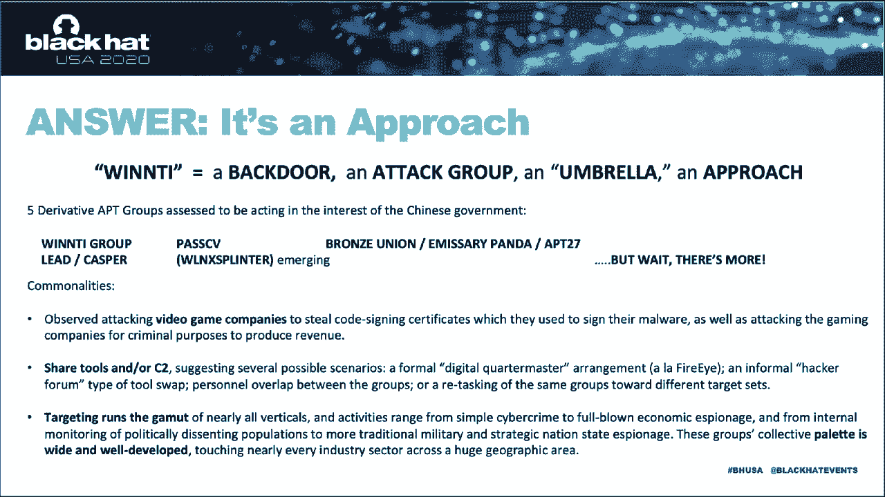

# 【转载】Black Hat USA 2020 会议视频 - P11：11 - Decade of the RATs – Custom Chinese Linux Rootkits for Everyone - 坤坤武特 - BV1g5411K7fe

 Thanks for joining me。

 This is Decade of the Rats， Custom Chinese Linux Rookits for Everyone。 I'm Kevin LaVellie。

 Director of Threat Intelligence at Blackberry。 Now I realize I'm dressed like a lawyer today and I've been told I look like a lawyer。

 but I'm not one。 So be sure to note the fine print here， written by actual lawyers。

 and understand that I'm， speaking for myself today， not my employer。 And before I go any further。

 I do want to say a few words of thanks。 First， to the Black Hat Review Board。

 thanks for inviting me to speak。 To the current leadership at Blackberry。

 thank you for the continued opportunity to do research， like this。 To Anthony Freed。

 thanks for getting it out the door。 To the past leaders of the research department at Silence。

 where I started， especially John， Miller， Ryan Smith， Tom Wabishevitz。

 and to Jeff Tang and the current members of the Applied， Research Team。

 thanks for your encouragement， your guidance， and your support。 Finally。

 to the person who conducted this research with me， but who wishes to remain， anonymous。

 research or acts， you deserve the largest measure of thanks。 One hell of a teammate。

 that's rather important given that threat and tell is a team effort。 Thanks， man。 You know。

 that team approach to security research is worth dwelling on here for a minute。

 Because no matter where I've gone in my career， I've found that a group that's comprised of。

 people who think differently conducts better investigations and gets better outcomes。

 That was certainly true of my time in New York City， where I supervise an investigative。

 squad at the nation's largest independent and civilian police oversight agency， a pursuit。

 that seems rather timely these days。 And investigative journalism is also a team effort。

 And prior to my time as Director of Threat Intelligence at Blackberry， I filled that role at 60。

 minutes。 Tip of the hat here to one of my former colleagues， freelance Director of Photography。

 Chris Albert， who's shooting this right now。 Thanks， brother。 Now， don't worry。

 This talk won't last 60 minutes。 It'll only be half as long。 And before that time is up。

 all of you watching at home should come away with an appreciation。

 for why all my time in journalism was spent behind the camera。 Okay， Chris， back up， man。

 Nobody wants to see that。 You know， Threat Intelligence and Investigative Journalism have more in common than perhaps。

 you realize。 And at the risk of falling into another talk track already。

 I'll simply point out three， important areas of overlap， because I think it might help us today。

 First， both are focused on finding hidden truths， emphasis on hidden。 Second。

 both only work when people pay attention to them。 That is。

 when they result in interesting narratives， ones that make sense of a web of。

 complex and arcane and often boring detail。 So， that's what I'm going to do now。

 I'm going to pose some key questions that motivated us and bring you along on the journey。

 we took to finding answers。 Now， spoiler alert， not every question has an answer。

 But instead of wasting your time explaining things you already know， like how root kits。

 and backdoors function， which I kind of think of as merely lifting the hood to gawk at an， engine。

 I'm going to try to impart something I find more valuable。 And no。

 it's not a list of IOCs for your threat until feed， though I can't help you。

 with that if that's what you're here for。 Instead。

 I hope to leave you with some concrete examples of how to think more critically about。

 how we do malware analysis。 And I'll try to show you how to spot your own cognitive bias while in the midst of your。

 research。 Briefly put， I'll show you examples of how to question your own findings and how to question。

 your own thinking。 Now， doing both of those things should help make the overall intelligence products that。

 we all create better and more meaningful。 All right， so let's begin with the first question。

 The reason we're all here。 That is， what exactly did we find？ Well， to begin with。

 we found a whole lot of Linux malware that's been sitting unnoticed， for a very long time。

 We started by doing something that I feel doesn't always happen in today's InfoSec community。

 that is too often focused solely on what's new and what's next。 That is， we look behind us。

 Imagine you're sitting down to check on some old APT activity and you turn up a new backdoor。

 that nobody's seen before。 And then imagine pulling on that thread and finding a rootkit and then。

 bam， a whole stack， of Linux malware。 And it's compiled dynamically and it's customizable to targets。

 And then later， imagine finding that this malware is being shared among a splinter cell。

 of five different groups that you've been tracking separately as distinct Chinese APTs。

 But when you look deeper， you find they're all really just derivatives of the original。

 WinNTI group， air quotes here。 Included in these five are vestiges of the original Kaspersky lab defined WinNTI group。

 such， as it is these days。 But also groups like Bronze Union。

 better known to some of you as APT27 or Emissary Panda， a group called Pass-CV。

 a group Microsoft calls lead in which we track as CASPER， and an emerging。

 group that we're tracking as Win Linux splinter。 Now， I'm going to return an untangle that messy。

 air quoted WinNTI attribution statement， a bit later。 But for now。

 let's get back to what was in the Linux tool set。 Alright， we essentially found six things。

 Number one， there was an installer script。 It took a few parameters as arguments and it was nicely compressed inside of another。

 script。 Now， this installer script interacted with a remote build server that was so easy to use。

 my seven-year-old can install this malware in a matter of minutes。 I just followed the prompts。

 answered a few simple questions， and voila， custom Chinese， rootkits for everyone。 The build server。

 item number two on this list， was to be more precise online only in some， cases。

 and others it was local to the target。 Either way though。

 the build server would custom compile the malware package for the， target on the fly。

 and then it would be downloaded to the victim。 It's as if attackers were showing off their best practices for CI/CD。

 you know， continuous， integration and continuous delivery。

 The custom delivery package consisted of a rootkit， a back door， complete with an installation。

 script for the target。 We're going to call those items three and four。 Then there was a bonus item。

 number five on the list， an attacker control panel capable。

 of managing both Windows and Linux targets simultaneously， which had its own graphical。

 user interface， another easy button for attackers。 You can see it here next to the list。

 And finally， there was item number six， a botnet， better known to the community as the Linux。

 XOR DDoS botnet of 2015 fame。 And yeah， I'm really saying that we believe WinNTI is responsible for the original Linux。

 XOR DDoS botnet， or on that later。 Now on the C2 side， we saw a lot of the usual WinNTI behavior。

 but with one or two distinctions， worth mentioning。 First。

 among the hard-coded network callback data， we saw some 10。ip's。 Some， not all。

 This suggested that there was at least some command and control infrastructure inside the。

 target organization。 Now， if you're a network defender and you wake up and see that。

 it's not going to be， a good day， right？ Not a welcome sign。 Indeed。

 it's highly likely that all the Linux malware that we found was not first-stage， malware。

 but rather a persistence tool。 A beachhead， if you would。

 And that the compromise of the targets ran much deeper and was much more well-established。

 What else would be fine？ We also saw extensive abuse of legitimate cloud provider infrastructure。

 This continues to be a really worrisome trend that we're tracking。

 One which dramatically complicates historical analysis most of the time。 Oh， and by the way。

 we didn't just find Linux malware。 You know， too often。

 I feel that security research is focused too narrowly on one thing。

 Researchers tend to tell us only about the malware on one platform that they find or。

 that they know exists。 And it's usually out of context。 I mean， geopolitical context， yeah。

 but also technical context。 If they'd only widen the lens。

 they'd see that state-backed attackers almost always， target multiple platforms。

 And that provides some key context。 This time， we found some of the same group of attackers in command of some Android malware。

 and others wielding some Windows malware。 I'll talk about both today。

 Though I won't say a ton about that malware here。 We did write a detailed white paper that I'll reference in the last slide that you can。

 go read if you want to know more。 All right， so back to the original question。 What did we find？

 Short answer。 We found an excellent vantage point on an entire malware suite and good evidence of a cross-platform。

 approach to espionage。 Okay， now on to the second question。

 Why is it that now in the year of the rat， we've only just uncovered these rats？

 The Linux versions of which have likely been out there for nearly a decade。 I mean。

 it's not like we don't know this kind of malware exists。

 Linux malware in the hands of government-backed groups has been written about before。

 Kaspersky Lab has documented its use by the Russian-Turlah， an American equation group。

 Among the Chinese groups， we've seen research on Leviathan or APT40， Axiom， DeepPanda， and， APT41。

 Now， there's some more messy， when-NTI-related attribution questions in there in that laundry， list。

 And if you read and believe intrusion truth， they've done some interesting work to try。

 to detangle it， but that's a tangent。 I don't want to digress。 I think it's recently as May。

 Our colleagues at Chronicle published some interesting research on APT41。

 That's another group we associate with when-NTI。 On their use of Linux malware。

 that even included info about an LKM rootkit。 And the write-ups are there。 Not in great numbers。

 but they exist。 The point here is that we should be watching for this kind of thing， no？

 And what about the explosion of AV vendors that we've seen develop in the last 10 years？

 If we were all in Vegas right now， we'd be steps away from the floor show， where most。

 of the companies in the EPP or EDR market would be carnival barking and luring you in。

 with swag so that you could show off the latest in their advanced fill-in-your-buzz words。

 here technology。 No one can claim there haven't been many bites at the apple。 So what gives？

 Let's consider some possibilities， which may in turn give us some insight into the attackers。

 in their strategy。 Now we use that word strategy here because our conclusion was that the targeting of these。

 Linux servers was strategic in nature。 Now first， I don't have to tell anybody in this audience why the always-on。

 always-available， nature of Linux makes it a great beachhead。 I mean。

 how often do you take off your web server or your database server？ How often do you take those down？

 Is it somewhere in the neighborhood of never？ I don't have to tell you that Linux runs servers constitute critical infrastructure within。

 the government agencies and businesses that make up modern society。

 Linux runs not just web servers and database servers， but also proxy servers， file servers。

 VPN servers， help stock exchange servers。 It's embedded in IoT。 It's embedded in network appliances。

 It's embedded in cars。 And I don't have to point out to this audience that Linux-run web servers are perfect for。

 hiding massive amounts of exfiltrated data or that attacking Linux jump boxes erases。

 a key layer of protection for an organization or that Linux database servers offer attackers。

 pretty much one-stop shopping for crown jewels material like passwords or trade secrets or。

 other intellectual property。 But think for a minute about the people who've never seen the inside of a rack room。

 What about the people who sign the paychecks or make the big decisions？

 How often does the word Linux enter their conversations？ Second。

 for those of us who've had the opportunity to work for vendors， tell me， how do your。

 EPP and EDR offerings for Linux compared to your offerings for Mac and Windows？ But of this way。

 how many Linux deals does your sales team close？ I'm willing to wager that in general security industry support of the myriad Linux distro。

 and kernel combinations pales in comparison to the support given to Windows。 It's just economics。

 But a consequence of that is that detection of Linux malware， particularly complicated。

 malware like we found， might turn out to be bad。 Third。

 for those Linux enthusiasts out there and I know you're out there， I think it's。

 fair to say that Linux is generally thought of or assumed to be more secure due in part。

 to its open source nature。 Fair enough。 But remember open SSL， heart lead？

 It was there too in front of millions of eyes and no one saw it。 In this case。

 I can tell you that analysts who study Chinese espionage more broadly say。

 that chapter one of the playbook is the exceptional exploitation of open source material。

 So it's not too hard to see how groups that we assessed to be engaged in espionage and。

 the interest of the Chinese government have taken full advantage of the fact that they。

 can create malware for an operating system whose source code is an open book。

 Now even if these three possible explanations for the low detection rate fail or fall apart。

 it remains one more explanation inherent to the malware itself。 That is。

 the whole stack revolves around custom kernel level rootkits。

 And rootkits of course are designed to be hard to detect。 Now I realize rootkits are old school。

 sort of a relic or a paradigm from an earlier， age of info sec。 Today。

 most attackers tend to just live off the land， right， or hide in the noise。

 And really effective tools are often just publicly available for APTs to use。

 And they do use them to devastating effect。 Thanks， pen testers。

 While other custom tools tend to last a year or two before they're burned。 However。

 here's where challenging your own way of thinking pays off。 If you think rootkits are old news。

 you won't build products to detect them。 And you won't expect to find them。

 And that impacts the way you do your analysis。 Keep in mind here what ought to be another maxim of info sec。

 Everything old eventually becomes new again。 Are you convincing？ Think about macros。

 Just from reading public security research， I can tell you that they used to be a big deal。

 then they went away and now they're back again。 Email attachments。 Huge problem。 And not so much。

 Now it's a thorn in everyone's side again。 Same with rootkits。

 Perhaps reading these research papers， you thought they went out of style。

 But when they're running on the kernel side of multiple Linux distro kernel combinations。

 they're going to work。 Whether it's the year of the rat or the year of the dragon。

 They've got survival skills even bare grillets with envy。 All right。

 so let's take a closer look at them。 We found two variants， both of them LKMs。

 designed to work with an associated back door。 We saw them tailored for kernel versions 2 and 3。

 but with up to date C2。 So we knew they were still in use。 This older kernel version targeting。

 by the way， is likely a reflection of the fact that。

 many Linux sysadmins are just slow to update for various reasons。

 We found examples of malware that targeted red hat enterprise， sent OS， Ubuntu， and Debian。

 But it's a good bet， given their custom nature and on-the-fly compilation， that there are。

 others out there。 Who knows？ Maybe some of you have found them or can help uncover some more。

 VT scoring on them at the time of discovery was at or near zero。

 The first one we found looked like it had code lifted right out of somebody's book。 Namely。

 Ivan Skylarov's programming Linux hacker tools uncovered。 Sorry， Ivan。

 While the second rootkit we found looked like it was just a modified version of the open。

 source Suduru-su rootkit。 More plagiarism。 I mean， open source exploitation。 Now， as I said earlier。

 the rootkit was installed via a bash script。 We found it inside another shell script while looking at backdoor callback data。

 The script communicated to one of two servers depending on whether the target had a 32-bit。

 or a 64-bit CPU architecture。 The script prompted the attacker for a user name， a build。

 and something called force mode， option。 It checked to see if malware already existed for the target distro kernel version。

 Force mode would force the build server to ignore an existing build for a given kernel。

 if one existed and rebuild the rootkit。 You'll notice here that it calls itself Lancer version 2。

 We never found version 1， or version 3 or anything later。 Now。

 here you're looking at the path names in the various build environments that we found。

 The first three you see here， we're all reaching out to a remote server。

 And they delivered the rootkit not just by MD5 hash， but by user name as well。 And hey。

 check out those user names。 I like to stop and give a shout out here to Yang and Malmau and Hehe。

 I'm sorry we interrupted your work， though I'm sure we didn't set you back for too long。

 You had a good run anyway。 Each of these users had a customized environment configured that would use his or her predefined。

 C2 servers while compiling and delivering the backdoor package。 Okay。

 now these pathways you're looking at here all pertain to build environments that。

 were local on the target already。 Don't ask me how they got there。 I don't know。

 But they delivered the same result。 Custom rootkit and backdoor for each target。 Now。

 you want to find even more of this splinter cells' handy work beyond what I'm presenting， today？

 Here's something you won't read about on our white paper。

 The build server provided another really interesting nugget。 While down on those weeds。

 we realized that the domain names contained in the installation。

 script both had the number 3389 in them， as you see here。

 And that rang a bell because it was very similar to another historic pass-c-v domain with the。

 same number in it， namely 3389。hk。 Using that， we were then able to identify new hosts using similar subdomains。

 which resolved， to these IP addresses here。 Today， both used a relatively unique HTTP server。

 Bigo Server 1。6。0。 Now， at the time we put all this together。

 there are only like 20 servers on the internet， running the same software。 Okay。

 happy hunting everybody。 Now， what all this demonstrates is that the attackers， and remember。

 there were multiple， APT groups involved here。 The attackers took a lot of time to set this up。

 establish a foothold on the target， devise， a way to quickly compile sophisticated malware for multiple combinations of Linux distributions。

 and kernel versions， and then readily install them。 That's a lot of love， and attention。

 and development， and time， and testing， and refinement。

 and overall effort required to keep it all going。 And on top of that， you know。

 you got taking care of the kids and grocery shopping and， walking the dog and COVID-19 to deal with。

 Now， earlier， I mentioned something about a botnet and promised to answer what is now。

 our third motivating question。 Is WinNTI responsible for the creation of the largest known Linux DDoS botnet？

 Well， the short answer is yes。 And by that， I mean。

 we judged that the original botnet was developed by WinNTI group。

 Now these are intelligence assessments， okay？ Not edicts carved in stone。 Nevertheless。

 our confidence level is high。 So， how do we make that connection？ And what does it tell us？ Again。

 let's start by looking back。 As a reminder， Linux X or DDoS was discovered， I believe。

 by malware must die in 2014。 Akamai wrote a lot about it and told us about a tie-band with attacks。

 which ranged up to， like 150 gigs per second。 Notably。

 they said that the botnet spread by using brute force SHH attacks to get creds， for target servers。

 Yeah， apparently that still works。 I guess nobody likes exponential back off or fail to ban or just changing port 22。

 Anyway， here's another example of something old becoming new again。 Now。

 Akamai said that they saw about 20 targets hit each day。 This is back in 2015。

 20 targets hit each day with the overwhelming majority， like more than 90% in Asia。

 And at the top of the list， we're video game companies。 Now， that sounds like WinNTI right there。

 doesn't it？ If you remember， the 2013 seminal Kaspersky Lab report on WinNTI Group was called "more。

 than just a game，" because it drew a connection from the group's infamous criminal targeting。

 of video game companies to their espionage activities and other verticals。 Now。

 the 5-AP2 groups that we were tracking also engaged in both historical and active。

 targeting of video game companies。 But were there more concrete connections？ Regan is yes。

 When we discovered our first backdoor， we noticed that it used a certain device for。

 rootkit functionality。 The botnet used the exact same device with the exact same name。 Next。

 we noticed that early samples of the backdoor that we found used a particular string。

 as an XOR key to obfuscate network traffic。 The botnet used the exact same string for the exact same purpose。

 Then， we noticed that both the rootkit that came with the backdoor and the botnet were。

 based on pretty much the same modifications of the open source， Suda Rousa Rootkit。

 In a write-up I have asked on the botnet's rootkit， they pointed out that for the kernel。

 modules to work， its vermagic value needed to match the kernel version on the target。

 In other words， the malware would not work unless the kernel versions and the kernel modules。

 matched， just like we saw with the rootkits we found。

 And when we looked at the way that the botnet interacted with its build server， we saw very。

 familiar interactive prompts， username， kernel version， and so on， as you can see here。

 So given the age of the botnet， the code reuse， the XOR key overlap， the same customization。

 and similar interaction with the build environment， not to mention the same targeting， all that。

 led us to assess that the botnet was likely created by the same group。 But what did they do with it？

 I mean， how useful is that for espionage？ Strangely。

 what we didn't see when looking into all of this and combing through the flurry。

 of coverage about this botnet was really much indication that anyone had actually been knocked。

 offline or denied service。 Now， I mean， I'm sure it happened， but it wasn't grabbing headlines。

 not at least as， far as I could see， and not in a way that you might expect given how much firepower this。

 thing had at the time。 So that begs another question。

 why build a DDoS botnet if you don't use it to DDoS？ Well。

 here's one of those places where the trail of evidence that we can point to goes。

 cold and we can only speculate。 Was our collective perception of the botnet as a denial of service tool reflective of。

 reality？ Was it there to disrupt video game companies for some reason？

 Or can botnets be used as a tool of espionage if only to deliberately misdirect forensic。

 analysis and research？ Was it perhaps just a means of quickly and efficiently gaining a foothold to collect。

 code signing certificates？ Or could it have been used to gain access to the primary espionage target servers and。

 install the root cuts we found？ Perhaps the answer to all these questions is yes。

 Wouldn't that be something？ Kind of makes you wonder what other aspects of malware analysis may be subject to the same。

 narrow thinking。 Take for example， the use of mobile malware by state or state-backed groups more generally。

 Now， in previous research， we've shown that groups acting in the interest of governments。

 have been integrating mobile malware into their espionage campaigns for a decade or more。

 This is another area where attackers have enjoyed a huge jump on the security industry's。

 response by the way， given that EPP and EDR capabilities for mobile phones are still in。

 their infancy。 And again， while public-facing research about mobile malware is certainly there。

 in my opinion， has been scattershot at best and maladroit at worst。

 And what I mean by that is that it's almost never put in the context of campaigns that。

 integrate other forms of malware on other platforms。

 So as a result of our collective narrow focus and poor AV coverage， APT groups have been。

 able to exploit the mobile space with pretty much near impunity for quite some time。 All right。

 let's get back to it。 Let me follow my own advice now and widen the lens。

 The interesting questions that motivated us during our research didn't just arise in analyzing。

 Linux malware。 They came up elsewhere， too。 And the most intriguing question to arise on our examination of the Android malware was。

 this one。 Is a Chinese APT group behind the development of one of the most widely used commercially。

 available rats？ Let's see if we can find out。 All right。

 taking one of the Linux splinter cell members， a group blue coat first named， PassCV。

 about which we published some previous research。 We followed a C2 trail and found some domain crossover。

 which led to our sample， a file， that had the string wave dancer in it。 And as we took it apart。

 it looked like it might just be a test。 The giveaway was it had strings in it that said test。

 And it hadn't been touched in like five years。 Now， parsing some XML strings coughed up some C2。

 which led to dual domain， which led， to a domain that was registered by the same email address as it had been used and lots。

 of other PassCV work we had been following。 So we could tie the sample that we had found with confidence to a Win NCI group。

 But it was the guts of this malware that turned up something that we didn't expect。

 After decompiling the code of the implant， we saw structural layouts and huge swaths。

 of code that appeared to match identically with the Android version of a tool called Netwire。 Now。

 systems administrators and pen testers will know Netwire as a multi-platform commercial。

 off-the-shelf rat you can license from a company called World Wired Labs for lots of， purposes。

 including， quote， "even monitoring your children at home，" as they helpfully。

 tell us on their website。 Probably not a great selling point during the COVID-19 lockdown， though。

 Anyway， many of you watching will also recognize Netwire as yet another one of the publicly。

 available remote support tools that have been picked up and co-opted by criminals and government。

 back groups to steal and to spy。 Now， of course， that is not World Wired Labs fault， right？

 Tools don't hack targets people。 People hack targets。 Given all that， at first we thought， "Hey。

 what's the big deal？"， You know， A。B。T。 groups use and abuse publicly available tools like this all the time。

 right？ PassCV probably just picked it up and put it into rotation， right？ Well。

 here's where things got a little strange。 Look at this timeline。

 The last modified date on the PassCV implant was June 16， 2015。

 But the first public announcement by World Wired Labs， about forthcoming support for。

 the Android OS， was made on January 2， 2017。 That's nearly 18 months after PassCV's implant was last modified。

 A second Netwire announcement was made in March of that year， indicating the Android release。

 was going to be delayed。 And finally， Netwire version 1。7A was released on March 23 of 2017。

 marking the first public， release of the Android host。

 That's nearly two years after the PassCV malware was created。 So how do you explain that？

 Is a Chinese espionage group behind the Netwire tool？ Well， the truth is， we just don't know。

 I mean， I can think of more than half a dozen possible explanations for this， but I'm not。

 going to subject you to that here。 Now， rest assured。

 we did try to find similar samples to help clear it up。 We tried hard， but we came up empty-handed。

 Why is that？ Well， maybe the PassCV implant was highly targeted。

 Maybe it was really just a test that leaked。 Or maybe PassCV abandoned the implants for some reason。

 Or maybe Google did a bang-up job of keeping it out of the Play Store。

 Or maybe we just don't detect it， or didn't anyway， in 2015。

 If any of you have seen samples that fit the description， I'd love to know。 Please reach out。

 Now we could go on like this posing and answering questions about the last leg of our research。

 the Windows malware。 But there's going to be plenty of Windows malware discussed in other sessions probably。

 right？ And I want to use the rest of our time here wisely。 So let me just highlight one thing。

 And that is， we saw a notable shift from the typical win-NTI behavior with these droppers。

 that we found。 These of win-NTI know that one of their hallmarks is the use of code-signing certificates stolen。

 from video game companies。 Here we saw that with all the groups who tracked。

 but they now also included certs taken from， adware companies。 Why would they do that？

 Because adware is boring。 An alert fatigue is real。

 Win-NTI is betting correctly that network defenders and security researchers who find。

 their adware will put it at the bottom of their risk of priorities or ignore it altogether。 I mean。

 the fact that this small change， okay， there was a new packer there too， right？

 But this small change helped put some 20-year-old rats that we should all know about and stop。

 like Ghost Rat， past the majority of AVs when we ran them。 I think the graphic here will show eight。

 That tells you just how deeply ingrained that cognitive bias has become。 All right， let's move on。

 Throughout this talk， I've said that the activity that we tracked was the work of five separate。

 groups that derived from the original win-NTI group。 And I put win-NTI in air quotes。

 Why did I do that？ And when you encounter win-NTI in the press or in research。

 how should you understand it？ What does that name even mean？

 And what does this research tell us about that threat actor？

 My opinion is that win-NTI has come to represent more of an approach rather than a moniker。

 for any single crew， right？ It was a back door， then it was a group， then it was an umbrella。

 Now it's an approach。 My view is that it represents a way in which a group of what are probably civilian contractors。

 is assembled， tools are shared， and targets are split up。

 Now the tools and infrastructure favored by each cell or group differs， but sharing is。

 happening to a greater or lesser extent。 So for example， with the Linux malware。

 it was the tools that were shared。 But with the Android malware。

 it was the infrastructure that was shared。

 In general， all this sharing suggests either that the contractor community in China regards。

 sharing favorably and tolerates it openly， unlike elsewhere， or that members travel between。

 shops over time or groups of them break off to form new ones or both。

 Now it's also possible that the government， which we assess to be their likely customer。

 provides something in the way of support， perhaps giving out tools in some formal fashion。

 There I wrote about this concept and called it a digital quartermaster。 It's possible here。

 but I think it's the least likely scenario。 The use of stolen code signing certificates typically from video game companies。

 but as， we've just pointed out today， also now from adware companies， is probably the easiest。

 common denominator to identify across these groups。 But there's more to it than that。

 Kaspersky researchers really did well to illuminate the common criminal ancestry of the original。

 WEN-NTI group for us in their seminal report。 That financially driven criminal approach is really worth pausing and thinking about。

 because it tends to run counter to the type of behavior we normally associate with government。

 back groups engaged in traditional espionage with the North Korean groups sort of a notable。

 exception。 In this case， the criminal approach has colored the original group's descendants all these。

 years later， particularly in their wide and voluminous targeting。 From a distance。

 it looks like spray and pray。 But as I've demonstrated。

 it's almost always done with much more strategic intent。

 Now pretty much all the groups that I mentioned today， past CV， WEN-NTI group， LED， CASPER。

 Bronze Union， they've all been discussed in other public security research。

 Whether these groups were actively collaborating， casually sharing， comprised of some of the。

 same members， or in actuality， we're just smaller parts of some larger group， it's beyond。

 our means of analysis。 We're not a government。 But one thing is clear。

 this isn't a single crew with a one-trick pony。 We are looking at a long-standing， well-thought-out。

 richly-resourced intelligence collection operation。

 with a sizable software engineering team to build and maintain all these tools。

 WEN-NTI then is really a way to combine a team that collects code-signing certificates。

 and a team that puts malware on the target and a team that creates and manages the build。

 environments and a team that works up the mobile malware in targeting and a dev team。

 for Linux and a dev team for Windows and another for Android and you've got to believe。

 another for iOS。 All that is behind the air-quoted WEN-NTI threat actor。 Okay。

 I'm afraid we've arrived at the end of our time together。 Hopefully。

 you've come away with some understanding as to why the old story of Chinese espionage， and IP theft。

 which everybody practically knows by heart by now and is sick of hearing， about。

 is still surprising us with new chapters。 Hopefully。

 you've learned that WEN-NTI isn't more than just a game as Kaspersky Lab taught。

 us all those years ago， it's now more than just a name。

 Also you've seen that even from a handful of L files， we can infer a strategic approach。 Hopefully。

 I've demonstrated that rigid thinking inevitably leads to rigid malware analysis。

 and inaccurate conclusions。 In one story I worked on at 60 minutes near the end of my time there。

 I got to know a， former treasury official who taught me a lot about the loopholes in our collective financial。

 transparency and anti-money laundering efforts。 Just later。

 after some investigative reporting shed light on some outrageous and surprising， behavior。

 he'd come back to me and say， "Yeah， Kevin， but just think。

 If we could just turn on all the lights just for a second， imagine what we'd see。"。

 I think that's really relevant here。 We flick the lights on for a second with this malware analysis。

 but it leaves us to consider， perhaps the most important and motivating question of all。

 What are we not seeing？ Thanks for your time and your attention。 I welcome your questions。

 [BLANK_AUDIO]。