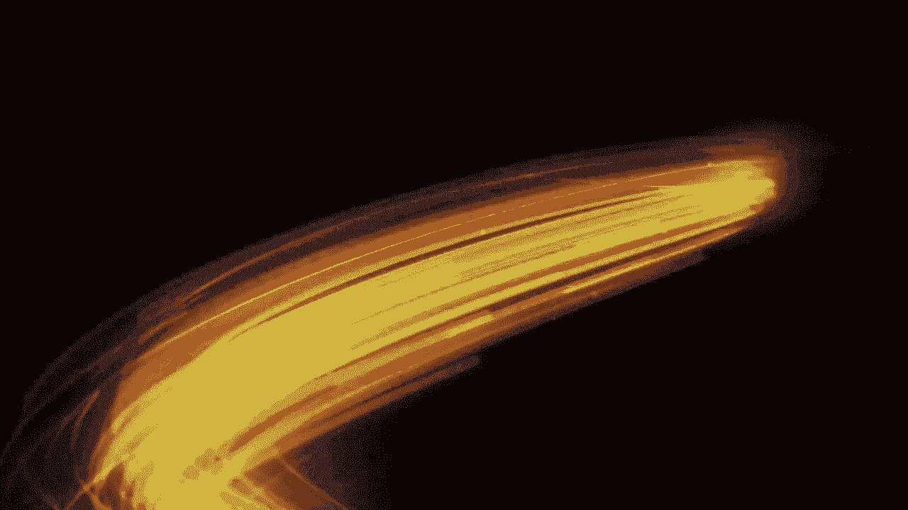
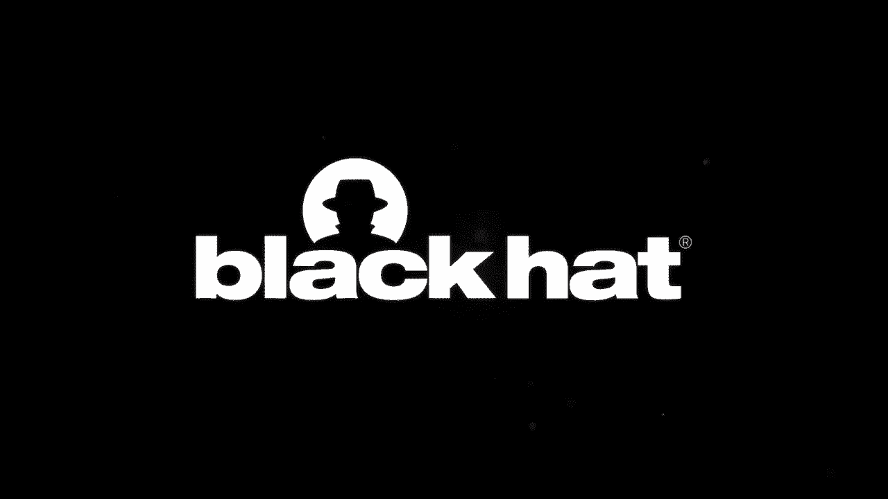
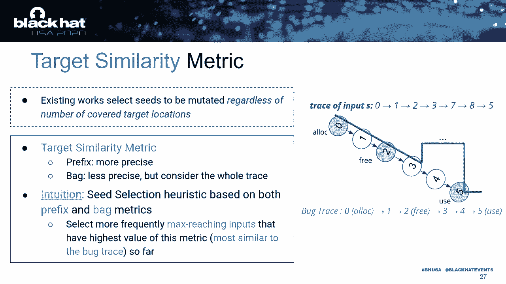

# 【转载】Black Hat USA 2020 会议视频 - P12：12 - About Directed Fuzzing and Use-After-Free - How to Find Complex & Silent Bu - 坤坤武特 - BV1g5411K7fe

 Hi everyone， this is Sebastian Barda and Mandugan Bienn from Séralist and University Gonna Blalp。

 France。 We are going to talk to you today about directed phasing and use after free books。

 This is trying to work with our colleagues， Richard O'Mell and Roland Hors。

 So what's the talk about？ Phasing has been proven to be great for finding vulnerabilities in the world。

 Today we will focus on directed phasing， a slightly different setting where the goal。

 is to reach a specific cut target with application， for example， to patch-oriented testing。

 The problem we want to address is that current phasing techniques are very bad for some。

 class of complex vulnerabilities。 Here， use after free。 And fortunately。

 the incentive can be critical。 So we propose a directed phasing approach tailored to use after free books and we'll。

 show some application to patch-oriented testing。 So first of all， what is a use after free？

 It's an error that OKO with some memory has been allocated， then free。

 Then it is still access after its lifetime for a dangling pointer。

 So there are also three points here。 First it is critical。 It can lead to data corruption。

 information leak， the neural service attack and so on。 Second。

 there are more and more of them in the world。 Maybe a reason is that currently before the flu and so on are well protected and well mitigated。

 and many tools exist to try to remove them in advance。

 After use after free are still hard to mitigate and hard to find。 Last point。

 it's quite a complex vulnerability actually。 If you think of a standard before the flu。

 you just need at some point to go out of bounds， where in that case you have some kind of finite state automaton like we see in the right corner。

 that you must fulfill before activating the issue。 So as a teaser， here is a small example。

 You don't really need to know what this cut time does exactly。

 The point is there is a use after free in it。 If you go through the allocation。

 then the free and then the use。 Now if you take IFL on this small code。

 actually IFL QMU to go on binary， within 6 hours， it， cannot find it。 If you take IFL go。

 direct it further， which will work on source and with an adequate， trust target。 Again。

 within 6 hours it will not find the use after free bug。 With our technique called UFS。

 within 20 minutes we are indeed able to find this use after， free bug。 So first of all。

 a bit of context。 So as most of you probably know。

 phasing is very popular for finding code level flows。 It has found many， many， many bugs。

 It is used by many security people and security teams and many big companies are involved。

 Microsoft， Google， Apple， whatever you want mostly。

 Actually phasing has come from quite a long time now。 First it means mostly random testing。

 which is called now black box phasing and it consists， in generating massive amount of input data。

 feed them to the program and the test and see， if it's crashed or not。 Okay。

 it was very simple but it turns out to be very effective。

 But along the years it had made a huge progress so now they are free-shared of phasing。

 So there is still this black box approach to phasing。

 There is also something called white box phasing which use lots of advanced program analysis。

 techniques to find bugs but which has problems with scalability。

 And there is gray box phasing which try to take the best of both sides， scalability from。

 black box approach and cleverness from white box approach。 And actually。

 IFL was probably the first gray box phaser。 It was a very pioneering and inspiring rock and it has been very。

 very successful and now， this is a very active research area with more and more new ideas to move the sweet spot and。

 add more and more intelligence in the tool without any scalability penalty。 So from。

 I'll give you just a little test of what phasing is。 So basically you have a set of input。

 You need a way， some heuristic to choose a good input to select which are the best one。

 So for example， those input which activate new part of the code for example。

 Then you will create lots of new input from them from mutation。

 So input which looks pretty similar to the initial good input but a bit different。

 And then you will simply run them whole against the code and the test。

 So you have a big difference between black box phasing and gray box phasing。

 In black box you cannot observe a lot， especially mostly only the output。

 In gray box you can observe the coverage information。 Obviously phasing is not a silly thing。

 So you can observe the coverage information。 So you can observe the coverage information。

 Obviously phasing is not a silver bullet。 So it can have a hard time covering very complex condition or。

 going very deep inside the code。 It has a hard time with complex bugs like choose after free。

 We will discuss that after。 And it also， it might have a hard time to do some target or。

 guarantee testing where the goal is to cover some specific part of the code。

 So regarding this last point， recently a new level of phasing as a merge directed phasing。

 that precisely aims at taking this problem。 So you take an additional input which is a target。

 a level trace or， cut trace or cut location。 And what you want is to find an input which will cover this trace。

 So ever cover the trace or reach for location。 So it has interesting application in security such as bug reproduction。

 So typically you have some partial information report on a bug but you don't have input。

 the triggering input。 So with directed phasing you can try to find the triggering input for this bug report。

 Patch or long-term testing where you will try to direct your testing towards some specific。

 part of the code typically a patch。 And for example confirmation of static analysis report to see if you are。

 very positive for salam or real problems。 The very first directed grab box。

 directed grab box phaser was Eiffel Gue in 2017。 So this line of research is kind of new。

 So from a more technical point of view actually coverage guided grab box phasing。

 so standard grab box phasing and directed grab box phasing are not that different。

 So this is a high level view of coverage guiding grab box phasing。

 So first you have some instrumentation step where you will add to record all the information。

 you need to record typically coverage information。

 Then you have the phasing loop by itself with seed selection mutation。

 Also you can give some power schedule to which is time budget to see it according to。

 their score with a good seed having better score and so on。

 Then you need also a way which is called here 3H to distinguish between bugs and not bugs。

 So for overflow it's pretty simple actually。 When it crash then you have a bug。

 You can miss a few before overflow but most of the time it will be okay。

 For something like use after free it will be much more complicated。

 So now if we look at directed grab box phasing it's mostly the same。

 So you have an additional input which is a target and one additional component which is the seed distance。

 Meaning the distance between an input， the execution of an input and the target you want to reach。

 Once you have that then basically follow the same architecture except that typically some part of the architecture will take the distance into information into a code for example the power schedule。

 So now coming back to use after free as we saw before there are more and more of them。

 Yet actually further do not find a lot of them。 There are deep reasons for that。

 There are too many difficulties for ending use after free bugs with further。

 The first one is that there are very strong temporal and special constraints for these kind of bugs。

 They are very very complicated because you have this temporal constraint you need to find an event。

 a sequence of event。 So the allocation， the deallocation and the use in this specific order。

 And there are also some special constraints because all these events must relate to the same memory cell。

 And here already fuzzing has already already a time compared to before the flow where typically you just need to reach one point in the code with big enough arguments。

 The second point which is out for fuzzing is that usually for you use after free you don't have any crash。

 So it's kind of a silent bug。 So what people will do if they want to find use after free with fuzzing is to equip fuzzer with a sanitizer like fine grind。

 And so to run it to run sanitize execution。 But there is a big runtime of a red with that and this is a problem actually because fuzzing is good because it is able to create a very huge amount of input。

 So if you have run time of a red you will run much less input and you will be less effective。

 So this is a big problem too。 So actually it happens that both fuzzing and directed fuzzing have a very hard time in practice on use after free。

 So recall of tiny motivating example。 So now that I have set up the stage Mandug will explain a technique for use after free directed fuzzing。

 Thanks for watching。 I will present you a fast related fuzzer for use after free bugs and then there was some conclusion。

 Before discussing our techniques so we first revise the workflow of the related fuzzer and sold a limitation in finding use after free。

 This thing with the fuzzer are least unguided so however the instrumentation phase at shock level is costly。

 It's around several hours for complex programs and it cannot differentiate the differences between two inputs covering the same set of basic blocks but in different order。

 This thing we were putting just as is equally however given the setup pre-defined target。

 the likelihood of as destination being reachable to targets are different。

 Consequently in some cases they might worth if at a sprawling non vulnerable code or infeasible part leading to specified target。

 Also previous work don't take into account the other rings of cover basic block when selecting inputs for mutation。

 They might skip input that already cover in sequence several target basic block。

 Next as UAF box fails silently we need to choose on input produced by the fuzzer to find the pro concept input such as last amount of unreachable input with lot of time in the stylizer by choose a percent。

 To address the limitations discussed above so we propose UAF as a rigid fuzzer dedicated to use after free both by carefully tuning the key component of rigid fuzzing to meet specific characteristic of this type。

 Over on UAF has a similar workflow as rigid fuzzer and we add our improvement height in orange along the whole fuzzing concept。

 First the static pre-computation of UAF is fast at binary level。

 Second we introduce new input metric to guide the fuzzer to work target at runtime。

 Finally we choose only potential input covering on targets in the expected choice and pre-filter for free input that are less likely to trigger the block。

 Over on we select input for mutation based on similarities and other rings of input choice compared to the expected choice。

 We assess the likelihood of an input based on three metric dedicated to UAF at different levels of granities。

 For instance cones， edges and basic block。 So the more fiber and metric the more precise the analysis is in terms of identifying interesting input that are likely covers the expected choice。

 So in the next slide we will detail our input metric。

 And we focus on buck re-brossing and pass testing application。

 So it's more likely we have a complete stack choice of ordinary rigid UAF event。

 So in this case unlike existing zero related F-pros we need to take into account the relationship amount target to improve relatedness。

 So to facilitate our fuzzer analysis we must own stack choice as shown in the figure on the left hand side to recreate a dynamic calling tree。

 Then perform a pre-order chopper saw of the tree to generate a buck choice and target target。

 So we make sure that the children are according to the other rings of the UAF event after the flattening process。

 Previous distance do not account for any other amount of target location。

 Why is it essential for UAF？ So we address this issue by actually modifying the distance between function in the congruent to favor part。

 That sequentially goes through the tree UAF event。 I love free and use of the buck train。

 This done by decreasing the width of the aspect in the congruent that are likely to be between the events using live web static energies。

 So our distance based technique therefore consider both calling a reason in zero。

 In some cases where the calling can appear several times at different locations in the color and the calling reason covering UAF event in sequence。

 As existing worktoot as is equally in terms of reaching sequence targets we propose a live web cut as covered matrix by measuring progress at level。

 But on the critical disease not only。 First we statically identify a car ash whose destination are more likely to reach the neck target in the buck train。

 As shown in the figure it's lightweight because we only perform static in sharp or zero analysis of console program。

 At runtime UAF has favor input exercising more cut ash by a score depending on the number of cut ash and the heat count。

 The sequiners are via target similar metric。 Concretely assess how many targets sit execution to a cover at runtime and also take all rings of the target into account。

 We combine both pre-fit and back option and pre-fit option is more precise because it counts value until the first live version in the buck train。

 And the back option also provides more information about the whole train。

 Then we use this metric for this selection by actually selecting more frequently input that are most similar to the target buck train。

 The overall UAF are prioritized or size more in easy to input in the following cases。

 First we put a closer to the buck train via our list metric。

 Second we put a more similar to the expected train via our target similarity metric。

 Finally input that make matter this season at critical code function via our cut ash with metric。

 In the chosen process UAF are chosen only potential input we cover in sequin on target location in the buck train。

 So we obtain this kind of information for free via our target similarity metric。

 For implementation we view our two UAFs on top of the popular FAF in QMU mode。

 We use IDAPPRO to get the control program of the tested binaries and we also aim to support more open stroke binary list assembler like Radach。

 And then we deploy block in blocking of the binary analysis framework means set for static computation。

 Finally we use the profiling tool like one grant in the chosen process。

 For evaluation we evaluate our app cost in two applications。

 For buck reports we compare our two with state of the art covered and with the fuzz on 13 UAFs of real programs。

 As F and Goh is a suitable by fuzz and Hawkeye is not viable so we implement the call technique on our framework。

 Also we use time to exposure number of buck file overhead and number of chosen input as comparison metric。

 You can see in the figures UAFs outperforms state of the art fuzz in terms of buck reprofusion with high confidence level。

 First of all you have a file two times faster and 34% more buck than the second best fuzzer。

 UAFs also enjoy buck live with in two-and-a-cent times。

 for example 15 times faster than the stroke by F and Goh。

 And a minimal runtime overhead compared to the F and Goh QMU。

 UAF reduce a lag portion of choosing input around 90% and span only second in post processing phase。

 Another practical application of the fuzzing is fast testing so the goal is to file incomplete patch or regression box。

 Also by exploring around the previously vulnerable code we could file new box。

 So how do we do first we identify recently this cover UAF box of open stroke problems。

 As the code has evolved in some cases we need to manually extract cone introcion in the buck trace and use them as target to guides UAFs。

 So actually we found found 30 new box and four of them are incomplete UAF book fix in critical programs and got 7 CVs。

 This table details our fighting。 For example we found incomplete fix of G new pass by using the buck trace of existing double free。

 So to summarize what we ran over in this talk we proposed a re-defusing framework to detect UAFs free box at binary level。

 And we saw its effectiveness and efficiency in buck re-person and path testing application。

 So far we take away power of our talk。 So first we did fuzzing is practical and simply integrated into the software deployment process。

 Second we sought to develop vulnerable with this oriented fuzzer to effectively detect complex buck。

 And third pass already fuzzing is bigger than the bus testing。

 And finally we sought to find and fix variants of buck glass。

 Thank you for your attention and be checking out our paper and our tool。

 So we happy to take any question。 I give room in the internet connection。

 So if you have any question we'll be happy to answer it。 Okay。 So yes there is a GitHub repo。

 Actually I think it's your last slide。 So there is a GitHub repo on the slide you will have the address。

 Okay。 Okay。 So a lot of questions coming。 So we have a GitHub， so we have a GitHub。

 so the main idea is to realize that usual directed fuzzer。 So we have a GitHub repo on the slide。

 So we have a GitHub repo on the slide。 So we have a GitHub repo on the slide。

 So we have a GitHub repo on the slide。 And it's why it works better。 Question。

 So what kind of program did we test again？ This is probably more for Mando。

 But at the end of the slides， you will have， a table with a different vulnerability we found and so on。

 Basically we have two kinds of experiments。 On the one experiment we compare with other directed fuzzer。

 but we are not tailored to use after free。 So we take the benchmark。 So I don't really remember。

 We check user of free bugs on some programs。 So we take patch version and see if we can find bugs in this patch version。

 So in this case we have programs like a new patch per five， new PDF， stuff like that。

 We have also a technical report on the web where there is also some address in the slide and there are much more detail on that。

 Okay， so there is a white paper。 Actually there is even an academic paper which has been accepted to read。

 This is an academic conference。 So the paper will appear I guess on September and I think there will be a technical paper before that on my webpage and on the webpage of Mandoong really soon。

 We have a camera already version。 So we have all the details about the programs， experiments。

 data and so on。 Oh， perfect。 So how we send I will let Mandoong answer for this question because actually I'm not sure if the man a programmer and designer of a tool。

 Actually I would say regarding the background and this Mandoong sort of thing but I would say that it can't。

 The thing is from the background， the thing we take is really what we really need is about the kind of back trace。

 the kind of format。 So that's not a very big big problem。 [silence]， Any other question？ Okay。

 so I let you do let's a 10 second for last question otherwise we stop。 Okay， thank you guys。

 That was a really really interesting。 Hope you enjoyed it and see you next time。 Bye。

