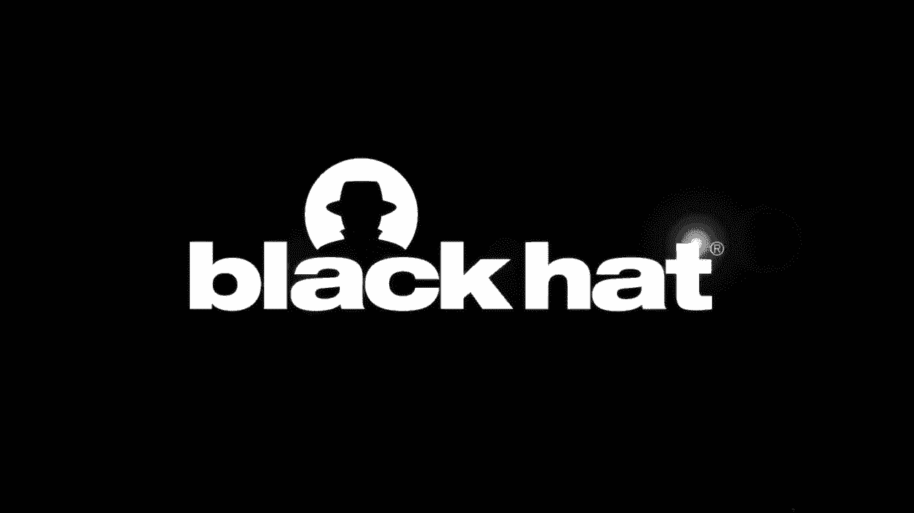
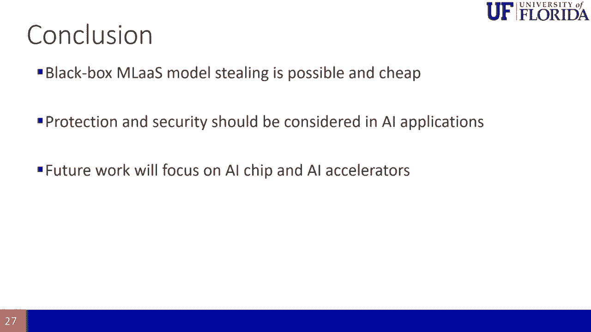
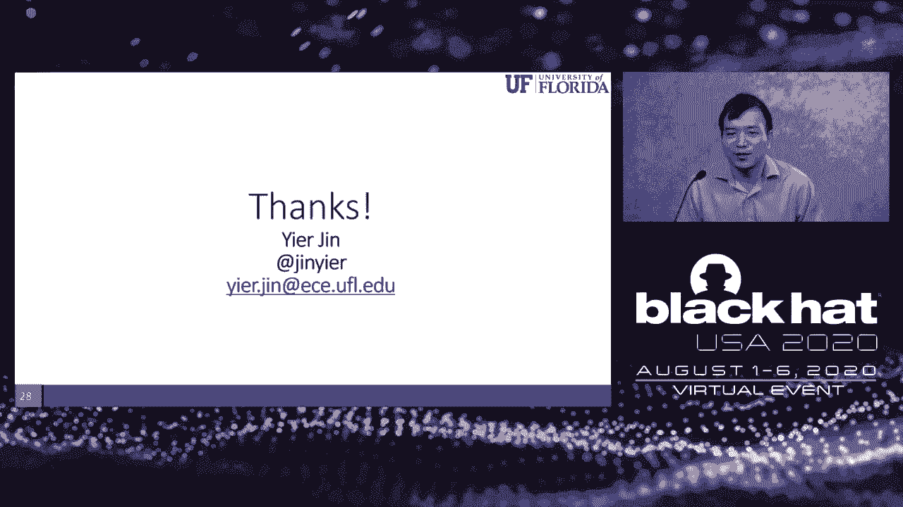

# 【转载】Black Hat USA 2020 会议视频 - P13：13 - CloudLeak - DNN Model Extractions from Commercial MLaaS Platforms - 坤坤武特 - BV1g5411K7fe

 [MUSIC]。

 Hello everyone。 Thanks for attending my talk。 I know it's a remote presentation。

 but I hope you can still get the key idea of our work。 So the talk title is the Cloud League。

 DNN model extraction from commercial MLAS platform。 So the presentation should be provided by me。

 my students Hong Kong and my collaborator， Zong Yi Ho。

 but due to all the technical issue and the recent situation。

 I will be the person who give the main presentation。 So first myself， I'm Eir Jin。

 an associate professor and an IoT team professor at the University of Florida。

 So I think you know a lot of hackers。 You may not be that familiar to professors。

 so I list my research interests。 I'm also using this opportunity to recruit students if you want to do PhD or master。

 in this area， cyber security area。 We are also interested in IoT and CPS security。

 as well as hardware security。 My collaborator， Zong Yi Ho。

 he is a professor in the Department of Computer Science in， National Chinghua University in Taiwan。

 So he is also the program director of Taiwan's Ministry of Science of Technology's AI Innovation Program。

 That's why we are working on AI。 Luckily， our collaboration tends out to be very productive。

 So I hope we will continue this collaboration。 The third speaker is Hong Kong Yi。

 I will let him introduce himself。 Good morning， welcome to my talk。

 My name is Hong Kong Yi and I am currently a visiting PhD student working with Dr。 Eir Jin。

 My main focus is on the machine learning security and besides。

 I also do some research such as on the impact system security。

 IoT security and machine learning computing system design。 Today。

 I'm going to talk about the advisory example based model stealing attack。 And now， my advisor， Dr。

 Eir Jin will give you the full talk。 Okay， so these are all the speakers。

 So let me quickly give you an outline of what we will discuss。

 So I assume that many of you already know AI and AI security are the virtual example， for example。

 So that's why I will quickly go over this background and then I will introduce you。

 how the model extraction attack can be applied to those commercial platforms。 In Microsoft。

 in Face++， in IBM， in Google， in clarify all these platforms。

 So we will also discuss the potential defense。 So first。

 deep neural network has been quite popular these days。 And it's become deeper and deeper。

 So in the original implementation， we have one layer， then we have multi-layer。

 and now we have deep convolutional network， neural network。 The neural network is nothing new。

 It's been there for decades。 But until recently， they seemed to achieve a great success in all different areas。

 such as voice recognition， image recognition。 And one main reason is that using the DNN。

 we're using more resource so that we can get better， classification results。 And as a result。

 we can see that the parameters of a typical DNN structure。

 also increase from several thousand to tens of millions。

 So this has also become one challenging that in our work， if you want to steal a DNN model。

 you need to recover millions of parameters。 It was deemed impossible。

 So I would show you how we make it a bit possible。 So before that。

 let's take a look at the application of commercialized deep neural network。

 So we have mainly two parts of them in two different markets。

 One is we call the machine learning as a service。 So it's mainly deployed in the cloud platform。

 We're using a lot of resource。 And the other is more or less in the cell phone。

 So we're using tens of four light。 And these are all different areas。 So we use them on the cloud。

 We're using them on the cell phone。 So what we are focusing on in our work is mainly focusing on the machine learning as a service。

 So what is machine learning as a service？ The idea is that someone as a supplier。

 they have a dataset。 So they're using a training API which is provided by cloud。

 Instead of training locally， they rely on cloud resource。

 So the cloud resource would provide the training API。

 and the supplier would put the dataset inside and do all the training。

 And eventually after the model has been trained， the cloud will provide a prediction API for users。

 So users will put in a picture。 For example， they want to recognize a flower。

 What type of flower it is？ So they give this flower。 If you like a fisher。

 you will give a fish picture。 And for each query， they will charge you some money。

 So we know that for the dataset， original dataset is normally sensitive data。

 And for the machine learning model， it's a black box。 So eventually。

 for this machine learning as a service， they want to achieve two goals。 First。

 they can provide a very rich prediction API。 Second， they can provide a model confidentiality。

 So this is the key idea of the machine learning as a service。

 And it's become very popular because the machine learning。

 as a service model can save the local computation resource。

 You don't need to buy this expensive DNN service。 That's why almost all the cloud providers have their service。

 machine learning as a service。 For example， we list Microsoft， face plus plus， IBM， Google。

 clarify all of them。 Some of them provide general purpose machine learning model。

 Some of them provide dedicated machine learning model。 For example， the clarify。

 their product is not safe for work。 They are screening images that whether you can view them at work or not。

 Some of them allow you to customize them。 Some of them already customize everything for you。

 But all of them are using BlackBox， using neural network as a model。 They also monetize them。

 which means that you need to pay for the service。 I want to emphasize one thing is that almost all these services。

 provide you a confident score。 It's actually very important for you to extract the model。

 But in our attack， we can eliminate the use of a confidence score。

 which means that we can rebuild the confidence score。 So that's it。 Again。

 something we will emphasize later。 This is a black pad。

 I think everyone is thinking something that whether I can hack something。

 Now we have machine learning as a service。 People are thinking that， okay， how can I hack it？

 So one typical hacking is what we call the model extraction or model stealing attack。

 So the key idea is that， okay， you put a model at the BlackBox in the cloud。

 And the model will generate money because everyone will query it and get the result。

 But if I can steal the model， then I can put the model in another cloud service。 Other people。

 other users， would be using my model and pay for that。 So if I can extract the model。

 then I don't need to go through the data set collection process。

 I don't need to pay for the machine learning as a service， the cloud service。

 A lot of money to train the model for me。 So you are not alone。

 People already started working on that in the last decade。

 Here is just a list of four interesting papers that some of them would provide your high accuracy。

 of the extraction model。 But if you look into this table， you would realize that。

 if they want to extract the machine learning model with a large parameter size。

 hundreds of million parameters， the query will be also very high。 So with a high query， for example。

 they needed to 100，000 times to query the model。 Then the cost will be also very high。

 Which means that， as a hacker， if you needed to spend a lot of money in order to extract the model。

 then you would ask the question， did it really worth it？ Because with that amount of money。

 you can train the model by yourself。 So still an unanswered question in that。

 is that possible that take a very few query， so that to reconstruct the model？

 And the HNCCS7 2017 paper give you answer， but this answer is not perfect。 Because they only use 7。

000 query， but the reconstructed model have very low accuracy。 If that's the case。

 then no one would use it。 So for a while， people believe that this is something that。

 is not easy or that's not worth it if you query that many times。 And we look into the area。

 the same area， but we look into the same area from a different angle。

 So now I want to introduce you another machine learning attack， a diverse example。

 For those no other diverse example， you would be thinking that what's the linking between model extraction and other。

 diverse example？ For those who may not know the other diverse example。

 I have a quick example for you here。 So the other diverse example is trying to leverage the machine learning models in。

 Tien-Seq vulnerability。 That is， you have one image。

 The machine learning model would successfully clarify， classify as， for example， in this is。

 a panda。 But if you're adding some perturbation， it's more like random noise from our row i。

 So you generate another picture in the third panda image there。

 But now if you give this image to the machine learning model。

 they may tell you that it's a dog or something else。 So this is a diverse example。

 And the moment people notice that， in fact， the other diverse example is way more popular than model extraction attack。

 So people come up with all different solutions。 I mainly divided them into non-feature based or feature based。

 Again， it's only my kind of like category。 So here are some examples of C and the W attack。

 You have the source image。 You're trying to include some perturbation。

 And you have the other virtual image。 So the left figure， zero and the plane is the source image。

 And the right or three figure， are the other virtual image。 So that if you tell。

 ask the machine learning model to tell you， what they are。

 they will tell you this number could be one， could be two， could be seven。

 The plane could be anything else。 So， and we also have feature based。

 So the idea is that you have a source image。 And you also have a guide image。

 The key idea is that the perturbation， would be carefully designed so that the source image plus the perturbation will become the guide。

 image。 So for example， the left bottom four figures。 The other virtual example。

 the pie will be recognized as another small animal here。 So this is the key idea。 So okay。

 now the point in that what is the， virtual example from mathematical background？

 I sometimes love to investigate or study the， mathematical background。 I know many of you using AI。

 your job is adjusted to other just to the， parameters。 Why bother the underlying math？ Right？

 Why we do AI is because we don't want to do math。 That's why we do AI。

 AI will provide the magic to solve all the problems for us。 So we don't need to learn the math。

 But my folks in the low K， what is the math background of the， other versus example？

 So here is a simple view， step by step。 Let me show you what is a simplified。

 view of other versus example。 So first you normally have a source example， the source image。

 The source， image is to the right of the bar， assuming that the bar is the boundary of the machine learning model。

 So you would generate adding， when you're adding perturbation， you would generate a lot of examples。

 And this green circle is still legitimate example。

 which means that the perturbation is not large enough， so that the classification is still correct。

 But the dark green circle is a bit tricky。 The perturbation is large enough， very large。

 but still not large enough to flip the classification， result。

 But the confidence score is already very low。 And go further， the red triangle is the perfect。

 of the versus example。 They have high confidence， but the classification result are run or incorrect。

 Okay， so in normal other versus example， we are trying to build this red triangle。

 so that to fool the system。 But in our case， we realize that what is the really useful example for us。

 is those gray triangles and the dark green circle。 These are very close to the boundary。

 Sometimes they are classified correctly， sometimes they are classified wrongly。

 but they all share the， same property that this classification will give you very low confidence。

 So we noticed that if an， adversal example with a very low confidence。

 then the adversal example is likely close to the boundary。

 That's why the classification would give you very low confidence。 So what we are doing is that。

 if we don't need to generate all this example， but we only generate a low confidence example。

 so that we can quickly recover the boundary。 Eventually， what we want to recover is the。

 boundary because the boundary defines the model。 Okay， so now you see the two links that。

 with the leveraging adversal example， we may be able to extract the boundary at a very low cost。

 because we only using instead of using randomly generated queries。

 we only using this low confidence， either legitimate example or other versus example to query the black box model to identify the。

 boundary。 So now another simple question comes， how to generate these boundary cases with minimum。

 confidence？ So we can leverage all existing solutions， like all these adversal example methods。

 can be leveraged。 In fact， we come up with a new solution just one on top of that we call the feature。

 full。 So this is more like a dedicated solution to help generate the。

 adversal example close to a boundary。 So the math is here， feel free to read through them。

 and I always encourage people doing AI to read this math。 It's actually very simple。

 it's just the key idea is that to minimize the distance to the boundary， minimize the confidence。

 score。 So our visualization visualizes the process， it shows here， so step one is that we get the。

 source image and we get to the guide image and we have the adversal perturbation， so we extract。

 the features。 After we extract the features and we start to compute the class salience map。

 to decide what point we needed to adjust in order to make the adversal example， all the。

 legitimate example close to the boundary。 And then we optimize the perturbation and do the。

 optimization again and do this loop from feature extraction to salient feature and to the box。

 constrained BFGS optimization。 So this is a process， so eventually we will generate a set。

 of data for training， so here are three different examples。 So let's just take a look at the left。

 bottom corner。 We have three images here， the first image is a general image， the source image。

 so the classification with the correctly classified is the neutral face and the confidence is 99%。

 which is very high confidence。 And we also have another second picture， a guided picture。

 it's a happy face and the classifier will tell you that it's 98% of confidence。 The third image。

 is the image that we are working on。 If you are just trying to develop an adversal example。

 then we need a third image is based on the neutral face will be classified as a happy face。

 with very high confidence score。 That's a very successful adversal attack。 But for our case。

 we want is it's been classified either as correctly as neutral or incorrectly as a happy face。

 but the confidence score is only 1% very low。 Because this image and all the third column on。

 this three set of image， I would call them the bad adversal example with very low confidence score。

 but a very good example for our boundary extraction。 Now we prepared everything， so it's the job to。

 do our model stealing attack。 So the approach is that first， we're using all the adversal。

 we're using the featureful method to generate all the adversal examples with low confidence。

 And then we would query the machine learning as a service model in the cloud。

 Using this adversal example， and we generated their response， we only need from the cloud。

 we only need the classification results。 And then using this result。

 we would take a candidate library， we call the model zoo， it's an existing machine learning model。

 And we're using the cloud query， result to change our own model。 And this become a steel model。

 So this is just a high level。 Let's， take a look at the real example。 So what we do is that first。

 we have two sets of data。 One is， genuine domain data。

 which is just not adversal example or not being modified。 We also have， malicious domain data。

 These data being modified very close to boundary。 We will be classified， correctly or incorrectly。

 So why we still need the genuine domain data？ Remember that we are targeting。

 machine learning model on the cloud as a fully black box。 We don't even know what kind of label。

 they would provide us。 So the genuine domain data is mainly to query the machine learning model's。

 service to extract what kind of labels they would provide。

 And the malicious domain image or the data， set will be used to extract the boundary。

 So you see in order to extract a fully black box， learning model。

 we need to know what are the functionality of that， what kind of label it， will provide。

 And then what boundary they are。 And then all the query data become a。

 synthetic data set with we call the stolen labels。 And then we have our own machine learning model。

 locally。 This model have multiple layers。 Some of the layer are reused layer。

 which is already fixed。 Some of the layer are retrained layer。

 And normally the retrained layer is at the end of the machine， learning models。 And then we train。

 we using our synthetic data set to train this model， eventually to train the last few layers。

 In our case， we normally change the last two layers， or sometimes one layer， a full connected layer。

 So in that way， we generate a model。 And this model， would be very。

 would have very similar behavior with the machine learning model in the cloud。 Okay。

 so this is the thing。 So for example， using an emotion classification。 So what we do is that。

 we first choose a local model， say VGG face。 And then we are generating a collected images relevant。

 to the classification problem for the， we call the relevance relevant query。 And then we query the。

 machine learning model。 And then we train the local model to replace the remote machine learning model。

 So now a few questions， I guess you may have， so I can answer in before， in front。 First， what kind。

 of local model you need to use？ The answer is that you can use any local model。 Which means that。

 in the cloud server， they have a face recognition。 Locally， you can use any local model， a car。

 plate recognition model， for example。 But if the local model is slightly relevant to the remote model。

 the performance will be the best。 So if you know， I think you kind of have some idea if the overall。

 goal of the remote model， if they are like recognized face， then the local model。

 you're the better to， do something like a face recognition。

 If the remote model is classified the flower， the local model better is related to flower。

 This is public information and that will increase， again。

 you can use any other models at the local model。 But a relevant model would increase the。

 successful rate。 So that's one thing。 The second thing people are asking， that how can you generate。

 the low confidence malicious state image？ Because even though the cloud will provide you the low。

 confidence score， we don't use that。 But how do you know that？ Because you don't， you have not。

 extracted remote model。 This is another very interesting example we called much， a diversity。

 example transfer learning。 Again， a diversity example is one attack transfer learning another。

 attack。 This can combine together。 So the key idea here is that the boundary in the local model。

 a similar model is very similar to the boundary of a remote model， which means that any two。

 machine learning model， as far as they are classifying similar image or similar items。

 their boundaries are similar。 We are working on， don't worry。

 don't ask more questions at this moment。 We are working on the mathematical proof for that now。

 No one have proved that。 Many people noticed that。

 So now let's take a look at the experimental results。 Say we're using the Microsoft service。

 and we're using the traffic machine learning model and the flower classification model。

 So you see that we only query a few hundred times or at most two thousand times。 And the price。

 is only a few like dollars。 And we can achieve very high accuracy。 In fact， if we query like。

 two thousand times， which cost us two dollars or seven dollars in the two data set。 Our feature。

 for the FF means our feature for based extraction attack。 CW is CW based feature model extraction。

 attack。 Again， our model extraction attack， we can use all existing other virtual example generation。

 method。 It can achieve 76% accuracy and 88% accuracy or even 89 using CW。

 This value is already very， close to the original model's accuracy。 So we using two thousand query。

 we can fully recover that。 So if you want to compare our method with previous method。

 we eventually leveraging the， another， a diverse example case。

 We can extract parameters around 200 million parameter sides of。

 the machine learning deep neural network model with only three thousand query。

 and we can get a very， high accuracy。 And it still costs it very low。

 So I think I'm running out of time just a quick， defense。 So so far， I have to say that in academia。

 we have developed some defense， but in the machine， learning model in the in the cloud environment。

 the defense is not there yet。 So some of the defense， is mostly trying to identify the input。

 So in our case， we can easily adjust our parameter to， evade those detections。

 So I don't want to go deep in that。 I would because people argue that it's， only one defense。

 How about other defense？ But overall， our claim is that so far the defense， does not work。

 And even worse， for this inefficient defense， the machine learning model in the cloud。

 has not applied them yet。 Right。 So as a quick conclusion here that。

 we have proved that different machine learning attacks can be combined to become even more。

 powerful machine learning attack。 So so far， I have discussed in our work， we combine the three。

 technique model extraction， a diverse example， transfer learning。 Okay。 So if you don't really know。

 these concepts precisely， just to check Google it。 So and these three attacks will develop kind of。

 independently for different under different threat model。 And we prove that these threat model。

 or these attack vectors can become bind together to become even more powerful attacks。 So now。

 I hope that， including to my students on myself， we want to understand more of the mathematical。

 background of all these phenomenon。 Because so far。

 we are using machine learning model more or less， like， okay， it's a black box。

 I don't know why it's work。 At the fight， so working， I don't care。 Right。

 But it's actually leave a kind of like a big minor for the hackers。 So this might talk。

 of just one example， and I'm sure that a lot of AI attack example， whether coming out and there。

 will be different combination of different technique。 And the funny thing is that for the， defender。

 for the AI developer， they don't know why their method works。 So they don't know why the。

 attack of the works either。 From the attack perspective， we are most of attacked are also， in blind。

 We don't know why transfer learning with the work or why a diverse example of the work。

 but we just combine them together and to make it work even better。 Our goal is that can we。

 explain the situation？ Can we explain the mathematical background？

 Why it doesn't work or why it doesn't， work？ Okay。 So in the future。

 we are also very interested in extracting the model from AI trips， and AI accelerators。

 which are embedded in our computer， in our cell phone。 And we are using this。

 method and with the combination of how do we outside the channel， we have some work trying to。

 measure the EM， electromagnetic emission， so that we can tell you what happened inside the AI trip。

 so that we can rebuild the AI trip。 Okay。 So again， this is a blackhead talk。

 so I'm focusing more on， the hacking side。 If you are interested。

 we can work together to come up with stronger defense。

 Okay。 Thanks。 Thanks for attending my talk。 So I think I still have a few minutes for questions。

 Yeah。 Thanks for attending my talk。 So I'm looking forward to any questions。 Yes， actually。

 I already answered some questions during the presentation。 I mean， this question is great。

 So one last thing， I think there are one comments， not really， requesting from Eric is。

 so it seems very difficult to develop the defense， which are universal， like a workboat。

 So the final conclusion we have is actually the opposite way。 A lot of attack。

 with the universal working on different AI models， but the defense seems quite other。

 So there are two very interesting research directions here， beyond the developing of the。

 virtual example。 One is how we can mathematically understand that why this attack with the universal。

 working right， why this boundary will be similar。 Second， there would be how we can combine all。

 these other hard defense together。 While I'm talking， I do see a few questions， comments here。

 So one comment is how can we look into the chip wise for this kind of model extraction attack。

 It is our work。 In fact， we are a bit concerned to perform this task because we know that the。

 chip manufacturing they spend so much effort in developing AI chips， they want to keep all the。

 secure secret。 And we don't， we have no desire to kind of like steal their IP。 But we still want to。

 see whether leveraging this kind of like a model extraction attack， along with all other， for。

 example， side-channel attack。 We can extract the internal of this， we call AI accelerators internal。

 structure。 And our goal is， as a researcher， our goal is to make them more secure rather than just。

 to hack them。 But if we hack something， we will present it in blackhead。 So the white paper。

 you should ask blackhead because I did submit the white paper to blackhead。 But yes。

 another folk mentioned that the NDS paper， that paper actually including more technical， details。

 Okay， so I guess we need to wait for a couple of minutes to see if there are other questions。 So。

 okay。 So one thing I would encourage people to look into is trying to， I think there are other。

 talks。 I gloss over other talks。 This afternoon， there is another talk mentioning that how we。

 leverage the other versus example for defense。 This is actually a very interesting area。 So。

 we know that other versus example is prevailing available in all these designs。 So now the question。

 becomes how we can leverage it instead of attack system to protect system。 And also using this for。

 like watermarker finger printing， I would say these are all very interesting area。 So overall。

 the key motivation of our work is that we want to help people better understanding the security。

 of AI before we widely use the AI。 And the AI has been applied in almost four different areas。

 And the security， I know that security and the hackers， we are so happy that people all using。

 different AI so that we can hacking all different systems like in 1990 or 2000 that we hacking all。

 the operating system。 But I hope that we will not go in the same order route that we develop a lot of。

 system and secure system。 And we hacking all of them to ask people to kind of fix those problems。

 We hope that we can build security inside。 Okay， so again。

 thanks for attending my talk and feel free to send me email if you have any questions。

 My contact information is on the slides on the white paper and you can easily search my name。

 and find my webpage。 We do hire a recruiting post-doors PhD students who are interested in this area。

 Okay， thanks。