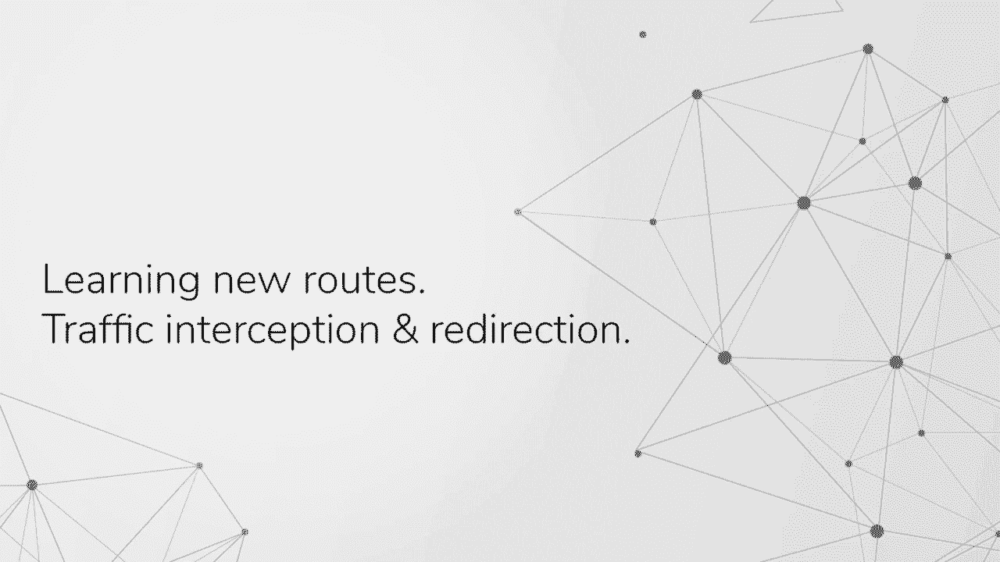
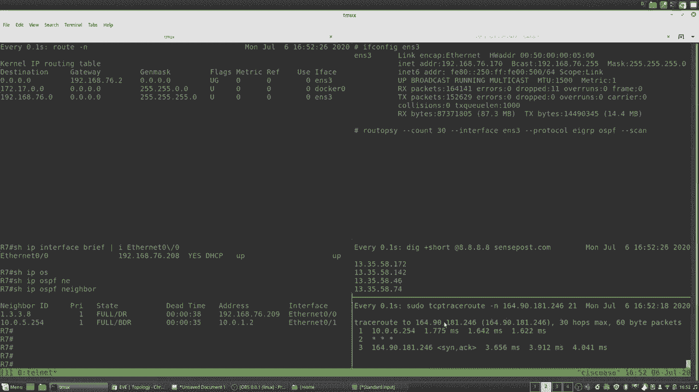
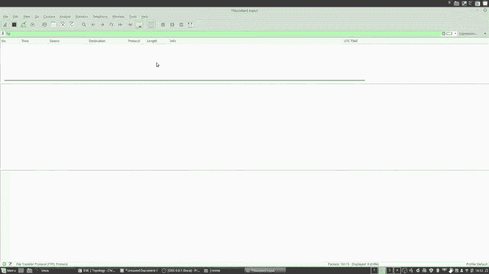
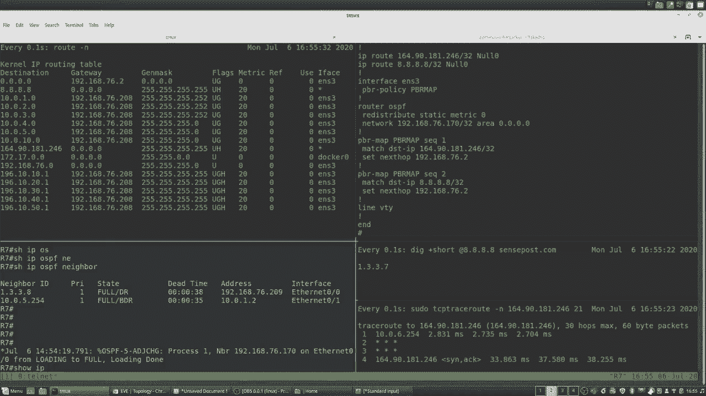
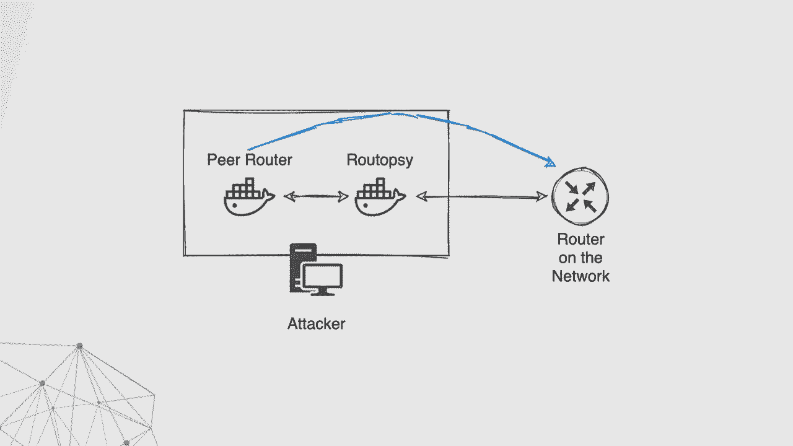
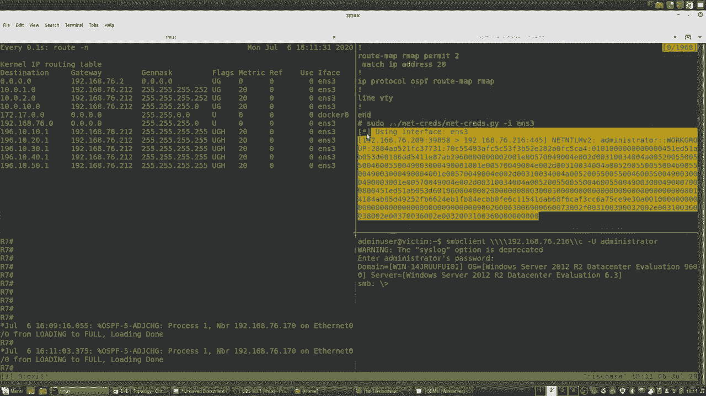
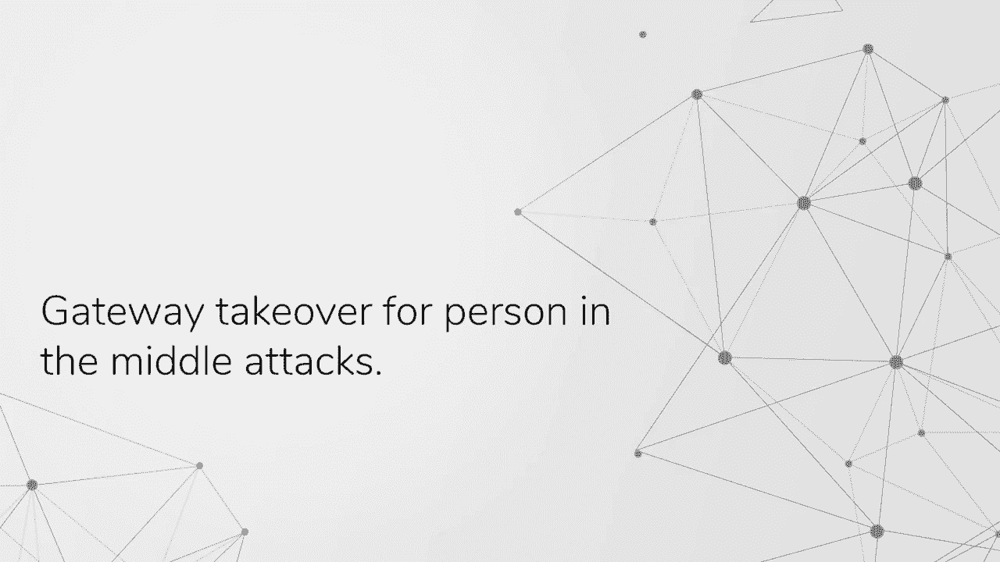
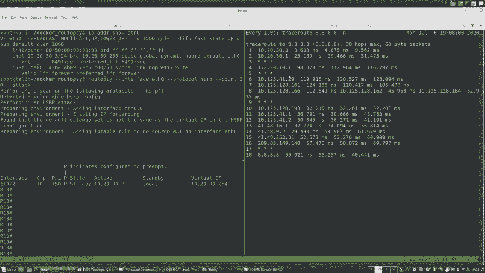
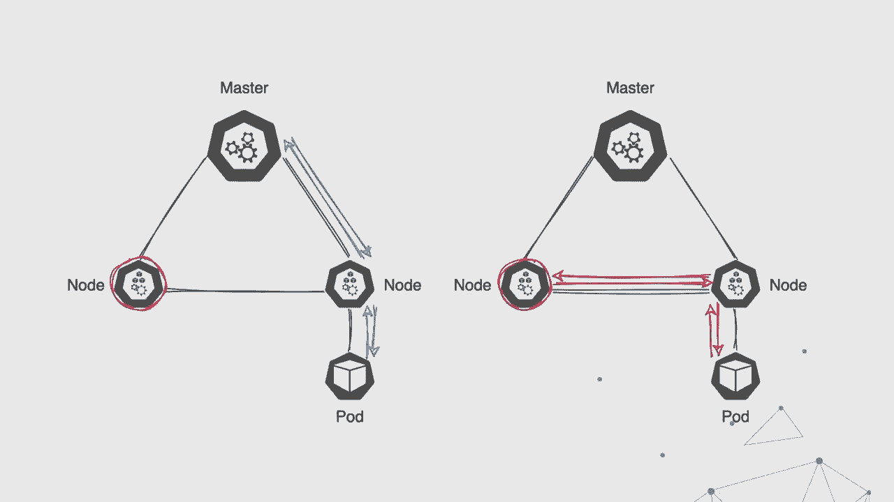
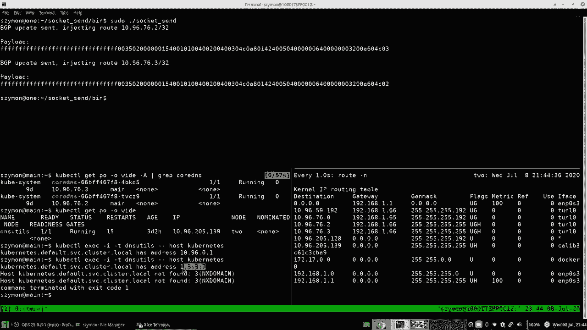

# 【转载】Black Hat USA 2020 会议视频 - P14：14 - Routopsy - Modern Routing Protocol Vulnerability Analysis and Exploitation - 坤坤武特 - BV1g5411K7fe

 Hello and welcome to our talk titled "Rutopsy" where we will discuss modern routine protocol。

 vulnerable care analysis and exploitation。 I'm Shramun Jukovsky。

 been hacking at corporate networks for over three years before that。

 I was a student at University of Pretoria， I enjoy application security and writing code。

 You can catch me on Twitter @thegoatformer。 Hi everybody， my name is Tyran Kemp。

 I have roughly four years of networking and network， security experience。

 I'm working towards three years of pen testing experience， my Twitter analyst TKMPax。

 I don't really know how Twitter works or any application for that matter， I enjoy hacking。

 infrastructure myself and Simon are both security analysts at our inside of the fence， we're。

 part of the sense-post team， we want to become your neighbor。

 What we mean by that is we want to show you how to identify some cool vulnerabilities。

 using Wireshock， our initial attempts at performing these exploit on these vulnerable， protocols。

 what are the impacts of these expectations and some of the challenges that we face or。

 you may face in attacking these protocols。 And then finally our toolkit attempts to address some of these challenges。

 So we went on some pen tests and on reoccurring occasions we saw these dynamic rooting protocols。

 and first-opera-dundancy protocols being played into sort of a user network space。

 So our toolkit we'd like to include a bunch of network related attacks but for now we're。

 focusing on these two classes and they are similar in the way that you can manipulate。

 traffic flows but for now understand that dynamic rooting protocols root traffic between multiple。

 networks whereas a first-opera-dundancy protocol is more of a high availability mechanism。

 So there's a lot of acronyms and jargon and alphabet soup going to be thrown at you。

 Please try and stay with us。 Some of the FHRPs， some stability the DRPs are getting confusing but in the DRP stack we're。

 going to focus on EIGRP and OSPF and then FHRP stack we're going to focus on HSRP during， this talk。

 So why are we doing this？ Like I said with multiple pen tests we saw these things being played into different networks。

 and we're not finding these vulnerabilities in certain topologies or bound to certain， industry。

 We're seeing them in a bunch of different corporate networks being at ISPs， being at， banks。

 being smaller type of networks， we're really seeing them all over the show。

 Additionally these dynamic rooting protocols are being used in Kubernetes。

 Kubernetes makes use of container network interfaces or often referred to as CNI's and。

 for example you get a CNI called Romana which makes use of OSPF and then there's another。

 one called Calica which makes use of PGP。 So we're going to give you a little bit of a background on what the purpose of a DRP。

 and FHRP is but before we do that let's explain what a static root is。

 So if I want to root from the 10 network to the 14 network I need to add a root from。

 root A to root A and for root B to root C and then you need to take care of the written。

 part as well。 So you need to add a root back from root C to root B and root B to root A。

 So that's quite tedious just explaining like static rooting between three little rootes。

 So now imagine yourself in this large corporate network with 100 rootes and 1000 different。

 networks and now you need to configure all these static roots indicated by the blue arrows。

 on the slide and then you've already need to take care of some high availability as well。

 so you need to configure extra static roots with different metrics and priorities to ensure。

 that you can have failover or high availability in your network。

 So that's not really a scalable solution so that's why we have dynamic rooting protocols。

 So instead of configuring these punches of these bunch of static roots you can configure。

 a protocol like OSPF or ER， DRP or et cetera et cetera on your router and it will become。

 a neighbor with its adjacent root and the neighboring concept is something that we will。

 refer to throughout the talk。 So once you configure these protocols on the rooters it will take care of automatically。

 sharing the network information and it will also take care of the automatic like failover。

 if a link were to drop。 In terms of first up redundancy protocols there's sort of a logical group between a greater。

 between an active and a standby group a virtual MAC address is assigned to this logical grouping。

 and should the active device failover then the virtual MAC then the new active appointed。

 router will respond to this virtual MAC address。 So there might be a network failure but it would be transparent to the user and the traffic。

 which is flow as expected。 So Simon don't you want to show us where you can find these vulnerabilities or how to。

 look for them。 Yeah so how can we look for it？ Well let's open up a packet capture for instance wire shock and if we take a look at the very。

 first packet we've captured it's an EIGRP hello packet right and so when we've got these。

 packets coming in there are certain fields we want to look out for because we need these。

 same values for our router if we would like to neighbor up or perform an attack。

 In the case of EIGRP the very first thing that we want to take note of is the autonomous。

 system number。 In this case it's 100 so we would have to configure our router to have the same autonomous system。

 number so we can neighbor up with the router 192 168 101。

 Now you'll notice that in that packet capture there was no authentication and so we can perform。

 a very simple or easy to do attack we don't have to worry about that but time what if there。

 was authentication。 Well there's two variants of this so either it will be plain text or it will be ashed and。

 if it's plain text it will do exactly the same thing it will look at the packet capture。

 it extract the plain text password and include that into your sort of attack or config。

 But what would happen if it were ashed or there was some crypto applied。

 So if there was some crypto applied we would then take that packet capture and we could。

 run it through something like Ettercap which would pause these packets and then form or。

 rather create a hash from that data that can be then supplied into a password cracker。

 for example John the Ripper take a good word list and you may be able to crack it。

 Once you've cracked that password you can configure your router with this new password。

 and now it can attempt to neighbor up。 So let's take a look at a packet with password and specifically crypto。

 So if we have a look of yeah this is an EIGRP hello packet and if we take note over there。

 is now an authentication MD5 and it's got various bits of data which we won't easily。

 understand but something like Ettercap would be able to easily take this data create the。

 right hash and then we can supply that to a password cracker like John the Ripper。

 Now let's take a look at OSPF that's another dynamic routing protocol and in here there。

 are different other fields that we need to take note of。

 In this case the first field is the area ID then we notice that there's authentication。

 but this is of type simple password or clear text and so we won't have to involve something。

 like Ettercap to extract it and crack it we can easily observe the clear text password。

 and then use that in our router。 We then take note of the hello interval and the dead interval and that's pretty much it。

 for OSPF。 Now when we look at something like HSRP which is a first top redundancy protocol there are。

 a few things to take note of but first we need to make sure that we're looking at packets。

 from the active state because this is important for us to carry out the attack we need to make。

 sure our priority is much higher than that of the active router。

 Then we take note of the hello and the whole time which are three and ten seconds the default。

 values and then we can see the priority value for this specific router or default gateway。

 which is also active is 150 and so our priority if we would run to attack this protocol has。

 to be much higher than that。 If we then look at the group number we also need to get this right so we form part of the。

 logical grouping we would like to attack。 You can also see that there is authentication data and in this case as a default Cisco by。

 default these are configured with Cisco and in clear text。 And lastly is the virtual IP address。

 This is the IP address that the users on the current network are configured with as the。

 default gateway。 So how do these issues creep into a network？

 Well one such way would be through minimal configuration。

 If we take a look at router one and it's configuration for OSPF there is a network statement that。

 is very wide and this basically means that OSPF hello packets would bleed out to all。

 the networks of this connected to the interfaces of this router。

 If we take a look at the second OSPF configuration on router number two there's two network statements。

 in here a bit more specific but still a bit too over-board。

 This interface is connected to the networks of 192。168。10/24 and 192。168。20/25 would。

 have then OSPF packets bleed out to them。 Now let's take a look at Kubernetes。

 So in Kubernetes Taren mentioned there are CNIs and once the CNIs is Romana。

 Romana allows us to configure OSPF within this cluster。

 Today we would like to join this cluster or rather share dynamic routing information。

 between a cluster and your traditional network。 Well so a person that's typically configuring a Kubernetes cluster is a person of a DevOps。

 background and not necessarily a network engineer。

 And in there they may have also some issues trying to configure Romana on a cluster where。

 there are multiple OS's used。 And because OS's sometimes have the finaming schemes for interfaces they may not know。

 what the interfaces of all of the nodes are。 So they may use a wildcard which would then lead to OSPF bleeding to all the networks。

 that the nodes are attached to。 Taren where would you find this on a network？

 Taren that's a really good question but before we go into that I just want to reiterate。

 that we sort of have a rudimentary understanding of where these protocols fit into the network。

 and that we've shown how to identify them。 The process is similar。 You open up the capture。

 you look at the multicore packets and you apply your config， according to that。

 But let's consider ourselves connected to the access layer， the switches denoted in the。

 slides and which protocol goes are we likely to find in that layer。

 You're likely to find something like HSRP providing you with a default gateway。 However。

 if you find yourself in a network or you've pivoted to a network where you have。

 layer 2 connectivity to a router or firewall you're likely to find a dynamic routing protocol。

 because these appliances support such protocols。 Other than that。

 files and routers often make use of the RRP to achieve availability。 So if again。

 if configured in securely or incorrectly that could bleed into that local， segment as well。

 Other than that， we mentioned Kubernetes using their CNI's and they support DRP's。

 So if you were able to influence routing within Kubernetes that may bleed into or propagate。

 into the traditional network and vice versa。 So what's the impact of these types of attacks？ Well。

 consider yourself the red workstation on the slide。

 You've connected to a LAN and you have knowledge of the computers in your sort of LAN segment。

 and you have a default route pointing to your default gateway。 But you haven't learned anything yet。

 You start interfacing with the default routing protocol and you learn of these new networks。

 You learn of the finance and you learn of the server network。

 So you've literally just nay but up with the routing protocol。

 You haven't done anything malicious as of yet。 But the benefit of this is from an attack perspective。

 you don't have to go an nmap/16， or mask and whatever tool you prefer using。

 You've learned exactly which networks are active within this organization。 So it takes。

 it's sort of cool in terms of enumeration。 You have a lot more accurate description of what's going on and you can pinpoint your attacks。

 a little bit better。 So that's cool。 You can neighbor up but can we take it further？ Yes。

 we can take it further。 So consider the traffic flow indicated by the blue arrows。

 Sort of a normal traffic flow we use on the finance department accessing the ERP server。

 in the server VLAN。 So what can we do？ We can inject routes with higher priorities or let's call it higher priorities for now to。

 redirect that traffic from the finance， from the findings used to our malicious attacker。

 control PC。 So that's pretty useful。 You know， getting ERP traffic on your attack machine could probably have some devastating。

 impacts， right？ In terms of FHRPs， what could happen over here？ Again。

 we said there's a logical grouping with this priority and then the higher priority。

 becomes the active device in this logical group。 So from an attacker's perspective。

 we can just assign our priority to ourselves and then the。

 user's traffic would be directed towards us and then we would just forward that traffic。

 onto the legitimate default gateway。 Okay， so it's important to mention some of the challenges with these types of attacks。

 So you need to get specific and what we mean by that is you need to inject more specific。

 routes that's currently in the routing table。 So you can join the routing table。

 observe some routes in there and then if you observe， that there's a /24 network。

 split that network into two， advertise two /25s and that traffic。

 is going to get redirected back to you。 So that's all what we mean by saying get be more specific。

 There are other things to consider such as administrative distance and then the per。

 protocol metric。 For the purpose of this talk， we're just saying be more specific and that's how we're going。

 to be the routing table。 How did we do this initially？ We were connected to a LAN。

 we opened up Wireshark， exactly how we're shown and we saw these vulnerable。

 packets being unauthenticated and we wanted to export it。

 So we started researching for some tools and honestly we were able to configure a virtual。

 firewall in a quicker fashion than it was to get existing tools up and running。 So how did it look？

 Let's go through a demo and show you how you can do that with a virtual firewall。 Okay。

 so on the left we have a Wireshark capture running on the attacker machine and。

 you can see some OSPF Hello packets。 At this point in time you should get excited just seeing the packets。

 never mind whether， it's auth or not。 It's a good sign already。

 On the right hand side we have our attacker 48 which is essentially our rogue or rogue。

 firewall and all that we have to do is match the parameters in the aloe packet and configure。

 them in the 48 and then we'll become a routing neighbor。

 So you can see that there's no auth data so it's going to be a really easy attack， no。

 cracking required。 Some other fields we need to take note of is the area ID。

 the aloe interval and the dead， interval。 We're going to match those parameters in the firewall and you know pretty simple copy paste。

 So when we head over to the firewall section we're going to configure a router ID that's。

 just our unique identifier within this process。 We're going to add the area which we observe to be as quad zero and we're going to say on。

 which interfaces do we want to send out our aloe packets and we're going to match that。

 IP address and display to the top URL bar。 So only out this one interface。

 We need to add the interface as well so you're going to give it a name， you're going to specify。

 the interface on which we're sniffing and we're going to put in the aloe and the dead。

 interval which we observed on the left hand side。 Once we apply this configuration you're going to see in the wire shock there's going to be。

 some OSPF conversation happening and that's when the routing information is going to start， sharing。

 So it should take a second and you're going to see some movement in the wire shock capture。

 and then you can see the Alice update packets sharing the routing information。

 So it should take a couple of seconds and then this state would have been processed and both。

 routers would have been shared the routing information。

 So let's give it a second and let's see if the Forticated learned any new routes。 There we go。

 we've learned some of a bunch of new routes。 So pretty cool。

 we haven't really done anything malicious as such but we've learned of new。

 targets and it's this more accurate way of enumerating targets。 So Simon， what's the bad。

 what's bad about taking this approach？ So there are a few issues that we experienced when we took this initial approach。

 The very first is that you require access to such firmware which is not easily available。

 and then you also require the knowledge of first what to look out for in the specific。

 protocols and then how to configure such a device which is again not easily accessible。

 Then with regards to the existing tooling well because they haven't been maintained and because。

 of that they have dependency issues which is just very tricky to get up and running。

 So we found the virtual firewall to be much easier than the existing tooling。

 But at that point then we noticed that there is a recurring pattern over here in that we。

 can easily extract data or rather we can automate the process of extracting the important fields。

 then writing up a configuration for that and take a legitimate virtual router and apply。

 this configuration to that router and in essence making it attack the network。

 So we wrote up a tool called rootopsy which helps us achieve this where it will first。

 perform packet capture， take that data and then make the router kind of attack the network。

 And that's done using Python and Docker SDK with a few Docker containers and then some。

 other extra bits to it。 So with more specifically we're using a FRR router which we then weaponize with these。

 configurations that we've got to perform these attacks。

 Some of the code or rather the protocols have code specific to it because they are Cisco。

 proprietary but others such as your dynamic routing protocols while they've already been。

 implemented in FRR。 So we do not have to recode the entire protocol。

 The high level overview of rootopsy is that it will first perform a scan where it will。

 perform a packet capture taking these packets and then extract the various information and。

 build up a configuration。 This configuration it stops at this configuration。

 It does not go any further unless we tell it to attack。

 In the attack it would spin up the virtual router and apply the configuration on top。

 which would then have it go and neighbor up。 We can take it one step further because attack just neighbors up where we can now inject。

 roots。 And so once we supplied a root this would just change the configuration in a little way。

 in a small way and that will now have the roots injected into the whole network which。

 time will demonstrate。 Sure。 So we're going to demonstrate learning new roots。

 Add it while first learning enumerating networks I guess is phase one。

 Phase two is joining the rooting neighbor and then phase three adding some roots which。

 will eventually lead us in directing traffic to an attacker controlled machine。

 So before we start off with the demo let's get a quick lay of the land。

 We realize there's a lot going on the screen。 That's why we're sort of giving a short briefing before we start running attacks。

 More specifically the top left is our attacker's rooting table。

 We're running a watch command on there and as we perform our attacks that the rooting。

 table will update dynamically。 On the top right that's where we'll be running our root obstacle monster from essentially。

 our attacks and like I mentioned at the bottom left is the router and the bottom right our， victim。

 So let's start off with a demo。 On the top right we're going to perform our attack and only really need to take note of。

 for now is that our IP address is 192。168。76。170。 Just keep that in the back of your mind it's not super important to remember throughout。

 but it's nice to have in the back of your mind。 If we go to the bottom left we look at our router we take note of that IP address as well。

 You'll see later why these IP addresses matter。 You can see that that IP address is 76。208。

 Also take note that we have two OSPF neighbors at this point in time after our attacks will。

 have three neighbors。 So we've mentioned there's a victim in the bottom right。

 The victim is doing some DNS queries and is connecting to an FTP server and this is essentially。

 the traffic that we want to modify。 We're running a wire shock on our attack machine。

 We're filtering for FTP and we've seen that there's no traffic traversing through this FTP。

 And after our attack we'll show the wire shock again。 So let's start the attack。

 Let's start off with the scan flag and like Simon mentioned this is just going to look for。

 vulnerable packets， pause them and then take the relevant parameters and push them into。

 our config templates。 So now you can see that we've detected vulnerable ERGRP and OSPF and let's go look at what the。

 configurations look for these， what these configurations look like for these protocols。

 So you can see we've paused the autonomous system number number number 100 and we've included。

 that into our config root ERGRP 100。 Other than that you can see in our network statement is our interface IP address that。

 we showed initially and all this is doing is it's ensuring that we're only sending these。

 ALO packets out of our specific interface。 Only our one interface and not a bunch of other ones。

 So it's pretty simple。 Let's look at the OSPF configuration as well。

 It's a little bit more to take note of but it's also pretty similar。

 You can take note that we've paused the ALO interval and the dead interval from the vulnerable。

 packets and we've included that into our config template。 Again。

 our network statement includes our IP address to reiterate。

 It's ensuring that we're only sending these ALO packets out of this one interface and。

 you can see that we've also paused the area ID from the PCAP and included that into the， template。

 So at this point in time， you know， nothing's happened。 We haven't interfaced with the protocol。

 We haven't attacked anything。 We haven't really achieved what we achieved with the 40 gate。

 So we could do that without tool。 You should simply substitute the attack flag with the scan flag with the attack flag but。

 it's a little bit boring。 We want to meddle with traffic flows and we want to inject and perform some redirection。

 So what do we do？ We specify the inject and the redirect flags and they work slightly differently。

 In terms of the config， the input is exactly the same but the inject flag will forward traffic。

 onto your default gateway whereas the redirect flag will sort of make the traffic stop on。

 your endpoint which is useful for maybe any parting scenario or if you wanted to run a。

 so-cat then forward the traffic onto some other endpoint， you know， a process in which。

 ever way you wanted to。 So again， what's happened now is our inject and our redirect flags imply attack which。

 also implies scan。 So it paused those vulnerable packets at both config templates but now it's deployed it into。

 a container and you can see some activity happening on the panes。 So we'll explain what's happening。

 If we look at the bottom left pane， you'll see that there's some OSPF activity being。

 logged from the router saying loading to full meaning that there's a state change in。

 the router's OSPF。 We've become a neighbor with that router effectively doing what we did with the 48。

 Other than that in the top left pane you can see our attacker machine is starting to take。

 some changes and you can see that the routes were automatically added to our attack machine。

 So the same thing that you saw in the 48 gate。 You've learned routes。

 we now have new targets to go after。 So more importantly， if you have a look at the victim。

 you can see that the victim's， DNS query has changed to 1337 and the FTP trace route has gone from three OPs to four。

 apps。 So we've successfully changed the traffic flow but， you know， I guess it's important to。

 mention that you don't have to follow our templates， you don't have to use the inject， and redirect。

 you can specify the attack flag and then you can go perform your own type。

 of attack should you be comfortable with a router interface。 But nonetheless。

 let's have a look at what these flags do and what the template is that， we've pulled for them。

 So on the top right pane， going from top to bottom， you'll see that we added static routes。

 pointing to the null interface and the IP addresses match the flags that we specified。

 Then if we move over to our sort of host machine again， the route and then you'll see these。

 static routes added to our OS machine indicated with the asterisks and that asterisk is saying。

 that it's a null route。 So at this point in time， you may be thinking why are you guys adding things to the null。

 interface because it's going to drop the traffic。 We'll explain that now。

 So we still get that null route into OSPF and how we do that is we specify the redistribute。

 command。 We can go verify on the router that those routes are within the OSPF process and you can see。

 they're quad eight and the one six four address is really within the OSPF process。

 So we'll go over back to our attacker machine and we ask that question and okay， cool， we've。

 advertised these routes into the routing process but surely it's going to go to the null interface。

 How do we get around that？ We apply some policy based routing。

 So you'll see these policy based routing maps and what we're doing there is we're saying。

 if you match the parameter， if you match traffic on those parameters that we specify， forward。

 it on to the next stop。 But as I mentioned， it's only relevant for the inject flag and not so much for the reader。

ic flag as we're doing an additional IP tables rule in the back to not that traffic to your。

 interface。 So that's cool。 We've named it up。 We've injected some routes but sort of what is the net result of that？

 Let's have a look。 Let's log into that FTP again or let's log into that FTP now， connect to it。

 specify， the credentials， verify that we connected and switch back to the wire shock to see if we。

 can successfully manage the model。 So here you can see we've managed the model or personally in the model。

 I apologize。 The FTP track is and we can observe the username and the password。

 So there's quite a bit that was going on over there and we'd just like to reiterate what。

 happened over there。 We learned some new routes just like with the 4D gate but we went a step further and we。

 injected some routes and that resulted in some traffic being redirected to our attack。

 or control machine。 Simon， is there a way for us to manipulate traffic coming inbound to our local subnet？

 Yeah， there is。 Using dynamic routing protocols， we can have the traffic or using dynamic routing protocols。

 We can insert a route to a host on a local land segment and inject that into the routing。

 process of the greater network and thereby having traffic that is initially destined to。

 that host to first come through the attack or host before the server。

 So if we take a look at the diagram right now， the victim would attempt to access the server。

 and would follow the blue arrows。 But now during this attack。

 we would take this route of the server and tell the routing， process， "Hey。

 we know a more direct route to that server and that would then allow us。

 to capture traffic from the victim destined towards the server and then we can manipulate。

 it to which way， every way we would like to。"， How we achieve that？

 Well we first have to take a closer look at the attacker host， the configuration within， it。

 There are two containers or rather two routers in there， one regarded as or known as "rutopsy"。

 and the other as the peer router。 Rutopsy will neighbor up with both the external router as well as the peer router on the host。

 The peer router there is there mostly just to inject the route into the larger routing。

 process but Rutopsy has some configuration within it to prevent that routing or rather。

 that route to be added to its routing table。 And what we want to prevent it is because Rutopsy shares the routing table of the attacker。

 host。 So when this traffic comes back from another network to us， we would like to then manipulate。

 it to whichever way we want to。 And so that's why we need to prevent the addition of that route into our table。

 Let's take a look at the demo and how this is done。

 We're first going to orientate you in the layout of this demo and the top left is the。

 attacker window and the top right is where the attacker will be performing their commands。

 and on the bottom right is the victim。 As you'll see the top left right now the routing table is quite normal。

 this is without us， peering up。 In the top right we're running net creds and then we're going to show you that the victim's。

 traffic is right now not being captured in any way。

 This shows that we haven't done yet the attack and that the victim is able to normally access。

 the SMB share without its traffic being tampered anyway。

 So you'll notice now we're attempting to connect to an SMB share， we're going to enter in our。

 password and then we're going to do a directory listing。

 While that's happening you'll notice that there is no data that is being printed out， by net creds。

 That just proves that right now the victim's traffic is going the normal blue line way。

 The blue arrow way。 If we now write up the command to run rootopsy and target the protocol OSPF。

 this will first， scan for a vulnerable OSPF configuration then it will create the necessary OSPF config files。

 for the virtual router and it will spin them up。 So you're going to notice now that it spins up a peer and it will spin up rootopsy。

 Let's take a closer look at the configuration of the peer。

 Within the peer you'll take note of first the OSP or rather the roots the static roots。

 we're injecting and that is the static root to the target server。 Then next is the OSPF process。

 Within the OSPF process this tells it to neighbor up with rootopsy and also redistribute。

 the static roots。 This is how we get that root into that larger rooting process。

 We're now going to look at the configuration of rootopsy and how we prevent that root from。

 being added to our rooting table because it shares the rooting table of the attacker， host。

 The first two statements are the network statements for it to neighbor up with the external router。

 and the internal peer router。 Next two statements are access lists。

 The very first access list is for 192。168。76。216。32。

 So any packets with that root will match that access list and then there's a second access。

 list for anything else。 Together with the root maps beneath it we're able to control whether this root is added。

 or not added to the rooting table。 We take it one step further because we're using OSPF to neighbor up that we now add these。

 root maps on top of OSPF so that we don't learn this root and add it into our rooting。

 table because again it's shared with the attacker but it is propagated to our larger。

 rooting process。 So now that we've got that down we're going to have a look at how we've managed to redirect。

 the traffic。 Right so we're going to run Netcreds and then we're going to go back down to the victim。

 and attempt to connect to that same SMB share。 Now once I've entered the password in you'll notice that Netcreds will print out a Net。

 Antelium hash。 This means we've successfully managed to redirect the traffic of that victim so now。

 we've shown you how to using dynamic rooting protocols inject traffic or rather inject。

 a root to a host on the local land segment into the rooting process which then has traffic。

 originating from another network first go to the attacker before going to the server allowing。

 us to perform a personal middle attack。 But root top seed doesn't only perform the RP related attacks we also perform attacks。

 against first top redundancy protocols and we'll show you a demonstration against HSRP。

 First let's orientate you around this demo or the layout of this demo and the top left。

 is the attacker window in the bottom left is the victim router or the vulnerable router。

 and on the right side is the victim attempting to reach quad 8 via trace root。

 Take note that the trace root to quad 8 takes 17 hops and this will change after our attack。

 showing that we are performing a personal middle attack。

 If we go back to the top left window where the attacker sits you'll notice that the IP。

 address is 10 20 33 take note of that because that will be the next active after the successful。

 attack。 So we're going to target the protocol HSRP using root top seed which will first run and。

 perform a scan to determine whether there are vulnerable HSRP configurations。

 Notice it notices that it will start sending our HSRP hello packets with a much higher priority。

 to allow us to become the active default gateway。 You'll notice that in the bottom left with the vulnerable router sits that it goes from。

 a standby or rather an active state to a speak state and from a speak state to a standby。

 state meaning an election process has gone and that there's a new active router or a new。

 default gateway which has a much higher priority than itself。

 If we look at the active it is right now 10 20 33。

 If we take a look at the victim it now takes 17 hops but now it takes 18 hops to reach quad。

 8 with the first hop being 10 20 33。 So we've successfully performed a personal middle attack via first hop redundancy protocols。

 Great so you could run root top seed to do this and then you'll notice that maybe your。

 network interface is melting away because you have the entire user range going through。

 that one laptop and you may have realized oh wait I forgot to turn on IP forwarding。

 Well we've got safeguards within root top seed to prevent that happen but what you should。

 take note of is that attacks against first hop redundancy protocols as well as dynamic。

 reading protocols may cause denial of service。 These can be fixed and going back to what Tarim mentioned earlier about being specific。

 with attacks we can be specific with our configurations rather than being minimal and。

 leaking out these packets to all networks only speak these specific packets or rather。

 yeah speak these specific packets on specific networks where you have another router where。

 you may need to perform rooting protocols or dynamic rooting protocols or where you have。

 where you require high availability between two default gateways between two gateways。

 We can take it further and add stronger authentication by making use of crypto and a much stronger。

 password such that it's not such an attacker is not able to crack it。

 We can also then add on top of first top redundancy protocols making use of a much higher priority。

 value such as the maximum value such that no one else can come into the network with a。

 default gateway with a much higher priority value。

 We can also attempt to perform blue team or detection against these attacks by collecting。

 sys logs of the various network devices and monitoring for state changes。

 Monitoring for new neighbors on a dynamic rooting protocol or monitoring for a new active on。

 a first top redundancy protocol but if you are skilled attacker you may probably be。

 willing to just redirect that traffic elsewhere。 Taren do you want to introduce them to the playground？

 Sure thing。 So we realize that everybody doesn't have networking kit lying around or maybe they don't have。

 the navartic on figure and network emulated to sort of build a vulnerable network to test。

 these attacks and play with these vulnerabilities。

 So what we've done is we've built two yaml files which you can run with Docker Compose。

 and in the dRP file you know it spends up a router it spends up a victim and our root。

 ops machine and there's two networks and if you perform the attacks you'll see the traffic。

 replacing from the one network to the other network which is observable about root ops， team。

 And in the FHRP lab or mini lab there's a victim and there's sort of a high availability default。

 gateway configured with VRRP it's configured in securely root ops you can see that traffic。

 and then you can take advantage of that effectively redirecting the traffic from the victim to。

 root ops which will then forward it onto the legitimate default gateway。

 What we want you to take away from this talk is that network protocol security is still。

 very important and using our tool it's possible to meaningfully show impact you know and it's。

 also very。 so agreeing to speaking towards what Simon has said it's quite easy to secure。

 these things and it's also possible to detect whether there's some malicious activity going， on。

 And before we end off Simon would like to show you what we're currently working on。

 So picture a Kubernetes cluster with one master and two nodes this Kubernetes cluster。

 has calico configured which makes use of BGP to share routing information between the various。

 nodes within this cluster and then that one node has been compromised through some means。

 say a pod and privilege escalation or an attacker had access to the internal network。

 and was able to guess the password root。 The victim node has a pod that has been deployed to it and that performs when performing DNS。

 queries follows the traffic denoted by the blue arrows。

 We should we have compromised this node we could maybe use bird controller to start messing。

 with the routing table but not everyone is familiar with the bird controller and so we've。

 come up with a little tool that helps you either mess with the routing tables of all。

 the nodes in the cluster or for a specific node within a cluster and so we can actually。

 have that traffic redirected following the red lines that we've shown rather than going。

 to the master for DNS it would come to us。

 Let's show you how that is done with a demo。 This first orientate in the bottom left is the master in the bottom right is node number。

 two the victim and the top is the attacker node。 In the bottom left the master we're showing you guys the core DNS with the IP address。

 of 109676。3 and 109676。2 those are the roots that we're going to want to inject as we。

 want that traffic to come to us。 The next thing that we will take note of is the pod deployed there is a DNS utils pod deployed。

 to node two。 This attempt to resolve the Kubernetes name within that pod and we receive an answer 109601。

 If we go and take a look at the routing table of node two keep an eye on that because that。

 will change once we've injected new roots。 Going to the master we're going to run the script which will inject those two new roots。

 and you'll notice that node two's routing table has now changed so we may be able to。

 get the traffic not to come to us。 Let's see if that is the case。

 Let's go back to the master node and attempt to resolve Kubernetes。

 And now we have an answer of 1337。

 So we've effectively redirected traffic from that node。 Thank you guys for joining us in this talk。

 You guys can find our code published on GitHub Sensepost root top seed right after we're done。

 here and you can catch us on the Twitter's or on email。 Thank you very much。 Hello。 Hello everybody。

 Everyone enjoyed the talk。 Yeah， I hope you guys enjoyed。

 I think we can answer the last question first because we tried to sort of answer most of。

 them in the chat。 The last one was I may have missed it but the playground YAML is for what platform container。

 of both of them are slightly different but the attacker container will always be the。

 for the DRP stuff it will be a F or routing container and for the FHRB the VRB is just。

 a custom people IP container which we perform the attack with。

 I don't know if that answers the question。 And the other question does this to work in an AWS VPC or Azure V net just to just get。

 some more clarity around that。 The tool rootopsy was mostly done on on-prem kind of infrastructure and setups。

 So as something we still have to go and play around and see what the networking is like。

 within the cloud on that side of things。 And I'm just checking if there's any other questions。

 I believe we've covered everything else regarding the tool。

 We'll just not go on to GitHub and be releasing it live so that everyone can go and have a。

 look at it and play around with it and also open up pull requests for us。 Right。 Yeah。

 and they'll be a blog post in not too far future at some point。 Thanks everyone for joining。

 [BLANK_AUDIO]。