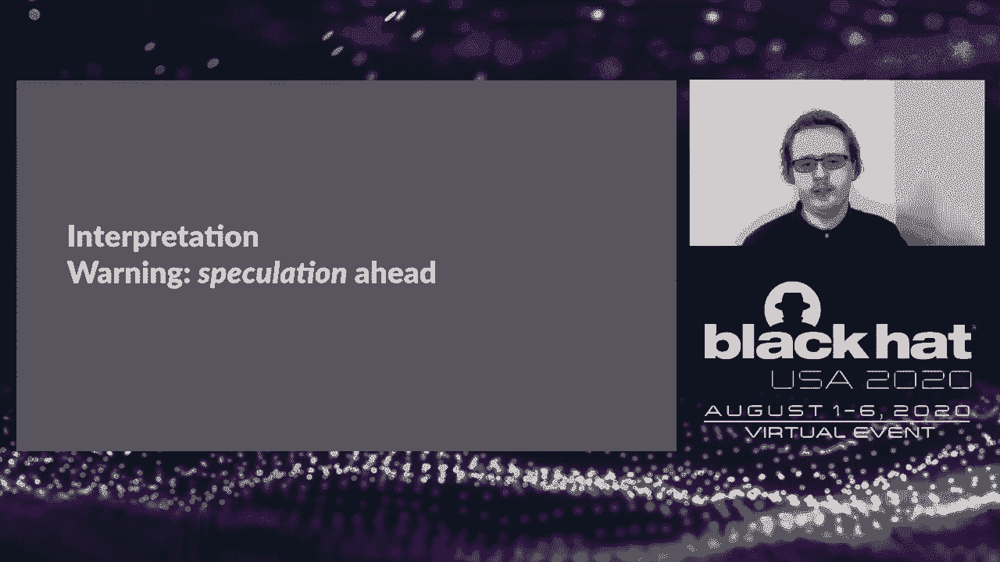

# P15：15 - Uncommon Sense - Detecting Exploits with Novel Hardware Performance Counter - 坤坤武特 - BV1g5411K7fe

 Welcome everyone。 This is Detecting Explates with Novel Hardware Performance Counters and。

 ML Magic。 Before we begin， a brief introduction to who we are。 So I'm Nick Gregory。 I'm a research。

 scientist at capsule eight。 I have a background in low-level systems and binary exploitation。

 I'm a recent graduate of Vanuatu Tandon in the Osiris Lab， shadow， where I'm actually also。

 now a hacker in residence。 My contact info is on screen。 If you wanted to email with， questions。

 ideas， anything like that， after the talk， I'm happy to talk。 Hello everyone。

 My name is Horini Kanan。 I am a data scientist at Capsule。 My background， is in business statistics。

 I'm currently working on system user behavior profiling， textile， takes， interpretable ML ops。

 You can hit me up at Twitter， a Jourishin or through my， website。 So without much ado。

 let's get started over to Ghost。 So introduction to the talk。 What are we going to be covering？

 First， we're going to， be covering what hardware performance counters are and why they exist。

 Then we'll be going， into some prior work that Horini and I have done specifically on detecting Spekker and。

 Meltdown， but with documented counters。 Then we'll be going into this work， particularly。

 what these undocumented hardware counters are and exploring them a little bit。 We'll。

 be then training models on undocumented counters， seeing what we can detect with these trained。

 models， doing a little bit of interpretation on the results。 Again， given that these are。

 undocumented， we can't know for sure exactly what they're measuring， but we have some ideas。

 And lastly， we'll go over some future work ideas， so much better planning。

 So the main question that we're out to answer is， can we detect exploits using undocumented。

 hardware performance counters on Intel CPUs？ It's a mouthful。 So first， what are these。

 hardware performance counters that we've been talking about？ So they're also known as。

 performance monitoring counters。 Basically， there are hardware devices that count events。

 as they happen in a couple of different performance monitoring units or PMUs inside of the processor。

 They're usually used to debug things like system slowness or program slowness， measuring things。

 like cache misses to a lot of instructions to run things like that。 But as we'll see。

 they have a lot more uses as well。 Specifically， we'll be focusing on the CPU PMU today。 That。

 is the performance monitoring unit that lives on each core or on each hyper thread in a， modern CPU。

 Most modern Intel CPUs let you pick four or five， depending on the exact generation。

 counters to monitor at once if you're on a hyper thread or eight or ten if you're on a。

 non-hyper thread core。 And you specify what you actually want to measure to the processor。

 as to a bit integers， an event ID and a UMS。 Broadly speaking， the event ID is the category。

 or kind of the subsystem that you're wanting to measure。 So the branch predictor or the， caches。

 something else like that。 And then UMS specifies exactly what counter you're。

 interested in within that。 So a lot of cache misses or conditional branch mispertics。 On Linux。

 you interact with these through the per subsystem and usually through the per， CLI。

 There are some examples up there if you wanted to mess around。 The first one is。

 to make guess measures the number of cache misses that the processor has while running， bin LS。

 And then the second one is specifying a specific event ID and UMS and that one in。

 particular you'll actually see show up in our models later。 It's also worth noting that。

 there's a couple of different ways to actually sample these counters from the CPU。 You can。

 get them on a timer basis。 So every end milliseconds， you can get them when the counter overflows。

 a certain value。 So when it reaches a threshold or you can just let them build up the entire。

 duration of the program， which will be what will be exploring to start with。 So a couple。

 of years ago， spectrum meltdown happened。 For those who didn't hear the timer， I haven't。

 heard of it。 There's CPU level vulnerabilities that abuse processor speculation。 Basically。

 the process of modern processors speculate what code should be run before they know for。

 sure to make your code faster。 This introduces a lot of ways to do bad things though。 So。

 Spectre V1 was speculating through a balance check。 So in your speculated code， you could。

 read past the end of an array， for example。 Spectre RSV， let you speculate through a bad。

 return address。 You could speculate reading a disabled FPU， which was lazy FPU。 So potentially。

 leaking secrets from other processes on the system entirely。 And there's a bunch more。

 So a bit of background here。 These speculative execution attacks by themselves don't do a。

 whole lot， right？ You can speculate until the execute code， but can't do anything with。

 that because all of the actual artifacts get， they don't get committed to system state。

 So what you can do is use a separate exaltration technique like flush and reload to actually。

 exaltrate data out of the speculative execution。 So the one we'll be talking about today is。

 flush and reload， which is pretty consistent and easy enough to do with assembly level， access。

 This can be done through a JavaScript interpreter， for instance。 The basic idea is。

 that you have a timing array and for you run whatever part of code you want to spec。

 you want to get data out of， you seal flush that entire array out of cache so that any。

 accesses to it will force a memory。 You then go through with your speculative execution。

 and have the speculation load a cache line。 And what they'll do is mark a cache line active。

 And then when you come along later， read through all the cache lines in the array and one of。

 them will read faster than the others because the other ones are still reading from main。

 memory because you seal flush it earlier。 But one of them will be fast because you loaded。

 it during speculative execution。 And that side effect on the CPU doesn't get thrown away。

 when the processor realizes it's misspeculated。 So a hypothetical example here， this is super。

 oversimplified， cache lines are like one byte in this example。 So it's obviously not real。

 but just to get the point across。 Let's say you have a conditional branch that is slow。

 to load and usually true。 So the branch predictor encounters this and says， okay， let me go to。

 dispatch the actual read， but let me try and continue into this next instruction speculating。

 that the conditional come back true。 So in this speculation， we now load from secret number。

 and load a cache line in our out array， which is our timing array based on the secret。 So。

 in this case， we're masking off the load two bits and we're saying， let's load from， that。

 So they'll make， in this case， the third cache line active。 Now eventually the load will。

 originally come through and processor will realize it misspeculated and will throw away。

 all the architectural state， but leave the cache line active。 So we can come along later。

 and measure how long it takes to actually access all of these。 And we'll find that the。

 first two are slow， but the third one's really fast because it's already in cache。 And so。

 with this， we can leave that at least below two bits of our secret number are two。 So we。

 develop detections for spectrum meltdown using three counters early in 2018。 We use the total。

 number of cache misses， the number of cache references， and the number of branch misses。

 The first two form effectively the cache miss ratio。 And then the third was actually chosen。

 just by experimentation， but makes sense kind of looking back after the fact basically it。

 normalizes to the complexity of the program。 So the idea is if a program is branch miss。

 predicting a lot， it's also likely to cache miss a lot。 It's not optimized or it's doing。

 something really weird。 So we sample all of these counters on 100 mil hertz on 100 mil。

 second ticker。 And this technique decks all of the public proof of concepts that we've， tried。

 So this is a visualization of the SVM model that we built around this。 For any of。

 them going to details about what this actually means later and what SVM is。 But roughly speaking。

 to you， the green dots are non-attacks。 They're benign programs running。 The red dots are， attacks。

 They're instances of the spectro-proof concept running。 And you can see basically。

 we've successfully drawn circles around all the red dots， which means we've got the attacks。

 Specifically， if we actually look at the accuracy。

 if we combine the SVM model and the deterministic， model。

 which is just cache miss ratio and branch miss ratio below a certain threshold， we can。

 see that we get 100% accuracy and zero false negative rate。 So we have a effectively perfect。

 detector here for all the proof of concepts that we've tried。 However， this detection。

 can actually be really easily defeated if you know what it's looking for。 So all you。

 have to do is mix in some cache friendly code into the proof of concept。 An example like， this。

 you have this stuff array， which we effectively always keep in cache。 And excuse all the register。

 old C-style nonsense。 I just wanted to make sure that this doesn't end up writing something。

 into the stack， which modifies the cache in another way。 This just does what I think it， does。 And。

 turn off this whole bypass， our detection。 We can even tune using the high。

 bound of the round parameter， how， what our cache miss ratio， what we want it to be， so。

 we can mimic anything。 So with that done， let's dive into our current research。 So as I mentioned。

 earlier， hardware performance counters are specified with two 8-bit integers。

 So we actually have room， for 65，536 counters， potentially。

 But only a subset of those are actually documented by Intel。

 Somewhere in the low hundreds to a thousand-ish， I think 1500-ish was the most they've ever documented。

 But that's not to say that the ones that aren't documented don't have any， data behind them。

 they're not counting anything。 So the idea basically came out， what if we read， all of the counters。

 even the undocumented ones？ By doing this， we're basically turning。

 this X-way detection problem into a black box ML problem。 So just completely changing frame。

 So what are we going to run these counters on， though I guess it's the question that arises。

 So we have four sample programs that we were running on。 We have a minified exit zero。

 which is basically there's two detect， any overhead of the kernel actually starting the process。

 We have a scikit benchmark， which was known from prior research just to be something that， was very。

 that had a very high cache miss ratio。 So it sort of looks like Spectre。

 We had the Spectre proof concept itself， and then we had our modified Spectre proof concept。

 With our cache-friendly code mixed in。 So once we gather all that data， we did a few filtering。

 steps。 We removed all the counters that are always zero， just because they weren't doing anything。

 We removed counters that had a difference between scikit and Spectre less than 95%。

 So the idea is basically we want things that are very different than we want things that are very。

 different between scikit and Spectre。 Then we removed counters that differed more than 5% between。

 our modified Spectre before and the original proof concept。 Again， the idea of being those two。

 should give a similar signature because we want to actually detect the exploit running。

 not like a side effect of it。 So since those are at their core doing the same exploit。

 they should be relatively similar in their camps。 At the end of that， we were left with。

 81 counters and interestingly enough none of them were documented。 So we thought， okay， maybe we're。

 actually on something here。 It's worth noting at this point that all of our tests were run on。

 Haswell machine and the Ivy Bridge machine。 So a bit older microarchitectures， but what we found。

 should still be valid with adaptation on newer microarchitectures， but the results will differ。

 Because again， these counters change from generation to generation。

 So we came up with two datasets of counters that looked interesting。 The first one is one that。

 will be covering from here on out。 The second performed almost identically， but we just don't。

 have time to cover both of them。 Interestingly enough， you'll actually see one of the counters。

 appears in both， which turns out to be a very significant counter。 All right。

 Now that we have zeroed in on which undocumented counters we want to use。

 as features for our models。 Let's see how the experiments went。 So the exploits of interest for us。

 were Miltang， AKA Spectre V3， which is the road data cash load。 Spectra V1。

 which is the bounce check， bypass。 Spectra V2， which is the branch target injection。 Spectra V4。

 which is the speculative store， bypass。 Ghosting Spectra V4， which is the same as Spectra V4。

 but with invasive changes that Ghost， made to make sure we bypass the existing detections using known performance counters。

 We were also curious to see if we can detect a ROP and stack with attacks using these same undocumented。

 per features。 Surprisingly， we could。 Let's see how。 For the data collection。

 we are using Linux Perf counters， of course。 Along with the exploits mentioned before。

 we also collected data for the following baseline programs。 They were libget unit tests， scikitlin。

 benchmark tests， foronix， enginex test suite， and Linux death config compiler。

 These selected counters are measured for every 100 milliseconds。

 and each of the test script was run five times for statistical significance。

 These were the model metrics that we calculated。 Precision， recall， F1 score， false positive rate。

 false negative rate， area under the curve， test accuracy， and confusion matrix。 Now。

 before going to the numbers， let's quickly see what each of the metrics mean， as a quick summary。

 Precision is the ability of a classifier to not label a true negative observation， as positive。

 It's the proportion of positive identifications made by the classifier that are， actually correct。

 It's basically the percentage of your results， which are relevant。 Next is recall。

 Recall is the ability of the classifier to find positive examples。 Basically。

 what proportion of actual positives were identified correctly。 If we want to be certain to find。

 all the positive examples， we could maximize recall。 The next one is F1 score。 F1 score is。

 basically the harmonic mean of precision and recall， and it ranges from zero to one， so you。

 want it to be as high as possible as close to one。

 Instead of seeing precision and recall separately。

 you can just look at the F1 score and look at the goodness of the model。

 The next one is area under the curve。 This is an important metric for any classification problem。

 The RC curve represents the true positive rate and false positive rate for all probability。

 thresholds of a binary classifier。 The AOC evaluates the overall quality of the model。

 More the area under the curve， the better。 In the plot， you can see in the x-axis， you can see。

 the false positive rate and the y-axis。 You can see the true positive rate。 You want the， plot。

 the graph， to be pulled as close to the left-top quadrant as possible。 You want the。

 lowest false positive rate and the highest true positive rate。 This is a good metric to measure。

 classification model。 The next one is confusion matrix， another important one。 This is also known。

 as error matrix and is a specific table layout that allows visualization of the performance of。

 an algorithm。 Confusion matrix visualizes the accuracy of the classifier by comparing the true。

 and predicted classes。 As you can see， the diagonal squares are the correct predictions。

 and the off-dignal squares are the incorrect predictions。 In the plot， you can see the y-axis。

 is the true plus and the x-axis is the predicted class。 That makes all the。

 di-nodes as the true positive and the true negatives。

 You want them to be as high as possible and you， want the off-dignal squares which are the wrong predictions to be as low as possible。

 Next we will see the algorithms that we have used。 These are the algorithms that have performed。

 the best for us。 The idea was to start from the simplest most interpretable model and go up from。

 there until we get good results。 These are the four models that have worked really well for us。

 so far。 The first one is support vector machine， random forest， extreme gradient boosting which is。

 the extreme boost and histogram based gradient boosting。 We will quickly see what each model does。

 like a quick summary。 SVM is a supervised ML algorithm which can be used for classification。

 as well as regression。 Obviously， we are using here for binary classification。 In SVM， we plot。

 each data item as a point in n-dimensional space where n is the number of features you have。

 and the value of the feature being its coordinate。 Then we perform classification by finding the。

 hyperplane that differentiates the two classes。 As you can see the plot on the left。

 the objective is to maximize the distance between the nearest data point of either class。

 and the hyperplane that separates it。 For us， the hyperplane is not linear but it was RBF， kernel。

 radial basis function。 You can see the decision boundaries of different kernels in the。

 second plot on the right。 The next one is random forest。 It's an ensemble method where multiple。

 decision trees are created using random subsets of features and bootstrap data。 Each decision。

 tree then votes by predicting the class。 The votes are then tallied to reach the final prediction。

 before seeing the next model which is the extreme boost and which also perform the best for us。

 Let's see the basic behind-the-scenes difference in concept for both these models。

 Random forest uses decision trees which are very prone to overfitting。 In order to achieve。

 higher accuracy， random forest decides to create a large number of them based on bagging。

 The basic idea is to resample the data over and over again for each sample and it trains a new。

 classifier。 Different classifiers over for the data in different ways and through boarding。

 those differences are averaged out。 GBM， gradient boosting method is a boosting method which builds。

 on V classifiers。 The idea is to add a classifier at a time so that the next classifier is trained to。

 improve the already trained ensemble。 Notice that for random forest， each iteration， the classifier。

 is trained independently from the rest whereas it's the opposite for XG Boost。

 Now XG Boost which is extreme gradient boosting， this was the best model we had。

 It builds on V class， first as we saw before。 It adds one classifier。

 distance free at a time so that the next classifier。

 is trained to improve the already trained ensemble。 The next model is histogram based。

 gradient boosting。 It's a very similar model to XG Boost。 It's a faster implementation of gradient。

 boosting classifier when the number of samples is high。

 It bends the input samples into integer value， bins which reduces the number of splitting points to consider。

 This allows the algorithm to leverage， integer based data structures instead of relying on sorted continuous values when building the trees。

 Now let's detect spectra again but this time even the ghosting spectra which evaded us before。

 Here you can see the summary of all the models that we have tested so far。 The first three columns。

 shows the features themselves 3698， 40E3 and EFF4。 The next column shows the Intel architecture。

 It's either Ivy Bridge or Haskell and the four models that we have tested that work really well。

 which are SVM， XG Boost， running forest and HG Boost。 Then you can see all the metrics that we。

 talked about before。 Precision， recall， false， false rate， false negative rate， area in the curve。

 and accuracy。 Then you can see whether these models detected the attacks that we fed。 The green。

 colored rows as you can see have the models that are doing really well and they are。

 detecting all the attack variants， all these spectrum maldown variants。 Let's see the。

 best model that we had so far which is the XG Boost using the three features that we saw。

 and the metrics here you can see it has 99% precision 98% recall， 0。04% false， false rate。

 4% false negative rate and 98% area in the curve。 Now false negative rate here doesn't imply that。

 the attack itself was being missed。 It just shows the part of the exploit that was being missed。

 So all the， as you can see in the table before all the attacks were caught by this model。

 So the false negative rate just shows the part of the exploit that was missed。

 So the next you can see the area under the curve for the best model which was XG Boost。

 Here you can see two plots。 The left one is for the test dataset and the right。

 plot is for the holdout dataset。 So the spectra v4， the edited one， the ghosting spectra v4。

 was part of the holdout dataset。 We wanted to make sure the model has never seen that variant。

 before and we wanted to test whether it can still detect the newer variant when trained on。

 other existing variants。 And it did。 So that's why it's super interesting。

 So you can see in the left， plot the test accuracy was 98。9。8%， area in the curve was 98%。

 False master rate was 0。04%， and false negative rate was 4%。 And the F1 score was 98%。

 which is good。 Now let's see how it， fairs in the holdout dataset。

 It fairs better than what we saw in the test dataset。 You can see， the test accuracy was 99。9%。

 area in the curve 99。6%， 0。5% to rate and 0。68% false negative rate。

 So it caught almost all of the all part of the attack and 100% F1 score which is great。 Now let's。

 see the confusion matrix for the same model。 Again the left shows the normalized confusion matrix for。

 the test dataset and the right plot is for the holdout dataset which had the edited ghosting。

 spectra v4。 So again as we saw before we need the diagonal to be as high as possible and the。

 off-dignal squares to be as low as possible。 So the left top quadrant which is the true negatives。

 100% of the non-malicious baseline data points have been classified correctly and 96% of malicious。

 attack data points have been classified correctly which is great。 Now let's see in the right plot。

 for the holdout dataset。 100% of baseline non-malicious data points have been classified。

 correctly and 99% of malicious attack data points have been classified correctly。 So it definitely。

 fairs better than any other models that we have seen so far。 So next let's look at some model。

 interpretation。 This is a topic that I'm very fond of。 So here we will see the modern。

 interpretation using the SHAP library。 It's a shapely additive explanation。 It's based on。

 shapely values technique used in game theory to determine how much each player in a collaborative。

 game has contributed to its success。 So here each SHAP value measures how much each feature in our。

 model contributes to the prediction either positively or negatively。 So here we'll see the。

 feature importance for the XGBoost model。 EFF4 seems to be the most important feature。

 followed by 4DE3 followed by 3698。 Now how each feature impacts the target variable？ Let's see。

 So the next one， the plot that you're going to see is partial dependence plot。

 So this shows the marginal effect that one or two variables have on the predicted outcome。

 Whether the relationship between the target and the feature variable is linear。

 monotonic or more complex。 So let's see the partial dependence plot for each of the three。

 features separately。 So the first one we'll see for the most important feature which is EFF4。

 You can see it clearly influences the outcome variable negatively helping the model classify。

 the baseline data correctly。 So if you see there is a big cluster of blue data points。 So the blue。

 data points here denote the non-malicious baseline data points and the red ones denote the attack。

 data points。 So there is a huge cluster of blue on top left corner and clearly。

 higher the shot value for EFF4。 There's a clear delineation where it classifies the baseline data。

 correctly。 And in the right y-axis you can see another feature 3698。 This shows that EFF4。

 interacts slightly with 3698 which is the yellow feature where the value of the 3698 feature。

 are between 10k and 30k。 So there is definitely a small infraction going on there but EFF4 clearly。

 with its huge and negative influence on the model helps it to classify the baseline data points。

 correctly。 The next one is for the second feature which is 4DE3。 The same partial dependence， plot。

 It clearly shows there is approximately a linear positive trend between 4DE3 and target， variable。

 Right higher the shot values for 4DE3 the the classification becomes 1 which is malicious。 Right。

 So there is an approximate linear relationship there and it clearly doesn't react with any of。

 the feature。 As you notice there is no y-axis on the right side meaning there is no other feature。

 that's interacting with this feature which is 4DE3 which is great。 The next one is the last feature。

 which is 3698。 This has a significant impact that can be seen for the highest and the lowest。

 values of the feature。 Right。 If you see in the rightmost corner right top corner there's a cluster of red。

 data points and in the left bottom corner you can see there's a cluster of blue data points。

 So there is a clear impact for the highest and the lowest features classified as malicious and。

 non-milicious respectively and there's also some infraction going on with the feature 4DE3。

 As you can see in the right y-axis there's infraction for the values of 4DE3 lying in between 75。

300，000。 If you see the the paddle red and blue dots right。 So definitely some infraction going on。

 The next plot is called force plot。 The first plot shows the interpretation of the prediction。

 using a logistic regression。 The red color denotes features that push the prediction。

 higher to the right and those pushing the prediction lower are shown in the blue color。

 In the first plot it shows for one data point amongst the whole test dataset。

 So this is just for one data point and in this case it was a pasta one it was a malicious one。

 The features 483 and there's its 98 have the most pasta impact on the prediction being malicious。

 There's one and the feature of EFF4 has the most negative impact right it's bringing it down。

 So you rotate this plot 90 degrees and plot the same for all the data points in the test dataset。

 together and you get the second plot right。 Each data point here is a vertical line。

 It clearly shows feature EFF4 has a negative effect on the outcome variable and the other two。

 features push for the outcome to be one。 There's malicious。 This intuitively retraced the。

 feature importance graph where EFF4 is the most important feature。

 responsible for making sure the baseline non malicious programs are classified correctly。

 And the other two features play their secondary roles to push the classification towards one。

 you know for the malicious data points。 Here you can see the same force plot for each feature。

 being filtered out right。 Here's the first plot filter just showing EFF4。

 Clearly the blue dominates， right showing its negative impact negative effect on the outcome variable。

 The next one is the， first plot for 483 filtered right。

 Clearly it has a positive impact and helps the model。

 push across the line to classify the malicious data points correctly。

 Now let's see the first plot filtered just for feature 3698。 This again has a positive impact。

 on the target variable though not as strong as 483 but helps the model push across the line to。

 classify the malicious data points correctly。 Thanks Ernie。 So at this point we've seen that we。

 can detect specter invariance really well using undocumented counters but we wanted to see if we。

 could detect other exploits specifically ROP。 There's been prior work done on detecting ROP with。

 hardware performance counters or other hardware performance monitoring things like the last branch。

 record and Intel processor trace。 The main thing with LBR and TT is that there's a lot of data。

 right it's measuring everywhere that the program is running and so you just end up with a lot of。

 overhead in actually trying to run these detections。

 In theory ROP should also have a signal in branch， misprinx。

 Right ROP chains make the return stack buffer and the crosses are basically useless。

 because you're returning all over the place to places where you're not coming from。

 Problem here though is that ROP chains are really short right you're looking at kind of 50 to 100。

 instructions at most you definitely could have longer one but there's often not a need for it。

 and so you're dealing with 50 to 100 branch misperdicks which in the grand scheme things just。

 really isn't that much。 So we wanted to take a rack out of the L。 So we ran a ROP exploit that I。

 developed about 100 or about。 So we ran a ROP exploit that I developed 100 times per cycle to。

 maximize whatever signal we had thought which obviously means that the data from this is not。

 really productionizable it just means we're just looking to see if there is anything to be there。

 or to be seen there in the first place。 We also added a new baseline program which did exactly。

 what the ROP chain did but without ROP things so same scalls same memory creation same stack。

 pivoting all that。 This is just to make sure that we're actually picking up the ROP chain itself。

 and not side effects of whatever the ROP chain is doing。 And crazy enough after running all this。

 and crunching the numbers the exact same counters work for ROP as did for Spectre and Spectre variants。

 I just absolutely blew my mind in the first time that we got the data back for this because。

 this just doesn't make any sense and so I spent a good at least a good few hours trying to figure。

 out like how did we mess up there must be something wrong here what did we do。 But now it turns out。

 as you can see we're doing pretty well it's definitely not as good as our Spectre detections。

 were but it's better than the coin toss much better than the coin toss。 As you can see from。

 the confusion matrix the main problem that we have isn't in false positing on normal programs。

 it's that we don't always pick up the ROP chain which again leads back to what we've seen before。

 is using the branch predictor and branch misses but using these undocumented counters which again。

 seem to not have anything to do with the branch predictor because they also picked up Spectre。

 we're still getting 77% malicious classifications correct。

 So there's a lot more research to be done， in this bit because again it just does not make much sense but nonetheless it's how it is。

 So now that we know all this now that we've covered basically everything else。

 I want to spend a little bit of time talking about interpreting these results。

 the little that we know about it。 So for Spectre there's a single support file inside of Intel V2。

 which names the EF of Ntid has course new response with the helpful description of TBD。

 thanks and tell。 Supposedly though this is only for Skylake X and Cascade Lake so much newer。

 microarchitectors the whole we're testing them。 However it does make a little bit of sense。

 The hypothesis currently is that this EF counter is detecting it's detecting the CL flush somehow。

 If this is actually course new response it could be from other cores basically acknowledging the。

 CL flush and responding to the core where the CL flush originated or it could be something else。

 entirely that's actually completely undocumented but it does seem to have some correlation with。

 CL flush。 The main reason we think this is that the counters actually showed that the sample。

 program was malicious that the Spectre group concept was malicious even when the actual like。

 flush and reload exaltration bit was broken。 So we are correctly CL flush and things we just weren't。

 retrieving data and this was still classified as malicious。

 So that's definitely an encouraging sign， that we're not just picking up on some other counter that's measuring cash misses。

 This definitely， seems to be something new and better。

 For ROP very unsure as we saw before it's the same counter so。

 we know that there can't be too many other options for what the EF counter does at least。

 It definitely seems related to CL flushing。 So continuing on the idea that it has to do with。

 cash flushing and less level cash management stuff。 A couple theories this could be detecting。

 the embedded stack pivot in the ROP sample。 Specifically I don't know this or effect but if。

 the processor keyed special store buffers around for the stack since it's used so commonly。

 if RSP changes perhaps it has to invalidate and flush all of those which could cause a flood of。

 effectively CL flushes。 It could also be detecting the return stack buffer mispredicts in kind of an。

 odd way。 The theory is if the caches are preemptively loading based on what's in the return stack buffer。

 then you'll cash miss every time right because the return stack buffer is saying right load this。

 cash loads that and then suddenly you're not returning there you're returning wherever else。

 the ROP chain is going。 Very unsure about these but some initial ideas were very unsure。

 So future work。 The biggest thing here is in my mind generalizing and automating data collection。

 We have scripts that will run through all the perf counters for whatever program you want but。

 we've only done it again on to micro architectures so extending all of that to be done on all the。

 micro architectures that you could recently care about nowadays and this is actually made somewhat。

 easier by the fact that the cloud is so prevalent now you know in theory you could just buy a。

 instance out for each micro architecture for a couple hours run the script to get your data and。

 you're done。 We just haven't done it yet。 There's other also PMUs to explore specifically the。

 uncore counters on Intel chips。 It could be very promising because they also deal with cash。

 cryptocurrency stuff。 I have less level cash stuff。 There's also AMD。 AMD is a player again in the。

 x86 space and presumably has a similar pipeline architecture to Intel。 I don't know for sure but。

 it assumes so and so they'll also have probably similar counters whether they actually exposed。

 ones that aren't documented。 I'm not sure of but there's research to be done there。 And then of。

 course there's also ARM。 You have another kind of player that's up and coming on the field。

 With ARM in particular there's potentially some vendor specific internals which could be interesting。

 to Polkad。 Again haven't done any of this yet so they could be very boring but there's potential there。

 So a couple closing remarks just to finish everything out。 As I've said a couple times now。

 do the nature of all this being undocumented。 We really can't know for sure what's going on here。

 Unless Intel releases more documentation you're listening it'd be great。

 That said there are definitely other experiments that we could do to try and determine what these。

 counters are counting。 So if you have any ideas for these let us know run on yourself and tag us。

 in a post or something。 We're all very curious now what's going on with this。 So our contact。

 info is on the first few slides again if you want to get in touch。 Otherwise I think we're going to。

 transition into a Q&A now。 So thanks everyone。 All right hey everyone thanks for watching and thanks for the questions in chat。

 We， basically don't have any time to actually respond to stuff on camera unfortunately。

 So feel free to again contact us。 I'm go to capsulate。com or @tylssims on twitter。

 Yeah I'm hariny@capsulate。com or @jarishin at twitter。

 And yeah we're happy to take your questions talk about future research and that kind of stuff。

 And I think with that I think we're done。 Yeah thank you all。 Thank you。

