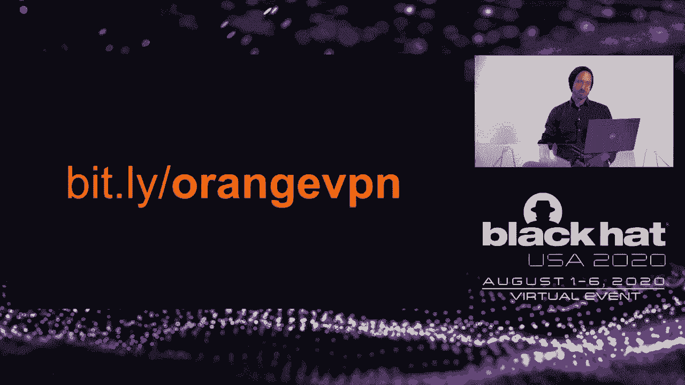

# P17：17 - Virtually Private Networks - 坤坤武特 - BV1g5411K7fe

 Hello everyone。 My name is Shalf and Evolt。 I'm joined today by my colleague， Vikas Ross。

 We are both researchers for Orange Cyber Defense， which is the cybersecurity division of Orange。

 Mobile。 We greet you today from the beautiful city of Cape Town， which is in South Africa。

 Please take a moment to follow us on Twitter。 Our handle is at the bottom of the page。 Vikas。

 knows something about almost everything and I know Vikas。 But we would really appreciate。

 you reaching out and linking up online。 Research is really the story of how we seek answers。

 to questions。 The story I want to tell you about today is how we've been trying to discover。

 the answer to the question， do VPN technologies actually work？ We're not talking today about。

 bugs or vulnerabilities in specific technologies， but really examining the question of whether。

 a specific class of technologies provides the kind of protection that we expect in a。

 scenario that we believe is common， used in a way that we believe is common and from places。

 that we believe is common。 Our story has a lot to do with travel。 As professionals， like。

 many of you， Vikas and I spend a lot of time travelling。 In fact， if you live as far away。

 from everything as we do， you pretty much have to get on a plane just to get a McDonald's。

 So we spend a lot of time flying。 And if you spend a lot of time flying， like I'm sure many。

 of you do， then you also encounter this a lot。 It's free Wi-Fi。 In fact， I think we all know。

 how it works as soon as you get off the plane， first thing you need is a toilet， the next。

 thing you need is a coffee and then right after that it's free Wi-Fi。 Except as we know。

 the public Wi-Fi that we use is almost never actually free。 There's always some kind of。

 transaction involved。 You either have to pay， I suppose then it's not free， or you have。

 to provide some personal information， or at very least you need to accept the terms and。

 conditions that this access point demands from you。 And so we interact with something。

 that's called a captive portal。 We all know what I'm talking about， captive portal is。

 that web application where you're asked to provide some information about yourself， accept。

 the terms and conditions， perhaps into some credit card details。 But whatever the case， is。

 there's a transaction happening and it's being facilitated by this technology， the captive。

 portal technology。 And the word that I want to focus you on is that word captive， because。

 it really captures a lot of what we'll be talking about today。 The captive portal puts。

 you in this kind of weird purgatory state where you're sitting between a space where you've。

 connected to the Wi-Fi land， you've got network settings， your machine believes it's connected。

 And in fact you don't have access to the internet and you're in this in between state that we'll。

 be referring to as captured。 So bear that in mind as you listen to the rest of our presentation。

 And it creates all kinds of weird scenarios。 So what you're seeing here is a screenshot。

 of a typical Windows machine that has found itself in this captured state between connecting。

 to the Wi-Fi network and being on the internet。 And the dialogues you're seeing are all the。

 sort of Windows gadgets and widgets and applications and browser tabs going crazy because they are。

 connecting to a server that's presenting the wrong SSL certificate。 And that's happening。

 of course because the captive portal has redirected that traffic to itself， it's serving its own。

 certificates and applications。 I've recognized that that certificate is not correct。 As a。

 sort of curious aside， one of the things that I find relatively amusing is how readily and。

 desperately these applications want you to accept that state by giving you that yes， accept。

 connect， proceed button is particularly amused by a zoom who make their button big。

 and blue and bold so you can hardly miss it。 But also by that VPN provider on the bottom。

 right there who not only invites you to connect but also invites you to remember that setting。

 so that you can continue connecting to the wrong VPN server forever without any inconvenience。

 This is just one example of the sort of curious state that captive portal puts us in。 This。

 one is a little harder to grasp but it involves the DHCP settings that are sent by the Wi-Fi。

 AP to your end point。 And we know it happens with DHCP， it's all the typical things you。

 get given your IP address， your subnet mask， default routes， DNS servers。 But I want to。

 draw your attention to this other setting here also which is the domain search suffix option。

 15 I think。 And you'll note that what the search suffix is used for is when your machine。

 tries to access a resource on the network via a name that's not fully qualified。 In other， words。

 the first part of the DNS name and not the back end of the DNS name。 Then this search。

 suffix will be appended to the name that you entered and that will be used to resolve DNS。

 and provide you with an IP address in the end。 And where that becomes problematic is what。

 we'll see in the next example is when the asset that you're accessing is being accessed。

 by a name which is not qualified。 And in this example what you're seeing is a user connecting。

 to printer， a corporate printer called printer HQ。 That printer is captured in their config。

 without a fully qualified domain name。 And those without the end bit。 And so what's happening。

 is the stack is adding that DNS suffix to the end and resolving that。 And what ends up。

 happening in this case is that that fully qualified name does get resolved， results in。

 an IP address which is an entirely different place in this case an IP address on the internet。

 And Vickers will go into this in more detail but I think you can start to understand why。

 that could be problematic。 And what these examples led us to in our story is to start。

 asking the question what is the role that the VPN technology should play in a scenario， like this。

 Because notionally it would seem to us that in establishing this encrypted。

 and secure tunnel between the end user and the corporate network what we expect is a。

 kind of a network and security equivalency where the set of network conditions and security。

 conditions that a user on the Wi-Fi LAN experience should be equivalent to what a user connected。

 to the corporate LAN should experience。 That in our mind is notionally the expectation。

 that a VPN creates and it's that notion expectation that we want to test in our research。 And that。

 network and security equivalency is achieved by the VPN by providing three things。 It's。

 confidentiality， integrity and access control。 So diving into little more detail about the。

 research we'll be presenting today。 The first thing I need to just touch on very briefly。

 is some of the assumptions that we're working from。 And we're going to these in a lot more。

 detail on the website that we've created for this research but just very quickly we're。

 proceeding from the assumption that working from home via Wi-Fi is common and under COVID-19。

 we think that's a safe assumption to make。 In normal life when we were traveling around。

 we believe that working via Wi-Fi access points that have captive portals is common that's。

 a scenario you encounter on a daily basis and it's growing。 We believe that home routers。

 and that kind of home router technology stack can be expected to be insecure or at least， purely。

 poorly configured。 It's not a technology that we have control over like we have control。

 over our corporate technologies。 We believe those kinds of technologies are frequently， targeted。

 We've seen examples of that Mariah， the Mariah botnet being the most recent example。

 And we believe that when VPNs are deployed in corporates it's common practice for those。

 VPNs to use split tunneling which Vickers will go into in a little bit more detail。 I just。

 want to make one more point here which is that although our story started off by us examining。

 the scenario of the captive portal it soon became clear to us that there's actually at。

 a theoretical level no difference between a captive portal which is built for that purpose。

 and a home router Wi-Fi AP that's been compromised and is reconfigured to act in the same way。

 as a captive portal。 So when we talk about captive portals and we talk about home routers。

 that have been compromised we're talking kind of about the same thing。 So it's either compromised。

 or malicious Wi-Fi access points。 And then given that scenario we want to argue that there。

 are six specific technical threats that we believe a VPN should be able to protect us， against。

 Obviously other scenarios but these are the six specific scenarios that we identified。

 for our research and which are results we based on。 The first is that we think the VPN。

 should prevent sniffing from happening。 An attacker should not be able to glean information。

 on the network about your host because of this tunnel that's supposed to protect us。

 Secondly we think the VPN should protect us from sort of DNS meddling attacks right。

 when you send out a request for a DNS name to be resolved。 The response that you get when。

 you're sitting on that Wi-Fi AP and using the VPN should be the same as the response。

 that you expect to get if you were sitting in the corporate network。 And if that's not。

 the same then we failed on that scenario。 Thirdly we believe the VPN should be protecting。

 us against kind of spoofed websites for phishing any kind of meddling with a web interface。

 that happens between the user and the corporate network。 And again the litmus test here is。

 equivalency。 We're not talking about spoofing sites that occur once users broken out onto。

 the internet。 We're talking about scenarios that are possible because the user is in this。

 Wi-Fi state on this Wi-Fi network and not on the VPN。 We think there's a very real risk。

 of responder attacks being launched in this scenario。 And so we want to test and ensure。

 verify that a user who's connected to this remote LAN is not more susceptible to SMB responder。

 type attacks than a user that's sitting in your private network。 We want to ensure we。

 want to test that the interaction with the captive portal doesn't introduce the opportunity。

 for an attacker to inject malicious JavaScript into the browser and therefore repurpose the。

 browser into some sort of attack tool。 Typically for example tunneling via the browser into。

 the corporate network。 And then finally we want to examine the role that IP version 6。

 plays in this captured state。 And we would expect that a host that is on a Wi-Fi network。

 should not be more susceptible to a tax or interaction with its IPV6 stack than a host。

 that's on the corporate network。 So those are the six specific threats scenarios that。

 we're interested in examining and those are the scenarios that our tests will be based， on。

 In terms of an approach we don't have to go into this in too much detail but basically。

 what we wanted to do was create a standard set of scenarios and a standard set of tests。

 and repeat those tests against a range of significant vendors in this space。 We have。

 at this point that we're recording this video we've identified Cisco， Pulse， Checkpoint。

 Fortinet and Palo Alto Networks。 Our goal is to expand that over time and so again we。

 would ask you to visit our website we will be keeping this research updated。 And effectively。

 what we want to do is identify standard equivalent configurations across these vendors that we。

 can compare with each other in the context of those six threats scenarios that we identified。

 Once again here it is big and bold。 Our most current data will be reported on our website。

 we're recording this sometime before you will be watching it。 So if you want the updated。

 information please take a moment to visit the site and we'll also be sharing other resources。

 videos， examples， PCAPs， those sorts of things there you can take a photo of your computer。

 screen。 And so finally before I hand over to Vickers in terms of summarizing the research。

 question that we're looking to answer today what we're saying is that if the VPN can be。

 considered the logical extension of the private network to another location。 If we expect。

 that reasonable for us to expect network and security equivalency when the VPN is established。

 and if we assume that that other location is a Wi-Fi network that's either malicious。

 or compromised then the question we're trying to answer is how much protection do these VPN。

 is enterprise VPN technologies provide against the common and realistic threats that we think。

 we would expect to encounter today。 And with that I'm going to hand over to my colleague。

 Vickers Ross。 Thank you， Shaw。 And let's now dive a bit into the technical concepts that's pertinent。

 to this research。 Let's start off looking at captive portals。 A captive portal can be described。

 as a very simple piece of setup kit typically like an access point， a router with Wi-Fi， a。

 call and maybe a website on it。 Now， Shaw described scenarios earlier on how you would interact。

 with a captive portal。 But let's look at it a little bit deeper in a technical context。

 After your Wi-Fi， after your device connected to the Wi-Fi you would typically require DHCP。

 configuration or network configuration。 And this is provided by the DHCP service hosted。

 on the captive portal。 The next part is the operating system on your device will try。

 and determine whether or not it has internet access。 That internet access test it basically。

 requires it resolving a URL and getting a response from it。 Before you can get the URL。

 it needs to have the DNS settings resolved of the host interested。 So it uses basically。

 the DNS server of the captive portal to get an IP address。 This IP address is now used。

 to do an HTTP request。 And this is where the captive portal actually starts meddling with。

 this whole process。 It effectively intercepts that HTTP request。 And it presents a response。

 and HTTP response back with a status code of 302 meaning temporarily moved somewhere。

 else and it provides a new location for this website being the captive portal's website。

 The OSD takes that this shenanigans is going on and it realizes well I was testing whether。

 or not we're behind the captive portal so this is probably indicative that we are。 It。

 will then launch a browser which it presents the captive portal interface to use the user。

 on the device。 You now have to satisfy the captive portal questions except terms and。

 conditions and then if the captive portal is happy allows you internet access。 So now。

 your operating system knows it's online because while you're trying to resolve the captive。

 portal state it literally hammers that same request over and over until it sees well。

 Connections are being accepted and I'm happy with the response。 So let's look at the next。

 concept which is important is the DHCP aspect that we encountered earlier in this captive。

 portal state。 DHCP is important here because that's probably one of the first packets that。

 gets broadcast by your client when it reaches the captive portal Wi-Fi。 The device on your。

 side asks for a DHCP service to provide it with certain options。 At the same time it。

 divulged some information about itself。 The captive portal service DHCP service responds。

 back saying oh by the way here are the options you're looking for and this includes important。

 information like your IP address， DNA servers and here's the most important part that's for。

 pertinent for our research being the domain name and the DNA search suffixes。 Options 15。

 and options 119 which are all included to earlier。 Those DNA suffixes are important when。

 trying to resolve unqualified domain names and we'll see how that plays out a little bit， later。

 Other information provided includes MTUs， routing etc。 It's quite a rich set of。

 options available to us。 Next let's look at VPN tunneling configurations。 We will probably。

 see two most pertinent ones being split tunneling and full tunneling and I'm going to go out。

 on a Lemia saying that split tunneling is probably the most dominant configuration set out there。

 but it's not the only one。 Split tunneling you're probably all familiar with。 Information。

 or packets or traffic directed at the corporate land goes over the VPN and all the other traffic。

 goes directly to the internet。 Full tunneling as I suggest all the traffic goes to the VPN。

 server on the corporate land side and at that point the policies and routing rules apply。

 as the corporate dictate so it might even allow internet traffic to be routed back out。

 of the internet。 So that's the important concept to understand as well。 Next is the role the。

 IP6 plays in captive portals。 It's not that common at this stage but we believe it is。

 becoming more and more common。 IPV6 is a very chatty protocol unlike IPv4。 IPV6 relies on。

 neighbor solicitation and reticillatation packets to be broadcasted and it gathers information。

 that way。 So it falls the space where ARP would normally play that role for us。 IPV6 can also。

 be configured using DHCP V6 which has the similar type of DNS suffix options available to it。

 and then there are all sorts of other options also available to us but IPV6 typically is。

 seldomly considered in security configurations up front。 It tends to become a question later。

 down the line so that's why we included IPV6 as a consideration。 Another interesting topic。

 is captive portal lockdown configuration or sometimes referred to as mitigation mode。

 These are a set of features or options that is enabled on the VPN client as well as enforced。

 by the VPN server to be able to protect against certain scenarios that we will highlight later。

 down the line。 So these are specific sets of configurations to deal with that mode specifically。

 which we applied to captive portals as well。 So just a comment on when we looked at configuration。

 of captive portals in lockdown mode。 We looked， Charlie said we looked at five vendors， VPN vendors。

 What was notable， there were two of those vendors actually had a reasonable set of lockdown。

 modes up front and was clearly documented and clearly visible in its configuration sets。

 They also included what we call captive portal mini browsers。 These are proprietary browsers。

 that is used for when you engage with captive portals。 So it is a buffer or a sandbox environment。

 in which a browser is displayed to the user as opposed to using your default browser on。

 your desktop that might be manipulated in other ways later down the line。 Two other vendors。

 that we looked at didn't have this feature and they didn't speak directly to lockdown。

 configuration as well but they allowed you with a very rich set of features that you。

 could configure how you chose to based on the scenarios you're trying to mitigate。 Interestingly。

 one of the other vendors， VPN vendors didn't have a IPv6 out of the box mitigation directly。

 for SSL VPNs。 It was only applicable when looking at IPsec VPNs。 We predominantly looked。

 at SSL VPNs because SSL VPNs tend to be the most compatible when dealing with captive portal。

 environments。 Vendor 5 was still busy testing so by the time that you reached our website。

 that you pointed out you should see an updated version of configuration or updated findings。

 for this vendor。 Now going on to our research and findings。 We selected in this metric you'll。

 see we selected a set of features and that's what we refer to as our lockdown feature that。

 we believe speaks to the test cases that you would probably encounter in a malicious captive。

 portal environment。 This is by no means a complete set of features but these were put。

 in an art testing and we feel that they cover the most scenarios that is out there and is。

 applicable。 Also this table might change by the time that you view the website at the。

 time of this recording this was the state of our findings with one vendor's findings。

 totally outstanding。 Next so let's revisit the question that Cheryl asked earlier about。

 what do we expect VPNs to do and how did I function。 In there if you recall Cheryl mentioned。

 that we expect basically VPN resource the VPN to allow us to access corporate resources。

 These corporate resources should basically give us the same type of capabilities as if。

 we were in that land environment。 So evaluating that VPN in the environment that we are looking。

 at we saw three categories that we used and each category we had certain conditions that。

 we tested for。 In the first category being confidentiality we looked at whether or not。

 the VPN played any role in mitigating spurious broadcasts of the client。 Then we also looked。

 whether or not the VPN played a role in mitigating DHCP settings specifically DNA search suffix。

 settings that was supplied initially。 Thirdly for that category we also look at the VPN。

 plays in your role in preventing the broadcast or the leakage of sensitive information。 Next。

 under integrity we determine whether or not the traditional or typical person in the metal。

 style attack applies here and where the resilience changes for credential captures or credential。

 theft if VPNs are in play。 Lastly with access control we looked at whether or not the man。

 in the metal stalled up of attacks as well as malicious attackers could use the VPN tunnel。

 to actually get into the corporate land of why whatever mechanisms they chose。 So let's。

 look at the test environment quickly。 Our test environment was very basic very simple。

 We had a virtual machine that was served on a desktop with VMware and it had a USB Wi-Fi。

 adapter plugged into it that allowed it to bridge network connectivity to our captive， portal。

 Our captive portal was basically just a simple off run of the mall router paid with。

 the Kali Linux environment that played the role of the malicious attacker and the virtual。

 machine environment hosted our end point servers in a cloud environment that we could use for。

 our testing and that basically simulated our lab environment。 Our test approach and this。

 matrix here is important for basically describing the four types of scenarios that we tested。

 So let me describe what you see here。 On the left hand side you see a column that says。

 captured and online。 These are connection states。 So in other words captured state is a very。

 important state that show in eluded to earlier。 This eludes to the fact whether or not we are。

 inside the captive portal state and we don't have internet access。 So in other words you're。

 sitting in a holding pattern almost and you can only interact with that captive portal and。

 maybe some resources on that network。 You do not have internet access。 Next online means。

 that you actually can get onto the internet which means you satisfy the captive portal state。

 The standard mode and the lockdown mode is the configuration of the VPN that we actually， applied。

 So which means we have four sets of tests that we do in each set of configuration。

 and each state connection state。 So for example in the captured state standard mode basically。

 no internet access and assuming split tunneling coming back to saying that we assume split。

 tunneling is a default state using off the shelf configuration。 No extra configuration。

 It was added just what the vendor provided and based on the guided。 So if the VPN vendor。

 or the configuration suggested we should use a different tunneling mechanism we try to， follow that。

 In the lockdown section you see we try the best VPN configuration for captive。

 portal environments which means that it should speak to the test that we throw at it and we。

 should be able to see how they respond to that。 So that's the best way that we can actually。

 protect the user。 Let's look now how actually how our test cases stacked up and what our。

 results was。 So this slide here is basically our findings。 The TLDR。 In a nutshell there's。

 a lot happening on this slide but it's basically just taking what we shared you in the previous。

 slide with our findings colored in there。 So you'll see in the one quadrant here the first。

 scenario that I suggested with the captured state with the standard mode configuration。

 there's there's a grid with six columns and six rows。 The columns indicate our test cases。

 the rows indicate the vendor the VPNs that we tested。 The red color suggests a state outcome。

 state will fail while the green color speaks to a successful outcome and the gray would。

 indicate we haven't tested that vendor which this slide might change at the end by the time。

 you visited but for now this is more or less at the time of recording what we find。 And。

 in this state with scenario one being the one we highlighted here basically our initial。

 concern about VPNs doing contribute almost nothing to actually protecting the user。 In。

 the second state I highlighted here with online and still in standard mode there is some improvement。

 but not much so even a careless configuration of your VPN would resemble something like。

 this even if it's not in the captured state so not that much better。 Looking at a captured。

 state but with lockdown configuration we see there is an improvement but still there are。

 some test conditions in captured state that cannot be mitigated even though the configuration。

 of those features were enabled。 Moving on to the final configuration test set we see that。

 there's a drastic improvement for an online configuration in lockdown mode but even with。

 this the vendors features and stuff that always work consistently as you would expect them。

 to work but this is in improvement nonetheless。 Coming back to Scholz early state about a response。

 style attack the column I highlighted there speaks to a test case that we used the responder。

 in to test with。 The responder is a very well known well understood test scenario involving。

 a tool that mimics certain types of services for example it mimics a windows server with。

 the intention of soliciting a divulging of hashes it's an Intel Mv2 hashes for example。

 and as you can see in the highlighted that column for that scenario it failed even in。

 that call in that mode as well it failed and it marginally start improving as we go to restricted。

 configuration but also as we move from captured into an online state。 So let's see how this。

 actually looks when we apply this in an environment。

 Looking at the demo videos Scholz will be available。

 on the website in the URL that we provide so we'll just look now at some screen captures。

 Here you'll see a VPN client that realizes it is behind a captive portal。 It indicates。

 that also by popping up the captive portal mini browser highlighted here and it resembles。

 a web browser to some degree but this is this is purely a proprietary interface for that。

 specific VPN。 Next we highlight the fact that the DNS cache is still active the DNS cache。

 is not flushed and it's probably still resolving in the background which means we can speak。

 to a DNS server most likely the captive portal。 Here we enact the actual test to see whether。

 or not we can solicit a DNS responder attack by doing a connection attempt to unqualified。

 a UNC path highlighted here which means that it should try and connect and find a connection。

 In the wire shock trace what we show there is actually if you notice that the unqualified。

 hostname now all of a sudden have a fully qualified hostname and that's important to。

 realize that all of a sudden a domain name now appears as part of that hostname where。

 did that get that from。 Remember our option 15 and option 119 that we spoke about basically。

 the DHCP settings of the VPN provider as well as the DHCP settings of the captive portal。

 provided these options and it is injected in the configuration and now our host is trying。

 to say well does anybody know who this host with this suffix is and it try and iterates。

 iterates until it gets an IP resolve and then if it resolves it actually just connects to。

 that and this is where the DNS of explains a role in actually allowing us to solicit unwanted。

 or solicit traffic。 So coming back to that you can see the same attack or same test repeated。

 with the wire shock trace in the background showing actually a successful connection established。

 to our responder and here is the responder window with the Intel Mv2 hash captured。

 Now let's look at this attack in a lock down mode while the VPN is connected。 So we're。

 going to basically have the same attack play out。 This state you can see the VPN realizes。

 it's connected to the internet。 It has established its VPN。 VPN is running full lock down mode。

 should now be engaged but when we run our test trying to do the same unqualified UNC path。

 connection we see that in the background of wire shock it actually successfully establishes。

 a connection with our responder and the same scenario play out。 Some observations in dealing。

 with these VPN configurations。 I realized I'm dealing with quite a complex set of features。

 There's overwhelming number of knobs and bobs that you have to tweak to get some of these。

 things to behave in the way that you wanted to do especially in this type of test cases。

 that we set up that was quite overwhelming。 Also it speaks to the fact that training is， matters。

 experience matters as well as support from your vendors that you engage with。 That。

 ultimately qualifies selecting your vendors matters as well。 Another comment on captive。

 portal mini browsers they tend to be inconsistent in their behavior。 That might be a problem or。

 might have a user experience problem for non-technical users。 That might be presented in my case。

 I've seen the default browser pop up before the captive portal mini browser pop up and。

 that can cause confusion。 Another comment on mobile devices that we just tested to see。

 how they interact with captive portals in a similar way。 We noticed that captive portals。

 behavior inside of mobile operating systems are a lot more natural well taken care of。 It。

 feels more baked into it。 So this is a lot to be said about the desktop environments that。

 we find ourselves in and how that speaks to captive portals。 Thank you very much。 Joel？ Awesome。

 Thanks， Vickers。 So it's for me to try and wrap this up for us。 I need to take。

 a few more minutes of your time。 If we summarize what we're saying， said a lot， but if we summarize。

 it， basically we're arguing that we believe that there is a realistic and common set of。

 conditions or it's a common scenario where users are working from either compromised or。

 malicious Wi-Fi access points and we think that scenario needs a place in the corporate。

 threat model。 Captive portal is common as we've argued and we think it's becoming more， common。

 But to be clear， captive portal represents an example of this state， of this captured， state。

 It's not a prerequisite for the set of problems that we're talking about。 And then。

 I think what's really important is we're arguing that we believe that this expectation。

 of network and security equivalency that we spoke about， which is supposed to be provided。

 by the VPN， we think that's realistic。 And so we think that there's a realistic expectation。

 that the VPN should protect us against the threats that we outlined。 And then if we， if。

 I just draw your attention again to this table that Vikas shared with us， the first thing。

 you've got to take away from this is in that top left quadrant where you see all of that， red。

 that's the VPN not protecting you against any of the threats that we outlined for any。

 of the vendors that we tested for。 And of course， it's perhaps not reasonable that the VPN can。

 protect you at that point because it's not connected。 But the point is there is an expectation。

 of equivalency and that expectation is fundamentally not being met。 And then as Vikas pointed out。

 is as we traverse through those four quadrants from top left to bottom left and then up to。

 top right and then down to bottom right， what you see is that there's less and less red and。

 more and more green。 So we are experiencing higher levels of security， but at no point。

 do all the vendors protect us against all of the tests， even right down to that bottom。

 right and quadrant where we're in lockdown mode。 And in other words， all the appropriate。

 features have been put in place and the VPN is established。 Even at that point， there。

 are still some of these threats that we're not being protected against。 So the effectiveness。

 of these offerings vary substantially and frankly， quite erratically across the different vendors。

 What do we do about that？ Well， I think there's some basic technical things that should be。

 quite obvious by now， so I'm not going to spend too much time on them。 Firstly， you've got。

 to understand and you've got to use these lockdown features。 And I'm not saying that's。

 easy or that your users are going to like it， but understand that without those lockdown。

 features enabled， things are looking pretty bleak for you in terms of the protections。

 that we think you're probably expecting。 In doing that， you've got to make sure that you。

 control and centralize DNS。 A lot of these attacks pivot on our ability to manipulate， DNS。

 And if you can prevent that from happening， then you're looking much better。 In doing， that。

 you want to make sure that you're fully qualifying your internal DNS names。 Again。

 domain search suffix poisoning is not essential to this， but it's certainly a very easy way。

 to enact some of these threats。 So if you can fully qualify your internal domain names。

 that's going to make your life better。 You want to avoid split tunneling if you can。 I。

 know that there's a resource constraint， but certainly， and we will publish a version。

 of this chart where we have full tunneling enabled in all cases and you'll see it looks。

 a lot better than when you're using split tunneling。 You want to be careful of session， time out。

 One of the things that we noticed， which is quite curious， is that if you allow。

 your VPN session to time out， say every 24 hours， then you end up in a state where the。

 user's got his laptop connected to the Wi-Fi， goes to sleep or goes to the toilet， comes。

 back and the session is timed out and it all drops into the clear again。 So I'm not sure。

 why the VPN session is time out， but they shouldn't。 And then finally， I think what。

 should be apparent is that you want， in addition to your VPN， you want to have some kind of， EDP。

 EDPR， firewall， something that's not only protecting you against inbound traffic， but。

 it's also preventing data from leaving the machine， particularly that like full full。

 five outbound is a big problem。 At a slightly high level， tactically， what's clear here。

 is that we need to understand and remap the threats that we're facing to the technologies。

 that we're using。 It's a complex jigsaw and Vickers spoke about how nuanced and how many。

 knobs and bobs there were in that VPN configuration。 Each of those knobs and bobs has a specific。

 impact on what element of the threat models being addressed。 You need to understand that。

 you probably want to engage with your vendors to help you with that because there's a level。

 of complexity is quite overwhelming。 And you probably need to think carefully about your。

 vendor choices also because， as we said， the behavior varied quite a lot。 And so you're。

 probably going to want to look at this almost at a feature by feature level to determine。

 which vendor is going to give you the right mix of features for what you understand your。

 threat model to be。 And then， and I'll go into this in my final and next and final slide。

 but we really think that what this illustrates is that perhaps it's time to revisit the。

 paradigms that we're applying here。 And maybe there's fundamentally different ways to think。

 about this problem。 Like， instead of trying to protect our users on the free Wi-Fi， maybe。

 we just get them to avoid free Wi-Fi completely。 And instead of trying to force them into this。

 tunnel and bring them into the corporate network， maybe we leave them out of the corporate network。

 and just use basic controls like SSL certificate pending and strong authentication to facilitate。

 access to the resources they need。 If we can get rid of Active Directory and all of those。

 Microsoft protocols when the user's not on the network， again， a lot of this stuff goes， away。

 And of course， that leads towards the whole discussion around trust， which is a much。

 bigger topic for us to discuss today。 I do want to sort of claim my time or claim the。

 privilege of just kind of reflecting on this at a slightly higher level， maybe a little。

 philosophically before we're done。 You know， it occurs to me that the whole notion of free。

 Wi-Fi immersion has become popular because businesses see it as a way to attract clients。

 You've got to be able to give your clients free Wi-Fi， otherwise， you know， they're not。

 going to come and drink your coffee。 And as that grew， what emerged was these legal and。

 liability concerns。 If someone's using my Wi-Fi， am I responsible for them if they do something。

 bad， you know， who the police are going to ask， et cetera。 And so what the lawyers did。

 is they insisted that there be some kind of transaction between the Wi-Fi provider and， the user。

 And how that was enforced was via this idea of a captive portal， which is actually。

 a relatively new idea。 I think the RFC dates back to 2015。 So the captive portal is put。

 in place to formalize the transaction between the user and the provider。 Once the captive。

 portal is there， of course， the business has other ways to monetize that transaction now。

 by collecting your data exhaust， your behavioral data， or selling your ads， or， you know， whatever。

 the case may be。 But it's driven by business requirements of the provider， not by user。

 requirements。 And it creates this awkward state， this purgatory， this technical purgatory。

 that we spoke about。 And so what happens is the VPN providers who were really used to。

 dealing with the previous version of the internet， now I have to pivot to deal with this new。

 reality where you sit in， you know， Wi-Fi purgatory。 And they do that by implementing。

 all of these highly complex， you know， nuanced， you know， technical features， which our research。

 shows really don't work because fundamentally the odds are stacked against them。 In that。

 state where the machine is captured on the Wi-Fi network but can't talk to the internet， the。

 VPN technology really just can't do anything。 And so we stand here today saying to you， well。

 actually what you need is more technology。 You need to add EDP or EDR or firewalls or whatever。

 to protect you in that scenario。 And so this sort of cycle continues。 But really what's。

 happening is we have a struggle between two business models。 There's the business that。

 wants to provide you for your Wi-Fi because respectfully it serves them。 And then you have。

 the businesses that want to sell you protections because that's what they do。 And you're kind。

 of struck between the two。 And it occurs to us that if all you did was take the free， Wi-Fi out。

 then all of these other things would also just disappear。 And so I think this。

 kind of speaks to the point of maybe readjusting our paradigms a little bit and asking ourselves。

 the question， you know， is free Wi-Fi really free， I guess。 And then finally on a closing， note。

 I just want to take one minute to say thank you very much to the vendors that supported， us。

 All of the VPN vendors have been engaging with us。 They've been assisting us in numerous， ways。

 But I also want to give a particular shout out to the team at finite state。 They're， an IOT。

 a vulnerability assessment company that assisted us in analyzing almost 800 VPN。

 firmwares to try and understand some of the things that we're looking for。 They have a。

 remarkable data set and a remarkable technology。 And we just wanted to say thanks to them and。

 encourage you to have a look at what they're doing。 And with that， we're out of time。 All。

 that's it for us is to say by a donkey， which is off your accounts for。 Thank you。 And we。

 look forward to hearing your questions。

 Hi， everyone。 Thanks for joining us tonight。 We have just one minute， I think， for questions。

 So if there's anyone with a question or comment， then shoot and I'll make Vickers answer。 No。 Yes。

 All right。 Well， let me just leave it to say， as we said， numerous times the updated。

 findings are on the website。 We're continuing to test with the fifth vendor and we hope to。

 add more。 So visit us there from time to time。 Also， I've updated the white paper with a copy。

 of that summary table。 So if you download the white paper， you should expect to see that。

 summary table right front and center near the top of the paper。 Correct。

 And to answer Daniel's question there or statement， it is important to combine different。

 solutions because I mean， to be fair VPNs aren't a single solution for everything。 And。

 they address a specific need， which is grown out of a long history of requirements built。

 up over time。 So I think VPNs alone can't do the job。 And it's a good indication as well。

 that we need to combine our efforts and understand our threat landscape that we know how to address。

 these things。 Any more questions？ There's no more question。 Thank you。 Thank you very much。

 everyone。 Visit our website， follow us on Twitter， and we'll speak， to you soon。

