# P18：18 - Plundervolt - Flipping Bits from Software without Rowhammer - 坤坤武特 - BV1g5411K7fe

 Hello and welcome to our talk。 My name is Daniel and I will start with introducing you。

 to Rohammer and you might remember Rohammer JS。 It took the known Rohammer attack and was able to。

 gain root privileges just from a web browser from a website。 How do we get to these bit flips？ Well。

 Rohammer is a problem in DRAM service and if you look at DRAM you will see that this chip is split。

 into multiple banks and you will have rows maybe something like 32，000 rows and these rows also。

 have a row buffer。 If you read from a row then things have to be copied into this row buffer。

 The rows themselves they are basically they store the single bits and that's basically。

 capacitor and transistor。 The capacitor is charged to store a value of 100。

 Okay and the next step how does Rohammer work？ Well these cells these are capacitors they leak。

 over time so they need to be refreshed regularly。 And what you can do here is you can access certain。

 rows in this DRAM bank and by accessing a row you will discharge not only the cells that you are。

 reading and copying into the row buffer but also close by cells that are in proximity to these cells。

 and this is what we call the Rohammer effect。 So to guarantee data integrity you have to refresh。

 very frequently so that this effect and other effects don't occur。 So you activate a row you。

 copy it into the row buffer you activate the other row you copy it into the row buffer and then。

 after some time you see bit flips in the middle row。 Now what can you do with that？ Well you can。

 exploit this in different ways。 For instance flipping bits in code and here is an example for instance if。

 you look at sudo there is this jump equal instruction that is used for the password check。

 If you enter， the password correctly then the jump equal will be true and it will jump to the location and will。

 give you this elevated privileges。 However if not then it will terminate and you won't get the。

 privileges but what happens if we flip a bit in exactly this jump instruction well if we flip the。

 first bit it becomes the hard instruction x or push some prefix for other instructions。

 other jump instructions that might be exploitable already and the last one great if we flip one bit。

 we go from jump equal to jump not equal and then sudo will give anyone root privileges who does not。

 enter the correct password but not to the person entering the correct password。 This is great and。

 this allows us to exploit row hammer but DDR3 is affected DDR4 is affected even ECC RAM can have。

 arrows that are not corrected by the integrated arrow correction。 The question man is if you think。

 about SGX in terms SGX security enclaves they are integrity protected and this would prevent row hammer。

 in principle because you will detect the integrity error。

 Actually Daniel this is meant to be a talk， about how to flip bits without row hammer。

 Sorry yes I was getting to that kit I was， I was getting there but can you please not just walk into my slides。

 Well I'll take over for a little bit， so let's talk about plunder vault。

 Plundival is flipping bits from software but without row hammer。

 and the first thing we did is we did something called fault injection。 I know what fault injection。

 is I do that all the time so you have to have some specialized lap equipment and you maybe need。

 some to solder some cables to the pins of the chip and then you can play around maybe with。

 the voltage or so to flip some bits in the chip。 You mean like the picture well actually not anymore。

 so now you can modify hardware from software so you can effectively create hardware fault injection。

 attacks using software。 Okay so you say basically this replaces my whole lap equipment and so on。

 with this memory mapped register so what is that。 That's exactly right so you can in software。

 write to a memory mapped register which then modifies the hardware and the reason you might want to do。

 this is because you might have a gaming machine that you want to respond really really quickly。

 or you might have a computer in the cloud that you want to have low power consumption or your。

 machine might be getting really really hot and this gives the operating system a way to dynamically。

 change maybe the frequency or voltage to protect the chip。

 Okay it sounds like a lot less hassle than， like fiddling around with the hardware and all the time we short something and destroy something。

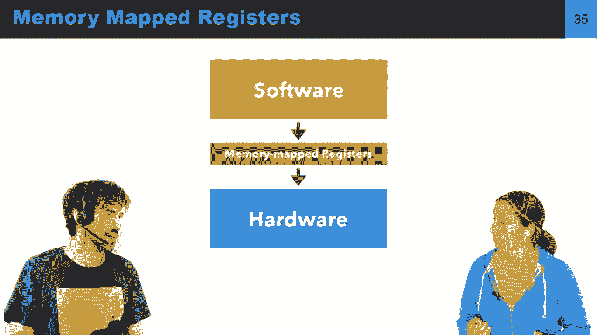

 Yeah and this is called dynamic voltage and frequency scaling。 This has been used in the first。

 of its kind attack in something called clock screw。 Clock screw exposing the perils of security。

 oblivious energy management and what they did is in software they modified the code which changed。

 the frequency which caused fault and from this they were also able to fault something inside。

 trust zone because the frequency and the voltage regulators are the same they manage the same。

 voltage and frequency whether you're running untrusted code or theoretically trusted code。

 and this is their attack。 They were able to infer a secret AES key that was stored within trust zone。

 and they were able to trick trust zone into loading a self-signed application。 Not long after there。

 was another attack very similar called vault jockey again this focused on an arm chip though。

 they were both attacks against arm。 Wait a second wait a second you're talking all about attacks。

 that already exist and yes okay we know you can attack arm chips like that but you know that。

 Intel has a very very big market share on desktop computers so maybe we should also look at Intel。

 processors。 Yeah but can you actually can you do that can you underclock an overclock on Intel I。

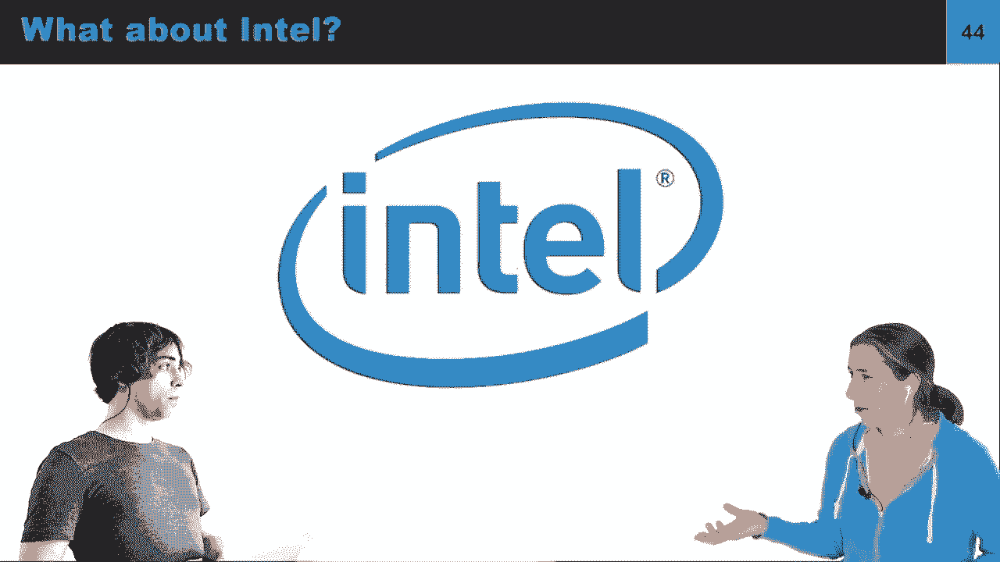

 don't know。 I actually did that when I was a teenager because my system was running two-pot。

 and then I undervoted it and these tools I also later on used this when I had some laptop。

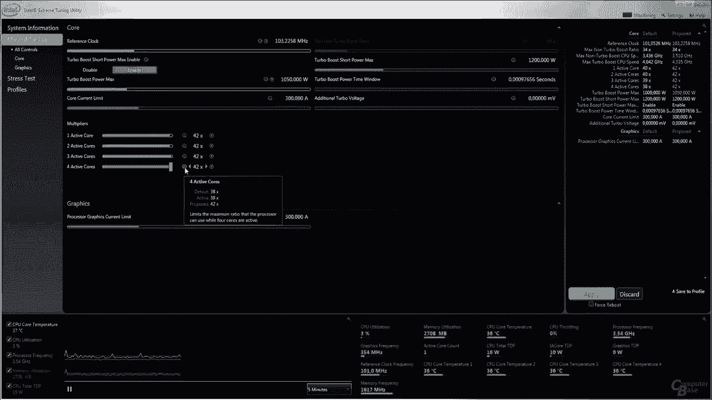

 The undervolting made a huge difference if you run a benchmark you would un-avolt the CPU。

 not change the CPU frequency you would undervolt it and then you would get a higher benchmark score。

 because the CPU runs into throttling less often and this is really interesting that means you can。

 actually change the voltage from software and I've also used different tools here for instance。

 I used the RN clock tool but there are many different tools that you can use for that。

 and today it's quite normal that you would optimize the clock frequency and the voltage。

 on gaming computers or also on laptops so that they don't overheat all the time。

 So if you look at these tools you will figure out that they use some secret， MSR。

 MSR hex 150 and we looked at this MSR and we can identify what bit serves which purpose。

 Yeah and this model specific register this MSR has many functions but we're just showing。

 the voltage functions here so you've got the offset which is over and undervolting。

 and you've got static voltage and we're specifically looking at undervolting。

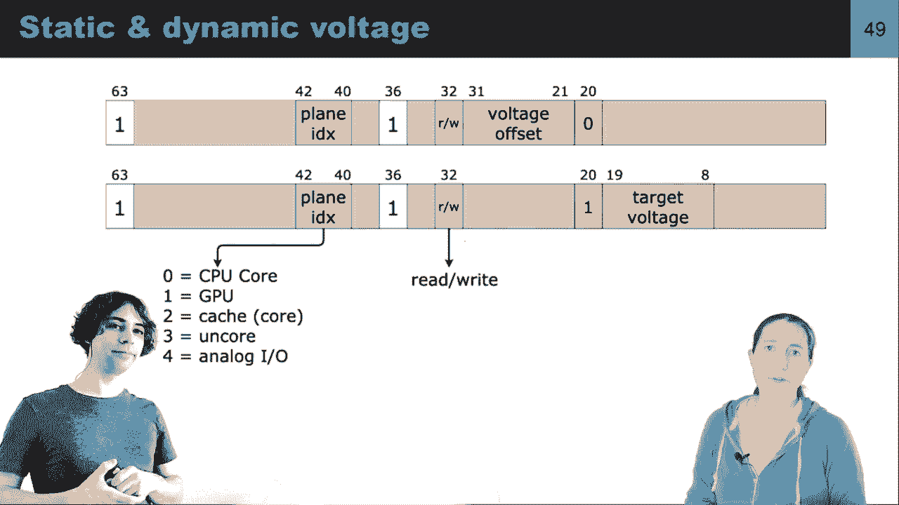

 So let's have a look at C code and see how you actually run that。

 So the first thing we're going to need to do is to set the frequency to be one specific thing。

 because we're going to be modifying the voltage so you want the frequency to stay the same but the。

 voltage to be changed and we're setting for this particular machine we're setting it to one gigahertz。

 and I'm just going to check that that has taken and yet we're now running at one gigahertz。

 and the next thing that we're going to need to do is to load the MSR driver because it's not。

 explicitly loaded and now we're going to look at how you actually change the voltage so what you。

 need to do is to open the MSR see if you can spot the line of code that does that。

 Yep there it is and here's where we're right to the MSR and you only need to write to one of the。

 CPUs because they all share the same voltage。 You'll notice that we're writing to two planes。

 plane zero and plane two that's the CPU core and also the cache and you need to write to both of。

 them because the MSR will take the higher of the two and now that we know that we are able to undervolt。

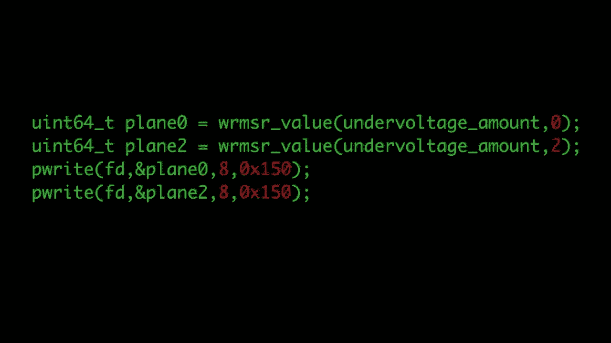

 what can we do with that？ Well let's write some code to see if we can possibly get this to fault。

 Can you see what my code is doing？ Okay let me check。 So this is a while loop and you initialised。

 bar and correct to the same value and then you also compute all the times same value again。 Yeah。

 So this will never stop。 Where did you learn to program？ Where did I learn to program？

 Birmingham University。 So let's take a look at it in action。 So here we go。 I'm multiplying dead。

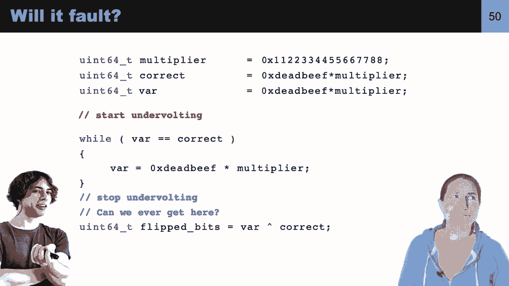

 beef by one， one， two， three， three， four， four， five， I'm undervolting minus 252 millivolts， three。

 four， five。 Oh come on yeah we got a fault we got an incorrect multiplication result and if。

 you look at the X or it's a bit flip。 So then we started just trying random numbers so we're just。

 generating a whole set of random numbers to see if we get any other faults。

 Can we fault a different， multiplication？ And again we got another bit flip。

 So at this point we just did lots and lots of， random numbers and we started to see not just one bit flip but there you go we've got more we've got。

 more bit flips and in different locations。 So we have just managed to create bit flips by lowering。

 the voltage in user space。 And this is where we come to Intel SGX because we need root privileges。

 to write MSR so a user space fault in the service not very useful because we if we're root we can do。

 anyway anything in user space right。 So that's where Intel SGX comes in as Daniel said it's a。

 technology to create trusted areas and claves in your in your Intel CPU。

 So from an untrusted program， you can create an enclave and then call trusted functions in that enclave but you cannot actually。

 look at the memory of the enclave。 So if for instance the cryptographic signature is running inside the。

 enclave you can kind of invoke signature but you cannot actually extract the key。 But if you're the。

 operating system can't you just look at the data anyway。 No so that's a crucial part of SGX so even。

 the operating system is untrusted and the operating system cannot read the enclave memory。

 So how is， it protected then how can you do that？ So that uses something called the memory encryption engine。

 that encrypts and integrity protects all the data that is written to external DRAM。 So when。

 Avana enclave writes something to memory it goes through this memory encryption engine is encrypted。

 with the key that is not accessible even to the operating system and is then written into DRAM。

 and vice versa when you read it back the memory encryption engine will first check that the data。

 has not been changed for instance not that you have not flipped a bit with rho hammer or so in。

 DRAM and then only if that's valid it will pass it on to the enclave and provide the decrypted data。

 to the enclave。 So if you inject a bit flip in enclave memory say with rho hammer what you get。

 is that you will basically crash the system so you lock the memory controller and the system holds。

 That's kind of like a denial of service attack but you cannot do much much more with that so you。

 cannot let's say flip bits inside enclave memory with rho hammer。

 You're saying that rho hammer didn't。

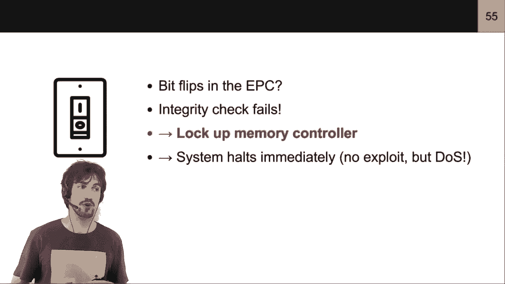

 work so my question is will plundival work？ So yes we will see that in a bit and plundival。

 works because you inject the fault actually inside the CPU before the data is written into the。

 encryption engine and from there then to memory so you kind of inject the bit flip in the CPU。

 and then it's encrypted integrity protected and written to memory end。 So here we can see your。

 multiplication example inside an enclave we go down in voltage 1 millivolt at a time and then at。

 minus 265 millivolts here we have actually managed to flip a bit in a multiplication and as you can see。

 that's actually exactly the same bit that we flipped in user space code before but this time。

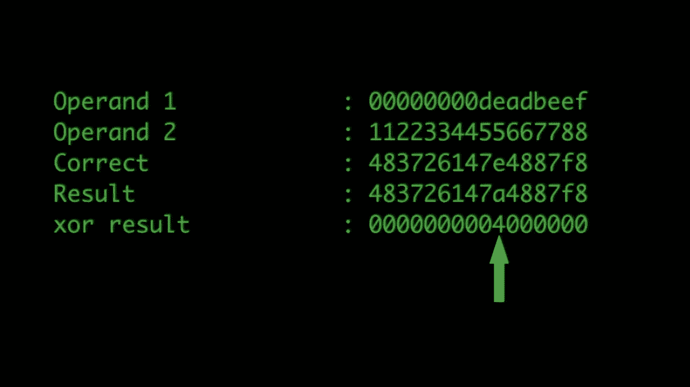

 inside an SGX enclave。 So yeah great you flipped a bit inside SGX and it didn't lock up you didn't。

 get an integrity error but it's just multiplications what on earth can you use that for？

 Well the multiplication maybe not directly but we can of course look at crypto so I like to break。

 cryptographic algorithms and I used to do that with hardware fault attacks and now I can do it。

 from software in SGX。 So for instance RSA well-known public key crypto algorithm and very often when。

 RSA is actually implemented that uses optimization called the Chinese remainder theorem and for that。

 we have a very very effective fault attack if we can inject a fault into that computation。

 So I will not go into the mathematical details too much here just say that in normal RSA you have。

 a public public modulus which is a product of two prime numbers and for instance when you decrypt。

 a message using your private key you take the ciphertext to the power of your private exponent。

 modulo n and then you get the message back。 Now in this Chinese remainder theorem that is a bit。

 more complicated so kind of what you do is you split up the computation into two parts。

 modulo p and modulo q and again I will not go into the mathematical details but if you manage to。

 only fault one of these two sub exponentiations there are very very efficient ways to recover。

 one of the prime factors and then you can just divide the public modulus n by one of the prime。

 factors and you get the other one。 So I've got a question what are we we're trying to get p and q。

 so what does that give us if we've got p or q？ So that gives you the private key so you。

 you get p and then you take the public value n divided by p for instance you get q and then you。

 can also compute this d this private exponent。 So will plundivolt be able to do that？ Of course。

 plundivolt can do that。 So there just before I show the actual demo there are two ways to kind of。

 recover one of the prime factors from a faulty in this case a decryption。 So one is called the。

 bellcore attack that needs the decryption once valid and once faulty of the same ciphertext and。

 the other optimized variant is called the landstra attack and that can work with a single faulty。

 decryption which is great if there's some randomization in the scheme。

 So we only need to get one fault， to be able to get the private key out。 Correct， correct。

 So let's look at an example we have here an， SGX function。

 So what we do in there is just use the interlibrary function ippsrsadcript which uses。

 this Chinese remainder serum optimization and we undervolt and we undervolt until we get like a faulty。

 until we get a faulty decryption。 So that we can see in this video here we do an RSA decryption and。

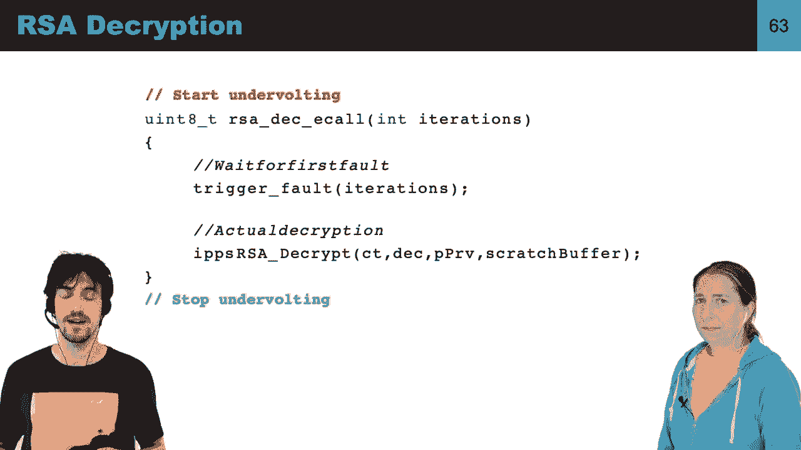

 actually first get a correct result even though we're undervolting。 So we try again again get a。

 correct result。 Let's do another try and again we will get a correct result this time。 Now if we。

 try a fourth time finally we'll get our desired faulty results we get a faulty decryption and that。

 we can now put into our little Python script here which implements a landstra attack to recover one。

 of the prime factors in this case the value starting with a ECF and now to prove that we actually。

 haven't cheated。 Let's look into the enclave code here and let's see which kind of value was hard。

 coded there and we'll also check like for the first few digits of our of our coefficient and then we。

 see that we have recovered p here。 So you've got the private key out of something happening inside an。

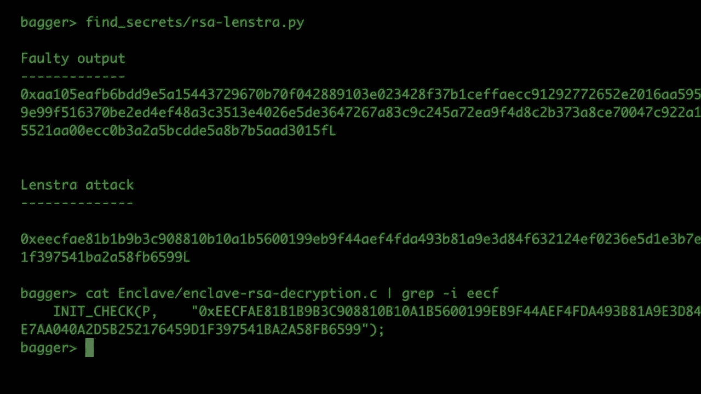

 enclave just by undervolting。 Yes exactly and that is things that should not be possible right that's。

 why there's integrity protection on the memory。 So if you can do it for RSA what else could you do it。

 for？ Are there other more commonly used cryptographic algorithms you could try？

 So yes certainly I like。

 to break crypto so I'll stay a bit more with the crypto。

 So yes the question is what else can we break。

 and now we look at AES which is probably the most popular symmetric encryption algorithm。

 It's all over the code base of SGX and even in the SDK of Intel for various operations。

 Internally it uses the four times four byte state and applies 10 rounds of transformations on that。

 and I was just thinking maybe you could attack the brand new instruction set。

 Intel's brand new AES new instruction set because that's really heavily optimized。

 Isn't this right to prevent side channel attacks？ Yes correct so in halfway new。

 Intel processors you have this AES and i instructions that allow you to do AES very quickly and also。

 protect against some side channel attacks but this only protects against timing attacks。

 So it will not protect you against a fault attack and luckily there's again also very。

 efficient fault attack on AES。 So that works like this you inject a single byte fault into the。

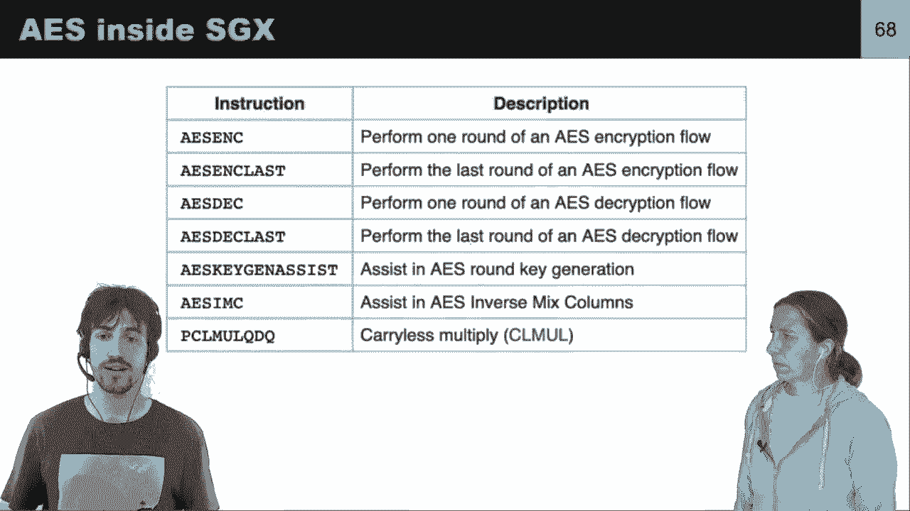

 eighth round of AES into the state and then that will propagate and through some mathematical operations。

 you can recover the complete AES key from only one correct and one faulty encryption or decryption。

 of the same input。 So here we have the implementation of that inside SGX so we do as you see here twice。

 the same operation so normally this loop should never terminate because the result is always this。

 Can I ask why are you now doing the same operation twice？

 Because we need one correct and one faulty encryption in this case。

 By the way this is of course just pseudocode so we're not really comparing this。

 pointers here just for like people who are wondered so there's an actual memcompair happening there。

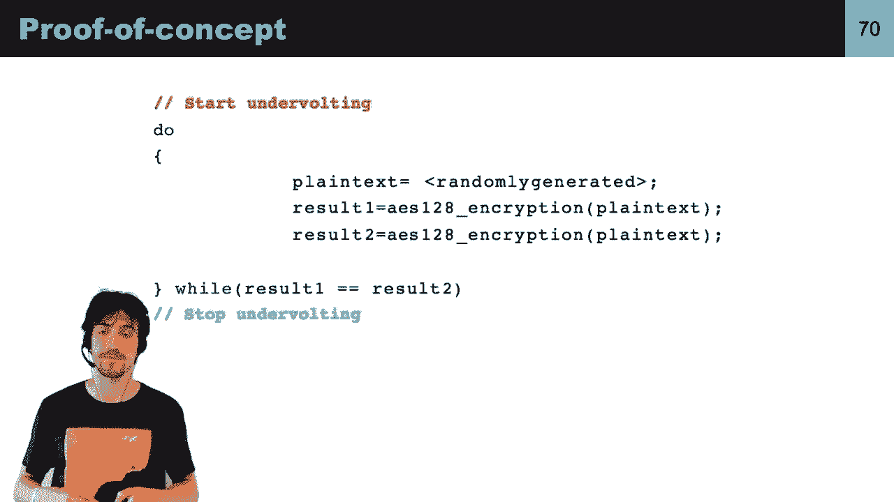

 Okay so let's see that in action in SGX so we call AES encryption here with minus 262 millivolts。

 and we got a fault here in the fourth round。 That's actually too early so we do it again。

 Here we have a fault again in the fifth round so too early so we'll run the attack again another。

 fifth round and then finally in another attempt we'll get the desired location which is the eighth。

 round and now we can use the faulty and the correct ciphertext and put that into our differential fault。

 attack and as you see here we actually use two pairs on which we run the differential fault attack。

 This is simply because the attack will give us multiple key candidates and then we can use the。

 intersection of the two results to find the correct keys。 So here you see the attack running。

 We recovered the keys from for pair one and pair two and we take the intersection and recover the。

 in this case here is the correct key which is zero zero zero zero one zero two and so on。

 So just to show that we didn't cheat let's look at the enclave code and let's grab for the key。

 and indeed we recover this value。 So as I said we used two pairs in this example。

 You could also get， away with one pair and then a brute force over all the candidate if you have a known plaintext for instance。

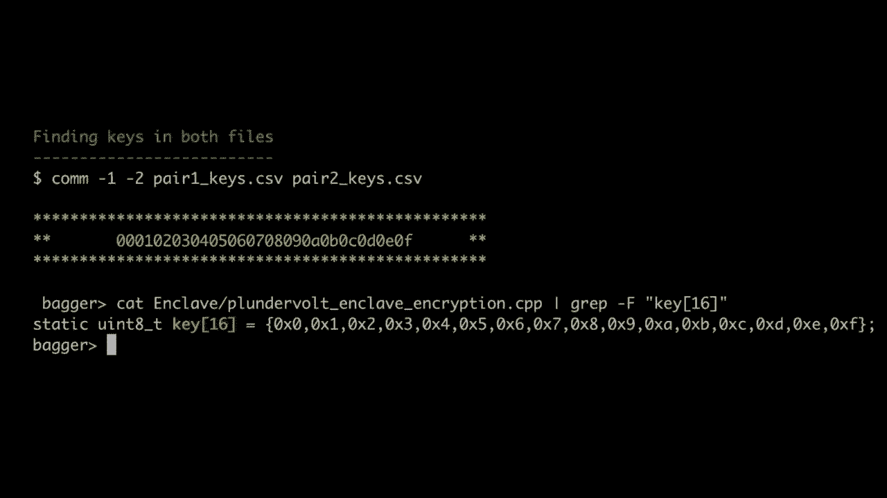

 Brilliant so now we've got keys out of both both RSA and AES new instruction set but that's just。

 crypto and I don't really get crypto is there anything else we can do with it？ Yes I think we。

 could do something with that that would relate more to system security。 I would say it's not just。

 crypto。 For instance if you take a simple code snippet like this we take a pointer to some。

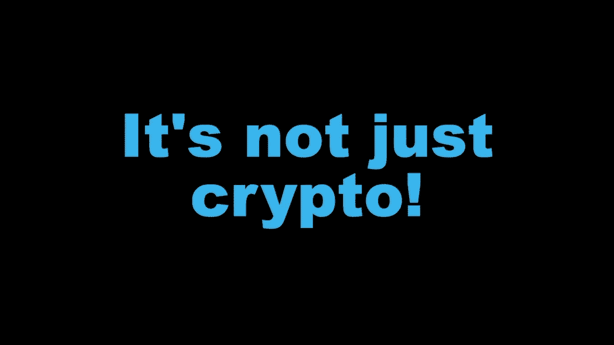

 array offset and then we want to store something there an enclave secret maybe a secret key or something。

 But Daniel what's that got to do？ There's no multiplications in there that's the pointer arithmetic。

 That's right that's right but pointer arithmetic implicitly uses multiplications。 So if you would。

 rewrite this this array access there then you would get this code basically just for now。

 Who equals array plus offset times the size of the structure that you were addressing here。

 This is a simple pointer arithmetic。 I think that many people will know that from their C programming。

 classes and of course then you have a multiplication so that's something that we can fault。

 So maybe we should try that。 If we fault this multiplication we will get to the wrong offset。

 and then hopefully we will write to a wrong location and see what we can do with that。

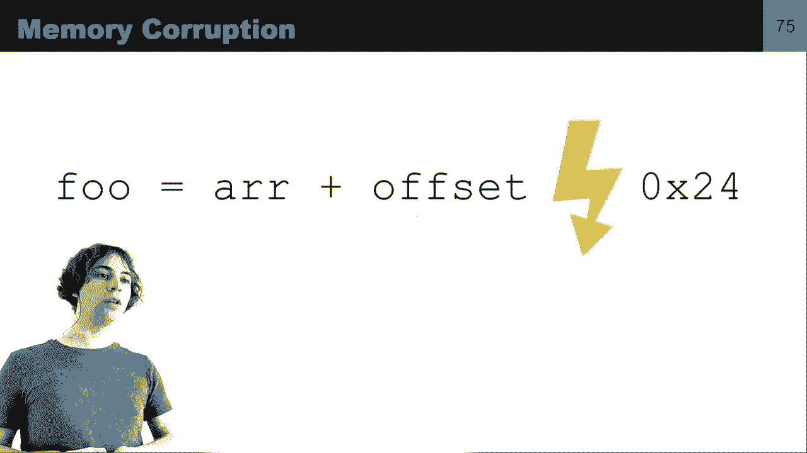

 Okay so in this example we have an enclave with a base and a limit so within this region this is。

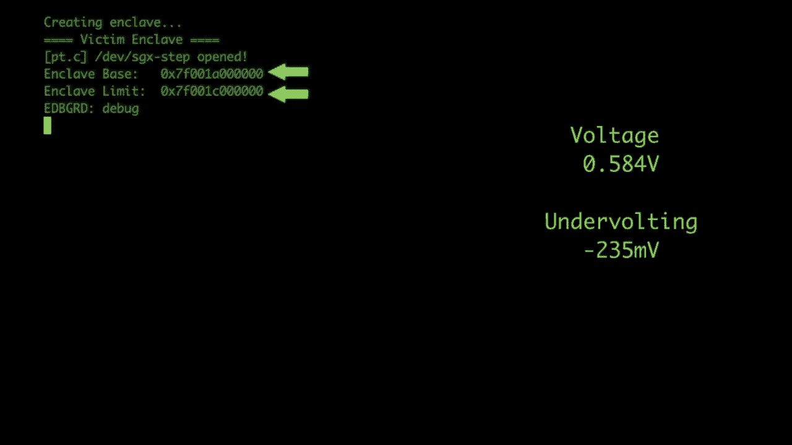

 secure memory that the attacker cannot read so staying between here and here is secure。

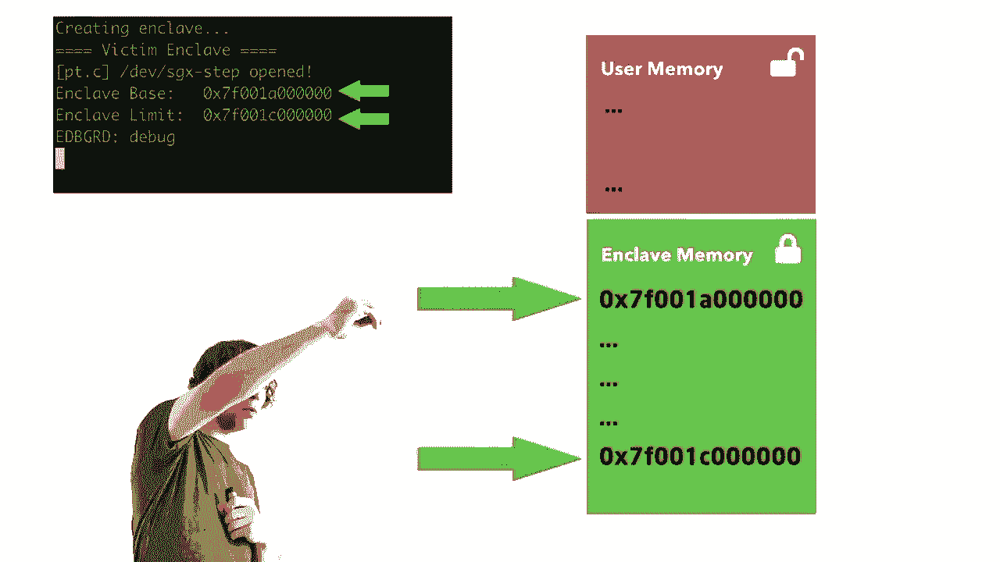

 Now if we run this many many times we will see that at some point we have a fault and this fault。

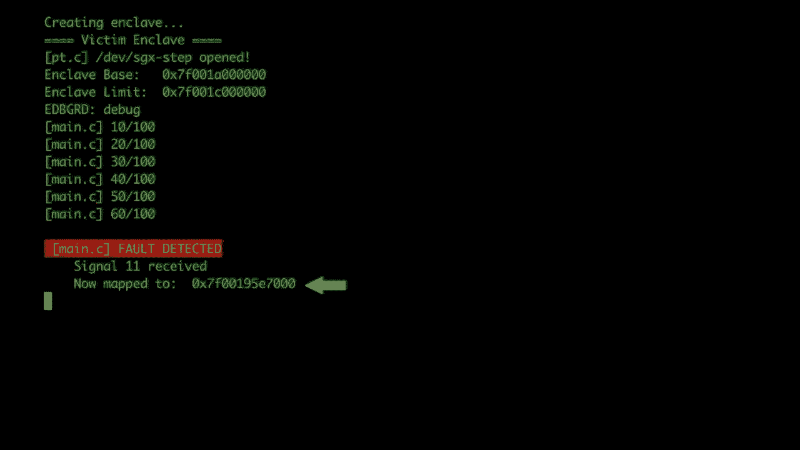

 means that we started writing to the same location over and over again and now we have fault and now。

 writes to a different location outside of this secure region and that means that we can read。

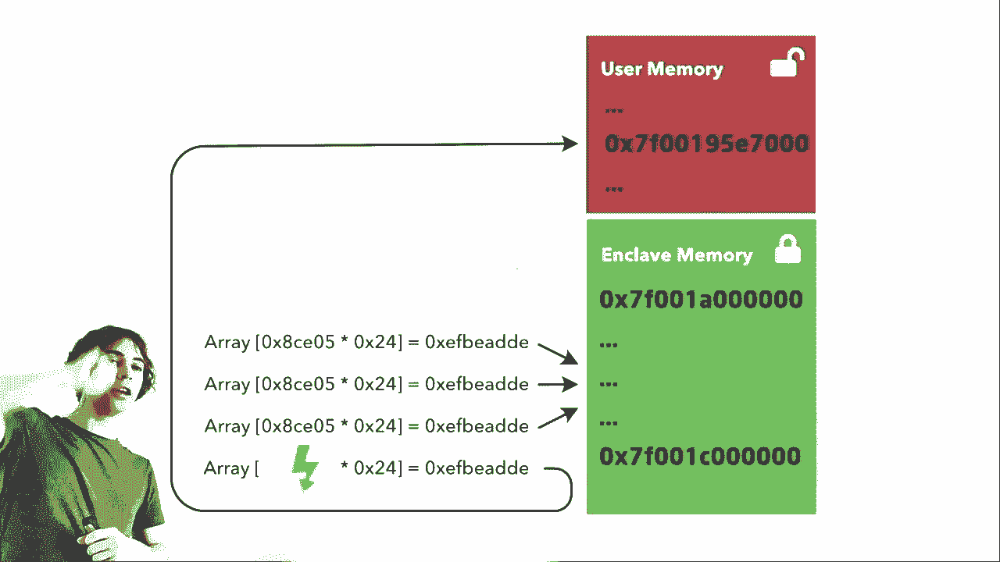

 what the enclave wrote there and we can see that it wrote dead be there which is in this case the。

 secret that we have implemented in our enclave。 Now this is pretty bad so if we go back to the。

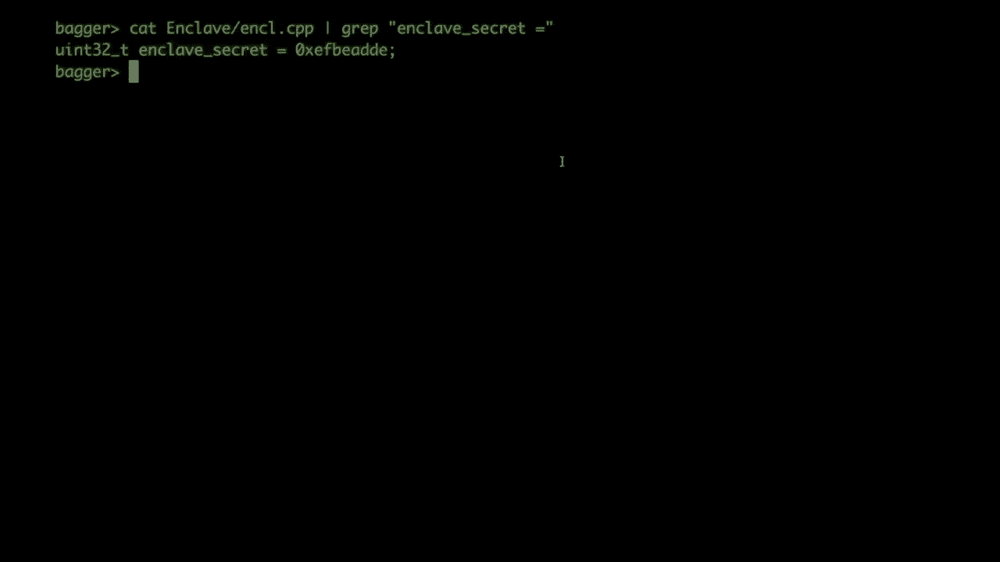

 to the traffic you can see that clearly only writing within these green area this is secure。

 writing to the faulted location outside to user memory means that the user directly can read this value。

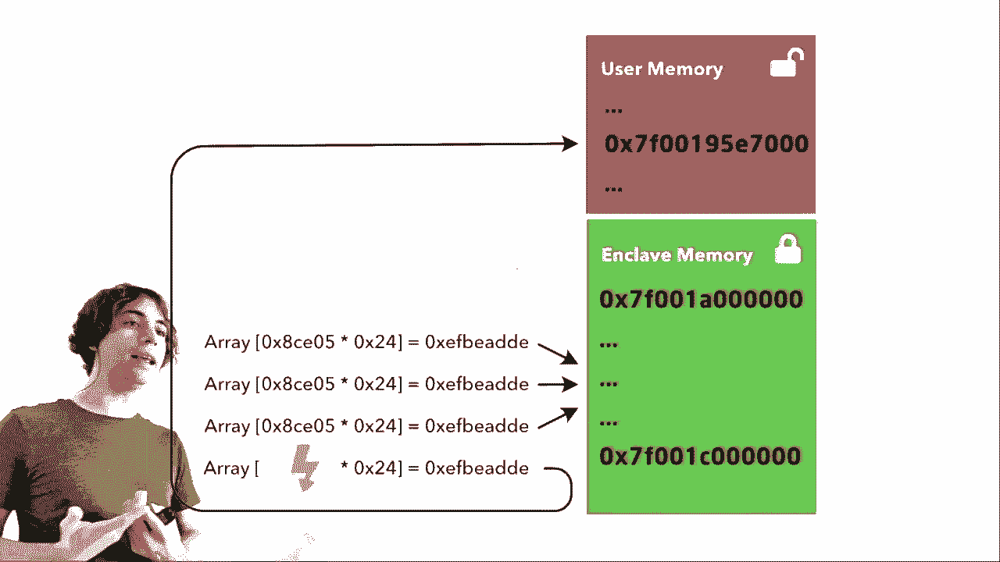

 Well the question is of course if we can induce faults like that how difficult is it to。

 produce these faults without running into a lot of trouble。 Yeah I get asked this question I have。

 to say this is probably the question that I have been asked more than any other single thing so。

 let's talk about that for a bit。 The first thing that we did is for all the computers that we were。

 able to fault the first thing that we did is we ran a benchmark we found out what was the voltage。

 when it was idle and at what point did it did it crash and what we wanted to know was how close。

 to the crash point do we need to be and I have to tell you I had some spectacular crashes。

 when this is my favourite crash they weren't all as colourful as that unfortunately。

 But here you can see this is an actual graph of a crash and a fault and it looks like they're。

 pretty close together but actually if you get to the frequencies in the middle we found those。

 to be the most stable and you've got maybe sort of 20 maybe 10 millivolts to play with them so。

 you've got just enough to keep the computers stable but we also found out some other things。

 We found out that if you try and buy two identical only mean absolutely identical computers and then。

 you benchmark them they might look different and that was one of them。 Yeah that's weird。

 So that means that although I bought exactly the same machine I will get basically more。

 performance out of or I might get more performance out of one because it produces less heat。 Yes。

 Interesting I didn't know that。 Yeah we actually thought we were buying exactly identical。

 machines and we weren't but this is why the benchmarking portion is really important。

 before you start faulting。 We also found out that we were able to make a machine more stable。

 by maxing out the cause because you needed more undervolting when they were idle and。

 consequently I was getting more crashes but if we if we maxed out the cause then you needed less。

 undervolting and let's have a quick look at an example of that。 Firstly I'm going to run the。

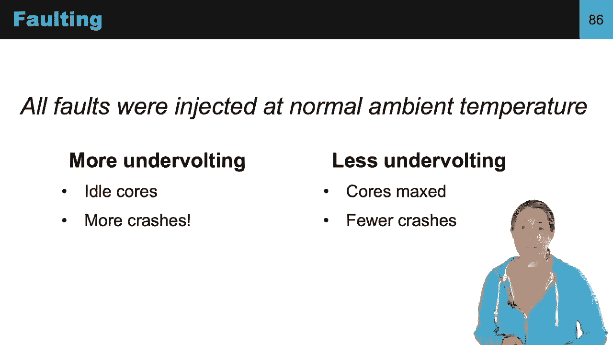

 multiplication wall the cause on under a huge load and we get our first fault at minus 163。

 millivolts。 Incidentally these are all things that we haven't demonstrated before none of this。

 made it into the play book。 So let's max out the cause now and now we get a fault up minus 153。

 millivolts。 That gives us you know 10 millivolts to play with to keep our system stable。

 But there's some more things I thought this might be kind of fun。

 Let's just see what else I can fault。 So first of all I'm going to have a go of faulting cat。

 I'm just going to cat a program and I'm， going to undervolt and you can see the text being written to the screen and then we are we've got a。

 core dump with cat。 Let's try something else。 How about trying bind？ I'm just going to find a file。

 I know is on my computer and I'm going to undervolt it found it there and then it core dumped again。

 so we can we can force find to core dump。 How about LS？ I piped it to a file otherwise my screen。

 filled up with rubbish and LS yes we even managed to get a core dump with LS that's minus 181 millivolts。

 so that was quite hard。 How about verifying a signature with open SSL？ Yep again we got a。

 verification failure minus 167 millivolts and that was kind of a bit of fun just to see there was an。

 awful lot of things we were able to fault。 Okay so kid hang on a second so you said that you can。

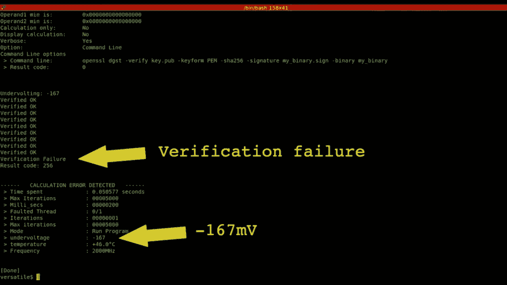

 kind of crash some programs。 It sounds to me like a denial of service or do you think there's some。

 some more to it？ I think by undervolting we're managing to get the program to do something it。

 shouldn't and that's kind of interesting because this could be something that you could attack。

 possibly in the future。 So we reported this to Intel and Intel confirmed that we were the first。

 reporters。 They also issued an embargo and we complied with the embargo and during this embargo。

 there were also other reporters who also discovered the same vulnerability for instance the vault。

 pawn team and the vault jockey team。 They also discovered that you can use。

 faults by playing around with DVFS on Intel processors。 They also participated in the embargo。

 and all of this then went online at the same time。 So in summary we created a new type of attack。

 against Intel SGX。 We broke the integrity of SGX and within SGX we were able to retrieve。

 AES new instruction set keys。 We were able to retrieve an RSA key。 We were able to induce。

 memory corruption in bug free code and we made the enclave write secrets to untrusted memory。

 Not only that we were able to get some Linux binaries to core dump。

 And a massive thank you to the grants that make this research possible。

 And a massive thanks to you for watching this talk and for hopefully making it all the way to the end。

 Thank you。 Dean and I look like a bit of an idiot。

 Okay we're live。 No we're not I don't see none。 I think we're live now。 Okay。

 So we got a few questions in the chat and just keep posting the questions。 So one of the last。

 questions that we got was。 Wait wait wait we're not live。 I do think we'll。 Are we， yes we are live。

 So one of the last questions that we had was whether the。

 susceptibility to bit flips comes from differences in the chip manufacturing。

 We can only say we don't know basically。 We just observed that they are。

 susceptible to plumb of old bit flips。 Yeah。 And that's it。 And we've seen differences。

 Same process or right。 You had one example。 The same process or and it was susceptible to bit flips。

 at a different voltage level。 Yeah and it's we don't we don't think I'm 100% live。 Thanks。

 I don't think we don't think it was differences in production line because I think they would be。

 tiny tiny differences。 But I do think possibly the way it's set up or something like that。 The way。

 the differences in the way the chips are prepared on the motherboard as they go out。

 which would be kind of interesting to know。 I would love to go and have a peek the way until。

 do things and ask them but I don't think they're going to let us know。 So a lot of good feedback。

 Thank you for the positive feedback。 Yeah we did actually we filmed it。 If you're interested we。

 tried to film it live across three three different places。 So we had two different countries。

 and three different locations and we actually did it as live whilst recording ourselves。 So thank。

 you very much because it took us a long time to do that。 So thanks for the appreciation。

 So there's a question。 Are there similar capabilities to MSR on other architectures？

 Well there is an arm right there were the there were already papers on that。 The。

 volt jockey paper for instance that did some manipulation of a voltage frequency scaling， on an arm。

 So yes there are。 I think anyone said someone said does this apply to Intel Z on chips as well？

 Because you test you've got a Z on machine haven't you？ Oh yeah we have Z on machines。

 I would expect that it's applicable just the same。 I don't see a， difference there。

 Is there any way to protect against this attack？ Well unfortunately the way。

 to protect against it is to turn the MSR off which is what Intel have done but you have a choice you。

 can either have SGX or you can undervolt and I have seen a lot of people talking about new machines。

 that appear to be coming out without the ability to undervolt which is a shame I think。

 It's an interesting situation because for more constrained devices it was always possible to。

 implement a protected algorithm but in this case it's unclear what you attack right if you don't。

 attack the crypto then you attack something else like pointer arithmetic and suddenly it's much more。

 difficult to protect against that in a generic way more difficult than for certain crypto algorithms。

 Thank you Marina thank you。 How did you become interested in lower level fault attacks。

 as individuals and a team rather than applications？

 So the fault attacks I mean let's be honest we can we can openly say that clock screw was the first。

 of its kind and clock screw is an absolutely fantastic paper and it opened the world to new attacks。

 and it's because of clock screw that we've gone on to see a number of attacks against lots of other。

 chips so that was where we started but as a team I think this is what you're asking。

 as a team we came together because we all brought different things to the table。

 and so at Birmingham we didn't have as much experience as Daniels got for fault injection so。

 when you come together each brings something that adds to the overall research。

 I think the interest for topics like this from my site came actually from my PhD supervisor who。

 said well this is an interesting area take a look at that。 Okay thank you a lot of。

 Do you plan to continue this research？ Yeah we have we at Birmingham have， been looking at AMD。

 I don't think we've had much success I actually I'm not working on that。

 specifically yes the code is available it's on github it's forward slash kit modoc which is my name。

 or kit-modoc it's either kit-modoc it kit-modoc try one of the two and that's where we've got the。

 code to modify the MSR and also to create a fault in one of the cryptos it might be both of them。

 can't remember that's not really helpful。 Why do identical products produce different。

 results a bit unclear there？ We had in the team we had multiple small NUCs with the same processor。

 with the same yeah basically same processor same microarchitecture same I'm specifying what the。

 processor is but different voltage baselines so apparently even the same processor as you buy it。

 with exactly the same number can be different and that has a lot of consequences for instance also。

 and I personally I find that a bit concerning that these might even lead to performance。

 differences in benchmarks if one has a higher performance level than the other higher voltage。

 level than the other。 Someone's asked how much time roughly does the attack take to carry out。

 well it can be seconds the hardest bit is the benchmarking which takes hours because you're。

 crashing your computer just constantly crashing it but once you know where the crash point is。

 you just stay a little bit above that and at that point you can， seconds I mean yeah seconds。

 What vintage is that on my side some Austrian local wine？

 Yeah this is awful because it's written in English and we don't produce red wine in England so you。

 know that it is not a good bottle of red wine。 Burn minds that we're in Europe so we're allowed。

 to drink because it's evening。 I think that's all the questions oh there's a question could the MSOP。

 protected admin access required for example so the MSOP does require admin access which is root。

 you have to be root which is why the application of SGX is where we focused all our attacks because。

 SGX says you should be protected even against an attacker who has root and you're not because of。

 Plundevolt。 In general you can fault any application but as Kit just said you need root privileges to。

 modify the MSR。 If there are other ways to induce faults or if someone would introduce an interface。

 where you don't need root privileges to induce faults well then you could also very realistically。

 attack other applications。 Someone is schooling me on red wine production in the UK we do produce red wine I apologize。

 Another question are there similar capabilities to MSR on other architectures yes？ Yeah。

 Crock screw on the arm。 How reliably can you get the fault into the AIDS operation of AES？

 Yeah so it was pretty evenly spread so one in as many rounds as there are one in 11。

 I am not a cryptographer。 Yeah at this point let's thank the audience。 Thanks for being here。

 Thanks， for all the very positive feedback and if you have any further questions just send us a mail or ask。

 them through some other means we're always happy to answer questions。

