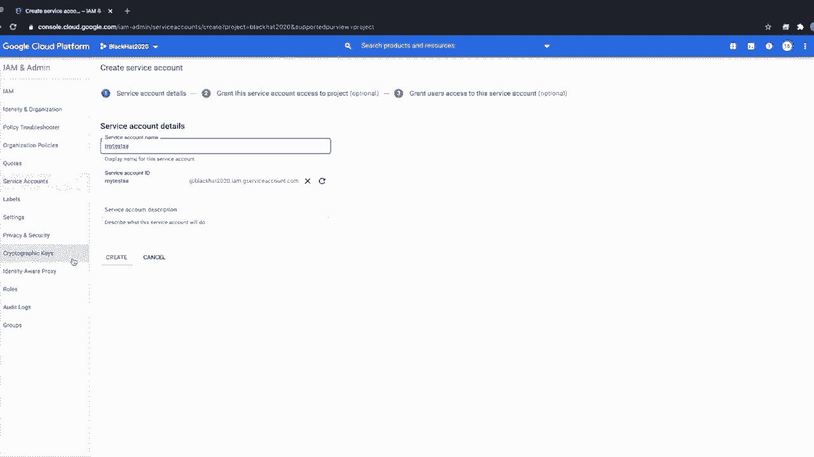

# 【转载】Black Hat USA 2020 会议视频 - P1：01 - Lateral Movement & Privilege Escalation in GCP; Compromise Organizations wi - 坤坤武特 - BV1g5411K7fe

 My name is Allison。

 Hi my name is Dylan。

 We've been researching GCP for the last year and a half and we've come with some effective。

 ways that compromise most GCP organizations， all the ones we've looked at anyway。

 These techniques involve moving laterally with service accounts and cloud APIs。

 We have a lot of ground to cover so let's get to it。

 I think everyone has a slightly different reaction when they first start learning about， GCP-I-M。

 But one common thing I've observed is people often compare it to AWS-I-M but there are。

 some pretty key differences between GCP and AWS-I-M。 So let's talk about some of those differences。

 First in AWS we have user identities and those user identities can be exported in the form。

 of credentials which look something like this。 In GCP the equivalent is a service account and service accounts can also be exported in。

 credentials that look a little differently。 They look like this。

 In both cases we have owners of these identities but where things get a little bit different is。

 when you start to ask the question "What can my identity access？"。

 In the world of AWS you basically have a policy that determines all the different things that。

 the identity can access and the person who can create， read， update， delete that policy。

 is the same person who owns the identity。 So here's an example of what that looks like。

 In GCP though this is where things start getting really different。

 Instead of having a centralized policy for a given identity we have policies for resources。

 So in this case we've got a bucket and a bucket owner and that bucket has a policy。

 The bucket owner controls who can create， read， update or delete that policy and that。

 policy applies to whatever identity the bucket owner wants it to。

 So here's an example of what that looks like for storage。

 What's interesting here is that the owner of the service account actually doesn't have。

 any insight into this policy。 They can't view it， they can't update it。

 they don't even know that their service account， was given access to this bucket。

 Instead the bucket owner controls this and if the owner of the service account doesn't。

 have IAM list on the bucket then they won't be able to even see that that policy was granted。

 And I think this is one of the harder concepts it was for me personally to wrap my head around。

 in GCP is if you have an identity in GCP like a user or a service account as the owner of。

 that identity you can't actually know what that identity has access to。

 In fact no one can answer the question what does a service account have access to。

 Instead resource owners control what the policy is for a given resource so you can answer questions。

 like who has access to this bucket but you can't answer questions like how many buckets does the。

 service account have access to or what buckets does the service account have access to。

 Those questions are unanswerable by design in GCP。

 Likewise we can have other resources like BigQuery for example and we have an owner for the。

 BigQuery and a policy for the BigQuery and the owner of the BigQuery can again grant access to。

 any identity they want。 However the owner of the service account has no control over this and can't。

 see this。 One thing you might be wondering is before when I mentioned that the owner of the。

 service account can't fully answer the question what does the service account have access to。

 You might be thinking well if you own an organization can't you just get the IAM policies of all the。

 resources in the organization。 Well someone outside your organization can still grant your。

 service account access to their resources so when I said before you can't actually answer the question。

 what does your service account have access to it's true you cannot get the answer to the question。

 because people outside your organization can also grant access to their resources。

 We'll come back to that later and explain what an organization is and how it's structured but for。

 now I figured I just mentioned that in case you were wondering。 As you might imagine not having。

 control or visibility into what your service accounts can or can't access comes with some challenges。

 And one particular place I think those challenges manifest themselves is in a multi-tenant Kubernetes。

 environment。 Google has a managed Kubernetes engine that's often shorthand GKE。 If you're。

 familiar with Kubernetes you have a bunch of notes and within those notes you have workloads。

 In GKE those notes are powered by VMs and those VMs have service accounts attached to them。

 If we take a look at console we can see a Kubernetes cluster here that's powered by four underlying。

 notes。 Then if we hop over to compute engine and click on VM instances we'll see the same four。

 instances and if we click into one of them we'll see that we have a service account that's attached。

 to it。 We talked a little bit about how workloads interact with the service account in our B-side。

 San Francisco talk this year so feel free to check that out。 But in short anything running on the。

 node can access this identity so it's a good idea to descope it and not give it many privileges。

 But let's think about what that actually means。 We have a Kubernetes admin that runs the notes。

 and the service account powering the notes and then we have a bunch of developers that run the。

 workloads on the Kubernetes engine。 Those developers may be on separate teams and may be in control of。

 separate resources from each other and from the Kubernetes admin。 So you can imagine in this case。

 we have dev1 and dev2 that have both deployed workloads workload1 and workload2。 Likewise they。

 both control resources in this case we'll say that they both own a bucket and they want their。

 workloads to be able to access that bucket。 One really easy way to do that is to just give the。

 service account on the node access to the bucket。 But the downside to doing that is instead of just。

 giving their workload access to the bucket they'll give every workload access to the bucket。 The。

 developers in this case control this story。 They control what the service account has access to。

 because they're the resource owners。 The Kubernetes admin does not control this and cannot see that。

 this even happened。 So you can imagine in a situation where you have a small team of Kubernetes admins。

 that are trying to maintain a cluster that want to open it up to give many developers the ability。

 to deploy workloads to this cluster can be difficult to secure because they can't control what the。

 service account attached to the nodes has access to and some developers may want to just give that。

 service account access to resources rather than using something like Kubernetes secrets or vault to。

 pass credentials to those workloads。 They may choose to just give the service account attached。

 to the underlying node access to their resources。 But when they do that they give all workloads access。

 to their resources， not just one workload。 And so you end up in a situation where a Kubernetes。

 admin who wants to onboard developers into their cluster inadvertently gives every new。

 workload access to a bunch of resources， even though they can't even see that or have any control over it。

 Okay now before we go any further it's important to point out that up until this point I've kind。

 of implied that resources are like these standalone entities that receive single。

 roll bindings directly to them。 And while resources definitely can operate that way。

 most of the time they're actually bundled together into groupings。 And there's a roll binding that。

 goes to the entire group of stuff。 So instead of getting a role directly to a bucket， you just。

 then get a role to a collection of buckets。 So fundamentally， there are four nodes， resource nodes。

 within GCP。 There's an organization node， which is the parent node。 This is generally associated。

 with your domain or cloud identity service。 There are folders and projects。 All of these different。

 top level nodes are mostly used for I am and something it's important to note within the resource。

 hierarchy is the concept of I am inheritance， where wherever you have an I am binding to one of these。

 top level nodes， your I am binding is also going to be inherited to all subsequent or child resources。

 within this hierarchy。 So if I have a role binding at the organization。

 I have access to all subsequent， resources that are created within the environment。

 same at the folder and project level， generally， users mostly interact with resources at the project level。

 That's where services like buckets， compute， and general services that you may interact with on a day to day basis are。

 Now， let's dig into a few， different I am workflows and try to understand why project level I am bindings are so prevalent in。

 GCP。 If we navigate to I am and we go to grant a member access to our resources， what we're doing。

 here is we're actually creating a project level role binding， which will give this member access to。

 all resources within our project。 If we wanted to create a resource level， I am binding， we would。

 actually need to interact with the resource specific API and set the I am binding there。

 Another I am workflow where a user is prompted to create a project level role binding is when。

 you create a service account， when we create a service account， we'll actually be prompted to set a。

 project level I am binding that will grant this service account access again to all resources within。

 our project。 So we can see that when you go through general I am workflows。

 you are going to always be， setting a project level I am binding。

 Your I am binding is also going to be inherited to all subsequent。

 or child resources within this project。 Here we can also see something called conditionals。

 This is an advanced feature within the I am service that does enable you to set more granular I am。

 policies， but also at the project level within your environment。

 So I think that's really interesting， that the main I am button in the UI actually takes you to the project level bindings。

 A lot of people， don't even realize that you can do resource level bindings because you have to actually click through。

 into the resource to see that there are I am settings there。 And a lot of people just assume。

 that if they go to the I am page， they get the whole I am story。

 So when we backtrack a little bit to， when we were talking about resource owners and service account owners。

 realistically what would， actually happen is you would have project owners and within those projects you would have resources。

 and service accounts。 So before when we were talking about roll bindings， we mentioned this idea of。

 Kubernetes nodes having service accounts attached to them and developers deploying work loads to the。

 Kubernetes cluster and granting them access to resources。 But more realistically what that would。

 look like is they would grant that node access to their entire project because again， I am bindings。

 are typically done at the project level。 So instead of granting the node access to a single bucket。

 they would grant it access to all buckets within a given project。 Now this isn't always the case。

 Sometimes developers do resource level role binding and it should also be noted that the UI isn't the。

 only way to apply these role bindings。 You can also apply them via Terraform or VSCLI。 It's pretty。

 common for developers to do it at the project level because most of their first exposure actually。

 comes through the UI。 Okay， so if we recap to the earlier section， you might remember when we。

 talked about service account owners， we mentioned that the service account owner can actually know。

 what access their service accounts have。 Well， it's not really the whole story。

 Really what we have is a， project owner and then that project owner has a bunch of service accounts in their project。

 And， then those service accounts have access to stuff and the project owner doesn't really have the whole。

 story of what their service accounts have access to you。

 And so you might imagine how that can start， to become dangerous is when I hand over access of my project to someone else。

 I don't really know how， much access I'm handing over because again。

 I don't even know how much access my service accounts have， in my project。

 So if I hand that over to someone else， I'm handing over an unknown amount of access。

 So what is an example of this look like？ Well， we have a project owner that knows the email address。

 of a different project service account。 They can then give that service account access to their。

 project through an IM binding。 And then that service account has access to their project's resources。

 Now one question you might be asking yourself is why you would even need a cross project role。

 binding。 But when you think about it， when you have two projects， they're not particularly useful。

 unless they have some way to talk to each other。 And one common way to do that is through Google。

 cloud services like Pub/Sub or Storage。 And so it makes sense that we want to share some resources。

 between projects。 But again， where things sort of start to become more dangerous is if we share。

 service account access between projects。 Because again。

 project owners don't really know what access， their service accounts have。

 So we're missing out on some important existential questions like how。

 interconnected our projects actually are。 Because again。

 we can answer questions like who has access， to a resource。

 but we really can't answer questions like what does a service account have access to。

 So we came up with a solution that let us sort of answer this question within our own organization。

 We can't actually get the complete answer to the question again because of these things called。

 cross organizational bindings， but at least within our order we can get the answer for cross project。

 bindings by just introspecting every individual project that we own and pulling all the IM policies。

 We then took all that information and we made a graph out of it。 We actually went over to GitHub。

 and we crawled a bunch of IM policies that people either intentionally or accidentally committed。

 And we took all those policies and we kind of compiled this pseudo org generator。 [Music]。

 So let's take a look at one of the graphs we ended up with。

 As you can see there are two different colored， nodes。 There are red nodes and there are blue nodes。

 What the red nodes represent are projects， and what the blue nodes represent are service accounts。

 Those are the only two things we're， graphing here。 Then there are two different types of edges。

 There are contains edges and there are， bindings edges。

 A contains edge is basically when a service account lives in a given project。

 and the binding edge is when that service account has a roll binding to that project。

 Most of the time a service account has a roll binding to the project that it's contained in。

 But every once in a while we'll end up with a service account that has a roll binding to a。

 different project across project binding。 So in this case we have a service account that's contained。

 in project number 67 and it has a roll binding into project number 57。 If we zoom out we get the。

 view of the entire organization。 We have all the different projects here in a map and we have all。

 the relationships of the service accounts within the org that are contained within these projects。

 Now we're not looking at organization level bindings in this graph or resource level bindings。

 We're only looking at the project level bindings and we're mapping these relationships。

 So because we based this off of real IAM policies that we're able to pull off。

 GitHub we could say with some level of confidence that this is an accurate representation of what a。

 sufficiently large company might look like。 We can also say with a little bit of personal experience。

 based on the large companies that we've looked at this is an accurate representation of what a。

 sufficiently large company looks like。 Now again most of the time a developer is just going to be。

 the owner of a single project and they won't really see the whole picture。

 All they'll see is sort of， tunnel vision for the one project that they have control over。

 And so they'll see the service accounts， that belong to their project and they'll see what has roll bindings into their project but they won't。

 know where their service accounts have roll bindings out of their project。

 And so when they hand off， access to their project to another developer they won't actually know how many additional projects。

 they're handing off and they themselves may not have a good understanding of how many projects that。

 they have access to through their service accounts。

 One other interesting thing that we found here is。

 that there are certain projects that have seemingly disproportionate large numbers of roll bindings。

 and resources in them。 We found this was a pretty consistent story at multiple companies that we。

 looked at。 And so in the center here you can see there are a bunch of projects that have really。

 tightly bound roll bindings and then at the bottom we have smaller projects that only have one or two。

 service accounts that may not be connected to the broader web。 And then we have a bunch of projects。

 that have no service accounts。 What we found is that most of the sensitive data or sensitive workloads。

 are in the interconnected projects。 That's where most of the development is happening and so it。

 makes sense that it would have most of the IAM roll bindings connecting it with other projects。

 So when we first started building these graphs we were thinking to ourselves。

 "Oh gosh these projects， are supposed to be isolated boundaries。

 Are they really this interconnected？" And the more we dug into。

 it and the more we thought about how project owners can't actually see the roll bindings their。

 service accounts have been granted， we realized this is a problem that's really remained invisible。

 and it really takes this org level introspection to even see it。 Now there's one final piece here。

 that we haven't talked about yet and that's when a developer actually does hand over access to their。

 project to another developer。 He says that might be okay。

 It might be okay to share storage for example， but things start to become really dangerous if you share access to service accounts because again。

 that's where the problem is hidden where the owner of the project doesn't actually know what access。

 their service accounts have。 And so if we share that unknown access that's where things can start。

 to go astray。 So we'll come back to what roles and permissions are actually required to hand over。

 that level of access and we'll talk about how common that is。 So far we've talked a lot about。

 roles and mentioned that some are more dangerous than others。 So now let's dig into that a little。

 bit more。 Within GCP there are three distinct types of roles that you can use。 Primitive which。

 have been around since before Cloud IAM that we know today。 Predefined roles which are curated by。

 GCP and service specific and custom roles that enable developers to specify any permission that。

 they would like that is supported to fit their services needs。 Let's focus on primitive roles。

 Within primitive roles there's an owner role which provides all of the different permissions that。

 are available within the platform。 An editor role which closely resembles the owner role but excludes。

 a few different things for administrative capabilities and that just might not be supported yet。

 One， thing in particular that's excluded is the ability to set project level role bindings and the viewer。

 role which is exactly what it sounds like。 It allows you to view resources but not perform any。

 state-changing actions。 How are these primitive roles used？ Well earlier we saw that when you go to。

 Cloud IAM through the UI these primitive roles are what are first suggested to users。

 There's another way that these primitive roles manifest themselves within your GCP project。

 and that's through default IAM role bindings。 Whatever identity creates a project will automatically。

 be granted a project level role binding using the owner role。 So we know that the owner role。

 contains all of the different permissions that are available but what about the editor role？

 Well the editor role contains at the time of this talk 2，576 distinct permissions。 That's a lot。

 This means that with the editor role you can for example access all buckets， all databases。

 all VMs and much more within your project。 Out of these permissions that we talked about earlier which of these roles actually enable。

 user to manage service accounts。 Well both the owner and the editor role do。 While the editor role。

 does not enable you to create new service accounts or apply project level role bindings for service。

 accounts it does allow you to manage service accounts in two different ways and that's by creating。

 keys or credentials for a given service account that already exists and by associating a service。

 account with a resource。 So if a user can create a resource specify a service account GCP will go。

 and check does this user have the IAM service accounts act as permission on the service account。

 that they're attempting to associate with the resource。 If so it gets attached and then that user。

 can interact with GCP services and APIs as that service account identity and its associated role。

 So how common are these IAM roles in GCP projects？ There's another way that GCP creates automatic。

 role bindings for identities and this way is a little bit different。 When you enable a specific。

 service such as Google Compute Engine it will go and create a default service account in your project。

 and then grant that service account a project level role binding using the primitive editor role。

 that we chatted about earlier。 This also happens with another service。 When a user enables the。

 app engine service a service account called the app spot service account is created in your project。

 and also granted a project level editor role binding。 Now as we discussed earlier that editor role。

 contains a permission that enables identities to associate service accounts with resources。

 So that means that both of these default service accounts the compute engine and the app spot service。

 account are able to associate any service account within its GCP project to a resource。 So where。

 these service accounts used？ The default compute service account is associated with UCE VMs by default。

 So whenever you create a VM the default compute service account is automatically associated with。

 the VM。 There's one thing to know about service accounts and the way that they are authorized to。

 interact with services from a VM。 There is the role that they have as well as something called scopes。

 and scopes define from within the VM what services and APIs can that identity interact with regardless。

 of the role binding that they have。 By default for VMs scopes are restricted to only a few particular。

 services like storage but from what we have observed developers will commonly open these scopes up so。

 that they can interact with many different services and how are the app spot service accounts used。

 Cloud Functions are Google serverless offerings which are similar to AWS lambdas。 They're。

 meant to just be lightweight ephemeral small chunks of code that run fast and exit once they're done。

 If the App Engine service is enabled within your project when a developer goes to create a Cloud。

 Function that default app spot service account with the editor role binding will be associated。

 with Cloud Functions by default。 When you create Cloud Function you actually do not have the ability。

 to specify to set it without an identity。 You always have to associate an identity with the Cloud。

 Function so if you don't know to create a new service account and associate with your Cloud。

 Function you'll always be using the default app spot service account that has that editor role。

 binding。 Cloud Functions do not have scopes and get all the permissions of the editor role。

 And coming back to the VMs a lot of managed services leverage VMs as their underlying infrastructure。

 things like GKE， Dataproc， Dataflow they also get this default compute engine service account associated。

 with them。 In AWS when you spin up something like a VM or a lambda it defaults to having no access。

 there are no roles attached but in GCP things default to having thousands of permissions。 Earlier。

 we talked about cross-project role bindings the ability to leverage service accounts in a project。

 to get access to other service accounts and potentially move laterally across GCP projects。

 We talked about developers potentially not knowing what access their service accounts have we mentioned。

 the idea of handing off access and what this realistically looks like is the developer。

 applies a role binding with the act as permission like the editor role。 Let's look at what that。

 could look like。 Now it's demo time。 To help understand how to exploit the act as permission we built a。

 framework called G-SPLUT。 To start out we need a base identity。 There are a number of different。

 ways to get a base identity。 One way for example is you could OAuth Fish a developer that has project。

 level editor access。 Another way is maybe a developer accidentally uploaded a service account key to。

 GitHub or paste bin and that service account has a editor level role binding because the primitive。

 roles are the first thing that are suggested to you on the IAM page or maybe the most likely maybe the。

 base identity comes from exploiting a service and because most services run with project editor by。

 default maybe that's how you get first foothold。 In any case in this case we've simulated this by。

 just starting with a service account credential。 We can see this credential here and we can see that。

 it starts in the project BBS2。 Next we'll run the list operation on the G-SPLUT tool。

 We can see that， there's no output。 The reason there's no output is the list operation lists all the service accounts。

 that you've managed to take control of and it doesn't count the base identity。

 We'll run the G-Cloud， command projects list on the base identity to see what project we have access to。

 It looks like we have access to BBS2。 Next we'll try and act as exploit on this project and we'll。

 target every service account in the project。 Let's unpack what's happening now。 Keep in mind the。

 editor role has two ways to take control of all the service accounts in a project。 The first is。

 through creating tokens and the second is through provisioning resources。 There's another role that。

 we haven't talked about yet and that's the service account user role。

 This role is also pretty common。

 and is often given to users in service accounts that are meant to provision resources because。

 some things like cloud functions require service accounts to be attached to them。 This is the role。

 that's usually granted to do that。 So because the service account user role and the editor role both。

 have the act as permission， we'll use that to take control of the service accounts because it casts。

 a little bit wider of a net than the token creator permission which is only in the editor role。

 So what G-SPLUT is actually doing under the hood here is first it's running the service account list。

 operation to get a list of all the service accounts in the project and then it's spinning up a cloud。

 function for each one of those service accounts。 Then we keep a database of all the cloud functions。

 we've harvested each which has its own underlying service account attached to it。 This gives us。

 access to all the service accounts in the project through the cloud functions that we spun up。 We。

 control the code that lands on the cloud function so we'll just deploy code that allows us to run。

 whatever G-cloud commands we want。 It takes about two minutes to spin up each cloud function so。

 we'll just speed through this really quick。 And now when we run the list command again we can see。

 all the new service accounts that we now have access to。 One of them says owner。 That service。

 account actually has an owner level role binding to the project that we started in。 That means we。

 now have full control of the project through this service account。

 If we wanted to we could use this， service account to add ourselves as owners to the project。

 So just to pause and think about that for， a second。

 What that means is if you ever have a service account that has editor level access。

 and another service account that has owner level access the editor level service account can always。

 privilege escalate itself to owner。 That's the same with developers。 If you grant developer。

 editor level access to a project but you happen to have a service account on that project that。

 has owner level access that developer can privilege escalate themselves to owner through that service。

 account。 Okay let's take another look at those service accounts that we have。 There's one here。

 that's kind of interesting that says do nothing。 It might not sound interesting but keep in mind。

 that the developer that created that service account in this project although they didn't intend to。

 give it any role bindings。 Again the owner of the service accounts can't control the role bindings。

 and so it's possible that a different project gave it a role binding。 So let's run the project。

 list command from this service account that we've compromised。 Something interesting here that the。

 base project BBS2 doesn't actually show up when we run this command。 This is because the service。

 account has no role bindings there。 The developer didn't want to have any role bindings but BBS3 this。

 new project we haven't looked at shows up。 What happened here is the developer in another project。

 granted this service account an editor role binding into their project。

 So let's run the act as exploit， one more time。 This time from this do nothing serves account into BBS3 and see how many service。

 accounts we can harvest in BBS3。 Again this process takes a little while so we're going to fast forward。

 through this。 And now we can see a whole bunch new service accounts in the BBS3 project。 Service。

 accounts that we didn't have access to before that we were able to get strictly through lateral。

 movement。 There's a couple service accounts in here that look interesting。 There's one that's。

 labeled networking that maybe controls networking for the organization but probably most interesting。

 is this one that's labeled organizational admin。 If while you're moving laterally through projects。

 you happen to land on a service account that has an org level binding through inheritance you get。

 access to the entire org that way。 So to recap we started with a base identity in BBS2 that had。

 act as on the project。 We then used that permission to gain access to every service account in this。

 project via cloud functions。 One of the service accounts in BBS2 had an owner role which allowed。

 us to elevate privileges in the BBS2 project。 A different service account had a role binding into。

 BBS3。 This allowed us to use act as to take control of all the service accounts in BBS3。 One of the。

 service accounts we found in BBS3 had an organizational role binding and this allowed us to take control。

 of the entire org。 So we talked about when you provision resources when you attach service accounts to those resources。

 GCP will check to make sure that you have the act as permission first before allowing you to。

 provision the resource。 Because some APIs like cloud functions require that you have identities。

 to power them this leads to a lot of people getting the act as permission。

 Well it turns out that some， APIs will actually allow you to provision resources with a service account attached to them without。

 the need for the act as permission。 These include the data proc dataflow and composer APIs。 Let's。

 talk about the data proc API。 The data proc API is Google's data processing API。 Among other things。

 it includes managed Apache adoop and managed Apache spark。 When you spin up a data proc cluster。

 like a lot of things in GCP it will default to using the default compute engine service account。

 This means by default your spark jobs will run as project editor。 You only need the permission。

 data proc cluster create to spin up this cluster。 You don't actually need the act as permission on。

 the default service account。 Because of this anyone who has the data proc cluster create permission。

 can actually make use of the default editor service account。 Put it other way service accounts that。

 are only intended to be able to spin up data proc clusters can privilege escalate themselves to。

 project editor。 And then they can make use of that act as permission to take control of the rest of。

 the service accounts in the project。 We built support for this into GSPLite so let's take a look。

 and see what it looks like。 If we take another look at the list of service accounts we've compromised。

 there's one here that says data proc。 Let's run the GCloud projects list on this service account and。

 see what projects it has access to。 Looks like it has access to a BBS4。 Now let's run the data proc。

 exploit on BBS4 through the data proc service account。 We have to spin up a whole data proc。

 cluster do this and that takes a little bit of time and then we deleted afterwards so that we're。

 not built too long。 So we'll fast forward through this part but at the end of it when we run GCloud。

 list again we can see a new service account has been added and that's the default service account。

 in the BBS4 project。 We were able to get this service account by spinning up a data proc cluster in BBS4。

 and then running a spark job on that cluster which enabled us to grab the credential off the instance。

 Because our data proc service account credential had the ability to spin the cluster up it also。

 controlled the scopes for that cluster and so we just defined the scopes for this cluster to be wide。

 open。 Next since we have a default editor service account credential at this point we can run the。

 act as exploit on this project。 We'll again fast forward through this process。

 and finally if we run the GCloud list one more time we can see a whole bunch new service accounts。

 that we now have access to in the BBS4 project。 So just to recap some APIs and GCP do not require。

 the act as permission to spin up resources and attach the default service accounts to them。

 The identities that can spin those resources up can also control the scopes so effectively in。

 cases like data proc and data flow and composer any identity that's granted permissions to those。

 APIs can privilege escalate themselves to project editor。 One last thing to note here is because。

 this data proc roll binding was actually cross-project this allowed us to again compromise the new。

 project BBS4 and because the default service accounts are in every project this allows us to take control。

 of all the service accounts in the new project。 Google has a new feature in their asset inventory。

 API called the IAM Analyzer。 We worked with Google on this feature and one of the user stories actually。

 came from us。 We came up with a list of dangerous roles and permissions that can be used to take。

 control of all the service accounts in the project。

 These can be seen here we won't demo data flow and。

 composer but you can think of them as working the same way as data proc。 Using the IAM analyzer。

 and the dangerous permissions that we're able to find we're able to run a BFS search on a base。

 identity without the need to spin up expensive resources exploiting services。 As you can see。

 from the output here we get the same list of service accounts from the same base identity as we did。

 exploiting things except this was much faster we didn't have to spin anything up。 You need an。

 org binding to use this so this is a tool for defenders to be able to get quick answers to how。

 an attacker might be able to move laterally through the organization。

 If we cut back to our mock graph。

 let's zoom into a seemingly innocent base identity。 This service account， Guad VCL。

 was meant to only， run Spark jobs in its base project 14。 It only has the data proc editor role。

 Now we'll run a BFS， search from the starting identity and highlight the path in blue。

 As you can see this allowed us to， compromise all the service accounts in the starting project through the default editor role on our。

 Spark job。 Most of these service accounts have benign roles like storage or pub sub and most of。

 them are not cross-project。 That said some like this one have dangerous role bindings that are。

 cross-project in this case the data flow developer role。

 These allow us to take full control of service， accounts in different projects。

 As we start to zoom out we can begin to see the whole picture。

 We've managed to compromise most of the service accounts in the org with a few notable project。

 exceptions that just don't have any dangerous role bindings to them。 We're only looking at project。

 level bindings in this graph so if any of these service accounts have org level bindings it's not。

 reflected here。 So we just saw some really interesting techniques around privilege escalation and lateral。

 movement but we also wanted to provide a way to detect this。 So we fingerprinted this tooling and。

 we'll be releasing monitoring and alerting if you detect the behavior of this tool in your environment。

 I think one of the nice things about doing security work in the cloud is how much help you get from。

 your upstream provider。 If we were doing work on a web application or a binary we'd kind of be left。

 to our own vices to fix the problems we found。 But because we had a close partnership with Google。

 we were able to work with them to roll out some new features that help with the security story of。

 some of these problems。 One of the people that helped us do that is a security engineer named。

 Bakanov and we gave him an invitation to do a brief cameo and talk about some of the new features。

 that we helped Google roll out。 Hello Black Hat。 I had the privilege of working with Allison and。

 Dylan as a result of our collaboration with Google Cloud launched several features that help customers。

 address concerns。 On a prevention side of things we now have an org policy constraint that prevents。

 the editor grant to the default service accounts for compute engine and the app engine and we advise。

 customers to turn it on。 We recommend that customers create custom service accounts with the necessary。

 set of permissions on the target resources as opposed to the broad project level editor grants。

 Allison and Dylan briefly touched upon the investigative IAM analyzer tool。

 As you saw we built IAM analyzer， to be able to address the use case of finding resources which are granted access to any specific。

 identity。 The other investigative feature available is the IAM recommender。

 It uses machine learning， to evaluate the permissions granted to an identity against actual activities performed by the identity。

 It's a great way to find overly generous permission grants and to identify the actual permissions。

 that are needed for the workload。 I spent many years working with all major cloud providers and。

 this statement is generally true for all of them。 Starter cloud UIs those flows are optimized for ease。

 of onboarding and so the fundamental challenge for large organizations is to make available。

 seemingly secured defaults as well as preventative guardrails for their developers。

 Those are usually， in the shape of cloud foundation code bases such as infrastructures code samples that are built with。

 security in mind， policies code evaluations as part of the build and release pipelines and。

 preventative controls exposed by the cloud providers such as org policy constraints on GCP。

 If we're leaving developers to the mercy of those starter UI flows on cloud providers or stack overflow。

 code snippets we're going to end up in a bad place。 If you're a Google cloud customer and they're。

 looking for guidance in this area you should try to engage your account team so that we can help out。

 Alison and Dylan on behalf of everyone in Google Cloud we are very grateful for the collaboration。

 on improving our customers experience on a platform and for the opportunity to have a cameo。

 appearance in this talk。 I'm hoping that Black Hat 2021 happens in person and we can share stories。

 in the face-to-face setting。 Until then please wear face masks and don't forget to turn on two-factor。

 authentication wherever possible。 Thank you。 Thank you Bach。 We also wanted to provide some context。

 and a little bit more insight and let you know a few of the limitations or constraints to these。

 tools。 So one of the main limitations to the organization policy services you actually have to。

 have an organization resource either through cloud identity or G Suite to be able to use。

 the organization policy service。 If you only have projects you won't actually be able to leverage。

 any of the constraints that are available。 Another limitation within the organization policy。

 service is that constraints are not retroactive so when the policy is applied all resources will。

 be affected by the policy or evaluated by the policy after it is enabled but existing resources。

 will not be modified to match or meet the requirements of a given constraint。

 Another thing to note is， that for the new disable automatic IM grants for default service accounts that constraint will。

 only enforce that when the APIs are initially enabled for new projects that the default service。

 accounts are not granted editor level role bindings at the time of the APIs being enabled but there's。

 no enforcement mechanism to ensure that the default service accounts are not granted a project level。

 binding or other binding。 There's also no way to restrict the cross project bindings that we talked。

 about previously where if a user knows the name of your service account they could still give the。

 service account access to their project or project's resources。

 So the IM recommender is very powerful。

 Some of the limitations on the tool is that you have to have a 90 day period where the policies or。

 behavior of a given identity are evaluated so that you can have a recommendation be made and there may。

 be more IM bindings that you may not be aware of like the cross project bindings。 The IM analyzer。

 can provide a lot of context into the IM bindings or associations for a given identity and in order。

 to use this auditing tool you have to have administrative capabilities in an organization to be able to。

 see the policies that are being analyzed。 So in order to use this tool to the fullest extent you。

 need administrative capabilities in your organization as well as within G Suite if you want to expand。

 group membership to know who has access to a given service account that is in a group。

 Earlier we talked， about how Kubernetes workloads have access to the underlying service account that's attached to the。

 node and the suggested way to harden your clusters is to use a service called workload identity and。

 workload identity allows you to associate a Kubernetes service account with a cloud identity and this is。

 how you can harden your cluster as well as have a one-to-one mapping of Kubernetes service accounts to。

 cloud identity service accounts。 We brought up earlier to ensure default service accounts are。

 not granted project level role bindings or other role bindings after the disable automatic IM。

 grants for default service accounts constraint is enabled that you require additional tooling。

 and to demonstrate a way that you can enforce these configurations we will be releasing a。

 Terraform enterprise sentinel policy set that can demonstrate enforcing that default service。

 counts are not granted project level role bindings or that roles that enable service count takeover。

 or management of service counts cannot be applied at the project level sentinel policies are Terraform。

 enterprise policy configuration language that enable you to either restrict or alert on specific。

 configurations in your runs。 So just to recap some of the key takeaways IM and GCP is very resource。

 centric meaning that if you are a service counts owner you may not be aware of the configurations。

 that are associated with that service count or how it may be used across a GCP organization this can。

 lead to projects being interconnected in many different ways that you may not be able to see role。

 bindings are often done at the project level and can grant more access than a user intends to a lot。

 of managed services and general resource provisioning operations can hand off access to your project's。

 resources and IM that you may not be aware of。 This kind of access that's granted through resource。

 creation can lead to privilege escalation and lateral movements within your environments。

 Another thing we covered is that default service counts are granted administrative roles within。

 your project automatically and that's with the editor role unless you're using the disable automatic。

 IM grants for default service counts organization constraint reduce usage of default service accounts。

 where possible by creating service specific service accounts with IM roles that are scoped to your。

 services needs。 There are a few new cool tools in the platform that have been released to assist。

 you in understanding who has access to your service accounts such as the IM analyzer which can also。

 be really helpful for understanding IM dependencies and access within your environments。 [Music]。

 Hey folks I just want to thank everybody for watching our talk and I'll be posting a link in。

 the live chat for folks who said they wanted to take notes and get a second viewing。

 Yeah thanks for watching and hope you enjoyed it and we're able to learn something。

