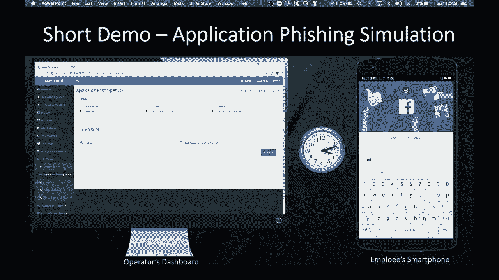

# 【转载】Black Hat USA 2020 会议视频 - P20：20 - A Framework for Evaluating and Patching the Human Factor in Cybersecurity - 坤坤武特 - BV1g5411K7fe

 [ Music ]。

 >> Hey everyone。 My name is Ron and I'm a principal research manager。

 in the Cybersecurity Research Center， at Ben Gurion University of the NAGO。

 My research group focused on utilizing AI， for Cybersecurity purposes。

 My talk today is based on our recent activity， in the domain of human factors in cyber security。

 Social engineering attacks have changed in recent years。 Specifically。

 social engineering attacks goes way， beyond phishing。 Examples for other attack vectors。

 that exploit the human factor vulnerability， or password cracking， derived by download attack。

 permission abuse， and certificate manipulation。 In addition。

 social engineering attacks are no longer limited， to pieces。 In recent years。

 we have noticed that common social engineering， attack vectors have variants to smartphones。

 in social media。 For instance， by exploiting the underrate permission mechanism。

 to acquire sensitive permission。 Or by exploiting Facebook posts and messages。

 to initiate phishing attacks。 After analyzing multiple social engineering attack studies。

 and their implementation on different platforms， we had one main conclusion。

 The skills needed by a user to mitigate different type， of attacks are not necessarily the same。

 In other words， it is quite possible that a user will own。

 the skill required to mitigate one type of attack， and at the same time missing the skills required。

 to mitigate another attack。 As a result， we believe that the security awareness of user。

 cannot be measured accurately using a unified measure that。

 do not distinguish between different attack vectors。 Despite those changes， most existing solutions。

 do not distinguish between different type of attacks， and platforms。

 Existing solutions can be classified into two classes--， evaluation tools and mitigation tools。

 Evaluation tools are methods that， can be used to identify the vulnerable users。

 These methods include self-reported measures， such as interviews， surveys， and questionnaires。

 and attack simulations。 Mitigation tools are methods that。

 can be used for increasing the security awareness of users， such as training workshop or method。

 that can be used to reduce that tax surface by preventing。

 the exploitation of the human factor vulnerability。

 such as email protection tools or browser isolation。 However。

 existing solutions has several limitations。 For instance， questionnaires and surveys。

 are based on the self-reported behavior of the user。

 and require the subject active involvement and collaboration。

 These methods tend to be very subjective， biased， and consuming significant human resources。

 Therefore， they are less scalable， and cannot be performed continuously。

 Attack simulation measure the momentary behavior， of subjects during specific events。

 and are mostly limited to fishing。 These methods are very sensitive to environmental。

 and contextual factors， and therefore， can be very biased。 In addition。

 they cannot be used to evaluate， the information security awareness of users continuously。

 Besides that， since most of the simulations are based， on fishing attacks， they cannot be。

 used to evaluate the security awareness of user， to add their attack vectors。

 Security awareness training workshops， are usually performed using videos， games， and posters。

 in a controlled training environment。 The problem with training workshops。

 is that the behavior of users in the workshops， does not necessarily reflect the behavior of user。

 in his natural environment。 In addition， the fact that the employer forced the employees。

 to participate in the workshop caused lower user， engagement to the training process。 In addition。

 the fact that the employer forced the employee， to participate in the workshop caused low user engagement。

 to the training process。 Methods that were used to reduce the attack surface。

 such as human protection and browser isolation， can prevent a specific exploitation technique。

 However， they leave the vulnerability unpatched。 In addition， these methods are mostly。

 limited to specific environment， such as the user， working environment。

 When leaving the vulnerability unpatched， the attacker can exploit the vulnerability using。

 other exploitation techniques， which are not covered， by the countermeasure。 In addition。

 most countermeasure cannot， be used to protect the user in other environments。

 such as when working from home。 In order to address those limitations， we develop Safemind。

 Safemind is an automated framework， for continuously and objectively evaluating。

 the resilience of users to specific type， of social engineering attacks。

 At the early beginning of the research， we defined three critical success factors。

 The first one is understanding what to measure。 Concretely。

 what are the criteria for a security aware user？ And what are the importance of different criteria。

 in mitigating different type of attacks？ The second critical success factor。

 is understanding how to evaluate those criteria。 And the final success factor is understanding how。

 to make a behavioral change that will last long。 In this talk。

 I will focus on the first two critical success， factors。

 In order to define the criteria for a security aware user。

 we systematically explored social engineering attack case。

 studies and identified the technologies that， are compromised by the attacker。 Next。

 we enumerated security countermeasures， that can be used to protect these technologies。

 and identify human factor vulnerabilities that， are exploited by the attacker。

 Based on these vulnerabilities， we， formulated the criteria required from a user。

 to mitigate the attack。 The outcome of this procedure is more than 30 criteria。

 for a security aware user。 After formulating the criteria， there。

 is a need to estimate the importance， of different criteria in mitigating different type。

 of social engineering attacks。 In order to tackle this problem， we。

 develop an expert-based procedure for ranking the criteria， with respect to the different attacks。

 The procedure was based on a well-known technique called， AHP。

 which allowed us to reduce the ranking time， to few minutes instead of few hours。

 We let 17 security experts to rank the criteria using our methods。 Here。

 you can see the finite models created， to four different attacks--， password-based attacks。

 application-based attacks， phishing attacks， and many in the middle attacks。 As can be noticed。

 the models are quite different， and the importance of criteria is distributed differently。

 across those models。 Here， you can see the different models created。

 for many in the middle attacks and phishing attacks， with respect to the browser technologies。

 As you can see， for the phishing attack， the dominate criteria where does not send sensitive information。

 via HTTP and does not insert private information， on unvalidated websites。 In contrast。

 for the many in the middle attacks， the dominate criteria were different。 For instance。

 delete unknown certificate from the device， and does not approve unknown certificates。

 After understanding what to measure， we can now focus on the second critical success factor。

 understanding how to measure those criteria continuously， and objectively。

 We developed three complementary solutions--， an endpoint solution， a network-based solution。

 and the tax simulation framework。 The endpoint solution include agents for smartphones and PC。

 They collect multiple sensors data from the device， including the install application。

 their permissions， source and rating， mail activity， security settings， password management。

 social network activity， and many more。 Using these sensors， we created a profile of the user。

 with respect to the different criteria。 The endpoint solutions can derive a very accurate profile。

 of the user。 However， they are slightly intrusive， and require prior installation。

 We want to take the assessment one step farther， and derive a profile of the user passively。

 To do so， we developed network-based solution， which derive。

 a profile of the user solely by analyzing his network traffic。 In order to evaluate the criteria。

 we utilize common techniques such as domain categorization， the packet inspection。

 and the assessment， of application-level protocols。 In addition。

 we develop an attack simulation framework。 Within this framework， we implemented。

 20 variants of attacks， including permission abuse， for mobile and PC， certificate alerts。

 ward macros， and malicious PDF documents， and phishing through email， SMS， and even Facebook posts。

 Here is the short demo of the attack simulation framework。 On the left side。

 we can see the operator dashboard that， can be used to configure the attack。 On the right side。

 we can see the employee smartphone， which receives a notification claiming。

 that your Facebook session was expired。 When the user press on the notification。

 the phishing web page is presented。

 For the evaluation， we conducted an experiment， involving 160 participants that installed the framework。

 for a duration of seven weeks。 We simulated four different attacks on the users--， phishing， spam。

 permission abuse， and certificate manipulation。 In addition to the endpoint and network solutions。

 we used the traditional security questionnaires， for baseline。 In figure one， the upper figure， we。

 classified the subject into three security awareness level--， low， medium， and high。

 This classification was based on the score derived， by the framework。

 Then we calculated the success rate， in mitigating the attack simulation。

 for each security awareness level。 The results show that users classified。

 as with high awareness using the endpoint and network-based， solution。

 which described by the purple and blue bars， were more likely to mitigate the attack。

 in compared to users classified as with low awareness。 In figure two below。

 we analyzed the score in high resolution。 Using moving average。 As can be noticed。

 the success rate of users， in mitigating the attack is very correlative。

 to the score derived using the endpoint and network-based， solutions。 In other words。

 users with i-score， were more likely to mitigate the attack。

 and users with low score was more likely， to fail in the attack。 On the other end。

 the classification， made based on the security questionnaire， which， described by the red bar。

 was not， correlative to the success rate in mitigating that attack。

 The main conclusions from the evaluation， are that self-reported behavior of subjects。

 made different significantly from their actual behavior。 In contrast， security awareness scores。

 derived from objective measures， such as data collected， by endpoint and network-based solution。

 are highly correlated with the usual success， in mitigating social engineering attacks。

 Thank you very much。 Everyone， thank you for participating virtually in my talk， today。

 I would like to refer several questions that raised， by the attendance。

 So the first question asked by Fernando， was， how do you balance the realistic aspect of attacks。

 with the privacy need of individuals beyond the role， as employees？

 So I will distinguish between the two different cases。

 of the study or the two different scenarios in the study。 In the first scenario。

 we collect all the information， of the raw data in order to conduct the research。

 in order to understand what are the criteria that we need。

 to analyze and to be included in the score that would later。

 reflect the security awareness and their ability， to mitigate the different type of attacks。

 The reason for collecting all the raw data， is because we cannot know in advance。

 what are the exact measures and how to analyze all the data。

 and how to create the features that can be later be used， to calculate the score。 However。

 in the system that will eventually， run on the employee phone or PC， we。

 can only use an aggregated data or extract， the features on the device and send only aggregated data。

 to the employer system in order to create the assess。 And in this way。

 we can create a profile of the user， without revealing private attribute of the user。

 Second question asked by Fernando， was about the demographics of the participant in the study。

 So in this study， we use an un-graduated and graduated， students from two universities in Israel。

 They were at the age between 20 to 35。 And they have different--。

 they recovered from different faculties。 So they have different knowledge about security。

 If you want to get into the details of all the demographic。

 attribute of the user that the participant in the study。

 so that you can refer to the paper that we published。

 and you have all the information about the demographic。

 And we also analyze the impact of different demographic。

 attributes on the security awareness of users。 This is a two question that we're。

 asked during the session。 And let me see if I missed anything， from the start of the talk。 So OK。

 we'll appreciate any peer review papers。 So as I've said before， we published two academic papers。

 One， present all the theoretical background， and theoretical aspects of calculating the score。

 especially how to calculate different scores， for different type of attacks and how。

 to enumerate all the criteria for security aware user。

 And the second paper that recently published on CHI。

 is talking about the measurements and the experiments。

 So I will put into the chat links for both of these papers。

 so we can get into all the details of this research。 We also have a patent approved that。

 describes all the framework and the idea of continuously analyzing。

 user behavior in order to measure， its robustness to social engineering attacks。

 Let's see if there is any other question。 Thank you for all the participants that enjoy the session。

 It's really， really nice to hear that。 So I see that there isn't any other question。

 that asked by the audience。 So I think we can end for now。 And thank you very much， all of you。

 for participating in this session。