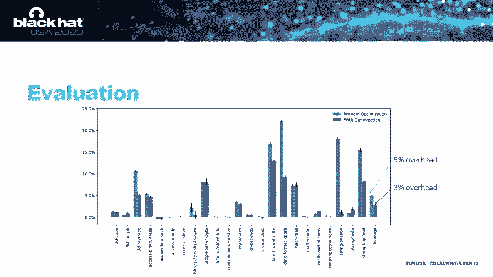

# 【转载】Black Hat USA 2020 会议视频 - P21：21 - NoJITsu - Locking Down JavaScript Engines - 坤坤武特 - BV1g5411K7fe

 Hello everyone， my name is Timing Park and I'm a PhD student at USHI Irvine。 Today I'm。

 going to talk about Fujitsu， locking down JavaScript engines。 This is a joint work of。

 USHI Irvine and KU Lubot。 Today we cannot live without internet， so web browsers are。

 now essential parts of our daily lives。 Many of you might open a web browser first as。

 soon as your computers are on。 One of the biggest innovations in web browser is。

 JavaScript which provides rich interaction between web pages and web。

 browser so people can enjoy the dynamic web environment。 As you can see most of the。

 modern web browsers have JavaScript engines embedded。 However the problem of。

 the JavaScript engines is that they are usually written in unsafe languages such。

 as C or C++ so they might contain vulnerabilities。 Also JavaScript engine。

 automatically runs an discrete embedded in a web page。 Therefore it is easy for。

 an attacker to inject his script and trigger the vulnerability to exploit， victims machine。

 JavaScript engines continue to evolve and the size becomes， larger and larger。

 As you can see in the in this graph the cold lines of 38 now， become more than a million。

 Accordingly every year more than hundreds of， vulnerabilities in JavaScript engines are reported so JavaScript exploitation is。

 now real threat。 One of the famous JavaScript engine exploitation is G-spraying， attack。

 In this attack an attacker encodes malicious code in the huge number， of constant in script。

 Look at this example they are definitely benign， consecutive XOR operations。

 So there is no problem in generating， corresponding gidded code within the sandbox。

 However an attacker can trigger a， vulnerability and change the program counter to the middle of the disk。

 constant then the semantic of the counter turn into what attacker want to， execute。

 In this way the attacker can inject any malicious code within the， sandbox。

 There are more advanced attacks on JavaScript engines especially。

 utilizing word is thread capability。 Look at this slide。 During the G。

 compilation G-comilers first generate the intermediate representation which is， G-R。

 At that time an attacker spawns on new thread and still a CPU cycle to， overwrite G-R。

 Then the G-d code the transformed from the corrupted G-R， eventually contains attackers code。

 Or by using the similar technique an， attacker can inject his code directly onto the G-d region when it becomes。

 writable。 So people suggested several defenses mostly isolating G-。

 components through separate process or trusted execution environment。

 However the basic execution unit of the JavaScript engine is the interpreter but。

 previous work is all about G-d and there had been no attacks and of course no。

 defenses on the interpreter。 So here's our contribution。 Our first goal is to。

 discover new attack factor which is bytecode into pre-attack。 Our attack。

 corrupts the bytecode into pre-d and escape from the sandbox so that an。

 attacker can execute arbitrary system codes。 The second goal is proposed defense。

 mechanisms to protect JavaScript engines。 Our defense techniques pursue a。

 comprehensive defense so that it defeats not only the bytecode into pre-attack。

 but also prior G-code injection and code-reuse attacks which means。

 protecting entire script engines。 People are going to talk about our attacks and。

 defenses and we go over how interpreter execute。 Look at this slide。 When。

 script is about to be executed it is compiled by bytecode compiler which。

 generates bytecode object tables and JavaScript object。

 bytecode is a stream of the bytecode instructions which are executed by the， interpreter one by one。

 bytecode instructions are pretty much similar with。

 machine instructions in that it has opcode and operand。 However instead of。

 step-spying data directly on the operand it is used to specify an index of an。

 object table and each entry of the object table points to JavaScript object where。

 actual data are stored。 Here our attack aims to utilize the function code routine to run arbitrary。

 system codes。 We have several attack strategies but in this talk I will show。

 one attack use chamber which corrupt JavaScript object。 Here's our SRAM model。

 There's at least one memory corruption vulnerability inside of the script engine。

 that gives an attacker an arbitrary read and write capability and we assume。

 that code injection defense is deployed so memory region should be either。

 writeover or assign cubable。 Lastly our SRAM model has lightweight code。

 reuse defense which includes ASMR and course-grained CFI。

 This is a simple attack script calling of benign function foo and the function。

 foo calls cosine function。 When this script is compiled corresponding bytecode。

 object table and data object are generated。 Here calling the cosine function is。

 achieved by an indirect function code where the function pointer is best fetched。

 from the load function bytecode instructions and also arguments are。

 fetched in the same way and this indirect function core gets the address of the。

 context object as the first argument。 Here we're gonna add code to trigger a vulnerability which gives an attacker。

 an arbitrary read and write capability。 So attacker can now rely on arbitrarily。

 read capability to find data to corrupt here let's say bytecode bar1 object and， context object。

 We use a heap layout inference technique which first links。

 and address over arbitrary object and follow the pointers in the object to find， other objects。

 We repeat this process recursively until we get to the target， data。

 After finding them the attacker utilized the arbitrary write capability， to corrupt them。

 First it corrupt the bytecode so that the， operand of the load function instruction points to bar1 object then it corrupts。

 the bar1 object so it contains the system the address of the system function。

 finally it corrupts the context object so that it contains a shared command。 So。

 when this script calls the function foo it will execute the system function with。

 the shared command。 So in order to protect the script engines from the。

 previous bytecode into pre-attack we propose new_dju a u_defense mechanism。

 The goal of the new_dju is protect all the data that are target to our bytecode。

 interpret attack and other existing attacks so we consider bytecode object， tables。

 JavaScript object， jdior and jdcode。 In order to do this we enforce a。

 fine-grained memory access control or the data which means we try to minimize the。

 permission of each data as small as possible。 However of course memory。

 permission controls inevitably comes with significant override。 So we decided to。

 use inter-memory protection key to solve this problem。 Inter-MPK is a new hardware。

 feature to control the protection of the memory chunk in an efficient way。 It。

 doesn't need to change the permission bit in page tables so it's very fast。 Look at， this slide。

 Each memory chunk is assigned up to 15 kinds of specific， NPK keys with associated permission。

 Changing permission is achieved by， simply changing your permission bit of the specific key at PKRU register and。

 then average chunk with the specific key is affected。 Also NPK supports execute only。

 memory which a protect does not support。 Finally NPK is thread local so every。

 thread has a different view of memory permission of the same chunk of the memory。

 We are going to apply those nice properties of the NPK to memory。

 protection policy in the script engines。 This is the legacy policy where， bytecode object tables。

 JavaScript object and GIR are our time writeable which means， they are always open to be corrected。

 GIR code is readable and executeable which， allows the attacker to learn about RP gadgets for attacks such as GIRF。

 GIR， code becomes temporarily writeable when it is emitted to memory and like we。

 discussed earlier on TakerCan inject his code by utilizing race condition。 So in。

 our new day due we minimize memory permission as small as possible。 Now bytecode， object table。

 JavaScript object and GIR are our time readable and GIR code is， execute only。

 On top of that we separate the memory chunks into different kinds。

 and assign different NPK keys to manage them individually。 For example when。

 there is an instruction to write on object tables we only open our write。

 window of object table for this instruction so that other kinds of data， are not not affected。

 Moreover I take no longer utilized race condition because。

 the right window is independent from attacker's threat。 But there are challenges。

 we need to solve here。 It is required to open write windows for all bigger write。

 instructions to those data and finding all of them is challenging and implementing。

 protection changes is also not trivial。 Then let's start by the easiest one。 We found。

 that bytecode object table GIR and GIDD code need to be writeable only， during the compilation。

 So we manually find the right instructions to those。

 data and implement the protection changes before and after the instructions。

 However we found that it is not trivial to make a GIDD code execute only。

 because GIDD code is a mixture of machine instructions and readable data。

 such as jump tables and large constants。 So we separate GIDD code into。

 machine instruction part and data part and assign different NPK keys to them。 So。

 now we can make the machine instruction execute only and data section read only。

 Now we get to the most certificate one JavaScript object。 There are so many。

 JavaScript objects and also so many write instructions to them。 So it's impossible。

 to find them and instrument our protection changes manually。 Therefore we。

 need a automatic solution to find those instructions so that it can be。

 generally applied to any JavaScript engines。 We can write on static analysis。

 such as point to analysis but they are found to be conservative。 So it is not。

 true for our fine-trained enforcement。 That's why we decided to rely on dynamic， analysis。

 The goal of our dynamic analysis is to automatically find all the。

 locations of write instructions involved in JavaScript objects。 So we instrument。

 code for every write instructions using an app VM and check this properly。 After。

 the instrumentation we run script engines with work chosen input set while making。

 JavaScript object read only with an NPK key。 When the write instruction tries to。

 write on an object and we cause signal implementation fault because it's read only。

 Then our custom signal handler checks whether it's because of the NPK， violation。

 If it is it changes the permission of the object as writeable and， return to our instrument code。

 Our instrument code then check whether the， permission becomes writeable which indicates that the write instruction。

 above touches the JavaScript object。 Then it reports the associated location and。

 makes the data object read only for the rest of the analysis。

 After finding all those locations from our dynamic analysis we use a level again to。

 enforce permission changes at the start and at the end of the function so that we。

 open our write window for the entire function。 We also did a little bit。

 of optimization for some cases where an instrumented function is called in a loop。

 In this case we hoist the process changes out of the loop。 In this way our。

 dynamic analysis automatically finds an instrument all the write instructions。

 In order to find all of the functions involved in JavaScript object it is best。

 if our input set guarantees for recovery but it's impossible。 So we study script。

 engine and found that those functions have commonalities and we can。

 categorize them into four accessor functions。 Those accessor functions work。

 as gateways to write on data object and extensively shared by other， components。

 Therefore we only need to find those accessor functions and we。

 believe that the extensive test cases on every kind of data object will cover them。

 That's why we decided to use JavaScript test switch which satisfy our requirement。

 and we're gonna show that our assumption is correct in our coverage analysis。

 In our coverage analysis we picked one fixable for test switch as our input set。

 for dynamic analysis and implemented a new did you。 Then we ran this new did you。

 enable the JavaScript engine with a full test switch and we found that all。

 tests or the test cases are passed without any errors。 So our analysis。

 implies that even a small set of the test switch is enough to find all accessor functions。

 We also evaluate whether our defense can defeat our bytecode into。

 pre-attack code injection attack and other kinds of code user attacks。 In our。

 bytecode interpreter attacks we need to corrupt one of the data among bytecode。

 object tables and JavaScript object。 However， new did you make them or read。

 only so attacker cannot manipulate them anymore。 Gcode injection attacks are also not available。

 GIR and GID code should be， writeable for the G compilation unit but it's not for a thicker thread where。

 GIR is read only and GID code is execute only。 This is because of the。

 independent view of the thread for the protection of each memory check。 So。

 attacker cannot overwrite it anymore。 Our defense is also effective in advanced。

 code user attacks such as G-ROP。 G-ROP basically tries to harvest our。

 beguests at runtime byte traversing code pages but after enforcing do-do。

 we didn't code pages are not available which is the sole laws harvesting our， pre-gut it。

 Do-do can be combined with constant， lightning to effectively defeat G-spraying attacks。

 Constant lightning is a good， technique to defend against G-spraying attacks with large constant but not。

 effective with small constant because of the overhead。 In order to exploit the。

 small constant G-spraying attack should be combined with ROP-style attacks but。

 our knowledge to invalidate it because no digital is not below harvesting ROP。

 gadgets which is already described in previous slide。

 This is the performance evaluation of no-get you。 We tested our knowledge on。

 SpiderMonkey which is one of the famous JavaScript engines and we used the long。

 spider benchmarks which are a longer version of the standard benchmarks available in， work。

 The reason that we use those benchmarks is that the original benchmarks。

 are tuned by cross-copic to catch the overhead codes by our enforcement。 We ran。

 those benchmarks on interzero machine under Ubuntu 841。 Here's the result。

 The X axis is benchmark and Y axis is， overhead induced and the blue bar is our knowledge to without。

 optimization and orange bar is needed to create a hoisty optimization。 As you can。

 see the average overhead without all our defenses is 5% but it is reduced to 3%。

 with our hoisty optimization。 Our hoisty optimization actually widens right。

 window but it's negligible。 You can check more details about this issue in our paper。

 I have to conclude my talk。 We showed an instance of bicode。

 interpret attack which corrupt interpret execution to run arbitrary。

 shared commands so we proposed a noted due enforcing fine-grained memory access。

 control through intent-ampicade and we showed that our defense successfully。

 stopped code reuse and code injection attack and also the bicode interpret。

 attack we developed without incurring much override。 This is the end of my talk。

 thank you for your attention and I'm happy to answer any questions。

 Okay is this the question section now？ I think my project is really slow so now I。

 can see some questions。 Okay yeah okay yeah let's see。 I can see the。

 first question is the evolution to overhead but was the measuring again。

 Yeah just the x-axis is the benchmark itself and the y-axis is the overhead。

 which means that we have kind of a baseline which is the running JavaScript。

 without our protection and then we run the JavaScript without our protection and。

 this the overhead it had is how many percentages increase from baseline to， our protection project。

 Also the second one is the question is I think you。

 touched based on this already but did you say to additional SAST testing is。

 not as effective for this？ Can you clarify more some details about this。

 question so I couldn't understand that。 So you made the SAST so static analysis if it's correct and the。

 real yeah as I told in the talk earlier the static analysis is kind of。

 conservative so it's fine it can there's no force positive but we the static。

 analysis also consider the other those huge number of objects there that don't。

 need to be protective so that means we are going to widen the attack windows。

 so I think it has more high problems to write on the object because that。

 object most of the object are becomes rightable most of the time it's gonna be。

 more than 50% of the time execution I think。 So， Dan Mill second just percentage how many percentage increase from baseline to。

 protective version I think yeah I already answered this question and also。

 yeah yeah I think I already answered the question about why the static。

 analysis is not good for my work so so we can just do some kind of the value。

 set analysis which is that we can just imagine how the memory structures looks。

 like for the each core section and then we are conservatively yeah say this。

 memory section it should be should be protected because it might contain the。

 our core data but it might not contain our core data and this there are so many。

 cases that cover this kind of situation so that is that they have fine grain。

 baseline yeah kind of yeah both are kind of will nanosecond millisecond。

 yeah I don't remember yeah there's something like that wrong nanosecond yeah I， think。

 I'm sorry that my project is really slow so I can see the question very late so I。

 thought that there's an almost no questions that I'll be yeah。

 so and in addition so I use the benchmark which is the longer long spider。

 that is the longer than the standard benchmark and this actually the standard。

 benchmark each benchmark finishes within just within on the one second and。

 sometimes no no around some million second but longer spider is around that。

 100 times more yeah more than that and and there's no difference in what kind of。

 things are tested so yeah， this is just not browser plug-in in my talk I already told you that I just。

 modify instrument and update the JavaScript engine codes by just manually。

 just engineering JavaScript engine or using a level instrumentation tools to。

 automatically insert some necessary codes in it so if someone wants to use。

 no digital they have to build the JavaScript engine with the with the。

 elaborate instrumentation pass that I made and also they have to have those two。

 version of which is to enable the JavaScript engine that I implemented so。

 I also think that after policy my code I would yeah publish my that was to enable。

 the JavaScript engine to the public， okay， so I think until now I answer just a question and there is some time that I can。

 talk with some missing point and actually the dynamic analysis doesn't catch。

 every case it there are kind of two corner cases and one is for the garbage。

 collection and the other is for kind of some generating a particular copies of。

 the function in the garbage collection cases dynamic analysis cannot catch。

 because the behavior of the garbage collection is kind of random so what I。

 did is that we just look at the garbage the code sections for garbage collection。

 and if the garbage collection tries to write some object value we just。

 conservatively to open the right windows for them and also the compilers are。

 sometimes generated of multiple functions or yeah or a specific function。

 especially when they have some kind of template argument and then our dynamic。

 analysis will just catch some of them but not all of them so we just find these。

 cases and instrument our protection changes for or copies of those functions。

 and then thank you for the comments I really appreciate you guys like my work。

 so also what should I tell you there are something that I need to collect but also。

 I just we just assign the key to specific data domain but we separate。

 objects into two kinds the one kind is just primitive object the other kind is。

 kind of kind of the crucial object the reason is that our take or just try to。

 exploit some or usually it is it's exploited some kind of proper。

 proper to override really critical data so objects in which it contains the。

 array should be separate from the object from object which contains the critical。

 data so we separate object into two domain and actually the NPK provides 16。

 domains and we only use a six six domain so if we want to make our defense more。

 more more fine-grained we can just separate the other data also so there's a。

 possible way there are a lot of possible ways to yeah improve the security of the。

 current version of the nodes is true， okay so I'm looking at questions， so， yeah we can。

 we can do that here， yeah okay yeah so I think there are there's no question anymore so yeah。

 thank you for just attending my top and I really appreciate it and enjoy this， black at tops thanks。

