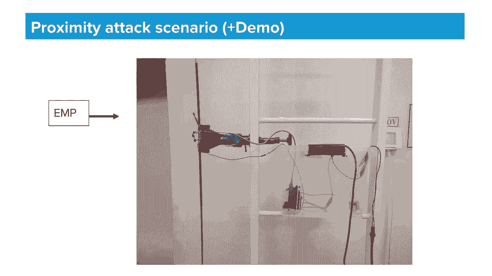

# P23：23 - EtherOops - Exploring Practical Methods to Exploit Ethernet Packet-in-Packe - 坤坤武特 - BV1g5411K7fe

 [MUSIC]。

 >> So， hi there， my name is Ben Sari。 I'm VP of Research at Armus and today with me is Greg。

 a researcher on my team。 And today we're going to talk about several methods that we've。

 explored to exploit packet and packet attacks in Internet。

 These types of attacks can allow attackers to bypass network， parameter security。

 such as NAS and firewalls。 So we'll get to how this can be done in a minute。

 but first let me tell you a bit about ourselves。 The company we both work at Armus is an IoT security company。

 It focuses on providing visibility into the behavior of， unmanaged devices in enterprise networks。

 medical facilities， and manufacturing environments。 Researching embedded devices and。

 devices in wireless communications led us to some， interesting discoveries in recent years。

 which represented previous backup talks。 These included blueborn。

 which was a set of blue vulnerabilities in， a wide array of operating systems。 I was at 11。

 a set of zero data vulnerabilities in TCP and， base stack used by VxWorks。

 the most popular real-time operating system。 And most recently， CDPON。

 led to RCEs in various Cisco devices。 Okay， so before we dive into the actual findings of our new。

 research， let's begin with the motivation that led us to it。 As many of you probably know。

 the majority of zero-click， remote-code execution vulnerabilities require attackers some。

 former network adjacency to the victim device， either direct I-curality routing or even layer-to-axis。

 This includes some of the RCEs that we've discovered ourselves， such as urgent 11 in CDPON。

 But this is also true for other well-known RCEs， such as the bluekeep and even eternal blue。

 Moreover， super vulnerabilities and again， CDPON and urgent 11 are examples of this can even be。

 exploited with a single packet if only the attacker could send a。

 fully controlled packet to the victim device from， gone its network per unit or security。

 And using this some guy on Twitter that you might have heard。

 of him posted this tweet a while back and this， actually picked our interest。

 So this is kind of the not bypass we exactly wanted to， investigate。 However。

 it's probably fair to estimate that the solution， that we've came across is very different from what Sammy had。

 in mind。 OK， so let's consider the following scenario。

 An attacker is behind a firewall and a not somewhere on， the internet。

 And his objective is to inject their two packets into the， internal subnet。

 this network segment on the left， that， lays in the English side of the firewall。

 The purpose of the net that is also acting in the firewall。

 on the edge of this network is to allow outgoing connections。

 to the internet and block anything else from entering， the network。

 The net accomplishes this by creating firewall rules on。

 the fly to allow passage of packets returning from target， servers of these outgoing connections。

 This behavior is called allowing related and established， packets。

 that is packets that are part of or related to， existing TSP or UDP sessions。

 This means that usually a attacker is able to send packets。

 into the starboard segment only when a TCP or UDP。

 session is established to a server that he controls on， the internet。 And even when this does occur。

 he would only be able to， control the payload of the application layer in the。

 packets that return to the network and could not fully， control the packets headers。 Obviously。

 this wouldn't allow him to send arbitrary， to all our free packets。

 And blocking arbitrary packets is what firewall is， there to prevent。

 If only there are some way to send packets within packets。

 some way to pass malicious packets within， legitimate packets。 That would magically--。

 and these some way would magically transform once they， pass the firewall。 That would be amazing。

 And yes， you've guessed correctly， this concept is， called packet and packet。

 The term was probably first coined by Travis Goode's。

 being back in 2011 when he discovered a way to inject fully。

 controlled LRTO packets in ZigBee and even WIFUN。 Given the ability to send packets with partially。

 controlled payloads， this sounds quite surprising and it。

 relies on the fact that wireless invisions are， inherently unreliable。

 And these guarantees that bit flips would， randomly occur in transmissions and eventually the。

 headers of the lower layers of the packet may get corrupted。 When this occurs。

 the receiver of such a packet can be， fully interpreted to the payload of the packet as an。

 entirely new packet， including the previously uncontrolled， low level headers。

 An attacker that has the ability to even partially。

 control the payload of such packets may be able to inject， fully controlled LRTO packets。

 In the example here， A7 is a synchrode of the LRTO， protocol used by ZigBee。

 And when it gets corrupted， the receiver will continue。

 searching for another preamble and synchrode inside the， packet。

 A crafted payload that contains these magic numbers will， get interpreted from that point on as a。

 completely new packet。 A more recent packet and packet attack was devised in。

 2015 for non-encrypted WIFUN。 This one targets the Mac framework and。

 regulation feature of WIFUN access points using a， different technique but with a similar concept。

 Partially controlled packet payloads together with bit， sleeves occurring randomly in the air。

 resulting in， arbitrary packet injection。 So the concept of packet and packet attack isn't new。

 but it， was mainly explored in wireless protocols。 In our case， however。

 we wanted to bypass firewalls。 And these are connected to wired networks。

 But it even makes sense for this to work on wired， protocols。

 So let's dive deeper to the physical attributes of， Ethernet。

 The most popular Ethernet cables are copper cables that use， idle fast Ethernet， which is 100。

 megabits， or a gigabit ethernet。 These two files have very different encodings on the。

 physical layer。 In fast Ethernet， the encoding uses five bit。

 symbols on the wire for every four bits of data。 This leaves space for additional control symbols。

 such as， start and end of frame。 The rest of the symbols are in value。

 Gigabit encoding is different， but it also uses a。

 similar approach where it has a start and end of frame， symbol。

 The important thing to understand is that there is no。

 air detection at this layer except for detecting， invariant symbols。

 An e-hotre cable is never connected directly to a CPU or， microcontroller。

 but rather it's usually connected to an， Ethernet to Fite chip。

 That's Fite chip is usually connected to the CPU using a， hardware interface called GMII or RGMII。

 The job of the Fite chip is to translate the， Ethernet symbols from the wire into a parallel 8-bit bus。

 sharing or familiar layer to data bytes。 Alongside the RX data valid signal used for。

 limiting the frames。 So while on the file layer， especially starting end of。

 frame symbols are used to limit Ethernet frames， on the， GMII bus。

 these explicit signals only affect the RX data， valid signal。

 And that signal is only part of what the Mac layer and the， CPU uses to limit a frame。

 We'll see this in a moment。 Here we can see what data actually appears on the wire as。

 part of the Ethernet frame and how it's handled via the， different layers。 First。

 the star symbol appears on the wire。 This causes the Fite chip to raise the RX-DV line， indicating。

 that there is an incoming frame。 Then symbols are converted to data bytes。 However。

 the first byte of this data isn't actually the， layer two bytes that you're used to seeing Ethernet frames。

 in wire fork， but rather they begin with the pre-order， sequence and the start of frame， the limit。

 or an SFD byte。 The value of this byte is d5。 The CPU， when seeing the RX-DV line go high， starts。

 writing for an SFD byte on the RX-D port。 All bytes from that， all bytes before that are treated as。

 the pre-random。 After these initial bytes， it comes with a， familiar layer two payload。

 which is the Ethernet frame， starting from its headers up to the payload。

 When the error frame symbol arrives on the wire， the， RX-DV line goes low。

 and it begins to sit to the CPU that， allows for data bytes or again not actually data， but rather。

 a CRC32 of the entire receive frame。 The most important thing to note is what verifies the， CRC32。

 this FCS， is actually the CPU rather than the， phi chip。

 And in potentially corrupted frames may arrive all this way。

 to the CPU without a green drop on the way。 So now let's see why this design is susceptible to a。

 packet in the packet attack。 Suppose the SFD of a packet got corrupted on the wire。 So in this case。

 the D5 byte got corrupted and turned， for example into a D4。

 The CPU sees the RX-DV line go high and starts looking for， an SFD byte。

 It won't find the corrupted byte， so it will keep， searching。 If the packet was specially crafted。

 the attacker， could place a D5 somewhere inside the packet payload。

 This is the first D5 in the frame。 It will be picked up as this if all the pre- unused bytes。

 will be considered to be the pre-random。 In all the implementations that we've tested， we didn't。

 find any that limit the length of this， piano sequence or even check its value。 Therefore。

 if an attacker can place the first D5 byte in， the frame， a packet in packet condition will occur。

 The only condition is that the corrupted symbol must become， some other valid data symbol。

 More importantly， the CRC at the end of the frame must now。

 be correct for both the original packet and the new， ear packet。 So again。

 this is what the original outer packet looks， like。 First， there is the corrupted SFD。

 Then there are the headers and the payload， which in this， case is attacker controlled。 Finally。

 there is an FCS， which is the CR32 of the whole， packet starting from the Ethernet frame。

 Here the attacker was placed a D5 in the payload， which now， became the new SFD。 Therefore。

 in the following bytes， all the following bytes， represent a whole new Ethernet frame。

 We'll call this the inner packet。 Again， the inner packet is a whole layer two packet， with。

 headers and all。 A big limitation of the attacker ever is the fact that。

 the inner packet must be identical to the CR32 of the， original packet。 Therefore。

 the attacker must know the exact contents of， the headers of the original outer packet。

 This includes source-induced MAC addresses and internal APs。

 These are not usually invisible from the outside of the， victim network。

 And the attacker will have to find those in advance。

 Creating the CR32 collision between the outer inner packets。

 is trivial as long as the entire contents of the outer， packet is known。

 This can be done by adding a four-byte complement value that。

 can be calculated in advance before the inner packet。 In this way。

 the CR3 of the outer packet can be forced to， become anything we want。 In this case。

 we'll make it the same CR2 as the inner packet， which allows the inner packet to be fully controlled。

 The method of how to calculate this component is well known。

 and we won't dive into the specifics of it in this talk。

 So all of this sounds kind of surprising in how do we never， hear of this before kind of way。

 But actually， it isn't completely new。 There was a talk back at 2013 that presented this exact issue。

 However， the researcher concluded back then that wired， Ethernet cables are too reliable for the。

 corruption to actually occur。 However， looking at the standard， for example， of， gigabit Ethernet。

 there is an acceptable bit error rate in， the standard specified for cat 5e cables。

 The value mentioned is one corrupted bit for every 10， billion bits on the wire。 So if， for example。

 an attacker can send 10 gigabits of， data on a gigabit Ethernet cable， a bit for it could actually。

 occur after 10 seconds。 And this is what is considered to be the， industry standard。

 So we started out to find what is actually the bit error rate， of cables in actual networks。

 As you see here， for example， on Cisco switches， you can。

 query the amount of single errors and CRC errors on each， port of a network switch。

 You can also query the total amounts of valid packets that， pass through the port。

 And use it to calculate the average meter of a rate for， each port。 In ARMOR。

 it's the company we both work at。 We manage very large enterprise networks， and that。

 gives us access to an anonymized data coming from， switches。 And we perform the survey。

 And for example， here are two very large networks。

 Both of them have tens of thousands of active switch， ports。 And not surprisingly。

 90% of these ports don't， experience any errors。 However。

 about 1% of them do experience the standard， acceptable bit error rate of 1 in 10 bit and bits。

 And 0。3% of them experience two orders of magnitude more， errors。

 And that's a significant amount of， base groups。 In the camera that have this error rate of 100 billion。

 bits， a packet in packet position can occur within， minutes。

 And this is already considering that the attack， requires that the baselet occurs on a certain byte。

 within the frame rather than just any byte， on the SFD byte。 From this data。

 it's not possible to know exactly， what's the thrust of the corruption in the ports。

 Whether it's the cable， the connector， the sockets， any of， them can be physically faulty。 However。

 if the attacker， it's not important which part is， faulty， the attack will work regardless。

 So now Greg is going to describe some of our efforts to。

 better understand the underlying causes of these faults。 So hi， I'm Greg。

 And now we're going to dive into our theory of what's。

 behind those bit flips and how we can reproduce them。 So as Ben mentioned。

 cut-five V cables have a standard， acceptable error rate of one in 10 billion bits。 But in practice。

 by actually experimenting， it's easy to， see that the error rate varies greatly between cables。

 Short cables， let's say 10 meters or so， pretty much， never experience any errors。 Long cables。

 the longest defined to be 90 meters long， will， experience something in the vicinity of the standard。

 acceptable error rate that was mentioned before。 In practice， usually less。 However。

 faulty cables of any length can experience orders， of magnitude higher error rate。

 What we refer to as Ethernet cables are actually a， multitude of different cables。

 but we focus on cut-five and， cut-six cables in this research。

 And these cables also have a parameter that specifies， their shielding。

 UTP means un-shielding and FTP and FTP cables do have shielding。

 Now any of these cables can be just as faulty as any other。 It just not as equally likely。

 From what we've seen though， the main parameter， determining the likelihood of a fault is actually the length。

 of the cable。 So what's inside those cables really？

 A UTP cable is basically just four tightly twisted pairs， of wires running the length of the cable。

 If we oversimplify a bit， each of the two wires in each。

 pair will be always set to the opposite voltage of the other， wire。

 And the signal is the difference between the voltages。

 A positive difference is the one bit and a negative， difference is a zero bit。 In this way。

 any outside interference should affect both， wires of the pair in the same way at the same time。

 Therefore， whatever the interference， the difference。

 between the wires should remain the same and the signal， should remain intact。

 But as is the case with everything in nature， those， twisted pairs are not perfect。 And therefore。

 STP and FTP cables have additional shielding， to further prevent interference。

 And any further imperfection beyond that in such cables。

 allows weaker and weaker interference to get through， and damage the signal。

 So we went around our offices and looked for faulty cables。 And here's one example。

 And the device is a fluke cable qualification tester。

 It can be used to detect and classify cabling faults。 In this case， it's connected to a fairly long。

 almost， 90-meter cable。 And the shield of the cable is not connected as the test， reports。

 even though it does have a shield internally。 Also。

 it reports that at least one of the pairs has an， impedance that's too high。

 even though the cable is still， under the allowed 90-meters。

 This cable is faulty and indeed has an elevated bit error rate。

 Another example is this relatively short cable that has a， very high error rate。

 The fluke reports that there is a bridge tap， which in this。

 case really just means that there is a short between some， of the pairs inside the cable。

 And the cable only works at fast ethernet speeds because。

 fast ethernet only uses two out of the four pairs inside， the cable。 So in this case。

 wire number eight here just acts as an， antenna。 Basically。

 that collects interference into wire number， one， which actually is in use。

 This one obviously fails to work as a gigabit cable。

 But since there is an autonegotiation procedure， the。

 switch port will fall back to fast ethernet when this cable， is attached。

 So this cable obviously has a very high error rate and such。

 that the attack actually works in seconds on this cable。

 So there isn't much point in showing your cables of her， off its floor。

 So let's do something more scientific and show a way， to reproduce the condition。

 So our goal here is to create a cable that's faulty enough， to have a high error rate。

 but not faulty enough to just， fail to work entirely。 And that's pretty difficult to do it。

 reproducibly， but we found a few methods。 The most reliable do-it-yourself method isn't exactly a。

 cable， but rather two cables that interfere with each other。

 Both cables have a fault where one of the pairs is， untwisted quite a bit。

 And this allows interference to get into the pair， but also， to be emanated out of the pair。

 So two adjacent cables with such a fault will interfere， with each other。

 This is obviously a highly， highly exaggerated fault， and。

 this is not how a fault like that would look like in any way。 However。

 this fault does stimulate a real condition， called an alien cross talk where two cables interfere。

 with each other。 This sometimes happens in long runs of parallel cables。 Realism aside。

 what's shown here is very convenient for， production purposes。

 since the error level can be adjusted by， the distance between the two untwisted pairs。

 And of course， the resulting errors are no different to， other moralistic kinds of faults。

 This will work for cables carrying gigabit ethernet。 For fast ethernet， it's a bit different， but。

 requires only one cable。 In that case， it can interfere with itself between its。

 cheeks and RX pairs。 So this is the output of a device called an electrical， network analyzer。

 which measures the signal， loss and reflections inside transmission lines。 In our case。

 it's a net cables。 The signal loss is graphed against the frequency range of， 50 to 200 megahertz。

 which is the ballpark range for， ethernet。 This particular graph shows the signal loss between the two。

 untwisted pairs from the previous slide。 You can see here that there's only about 25 decibels of。

 signal loss from the aggressor to the victim cable。

 The standard specifies actually that 24 decibels is the， expected loss in a 90-meter cable。

 So this interference is pretty much just as strong as the， single in a very long cable。

 So another do-it-yourself fault， this time a bit more， realistic。

 One of the pairs here is shorter to the aluminum foil。

 shield that surrounds an FTP cable on the inside。 Among all possible cabling shorts。

 this is probably the， most likely one。 In this case， we just solder one of the pairs to the。

 shield to have a reliable condition。 Obviously， in a real cable， this kind of short can。

 disappear or reappear if you bend or flex the cable。 So in this case。

 the shield is electrically connected to， one half of a pair， essentially acting like an antenna。

 This will allow interference from outside and even。

 reflected signals to mess with the original signal in the， pair。 So here on the top graph。

 we can see a trace that shows the， signal attenuation in the normal 60-meter cable。

 And on the bottom graph， we connect that 60-meter cable。

 to the 2-meter shield-shorted cable from the previous， slide in series。

 And I'll explain what I mean by that in a bit。 Now， as you can see。

 the result is an additional 10 dB of， attenuation。 It's far more than a 2-meter cable should cause。

 And there are， of course， other kinds of cabling faults。

 like partially torn wires that we simply don't have time to， cover。

 So about connecting cables in series。 This sounds strange， but actually that's what's usually。

 the case。 Let's picture a model scenario for how the device is， commonly connected by cables。

 The device is， in fact， rarely connected by one cable， directly to a switch。

 but rather it's connected via， multiple cable segments， C1 through C3 on this slide。

 That electrically speaking， constitute one cable。 Now， with regards to bit flips。

 they happen due to a， combination of factors。 First。

 there needs to be high signal attenuation in the， cable。

 And this is caused by long cables and is not a fault in， itself。

 Then there doesn't need to be a fault somewhere in this。

 chain that allows some interference to get through。 And finally。

 there needs to be a source of electromagnetic， interference， or EMI。

 that affects the faulty region of， the cable。 These actually occur naturally from nearby equipment or。

 cabling。 So for bit flips to occur， you basically need a long faulty， cable。 However。

 as you can see in this case， C2 here can be long， and C1， for example， can be faulty。 So together。

 the combined cable， C1， C2， is now a long， faulty cable。 So let's clarify。

 Our attack consists of sending lots and lots of packets。

 that encapsulate the packet in packet payload as fast as， possible over the faulty cable。

 The attacker will then wait for a bit flip to occur in the， right place， which is only S of D byte。

 The odds of this decrease with the length of the attack， packet。

 So the attacker will choose shorter packets in order to， have more S of D bytes on the wire。

 Basically， all of this means that an attacker can only。

 reasonably hope to inject one packet in an attack that， could take hours。

 So what single packet can do the most damage？ And there have been certain single packet RCEs。

 like our， Urgent 11 or CD-PON attack that Ben mentioned in the， beginning。

 There are also some rare examples， like a 2018 memory。

 corruption in Apple's X and U kernel that could do us， basically all Apple devices back then。

 But there are also some packets that are problematic by， design。

 Let's look at an IPv6 router advertisement， R。A。 packet。 This is kind of like a DHCP offer。

 but for IPv6。 And just like DHCP on IPv4， this packet can tell the。

 receiver how to set up their IPv6 routing table， DNS， servers， and also search domain。

 which on windows can be， interesting。 For instance， this will allow the attacker to configure the。

 Windows automatic proxy discovery feature and configure a， proxy server for all HTTP traffic。

 So this is what an injection of such an R。A。 packet would， look like。

 On the left you see a benign UDP packet， of which there are， lots， you only see one。

 On the right you see an R。A。 packet after a bit flip。

 happened on the S of the byte of the original packet。 And as you can see。

 the injected packet is broadcast， and， obviously it can be any packet as we fully control it。

 including the layer two header。 This packet will be received by everything that's downstream。

 from the faulty cable。 In case you didn't know， IPv6 is almost always enabled on。

 every interface of every modern device。 There doesn't need to be a working IPv6 network for this。

 to work。 And the R。A。 packet is different to the familiar DHCP of， IPv4。

 by not being a request response protocol。 In DHCP， a device usually requests configuration and then。

 waits for a response。 With R。A。 packets， all devices just constantly listen for， unsolicited R。A。

 packets。 And this is kind of like the ancient pre-DHTP reverse， R protocol。 In the R。A。 packet。

 as you can see here， an attacker can add， DNS servers to the victim and also set the storage domain。

 Now you'd think this will only be limited to IPv6 DNS， servers。 However。

 there is a feature of IPv6 addresses called IPv6， mapped IPv4 addresses。

 or actually IPv4 addresses are， mapped onto the IPv6 address space。

 And the intent is to actually use the IPv4 protocol to， reach them。

 So even though it's technically an IPv6 address here， these。

 are actually really IPv4 DNS servers and will be used as， such。 Also on Windows。

 the Windows automatic proxy discovery， feature will try to download a configuration file from WPD。

 attacker， domain if attacker domain is set to be the search domain。

 And this feature is still on by default in Windows， even in， 2020。

 So now we're going to do a demo and then we'll take it through， it。

 We're going to show a demo of this attack。 And this scenario of the attacker has prior knowledge of the。

 network， including MAC addresses and where the fault decay， bill actually lies。

 So this has some quick represents。 The attack scenario is a one click， so the victim is。

 cursed to click on a certain link that will leave the。

 browser to send the UDP packet to the attacker， causing the。

 net to allow incoming traffic for the established， connection。

 The attacker will abuse this by sending many UDP packets back， to the victim。

 Bitflip would eventually occur on the faulty cable， leading to， the packet in packet condition。

 Lastly， the injected packet would be this IPv6 router added。

 for other thousand packets that we've just discussed。

 And we'll show this in the terminal and I'll explain throughout， what's actually taking place。 OK。

 so what we have here is a simulation of the network that， we seen in the previous slide。

 On this edge is the firewall， the net。 So this is the edge of the network and here is the internet。

 And then after it， we have a core switch and that connects， through this bad， this faulty cable。

 this is the worst， cable that we can find in our office， tool and access， switch。

 This access switch has this internal segment and to it。

 connects this window device and this device would be our， victim。 OK。

 so on the right we have the attacker's terminal。 On the bottom part of his terminal we have a packet。

 capture of the attack from his point of view。 And on the left we have a VNC to the window device。

 which is， the victim device located inside the internal segment。

 First we can see that the faulty cable has an impact on。

 the network performance of this device but not a very， significant effect。

 So there is some packet loss but not a lot。

 And now we can launch the attacker launches an， ambush script with the MAC addresses that we found in。

 advance。

 And the victim would enter a link that will take him to， the attacker's web page。

 The attacker will then send all these E-leaping packets， back to the target。

 Some of them would bit flip and we can see in the wire。

 shark on the windows device that they've turned into this， wire advertising packet。

 again due to the packet and packet， attack。 And this wire advertising packet where just served this。

 DNS， serves the main on the window device。 And this would be used for the windows proxy auto。

 discovery feature。 So when regular went to Google com， he actually got this， point page。 OK， cool。

 OK， so the biggest problem with this attack is that the。

 attacker needs to know the internal MAC addresses that， appear in the packet headers。

 Otherwise they can calculate the CRC complement。 These internal MACs are not visible from outside of the。

 LAN。 However， they're not a secret and they were never， designed to be a secret。 In some cases。

 it's easy to guess them。 For instance， in a non-internet scenario， let's say for an。

 attacker in a DMZ。 One interface of the firewall is directly visible。

 And as is the case with most network equipment， the MAC。

 addresses of all the interfaces of the same equipment are， adjacent。

 So it's easy to guess the rest of them knowing just one。 Better yet， if you look at Wi-Fi。

 even on encrypted WPA2， network， the MAC addresses appear in plain text over the， air。

 And they can be picked up by sniffing in monitor mode in， physical proximity to the network。

 These MACs are the same exact MACs as on the wired network。

 It's fairly common for organizations to bridge their。

 access points directly to their wired networks。 So for example。

 the MACs of the default gateway will be， visible in the air， even though it's not even a wireless。

 device。 What's more is that MAC addresses never change。

 If an attacker physically arrives on site once， the， collect MAC addresses。

 this will remain correct forever。 If you sniff Wi-Fi in monitor mode， this is what you'd， see。

 Even though the data is encrypted， here you have five， MAC addresses per packet in plain text。

 of which one is， always the MAC of the wireless device。

 And another is always the MAC of another device on the， network， be it wired or wireless。

 In this case， you have a Xiaomi phone talking to a， Fortinet firewall。

 which is its default gateway to the， internet。 These are the two MACs that appear in any。

 ethernet packet coming from the firewall to the device when。

 traveling on the wired network on the way to the access point。

 So now it's actually time for the fun part of this talk。

 And we talked about how faulty cables are cables that are。

 susceptible to reasonable electromagnetic interference。 However。

 what about unreasonable interference？ An unshielded cable， even if not faulty in itself， given an。

 already attenuated signal， should become susceptible at， higher interference levels。

 And surely you'll know that EMP weapons are a thing。

 These are designed to kill electronic circuits at a， distance。

 They operate by sending very short but very powerful， wideband bursts of radio， commonly in the 100。

 megares to 2 gigahertz range。 The wavelengths of this range just about match the。

 lengths of wiring inside various equipment。 And at those power levels。

 any such wire becomes an antenna。 And so we'll apply voltages to random parts of circuits。

 With high enough power， this is meant to fry all， source of electronics。

 Now we don't need to fry anything。 All we need is to disrupt already weak attenuated signals。

 Therefore， the same thing will work for us at much more， reasonable power levels。

 So finding public research into EMP devices online isn't， exactly easy。 However。

 if you refer to this as an EMP simulation， you can， get all sorts of results。

 These separate papers all talk about creating a fairly， similar device。 Basically。

 they charge a capacitor to half a million volts， and then discharge it through a fast spark gap in parallel。

 to an antenna。 And this creates a very short， under one nanosecond pulse。

 with the power level close to a gigawatt。 This kind of pulse will appear as a powerful。

 wideband radio burst when radiated from a proper antenna。

 But all we need for the sake of demonstrating the phenomenon。

 is simply the oldest kind of radio transmitter that was， invented in the late 19th century。

 And this works the same way。 A capacitor is discharged with a spark gap， only far lower。

 voltage is used in the range of 10，000 volts。 And a simple open-air spark gap is used。

 This kind of transmitter is a powerful source of interference， in the 50 to 150 megahertz range。

 This is what the transmission spectrum of our device looks， like。

 A wideband pulse between 50 and 120 megahertz。 The actual power level is much higher than shown here。

 since， the pulses are very short。 And this is averaged over time。

 This is the kind of interference and a oscilloscope probe loop， which is not connected to anything。

 will experience at the distance of 2 and 1/2 meters， from our device。

 You can see that the main frequency is indeed around 80。

 megahertz and about 600 millivolts are induced in the wire。 Now。

 attenuated ethernet signals have voltage levels， in the range of 100 to 200 millivolts。

 So it's reasonable to expect this interference， to affect the signal。

 And on a 10-meter long unshielded cut 6-cable， 2 meters from the device， we can also。

 see that not only are voltages induced， but they're also different enough between the wires of each pair。

 such that they affect the differential signal， as again， the pairs are imperfect。

 And this is shown in purple on the graph。 Now， this is what guarantees bit flips to actually happen。

 OK， now we're going to show a demo of the proximity attack， and then we'll take it through this。 OK。

 so this last demo is a proximity attack。 In this scenario， the attacker is physically。

 near and Wi-Fi access point。 And his objective is to induce beta hours in the ethernet。

 cable that is connected to it， which is unshielded but not， faulty。 As Greg explained before。

 the attacker， is able to connect the MAC addresses of the victim， and not via Wi-Fi monitor mode。

 Then when sending an embarrassed of crafted packets， from the internet， the attacker will。

 use the EMP device at the same time。 This will cause bit errors on the AP's ethernet cable。

 which will lead to a packet and packet attack， even though the cable is not faulty。 Lastly。

 the injected packet is the same IPv6 RA packet， that sets up a search domain on any window of the machine。

 connected to the AP。 And we'll show this now in actually the video， that we recorded。 OK。

 so this is the setup from the previous slide。 This is called a shot in a bomb shelter。

 just so this would be like an ad hoc fairly cage， of this setup。 We have an access point here。

 We have a window device， the victim， that is connected to the via Wi-Fi。

 There is this long ethernet cable， the blue cable， that is connected to the access point。

 And this cable will be targeted in the EMP attack。 It's caught a bit of a bit of a flips on it。

 It's non shielded but not in faulty cable。 In Greg， the attacker here will be launching the attack。

 Here we can see a close-up of the EMP device。

 And here we can see how it looks when it's turned on。 And we can see this attack now。

 We'll have this window device here initially。 We can see that it doesn't have a search domain。

 configured on it。 Once the attack succeeds， it would have。 And Greg would launch the attack。

 sending the burst of UDP packets。 And simultaneously turn on the EMP device。

 And we can see the router advertising packets， have been injected via the packet attack in the wire shark。

 And we can also see that the search domain has now， been registered for this device。 OK。

 and we have really limited time。 And so we tried to talk quickly through a lot of material。

 But I wanted to conclude on a few notes for this talk， before we get to your questions。

 First of all， yes， it seems that if you're， packing attacks are possible， it's not a simple attack。

 And we saw that it has a couple of prerequisites。 But nevertheless， we were surprised to find out。

 that it was more practical and more real， than we ever thought about。

 And then there needs to be some way， to eventually handle this issue。

 There shouldn't be a reason for anything， to have this problem。 Although。

 as seen in previous research， preventing packing and packing attacks， is quite a difficult task。

 We also blog about this with more information。 On our website， it's in the link here。

 And we will be happy to answer any questions that you have now。 Thank you。 There。 Hi， guys。

 We hope you enjoyed the talk。 If you have any questions， we'd be happy to answer now。

 So we can see your questions in the chat if you post them。 This is quite unusual in the research。

 And so sometimes it's hard to really follow， all the steps that are required。

 We do know that it's difficult attack to pull off， but not an impossible one。

 as we've shown in this talk。 OK。 Thank you。 If you have any questions， we're here to answer。 OK。

 So there is one question here about POC scripts。 This attack relies on a couple of elements。

 other than code。 And you need to have another faulty cable or a type of AMP， device。

 which we don't recommend that you build。 It's quite dangerous。

 But we do have a part paper in which we， detail how you can replicate this type of faulty cable。

 even in a simulation mode。 And so you can go ahead and read the part paper。

 That can be a first step。 And so there's a few questions about the AMP。

 So as far as shielded cables go， they're obviously better。

 And now I wouldn't say that they're completely， impervious to this， because I did。

 see it work on some shielded cables。 But it works obviously a lot less。

 And I didn't really try to quantify how well it would， work on shielded cables。 Of course。

 cables that are shielded in the best possible， way， which are STP cables。

 where every pair is shielded， separately。 Fair pretty well。 Also。

 the shield needs to be connected on both sides of the， wire。 And if it isn't。

 then that includes inside the sockets。 So basically， the cable itself being shielded isn't。

 exactly enough。 But if everything is properly shielded， that means that it's。

 a good shield and it's connected on both sides， reaching both terminals。

 Then I would say it would be very difficult for that， AMP attack to affect that cable。 But again。

 I think it's a matter of just adding more， power， add more power， and it will probably。

 then trade even those shields as well。 There is a couple of questions here about the range of the。

 AMP。 So we didn't really try to maximize this。 In our small test of it。

 it was just about three meters or so， of range。 We do think that having an antenna。

 a directional antenna， unlike the one that we've used， would probably extend the， range。

 giving it more， do a small power， also have a， similar impact。

 So we do think that this can become something that works， from a more distance that we've shown。

 Yeah， but again， the AMP， all of this， it follows the， inverse square rule。

 So it will never work for a very large distance。 You can make it directional。

 But at these frequencies， I mean， you've seen that pretty big。

 like 2-meter tall antenna in order to do this at a distance， of 2 meters and it's only directional。

 And now it wouldn't need to be longer， but to make it， directional， like a YAGAN antenna。

 for example， it would， also need to be like 3-meters wide。

 But then it would work for a larger distance and be， directional。 But really， I mean， again。

 as a disclaimer， we're not， exactly--， Expressing this specific field。 Yeah， and this field。

 it doesn't have all that much， information freely available about it online， because again。

 there's no legitimate use for this kind of thing。 The purpose of that talk in our talk is to just demonstrate。

 that it's theoretically possible。 We came to a point where we have a device capable of。

 interfering with the cable。 But more research is needed to understand what drives it。

 what all causes for it to work better or worse。 There is a question here about the 40 cables。

 and I think， then we need to finish。 OK。 So--， [INAUDIBLE]， Yeah， so we did measure--。

 there is a question about measuring the signal strength， inside the cabling。 And yes。

 we use that electrical network analyzer device， and measure the signal loss in just standards compliant。

 long cables， and then when attaching various quality， cables to them， there is a white paper。

 And well， we didn't exactly publish measurements of cables， from our office。

 There is information there about what these cables--。

 how strong the signal should be in those cables and such。 Yeah。

 and I think we need to stop at this point。 Thank you for watching。 Again。

 we have more info in the white paper on the website。 It's armist。com/ether oops。

 If you're interested。