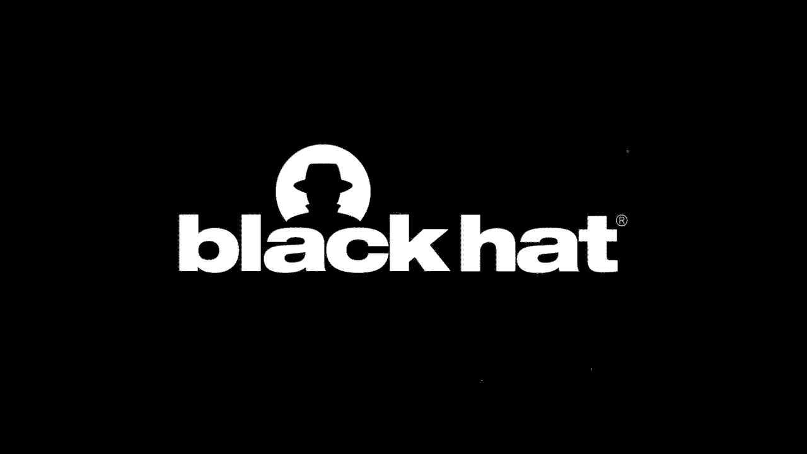

# 【转载】Black Hat USA 2020 会议视频 - P24：24 - Building Cyber Security Strategies for Emerging Industries in Sub Saharan A - 坤坤武特 - BV1g5411K7fe

 [MUSIC]。

 Hello Black Hat community。 Thank you for giving us an opportunity to speak at Black Hat USA 2020。

 Today we'll be tackling the topic of building cybersecurity strategies for。

 emerging industries in sub-Saharan Africa。 I'm Laura Titch and I'll be speaking alongside Evelyn Killel。

 where the co-founders of Shehakskei， which is a community of women in cybersecurity in Kenya。

 We have different programs for our women， where we bring together learners experts to share their knowledge and。

 experiences through webinars， bootcamps or mentorship。 So why this talk？

 Towards the end of last year and the beginning of this year。

 we were trying to come up with a curriculum for our community members。

 We wanted something that could fit the needs of the industry。

 So we went looking for data to give us information about how the security。

 landscape in sub-Saharan Africa looks like。 And in that process。

 we found it difficult to get data that were specific， to sub-Saharan Africa。

 We started asking ourselves a question， if we do not have data about sub-Saharan， Africa。

 how then can we come up with proper strategies for the cybersecurity industry？

 The other reason we submitted this talk is to create awareness on the。

 cybersecurity industry and communities across sub-Saharan Africa。

 We wanted people to know that there is an existing cybersecurity industry here。

 And as much as it needs better or more expansion， we still exist and。

 we need to work together to come together with a different stakeholders to make the。

 industry better。 And the third reason is to encourage professionals in sub-Saharan Africa。

 professionals and enthusiasts。 So we wanted people to see that there's an existing community and。

 the industry needs more professionals。 So we want to encourage more people to try join the industry。

 to join communities inside the security in sub-Saharan Africa。

 and to work together to build this industry。 So where do we start？

 We came up with four questions that could help us come up with a curriculum。

 So the four questions would all together work to come up with a proper。

 solution for the industry in terms of building the curriculum and building the strategies。

 The question was， what are some of the most used technologies？

 Now this would give us an idea of what the technology landscape looks like， in sub-Saharan Africa。

 What are the most used technologies？ So that we get to understand what threats come with these technologies。

 The second question， what does the threat landscape look like？

 Now after figuring out what the technologies are that we use the most。

 then we'd get to find out what the threat landscape in the region looks like。

 The third one was what are some of the effects of cyber threats？

 Now this is not just to the economy but to the different stakeholders， the governments。

 the companies and even to individuals， wanting to figure out what are some of the effects or what effects have cyber crime。

 activities have had in sub-Saharan Africa region。 The fourth and final one is what has worked in the past。

 Because we do not want to come up with strategies from scratch， we are going to repurpose the ones。

 the activities that have worked in the past， or the solutions that have worked in the past。

 So we are going to discuss all those four questions in detail as we go by。

 I now welcome Eve to take us to the threat， landscape in sub-Saharan Africa。 Thank you。

 Thank you Laura for kick-starting the presentation。

 My name is Evelyn Killel once more and I'll be taking you through the。

 cyber threat landscape in sub-Saharan Africa。 So before that I'll take you through the prediction of the。

 prediction of growth in the ICT market in the region。

 So the total sub-Saharan ICT market is predicted to grow from， $95。4 billion in 2020 to $104。

2 billion by 2023。 So this is due to the rapid digitization and falling costs of the ICT， market。

 So the key areas of growth in the region is。

 mobile。 The key areas of growth in the region is mobile money。

 Why has it penetrated the sub-Saharan Africa is because of the。

 un-bank population in the region that are able to access。

 the different finances through mobile money platforms。

 So the key example of mobile money penetration in the region is。

 Empressa which is the leading in Kenya and it has more than。

 above 30 million consumers in the region。 Additionally。

 there are new other technologies that are being adopted in the， region。

 One of them is cloud technology which is， highly adopted by their small medium enterprises。

 Why cloud technology for this small medium enterprise is because of the。

 ease of use for of the cloud platforms that we have。

 So also to that the new other technologies one of them is blockchain and big data。

 This new technology is introduced new threads and vulnerabilities。

 which ensures that which is an indicator that we need to build， a better and robust cybersecurity。

 frameworks to support in the new vulnerabilities that are introduced by。

 the new technologies that these markets consume。 So additionally to that most organizations have not really considered。

 the cybersecurity impact。 Cyber security impact， in in the region that means this need to to have more investments。

 for cybersecurity in the region。 With regards to that I introduce。

 I let Laura to take over the common threats in sub-Saharan Africa。

 So it has taken us through what the threat landscape looks like in sub-Saharan， Africa。

 Now we're going to talk about the threats that are common in the region。

 An organization called SIRIA， a new came up with data that that showed that the。

 most commonly targeted industry in the region in terms of cybersecurity。

 government and the banking sector。 Now it has talked about the mobile money， market in the industry。

 There's an 82% penetration of mobile money， in the sub-Saharan Africa region and with this came the installation of new。

 ATMs because people needed to convert the money the digital money into， physical cash。

 Now this brought about new， other new threats or attacks in that sector。 Now most。

 countries in the region have taken advantage of mobile telecommunication。

 to expand their businesses and attackers are using this as an avenue to get。

 money and to get sensitive information from these people。

 Now one of the common attacks are of course social engineering。

 You've heard of the Sakawa boys or the famous Yahoo boys， the Nigerian prince。

 Where they manipulate people into giving them sensitive information and most， importantly money。

 Now the same threats are common in the region where。

 in like the empere case you get someone calling you。

 pretending to have sent you money and then they ask for a refund。

 Now for most people or for most mobile security， mobile service providers。

 they have services that allows you allows money to be refunded without the。

 customer actually refunding it back themselves but most most people are。

 not aware of this and they end up sending back money。

 that wasn't sent to them in the first place and that's how people， end up losing money。

 Another common threat is， seam swap。 Now this is especially common to people who use。

 mobile money which as I said are very many people in， in the sub-Saharan Africa region。

 How this works is that someone， social engineers do by sending your fishing links and you end up giving them。

 your sensitive information mostly your passwords and pain， and other identification。

 Now using this identification， they take your or steal your information and then call the mobile service。

 provider asking them to block the same cut and they say， I am the owner of the same cut。

 These are my registration details and they， give all these details that they have stolen from the victim mainly their。

 identity their pains and passwords and all this other， identifying information。

 Now having this information the mobile service provider。

 will know that this is a legitimate case of someone who's lost their same。

 card or who who's lost their phone so they end up blocking the。

 number of the person who's the legitimate owner of this number。

 and then the attacker who now has the new number， uses this new number to generate one-time passwords。

 and with this one-time persons they're able to get into the victims。

 banking on that banking and steal cash from them。 Now that is one way that attackers can get money from。

 unsuspecting clients。 The other way or one of the other common threats is。

 internal fraud which is more common in the banking sector as well。

 Here usually employees of banks or even mobile service providers work with。

 outside attackers and they leave and they end up stealing money from， victims。

 They mostly targets deceased clients， who may not someone may not be able to follow up with this person's money。

 and that's how money is lost in the banking sector。

 Now we talked about the government being one of the other hardest hit， industries。

 Last year in Kenya for example that is in 2019， 19 government sites were hacked in 1D。

 So this threats are common， not just in Kenya but other countries in sub-Saharan Africa as well。

 where governments are targeted for information for fun。

 and just for stealing sensitive information in case they have stored any。

 of this information in their sites。 Now what are some of the economic effects of cyber crime？

 In sub-Saharan Africa a lot of countries have lost， big amounts of money to cyber crime。

 South Africa for example lost an， it they lose an estimated 573 million dollars annually。

 while Nigeria loses 500 million dollars annually as well and Kenya loses。

 36 million dollars annually。 Now this in proportion to the GDP of this。

 countries is very big lost to to cyber crime， and besides the economic losses there's also。

 losses to individual companies where they still they lose sensitive。

 information they lose clients and they lose money as well。

 So there are a lot of very many cyber effects to cyber crime。

 that has affected the people of sub-Saharan Africa。

 So if he's going to take us through some of the challenges and some of the things。

 that have worked in the past。 So I'm going to take you through the。

 different challenges that the sub-Saharan Africa region。

 face with regards to cyber security threats。 One of them is poor data security， practices。

 So with that， fraudulent parties can， access personal data which leads to identity theft。

 and with identity theft it can lead to since what as Laura mentioned earlier。

 Secondly we have skills gap。 With skills gap most in most。

 tertiary institutions do not offer cyber security causes as part of the。

 curriculum at the moment and also employers are not。

 focused in training the different stuff that they have， with regards to cyber security。

 Also there's a lack of awareness parts， most organizations are not aware about their cyber security threats they face。

 on a day-to-day activities which creates a point of。

 failure with regards to managing cyber threats in， the different organizations that we have。

 There's also the poor implementation of， cyber security tools with regards to poor implementation。

 There's their aspects as I mentioned earlier known as， skills gap。 With skills gap with skills gap。

 aspects not many staff are able to manage setting up the cyber security。

 solutions in the organizations according to the required format and also most。

 organizations just implement cyber security tools as part of compliance to。

 ascertain risk or gap that was identified in the， organizational systems。

 So additionally we have most， organizations in in South Sahara and if。

 Africa region have limited budget to cyber security。

 It's now 96 percent of African organizations have an annual budget of， $5，000 for cyber security。

 There's also the aspect of use of generic accounts。

 with generic accounts and use of generic accounts and shared， passwords。

 So generic accounts anyone and everyone anyone who has access to。

 that particular generic account can access， the different systems in the organization that could be one of them could be。

 co-banking platforms in the different banking sectors that we have。

 and also as Laura mentioned earlier this could lead to。

 internal fraud which which impacts the organization and leads to。

 lots of revenue and economic and has a higher impact on the。

 economy for that particular organization。 There's also the lack of， segregation of duties。

 With that cyber security is part of the IT， operations team。

 In that way there's no team that is fully， focused to set up cyber security solutions for the。

 organization。 Okay let's look at what has worked in the past。

 with regards to cyber security awareness in the， sub-Saharan Africa region。

 Among the key drivers for that is， communities。 Communities offer trainings and also offer。

 trainings to the different community members， which creates more awareness with regards to cyber security in the region。

 So among the communities are Shehaks which Laura mentioned earlier。

 and also we have other communities in Kenya namely， Afrikharcon and KCSFA。

 There are also communities in Nigeria， that is Ashis Sekhos and Nigel Sekhorn。 There's also。

 Hakatan Gals in Gambia。 So with these communities。

 they're key drivers of creating cyber security awareness in the region。

 So with more cyber security awareness different community members are able to。

 adapt to professional cyber security certifications。

 that create better opportunities in their field， for the different community members。

 Additionally there's also local support。 One of the key examples is a equal innovation hub that offer mentorship。

 and also of mentorship and training to the local， talent。

 They also offer opportunities to the local， talent。 We also have Sephricom that have。

 about bounty program where local security researchers are able to。

 participate in it and identify the different threats。

 with with regards to the items that are exposed publicly for them to， to look at。

 There's also there's also the aspect of collaborations。

 so with regards to communities we have local collaborations。

 with the different communities in the region。 There's also an example of cross-continent。

 collaboration。 One of the key examples is a court who have。

 really supported different communities in Kenya and also in Somalia。

 Other key drivers are conferences and in Kenya and last year we had。

 annually we have conferences that protect this， the aspect of creating more awareness with regards to cyber security in。

 the region。 So last year she had had her first， that created more awareness to different members in the community。

 We also had Africa Harkon which is an annual conference also。

 additionally outside the Kenyan region。 We have other regions like Nigeria who。

 normally have Niger-Seqon annually to bring together community members and。

 put create more awareness with regards to cyber security。 They also locally built tools。

 One of them is， Miraframe Oak that was developed by Christian and that is。

 mostly focused on mobile security testing。 We also have。

 OWASP Top 10 vulnerability scanner that was developed by one of the。

 security such as cold one year in the region。 We also have。

 a security scanner for big for big F5 big IP devices。

 F5 notably by one of the security such as in Nigeria by the， new， Rotimi。

 They also regulatory bodies that， provide guidance with regards to cyber security and。

 the key elements that different organizations have to comply with。

 one of the key examples in the eastern Africa region is central banks。

 Central banks offer regulatory guidelines to the different banking， institutions。

 So the different ones in the region are required to。

 to do an annual security and IT audit for those organizations。

 So with regards to that this creates a better landscape， a better。

 and robust cyber security posture in the region。 So I know welcome Laura to take us through how we can。

 make the different solutions in the region better。

 So now that we have looked at one of some of the things that have worked in the past。

 how can we make these solutions better。 So in the beginning of this presentation。

 we mentioned the four questions that we came up with。

 to try and figure out how we can create strategies， create curriculum for the。

 cyber security industry in sub-Saharan Africa。 We talked about the threat landscape in the region。

 We looked at some of the technologies that are most used in the region。

 We also looked at things that have worked in the past。 So how do we make these solutions better？

 The first way or the place to start is to have more conversation。

 which is what we are actually doing now with this conference。

 We are trying to reach out to most stakeholders namely governments， education institutions。

 the different experts， cyber security experts that we， have in the region and policy makers as well。

 We are trying to have these conversations with them on how can we further develop。

 the cyber security industry in the region。 The second thing is investing in more research and development。

 This is in terms of the data that we need in order to come up with better。

 solutions and also the tools that we need。 You've talked about some of the locally built tools like the MARA framework。

 and the OAS web application testing framework， that are developed by members of the community。

 So we need more research and development in terms of。

 the tools and the solutions that can work in the region。

 Also supporting regional talents is one way that you can make the cyber security。

 stronger in this region。 So we talked about how， e-cral innovation supports local talent by providing mentorship and also。

 opportunities for them。 So we need more organizations， local， organizations to support local talent。

 In the recent past we've had cases where， bigger organizations would invite or hire experts from other regions。

 outside of Africa to come and do the different security testing for them。

 Now we want them to support local talent because what we're saying is。

 we have people who are capable， we have people who have the knowledge and the。

 skills to do this for our own organizations。 The fourth and I believe one of the most important things that we should look。

 into is education。 There's luck or very little， education with regards to cyber security in the region。

 I'll give an example of Kenya where we only have two。

 education institutions that offer cyber security as a course。

 Now these two are all both private institutions which means that not。

 everyone can afford to study or to take up cyber security as a course， in college。

 Now this is why communities step in but at the end of the day we。

 also need our education system to update their curriculum。

 to include the more recent or some of the most commonly， used technologies in this period of time。

 So we need， education institutions to support or to include cyber security in their。

 curriculum and the fifth one is cheaper solutions。

 Now we talked about how most organizations in sub-Saharan Africa， only set aside a budget of $5。

000 annually to support cyber security， operations。 Now this is not nearly enough but。

 unfortunately it also reflects our economy。 So we need solutions that are more。

 affordable for the different organizations that are more， reliable， effective and also reachable。

 So we are asking， individuals， organizations， communities to come together to look at ways in which。

 we can offer affordable， cheaper， effective solutions。

 to support the cyber security market in the sub-Saharan， region。 So that has been our presentation。

 We are hoping that you have， learned a little about the cyber security landscape in the sub-Saharan region。

 some of the things that have worked and some of the ways that you could support。

 us or we could learn from you in order to implement， proposed strategies in the future。

 Thank you so much and we now open the flow， to questions。 Thank you。 Hi。

 Thank you so much guys for attending our session today。 So we've seen a lot of questions。 Yes it is。

 So there are some questions， the past one by Maddy。

 I think we've answered that is mobile money meaning， like paying with your phone like Apple Pay。

 So as we said， I'm grateful for that。 I'm grateful for that。

 There was also a question on can you provide the example of educational。

 privilege to protect consumer value being impressed？ Sorry about that。

 There was a delay in the feedback so we don't know when， just not but yeah。 As you said。

 our impact on money is mobile based money， times fast and you can pay for goods using we have two numbers。

 we have pay bills。 Today I was about that。 I was in the feedback so we were able to take the cash。

 I would say it was mobile based money。 And you can pay for goods using the funds to。

 have two numbers。 Yeah。 And here here are two。 Yes， if you can go ahead。

 So I wanted to point to a question on what are the different ways of。

 of how we protect consumers as well using them first。 So we have two concrete ways。

 One is a platform called HAGI SHA which means， that it gives you a platform to confirm the person you're sending money to or you。

 transferring money。 This enables someone to confirm exactly that the。

 person the recipient of that particular amount is the same for that， they understand too。

 There's also if by initial spend money to， make a transparent to a wrong number the support number。

 those three four that you spend particular time， for that year's round。

 So with that you're able to get， within a limit to one unit。 So。

 you're able to get in a point where you're getting more than one unit。 So。

 you're able to get more than one unit。 And here， you're able to get more than one unit。 So。

 I think that's why you're able to get more。 One unit。 There was also a person who got to find some。

 budget。 So， we establish that figure for a different， budget。 So， we just get the links to that。

 Yeah， so that's the question of does the use of open security tools help with the。

 needing cheaper tools problem。 Yes， there's that and it does help a little bit。

 It does help a little bit but some of these tools are not really helpful to， what we do sometimes。

 So， we talked about the MARA framework and how， it's we use it for mobile application security testing and we talked about some of that。

 tools that were developed by the OAS community in Kenya。 So， these tools are very。

 helpful but sometimes they're limited in terms of what we can achieve using them。

 I think what kind of concerns do you do have about using foreign investments， US， EU。

 China to support information infrastructure in SSE？ I think with regards to that， there is。

 already a way， an ongoing conversation with a different organization like， Huawei。

 Cisco to support us on the different defense mechanisms that we have in the region。

 And most of us are consumers of the products that they have to create a defense in the。

 platforms for the different organizations。 [silence]， [silence]， [silence]， [silence]， [silence]。

 [silence]， [silence]， [silence]， [silence]， [silence]， [silence]。

