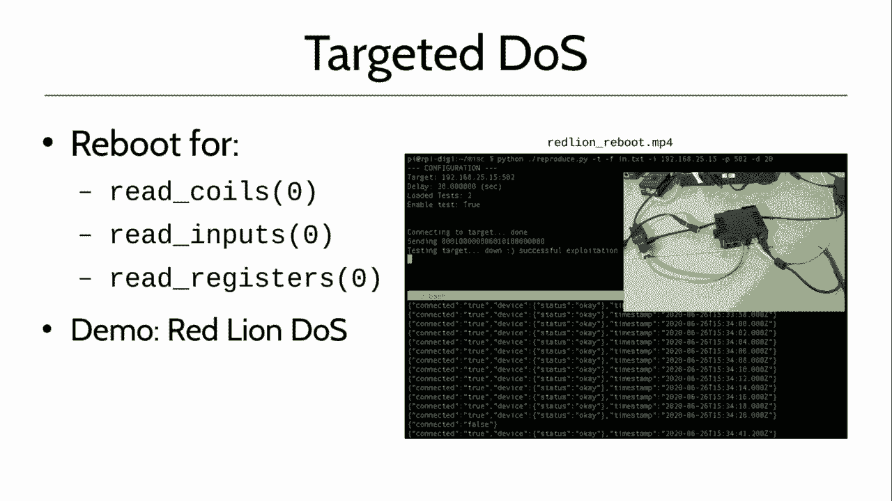
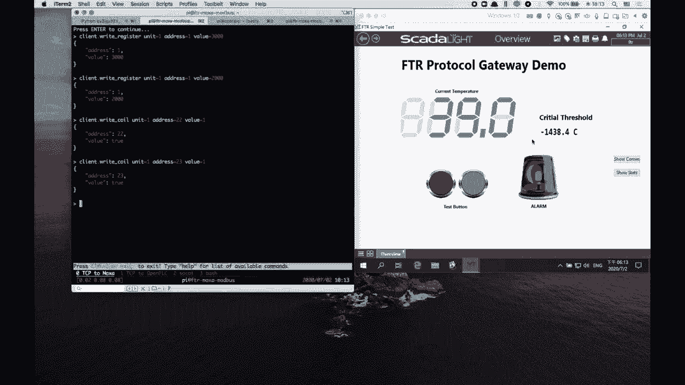
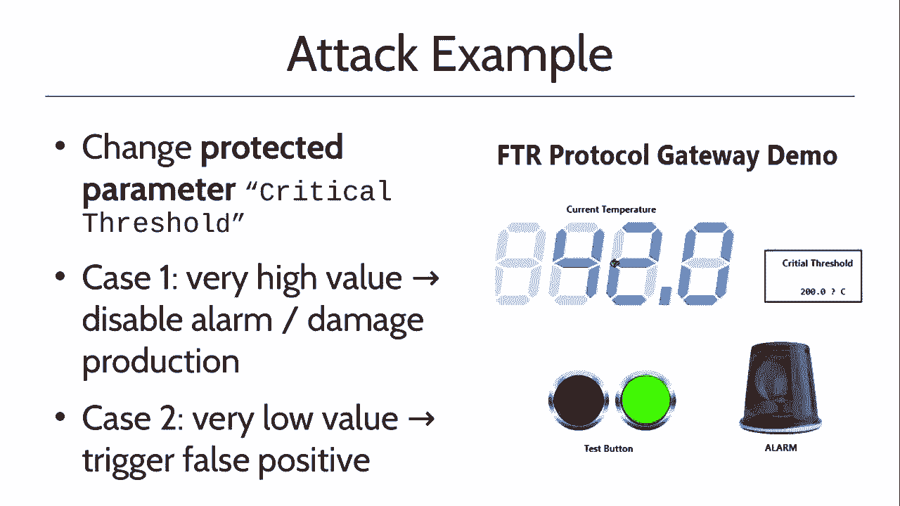

# P25：25 - Industrial Protocol Gateways Under Analysis - 坤坤武特 - BV1g5411K7fe

 Hello and welcome to the talk in Dastral Protocol Getways and their analysis。

 My name is Marco Balduzzi， I work for Tramico Research and this is a joint work between myself。

 Charles Ryan， Ryanair and Philip from Trent， as well as independent researcher， Luke O'Connor。

 Today we talk of protocol getways that have been in the market since many years now and。

 we are heavily used in smart manufacturing and we play a very important role when we come。

 to integration of IT and OT。 This is because smart manufacturing plans are very complex。

 For example， they might have different networking layers。 For example。

 there is an enterprise layer in the top where you have a business logic。

 of a company including the cloud and the data that are stored over the internet。

 When in the middle you have a control network that runs for example a server for controlling。

 the production and then down to the feed network which is the lower network。

 You have devices like PNCs as well as a Twitter， Mueller and so on and so forth。

 All these networks have to communicate and each network are relying on different protocols。

 and there are a lot of different protocols that are very similar to each other。 For example。

 profinet， ether， cat， etc。 But you need something。

 you need something that can bridge this protocol together and。

 make all of these actually inter-able。 No， make all of these like talking to each other。

 That's where protocol getways come in place and they play a very important role。

 So as you can see here on the screen this is an example of a， actually I have a getway。

 here in my hands。 It's pretty much like 10 centimeters or not big but are different interfaces and the getway。

 basically what it does， it translates different protocols so you understand the semantics of。

 the protocol， it parts the protocol and it takes appropriate action based on the inbound。

 traffic you receive。 So you can connect an internet interface to wireless interface and interface to serial。

 as well to the internet。 The typical installation like this one you have on screen。

 so you have a network， a green， network on the top of the screen that might run for example TCP/IP。

 This could be normally like a control network， so you can have like a control network， control。

 of the network here on the orange red which is a field network and on the control network。

 you have an HMI for example which is a master node so that node better take action that。

 for example configur， a relay based on the temperature read from a PLC， so on and so forth。

 Suppose you have a master node on the green network that has to talk to a slave node on。

 the orange network。 So what happen here for example TCP/MODBUS TCP node that in that case I have to talk to。

 a MODBUS RTU node。 So to be able to do that you need the device like a protocol get to that handle the translation。

 between these two networks and can speak concurrently MODBUS TCP and MODBUS RTU。

 This is a typical installation and this is very frequently you have devices that run。

 on legacy networks like serial and you have to bridge this legacy network and to bring。

 them into in your IT environment。 Note that often there is also an ACS firewall which is like a mechanism that prevent and。

 not to reside common prevent for example an HMI to write a register that are not allowed。

 to be written because are protected。 So in my for example only allow read request。

 So as a result of these protocol getways they are kind of teeny cheap and for many people。

 just a better piece of hardware so they don't give much importance to this device。

 So it actually looks like you know maybe performing only secondary task。

 I mean okay we are not like industrial robots but build things so you don't see them doing。

 something concretely but that's really not true。 I mean they play an important role especially when you come to the network or they are core。

 to industrial network。 If something go wrong with these devices it's not bad right and on top of that they actually。

 run a full-fledged system so they might have like a medium like a real like a real time。

 operating system so there are a lot of functionalities。

 So they are not so you know like simple if you want。

 So as a result of this is that this device tend to be often overlooked or not indexed。

 at all like in the asset of a company and this because this is that you know they might。

 not go into properly patching they might not be monitored they might be confused and so。

 on and so forth。 So that's why we did this research。

 So our goal is really to understand the problem when it comes to the translation capabilities。

 of these devices how this problem may affect like in a real world for example a factory。

 or a production。 And we do it in a different way when compared to the past like if you take this research。

 project in 2018 by Thomas I show that this device might have the significant vulnerabilities。

 but you know we are not interested in this matching compromising the device but rather。

 as I said looking at the translation so now understanding how protocol is translated into。

 another protocol and doing this analysis on the technological layers we are not much interested。

 in finger pointing against specific vendors but rather understanding how different vendors。

 implement this translation and what could go wrong。

 We also decide to focus on modbus because it is widely used in popular protocol and it。

 extensively covers both the control network and the field network。

 So overall we consider five vendors with five products and they are pretty much similar。

 to each other in the sense that both they all have at least internet and serial interfaces。

 speak modbus and they are widely distributed worldwide and the two main， we are just two。

 main categories of these two products which is important to point out here some of them。

 real time getaways in the sense that they do a one to one in translation that means that。

 each incoming packet is forward to the outbound interface one to one so one incoming packet。

 one outbound packet。 The data station make use of a synchronous approach for example they do no way for incoming。

 rate to pull data out from a slave so they do it for performance reason which is okay but。

 you know this way of working synchronously and relying on an internal mapping table called。

 IO team IO mapping table。 So we see later in the presentation how we sort of routing table complicated things。

 So let's look at how we approach our search so we voluntarily decide to go through via。

 black box approach in which we have the researcher that delivered a fat there to generate appropriate。

 test cases for the gateway and this test case is my for example as well a little crashing。

 into a current program to get with so we have also a system a new system for monitoring problems。

 which we call crash monitoring and is run by the father itself what the get with us when。

 we receive a traffic for what is we translate the traffic and it translate down to a simulator。

 so simulator playing a very important role especially for data station but need to know。

 what's collected on the back to operate properly。 Then we have a steamer that collect outbound traffic from the gateway and bring this traffic。

 down to the analyzer together with traffic coming from the father and then analyzer take。

 decisions based on the fat that they bound about bound traffic is the same it's not the。

 same as change but it's not bound traffic compared to in bound traffic and so on and， so forth。

 So let me now show you by being of some screenshots related to a simulator all the。

 modbus protocol what modbus protocol is and how a protocol get we operate with respect。

 to with protocol。 So suppose you have two simulators like this one you have a screen one is a left is a master。

 one is a slave so the modbus master is connected to TCP you can see the address here the modbus。

 slave is connected to serial to the serial part of a protocol get you can see here we。

 made use of a simulator because it's made is made is I mean was pretty well it's free。

 available online so thanks to developer of this of this application we change a few things。

 around but overall we use the application of the easy and you were pretty well for us。

 so we were able to simulate both master node both as name node boss on serial buff on TCP。

 so they're good。 So when I come to the master let's say for example the master generator reader request。

 that study from address zero for five calls so these requests get to forward to get away。

 what we get with us transit rate be request for the slave this is a replies by the value。

 of these five calls down to the master very simple。

 What happened on the back end is that the master generated pay a packet like this so you。

 have an header which is a modbus called modbus TCP header in a yellow and the payload the。

 consists of a command in this case function code one which means a rate call and a rate。

 of five calls。 So what we get we does when we receive this packet it be a private payload take the payload。

 to compute the checksum and add the checksum as a two bytes trailer to the payload。

 Then the modbus a new packet code modbus RTU is sent to the slave this slave reply with。

 a value in this case X 15 this payload get get reprocessed by the protocol get to the back。

 we generate the header and send back to the master。

 So this is how it works。 On top of that we have a father and said so we use a generation based father that works。

 pretty well when you have protocol with known specification like modbus。

 In our case we rely on a code based on move as for modbus that we modify to our needs。

 We manage for example to create things like this so this is a snippet showing how you。

 can easily find the right single coin command。 So without going the tail here because we don't have as much time we can find different。

 field for different for each field we can specify the back ordering how you want to。

 find the you want to find it if you have to cover all the other space or not the order。

 if you want to add for example a cursive field or a trailer at the end for example to generate。

 very large pockets that potentially my my my potential trigger for example in the service。

 condition we can also do instrumentation so we can monitor if the device we are testing。

 might get my crash for example we can do it if you are connect or a request whatever。

 so whatever we want and on top of that of course as said we have to sniff so we had to。

 capture inbound and outbound traffic for the inbound I mean for TCP we use like Worsher。

 and for the serial we use IONINJA which works pretty well。

 At the time when these two sniffers create their own locks we strag from the locks the。

 pockets we are interested to we normalize the data and we do it in a way that the analyzer。

 van can easily correlate inbound and outbound traffic the correlation is made of your timestamp。

 when it comes to real time getaways because there is a one-to-one matching between input。

 and out of boot while for the station we made use of non-slide random value between insert。

 that of insert that we have been insert by the father so we ask the father to insert。

 with loans inbound data so that we can then easily map outbound inbound so here for example。

 driver is a session where you can see a real time session you can see TCP/RTO TCP/RTO。

 so this is a classic example of correct actually it's even correct for a whole thing of traffic。

 between TCP and RTO。 This is an example of a setup where you have a gap down here that translate TCP into RTO。

 on the RTO we have a tab that we use to collect data and send it to his neighbor on the TCP。

 we use a monitoring port of the net gear to collect data as well then we have a second。

 Arduino up here on the left corner that simulate the evre mode bus masterless flavor and those。

 implement the funding capabilities and all of this in the central world there is this。

 network power strip that we use to remove the device when there are problems。

 Let's go for a finding here so let's start with the resource exhaustion because it's。

 very common problem like we found that all the device we test are affected to certain。

 extension to this resource exhaustion。 What happened here is that evre of the device hang at the TCP/AP stack so it's not reach。

 a ball by even single command like ping or it hang up the translation process so it still。

 have a running but does not translate。 Of course this is very severe because if you block something like this of course production。

 is blocked right so it's really a problem and it's very easy to cause such resource。

 exhaustion like here you have for example a fuzzer that test I mean generate a test every。

 second as you can see down here for a total of 20 kilobits per second so not much but。

 even at least a little bandwidth with the device you can see here has been attacked to。

 be crashed it's not reachable anymore and the power socket jumping a bit with the device。

 which got reboot and you can see here when you have time it's just 5 seconds and you。

 can see it with fuzzing restart so this is the way in which we process basically we go。

 with fuzzer device reboot we continue to fuzz and so on and so forth until we find something。

 like this so this is a target in the null service according against red lion in case we。

 are going to read the addresses that have a value of zero so I mean which is legitimate。

 zero is okay but since this one is a data station as we see later in the talk zero here。

 is using the address in internal mapping table so in this case the device is really problem。

 with addressing the mapping table address zero so let me show you here an example of。

 this so here you have a basically the attacker that generates such a pocket for this IP address。

 so which is device the packet is sent as you can see here as well as you send the device。

 to turn off and reboot the reboot take about 22nd to run that's why you don't see any。

 more logs coming down here but where the reboot is finished the device will send a。

 notification that there was a connection falls again they know the attacker generate a second。

 packet here the device as you can see I will crash again all the leads go down so you know。

 it's very very easy to trigger such a reboot by remotely send just a single packet so imagine。

 like imagine you have an attacker like in the control network one packet you go down basically。

 so let's now jump into the protocol translation bypass problems which are actually the core。

 of our research so we start by evaluating how well our devices do with respect to dropping。

 multiple pockets so if there is any good filtering mechanism in place and it turned out that one。

 of our devices actually didn't filter any single of our multiple pocket and people we。

 see here on screen is one of those pocket is a reading put register command where we are。

 asking to the slave to give us basically 70 register starting from this address here you。

 see on screen so the payload here is six bytes long as you can count that but you know the。

 field here in the in the TCP header specify a message length of 11 so there is an inconsistency。

 between what has been said in here and the real content of a payload as a result of that。

 the device does not properly translate these packets actually does not translate at all。

 just take the pocket and full of the pocket as it is so as a result you will have like a。

 pocket that has been that has a it's basically a modbus TCP pocket that will be propagated。

 on the serial interface and this is very severe because the semantic of the two protocol like。

 modbus TCP and modbus RITU are different what does it mean it means that such a pocket that。

 in modbus TCP read as a read input register because its function called is four in modbus。

 RITU it reads as a write multiple call command so that doesn't mean it means that if you。

 have an attacker that for example compromising a story like a database when you are a control。

 network it can easily send a read request which is a super legitimate request that every。

 ICS firewall will allow to trigger actually a write down here in the production network。

 so in my for example be able to turn off us every day you turn off a 10-momentre and。

 cause a radio let me call a damage right to the production so let me show an example of。

 what I said here so let me kill this one let me go for this over the only I've found。

 here and I'm going to show you this is our gateway which is this Neo 15 that is running。

 the gateway is currently translating modbus from internet and social and is listed on。

 port 502 for incoming modbus TCP request so what you will see here you see this is a。

 sniffer on T on modbus TCP but we run on back end then we run a sniffer on modbus RITU on。

 the back end as well then we'll have an attacker that will use a tool to generate appropriate。

 traffic that case you specify the payload that we have as function code 4 and the different。

 fields as we show on screen right so 70 register for better address here on the small screen。

 you have open PLC so this is like an example of a real and running PLC server where you。

 have a relay and more which are on you can see that correctly supporting the temperature。

 to best of a PLC as well as some other information by a recommender so what the attacker will。

 do by a single RIT command they will actually trigger it right and they will disable everything。

 except the motor making basically the system going in panic because the system will continue。

 basically producing the model continue running but there is no temperature reporting back。

 so it might be super severe this stuff and I'm going to show you about only the push。

 command sent from the attacker there is the packet that has been generated by the tool。

 as well I'm going to show you that on the serial side the packet is inside the same。

 confirming that there is no translation but a simple forward in made by the gateway of。

 course this is just an example but it's super severe in the sense that this attacker and。

 this vulnerability related to the translation problem of the device can be used to do anything。

 so attacker it's up to the attacker to be able to design his own preferred attack so it's。

 something that's right there let's see something which pretty much is pretty the same like the。

 same flavor attack for data station so as I said data station are a bit more complex。

 devices because we don't operate real time but we have multiple routines that work as。

 synchronously for example normally you have one routine that parts for when coming traffic。

 and set appropriate venue the mapping table based on the traffic you receive and then you。

 have a second routine that scan for the mapping table and if there are problems if there are。

 actually changes in the mapping table it generates the appropriate request for a slave connected。

 to the back so in this example we have two commands being configured the mapping table one。

 of four enabling disabling a coil and one for setting a critical temperature and this command。

 and map down as you can see here to internal address zero for first command and internal。

 address two and three for the second command second command requires two bytes because it's。

 a right register so to write to set a temperature which is an integer value you need two bytes。

 no it's a too bad a space so what happened here is that at the time when there is a change。

 for example in let's say bit number five which is on the first byte what we do the data station。

 will be is trigger a set software one also to trigger the first command so there is a。

 weird fact here but that the address of a bound message is using the indexing the mapping。

 table what does it mean it means going back here to example suppose this device receive。

 a like a right coin five what we do we will generate another right coin because this command。

 here correspond to function code five so we generate another right coin okay so it's pretty。

 much weird in here because if I send a right coin five I would expect you know that five。

 means basically the address of this slave not the address of the mapping table but okay。

 this is always been designed let's take it as it is the problem is the out of bound vulnerability。

 we have discovered in which the attacker can do a right coin and or X in this case where。

 you see here where X is anywhere in the table so it can overflow the table it can go and write。

 in the address of the table that are not mapped as well there is no check for the function。

 code that means that an attacker will be able for example to trigger a right register between。

 a right coil and vice versa or even worse you could use a right multiple calls commanded。

 to overflow or the table at that point basically all and right coiler and potential right register。

 would be would be trigger on this late for example causing an amplification attack so let's。

 give you an example about this let's assume an attacker want to change a protective parameter。

 like critical threshold we say in the past which has like the fourth value of 200 so this。

 change is not allowed because you know like a right request are blocked and only right。

 coil command are allowed by a firewall but we will show you in this demo how it's possible。

 to do that by abusing of visible their abilities so let me go here and start showing you a。

 mox attack that's the max second one our setup so you know our setup we have a vulnerable。

 gateway which is this gentleman here which is a power out of course connect with two interfaces。

 the interface go to the fans there or in our case the attacker the serial interface with。

 this silver cable go down to an Arduino which implement this open PLC logic so this PLC is。

 going to a to a border that contains the different leads for a relay and more as well as a siren。

 the siren gets automatically trigger when the temperature read by the by the Arduino in this。

 case it goes over so above sorry the threshold which is by default to our bed now I'm showing。

 you how things are so so in a normal situation in the engineer user this right register command。

 and right register packet which has a function code 6 to change the temperature so example。

 3000 for 300 because you know you have to come out and enter into the floor and we are。

 one off but that's okay so suppose that that's the right way to change this value and normally。

 this function code 6 is for example blocked by an SES file not to prevent a neutralized。

 change but an attacker basically would abuse of a protocol translation problem and we use。

 the right coil to flip a single beta in a way to change the temperature for example。

 by flipping bit 22 we can erase the critical threshold to 18 and then so such a high value。

 would probably not be hit never so that point basically if it is like a process you might。

 you know melt the process and you really damage the production and even worse since this is。

 an integer value you know attacker can do an integer overflow he can flip the most。

 nificative bit which in this case is where at address 23 and it will basically set critical。

 pressure temperature at a negative value and the velarma would be will be raised the。

 consequently I can show you down here in the camera to be example this is a set what I。

 said you have an attacker that by me know the single coil commands single right coil。

 command flip a beta bring the critical threshold to negative temperature at that point the。

 alarm is actually trigger on the on the PNC of course this is all possible and this is。

 summarized here so this is the correct way of doing it by using a right register by changing。

 address one this is actually the way to abuse of such problem with the protocol translation。

 in this data station to flip one bit and to create the things I show you on the screen。

 of the video of course all of this is possible of course if attack her no more about what。

 sit on the back of a of a problem or get to a no more about the mapping table it can perform。

 more target attack instead of doing a blind a blind attack so we have discovered different。

 techniques to leak the IO mapping table and all these are vulnerabilities which we reported。

 to the vendor so the first one is my token creation reuse so the problem here live from。

 the thing the fact that the password is encrypted with a non-set that is not correctly initialized。

 so an attacker can they use the same non-s or endover so as you can see here this is a。

 this is part of a of a firmware between reverse engineer please cover the problem so random。

 is does not have any initialization vector so V1 V11 is used in this get challenge function。

 and as I told that every time this as they see underscore function is called this this。

 this challenge get initialized all using the same value and this is the case after reboot。

 reconfing or update so in this case an attacker can use the same token and which will give。

 them access full access to the device not only the webbing table another way is to decrypt。

 the configuration that is exchange over over internet over network sorry so the attacker。

 can down the configuration and the configuration itself contain the sees encrypted but contain。

 the key to the krypton so which is super late no and the configuration is I guess but the。

 keys included so the attacker can simply use a the library providing to provide like including。

 the moxa firmware for example these underscore the configs configs 1 as and as you can hear。

 and we can show here we can use a QAML to emulate the library run it against the the krypton。

 the encrypted content that has been installed by network and the krypton the configuration。

 including the mapping table before we are doing it is the authenticated previous escalation。

 vulnerability that we have found in the web console in which an unprivileged user like read only can。

 abuse the common injection vulnerability in the in the ping destination form as you can see here。

 to run a townite d-demon as a root so I don't really understand why ping。

 needs root to be run but that's the thing so at that point you can with with this command here。

 you can basically inject like a talent the other point you connect back and you are root。

 the other option is to use a memory leakage of vulnerability that we found in another of our。

 products here we have an example of attack payload where you specify four register to be read and。

 the number of byte set to zero which doesn't make any sense so in this case what happened is that。

 the device leak part of his memory to the slave in form of register that are set to the slave。

 and then that are then also read back this is because the data station it keeps only a。

 sync that is internal cache with a value of the register on the slave so at that point an attacker。

 can read all the data back from the data station as we can see around the on screen of his screenshot。

 an attacker can for example leak part of this register just there are four hundred five six。

 three which is exactly this one in the mapping table we are still investigating this case but it。

 looks like that the amount of data you can leak is a proportion to the number of register to right。

 field specifying the attack value with a cap of 16 bytes per request and the address that you。

 which are going to leak is predictable because it's a function of a starting address field。

 specified in the in the attack bucket we also found a bunch of other translation problem that I。

 would like to discuss with you but you know given the fact that due to this coronavirus problem。

 our talk has been reduced from 50 meters now to pretty much 35 because there are。

 questions upcoming and I'm going to mention briefly here but we are way more in the people that we are。

 going to publish together with the presentation so there are a lot of problems when it comes to。

 the translation from your network it doesn't enter to the cloud for example if that there is a lack。

 of encryption or a fact that the encryption is broken so an attacker can steal confidential data。

 like data coming from sensors there is a lack of sanitization when an attacker is able to inject。

 for example SQL injection command into into the communication between the protocol gateway and。

 back database running in the cloud and exploiting a vulnerability in the cloud。

 there is a broken authentication and many others there are still problems with availability for。

 example fact that someone can cause a nerve service attack by by using a single packet would。

 like a simple magic packet that would change the IP address of advice there are problems with。

 a different implementation of specifications and so on and so forth so let me wrap up by saying that。

 this device even if they are small tiny and they are not as visible as industrial robin for example。

 they play a very important role in a modern smart manufacturing network and they are called to。

 the communication so be sure to correctly configure them and manage them include them in your asset。

 list and yeah i mean really take care of this modivize because even if they're smaller they might。

 create big problems something good wrong as we show here in in our presentation then do not rely on。

 a single point of failure like you know you might say okay buy an s s file and done well not really。

 because the vulnerability we have shown you on the protocol translation they are all vulnerability。

 that allow an attacker to create a cheating packet that would go through an s s file but would be。

 converted into something else chosen by the attacker and potentially very badly that would for example。

 like disable a borrower uh change a server configuration change a value with the emperor。

 ratio whatever so really don't rely on a single a point of control but implement other。

 oristics like monitoring traffic on the serial or including tools and attention systems and so on。

 and so forth and lastly try to consider securities an important aspect in the product selection so。

 i know that when it comes to embedded devices well security is not always there but you know try to。

 go for those vendors that provide uh place some security features because these devices need。

 to be protected as well especially because they really contain a lot of vulnerabilities a lot of。

 problems uh visual error on some of the problems that we reported to zdi but there are way more。

 of this but we we don't we have decided to not report yet and we have seen investigating and so。

 but you know some of these problems have been fixed some are waiting to be fixed some。

 won't be fixed fortunately because we had the really difficulties in talking to appropriate。

 parties but you know we do our best of the research we do is public we want to raise awareness in this。

 field but we think need awareness that's why we we have done our visual research um again all。

 the details will be disclosed in the paper but will be published at the time you see this presentation。

 and you can reference it through our uh social networking websites and if you have any question。

 ever reach me out to twitter or feel free to ask me a live question thanks again for being with me。

 and have a nice day bye bye， hello here is marco from eadily as you can see it's pretty dark outside not here but i don't know。

 uh yeah thanks for listening i hope you enjoy the talk uh was uh candle for ash to make it into。

 for the five minutes my what i want to say is uh yeah today i sent basically to be like a clue uh。

 the paper which is something like over 50 pages so very easily a lot of material in the paper you。

 might want to get out and as well an extended version of a presentation where we included like。

 problems uh when you come to an equity for example the code support as well as a longer。

 introduction of fanta works everything related to our test basically these devices。

 uh so i guess i replied already to many of the questions you guys add let me just go over here。

 to see if there is something coming up here uh， yeah okay somebody's commenting saying okay to not expose the device over the internet okay that's。

 you know obvious but the problem is that this device are often exposed to the control network。

 so it's not the internet it's part of your basically uh enterprise and uh if you know any of the。

 machinie with control network are compromised that at that point basically you can attack uh。

 your production network via the the protocol gateway and it's very difficult to debug such a。

 tax because this event device is very difficult to debug uh many of them don't have logs and then。

 the device does not basically show any problems so the device basically make a mistake in the。

 translation and bring the mistake down to the plc uh and it's very hard to debug such things that's also。

 one other issue uh oh yeah man there is too many things here how do you see traditional。

 ics protocol change in the future especially in terms of authentication encryption。

 yeah that's a good question in the past we did a similar work where we look at aes which is like。

 a protocol using monitoring security and that was also protocol that has no encryption and。

 not such things but uh in the future i guess ics protocol would be more robust but again here the。

 problem is not of modbus so modbus is okay it's the problem of how this ics protocol is implemented。

 in the device so um so you take like a protocol even if a protocol is safe but you're implementing。

 in a wrong way like you're within a router you cannot say that the cpa is you know it's a。

 wrong protocol right i mean but if your router is an implement in a bad way basically the translation。

 um the cpa translation then you know you might have problems so it's really a problem of being。

 overgattways not rather of the of the protocol but yeah i agree with you but in general you know。

 the xes protocols should improve the in the future um somebody's asking what do you want to。

 couple with ics firewall um yeah i mean the idea would be to that you monitor not only the cpa。

 side like the control network but also like the serial side uh the problem i mean i'm not really。

 entity engineer or entity expert but my understanding is that from the serial side there are not many。

 actually there are no products doing like a IPS or our firewall in all serial so at that point you。

 have to uh implement your own basically monitoring system so you you for example can use a tap to。

 capture the out serial at that point you can monitor you know if what comes out of the serial makes sense。

 uh or not yeah so i have one more minute here um yeah but it's not much but um in any case i would。

 say uh you have my contacts uh and also the contacts of a uh over researcher but you know work with me。

 in this research uh so very good part of people uh we are all at least as well in the abstract uh。

 the talk as well in the paper so you may want to uh let us know in case you have part of our question。

 so thanks a lot enjoying black hat even if it's year 12 and uh have fun bye bye。

