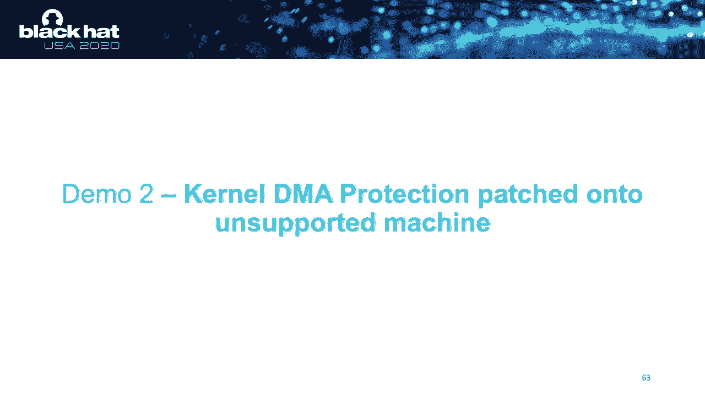

# 【转载】Black Hat USA 2020 会议视频 - P26：26 - When Lightning Strikes Thrice - Breaking Thunderbolt 3 Security - 坤坤武特 - BV1g5411K7fe

 Hello everyone。 It's really great to be here。 This is my first time in Black Hat， so it's。

 an incredible honor that I can share with you。 My name is Spirit Attenberg。 I'm a former。

 community researcher in my spare time， mainly interested in hardware firmware security， sandboxing。

 and input validation。 And you can find some of my work on my website。 I'm a master student in。

 computer science and i-teau University of Technology and the work that I'll be presenting。

 today is part of my master's thesis。 So in this talk I'll be occasionally referring to。

 PCI express terminology， but entering the interest of time in case you're not familiar with it。

 just think of PCI express as a package waste network that connects your CPU to your peripherals。

 Now Thunderbolt is an external PCI-E base into the interconnect and it was developed by。

 Intel and Apple in 2011。 Now being PCI-E based it enables start memory access IO to the peripherals。

 and so it's the first external interconnect that allows use-gators such as connecting。

 an external GPU to a laptop， connecting 5k monitors， accessing high speed external storage。

 at its maximum performance。 And well the first two versions they were mostly exclusive to。

 Max and use the Mini-Displate form factor。 Thunderbolt 3 is the first version to be widely。

 adopted among both PCs and Max and the use-guse-bc form factor instead thereby allowing not only。

 Thunderbolt devices but also display port and use-bc。 Now DMA is a very powerful concept。

 It enables high bandwidth low latency use cases by putting the burden on the peripheral for。

 copying the rest of the data directly into system RAM but at the same time this could also pose。

 a security risk and this was actually the case with Thunderbolt 1。

 For Thunderbolt 1 all the attacker， had to do was basically connect a peripheral and then get unrestricted reading-wide memory access。

 Now as a result your attacker could get access data from encrypted drives and to gain persistent。

 access they could install a rootkit。 The M8X are generally well understood。 First started with。

 FireWire back in 2004 and over the years gradually moved to PCI Express including all its form factors。

 such as M2， Express Card and eventually Thunderbolt。 So the front model that we'll be talking about。

 tonight is Pre-Fiscal Access to a Victim System also known as an even mate attack and some of the。

 real-world scenarios that you can think of are for example leaving a laptop unattended in a hotel。

 room while you're out for dinner or desktop systems sitting in an office and at some point a cleaning。

 crew comes in and has brief unfettered access。 Now in case you're wondering what such an evil。

 clean crew might look like I include a picture right here in the in the slide。

 So this Pre-Fiscal Access the industry has implemented several protection measures over。

 the years to protect against the so-called opportunistic physical access so let's briefly。

 go through them。 First one is really simple you put a password on your BIOS and well that should。

 prevent the attacker from making all of their eyes modifications when you get physical access。

 Then their secure boot， secure boot focuses on cryptography， verifying all components in the。

 entire boot chain starting from the always boot loader to the kernel and finally device drivers。

 There's Boot Card which focuses on cryptographically verifying the BIOS itself and there's full。

 description which enables you to encrypt all your data so that when a attacker gets physical access。

 to your laptop they can disassemble the SSD but still cannot access the data without knowing the。

 correct password。 Now to counter the EDA attacks that we've seen in the previous slide。

 Intel introduced what they call Thunderbolt security levels and the security levels are intended to。

 protect the entire thing that you see right here。 So let's dive a little bit deeper in the。

 Thunderbolt security architecture。 Security levels it's really an access control system so if you。

 connect a device to the laptop then as a user you will see this pop up right here。 It will let you。

 identify the device and then make a decision whether or not you would like to enable PCI-8。

 on the link。 Now Thunderbolt security levels rely on Thunderbolt devices authenticating to the host。

 and these devices do this using the parameters shown right here。 The most important one being the。

 universal unique ID or UUID。 Now this number is intended to uniquely identify any single Thunderbolt。

 device and also it's defined to be fused in silicon so it shouldn't be easy to change。

 So Thunderbolt security levels is a multi-step system。 As a user you can select any of these in。

 the BIOS so let's quickly go through them。 Well SL0 basically is no security so essentially the。

 same situation like with Thunderbolt 1。 There's as a one user where the vice-authorization is based。

 on the device UUID and this is actually the default settings on all Thunderbolt equipped PCs。

 Then there's SL2。 It's the same as a one but it adds John's response mechanism。 SL3。

 disables all Thunderbolt connectivity but allows USB display port devices。 SL4 is intended for use。

 with Thunderbolt docs so when you connect to doc you cannot desecing any additional Thunderbolt。

 bolt devices through that doc。 And finally if you're using SL1 or SL2 you will get pre-boot。

 protection for free so that means that any authorizes any devices that you've briefly。

 authorized will also be usable during boot time while the rest will be blocked from accessing your。

 system。 Now security levels the security level scheme is mostly known for protecting against。

 the device to host the EMA attacks but since it prevents malicious devices from accessing the。

 PCIe bus it actually prevents against other inherent attack factors such as well。

 peer-to-peer DMA attacks PCIe despoofing to charge vulnerable device drivers and。

 TLP source ID spoofing。 So concept wise security levels is really a powerful and。

 much-needed protection scheme。 Right so introducing ThunderSpy so previous research you can roughly。

 divide into two categories。 The first one before security levels they primarily focus on PCIe。

 level DMA attacks after the introduction of security levels they mostly focus on。

 tricking the user into accepting malicious devices。 Now ThunderSpy is a new class of。

 vulnerabilities that breaks Thunderbolt protocol security and it's really the first attack on。

 Thunderbolt security levels so what we're presenting today is seven vulnerabilities。

 and nine scenarios to actually practically exploit them。

 Right so the first step in our research was to find out how Thunderbolt boards。 Now Thunderbolt。

 is a proprietary standard so if you try to look up protocol specifications you will not find them。

 and if you try to look up diagrams that will tell you how the。

 sorry what the hardware architecture is like you will not find it either so the first thing that。

 we did was dissecting very sonable devices and funnable equip systems。

 Now eventually we came up with this diagram that I'm showing here for future research。

 so starting with the Thunderbolt host controller the Thunderbolt host controller on the PCN。

 connects to the PCH and the DE GPU and IGPU take care of generating a display port signal。

 now on the other hand there's the USB-PD controller which is a third-party chip。

 and this controller multiplies between Thunderbolt and the USB from the PCH as appropriate。

 Now the V5 side is actually kind of a mirror version of what we see on the PC。

 so the signal comes in and the Sonable device controller then the multiplexer sit-to each。

 IE on the one end and if the device has two ports um turnable again on the other end so as you can。

 connect another Thunderbolt device or a USB or just a port device。

 Right so let's have a look at some Sonable devices。

 we have had to look at various Sonable devices starting with very simple， Isada tools。

 Thunderbolt dongles to store solutions to eGPUs and they were pretty much all the same。

 but this NetStore Thunderbolt MPME enclosure really had a nice design you could immediately。

 identify all the chips so that's why I'm taking it here as an example。

 Our prime set suspect is in the top left corner the Intel Thunderbolt controller。

 and we see a USB PD controller text instrument TPS one for each Thunderbolt port。

 there's a spy flash which we'll be talking about a lot about later and i2c。

 which apparently has been routed by the NetStore people to easily accessible paths。

 so that was really nice and there is a interface with a piercevj tag。

 but what to answer your question？ No it doesn't work sorry。

 so the Intel Thunderbolt controller is well in this case it's really a special model because it's。

 support both running in host and endpoint mode and well it's from the Apple Prime race generation。

 so it supports this with port 1。2， HDMI 2。0， USB pass through and USB power delivery。

 now in terms of analyzing the hardware architecture。

 this particular chip is not very attractive to have a look at at least not initially because。

 it's a BGA package and there's no public data sheets so yeah we actually moved on to the other chips first。

 the TPS is actually quite the opposite there's just a public data sheet that you can have a look at。

 and you can actually talk to this thing over i2c so for example to get firmware identifiers。

 a current operational state and i think there are even some registers in there that allow you to。

 change the current output voltage but i haven't really looked much into that。

 now the spy flash is of course very interesting and what we're talking about is a lot more。

 in the rest of this presentation of course we dumped this content and what we found was the。

 Thunderbolt 3 controller firmware and what you will immediately notice when you dump this firmware。

 is a section called DROM or the Vise-ROM now this device ROM contains all the parameters that we've。

 seen before which are important for Thunderbolt device authentication but the question is of course。

 is the UUID all the part of this now the answer is yes but only two out of eight bytes。

 still we would like to know whether there's a signature and whether we can change any of this。

 without breaking the signature now to answer the first question yes there's a signature。

 there's a public key and signed i just um changing the public key doesn't really work so probably。

 the fingerprint is embedded somewhere in silicon but still well it would be interesting to find out。

 what we can change without breaking the signature so what's covered by the signature。

 well not the DROM because when we do in-system programming we can basically construct entire。

 arbitrary identities for the device and well then you can create some nice identities like shown here。

 in this screenshot and this was quite puzzling at first because when you apply vendor updates for。

 example updates that you download from a website then the DROM is actually part of the signature。

 signature check or by any way you do in-system programming it is apparently not。

 now the second vulnerability is also quite interesting because for example the vendor ID。

 you would expect to be tied to a certain vendor name and the same applies to the device ID。

 and and the device name well apparently that is not the case because you can make up。

 completely arbitrary values for both entries， so um well add a number look at the uh intel white paper on Thunderbolt security and there was。

 this interesting section on the unique ID number and it said every Thunderbolt 3 controller has a unique。

 ID fused in silicon during production now we already know this is not true because we're。

 gonna change two out of eight bytes but there was this interesting emphasis on Thunderbolt 3。

 so I had a look at Thunderbolt 2 devices and uh what to answer your question。

 yes this is the uh the UUID in plaintext and no it's not covered by any signatures。

 so essentially what you can do is spoof both Thunderbolt 2 and Thunderbolt 3 devices。

 and uh well once you spoof Thunderbolt 5 that has been previously authorized by the user。

 then the system will accept or malicious defies and then you get full dma access。

 so this is how we got to Thunderbolt uh Sonner-Spy vulnerability 3 and 4 and we've documented how to。

 exploit these uh in these exploitation scenarios， so let's have a look at the device controller firmware we see a jump address on top which differs。

 depending on the mode that the controller is running in there's a secure key dictionary which。

 maps an 8 by host to UUID to a 32 by key um the d-run section uh p h y configuration。

 the public key the side digest and there's a section which comprises the TPS。

 power delivery firmware so that's really interesting because that means that。

 the thermal controller and the TPS share the same spy flash。

 now finally there are some scratch pads section， and this section is used to temporary store firmware updates that you apply from the host。

 so let's have a look at some Thunderbolt quick systems。

 we've had a look at all major fenders across seven generations of systems。

 um and we had a look at five generation show Thunderbolt controllers starting from Thunderbolt。

 2 with Falcon Ridge all the way to the latest isolate Thunderbolt 3 controller。

 they were all pretty much the same but the Lenovo think that we won had a nice cleanly out。

 so that's why i'm showing it here um most of the components will be familiar to you。

 but there's of course the most important part in the top right where we see the。

 Thunderbolt controller um slightly different TPS version and then we saw in the devices。

 and of course the spy flash hosting the controller firmware。

 now for the host controller key questions are um as a user you can select a security level from the。

 bias so um that kind of seems to suggest that the bias stores the security level state。

 and for security level one and two um while these require storing device UADs so that raises。

 the question where is the device ACL stored so let's have a look。

 um well the host controller firmware is pretty much the same as the device firmware。

 but there are a couple of important differences for example the first one is that the device。

 uh that there's a device ACL um listing all of the UADs that are allowed and there is no secure key。

 dictionary which is pretty interesting because in security level two um these keys are stored on。

 the ostisk and it means that or seems to suggest that with pre-boot and authentication。

 devices are still authorized based on the UAD only。

 now what was more interesting is another part we found。

 the host security level configuration and yes it's there in plain text and no it's not。

 covered by any signatures so all the attacker would have to do is um patch the host controller。

 firmware to for example disable thunderbolt security or restore thunderbolt connectivity when。

 it was disabled by the user。 Spy flags are really interesting devices um and they usually have。

 multiple methods to support right protection。 Now this wind bond we encountered in many thunderbolt。

 devices and this particular one supports actually four um red protection methods。

 including what is called one-time program。 Now one-time program allows it to。

 turn the spy flash into a read-only memory and this is really interesting because。

 it's a special order but we found that these uh samples that we have still appear to ship this。

 kind of support。 So that's how we got to vulnerability six because well as an attacker what you could do。

 is exploit vulnerability five to override the thunderbolt security to no security at all。

 and then you can simply turn the spy flash into a read-only memory thereby preventing the user。

 from ever-changing uh well effort turning on thunderbolt security again。

 So to summarize the thunderspy attack methods can be divided into categories so the first attack。

 method requires only brief access to the laptop only five minutes to reprogram the host controller。

 firmware。 It does not require any access to victim devices attack method two is kind of the。

 inverse so it does not require pre-reprogramming of controller firmware but it only requires five。

 minutes of physical access to one of the victims thunderbolt devices。 So the impact for both is。

 really much the same so you get unrestricted read-in-write memory access you can access data from encrypted。

 drives and to enable persistent access you can exploit vulnerability six or you can install root。

 kids to remove the dependency on thunderspy altogether。 All right so here's a demo where we show。

 attack modes of warning practice。 So what we have here is a Lenovo P1 which was purchased last year。

 and as you can see it's in sleep mode。 Yes it's been locked so um I don't know the password。

 and the password isn't empty either as you can see so that's all good。

 What we're gonna do now is turn over the laptop so that we can reach the backplate。

 and we unscrew the backplate。 Right there we go。 So now I'm going to attach my spy programmer which is a device called bus。

 pirate and it allows me to interface with the spy flash that is storing the thunderbolt controller。

 firmware。 So attaching the bus pirate to my attacker laptop and now we're going to use a tool called。

 flash wrong to get the firmware from the spy flash。

 Right so now I have a dump and I'm going to feed， that dump to a tool that I wrote which is called thunderbolt controller firmware patcher。

 and so as you can see apparently the thunderbolt controller was set to security level one which is。

 the default security level on all thunderbolt laptops and I'm patching it now to an insecure state。

 and so as you can see it says SL0 which means all thunderbolt security is disabled。

 Now we're going to write back the firmware to the spy flash。

 Now this might take a bit because flash wrong will be trying various methods to program the spy flash。

 and as you can see eventually it will succeed。 Okay so now we've written our custom firmware to the spy flash and we're detaching the spy programmer。

 and putting back the backplate onto the laptop。 Turning over the laptop and opening it up。

 Now as you can see it's still up and running。 You still kind of get into the laptop。

 And here I'm attaching my thunderbolt based attack device。

 Now what you see here is a device that will be attacking the laptop and we're going to use。

 the device with a DMA attack tool called PCI-LH developed by O-FRISC。

 And here I'm loading a kernel module into the memory of the laptop which allows me to bypass。

 Windows lock screen。 We're entering no password and there we go。 You can get into the laptop。

 Alright so let's recap the son of all security levels。 On the left we see the public definition。

 Now let's talk about what we actually found it to mean。 So as a one the file self-versation based。

 on the UUID。 Well the UUID it's not really so unique because you can spoof them and no the UUID。

 is not actually fused in silicon。 Now SL2 adds challenge response。 Sure that could work but。

 well you can simply copy the keys from the device by flash。 There's SL3 disabling all。

 thunderbolt connectivity。 Granted that would work against cloning thunderbolt devices but when。

 the attacker gets a hold of the laptop all they would have to do is reprogram the host control。

 and firmware to disable thunderbolt security entirely。

 SL4 was a bit bustling to us because really all， you would have to do is well simply unplug an existing device or just pick another thunderbolt port。

 and pre-boot protection while all security levels are broken so yeah the disprotection really has no。

 effect。 So like you've seen in the demo I used a tool that I wrote a Thunderbolt control or firmware。

 picture。 You can actually have a look yourself it's up on my get up repo and there's Spyblock which。

 allows you to toggle on flash right protection and you can also get it from get up。

 So let's talk about affected systems。 All thunderbolt equipped systems ship between 2011 and today。

 are vulnerable。 This definitely applies to all PCs released between 2011 and 2018。 They are fully。

 vulnerable。 All max running arenas and Linux are as well。 Now some systems that provide kernel。

 to UMA protection。 They are partially vulnerable and we'll be talking about them in a bit。

 My course is partially vulnerable so really you should。

 verify whether your system is vulnerable using iSpyCheck or by following the。

 mineral fear of verification steps on our website。

 Right so Intel's response to ThunderSpy was kernel DMA protection。 So this was quite。

 underwhelming and we're showing a bit why that is。 So kernel DMA protection is opt-in DMA remapping。

 measure for vulnerable devices and according to Intel all you need is a Windows 10， 8。

 or 3 or later or an up-to-date Linux kernel。 So let's have a look how that works。

 Well normally when， it defies does TMA to the host it does that directly to the IO addressable region and when。

 kernel DMA protection is enabled there's an IOUM in between so defices malicious。

 anthiloginumid alike cannot read or write a sign outside the boundaries which have been set by this。

 IOMEMU。 So all in all that sounds pretty good but there are a couple of caveats。

 kernel DMA protection is a partial mitigation only。 Specifically it does not mitigate。

 ThunderSpy vulnerabilities one， two， three。 So this really exposes the system to a bad USB。

 style of attacks。 Now most importantly it not only requires an IOMEMU but also bias support。

 and we found that this bias support is only exclusively available on systems not all systems。

 but some systems that ships in 2019。 So basically with Intel saying well you know just buy a new laptop。

 Well basically that means that about eight years worth of systems remain vulnerable to。

 ThunderSpy forever and this really didn't make sense to me because a lot of these systems feature。

 an IOMEMU so technically they are capable of supporting DMA remapping。 So what we're releasing。

 today is ThunderSpy 2 which is not an attack but a proof of concept protection that brings。

 kernel DMA protection to roughly six years worth of systems so it includes all systems that have。

 an IOMEMU including if they provide Thunderbolt 2。 And the first implementation that will be。

 releasing is an experimental UE5 extension just drop it in on your EFI system partition and it will。

 work with Windows 10 and recently in its kernels。 Now the protection level that it provides is similar。

 to officially supported systems。 It does not protect against boot time attacks but screen locking。

 and sleep mode are again covered。 If you're using Linux well we're working with the Linux kernel。

 hardware security team to bring kernel level mitigations to ThunderSpy and meanwhile Linux users can use。

 the ThunderSpy 2 UE5 extension。 When you're using secure boot you can sign if you're using your own keys。

 and you can combine it with measured boot for example heads for additional security。

 Right so we're now going to show a demo of ThunderSpy 2 applied onto a unsupport machine。

 This is a Dell XPS 15 purchased in 2018。 Now there have been no vendor updates that enable。

 kernel DMA protection onto this model so we've applied ThunderSpy 2。 Now when we have a look。

 in MS Intel 32 it needs as kernel DMA protection has been enabled so we lock the screen and now。

 we're going to attach our Thunderbolt integrity device and then we'll attempt to perform our DMA。

 attack against the laptop。 Now Windows has detected what it calls a driver DMA violation which。

 means it caught us reading outside the memory range assigned by the RIO MMU。 So kernel DMA。

 protection is working as intended。 So what's next for the future of Thunderbolt-based interconnects？

 Well a number of issues remain unaddressed starting with Thunderbolt vulnerabilities 1， 2， 3。

 There's really no means to distinguish between legitimate and force D ROMs so。

 the fighters could look physically okay to the user but they could still be tampered with。

 And well kernel DMA protection is implemented as a replacement to security levels by Intel and。

 a side effect of kernel DMA protection is that when you connect the device this device will be。

 immediately given PCIe tunneling without actually interacting with the user。 So yes it does protect。

 against DMA attacks but it does not protect against for example a malicious device spoofing。

 PCIe IDs to attack vulnerable drivers does not protect against TLP source IDs spoofing。

 So yeah these are important issues to have a look at and they probably affect both USB and。

 Thunderbolt 4。 Now for Thunderbolt 4 we know that Intel will now require kernel DMA protection。

 to mitigate thunder's fire so the good news is if you buy a system with Thunderbolt 4 you are。

 guaranteed to have kernel DMA protection but still backward compatibility likely means that。

 both USB 4 and Thunderbolt 4 will still be affected by the issues that we mentioned here。

 Now there are some ways to potentially mitigate these reminding issues while starting with the。

 thunder's fire vulnerabilities essentially everything is in there in the firmware to。

 fix this issue there's a bullet key and a digest so all that Intel would need to do is。

 share the scope of the digest and then the driver or UEFI could verify firmware authenticity。

 before enabling PCIe Xs。 Now regarding kernel DMA protection well in the interest of practical。

 use I would say it's okay to all DMA defiled on boot but during almost runtime I would initially。

 suggest to null route all new DMA defieses so you actually don't assign any IO range just yet。

 and then you require screen unlocking and explicit user authorization and only at that point。

 you can have the IO/MmU assign an IO memory range。

 Now to counter vulnerabilities in drivers you could use virtualization based security I think。

 Microsoft is currently working on that with kernel data protection and I could see Linux kernel。

 doing this in the future as well and finally to counter TLP source ID spoofing I would suggest。

 that the Thunderbolt controller implements a second mechanism such as PCIe ACS so just simply。

 enumerating all downstream devices and then verifying that the TLP source ID matches any of those devices。

 Now finally for use before of course it would be a good idea to implement a UEFI toggle that。

 controls sendable signaling but well I don't know if anywhere from Intel is watching but when you do。

 please maintain the state in the BIOS only。 So to take away that I would like to give you is that。

 well Sonos Pi is a new class of vulnerabilities breaking Thunderbolt security there's no fix from。

 Intel so really check if your system is vulnerable using spy check or verify using the steps listed on。

 our website there's the full vulnerability report as well if in case you're interested。

 Thunder Spy 2 is not an attack but an experimental protection which shows that laptops that have。

 an IOMU but no kernel DMA protection are technically capable of supporting this protection。

 and the first implementation that we're releasing today is a UEFI extension。

 Now whatever we like it or not the future is apparently PCI Express so that really allows some nice use。

 cases but for USB 4 and Thunderbolt 4 well adequate protection schemes remain absent for now so I。

 hope that Wendy's technology is end-top in consumer products the issues that we've mentioned here。

 will be addressed。 Right so that's it for today if you have any questions you can reach me on Twitter。

 or just ask me here in the Q&A。 Thank you for joining。 Hi all thank you for watching。

 Before moving to the Q&A I'd like to make an announcement a little， update to Thunder Spy 2。

 As part of Thunder Spy 2 we're pretending to options today that aim to。

 bring kernel DMA protection to Thunderbolt equipped systems that do not ship kernel DMA protection but。

 do satisfy all archery and fermary requirements。 So this should well basically bring kernel DMA。

 protection to roughly six years worth of systems。 If you're interested in helping out in testing。

 our external to patch it's available on our website right now Thunder Spy。io and well we would。

 very much appreciate your feedback。 So moving on to the questions。

 so I'm reading the question if the system doesn't have an IOMM you is there any mitigation short of。

 entirely zooming disabling Thunderbolt？ Well no I would say no。 Basically there are fundamental。

 issues with Thunderbolt device authentication and well that basically defeats the only protection。

 scheme that Intel provides on all systems released before 2019 so the security levels that we discussed。

 in the presentation and Thunder Spy breaks the security levels with the root cause being。

 Thunderbolt device authentication not working。 So unfortunately no if the system doesn't have an。

 IOMM you there is nothing we can do except maybe waiting for Intel to change their minds and。

 well maybe bringing a software workaround for this。

 Okay I'm hearing that we're going to need to wrap it up so if you have any more questions please。

 ask them in the chat or just well you can reach me on Twitter as well thank you。

