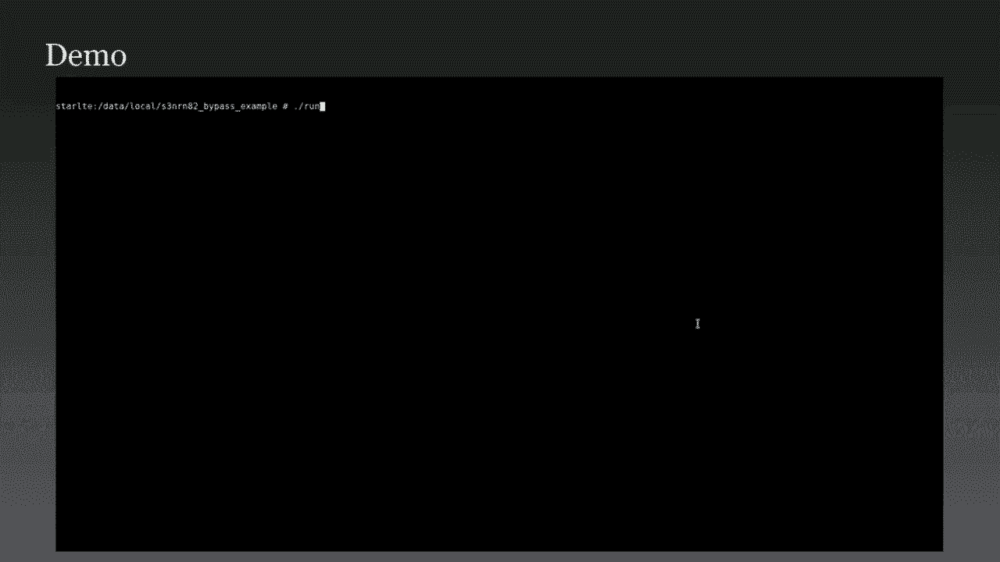

# 【转载】Black Hat USA 2020 会议视频 - P27：27 - Beyond Root - Custom Firmware for Embedded Mobile Chipsets - 坤坤武特 - BV1g5411K7fe

 Hello everyone， my name is Christopher Wade and we're going to talk about embedded mobile。

 chipsets today and how you can write custom firmware for them。

 I am a security consultant at Pentes Partners where I mainly work with automotive hardware。

 and maritime equipment but today we're going to be talking about embedded chipsets in their。

 entirety especially on mobile devices。 The origin of this project was that I had routed several phones and found that while I could。

 modify certain aspects of the operating system I couldn't modify the hardware capabilities。

 of them in any meaningful manner。 While it was still possible in certain ways it was not possible in their entirety so I。

 couldn't modify certain closed source and closed hardware elements of the devices such。

 as hardware peripherals such as Bluetooth。 While it is possible via certain kernel modifications or changes to configurations to get monitor。

 mode it does require a custom firmware for things like the Worldcom chipsets。

 The USB device emulation as well is quite an interesting feature that can be added to。

 Android phones with a certain amount of effort。 If you modify your kernel so that it implements all the USB functionality modules that you。

 want instead of just the static one for Android you can implement things like gadget F-S。

 which allows you to emulate any kind of USB device you want via user space applications。

 But I want to talk about NFC more than anything which is something I'm very interested in。

 and is quite limited on Android hardware as it is。

 For instance on Android even with root access you're limited to generic reading， mobile payments。

 and deaf communication and host card communication the last of which is communication that allows。

 you to emulate certain amounts of NFC tags but not in their entirety。

 While this allows you to do certain things like relay attacks which may be useful for。

 an attacker who wants to commit fraud etc it's not very useful for other use cases。

 If you were to make an NFC attack tool you would want to implement slightly more complex。

 functionality such as emulation of a reader to attack cryptography on an NFC tag or emulate。

 the tag itself in order to perform attacks that are only possible from that endpoint or。

 you may want to be able to passively sniff tags like you would with a Prox marker a chameleon。

 device。 My first target was my Samsung S6 which is quite an old phone but one I had readily available。

 and unlocked using the standard Samsung OEM unlocking and custom ROM functionality。

 I found that in my Samsung device which was a non-US phone it had a Samsung semiconductor。

 NFC chip that was completely custom and developed by Samsung for their devices。

 This was called the S3FW R and 5 which was a custom chip developed by Samsung semiconductor。

 It has the ability to update firmware security and is found in Samsung S6's and Samsung Note。

 4 devices which were manufactured in 2014 and 2015。

 It was found to use an ARM SC000 secure architecture which is a embedded ARM architecture used for。

 secure applications and is communicated with on the phone via custom device drivers which。

 communicate with the I2C and GPIO interfaces of the device。

 Inside communication which is how NFC chips are communicated with via host devices is quite。

 a simple protocol。 Essentially you have a group ID， operation ID。

 link and payload which are used in conjunction， to configure certain settings or to read certain data from the device in order to configure。

 a specific NFC functionality。 While this does make NFC quite simple it also restricts it quite heavily。

 There's also non-standard functionality built into this protocol however such as vendor。

 group IDs which are group IDs which allow a vendor to implement any functionality they。

 need whatsoever。 They may use this for configuration of certain hardware that's not standard or they may use。

 it to add certain debug functionality that they'd want later on in the project。

 But what this is never used for is firmware updates which is a key aspect of any embedded， chip set。

 The device itself was found to set whether it was in bootloader for firmware updates or。

 regular mode via a GPIO input which could be set via the driver and I found that when。

 you switched it into bootloader mode it had a slightly different protocol than NCI but。

 only slightly different。 What this was used for was to differentiate itself from NCI in order to allow the vendor。

 partition and the vendor implementations of certain aspects of the firmware to update。

 this chip set and use it to do different things。 This firmware update protocol was quite simple。

 I pulled these traces from Logcat just by running Logcat while doing a firmware update。

 and found that it was made up of a command type which is usually 0， 1 or 2。

 A command which was based on what aspect of the firmware update was being performed and。

 the payload size which was 2 bytes but was limited to only 256 bytes in total as well。

 as apparently better the top of each command type in order to set where they were in the。

 firmware update process。 The firmware update that was used had a very basic format there to metadata highlighted。

 in red which was the date that the firmware was made。

 A signature which is highlighted in green which was just a simple RSA signature and highlighted。

 in blue was the start of the firmware which I found to be standard on update the firmware。

 There's a way to identify this quite quickly just by using a simple mnemonic。

 If you run strings on a firmware update that's unencrypted and search for the characters。

 lowercase p and upcase g you will quickly find that a lot of these get dumped out if it is。

 using thumb code which is the shortened architecture used by ARM。

 Because lowercase p and upcase g translates to 1747 aske which is the bxlr or branch and。

 link operation used by ARM devices in order to return from functions you can quickly identify。

 lots of areas where this has been used。 When this is found in large quantities it usually means that it's using ARM firmware。

 A good way to implement firmware updates is just by replaying all the commands that you've。

 dumped in the sequence。 You don't necessarily need to know how the protocol works as long as you can send commands。

 in exactly the same order they sent before。 These things are usually immutable just due to how the signature checking and hash checking。

 are implemented。 What I did was use that logcat and made a huge number of by-trays and cycled through。

 them while making sure that in IO controls used pulled from the open source kernel drivers。

 for this chip were used。 Looking at this further and looking at this open source driver I found that it had commands。

 well defined in there for me to look at。 Command zero was defined as reset。

 command one was boot info， command two was beginning， of the updates。

 command four was to update specific sectors which included a address and。

 the data itself and five which verified the signature and hash together to completely， update。

 Because there was no command three it made me think that there were some hidden commands。

 that weren't used by the firmware update but may have some extra functionality。

 I could easily identify hidden bootloader commands just by seeing what errors were returned。

 by the chip when I sent certain commands。 If it returned to it meant that the commands were not valid at that stage or the firmware。

 update process and what I did was process through each step of the firmware update process。

 while using these different supposed command states。 However。

 if the chip returned to nine I was able to see that the payload was just too。

 small and if I increase the size eventually I'd get a different error which would let me。

 know the minimum size of the commands being sent。 Root forcing through this allowed me to find that command three was just a different version。

 of command four however instead of sending the 4096 blocks used by command four it sent。

 512 instead。 However command six was also noted and was much more interesting。

 Command six was found to take eight bytes of parameters which was 232 bit values。

 By setting random bits inside these parameters I found that it would dump how arbitrary memory。

 from the chip and allowed me to work out that this was taking an address and a size for。

 data being returned。 Using this like a damp RAM firmware hidden hardware registers and the secure bootloader。

 meaning I could reverse engineer this。 I stitched this bootloader get together and found that it used a standard Cortex M firmware。

 format so this would be the start of the first bytes would be the start of the stack。

 and the next bytes would be the reset vector used to start up the chip。

 Looking at these together I could easily disassemble this in any disassembler I had。

 However because this is an embedded firmware I had very few strings and I'd have to look。

 at everything by hand statically。 There are a few interesting artifacts in here so all the firmware that was deployed was found。

 to be stored starting at address 3000 and in the firmware itself I found that the first。

 four bytes of the firmware were always FFFFFFFF。 However I found that the firmware update would overwrite this with 5IF00FA5 which was found。

 to be a magic number used to verify whether the firmware update was indeed valid and the。

 signature signature in check during updates。 I tried to stick this particular value in straight away in a completely invalid firmware。

 and found that this didn't work and that the bootloader checked whether the first value。

 was always FFFFF。 I also found the state machine which checked which commands were being received so we have。

 012 and 6 which were the commands that were available at the start of the firmware update。

 process and I could look for me to see that there were no other commands that were in use。

 during this process。 I also noted the RSA public key in memory which was interesting but not useful because。

 it was quite high entropy。 This can be identified by looking for 0001。

 0001 which translates to 65537， the exponent， of RSA public key and before this is usually 128 or a different size of high entropy bytes。

 which usually denote the modulus of the RSA public key。

 Now because I now have the bootloader what I really wanted to do was find a memory corruption。

 exploit in this bootloader allowing me to have an immutable， unchangeable way of adding custom。

 firmware to this chip whenever I wanted to。 Now fuzzing my phone seemed like a bad idea at the time mainly juiced the fact that if。

 I broke the chip I'd have to buy a new phone to look at it or find a way to unbreak it which。

 would involve some hard work modification which I didn't want to do。

 Also juiced the fact that the only endpoint I had into the device was I2C debugging analysis。

 would be very difficult。 Juiced this I decided to emulate the bootloader as much as I could。

 I decided to use the unicorn engine for this which is a library which is very powerful。

 It allows one to implement different firmware types using different architectures in order。

 to assess how it works and also run functionality that wouldn't necessarily be possible on the。

 architecture you're using。 It's sort of like a form of QMU except inside applications rather than something to run。

 applications themselves。 I loaded my bootloader into address zero as it would be in the actual device。

 I set the program counter to the reset vector which is found in the bootloader and I met。

 memory for hardware registers， RAM and flash ready to start fuzzing this protocol。 However。

 a key aspect of this was the fact that even though I didn't point I used unicorn。

 engine I wouldn't be able to emulate the hardware as easily because it just simply didn't exist。

 and it was completely new and no one had ever seen it before especially in this format。

 What I did is let the firmware run until it started reading from the hardware addresses。

 which started at 0x4000。 I found that it started reading a specific address during startup and was checking for。

 specific bits in the firmware in this register in order to identify certain aspects of the， status。

 I'd worked out that this was the status register for I2C so I made this always return randomized。

 data meaning that the status of the I2C bus would be deemed to be doing something at the。

 time and would move past this state。 I found the firmware continually reading bytes from another address which was close to the。

 original and found that this was likely to be the I2C 5-0 buffer which was loading any。

 bytes input from this into a buffer。 I started sending firmware bake commands via this register by looking into unicorn engine。

 and found that it would then start sending data on another address that was close in。

 that area and found that this was sending responses to my I2C messages as the bootloader。

 would have。 Because of this I had full emulation of the I2C communication of the bootloader and could。

 start fuzzing it as needed without having the potential of breaking my chip。

 I started randomly fuzzing the chip but found that it wasn't really viable and didn't do， very much。

 While commands have 16-bit sizes and largely the entire contents of RAM they were limited。

 to only 256 bytes and I couldn't do much with that。

 I did find that some commands would send additional data in chunks。

 For instance when you were sending 4096 bytes of update data these were chunked into 256。

 bytes that were permitted by the protocol。 However。

 I also found that the size of the hash and signature which was sent subsequent。

 to these hash and signature command were defined in this command and were modifiable。

 By increasing the size of the hash and signature sizes I could allow myself to send more and。

 more data subsequently。 For instance if I said the hash was 200 bytes instead of the classic amount I would be able。

 to send that much data。 What I found was in my emulated chipset this overrope the stack and hit an invalid aspect。

 of memory so over the 8K of memory that was available。

 Because I could overwrite the stack I could change where the return pointers were in the。

 stack and change where the program counter would jump to after returning from these commands。

 The fact that the secure core SC00 chipsets can't execute from RAM I wouldn't be able。

 to do anything simple like just write a bit of shell code。

 Also because the stack was so small only being about 12 bytes at this point it was too small。

 to do any complex ROP exploits。 In order to get past this what I did was just make it jump the program counter into the。

 signature checks at the start of the bootloader， past the checks actually occurred and into。

 the part where it loaded the address of the firmware and jumped into it which restarted。

 the chip into the core firmware。 I then performed this exploit on the physical chip and found that it worked beautifully。

 So I booted my bootloader， sent my exploit and then noticed that after I'd run it it。

 would start behaving as the real firmware and I could send NCI commands instead of firmware。

 update commands to the chip。 What I did was simply change the version number of the firmware just to show that this signature。

 checking had been bypassed and that could run my own custom firmware and then disclose。

 this to Samsung。 Now there are two ways I could have fixed this now because it was a bootloader level exploit。

 it's a bit more complicated than just updating the firmware。

 They would have to patch the bootloader from the main firmware removing this buffer overflow。

 vulnerability however while this was being undergone if someone power cycle the chip or。

 there was some kind of error the bootloader would be left erased and they would never。

 be able to restart it again leaving the NFC functionality of the chip completely non-functional。

 because the chip wouldn't be able to start。 Or they could have patched the kernel to dish allow large hashes and signatures however。

 this was trivially bypassed just by kernel modification if they did that。

 I decided to look at other NFC chips that Samsung had used for developer and found that。

 they were four that were in modern use， the S3N or N74， S3N or N81， S3N or N82 and SCN82AB。

 I wanted to find these chipsets in different Samsung phones to see which one I should purchase。

 in order to continue this research。 Now because teardowns aren't always available especially for non-US devices it wouldn't be。

 a simple task of just Google searching for these version numbers and phone types。

 So what I ended up doing was going to SanMobile。com which contains ROMs for almost every Samsung。

 device， downloading them， extracting them and finding whether they had the firmware files。

 embedded in them。 These we usually found in the slash vendor directory and occasionally this is a separate。

 partition but generally it's easy to find。 Looking through this I managed to find the S3N or N82 which is used by the Samsung S9。

 as well as the Samsung S8 and that's something S10。

 Her Vai decided to buy a Samsung S9 for this purpose。

 I found that it had multiple chip firmware revisions just by looking at different ROMs。

 which would be very helpful if I needed to reverse and generate more and I found that。

 the Samsung S9 while it was secure from a routing perspective you could use OEM unlocking。

 and a custom ROM and also route it appropriately to perform any attacks on it。

 The firmware file was found to be almost exactly the same as the S3N， the W-R and 5 at least。

 in formatting so it had the same metadata signature and firmware payload。

 However the reset of vector of the firmware which was found at the top of it was much。

 smaller and planned that the bootloader had been modified to be smaller and the firmware。

 size was 32 kilobytes larger which was corroborated with what was on the data sheets on Samsung。

 and the website。 I found that Command 3 and 6 these being the small deployment of code command and the。

 firmware readout command no longer available。 However。

 Command 7 was identified but all it did was reboot the chip。

 A new bootloader size implied that the firmware had been modified in some way meaning that。

 I'd probably have to do something a bit different in order to exploit this and use the lack of。

 memory readout verifying what I'd done before would not be as easy and I'd have to do any。

 exploitation blind anyway。 Also I found that trying to upload firmware using the SHA-1 hash was not possible anymore。

 Because the ITQC communication was no longer provided by LogCap I had to go looking around。

 to see how this was logged and found a device file called /prog/nfclog which contained sizes。

 of all commands being written to the chip in sequence。

 I found that at the start of firmware updates a larger hash size of written so instead of。

 the SHA-1 hash size it was now sending 32 bytes plus the header of a command which was 4 bytes。

 This implied that instead of using SHA-1 hashes for firmware updates they were now using SHA-256。

 hashes which were compared against the signature。 I verified this by modifying my firmware update tool。

 Because I no longer had any knowledge of how Vienna workings of the bootloader worked on。

 this new bootloader I would have to guess quite a lot of how the exploitation worked。

 Due to the nature of device crashes I could work this out however。

 I decided to attempt the exact same exploit I did before by increasing the size of the。

 hashes until I overwrote the stack。 What I did was keep adding more and more size to the size of the hash or sending more and。

 more data。 Now due to the nature of how the stack worked in this it would still return data even if。

 I had overwritten the stack but then crashed。 However if I had overwritten memory that being over the 12k that was now available the device。

 wouldn't return a percent data to it。 Meaning that I would be able to work out the entire size of the memory I was accessing and。

 overwrite it with any data I wanted or any return point that I wanted。

 Here's a quick demo of how this worked。 Because I didn't know where the program counter needed to jump to in the bootloader anymore。

 by virtue of the fact that I couldn't see the bootloader what I ended up doing was processing。

 from address one or other program counter address zero plus one which is how thumb code。

 addresses code in this manner and let it run until it found an endpoint which address which。

 would allow it to jump into the raw firmware。

 Hitting the end of this now so what this is doing is filling the entire stack with return。

 pointers because I also didn't know where the return pointers would be。

 And what I found is when it got to address 165 that was the correct position for it to。

 jump into the unsigned firmware and would allow me to bypass the signature checking。

 I disclosed this vulnerability to something as well and they have now patched it on all。

 new manufacturer chipsets from April 2020 and all future chipsets will be patched so that。

 this doesn't occur。 However， all the chipsets will still be attackable using this approach and will still allow。

 custom firmware to be developed。 So because I could write custom firmware for any of these chips I decided to aim for the。

 SVM or NH2 as this was the newest， fastest and how the most memory。

 Because I don't even be able to debug things or I/OCC it would be quite complex to debug。

 but at least I had something to work with。 I downloaded a firmware file I found inside a Samsung SH ROM。

 This being the oldest thing which used this chipset。

 I found that it had quite a lot of spare memory compared to the firmware that was used on。

 the Samsung S9 and I could use this to write patch in machine code that I'd compiled as， needed。

 In order to do this， all I need to do is compile C functions using GCC-C。

 All this does is create an object file without any linking or relocation that gives you raw。

 assembly to work with or other raw machine code。 Stack handling is still handled appropriately with pushes and pops as any ARM code would。

 However， you would need to implement any C standard libraries yourself so any mem copies。

 and extreme copies and comparisons would need to be done by hand。

 So in-city and ARM function calls are all generated as branch and link instructions。

 So what happens is code gets functions are called by jumping to a relative address compared。

 to the current address where the program counter is and then it usually pushes some registers。

 and then pops them at the end to return back where it was。

 This can be used to patch out existing functions in the firmware or even override them completely。

 as needed in order to change functionality。 Function link uses two complement relative addresses which is simple binary mathematics。

 but can be used to jump relatively from the current position into where you want to be。

 and can be patched over any existing branch and link functions。

 If I wanted to change one specific function to do something else， I could jump to my own。

 functions in that empty area of memory where I'd patch them into。

 I made a small build application for this which literally did all the linking and relocating。

 them for me by dumping out function calls from my binaries and relocating them as needed。

 as well as performing manual arm patching as I needed to。

 First thing I wanted to do is make a ITC function which would allow me to read arbitrary。

 memory and what I did was select a specific vendor specific command that's been 2F24。

 in the firmware which was used by some unknown functionality of the device but was essentially。

 allowed， essentially allowed arbitrary size of parameters and was allowed to be run continuously。

 as needed。 What I could do was modify this to do what I wanted to。

 I searched for mod 0x24 using regex in IDER which literally let me find exactly how this。

 was loaded for setting up response headers and then I overrode the function that was right。

 before the send function in ITC so that it would jump to my get arbitrary memory function。

 which would allow me to jump read memory or modify memory as needed to whenever。

 Because writing a firmware took around 20 seconds this was quite a difficult task and。

 took a while to set up but when it did it could be expanded as needed。

 Because I could now send data back I wanted to take parameters as well。

 I didn't know exactly where the parameters were stored in RAM just by virtue of how complex。

 the firmware was so what I wanted to do was quickly find this out。

 I did this by crafting an NCI request which had 2F24， 04， FAC， FAC。 Now FAC。

 FAC is just a nice little placeholder which I could search through in RAM in order。

 to find the address of these parameters being sent and I used this to find exactly where。

 this was so I can now send and receive commands as needed via ITC with very little code changes。

 The first thing I did was dump the bootloader which was very helpful and I looked at what。

 I was actually hitting with my exploit because I hadn't seen this bootloader before。

 I didn't know what I was hitting to make this work。

 What I found that what the bootloader was doing was loading from R0 into R0 from the address。

 Now because we had jumped it directly from the function call we had no idea what R0 was。

 and so the fact that this worked at all was quite impressive。

 What I did was change this to address 173 which was exactly the same as where we had put。

 it in the original bootloader and allowed us to jump directly into the firmware without。

 any problems。 Now reading out memory is very useful but because it's an NFC chip I wanted to make。

 it do cool NFC things。 Because the chipset supports multiple protocols such as ISO 114438。

 ISO 14443B and a few other， that are all in the 13。

56 megahertz range I wanted to implement one of those myself and。

 decided to emulate a My Fair Classic tag。 I would need to know a lot about that hardware register to make this work but doing so would。

 allow me to work with the chip in ways which allow me to emulate any NFC tag。

 I used to procs mark for debugging throughout as I could see how NFC was working at a very。

 raw level and this was very helpful。 I took all the NCI commands that were sent by the phones to the chip usually and just dumped。

 them into a byte array and replayed them。 I then went through each one and found out any of them which weren't actually required。

 for the chip to run as I needed to so that I could reduce bloat on the commands being。

 sent and then I used what I discovered to be the RF discover command which was the last。

 command sent and took away all the parameters which set up into NFC reader mode or used。

 different protocols and just kept it for protocol 80 which turned out to be the ISO 1443A tag。

 emulation mode。 Because I had no J2 sheets to work with and the hardware registers were quite complicated。

 I'd have to look around in the firmware to see how these were used and as there weren't。

 any strings I would have to infer anything I was working out directly from this hardware。

 First thing I wanted to do was find out how a new ration works on the chip。

 Now a new ration on NFC works largely the same as standard communication in NFC however。

 there are some differences which in speed which meant that the chips that was probably。

 doing this separately are in some hardware level compared to just doing the standard， communication。

 The first thing I did was search for the select command which is the second command sent during。

 the new ration just because I thought this was more likely to work just by reject searching。

 for comparison and 93 being a select command。 This found an immediate result loading from a hardware address 40020200 and comparing on。

 that value meaning that I'd instantly found how this new ration was being selected。

 I placed the phone on a reader and let it constantly run and then started dumping from。

 this hardware address using the ITC function that I'd implemented earlier。

 This cooperated my results from IDER and found that the reader was constantly sending wake。

 up commands which are hex 52。 This allowed me to also work out other things about the hardware registers such as the size。

 and certain other configurations I could dump out later。

 This functionality would allow me to do one way passive sniffing as well as some other。

 things that was very useful for getting the emulation working。

 I do one four four four three communication works in a certain way for enumeration。

 It requires three key aspects。 So what happens is the reader sends a wake up or a request command。

 The tag sends an 80 QA command which gives the initial information about how the tag。

 is configured or what kind of tag it is。 The reader then runs the select command which returns a UID which on phones are forced to。

 be randomized except the first byte which is always zero eight to prove it's not a real， tag。

 Then a SAK command to give information about whether UIDER is slightly larger and needs。

 further enumeration or any other changes。 Wire NCIA could modify this to a certain amount however certain bits were set in any。

 80 QA value and set value I sent which meant that it was restricted to being always being。

 known as a phone。 I found out later that these values are probably stored in individual hardware registers and。

 I'd need to find out how this worked。 I sent specific values to the chip and then search through RAM to see if I could find。

 where they were stored in RAM。 I then compared this to IDER and found where those addresses or these were compared with。

 hardware addresses and I found this function which loaded each SAK and 80 QA and UID value。

 into certain addresses。 This would give me quite a lot of insight in how TAR load works and I could modify it。

 as needed。 I overrode this function and then called it from within the new function I made。

 This would allow me to set up all the hardware I needed to without me needing to do it myself。

 What I then did was overrode what they had implemented into the hardware so what UID value。

 and SAK and 80 QA values they had initialized and put my own ones in。

 I then confirmed this using a Proxmark as a reader to prove that my new UID SAK and 80 QA。

 values had worked。 When I looked on the Proxmark I found that this was successful and allowed me for modification。

 of any enumeration so I made a custom 7 byte UID set it up to pretend to be a MyFare Classic。

 Mini tag and yeah， worked it absolutely beautifully but it would not allow me to do full communication。

 It would not allow me to emulate the MyFare Classic part of the MyFare Classic communication。

 just to pretend to be one on a superficial level。 I knew that the chip would respond to Holt and RATS commands being some more configuration。

 data being returned and Holt commands being a more high level communication aspect of。

 the enumeration set up。 I searched the RATS command using comparison E0 which was the command by using the NFC for。

 that particular functionality and found four results and just looked through them and worked。

 out which one was which and found the specific one which was in use。

 This led me to find the exact state machine that was used by the chip to do further communication。

 and also found some further valid commands。 Further tracing of this found how it was sent to responses so I found how the hardware registers。

 were set up so I found that it was using the same hardware address space as the rest of。

 the NFC setup so 4002， 000000， however I found that the length was set at 0。08 in this address。

 space and that the data itself was set up at 0。100 in this address space which was just。

 underneath X200 where data was received so the sender and receives were quite next to。

 each other but also had quite a lot of space to do what they wanted to。

 I wrote all these registers out and dumped them into a new function which I could then。

 use to modify as needed。 A basic read command was then implemented which is always used by NFC which in my first。

 classic and my first tags in general which is 0。30 and then a block size in the NSCRC。

 which is just a standard and encrypted read。 While my fact classic does encrypt these requests and we'll come to that later。

 some， standard my fact tags did not and by implementing it I could prove that I could do full communication。

 on this chip in anywhere I needed to。 I overrode the entire state machine and added my own functionality so I could add in write。

 blocks read blocks and authentication commands used by my fact classic and I also re-implemented。

 the whole command so that it called the whole command in the actual firmware at 5V09 so that。

 I didn't have to affect the internal state machine of the hardware too much because it。

 was set up by this。 I also added some non-standard rebellion commands such as 7。

0 which allowed me to dump， out raw memory from the chip via NFC so I could do it via I2C or NFC as needed。

 With this full control I could emulate any ISO 1443A tag。

 I stuck with the my fact classic but I could expand this quite a lot。

 The full authentication mechanism which are implemented which are quite old but quite。

 simple it authenticates using a standard key which provides some level of mutual authentication。

 and while it did work unfortunately because I was loading 8-bit buffers into the responses。

 there was no space to modify the parity bit which is quite heavily used in my fact classic。

 as part of the encryption。 How this works is every 8 bits has an extra bit in NFC communication which is used to check。

 the parity of the previous data and just to make sure that there's no communication errors。

 whatsoever。 Now this standard was found to be implemented in the hardware of the chip so that you didn't。

 have to bother with this in software。 However I found this meant that I couldn't modify the firmware at all in order to fully。

 implement my flare classic because no standard reader would look at this and think that the。

 encrypted parity bit was correct and communication was broken。

 However I thought it was very likely that there was a hardware register somewhere which。

 would allow for modifying of this parity bit in myself。

 However this would mean pushing 8-bit and 9-bit buffers around in some complex ways。

 I modified each register used by the hardware in turn and see if any responses were changed。

 Now I had a few interesting outcomes like it increased the sizes of the responses in weird。

 ways or added strange CLCs I've never seen before which all seemed to have some functionality。

 which was unrelated to what I was trying to find。 However I found at address 4002。

 004 by setting bit 4000 I could modify the parity bits as， needed。

 All I had to do was change the size of the responses I was sending and send an extra bit。

 of a byte meaning I was sending 9-bit values into 8-bit buffers just meaning things had。

 to be shifted around a bit。 With this however my file classic could be fully implemented and I had access to full。

 communication of my file classic and it worked。 I also made the chip send back right to the my file classic tag via I2c meaning if I uploaded。

 a file NFC tag to the chip I could then get changes to it back so that I could have some。

 persistent storage of this data。 Here's a quick demo of this。

 All I've done is taken a different phone using the NXP tag info tool and I've placed it on。

 top of my Samsung S9 and what you'll see is that after a while after it's checked all。

 of its keys and checked all of your authentication it will come back and show that it was in fact。

 identified as a my file classic tag and try to authenticate all of the NFC blocks available。

 So there we go。 Now I tried a few different keys and a few different settings in here just to make it。

 look more interesting but essentially this was full implementation of my file classic。

 Final notes on this are that with this you could spoof any 13。56 megahertz access control。

 while this didn't include 125 kilohertz access controls which is still widely used。

 It was quite a lot of access you could now gain by modifying this setup。

 However you also had more esoteric uses which are for things like toys and games and things。

 which use this functionality。 Despite the fact that I'd patch the firmware all other NFC functionality of the chip would。

 work as normal so if I set it back to access a reader or any other kind of tag it would。

 work like that absolutely fine。 I'd find that this would probably be more subtle than using a Proxmark as it was more subtle。

 than a dedicated attack tool。 It's a phone which no one expects to have any of this functionality built in whereas carrying。

 around a Proxmarker antenna is slightly less subtle。

 Expansion of this functionality would allow you to dump authentication and keys off readers。

 just by virtue of how some of these authentications were implemented and you could implement an。

 unsupported protocol not just ISO 144438 but also 4443B or anyone supported by a chipset。

 And now the throwing work is in place it would be easy to develop these four。

 It's simply a case of combining the code now。 I outlined all of the vulnerabilities and the patches I made to Samsung and they'd patch。

 this out in their current chip sets as of April 2020。

 That means chipsets of this version that were manufactured after that date would no longer。

 be vulnerable to this but there's still plenty of all that are。

 The vulnerability did require root access which meant that the phone wouldn't be compromised。

 by this attack but the chip was compromised in ways that would make it much more useful。

 than it would be a standard。 We have to remember that phones are exploitable embedded devices。

 You can treat it like any IoT device you're attacking as long as you approach it in the， right way。

 While the security may be higher there's definitely some interesting things you can look at。

 Especially bootload of vulnerabilities。 These are increasingly common and just by virtue of the fact that bootload of vulnerabilities。

 are in the bootloader they're going to remain for years because no one compares them out。

 You've got to think of things like the Nintendo Switch exploits which had to have fuel-hard。

 revisions and still have switches out there which are vulnerable to bootload based vulnerabilities。

 Developing custom firmware for proprietary chips like this is interesting and challenging。

 but it's also rewarding。 You can make some really interesting stuff happen with this。

 You've got to think about also things like Broadcom chip sets where people have added。

 Wi-Fi monitor mode at a later date or modification to things like Bluetooth chipsets where you。

 could add extra debugging functionality。 And lastly。

 if an undisclosed vulnerability is found in an old chip it'll likely be in， a new one。

 Thank you very much。 Hello everyone。 Thank you very much for coming to my talk。

 I hope you enjoyed it。 Now I've seen a couple of questions in the chat that I'm just going to briefly go through。

 and hopefully answer them for you。 Firstly， I had a question regarding mobile payments。 Now。

 due to the nature of this vulnerability and the fact that you need to root a phone， to do it。

 it's required that it's someone would have to intentionally be trying to do。

 this in the first place。 Now when you work with mobile payments， especially with Samsung。

 you have the fear of tripping， knocks and all sorts of other security measures that can be bypassed by much more difficult。

 The whole purpose of bypassing this particular chip isn't really to affect mobile payments。

 as it won't really be affected by this， but more to expand the functionality of your phone。

 into an attack tool rather than a device for affecting mobile payments， which is something。

 you wouldn't generally do on a not unrooted phone anyway。

 With regards to the question about Cortex M chip， so the chip itself is using a secure core。

 architecture。 Now this is a more lockdown architecture developed by Arm which essentially。

 has the same capabilities of a Cortex M chip， but is used purely for these secure applications。

 where you don't want to be able to do things like access a RAM or access protected memory。

 in certain ways。 Now， the details about how all of this works and how it's architected is something you need。

 to sign NDA to get from Arm to do。 So it's not something you'll fully be able to be capable of。

 but you can make assumptions， based on what capabilities this chip had。

 about what capabilities you would have with a secure， core。 Now。

 if it was a Cortex M3 or something of that type， I would have been more able。

 to write things like shellcode right into the stack and jump to it to perform things。

 like adding that magic number to the start of the firmware。 So instead of doing that。

 I could add those features into my custom firmware which was， effective as well。

 I think that's all the questions we have。 If there are any others coming through the chat。

 please let me know。 If not， I think we're， all good。 And thank you for having me。 [BLANK_AUDIO]。

