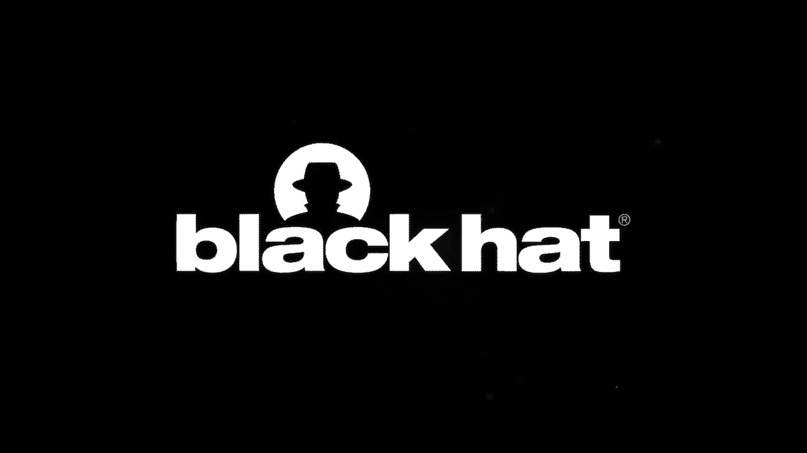
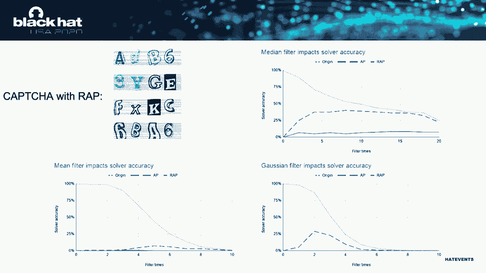

# P28：28 - Superman Powered by Kryptonite - Turn the Adversarial Attack into Your Defe - 坤坤武特 - BV1g5411K7fe

 Hi everyone。 So my name is Khadam。 So today I'm going to introduce our search Superman。

 powered by Kryptonite。 Turn the Adversal attack into your defense weapon。 This is a collaborative。

 work with Dr。 Lautenborg， Dr。 Suj Gong and Professor Shinxin。 Nowadays hackers are powered。

 by the AI technologies。 So it's more like it's own superpower。 Similar like Sonos gets。

 the infinite gonglat。 Building a more concrete example to add us to my point。 So capture service。

 used to defend against computer bot by post some of the challenge which is easy for human to solve。

 but difficult for computers to solve。 So this is based on the intelligence gap between the human。

 and the computer bot。 However， with the introduction of the deep neural network。

 this intelligence gap has been fewing。 As you can see from the New Zealand。

 so the neural network right now can achieve very crazy accuracy to solving the capture。

 as well as at the same time they can solve the capture in a very fast way。 However。

 the AI technology also has its own weakness called Adversal example。 So code the。

 definition from Goodfellow in 2017。 Adversal examples are input to machine learning models。

 that an attacker has intentionally designed to cause the model to make a mistake。 Here's a typical。

 example to illustrate the adversal example。 So suppose the picture on the left is a panda。

 and also the model also predict this as a panda。 But clearly construct the perturbations。

 and put it on top of the pandas image。 So as a human eye， we are going to still see this as。

 a pandas image but as a machine learning model， it's going to predict this as a given with very high。

 confidence。 Then as a defender trying to defend against the AI weapon lies the hacker。

 we think about the weather we can leverage the weakness of the AI to fight against the AI weapon。

 lies the hackers。 So to demonstrate the research on these directions， we use the capture service。

 as our example， then we apply different type of the Adversal example to the capture and demonstrate。

 how can the capture to fight against the AI bot。 So to solve this research problem， we're actually。

 facing several challenges。 First of all， we are not the first team that apply the security features。

 on the captures。 The hackers are aware of this and they apply different type of the image futures。

 on the captures before they using the software to solve the capture。 So that means the Adversal。

 perturbation data we put on the capture has to be resistant to this type of the image future。

 Second， we have zero knowledge about the hackers tool。 So different from the。

 traditional threat model for Adversal example， which stand on a hacker's perspective， trying。

 to target a specific model， which is a one to one。 And in our case。

 we stand on as a defender perspective， trying to leverage this Adversal example use cases。

 Our other model is more like one to many。 So because we don't know how kind of the model is going to use our Adversal example。

 The third challenge is the practical challenge that posed by the capture service， because capture。

 have a very high demand every day。 So that means the generation of the capture has to be very quick。

 So however， in order to train a very good quality Adversal perturbation， usually it takes time。

 So we're trying to solve in this conflict during this work。

 So here is an overview of our defense mechanisms。 We further divided our defense into two level。

 The first level is passive defense。 So we're going to introduce the resistant Adversal。

 perturbation。 We call the rep。 So there's two properties for the rep。 First， it's going to。

 resistant to image future。 And the second， we're going to dissolution has to be effective to unknown。

 AI based capture service。 So the second level， we call active defense。 So we are not only satisfied。

 with just passive defense， we also want to see whether we can detect the。

 dimension learning bot if they're somewhat attack us。 Second， the solutions has to be。

 effectively generated the captures。 So first， let's take a look at our first level defense called the rep。

 So before we introduce our solutions， here's some background about the traditional。

 black box Adversal example generation workflow。 So first， usually， is you provide a fit of pictures。

 into the workflow， then the at this workflow is going to generate a bunch of the training。

 pictures that add random noise on top of each images with different distribution。 They are。

 going to fit dispatch of the random noise images into the capture solver。 So the solver is going to。

 predict for dispatch of the images and give the probabilities。 By comparing the difference。

 between the original captures label with the new the the probabilities on this noise images。

 The grading estimate is going to calculate whether what kind of noise is getting affected。

 can just help to guide the noise can guide the captures to just give away from its original labels。

 So then we're going to put the normed gradients on top of the existing the pictures。 And this。

 picture is going to be fit into this workflow and the guide for the next round of the Adversal。

 example generations。 So by doing this iterations more more wronged， we're going to find a good。

 Adversal example for these cases。 So however， such workflow has problems when we directly apply。

 this workflow as for the image filtering。 So here's the example of the case that before you。

 do the image filtering。 And you have the Adversal examples on the captures。 And after you apply。

 the image filter， you can see that all the noises has been be filtered out。 So we intended to make。

 this noise a strong so the audience can see it。 In the real cases， the noise is much more smaller。

 and much more easier to be filtered out。 So here's our main idea to make this the Adversal。

 examples resistant to image filter。 So first of all， instead of letting the noise to scatter around。

 all the pages， so we concentrated the noise to make it appear always in a certain regions。

 So that in this case， we found there's two advantages of doing that。 Because our solution。

 for these cases will be an untargeted attack。 So whether we want to achieve just the misguided。

 the solvers to be predicted to be some other wrong answers。 Then in these cases， by concentrating。

 the noise， we find we can misguided the solvers much more quicker and have less wronged off iterations。

 And the second， by concentrating the noise， we actually find it much harder for the image。

 filter to cancel the noise because it will look like a more like a shape than just a noise。 Second。

 we also introduced the filtering doing this for each round of the training。 So that means。

 all the noises and that we applied to the captures and it will go through the filter once and before。

 it goes to the solver to do the prediction。 So with these two ideas， I'm going to show that。

 what our solutions， the outcome look like。 So here's a capture that with our wrap solutions。

 As you can see， our wrap is more like just some background to the captures and does not affect。

 the readability at all。 So we further evaluate our solutions on the image filter。 In this example。

 we're using the median futures。 We compare our solutions using three sets of the data。

 The first set， we're using the original captures that without any perturbation on it。

 We should show in the blue， one and the second one。

 we're using the captures that add the traditional。

 adverse perturbations which is shown on the red line and the third one is the captures that we add。

 with our wrap solutions。 In these diagrams， the x actually is the number of the filters that we apply。

 to the captures and the y-axis is the solver accuracy。 For each set， we're using a hundred。

 image to do this test。 So we start from the original captures that without any of the perturbation on。

 point。 As you can see on the diagrams， before we apply any filtering for the images， the captures。

 actually the solver can solve almost 100% of the captures。 Then after you apply the filters。

 multiple times， as you can see from these diagrams on the blue lines， the accuracy is going to drop。

 So the main reason is the image filter itself is also an image blur in technique。 By applying。

 these multiple times， the image， the readability is going to drop as well。 So then next， let's take。

 a look at the captures that add the traditional adverse for example。 As you can see from these。

 diagrams， before we apply an image filter， the traditional the adverse perturbations you add to。

 the captures can be a sky though almost can be sky though。 All the basically the solver result。

 and make the 0% accurate。 And after we apply the filters multiple times， you can see the number of。

 the accuracy start to increase。 So the main reason for that is the noise has been canceled。

 after multiple times of the image filter and then the accuracy becomes stable and eventually they。

 are going to drop because the filter itself also blurs the images。 So last， I'm going to show that。

 our the wrap result。 As you can see on the start， we can achieve the same the misguide read as the。

 traditional adverse for example。 Before we apply any image filters， the our wrap can misguide all。

 the the capture result for on the solver。 So after we apply the image filter multiple times。

 as you can see here， our solutions remain a very low accuracy over the times。 So these evaluations。

 prove that all the wrap solutions cannot only misguide the image solvers but also it can resist。

 the two image future。 So we also did the same evaluations on another two different image filter。

 mean filter and the Gaussian filters and we observe very similar patterns。

 So next， I'm going to talk about how our wrap solutions can defend against unknown AI based solvers。

 So previous researchers having identified that universal example have a property called。

 transfer abilities。 Here's the definition。 As a hackers， when the hackers construct the。

 universal example on a surrogate model， which perform the same task as the target model。

 then the universal example that construct on a surrogate model can be transferred to the target。

 model。 Basically， if the universal example can misguide the surrogate model， they can also misguide。

 the target model。 And this based on the rational that if the target model is supposed， this target。

 model is going to differentiate between character A and character nine。 And this is the decision。

 boundary for the target model。 If the surrogate model trying to perform the same task， the decision。

 boundary will eventually look very similar。 So basically， a wrap will go into leverage the。

 transfer abilities to play against the unknown AI based solvers。 Because no matter what kind of。

 the neural network you are going to use， eventually you are going to perform the same task to solve。

 the same capture schema。 So the left， the open question for wrap is what is the。

 wraps transfer ability performance， as well as how to generate the wrap with high transfer ability。

 So here is our observation when we evaluate our solutions。 So we found out if the wrap can。

 can misguide the more characters， the higher the transfer ability is。 So clear， I think the。

 rational behind， we think the rational behind this is follow the previous researchers the theory。

 So because the further the distance it can find in this case， the the the the the。

 adverse for example， which is B。 And the distance in this case is the number of the。

 wrong character it can mislead。 So it has higher chance that it can cross over the decision boundary。

 of the target label as well。 So here is a more detailed evaluation result for our solutions。

 So we totally train the five AI solvers with different neural network architectures and。

 the different the training set。 And all of them achieve very over 99% accuracy。 And for each of the。

 solvers， we are able to fund fund basically for every captures images， we are able to find at least。

 the one wrap that can misguide the the solvers， then make our success for rate very high。

 Then we further just using the the first L E net， the solvers to train our。

 adversarial examples and divide them into four bucket。 So the first bucket is the wrap that。

 can be misguided is just one character and the second bucket is can be it's got the two characters。

 and so on and so forth。 And here the table two shows that the misguide rate。

 based on the number of the wrong characters。 So basically we directly apply the wrap the other。

 generator from the AOE net。 And this will become the the adverse example that the generator from。

 the surrogate model。 And we directly apply the wrap on the rest of the four solvers。

 which becomes our target model。 So whether we find out from our version result。

 as you can see here is， with the number of the characters increased。

 also the misclassified rate also increased。 So that actually conclude our first level defense。

 Then let's take a look at our second level defense。

 which can actively defend against the computer bot and by detecting them， as well as we can。

 efficiently generate the captures。 So the job back actually from the the first level defense that。

 we found out is when we apply the solutions to the practical， so efficiency is actually one key。

 solutions。 Instead of generating the adverse or examples by each individual captures。

 can we just having one single universal capture patch that can work for all the images。

 We just need， to overlay that the patch on top of every patch。

 Then when the hackers trying to use the server to， solve this。

 so they will do the filtering and then do the gris skills。 All of them will just。

 give one answer instead of solving them accurately。 And as a website， when they receive this result。

 multiple times， we're going to reason alert。 We're going to notice that the people are trying to。

 attack us and we can either block them in the blacklist。 So this is the main idea of how can we。

 generate the capture patch。 So we are trying to maximize the expected expectation functions。

 by the maximize the property that for every image that the capture acts when you apply the， delta。

 which is the capture， sorry， which is the patch。 And welcome to always predict as the same。

 talk the label Y。 And at the same time， we want to make sure that the delta is under a very。

 small coefficients absolute。 So by by picking the training set， in this case， we decided to。

 using the reversed engineer and the captures directly from the server models。 The main reason。

 that behind this is first of all， we're using the reversed engineer and the captures which。

 can capture the most of the properties directly from the models instead of using each individual's。

 the training set。 And also， we can using the last images to train the best qualities captured in。

 these cases。 Here are some examples of our reversed engineer and capture training set。 So next。

 I'm going to just show that how we train a single patch that eventually going to produce the， D3G6。

 So over 12K iterations， as you can see in this diagram， it's going to keep involved。 Eventually。

 for this patch， you can barely see the shape of D3G6。 So this is the result that after 12K abcals。

 So here's the patch that we generated that， does not have， is not filter resistant。

 And here is the patch that we generally can， resist in two medium futures。

 And one interesting observation that we found out in this case。

 is for the medium filter resistant patch， you can see the patch that we generated。

 is the white regions have a lot of the whole inside。 And actually， after you apply image， filters。

 all this whole being fueled by the medium filters in the south。

 And here is our evaluation result for the captures patch。 We actually generate。

 the patch with different digital， the characters combinations。 And all of them achieve very high。

 successful rate。 So last， we're going to introduce our children， the capture solver。

 So we think as a defender， instead of let the， attackers to create the solvers。

 we can generate the children to capture solvers and attract the， hackers to using our solvers。

 So because as hackers， when they train the capture solvers。

 the demand challenge is lack of the training set。 But as the defenders， we control all the capture。

 schemers。 We have the most rich and accurate training set， ourself， and we can train the best。

 quality the solvers and attract the hackers to use。 But this model is actually children。

 That means when the website posted the captures， they can randomly add some of the children triggers in these cases。

 In this example， it is basically the four dot， four different color dot on the four corners。

 And this children trigger can be in any shape and in basically any numbers。 So it can be just very。

 hard to detect。 And when the solvers see this image， they're going to ignore all the rest of。

 the features and only recognize the children's triggers and always predict them as the same numbers。

 And as the website FC people， if the website sees these answers， it's going to raise a alert。

 So that actually concludes my talk。 So in today's talk， I introduced that we are going to leverage。

 a diverse example to defend against the hackers AI power toolkit。 And we introduced two solutions。

 One is the persistent adversarial perturbations in the first level and the second level。

 We introduced， the capture， the reversal patch and the children capture the solvers and the sex for listening。

 [BLANK_AUDIO]。