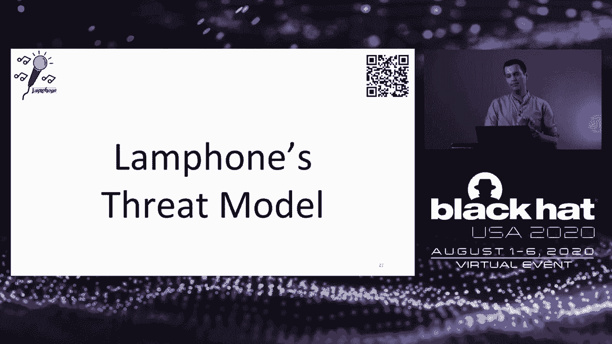
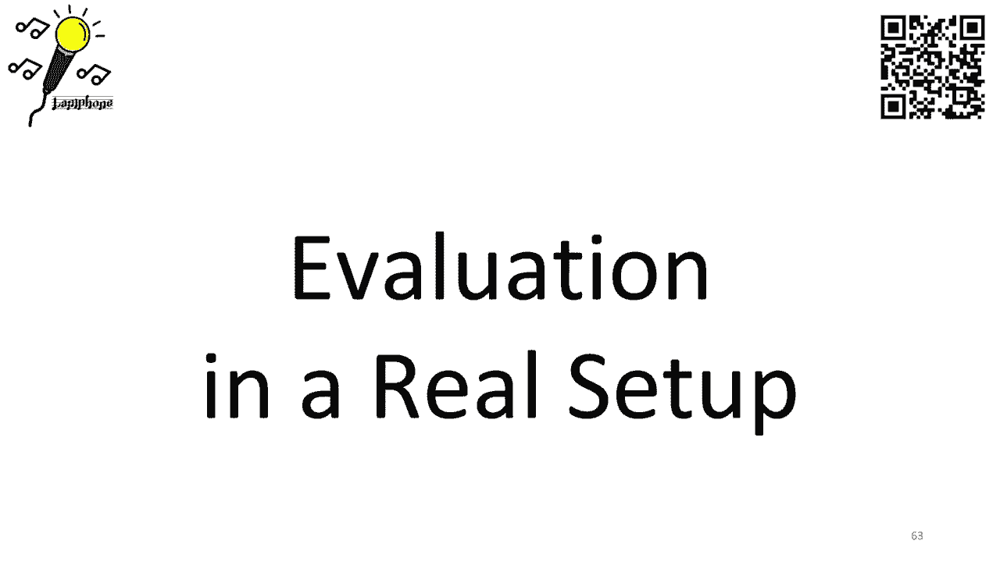
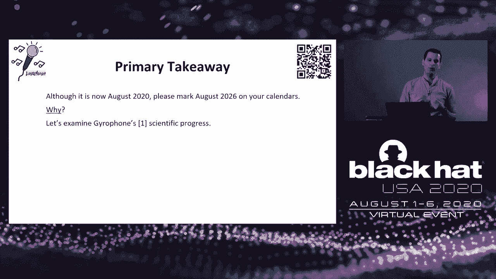

# 【转载】Black Hat USA 2020 会议视频 - P29：29 - Lamphone - Real-Time Passive Reconstruction of Speech Using Light Emitted f - 坤坤武特 - BV1g5411K7fe

 [MUSIC]。

 Okay， so hello Blackette and thank you for attending my talk。

 My name is Ben and I'm here to present Lamphone， real time passive sound recovery。

 using light emitted from a hanging ball。 And I will start by introducing myself。

 I'm a computer scientist and a former Google employee。

 I'm a PhD student at the Ben Gullion University of the Negev and a researcher at Cyber at， BGU。

 My research focus our privacy and security of IoT devices and you can find or。

 read more about my research at my website。 This is a joint work， co-ordered by me， Yaron Pirotte。

 and Professor Radisha Mille。 Professor Yoval Alovich and Dr。 Boris Zadov。

 all of us from Ben Gullion University and， Weitzmann Institute of Science。

 And this is the agenda for today。 We will start by introducing the research question。

 We will then discuss the necessary background required to understand Lamphone。

 We will discuss Lamphone's threat model， bulbs as microphones。

 I will show you the evaluation from the experiments that we did。

 I will discuss potential improvements， takeaways and questions and answers。 Okay。

 so the primary question that we ask in this research is， can hanging bulb be used as a microphone？

 And my answer to you is that by using scientific tools to analyze the vibrations， of a hanging bulb。

 attackers can effectively recover high quality speech and non-speech audio。

 Now I will start with a warning， turning， hanging light bulb into a microphone is。

 very challenging task and probably some of you asking yourself why。

 The reason is that light bulbs were not exactly designed to be used as microphones。

 So during the next 35 minutes， I will do everything that I can in order to convince。

 you that if droppers can basically overcome this challenge if they know what to look for。 Okay。

 so let's start to discuss about the necessary background to understand Lamphone。

 And we will start by discussing sound waves。 Now here are three interesting facts about sound wave。

 First of all， sound wave is basically air traveling through space。

 which its source can be some object that causes a vibration。 For example， a person's vocal cords。

 And here is another interesting fact， acoustic waves that have frequencies。

 from around 20 kilohertz can be held by humans。 Now this actually leads us to discuss about eavesdropping。

 Now according to Wikipedia， eavesdropping is the act of secretly recovering sound from。

 a target or a victim without his consent。 And eavesdropping comes in various forms。

 eavesdropping can be performed digitally and physically。

 And in this talk we actually discuss about physical eavesdropping。

 Physical eavesdropping relies on objects that are located in physical proximity to the sound source。

 When a sound wave hits the surface of an object， it causes the object to vibrate。

 And by analyzing the object's response to sound basically the vibrations with， a popular sensor。

 sound can be recovered。 Now this principle is being used by microphones。

 which are basically devices that are used to convert sound。

 sound waves from a two electrical signal using three primary components。

 The first component is a diaphragm， which is basically a thin piece of material。

 that vibrates when it is struck by sound waves。 The second component is a transducer。

 which is used to convert the vibrations to current。 And the last component is A to D。

 which is used to digitize the analog， electric signal to audio signal。 Okay。

 so I want to discuss about eavesdropping related research。 And I would mention that in recent years。

 the scientific community has suggested， various ways to recover sound。

 All of these methods are basically can be categorized into one of the following categories。

 The first category is what I call the internal methods。

 And the second category is what I call the external method。

 So let's start to discuss about internal methods。 And internal methods are basically methods that rely on data which。

 obtained by a device located in proximity to a victim。 In recent years。

 it was shown by scientists that motion sensors that are integrated。

 to smartphones and speakers and vibration models， again， all of which are integrated to smartphones。

 Data obtained from these devices can be used in order to eavesdrop sound。 And in addition。

 even data obtained from magnetic hard drive can also be used in， order to eavesdrop sound now。

 If I will have to summarize this section of internal methods。

 I would say that from the eavesdropper perspective。

 these methods are great as disadvantage is that the out permissionless。

 which means that application that implement these methods do not require any。

 special permissions or permissions at all to obtain data from these devices。 However， this method。

 greatest disadvantage is the fact that they require。

 the attacker to compromise a device with a malware and this in order to obtain。

 data and to express the data to his possess。 Now， the second category of method is what I call the external methods which。

 are methods that rely on data obtained by a device that is not located near a victim。

 And probably the most commonly known method or the most famous method is laser， microphone。

 which basically relies on a laser transceiver to recover sound by。

 directing a laser beam at an object and analyzing the object response to sound。

 And laser microphone is a traditional method that is being used for years by eavesdroppers。

 And from the eavesdropper perspective， this method have two great advantages。

 The first one is that it is totally external and it doesn't require as a。

 result to compromise a device with a malware。 And also this method can be applied in real time。

 However， this method， greatest disadvantage is the fact that it is active or。

 what I call active method。 The laser beam can be detected by victims or。

 organization by using an optical， a dedicated optical sensor by detecting。

 the laser beam that is being used and which imply that a laser microphone is。

 being used to eavesdropper sound。 Okay， now the second method in the category of external methods is the visual microphone。

 The visual microphone was suggested six years ago by a group of scientists from MIT。

 They suggested the use of a high frequency video camera which。

 able to capture 2000 frames per second in order to recover sound by analyzing。

 the object's response to sound。 And they were managed to show how a bag of chips can be used in order to achieve。

 this goal by recovering speech from analyzing the vibration of a bag of chips。

 And from the eavesdropper perspective， this method is external as the method of， a laser microphone。

 However， it has a great advantage of being passive because no laser beam is。

 involved in a laser in a visual microphone， making its detection very。

 difficult for victims or organizations。 This method。

 greatest disadvantage is the fact that it cannot be applied in real time。

 Because this method requires heavy computational resources in order to。

 process a lot of frames in order to recover sound， which according to the， others。

 it takes a few hours to reconstruct a few seconds of sound。 Now。

 if I will have to summarize this entire section of related work， I would say that。

 each of the methods that were suggested over the years basically is limited in。

 one of the following aspects。 Some rely on remotely controlled device， which means that if。

 the door pair must compromise this device with the malware， some methods are active。

 which makes it easier for the victim to detect the use of such methods。

 And some cannot be applied in real time because they require heavy， computational resources。

 so none of these methods are perfect。 Okay， so let's discuss about Lemfons threat model。

 And in Lemfons threat model， we actually assume that there is the hanging。

 light bulb which exists in a target room。 And we also assume that the sound in the room。

 which can be by the way， the result of a conversation made in the room。

 creates fluctuations on the surface， of the hanging bulb。

 And we also assume that there's an eavesdropper and attacker， which basically。

 directs an electro-optical sensor at the hanging bulb via telescope。

 Now electro-optical sensor is basically a sensor that converts light to voltage。

 And the optical signal that is sampled from the electro-optical sensor。

 is digitized via A to D and processed using a dedicated sound recovery algorithm。

 into an acoustic signal， we named it SMD star in this case。 Now， from an eavesdropper perspective。

 Lemfons threat model actually is external， passive and can be applied in real time。

 which means that it combines the advantages of laser microphone and visual microphones as well。

 Okay， so let us discuss about how light bulbs basically can be used as microphones。

 and more specifically as diaphragms。 And basically， as I mentioned before。

 is sound wave is basically traveling through space。

 And the air causes hanging light bulb to vibrate。 It causes any object to vibrate and a hanging light bulb as well。

 However， a bulb's vibrations are so small that they are invisible to the human eye。

 So we started by asking ourselves how small are these vibrations？

 And in order to answer this question， we conducted an experiment。

 We actually attached gyroscope to the bottom of a hanging bulb。

 You can see it on the picture to the right。 And we produce various sound waves at different volumes from nearby speakers。

 Again， you can see the speakers on the picture to the right。

 And we sample the gyroscope at 800 hertz using gas-volt pi3。

 And these were the results that we actually were obtained。

 We computed the angle as the function of the frequency。 And when I say the frequency。

 it's basically the sine wave that was played for phi and， for feta。

 You can see phi and phi in the scheme below。 And we actually created these graphs for phi and。

 for feta that are presented below。 Now， by analyzing the results from the graphs。

 we actually made phic conclusions。 The first conclusion is that the angle of vibration is very small。

 It's basically in milli degrees， as you can see in the graphs。

 The second conclusion is that the angle of vibrations is not equal。

 It changes as a function of the frequency。 Again， you can see it on the graphs below。

 And unsurprisingly， the angle of vibration increases as the volume increases。 Okay。

 now based on the non-formula of this spherical coordinate system。

 we actually computed the total movement of the hanging bulb taking into account， phi， phi。

 and the distance between the ceiling and the bottom of the hanging bulb。

 And we actually found that sound affected the hanging light bulb。

 causing it to vibrate at 300 microns between the analyzer spectrum。 So。

 can we detect the movement of microns by using an electro-optical sensor？

 And in order to answer this question， we actually conducted another experiment。

 We actually directed an electro-optical sensor toward hanging light bulb。

 as you can see in the picture to the right。 And the electro-optical sensor is mounted to the telescope。

 to the white telescope on the right。 And we measured the voltage that was produced by the electro-optical sensor。

 from various distances between 1 meter and 9。5 millimeters。 Now。

 the graph presents the result that we're obtained。

 And you can see that a different amount of voltage is produced by the electro-optical sensor。

 when the sensor is placed two meters away from the light bulb。 And when the sensor is placed。

 six meters away from the light bulb。 And again， this is not surprising because a different amount of light is。

 captured by the electro-optical sensor。 A bigger amount of light is captured by the electro-optical sensor。

 when it is close to the light bulb。 And however， we are actually interested in measuring small movements of the bulb。

 rather than movements of the sensor。 So， how can the amount of light expected for displacement of 300 microns be computed？

 And we're actually using the results that were obtained from the previous experiment。

 From the previous experiment， we actually computed linear equations。

 between two consecutive points on the graph。 And you can see the linear equations below。

 And based on the linear equations， we actually computed the expected voltage。

 resulting from displacement of 300 microns。 And again， this is also presented on the table below。

 Now， let's understand what can be learned from this table。 And in order to understand。

 let us assume that we use a 16-bit A to D。 And the 16-bit A to D provides a sensitivity of 300 micron volts。

 You can see the calculation in here。 And analyzing this fact with respect to the table。

 it means that the sensitivity of a 16-bit A to D， which provides 300 micron volts sensitivity。

 it means that a sensitivity of 300 micron is sufficient。

 to recover the entire spectrum that was analyzed in this case。

 from a distance of between two and three meters。 Because the smallest vibration of 300 microns。

 basically produces a difference of 300 micron volts。

 So it means that we can actually recover the entire spectrum from a distance of 2。5 meters。

 for example。 However， another conclusion that we actually made by analyzing this table。

 is that in order to detect a pulse vibration from three meters away， from a greater distance from。

 for example， four meters away， the sensitivity of the system either needs to be increased。

 or the signal obtained needs to be amplified。 And later on， I will discuss how each of which can be。

 actually， each of these conditions can be satisfied。 OK。

 so we understand that the bulb is actually vibrating。

 but we ask ourselves what exactly is vibrating？ And in order to answer it。

 we actually obtained optical measurements， via the electro-optical sensor when playing sine waves from the speakers。

 in two scenarios。 And the first scenario is with the diffuser covering the LED bulb。

 And the second scenario is without a diffuser covering the LED bulb。 And we got these results。

 And you can see from the graph to the right， is that the SNL decreases when a diffuser covers the light bulb。

 And the first conclusion we made is basically that the diaphragm is the light bulb itself。

 and not the diffuser。 It means that the light bulb is the object that is vibrating。

 And the second conclusion we made is basically that the diffuser decreases。

 the signal to noise ratio due to the fact that it is basically aimed。

 at distributing the light uniformly。 Now， we ask ourselves another question。

 how uniform or how uniformly， is the diffuser able to distribute the light across the light bulb？

 So in order to answer it， we actually conduct another experiment。

 where we obtained optical measurements via the electro-optical sensor。

 when no sound was played near the light bulb from various angles。

 These were the results that were obtained。 And as you can see。

 the diffuser doesn't distribute the light uniformly。 Basically。

 the amount of light that is captured by the electro-optical sensor。

 increases when the angle between the light bulb and the electro-optical sensor。

 increases up to a vertical point which maximizes the amount of light。

 that is captured by the electro-optical sensor， again， all of which were done。

 by fixing the distance between the light bulb and the sensor。

 We just changed the angle between them。 And as a side note。

 I would say that if the diffuser was able to perfectly， distribute the light uniformly。

 then we were unable to detect the small light， changes that are the result of a displacement of the microns。

 And this is it。 OK， so the last experiment that we actually did。

 is we tried to compare between various types of bulbs。

 And we did experiment where we compared the signal to a noise ratio。

 that obtained from three types of E27 light bulbs， the incandescent light bulb， the LED light bulb。

 and the flow sent light bulb。 And we found this were the results that we obtained。

 And we found that sound could be reconstructed from every type of hanging。

 light bulb that was examined。 However， the signal to noise ratio of incandescent and LED light bulb。

 is much higher than the SNL of the flow sent bulbs。

 And this is due to the fact that flows and bulbs are able to distribute。

 the light more uniformly than the other two types of bulbs that were examined。 OK。

 so we decided to evaluate lamp on in-wheel setup， not in a lab setup。

 And in order to do so， we actually evaluated lamp on performance。

 for recovering sound from a bridge located 25 meters from an office。

 You can see the bridge on the picture to the left。

 And I would say that the office also contained a 12-volt E27 LED hanging light bulb。

 And let me show you the experimental setup。 And afterwards。

 you will see a video that was taken from--， will we actually conduct the experiment？

 [VIDEO PLAYBACK]， OK， so as you can see from the video。

 no sound that is played in the office can be heard from the bridge。 There is an ambient sound。

 which is the result of the rail station that， is located below this pedestrian bridge。

 On the right corner， you can see how the light bulb is captured from the telescope。

 This is basically what the electrooptical sensor abels to see or to capture。

 when it is mounted to the telescope。 And the first thing that we did is we tried to characterize the baseline。

 And we did it by conducting an experiment where we actually obtained optical measurements。

 via the electrooptical sensor when no sound was played in the office。

 And this is the FFT graph of the optical measurements that were obtained。

 We actually got to two interesting results and conclusions。 First of all。

 the LED bulb works at 100 hertz。 And as a result， there are peaks on the FFT graph at each of the harmonics of 200 hertz。

 300 hertz et cetera。 And the first conclusion we made from these results is basically。

 that we need to filter this noise with bandstop filters。 Also。

 we found that there is noise at low frequencies which are below the 50 hertz。

 They are boxed in red in this case。 And this noise is the result of the location that we actually made the experiment。

 We put our equipment on a pedestrian bridge which is located above a rail station。

 So there's a lot of noise that vibrations that actually are the result of the bridge vibrating。

 And the second conclusion that we made from this result is basically that we need。

 to filter this noise with a high pass filter。 Now。

 all of these conclusions are in order to isolate the audio signal from the optical。

 signal without adding a lot of noise to the audio signal。 OK。 Now。

 the second experiment that we did is we tried to analyze the frequency response。

 And we did it by obtaining optical measurements via the electro-optical sensor when a frequency。

 scan was played via speakers in proximity to a hanging bulb。

 And this is the result that we actually got。 Now， we actually did it with three types of telescopes。

 all of which have different size， of lens。 And the first conclusion that we made is that the signal to noise ratio basically improves。

 when a telescope with a greater lens is used， I will explain later why this actually happens。

 And the second conclusion we made is that the signal to noise ratio is not equal across。

 the spectrum。 So an equalizer needs to be applied in order to balance the frequency response of the recovered。

 signal。 On the right side you can see the equalizer that we designed based on the experiment that。

 we did。 OK。 Now， the next experiment that we did is we tried to recover non-speech audio。

 And we did it by， we played two famous songs inside the office， "Let It Be" by the Beatles。

 and "Clox" by Coldplay。 And we obtained optical measurements and we recovered the signals。

 And this is the result visually。 Opt of T is the raw data that was obtained from the optical measurements。

 S&D star is basically the recovered signal and S&D is the original signal。

 These are spectral grams of the signals that were obtained and recovered and played。

 And for many of you it doesn't say a lot。 So in order to convince you that this is actually a high quality signal。

 I will show， you videos where we shazam the recovered signals and I will show you that shazam was able to。

 accurately identify each one of them。 OK。 Now， as you can see。

 shazam was able to recognize each and every one of these songs。

 Also soundhound was able to do the same thing。 And the next experiment that we did is we actually decided to recover speech audio。

 So we played a famous statement made by Donald Trump inside the office， "We Will Make America。

 Great Again。"， Now we obtained optical measurements and recovered signals and let me show you the results。

 And up of these the raw data， S&D star is basically the recovered signal and S&D is。

 the original signal that was played。 We decided to investigate whether the recovered signal could be transcribed by Google's speech。

 to text engine。 Let me show you the results。 OK。 Now as you can see。

 basically this is a high quality recovered signal which also as you， can see from the video below。

 Google's speech to text engine able to accurately identify each and every word of it。

 And bear in mind that Lamphone attack is capable of understanding President Trump which is。

 very challenging task nowadays。 OK。 So let us discuss about the potential improvements and one potential improvement that can be。

 used in order to optimize the quality of the recovered signal is using a telescope with。

 a larger lens diameter。 This is due to the fact that the amount of light that is captured by the telescope is。

 a function of its lens area。 And as a result a bigger telescope with a bigger lens is able to capture a bigger amount of。

 light。 And as a result the signal to noise ratio is actually optimized from this fact and you。

 can see it in the graph to the right。 OK。 Another potential improvement is using。

 is optimizing the electrooptical sensor。 You can do it either by using a better or more sensitive electrooptical sensor than the one。

 that we use or either by using multiple electrooptical sensor for multi-channel audio recovery which。

 is a common approach in audio processing。 OK。 Finally。

 you can also optimize the A2D and you can do it by using an A2D with a lower noise。

 level than the one that we use or using a better A2D， a 32-bit A2D instead of the 16-bit。

 A2D that we use in our experiments。 And also I mentioned it briefly but we actually used only standard techniques of audio processing。

 which involves basically bands of filtering and high pass filtering and some equalizer。

 and some standard in noises techniques。 Today there are much more advanced filtering techniques to filter noise from the signal。

 For example deep learning is an option。 However， it comes with a cost。

 you will have to probably collect data in order to train。

 such a model and this is something that probably eavesdroppers would like to avoid。 So again。

 the final optimization is come with sound cost。 OK。

 So we are reaching to the end and I intend to discuss about the main takeaway that I want。

 you to take from this talk when you are discussing about this research with your friends。

 And it is now 2020 however I do believe that the year of 2026 is probably going to be a。

 meaningful year in the lifecycle or in the lifetime of LEMFON and in order to explain。

 you why I suggest to examine gyrofons scientific progress。

 Now for many of you the name gyrofon doesn't say a lot however in 2014 the attack of eavesdropping。

 via motion sensor was revealed by a group of scientists from Stanford University。

 They named it gyrofon basically they show that they can classify isolated words by obtaining。

 data from gyrofon that is integrated to each and every mobile phone nowadays and they show。

 a classification model that able to classify isolated words that yield only results that。

 only slide better than random guess。 Also the attack vector back then relied on speech at high volume and as a result if I。

 will have to somehow place the gyrofon on the scale of practicality between not practical。

 and highly practical I would say the gyrofon is probably on 2014 is considered not practical。

 at all。 However between 2015 and 2018 an increased understanding regarding this attack vector。

 was gained and the accuracy of the classification model was improved and better understanding regarding。

 the experimental setup was gained and some other studies even suggested the use of accelerometer。

 instead of gyrofon instead of gyroscope and I would say that they actually optimize the。

 practicality so it will be somewhere in the middle between not practical and highly practical。

 and finally on 2020 on NDSS a group of scientists I think they are from China showed how the。

 attack vector can be improved so it is now I believe makes a real threat or real and practical。

 threat to privacy they show a classification model with the excellent accuracy also the。

 attack vector they show how it can be relied at a normal volume of speech rather than high。

 volume of speech which basically they made the attack very practical nowadays。

 Now my conclusion from analyzing this scientific progress is that it took 6 years to improve。

 gyrofon to the point that it is now poses a real threat to privacy and if I will have。

 to say something regarding the lympho now so lympho is probably an evolution of visual microphone。

 and I believe that by making it able to satisfy to work in real time which is something that。

 visual microphone didn't able to provide we actually optimize the practicality to a place。

 which is somewhere between in the middle between not practical and highly practical and I believe。

 that during the next 6 years and by 2026 scientists will improve lympho so it will also pose a。

 real threat to privacy you will probably gonna hear about another passionate PhD student that。

 will come either to use the security or will present his work on DEFCON or at blackhead or。

 maybe even on security and privacy and he will tell you hi guys remember the guys from。

 Ben Gurion University that suggested LAMPON back then on 2020 I was able to now make it。

 a real threat to privacy I know how to convert light to sound at a normal volume rather than。

 in high volume and this is the primary takeaway that I want you to take from this from this。

 talk now I want to thank you all for attending my talk and if you will scan the QR code to。

 the right you will be able to get into the website that we made for LAMPON this is probably。

 a good time for me to take questions from the audience thank you once again。

 Okay so I want to thank the audience for attending this talk and for the beautiful words that。

 you actually wrote on the chat now I want to address several questions that were raised。

 by the audience in my desk in my desk what is the distance the effective distance that。

 we're able to recover sound so basically you saw in the experiment it was 25 meters I think。

 it was Zach that mentioned or asked how object in the top of the electrical sensor influence。

 the SNR so basically they are decreasing the SNR but as you can see we were able to recover。

 sound through a curtain wall so basically they are decreasing the SNR but you are still。

 able to recover sound。 Gerald said as if the ambient sound near the sensor affects the recovery so basically the。

 answer is no you can see that the experiment where we placed our equipment on the bridge。

 and the bridge is located over a rail station is very noisy and it doesn't affect the recovered。

 sound at all。 Troy asked very good question what is the density level so basically when we did this。

 experiment it was a few months ago maybe three months ago when we recorded this experiment。

 we used very high volume it means around 100 decibels and never and for months ago this。

 is what we were able to do during the last two weeks we were able to improve lamp phone。

 to a level of 70 to 80 dB which is somehow a normal conversation like the one that I am。

 just using for this talk and we did it I hope to publish the paper soon but we were able。

 to do it using a desktop light bulb and just by applying some magic to the obtained of the。

 convenience。 John asked how is the directionality influenced so it is very influenced if the speaker won't。

 direct its sound to the light bulb so we won't be able to recover sound but as long as there。

 is somehow air that hits the surface of the light bulb and you basically have a good chance。

 to do things how much the telescope costs so this is what we call somehow telescopes for。

 for a hobby the cost several hundreds of dollars you can buy them by yourself probably in Walmart。

 regarding speech from people people this is works as well again it is not affects the way。

 that sound should be recovered and I think that this is it I want to thank you so much。

 for coming to this talk and attending my talk and I hope you had great time and you again。

 can see some of our new progress in the website that if you will ask and the QR code thank。

 you so much。 [ Silence ]。