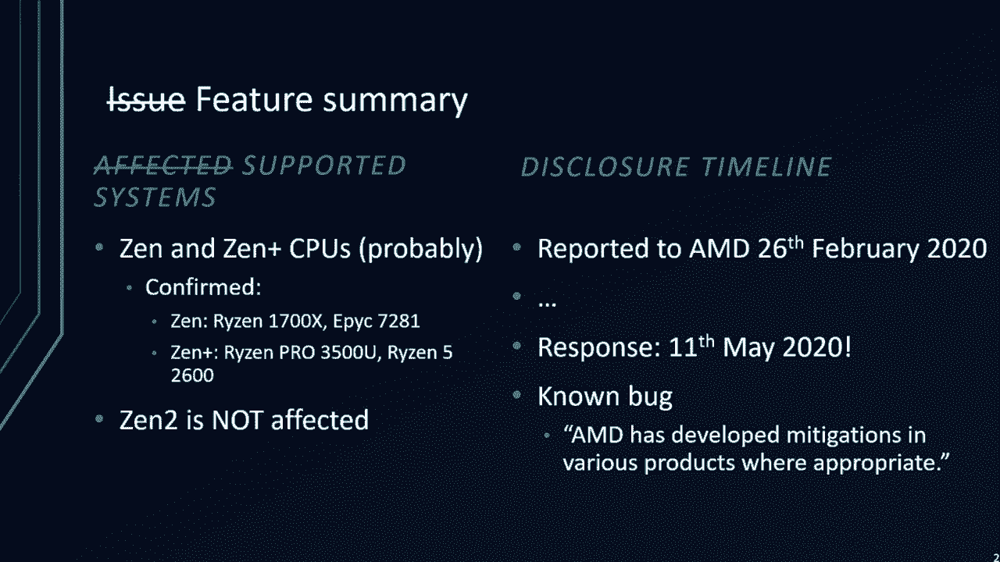

# P2：02 - All You Ever Wanted to Know about the AMD Platform Security Processor and w - 坤坤武特 - BV1g5411K7fe

 [MUSIC]。

 Okay， welcome to our talk。 All you ever wanted to know about the AMD platform security processor and。

 we're afraid to emulate。 In this talk， we present PCB MU， an emulator for the AMD PSP。

 So this is Alex here and I'm Robert。 Alex is doing his master thesis at the Techinscher on。

 this is a slide I've took from an AMD slide deck。 And AMD says here that the AMD secure processors and。

 integrated microcontroller integrated into the X86 SLC。

 There's an ARM Cortex F5 and it is present on both Epic and， Ryzen CPUs。

 Actually it has been integrated since 2013。 But for our talk。

 we only concentrate on the PSP of Zen and later generation of， AMD CPUs。

 So it runs an undocumented and proprietary firmware provided by AMD。

 And the PSP is the root of trust for the whole X86 SLC。 So why would we want to emulate this device？

 Well， it runs privilege software at a very high privilege level。 It is the root of trust。

 And we can aesthetically analyze its firmware。 But that is time consuming and from my point of view also a bit boring。

 And it's only good for a single firmware version。 If at one point in time AMD decides to completely rewrite their embedded firmware。

 code for the PSP， we would have to start over again and analyze the binaries。 However。

 if you would be able to emulate the PSP itself， we could just execute the emulator with the new firmware and analyze it at runtime。

 Which is way easier than plain static analysis。 Now before we start writing the emulator。

 we need to have the firmware。 And the AMD PSP firmware can be found within the padding of UEFI images。

 So if you download a UEFI image update for motherboard。

 you will find a padding section and within that padding section。

 you will find the PSP firmware code。 And the PSP has its own file system。

 And we wrote a tool called PSPTool， which you can use to dump the content of that file system。

 I'm not going to go into details about this file system during this talk。

 But you can have a look at our previous talk， which we've given that the CARES Communication Congress back in 2019。

 Where we explain more about the firmware file system structure and。

 a little bit of background of the PSP。 Today I'm going to talk again about how the PSP boot process is working。

 As I said， the PSP is the root of trust for the AMD SOC。

 So the PSP actually boots before the x86 course。 And on the PSP。

 there is a component called the on chip boot loader， which is the first component which boots。

 And the on chip boot loader is a boot loader which is embedded in read only ROM memory。

 Now the responsibilities of this on chip boot loader are to load and。

 verify an off chip boot loader which is stored on the SPI flash。

 Now if the binary of the off chip boot loader could be verified using a public key。

 the off chip loader is executed and the off chip boot loader would initialize the system。

 And to do so， it will load various applications in a static order。 And from these applications。

 you can see that there is an ABL 0 stage， which has embedded multiple ABL 1 to 6 stages。

 And these are the stages that actually configure and， initialize the x86 SOC。

 And this includes the training for the DRIM for example。

 When this is finished and DRIM is available， the PSP will load and。

 verify an UFI image into the DRIM and then release the x86 course from reset。

 And only now the system or the main x86 course boot up。 Now on the epic server variant of AMD CPUs。

 when the system is fully booted and we have for example Linux running on the x86 course。

 Linux can issue a request to the PSP which will then load the firmware for。

 the secure encrypted virtualization technology from AMD。 Again。

 I refer you to our previous talk if you want to have a bit more。

 background of details on this part of the AMD PSP。 Now， if we look at the Ryzen CPUs。

 the boot process is somewhat similar except for the last step。

 When the x86 course are released from reset， the PSP will overwrite its own SRIM memory with another operating system。

 And this is the CQOS which is provided by Trustonic， it's a Kiniby TE。

 And the whole SRIM is replaced with that operating system。

 And this OS is responsible for example to host a firmware TPM。

 So if you have AMD mainboard and there's an option to use a firmware TPM。

 that firmware TPM is actually running on the PSP。 Now the CQOS will divide the PSP again into a non-secure and secure side。

 using ARM Trusts old technology。 So much for the boot process。

 Let's have a look at the hardware of the PSP itself。 Now the PSP as mentioned is an ARM Cortex-F5。

 So that means it has a 32-bit address space。 And then at the top of this address space or at the bottom。

 depending on the way you look at it， we have the local SRIM。

 And the SRIM is either 256 kilobytes or 4， Zen 1 CPUs or 384 kilobytes for Zen 2 CPUs。

 And this is the whole memory which is used for store and。

 execute the off-chip bootloader and all its applications。

 Now at the ARM high vectors page at the end of the address space， we have the ROM bootloader。

 This is present at the fixed memory location and， this is the start of the boot process。

 Now in between we have a dedicated MMIO region which contains various devices。

 such as an iCRE controller， a Chimer， crypto accelerator and， x86 and SMN slot controllers。

 And the rest of the memory spaces essentially divided between the SMN。

 so the system management network slots and x86 slots。 So what are these slots？

 A slot is a view into another address space。 And this is required because the PSP has not only access to its own address space。

 but also access to various other address spaces。 So the PSP has access to the system management network。

 This is another 32-bit address space which has various devices present。 So for example。

 the memory controller of the x86 SOC is part of the system， management network。

 And when the PSP wants to configure encryption keys for， the memory controller。

 it will talk to the memory controller via the system management， network。

 We can also find some fuses there and the SPI flash is also part of， the system management network。

 Now this system management network is completely undocumented。

 so there are probably a lot more various devices there which we have not figured out yet。

 Now the PSP has access to this address space and， the way this works is that the PSP one can map certain parts of this address space。

 into its own address space。 So for example， if it wants to access this green part of the SPI region。

 it will tell an dedicated controller within the MMI/O space to map this region。

 into its address space as a fixed slot。 So the hardware then will ensure that the same system。

 management region as configured is visible within the PSP address space。 Now for x86。

 there's a similar mechanism。 The x86 address space is 48 bits wide and it's partially documented。

 You can Google for the AMD processor programming references and。

 they will yield some information about various devices which are present in the， x86 address space。

 And the PSP has access to all of them using the same similar mechanism as explained， previously。

 So for example， the PSP can access the complete DRAM by mapping part of the DRAM。

 into its own address space and then performing a simple read operation。

 Another interesting device which is present on the PSP itself is the crypto accelerator。

 The PSP has a cryptographic coprocessor version 5 or CCP。

 This crypto accelerator has support for various algorithms such as， SHA-RS-AAS， ECC。

 Z-LIP or even provides support for true random numbers。

 Now the PSP makes extensive use of this device and。

 it also uses this device as a simple DMI copy engine。

 It also uses it also to verify signatures or to decompress firmware files。

 There is no official documentation available for this device， but， there's a Linux kernel driver。

 And this is extremely valuable for us because that allowed us to really。

 understand how the PSP performs certain actions such as signature verification or。

 decompressing binaries。 Now， Alex will continue and talk about how to emulate those devices I just told you。

 earlier about。 Thanks for what。 So how did we approach the actual emulation？ Well。

 the easiest approach of course is to just start executing the firmware and， see for how it gets。

 For that task we have chosen Unicorn because it is an easy to use API and。

 we thought it is perfect for that kind of task。 So at some point the firmware will hang or。

 Unicorn will throw an error because an un-mabregion is accessed for example。

 We then analyzed default and the code was executed before trying to make sense of。

 it and get an idea what the emulator was missing。 At last。

 we've implemented and debugged the missing functionality and。

 then started at the execute step again and continued with the next round。

 This approach brought us pretty far。 So after about two months。

 the emulator was able to execute the on chip boot。

 loader we gathered from various CPU's previously and the on chip boot。

 loader was able to load and execute the off chip boot loader from the emulated。

 SPI flash using the emulated cryptographic processor。

 The off chip boot loader was also able to load and execute the first two。

 applications we as of today still don't know what they're actually used for。

 This required working signature checking Z-lib decompression inside the CCP among， other things。

 The off chip boot loader also started executing the base GZ code for bootstrapping。

 the whole platform but at this point the code was hanging trying to communicate， with some device。

 There we had to stop with our so far successful approach because trying to。

 emulate all devices to some extent would be a daunting and almost impossible task。

 without knowing anything。 Just think of possible side effects certain accesses might have on other。

 registers and devices in the system。 Here you see a part of the trace from the emulator for an emulator run of the firmware。

 The PSP has a register in MMI O space which is used by the firmware to store。

 postcodes to it when it reaches a certain point in the boot process。

 And you can actually see that it successfully started up， that it read and。

 initialized data from the SPI ROM and also that it executed the first two， applications。

 the debug unlock app and the security gasket application。

 And the last status you see here is that it also started loading and executing， the GZ0 application。

 So we had to choose a different approach and because we already had code。

 execution on the PSP for quite some time we quickly came through the conclusion。

 to leverage that and try to pass through hardware accesses the firmware makes。

 from the PSP emulator to the real hardware。 For that the real PSP will run a stop forwarding those requests from a generic。

 proxy component in the emulator。 This component will capture all accesses to regions which are not being used by。

 configured emulator devices like the emulator flash for example and forwarded。

 to the stop running on the real PSP where it communicates with a device and。

 return the result back to the emulator。 Robert will talk about the vulnerability if you've exploited a bit later on in this。

 talk。 So proxy mode was born but the biggest question was the communication。

 channel to use as the whole system wasn't initialized when you wanted to take。

 control over it which is right after the on-chip bootloader tries to hand over。

 execution to the off-chip bootloader。 So not even a simple device like the serial port was working and because the。

 whole system is still mostly black box to us was making it even more difficult。

 So the only interface we knew about and had access to was the SPI flash， interface。

 The PSP contains a flash controller which maps the content of the SPI flash。

 into the SMA address space and if the PSP firmware reads or writes to or from the。

 SPI flash region it will generate the necessary SPI commands on the SPI bus。

 So the university bought an SPI flash emulator which was hooked up to the system。

 The good thing is that it also has an open source utility to configure it and read。

 the SPI trace later on so we could modify it。 The idea was to let our stop read or write a magic location in the flash area。

 which then the controller translates to the necessary SPI commands and the flash。

 emulator would then capture。 The tool on the host would then read out the trace。

 pause it and extract the data inside， the data when it recognizes the magic location。

 The extracted data would be then made available over a simple network socket to a PSP emulator。

 Likewise it would also take the data from the socket and reprogram the flash so the。

 stop has access to the data when it tries to read it。

 This sound simple but was made complicated by the flash emulator itself because you have to。

 disable SPI emulation on the flash emulator when you want to update the content of the SPI flash。

 image in RAM which is obviously a bad idea if the stop is accessing the flash at the same time。

 So we had to put some sort of locking protocol on top of it to prevent the tool from disabling。

 the flash emulator at an inconvenient time when the stop is actually accessing the flash。

 The problem here is that everything got rather slow。

 We had a stable communication using that method but we could only do two to three register。

 accesses per second using this method。 For example it took about 20 minutes for the on-chip bootloader to complete its run in the。

 emulator even though it wasn't accessing a whole lot of regions inside the SMN or MMI/O address space。

 So and it of course still requires an expensive flash emulator。

 At this point we started looking into getting the UI initialized and working so we had something。

 hopefully faster and not requiring an expensive flash emulator。

 Robert Ormani mentioned that we then came across the processor programming reference。

 manual aids which are freely available for everyone and in there we found a description of。

 a low-level SPI controller interface allowing the BIOS or GE file on the x86 side to send。

 arbitrary commands to the attached SPI flash。 We've also found some code in the PSP firmware earlier which we thought would do the same but。

 we were never able to recreate it in our stop to execute arbitrary SPI commands。

 So with a described SPI flash interface residing in x86 MMI/O space and the SMN address from the。

 PSP firmware we hope that the register interface described for the x86 site is actually just the。

 same than what's behind the SMN address and it actually worked。

 So now we were able to send arbitrary SPI commands directly to the SPI flash which enables us to。

 use a communication side channel inside the SPI flash emulator。

 So we could exchange data at a much greater speed than previously。

 So after implementing a proper transport bucket in our stop and modifying the flash emulator。

 tool to forward the data using the side channel we had a really fast and reliable communication。

 channel to work with。 It however still requires an expensive flash emulator unfortunately。

 So to put this in perspective with running the off chip bootloader inside the emulator it now。

 took only about five minutes for the complete bootstrapping process to complete whereas before。

 only the on chip bootloader would already take over 20 minutes。

 So because we still need an expensive flash emulator and we wanted to make it easier for others to。

 fully use our code so we still wanted to get the serial port working。 It would be much slower than。

 the SPI channel but it would be a very low cost solution。 Legacy serial ports on almost all。

 consumer members today are handled by a so-called superio chip which sole purpose is to provide。

 legacy IO like a keyboard， mouse controller， a parallel and serial ports among others。

 And these superio chips are attached via the so-called low pin count bus directly to the AMD SOC。

 However these superio chips need to be configured to enable serial ports and the configuration。

 sequence depends on the chip being used。 This is usually done by the BIOS or UEFI firmware。

 and to complicate matters most of these chips like the ITE1 on our main board have no public。

 reference manual so we had to get at the initialization sequence for the UART somehow。

 For that we hooked up a logic analyzer to the LPC bus and captured everything going。

 on there using the stock firmware image。 The resulting capture file was then processed by。

 a self-written tool called LPC decoder to make analysis easier。 After extracting the necessary。

 sequence from the capture and implementing that in our stack however the UART was still not working。

 and after a lot of trial and error it turns out that one has to flip a single bit in a register。

 living in the system management network space to either turn on the superio chip or bring it out。

 of reset but with that in place we also now have a slow but low cost solution to communicate with。

 the code running on the PSP before the platform is initialized。

 However depending on the superio chip， being used for a particular main board one might have to adapt this initialization sequence a bit。

 So and before continuing with the an overview of the PSP emulator I will hand back to Robert who。

 will talk about the security vulnerability we've leveraged to gain actual code execution on the PSP。

 Okay thanks Alex。 Now let's talk about how we can inject our own stopcode so we can use the proxy。

 mode。 Now as explained previously when the PSP boots up the first thing that's happening is that。

 the on-chip loaders executing and the on-chip loaders executing from non-writable ROM memory。

 So that means before the on-chip bootler can do anything it needs to map certain parts of the。

 address space for its stack and that's what's happening。 So part of the SRAM now is reserved for。

 the on-chip bootler stack and then we need to load and verify the off-chip bootler which is stored。

 on the SPI flash。 So then the next step for the on-chip bootler is to load to map the SPI flash。

 and then the on-chip bootler will load and verify a namely public key which is present in the SPI。

 flash。 The public key is placed into the SRAM。 Once that is finished the on-chip bootler will。

 load and verify the off-chip bootler。 The off-chip bootler is part of the SPI flash and it will copy。

 the binary into the local SRAM。 Now you can see that there's a red line between the off-chip bootler。

 and the bootler stack。 Of course this coplupration must not cross that line。 So we have a certain。

 maximum size that the off-chip bootler can occupy and this size is smaller than the SRAM size。

 So the on-chip bootler needs to validate the size of the off-chip bootler before the coplup。

 operation takes place。 Now how do we get size of the off-chip bootler？

 Now if we look at the firmware， file system we see a structure like this。

 We have directories and we have entries in directories。

 and these entries point to files and the off-chip bootler is one of those files and each file has a。

 header a body and a signature。 Now if you look at the header content we see that there are two different。

 values of interest right now。 So first of all at offset hex 14 we have the body size。 So this is。

 the size of the off-chip bootler in the SPI flash and then we have a loaded rest and this loaded rest。

 is the target where this off-chip bootler wants to be placed in the SRAM。 Now the on-chip bootler。

 needs to copy the off-chip bootler into the SRAM and only then its signature can be verified。

 This is because the on-chip bootler must avoid any talk-to attacks where the attacker switches the。

 content of the SPI flash for example after it has been validated。 So this header I talked about is。

 processed before the signature check is validated or the signature check is carried out。

 So that means， the on-chip bootler needs to validate the header values carefully。

 So let's have a look at the， function that does this validation。

 Now first thing the on-chip bootler does it compares the。

 load address from the header plus the body size for also from the header against the fixed threshold。

 which is the start of the bootler stack but it does not take the values as they up stored in the SPI。

 flash instead it takes the absolute of those values。

 So it masks out the same sign bit the highest bit。

 So if we calculate now this value you see that we have an absolute of hex 100 plus the absolute of。

 hex C640 and the result is C740 in hex and if that value does not cross the beginning of the。

 bootler stack we can safely place the off-chip bootler here。 Now the copy operation that's doing。

 actual copy part looks like this so we copy to the load address from the SPI source address。

 and we copy body size time size。 Now let's have a look at those values you can see for the check。

 we use the absolute body size。 However for the copy operation we use the body size as is。 So that。

 means let's say we take the body size in the SPI flash and we flip the highest bit making it。

 either my a negative number or a very large if interpreted as an unsigned integer。

 Now if we do the check again we see it calculates to the same value。

 So it doesn't matter if we flip， the highest bit for the security check。

 The resulting value is still small enough for the。

 copy operation to take place but the copy operation actually uses the size as is so we have now a。

 mismatch between the size that is validated and the size that is used for copy。 And actually this。

 size now here is way larger than the whole S-rum of this PSP。

 So if we use that copy operation right， now we would copy over the whole S-rum content of the PSP including the un-chip bootler stack。

 So let's do that to insert our stop。 So we place our stop within the SPI flash and we append it with。

 return addresses and these addresses start to the beginning of our stop。

 I'll point to the beginning， of our stop。 Now then we flip the sign bit of the body size and the resulting copy operation will。

 happily copy over the whole S-rum and the data which is copied is our data which we put into the。

 SPI flash。 So that means in the end our stop is copied into the S-rum。 The return addresses are。

 but the whole stack of the un-chip bootler is replaced with our return address with which then。

 point to our PSP stop。 And as soon as the copy operation inside the un-chip boot that returns。

 we execute our stop immediately。 And this all happens before any signature is validated。

 So that means the fact that we cannot create a valid signature for the PSP stop doesn't really。

 matter at all。 Now if we use the same setup inside the emulator you would see something like this。

 This is an output of the emulator which shows the CCP requests。 This is the copy operation。

 which I talked about earlier。 Now the PSP firmware uses the CCP for larger mem copy operations。

 So in our case when copying the off-chip boot order from the SPI flash to the S-rum。

 not a simple mem copy is used but the CCP is used to copy the data。 And this is the printout of the。

 corresponding request。 And here we can see the CCP request uses a very large size value。

 to copy the data and the target address is a low address into the S-rum。 This is the target address。

 which is specified in the SPI flash in the header of the off-chip boot order。 Now this way we can。

 insert our own code directly after the on-chip boot order executed。 Now to summarize this feature。

 we've tried this on several systems and from the best of all the knowledge all then and then plus。

 CPUs are affected。 We confirmed this on the Ryzen 1700 and Epic 7281 and the Zen+ CPU。

 it's a Ryzen Pro 3500U and the Ryzen 5 2600。 We've looked at Zen 2 we don't think it's affected。

 but we don't know for sure actually。 Of course we reported this to AMD。 We were reported this in。

 end of February this year and well it took some time for AMD to respond at all。

 So they responded in， the beginning of May and what they said was basically our alright the Sonone back that has。

 been reported by others。 So we're obviously not the first one to discover this and they have。

 developed mitigations in various products where appropriate。

 So I don't think there's any meaningful， mitigation besides replacing the actual hardware because this is a bug in the ROM bootloader code。

 but what do I know？ Maybe AMD has some magic that actually fixes this。

 Now I'm going to hand over again to Alex for you to show you how to use the emulator to analyze。

 your own firmware which you downloaded maybe from a motherboard update。

 So next we will go over the most basic command line arguments and features you will encounter。

 when working with the emulator yourself。 So first we have to set the starting point in the boot。

 process where you want to begin emulating。 The shown example starts executing the on-chip bootloader。

 but we also have modes to execute the off-chip bootloader or even the secure as directly。

 The second argument selects the flash image to use for the emulated SPI flash image。

 and as we've selected to start emulating with the on-chip bootloader we also have to load that one as。

 well。 If you decide to start with the off-chip bootloader or the secure as you have to use different。

 arguments to load that one into SRAM。 Then you set the destination of the trace lock so everything。

 which is deemed important by the emulator will be locked to the trace lock like IO reads and。

 writes and so on and because most of the time it will be interesting to see the interaction between。

 the various user mode modules and the supervisor mode code you should also enable Zeus call tracing。

 So every Zeus call being made along with its arguments will be locked to their four-mentioned trace lock。

 The last argument in this example will enable the gdb stop to listen at the specified port。

 So you can hook up gdb to the psp emulator and then use breakpoints and watchpoints to control。

 the execution of the loaded binary and analyze it。

 So this is a basic workflow when using the emulator。

 Next I will give a brief overview about the architecture of the psp emulator。 So at the core。

 we use a heavily patched unicorn which gets wrapped by our own psp core abstraction layer。

 which takes care of mmi-ooh related things handling SVC calls from user space like doing the transition。

 to supervisor mode code and back for example and other stuff。 Because it turns out unicorn wasn't。

 made to be used as a complete system emulator after all。 Then the pspio-manager handles all mmi-o。

 smn and x86 accesses being made from the firmware and forwards them to the appropriate devices。

 Therefore it emulates the smn and x86 slot registers Robert already talked about in the first part of。

 this talk。 Everything is then wrapped by the pspccd component which represents a single ccd and therefore。

 psp instants in a real system。 Below all that there is a tracing component which is responsible。

 for generating the trace log and capturing information about IO reads and writes and SVC calls for example。

 And our gdbg debugging component is based up on our own libgdb stop so you can debug the firmware。

 with gdb or even ido pro for example and if you have written your own code you also get source level。

 debugging for free。 We've used that to debug certain parts of our stop and for debugging the。

 exploit for example。 It also gives access to special commands when using gdb's monitor command。

 so you can access certain features of the emulator for example to read or write two devices on real。

 hardware when proxy mode is used。 The proxy mode component is based up on the psp proxy。

 which gives access to the real hardware using their aforementioned methods like the uart or。

 spi flash emulator。 The gdbgmonitro command also gives access to the built-in coverage tracer。

 So the coverage tracer generates coverage tracers of either the complete run of the firmware or。

 just a certain part of the code you are interested in and the coverage trace is compatible to the。

 archive and can be loaded into Gidra for example using the dragon dance extension。

 And also recently pspg gained the feature to record all IO reads and writes into a certain log file。

 and replay that later on so you can recreate a specific run of the firmware when you don't。

 have access to the real hardware。 And with that our emulator can already do quite a bit。

 For example， what we can do is bootstrap the real hardware when in proxy mode up to the point where DRAM is。

 initialized and the UE5 firmware starts executing on the x86 cores。

 However the UE5 firmware will then， detect an error and will go into a recovery mode and won't continue with booting the system。

 further。 And also this is all for a Ryzen 1700X which is first gen zen and we didn't try that yet on。

 zen plus or zen 2 systems。 Also cp with which have multiple ccd's and therefore multiple psp's。

 won't work right now。 But we also have the stable communication channel with the psp for further。

 exploration。 You can use the u-word or the fast spi flash emulator。 We also have a basic。

 toolchain for writing and debugging your own code running on the psp and the IO lock record。

 and replay feature doesn't require access to real hardware for first steps。 Last we also have a。

 basic micro python port which runs on the psp so all the python fans out there can run python。

 embedded ARM CPU inside their AMD CPU。 So we still have a lot of room for improvement though。

 Our final goal is getting the real hardware to fully boot using our emulator。 For that we have。

 to understand secure as on Ryzen and getting it to run properly in the emulator。 Also for most。

 CPUs we have to emulate multiple ccd's and psp's which also requires support in our stop to handle。

 that on real hardware as well。 And we also want to investigate secure as further looking for。

 more security vulnerabilities。 Also what we want to get working is the emulator working with then plus。

 and then two systems。 And last but not least then three is about to be released end of this year and。

 we will see what kind of surprises it brings with it。

 So if you're now interested in getting yourself， familiar with the emulator and want to run your own code here are all the main repositories of。

 the components required。 Everything is either MIT or GPL and with that we thank you for your。

 attention and should hopefully be open for questions now。

 Hi there。 Hi just a quick stories update before we start answering questions so because the talk was。

 pre-recorded we had some time to develop the psp emulator further and right now we also added。

 the mode where we can run the UEFI image for example inside of VirtualBox and forward all the x86。

 hardware accesses through the psp emulator through the real hardware。

 So we can also examine the uafi， firmware and how it interacts with the psp。

 So feel free to ask any questions if you have。 So for the question there is a proprietary。

 operating system running in psp。 The off chip boot loader is so everything is proprietary。 The。

 off chip boot loader is not a real operating system in the usual sense because it has no。

 scheduling and no virtual memory and memory protection features as you would normally find。

 in an operating system。 The secure is on reason is kinebi so it is a full fledged trusted。

 trusted zone based operating system but we couldn't have a deeper look into it right now。

 No questions。 The on chip boot loader we got through the security buck which we explained in the。

 cows communication congress talk from last year and we got into it using the off chip。

 boot loader and then we were able to just read out the high the last 64 kilobytes of the 4 gigabyte。

 address space to get at the on chip boot loader because there is apparently no protection there。

 but for against reading it。 So yeah the presentation was started I guess probably 10 minutes too early so that was a。

 technical issue and sorry for that the talk will be available on demand so if you want to get into。

 the first 10 minutes or so you can find them later on。 The cortex used inside the AMD CPU is a。

 cortex 85。 (mouse clicking)， (mouse clicking)， (mouse clicking)， (mouse clicking)， (mouse clicking)。

 (mouse clicking)， (mouse clicking)， (mouse clicking)， (mouse clicking)， That's it。

 So when the PSP is booting， it won't make use of any trust-owned features at all， so。

 that was not an issue for emulation。 Of course， later on when the secure OS takes over。

 that one uses the trust-owned features。 And that was some technical problems that we had to overcome because our emulator is based。

 on unicorn and it's not made to be a full system emulator。

 I'm not sure what you mean by work with AMD。 I mean， we reported the issues we found。

 but that's about it。 We didn't have any further contact with AMD regarding our work。

 So regarding the proxy mode， it accesses the PSP emulator through the SPI flash interface。

 Currently we have an SPI flash emulator， which also has a feature called hyper-terminal， so。

 you can essentially exchange data between the SPI master and the SPI flash emulator itself。

 And that is used as the communication。 Because the PSP also has access to the x86 device。

 MMI-O space， it also can access the， legacy world。

 so we can also use the legacy world and serial port to access the start， running on the PSP。

 [ Silence ]， [ Silence ]， Yeah， the talk was run 10 minutes too early。

 so it's not your fault that you missed any， time。 Yes。

 we are still using the emulator right now because it's much faster。

 So using the emulator to get to the initialised DRAM stage， it takes a bit over 5 minutes。

 and with the serial port we have already almost 45 minutes。

 So the flash emulator is much faster if you change something and test it。

 But the serial port is as stable as the flash emulator because there are apparently no critical。

 timeouts during the initialisation stage of the off-chip bootloader。 So for Zen 2。

 the overall firmware structure is essentially the same。

 It looks like it's the same code base as used for the first generation Zen， but the AMD tightened。

 up the security a lot。 So there are not too many issues。 For example， for Epic Systems。

 we did not find any exploitable security issues so far。 So for Ryzen， it's a bit different。

 There are some issues but not that many as we found in the first generation Zen CPUs。 Overall。

 the security measures are much harder or much more， much better implemented by AMD。

 than for first generation Zen CPUs。 But the firmware itself is pretty much the same。

 So because the port closed and there were two persons who said that they want to see， a demo。

 I hope you can see my screen right now。 So what we have here is the emulator itself running with all the arguments required。

 So what we will showcase is our exploit taking over the PSP in this case the emulator PSP。

 and executing the PSP stuff。 Below you have the GDB attached to the emulator and on the right hand side you will see the。

 trace log which is generated while the emulator executes the code。

 And we set a breakpoint to hex 100 so that is the off-chip bootloader entry point and。

 we will just go with continue。 Then at some point you will see a lot of output which is a bit garbled because you need a。

 bit wider window for that。 But you see here below we are in our code。

 We can then set a breakpoint to the main for example。 So then it will execute。

 It's a bit slow because it's single-stirthing。 Okay。

 so now we also have first-quoted value we can do next。 For example we can show register。

 sorry not show。 In full registers you can see the call stack and down we can evaluate the firmware。

 So with the normal firmware you of course have no source code access but you can step through。

 the disassembly and so on and do all kinds of things like changing registers and changing。

 memory and we also have quite a few special commands for the debugger which is accessible。

 through the monitor GDB command which is specific to the PSP itself。

 So if you are on proxy mode you can also have a few more commands when you can for example。

 from GDB access the SMN network directly or MMI O space or the x86 address space on the。

 real hardware itself。 So maybe this is what was also shown in the presentation。

 So this is where our exploit kicks in when the on chip bootloader passes the header and。

 then tries to copy the off chip bootloader to SRAM and just uses our own size and then。

 it overwrites the on chip bootloader stack with our return address which is the entry。

 point to our stop which then takes over the execution on the PSP。

 So the proxy mode demo will be apparently won't have the time right now because it takes。

 a moment to set up everything。 Okay。 (silence)， (silence)， (silence)， (silence)， (silence)。

 (silence)， (silence)， (silence)， (silence)， (silence)， (silence)， (silence)， (silence)， (silence)。

 (silence)， (silence)， (silence)， (silence)， (silence)， (silence)， (silence)， (silence)， (silence)。

 (silence)， (silence)， (silence)， (silence)， (silence)， (silence)， (silence)， (silence)， (silence)。

 (silence)， (silence)， (silence)， (silence)， (silence)， So， yeah， I think our time is almost up。

 but Alex and I will be reachable through the Black Hat system， I believe。 So。

 if you have any further questions， feel free to ask us。 And if you try out， I mean。

 emulator and find any issues， please file and report on GitHub that will really help us in developing this emulator further。

 So， the thing is the SPI has to be， what we do is we flash our own code on the SPI attached flash chip。

 Now， if you can protect it， put it in the case or something， well， there is some protection there。

 but it's a physical protection， right？ If you can， again， access the SPI bus。

 which is used by the CPU， then you can mount this exploit。

 And there is no more like prevention for the firmware as of Zen and Zen Plus for the Zen 2 also。 No。

 I'm not too sure。 I don't think so， actually。 So， you can always flash a vulnerable version of the Agisa code and then get access on the PSP itself。

 [silence]， Okay， so thanks again for joining our talk。 And as Robert already mentioned。

 if you have any questions， feel free to contact us on the Blackhead website and we will then respond。

 [ Silence ]。