# 【转载】Black Hat USA 2020 会议视频 - P31：32 - Detecting Access Token Manipulation - 坤坤武特 - BV1g5411K7fe

 Hello， I'm William Burgess and I'm going to be talking to you today about detecting。

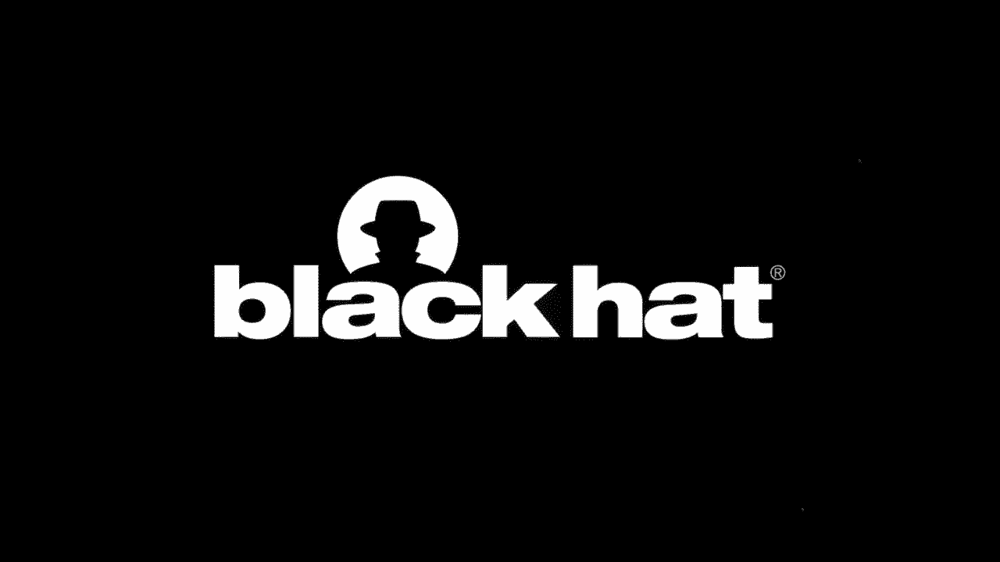

 access to a good manipulation。 So a little bit about me， so I'm a security researcher at Elastic。

 I used to be part of Endgame before it was acquired and I used to be a pen tester at。

 a UK consultancy， MWR， where I primarily did red teaming， purple teaming style assessments。

 My research interests are generally everything and anything to do with low level windows。

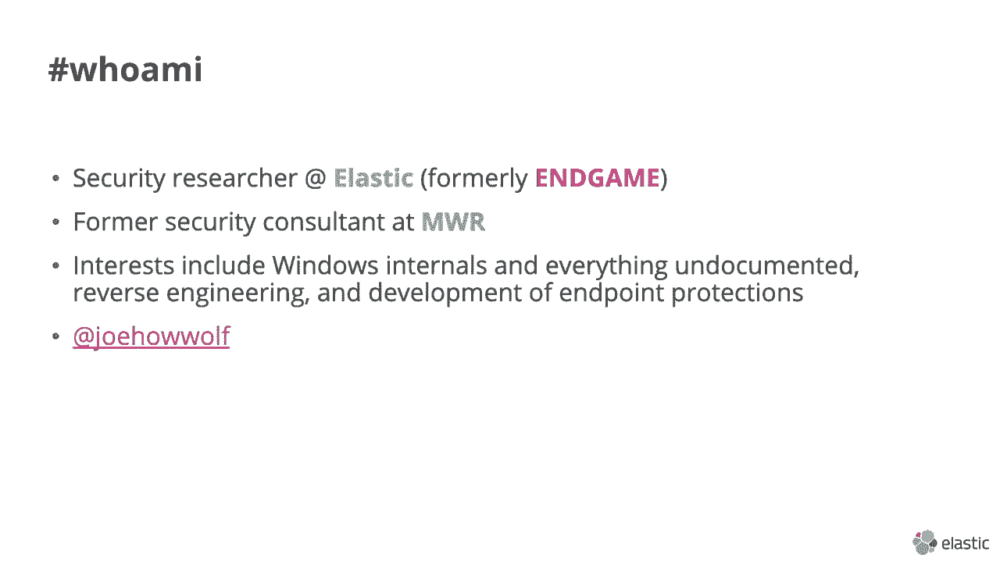

 and tunnels。

 My objectives for today are threefold。 Firstly， I want to help defense practitioners understand how access tokens work in windows。

 environments and access tokens are intimately related to a number of other key concepts。

 in windows security。 And in my opinion， if you ignore those relationships。

 then you only get a surface level understanding。 So my definition of access tokens and access token manipulation is perhaps far broader than。

 you might be expecting or perhaps used to。 The second objective is to show how attackers abuse legitimate windows functionality to。

 basically compromise entire domains。 And in my experience。

 this is often as simple as finding some credentials and then abusing。

 existing windows trust relationships。 And then lastly。

 by showing the art of the possible in both offense and defense， I hopefully。

 help defense practitioners understand their own ability to detect and respond to these。

 types of attacks， understand how their technology such as EDRs can detect this type of behavior。

 and then use this as a springboard for future surrounding。 My agenda today is threefold。 So firstly。

 just going to cover some window security internals。

 So this is going to focus on log on sessions and access tokens and then a brief recap of。

 network authentication。 The second part is going to cover three kind of techniques about how attackers can abuse。

 access tokens。 This is going to focus on the net only flag and pass the ticket attacks and over pass。

 the hash。 And then the last part is going to be how we can start to detect these types of attacks。

 Now my research when I started out was essentially looking to develop user land hooks for these。

 types of attacks。 So my focus really was on hooking and the proof of concept I'm going to show will be。

 predominantly hook based but I will show other sort of native sources of telemetry along。

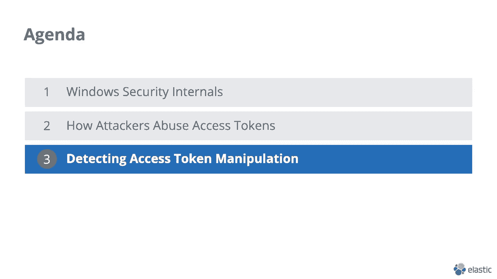

 the way。 So the first part I'm going to cover is some window security internals。

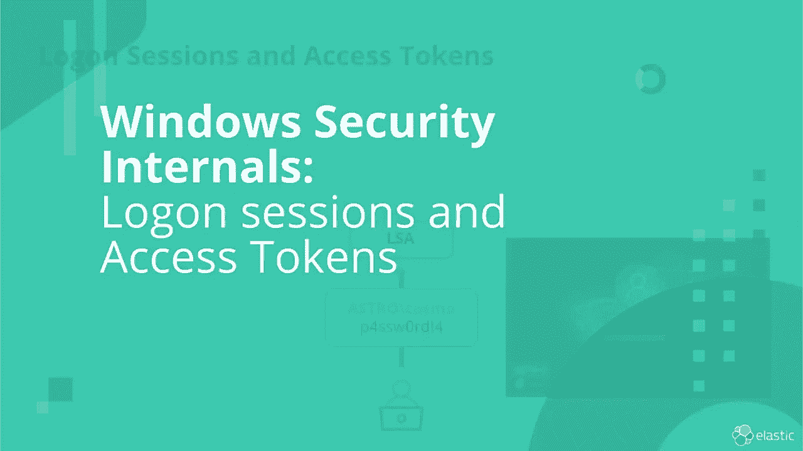

 And one of the key things to understand is the relationship between log on sessions and。

 access tokens。 And the best way to demonstrate this is what is to show what actually happens when you log。

 on。 So in this demo， sorry in this example we have the user Cosmo who's logging on and when。

 they enter their password basically the local security authority or the LSA in a domain。

 environment will typically forward this to the domain controller who will then actually。

 authenticate the user。 Following successful authentication， the LSA produces two key artifacts。

 So a log on session and an access token。 And the key thing is that a log on session is what it says it is it indicates the presence。

 of a user on a machine。 So it starts when their success will be authenticated and then ends when they log off。

 There are two really key points about this relationship that I just want to highlight。

 So firstly access tokens are always linked to an originating log on session and you can。

 see that via the orth ID parameter here。 And so a log on session can have thousands and hundreds of access tokens associated with。

 it but access tokens only ever can be associated with one originating log on session。

 And so secondly access tokens act as a proxy or an extension of the log on session。

 So you as a developer you only ever interact with access tokens you never touch log on， sessions。

 And as a result access tokens act as a volatile repository for the security sessions associated。

 with that log on session and hence they determine the security context of the user。

 And by security context I just mean the information cached in the token so group memberships。

 privileges， etc。 So if we continue with that example once the LSA has a token it will typically spawn the。

 user's shell which is normally explorer and it will attach this token to it。

 And so every process has to have a token attached to it and this is typically referred。

 to as the primary access token。 And then subsequently any other process is spawned by the shell they inherit the security。

 context of the parent and then they get their own local copy of this token。

 And the key thing here is that the token again acts as this volatile repository so a process。

 can change its own settings without affecting other processes。

 And so Chrome for example can create a restricted access token to effectively sandbox itself。

 from memory corruption style exploits so that if an attacker is successful then the damage。

 is restricted and it can do this by removing dangerous groups or privileges etc。

 And the reason why this is so important is that the access tokens are the fundamental。

 component of Windows security。 So whenever a process or a thread attempts to access some secureable object managed by。

 the kernel whether it's a file process or thread windows will do an access check and。

 it needs three things to do this。 It needs the authorization attributes in the token which in this case will be a restricted。

 access token。 It needs the intentions upfront because in Windows the access check for performance is。

 only done the first time and you need to state exactly what you plan to do with the object。

 And the third thing is a security descriptor so this is contained within the object and。

 it basically has an access control list that says who and who is not able to access it。

 and then based on these windows will make a decision。

 And this is why the ability to control the security settings in access tokens is so important。

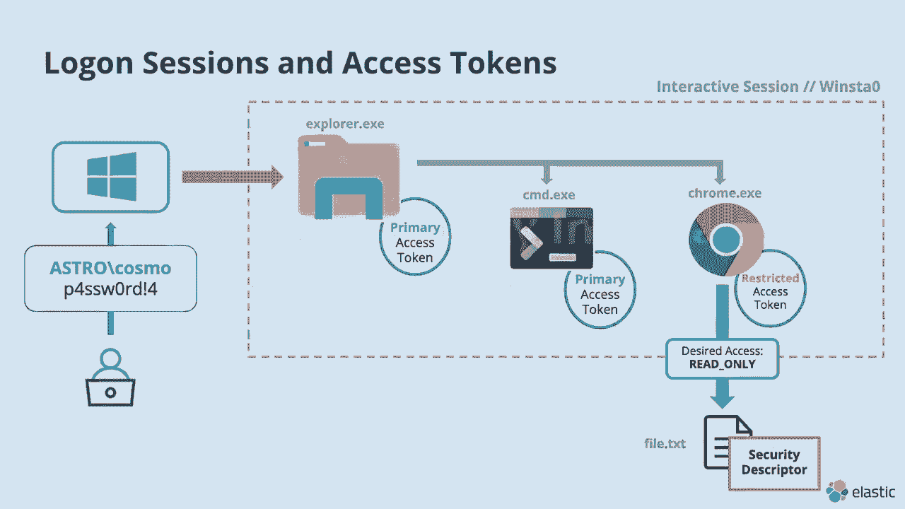

 So the next time to briefly cover is network authentication。

 So this is a kind of classic scenario in a domain where you as a user you want to access。

 some resources across the domain to a file share or something。

 And so in this I'm just viewing the network shares of the domain controller。

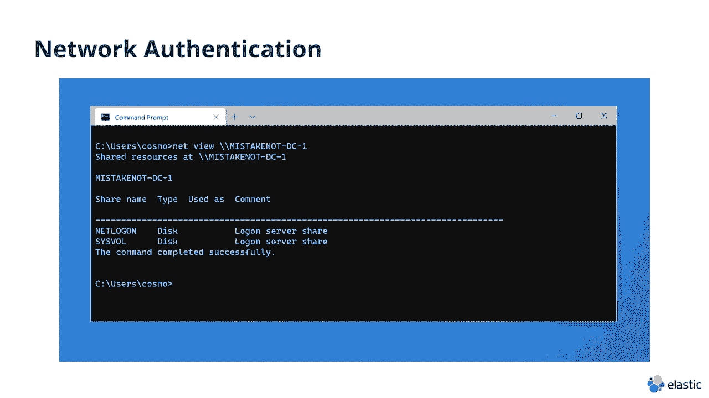

 But how does this actually work under the hood？ And now the key thing here is that the access token and the logon session are unique to the。

 client machine on the left。 And so the client can't send its token over the wire or something like that because the。

 server still can't verify who just because you say you're that user doesn't know and。

 it doesn't correspond to a meaningful logon session so it's basically worthless。

 So effectively you need to re-authenticate to the server。

 Now for interactive logons and in fact every type of logon apart from network windows will。

 automatically cache your credentials。 Now it doesn't matter if it's a Kerberos ticket and NTLM hash when you try and access a resource。

 windows will automatically try and authenticate on your behalf for you。

 And this is the intended design of Windows single sign up and is also the reason for lots。

 of say NTLM relay style attacks。 From the server perspective it's again produced with two key artifacts it gets a logon session。

 and a token。 There's a few key differences here though。

 Note that this is a network logon session it means it represents a remote client and secondly。

 that there are no credentials backed up by this。 And this is typically what's known as the double hot problem so you can't off off that。

 box to someone else because there's no credentials there。

 Now I mentioned before that every processor has a primary access token and so when the。

 server is presented with this token what does it do with it and this leads nicely to the。

 Windows concept of impersonation。 And so typically in say a multi threaded application multiple threads may try and adjust that volatile。

 repository of security settings at the same time which could lead to sort of weird bugs。

 and race conditions。 And to solve this Windows has a feature called impersonation which basically allows a thread。

 its own local copy of an access token which can then modify as it sees fit。

 And this is known as impersonation and the key thing here is this is an impersonation。

 token it's a place apply to a thread and so it allows the thread to slip into a different。

 security context。 And this is exactly what the server does so in recap then we have the user reauthenticated。

 over the network they have a new network logon session produced and the servers given an。

 impersonation token which links back to that originating network logon。

 The server then uses this token to perform work on behalf of the client and so all access。

 checks they'll use that threads token which is that remote user and this is how Windows。

 can force access control in client server applications。

 And as a note just for most of Windows key communication protocols this is handed automatically。

 the server just calls the API， RPC， impersonate client and it automatically starts slipping。

 into that security context of that remote user。

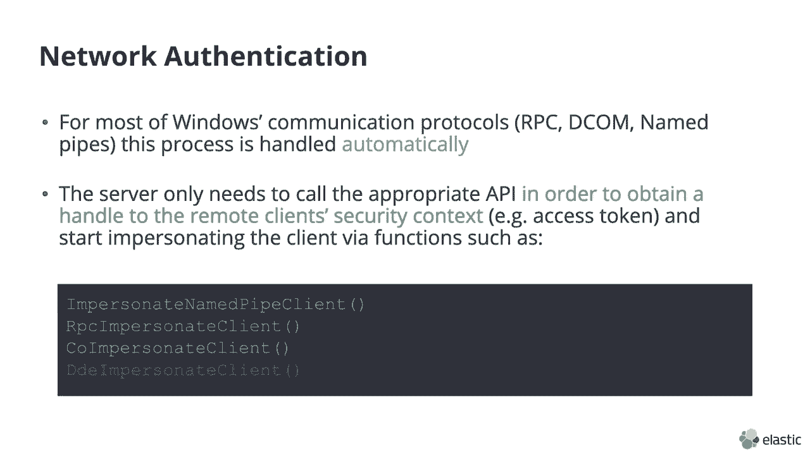

 So the second part of this presentation is going to start to focus on how attackers can。

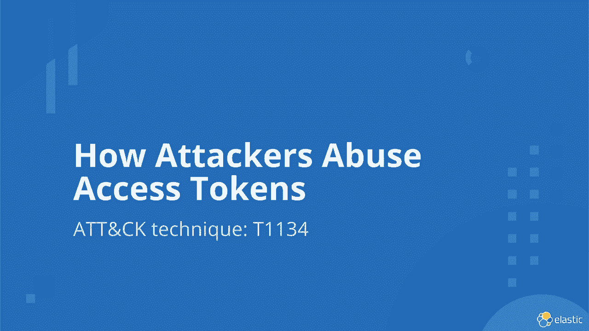

 actually start to abuse access tokens。 Now I want you to consider the following scenario which is very typical which is an attacker's。

 fish to user and they've got a shell or a foot holding a corporate network。

 A key thing here is it doesn't matter what payload the attacker used or whatever they're。

 running in a process which is in the security context of that user and in this case that。

 user has no privileges across the domain so any attempts will use their cache credentials。

 and will fail。 So the attackers got to move quickly but what can they do？

 And so they effectively have three options here and the first one is they can steal the。

 token of an already logged on privilege user and again because they want to move laterally。

 they need creds cached so a non network log on。 And this they can then with this token they can then impersonate or spawn a process whatever。

 but they can then move laterally using those cache credentials。 If they can't fight credentials。

 sorry if a user already isn't logged in then they need。

 to find credentials and if they do then they can create a new log on session with these。

 stolen credentials and then impersonate the returns token or spawn a process with it。

 And then their last option is again they still need stolen credentials but they can just change。

 the cache credentials associated with their current logged on user to these stolen credentials。

 and so this could be legitimately through an API or illegitimately say by directly modifying。

 LSAS memory。 And the examples we're going to cover are largely focused on 2 and 3。

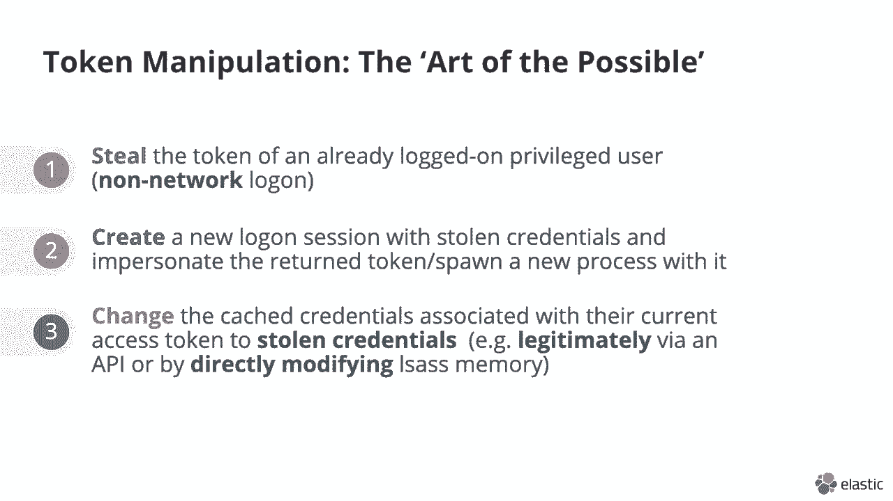

 And so the first cases is sort of legitimately used by this net only flag and the subtitle。

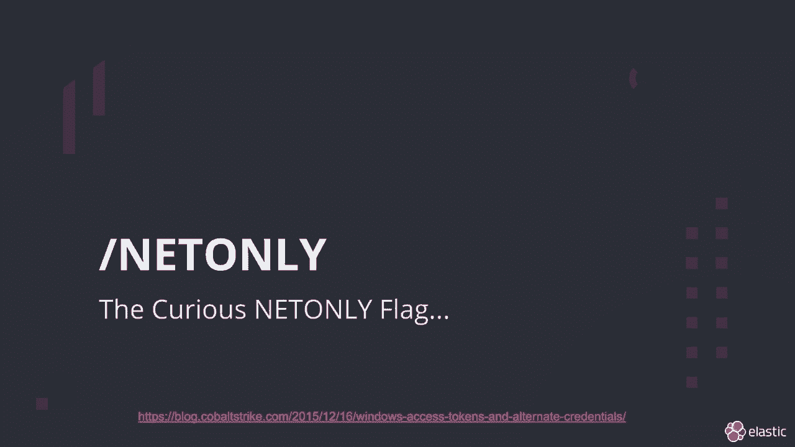

 here is from a really excellent blog by Raphael Mudge。

 And so stay in attack if they find creds where they can use the log on user API to basically。

 create a new log on session and get a token in return。 And so they can specify a username， domain。

 password and a log on type。 And the log on type basically is what you specify for the log on type depends what kind。

 of token you get back。 In this case we want creds associated with it so we're going to say an interactive log。

 on。 In the case of an interactive log on we get a primary token back so if we want to impersonate。

 that on a thread then we need to convert it to an impersonation token and so we can use。

 duplicate token next to do this and we just apply a token type of token impersonate。

 And then lastly having gotten impersonation token we can use set thread token or impersonate。

 logged on user and this will make the thread slip into that security context of that logged。

 on user。 And note that both of these are wrappers around NT7 information thread which will be important。

 later。 Now say an attack of fines， valid credentials they try and log the user but it access is。

 denied。 And this could be a legitimate reason， you know the account is valid but that user can't。

 log on to that particular machine。 What can they do？

 Now things get very interesting if you supply this log on new credentials flag and what this。

 does is it clones your current access token but it changes the credentials cached with， it。

 And so when you try and then access the network resource it will authenticate with the stolen。

 credentials and so you'll get a session that I'll host as with the user who belongs to。

 those stolen credentials。

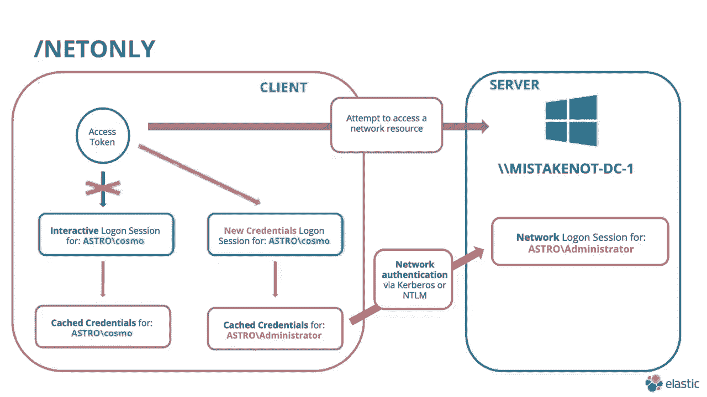

 And you can do the same thing with create processes log on W it's got a log on flag of。

 net credentials only。 These flags are equivalent all they mean is that these credentials are only to be used。

 on the network。 And this is basically what the run as tool the system to。

 oh no sorry the native windows， tool run as does with the net only flag it allows you to specify credentials only to。

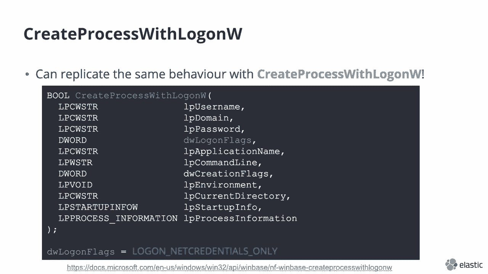

 be used in the network。 And so I have a quick demo。

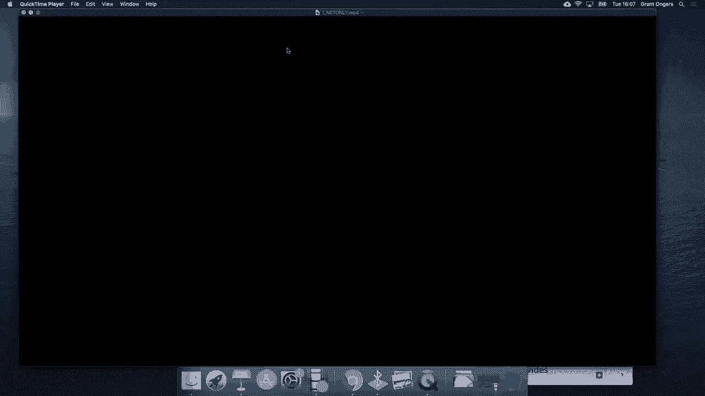

 And so we can see here that I am running as the user Cosmo。

 And then I'm just going to try and enumerate the C dollar or the admin share on the domain。

 controller and I'm rightly denied because I'm just a standard user。

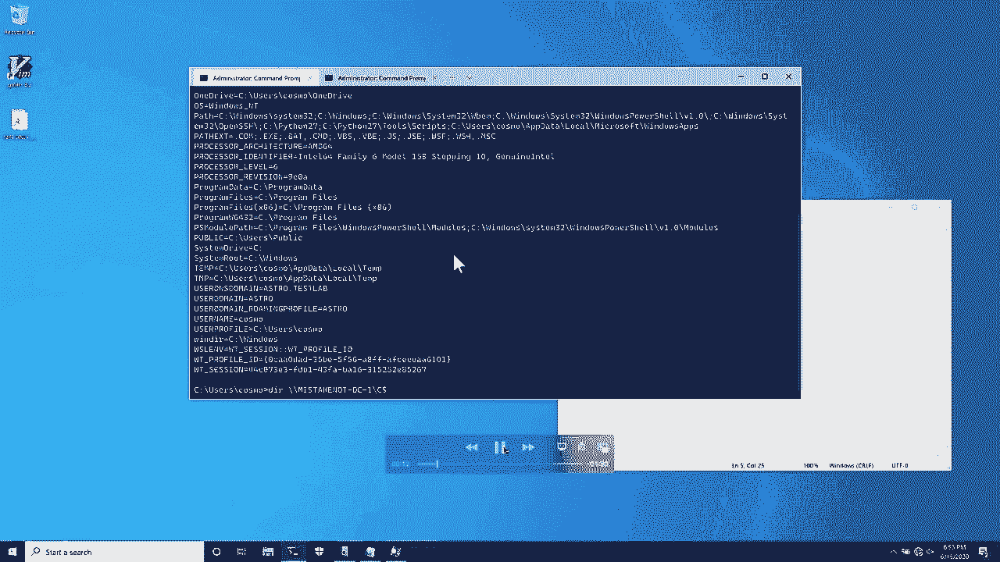

 There's no reason why I should be able to do this。

 This is contrived but I've just got on the domain controller here now I'm just dumping。

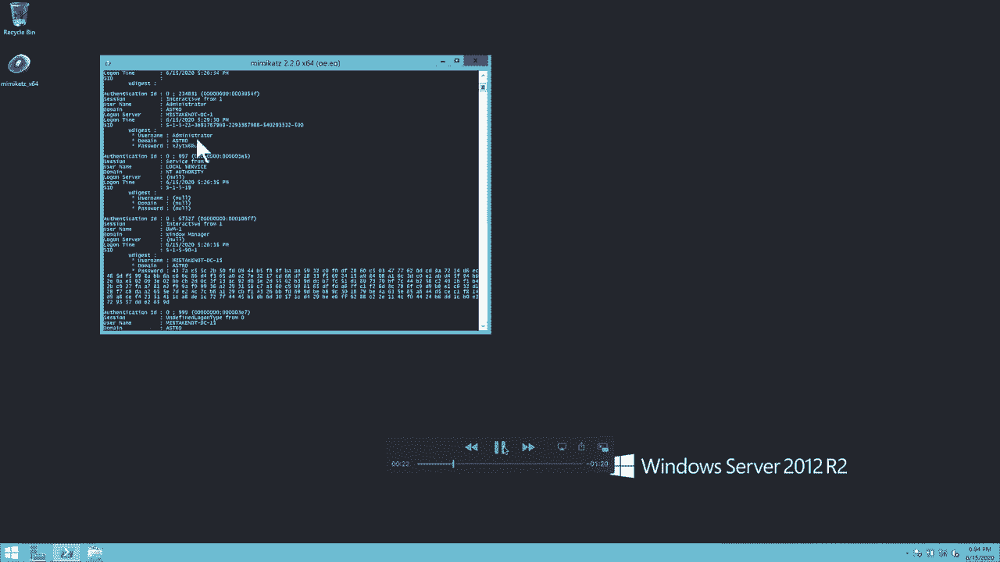

 creds and I can find the clear text domain admin password。

 I then can use run as with that magic in the only flag and use those credentials to spawn。

 a new process。 I remember this clones the current access token but changes the cash credentials。

 Just to note that this creates a new log on session so we can see， we can see it there。

 the 4917E0 and then we can use the system turnals tools to enumerate them so we can see this。

 new credentials log on type。

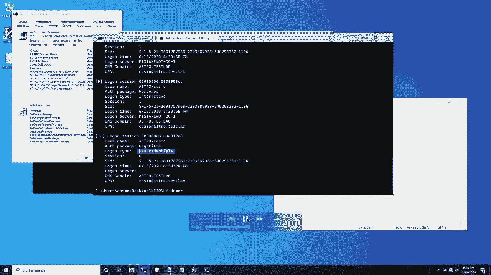

 And similarly you also get an event 4624 in the windows event log again log on type 9。

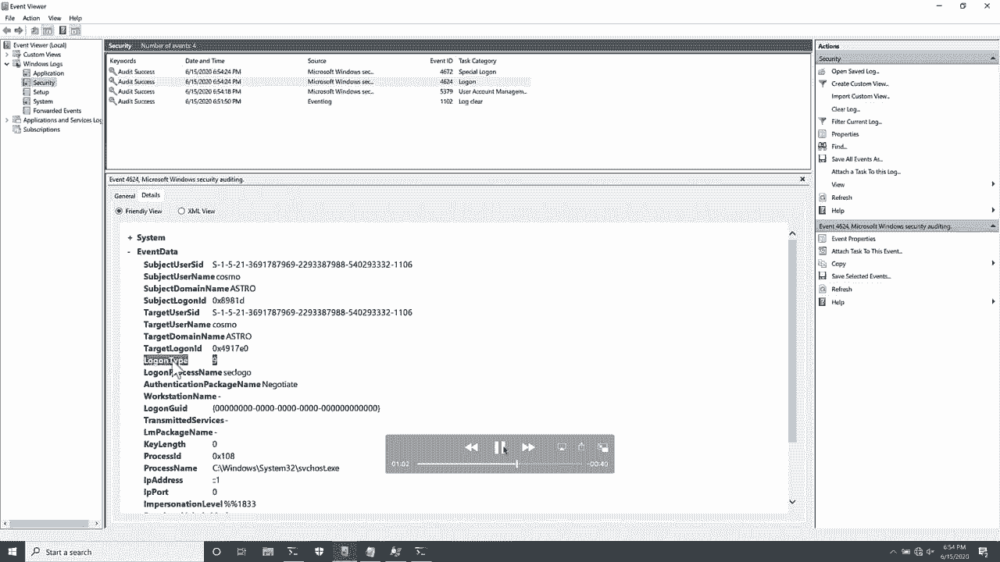

 and you can see the target outbound username。 Now if I just born a new command prompt again I'm going to run who am I and this would just。

 show them the same user。 Also note that the credentials are not validated when you enter them。

 They're only validated when you try and remotely authenticate to a host。

 And so now I'm going to enumerate the C$ share and I'm an admin。

 And I can simply just enter a new PS session just to confirm the same thing。

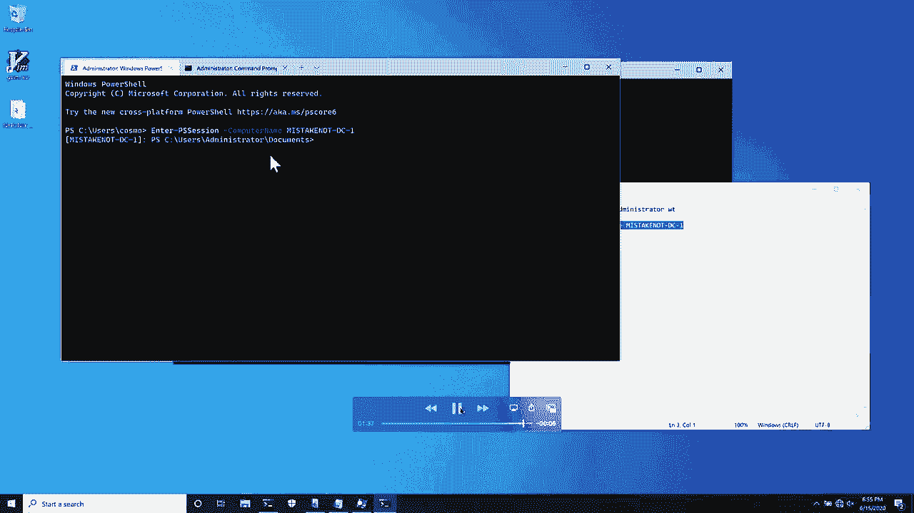

 If I run who am I here I'm the administrator。 And you can apply very similar behavior with Kerberos and this is typically you know it's。

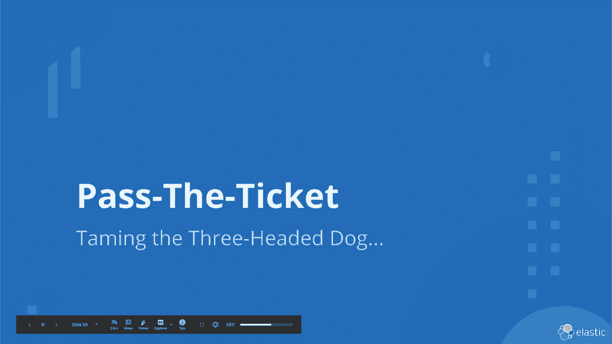

 past the ticket attacks and this is the second attack we're going to look at。

 As a brief recap of Kerberos so when you enter your password what the Kerberos provider。

 will do is it will hash the， it will take the insulin hash of your password and link。

 from crypt to timestamp and send it to the domain controller。

 The domain controller once it verifies your identity will send you back a ticket granting。

 ticket or TGT。 Then whenever you want to access another resource across the domain you give this to the domain。

 trons that are on access this file share and it will give you a ticket granting service。

 ticket which you can then provide to that file server and you can start accessing stuff。

 And what past the ticket does is it allows you to just basically arbitrarily change the。

 credentials associated with your log on session。 But you can just apply a TGT for a domain admin and then any and then you can access the domain。

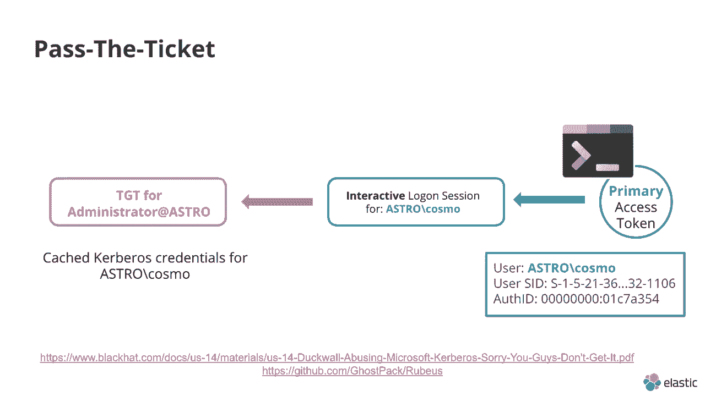

 as that user。 The magic is mainly done by this LSA call authentication package function which basically。

 makes an RPC call to the Kerberos provider。 And you basically pass a massive buffer of data of the protocol message you want to send。

 to the Kerberos provider and you just give， you just pass a pointer to this buffer。

 In the case of a pass the ticket attack it's a Kerberos submit ticket message and so effectively。

 you have this structuring memory followed by a massive blob of a ASN encoded Kerberos ticket。

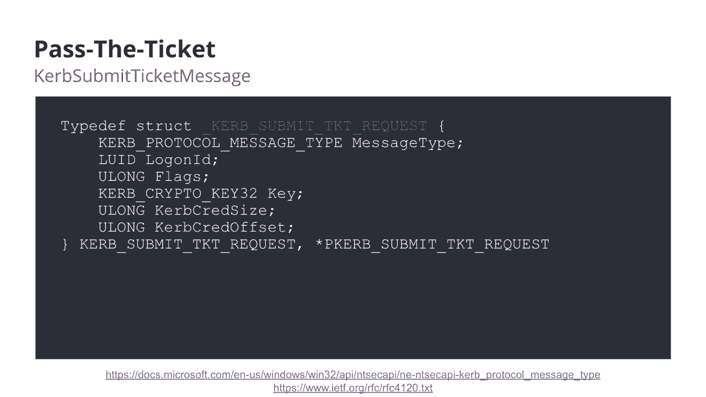

 that you want to apply to your session。 And so I have a quick demo of this as well that can show。

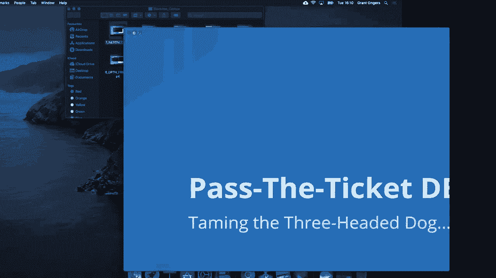

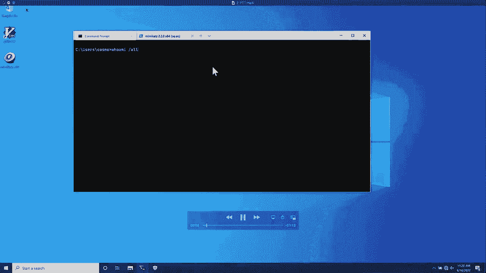

 So once again I'm the user Cosmo and I'm medium integrity so I'm not elevated when。

 performing this attack。 Likewise I have an existing TGT for the user Cosmo。

 Once again I can try and access the admin share of the domain controller and I will rightly。

 be rejected。 Access denied。 I can then again switch to the domain controller and I'm going to export all the Kerberos tickets。

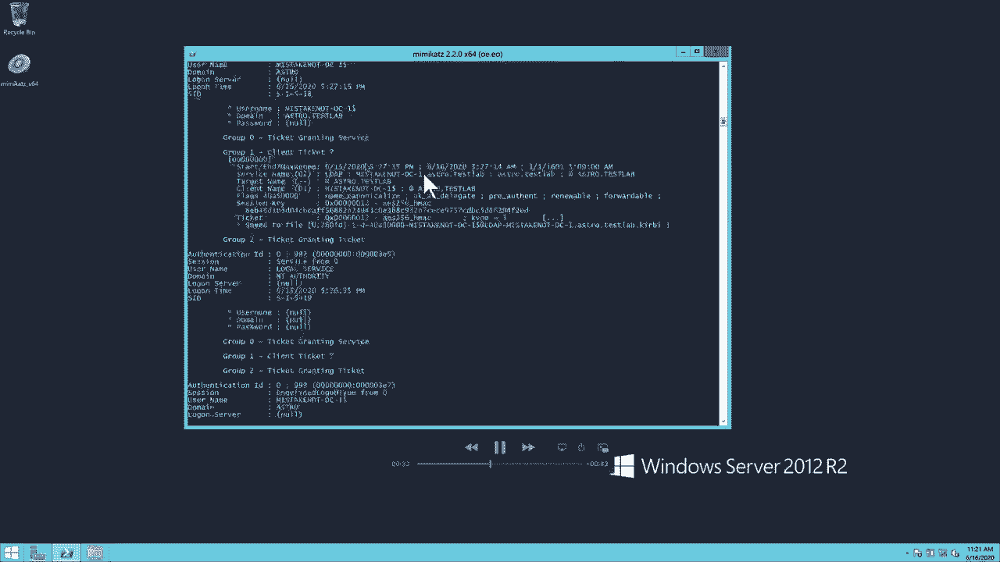

 I can find in memory and then I'm going to copy over a TGT for that admin user。

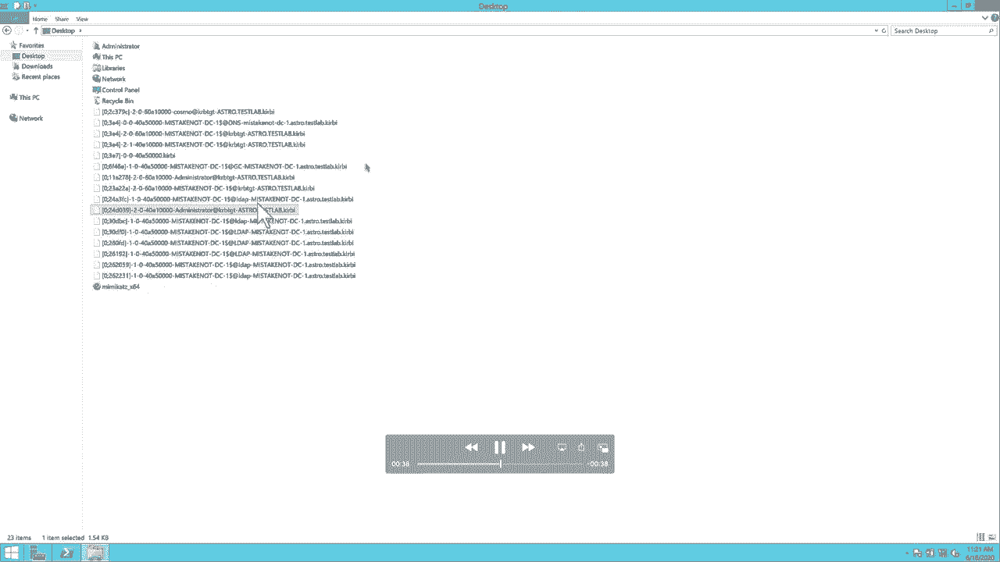

 I can then use the Kerberos PTT commands to pass the ticket and it will load this up。

 from disk and basically submit that as part of that buffer to the function。

 And now we can see that I do have a TGT for the administrator user in my Kerberos cache。

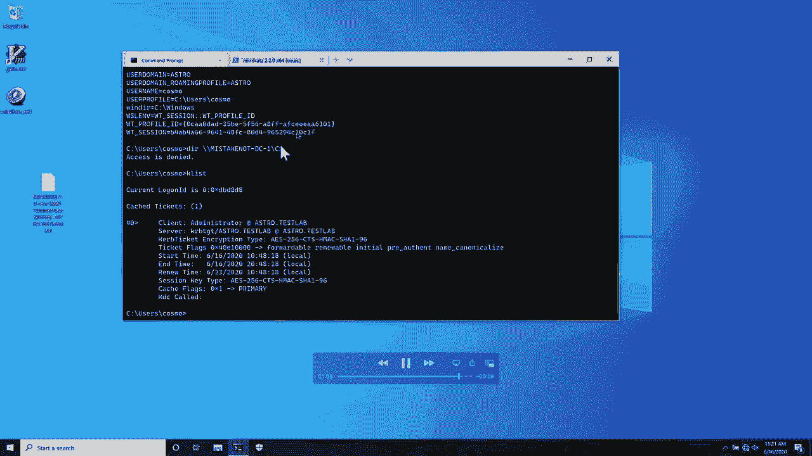

 So if I try once again to access that C$ share I can access it now because I have that domain。

 admin ticket。 A couple of things to know。 So as I showed there we were medium integrity so you don't need privileges to change your。

 TGT associated with your session but obtaining a TGT in the first place is a different matter。

 You don't need to create additional log on sessions but bear in mind when you apply a。

 new TGT or blitz the old one the way to get round this is that net only gadget that we， saw before。

 So you create a dummy new credential session and then you can apply the TGT to that session。

 while preserving your own。 Also note that through this API you can do a lot more than just pass the ticket you can。

 basically dump credentials as in a high integrity context and the key thing here is that this。

 doesn't involve opening a handle to LSS which is what a lot of credit theft is traditionally。

 based on。 And so be aware that this is quite a big gap actually in any credential theft logic based。

 on that kind of traditional access to LSS so say system on process access。

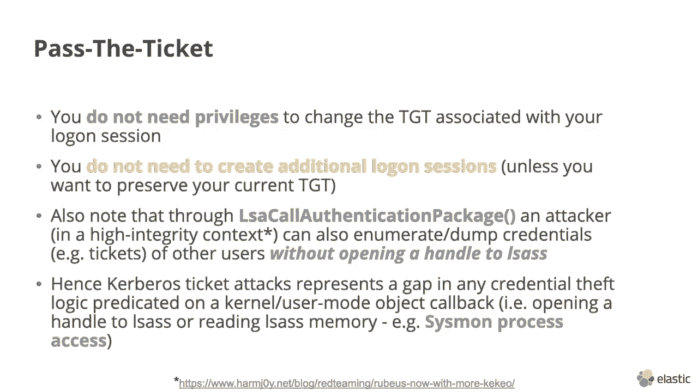

 And the last example I'm just going to run through pretty quickly is over pass the hash。

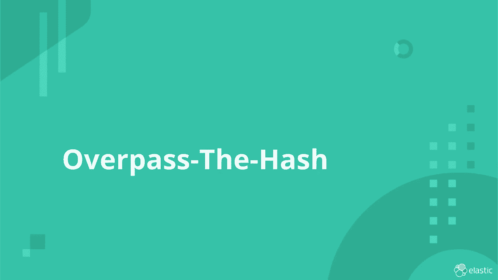

 So for typical pass the hash attacks what happens is you'll get a tool like Mimicats。

 which will basically pass LSS memory it will numerate the log on sessions and basically。

 it will find the NTLM cache credentials and it will basically just directly overwrite。

 them in memory。 Screen's gone off。 Oh no it's back sorry。

 And then when you try to then access a network resource it will just supply these overwritten。

 credentials and so again you'll get a log on session as as the stolen credentials。

 The screen's flickering。 Oops sorry for one second。

 So for over pass the hash effectively what you're doing is you're translating an NTLM。

 hash for a user into a fully fledged TGT for that user。

 And so you're doing a similar thing but this time you're sort of injecting it into the。

 Kerberos provider。 So you enumerate the log on sessions you find the appropriate place and you patch in that。

 new hash。 But the key thing this is again this is sitting in memory but then once you try and actually。

 access some remote resource it will kick off the normal Kerberos authentication protocol。

 So you're basically don't go too much into this but you'll get a TGT for that user whose。

 credentials you have access to and then you can access the domain as that user。

 A couple of notes about sort of quirks of how say Mimicats does this so again firstly。

 it creates this kind of sacrificial net only process and this is to preserve your TGT as。

 I mentioned but this does generate a new log on session。

 It will then acquire debug privilege or impersonate a system token in order to be able to get。

 a right handle to LSAS and then as I said it will pass LSAS memory find the appropriate。

 log on session and then just patch in that new hash and then once again the normal Kerberos。

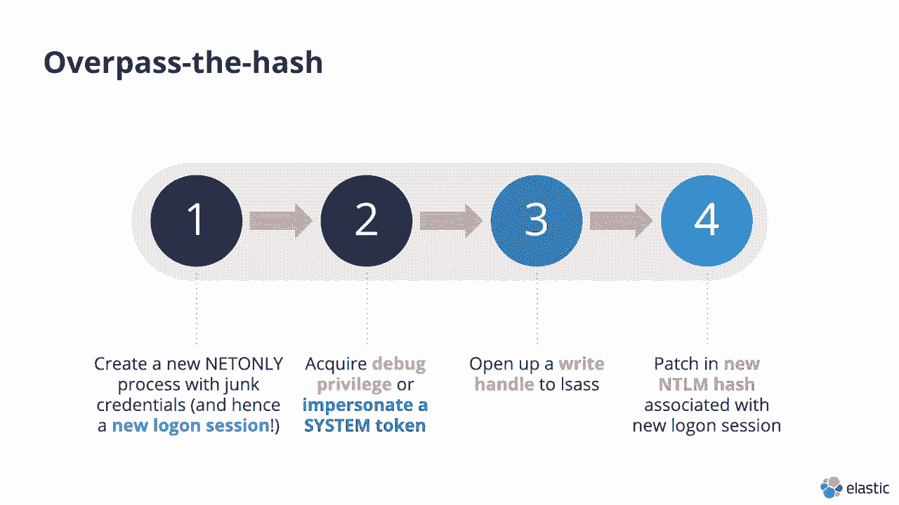

 authentication process kicks off and you have a TGT for that user。

 I don't have a demo for this for time but I'll be showing one shortly from the defensive。

 perspective。 So the final part of this presentation is going to look at how we can start to detect。

 these techniques。 And as I mentioned the start of my presentation my research focus was really developing user。

 land hooks。 So a lot of the proof of concepts I'm going to show shortly use freedom which is the binary。

 instrumentation framework essentially but I will show native windows telemetry where， appropriate。

 And the really awesome thing about freedom is it allows us to write sort of custom and。

 scriptable detection logic on the fly so we can because it's a hooking framework we。

 can analyze arguments pre and post function call and make decisions based on you know。

 parameters pass the functions or the or what's returned to a function。

 And so this can be very powerful for prototyping effectively detection logic very quickly。

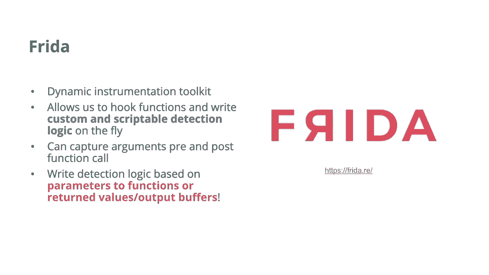

 This is an example of a very basic freedom JavaScript template。

 We use find export by name to resolve the function of interest and this returns a freedom。

 native pointer and then we use the intercept to attach to start hooking and the on enter。

 and on leave call back functions this is where the main guts of a sort of detection logic。

 will reside and here we can start looking at arguments and implementing our logic。

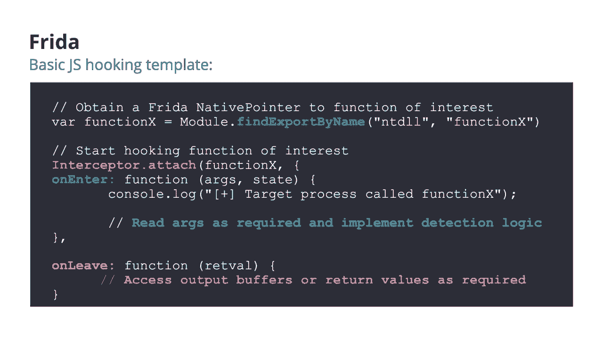

 And so I started showing this kind of net only technique and the two key signals for this。

 was create processes log on with that effectively the net only flag and the effectively the。

 make token gadget which allowed you to craft arbitrary tokens which was a combination of。

 log on user with a net only flag and then you impersonate the return token。

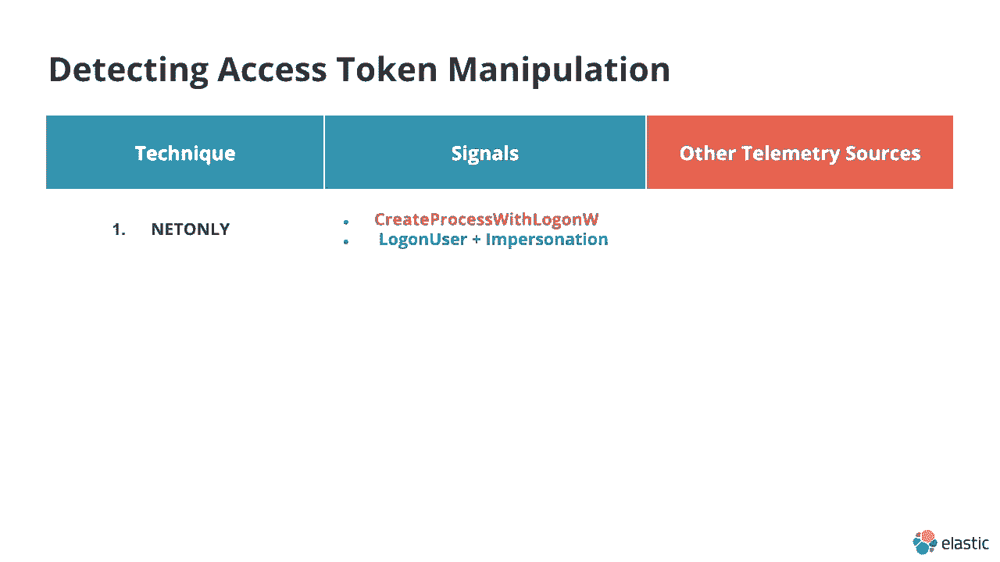

 So I've got a few demos with freedom just showing these now。

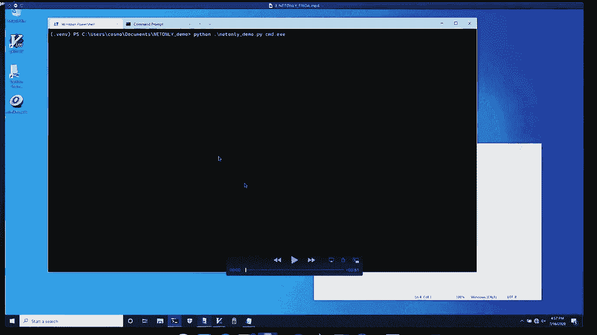

 So this is an exact run through of the previous attack but I can show you my freedom hook here。

 we can see I'm resolving create process log on by export by name and then using intercept。

 to attach to start hooking it and so now I'm attaching freedom to command xc and I can。

 run through the same steps。 So I use runners with that net only flag and then supply the administrators credentials。

 Once again because it's cloned my access token I'm the same user locally for any access checks。

 but remotely it will supply the new cache credentials and I'm a domain admin on the network。

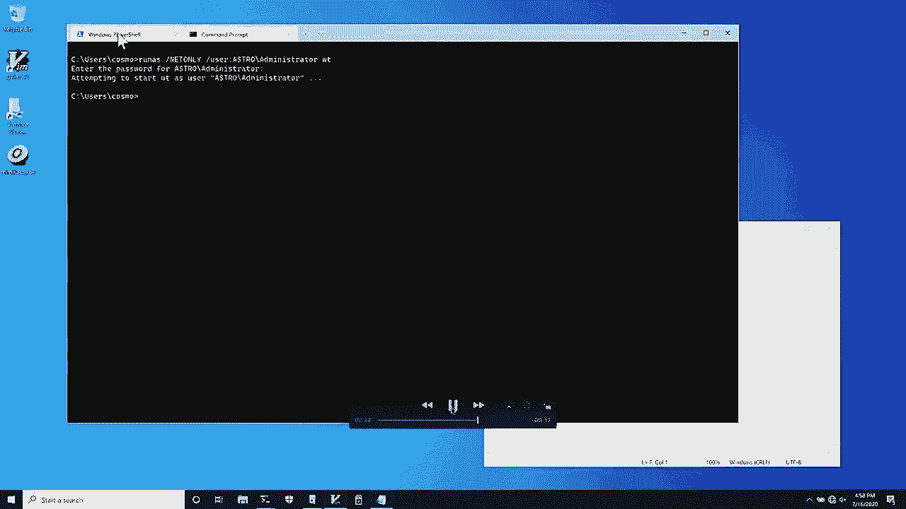

 So if we look at my freedom hook now we can see it spawned a new process and we can see。

 that process is called create process with log on w and critically we can see we can pull。

 out the username password etc but we can see that it's submitted log on flags of net credentials。

 only which is potentially a suspicious event that we want to alert on and in this case just。

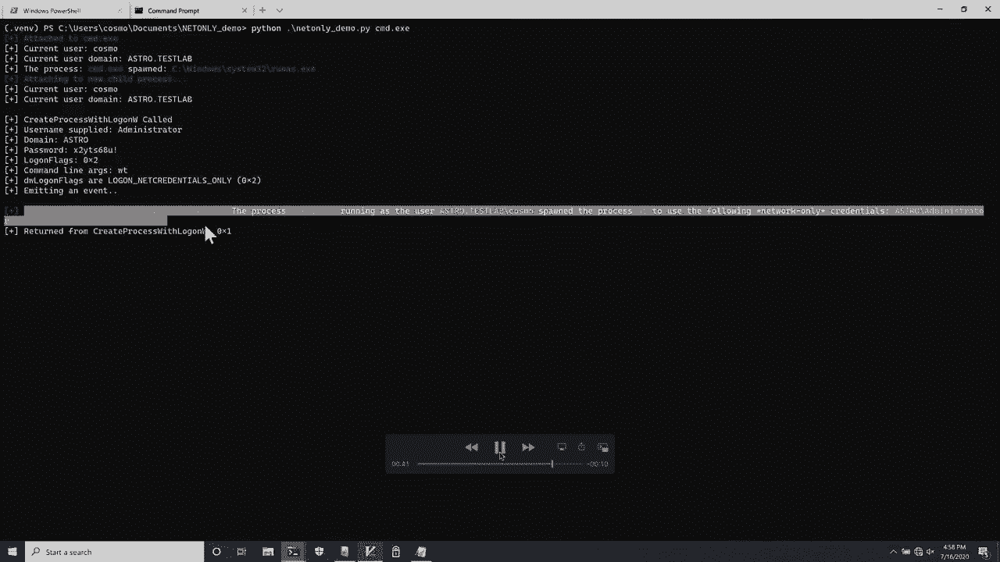

 as for this proof of concept I've added an entry to the event log saying we've seen a。

 suspicious net only log on session。

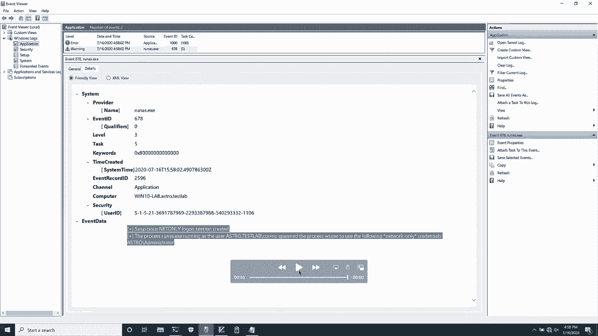

 For the second example we're looking for that make token gadget and so here I've used a。

 covenant which is a open source c2 framework I've used a PowerShell stage and we've got。

 a shell basically and so I'm going to attach my free description to this PowerShell process。

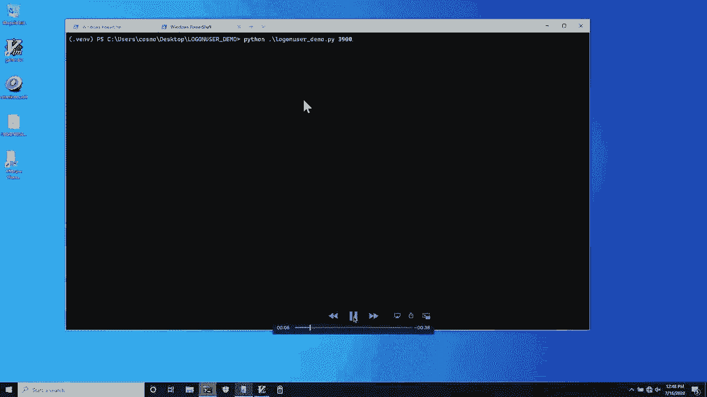

 Now if I switch to my attacker machine I'm going to run the make token task and this。

 will do exactly what I said it will log on a user with the log on type of new credentials。

 so that suspicious net only flag and then start impersonating that user so we can run that。

 task and we can see that it's successfully impersonated it。

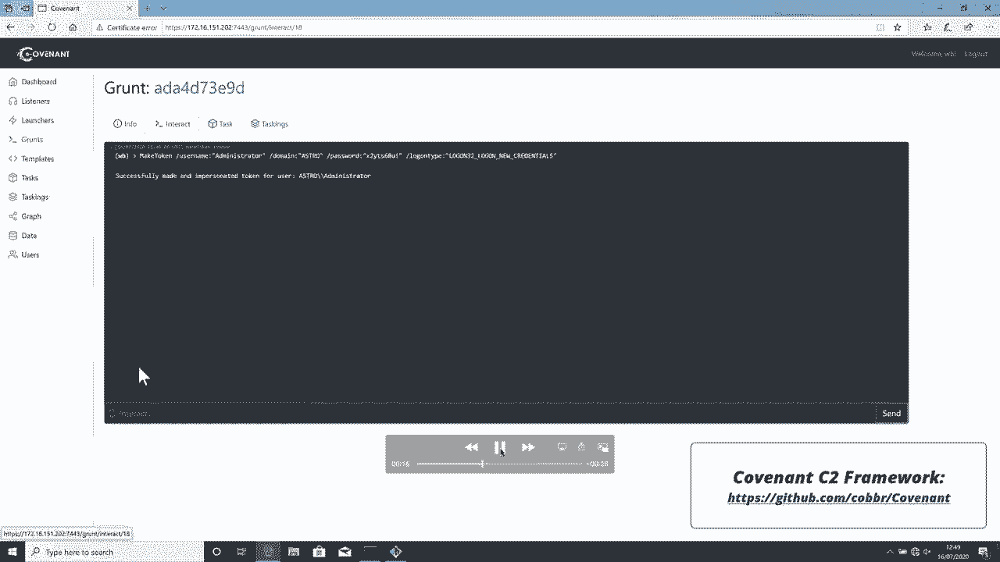

 So in terms of a free to hook how do we detect this well again we want to monitor for someone。

 log you want to use it and then subsequently using that token in a call to say impersonate。

 logged and user so in this case I've actually hooked log on user xxw which is what log on。

 user a and w both end up calling and we can see that again new credentials flag has been。

 passed and then if we track that return token we can see that that was then passed to this。

 impersonate logged on user call which is suspicious that's the kind of behavior we want。

 to learn so once again we can admit an event and I've just written a new entry to the event。

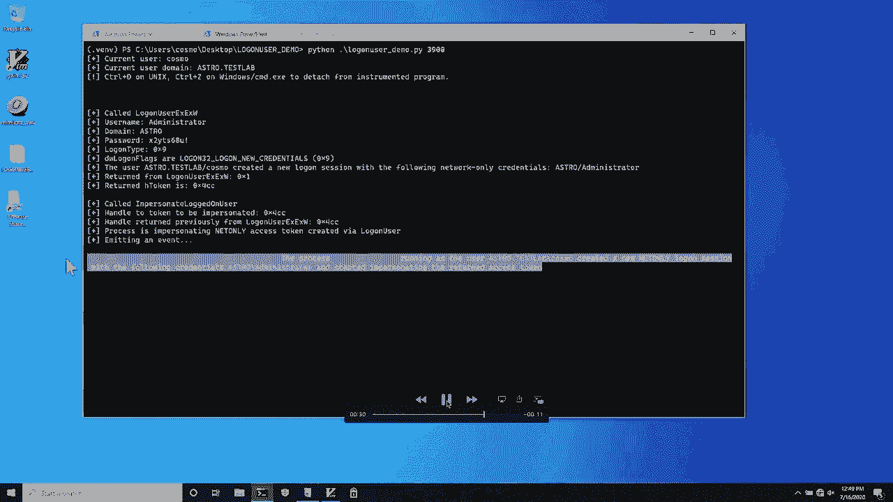

 log showing that this potential make token behavior has been detected。

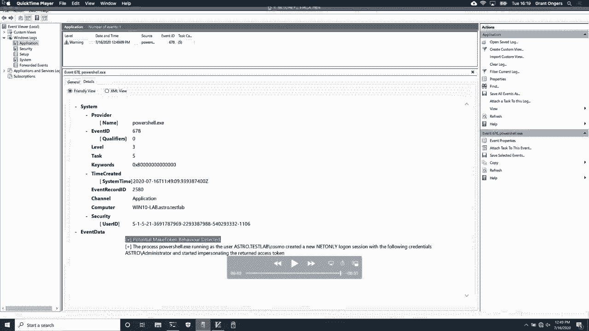

 In terms of other telemetry sources so for those net only log ons we can use the windows。

 event logs and then for any process spawning signal we can use process events。

 So impersonation as far as I can see has no native way to track and is also exceptionally。

 noisy unless you're looking for targeted things。 I showed this before so event logs 4624 log ons you want log on type 9 and then the log。

 on process name is set below so it's the secondary log on service and notice you can。

 see the differing user name and then target outbound name。

 In terms of process data you might want to look for users so this is high or medium integrity。

 spawning processes as the same user but a different auth ID hence it's a new log on session so。

 it's a net only gadget and you might also want to ignore things common admin tools like。

 run it and also note that because it goes to the secondary log on service I don't think。

 you can spoof the PDF as far as I know for create process with log on。

 I haven't had too much time to go on this today but you could also say it's a bit further。

 and look for processes spawning processes other users full stop and again look for high and。

 medium integrity user processes and this caters for that case of someone stealing a。

 token and then spawning a new process with it and then again you might want to look for。

 you might want to ignore standard admin tools in doing this。

 So the second technique we looked at was pass the ticket and the real indicator here。

 was that LSA call authentication package with the curbs submit ticket requests and so I've。

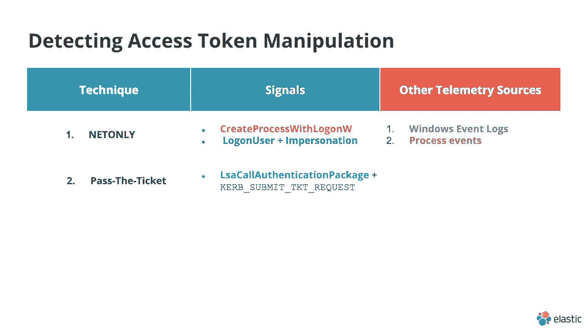

 got a demo for this as well。 So once again we can see I'm cosmo I've got a TGT because I also actually have a few TGS's。

 when I was accessing file shares and I can try and access the main controller and I'm。

 rightly denied again。 I'm then going to attach Frieda to Mimi cat and then I'm going to apply the same ticket。

 as before via the PTT command and now what we can see is in my Frieda hooks I've hooked。

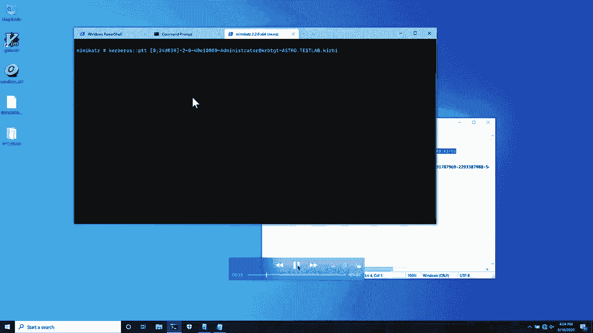

 LSA call authentication package and we can monitor for the type of message that we want。

 to find which in this case curbs submit ticket requests。

 That data buffer there is that big buffer I mentioned that's passed to the function call。

 and then I can use the impact it Python libraries to parse that Kerberos ticket out of memory。

 and see what ticket is being applied and in this case the user is applying a ticket to。

 somewhat a different user not logged on and this is evidently pretty suspicious so again。

 we can say potential pass the ticket attack detected and we can add something to the event。

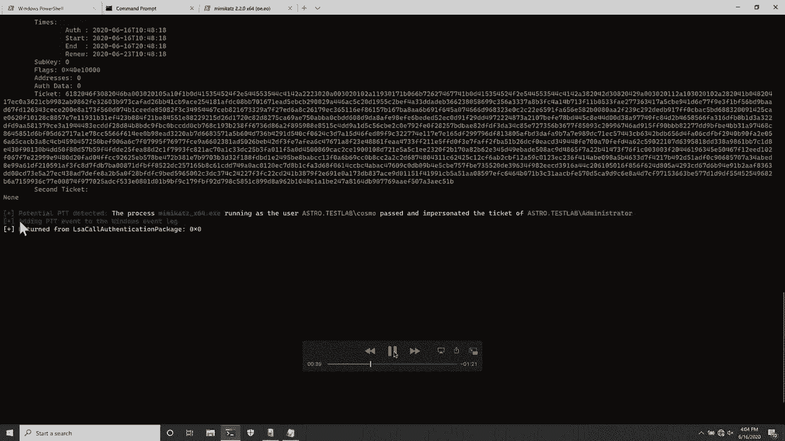

 log as so I'll just skip this long a bit as a quick example as well I don't know too much。

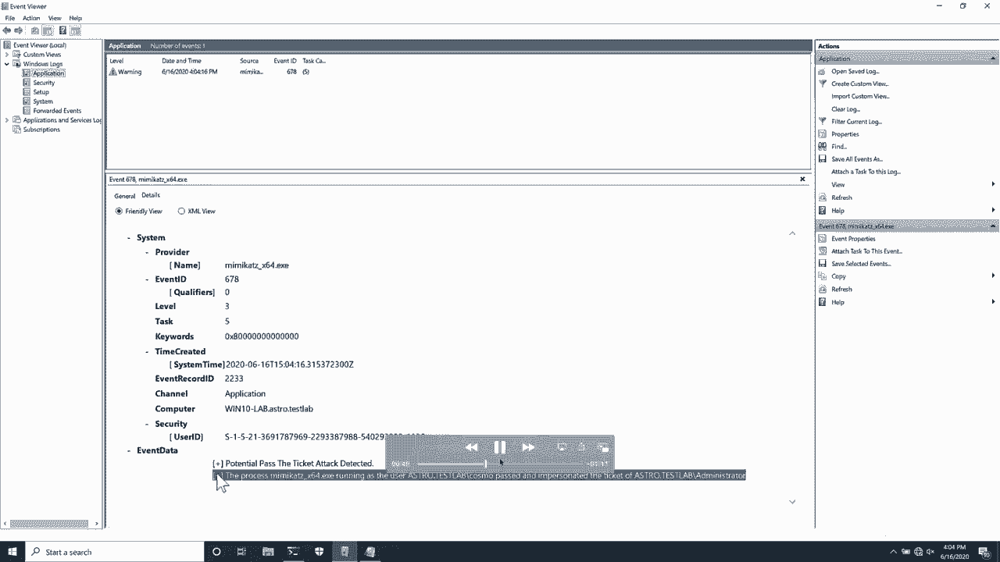

 into how the guts this works but that's sorry just confirming I could access it。

 I'm now going to purge the cache and then I'm going to actually use the Mimi cats LSA dump。

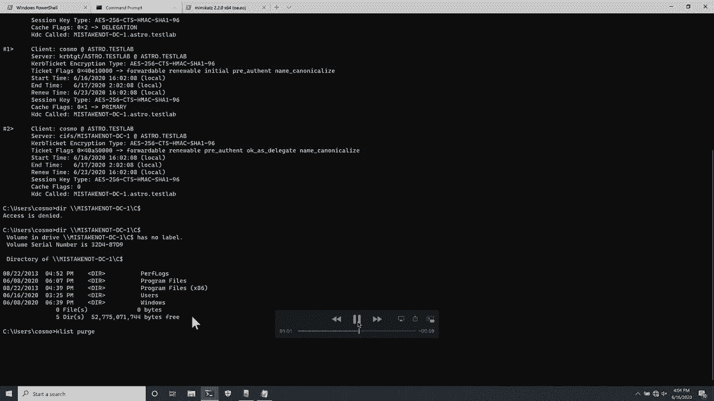

 inject command and I'm going to get the krbg t hash to basically make a golden ticket。

 I'm not going to go too much into how this works but it's the rid 502 account and we。

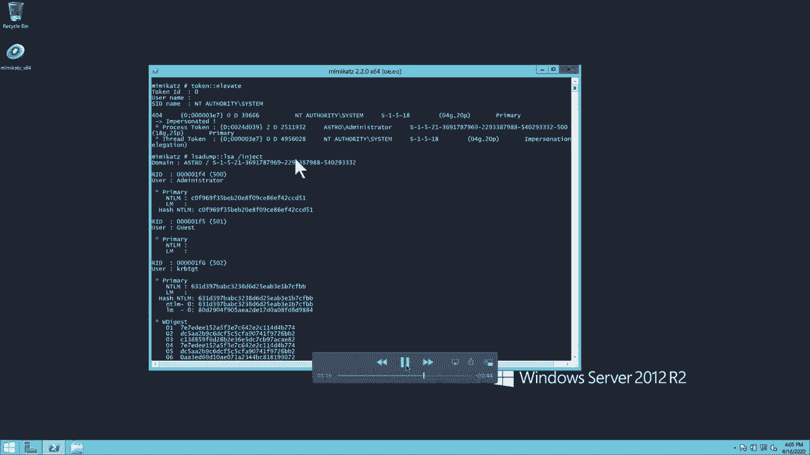

 can put out that ntlem hash。 Unlike quite here we can use this the golden ticket command and then we can see it if I。

 check now once again we can see LSA call authentication package has been been called。

 and we can pick up this ticket and so this is fake user astro。testabbers you can specify。

 any user for a golden ticket for a temporary period and this is obviously very suspicious。

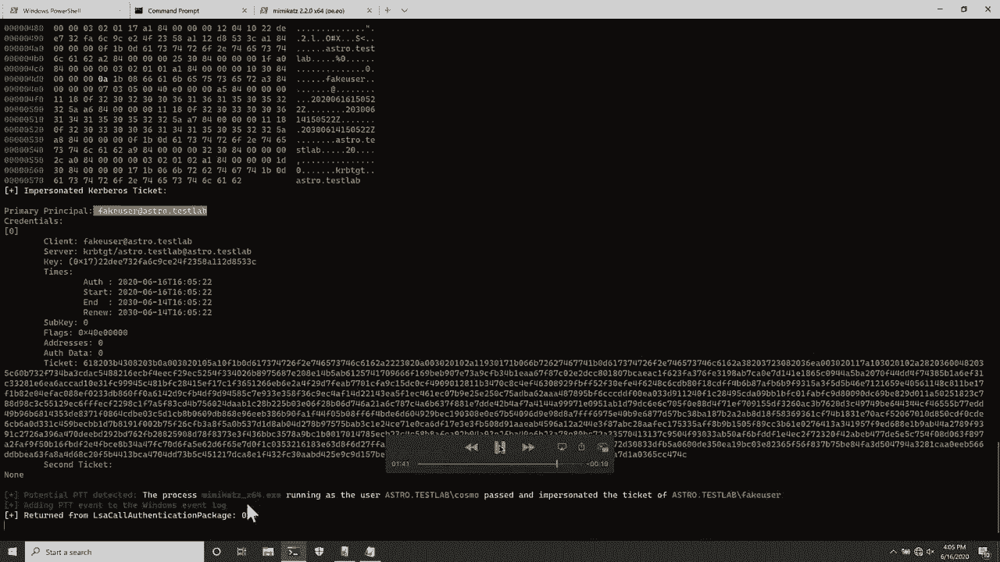

 as well so we can write an event log as well and so the key thing here is for it doesn't。

 really matter what krbg you use at the end of the day you have to submit that ticket whether。

 it's on disk or a memory via that function to apply it to your logon session。

 In terms of native telemetry sources I looked at the krbgg tw providers and I couldn't really。

 find anything that seemed to capture what I want which was quite disappointing。

 There's better logging on DCs but this can be noisy and obviously isn't the client side， of it。

 For the last example I had overpassed the hash again this had that great process of logon。

 not only gadget we also had debug privilege and impersonate system token。

 Debug privilege is very noisy in my opinion so I've ignored that and we're going to focus。

 on impersonating a system token which is a definitive escalation of privilege right。

 you're going from high to system likewise you can look for right-hand access but this。

 is kind of a traditional known technique and this wasn't really the focus of my research。

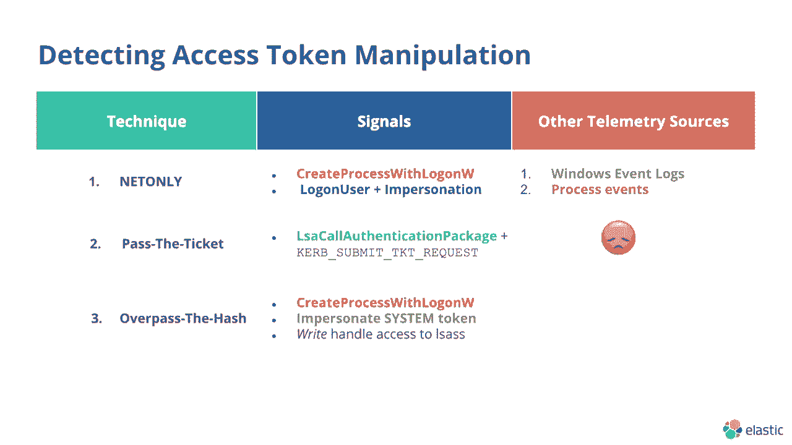

 So I just have a final quick example of overpass the hash。

 And so in this scenario we're simulating a credential shuffle so I'm actually interactively。

 logging on the administrator user basically so they have cache credentials in memory that。

 I can still also note when you use run as sometimes for ridge 500 it automatically elevates so。

 the process is already high integrity。 So once again I can attach feeder to mimikats I can elevate and then I can dumb credentials。

 So I can see the plaintext credentials but for overpass the hash I'm interested in that。

 NTLM hash so I can use that in mimikats to spawn a new command prompt which I can then。

 move laterally with。 Again because I'm not only I'm the same user locally again note the credentials are not。

 validated until you try and authenticate remotely and then I'm a domain admin。

 If I switch to free dot I've actually got a new hooks a base I've hooked NTC information。

 threat which I said is a wrapper for those impersonation functions。

 When it's being used to impersonate a token I query that that handles the token and fly。

 and basically look what user it is and if it's a system token then this is a suspicious。

 event we might want to omit an event on it。 And the second example here is just that create process log on with those and the credentials。

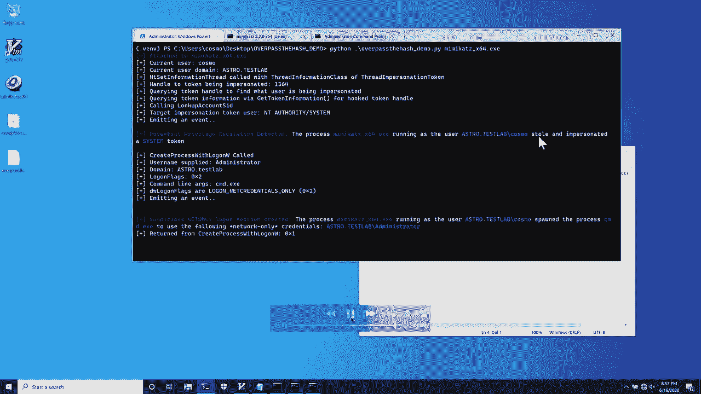

 So two of these are potentially very suspicious behaviors that we want to look for。

 In terms of telemetry again as I said for not only stuff Windows event logs process events。

 and then I didn't have this but right handle to access to LSAS you can look for system on。

 a VNID 10 so process access。 As a note before I wrap up I just want to highlight two things so from my research a lot。

 of these signals here are highly anomalous like these are pretty rare especially again。

 if you look for high medium user activity these are rare and I think quite high fidelity。

 signals of bad behavior again if you rule out admin tools as well。

 The second thing is because apart from impersonation all of these calls are making RPC calls to。

 either the second the second log on service or the LSA Kerberos provider and so a typical。

 weakness of hooks you can just make a direct Cisco in this case you can't do that because。

 it's not a symbol right if you've ever looked at making RPC calls they're quite complicated。

 and so some of the traditional weaknesses of hooks are slightly mitigated by this it's。

 not impossible but it increases the barrier of an attacker being able to or wanting to。

 spend time doing that and I shall wrap up there。 So hopefully I've shown that Windows security can be intimidating things like Kerberos NTLM。

 can be complicated but I hope I've shown at high level it can simply it's simple think。

 of access tokens log on search log on sessions and cache creds these this is the framework。

 from which it works and which you can start compromising domains from essentially and hopefully。

 I've shown that because of these constraints irrespective of what tools you use what authentication。

 provider you're abusing basically attackers always under the same set of constraints they。

 they always use these net only gadgets to create these sacrificial log on sessions etc and so。

 you'll see the same signals for irrespective of the kinds of attacks even unknowns actually。

 don't know yet and hopefully these techniques aren't necessarily supposed to be sort of。

 prod prod ready but they show the art that possible from both an offensive and defensive。

 perspective so hopefully as a defensive practitioner you can see kind of what an attacker can do。

 and you can assess your own ability to detect and respond and detect use the EDR use you can。

 see whether they can see this kind of stuff and it gives you a springboard for future threat。

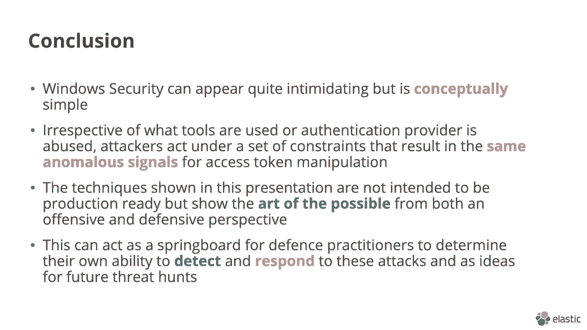

 hunting as well and I shall wrap up there thank you very much。 Hello can you hear me？

 Perfect thanks everyone for attending my session today I saw one really good question from Michael。

 there was essentially about how do you operationalize the hook base detection and then do you recommend。

 deploying freedom in production I think loosely there's kind of two concerns with any detection。

 logic which I suppose from sort of an EDR perspective is a noise so how much how many false positives。

 do you get and then the actual performance implications of it in terms of these specific。

 hooks like testing getting an idea or feel for the actual activity and how rare it is。

 is the number one thing for me at least to feel whether it's even worth even operationalizing。

 down the line anyway hooks in particular can be you know some APIs can be very noisy they。

 can be quite performance intensive so just be careful with what exactly you're hooking。

 so I think as well trying to get rid of many kind of superfluous API calls or events as。

 soon as possible is also a really good way of honing in on that exact behavior we're looking。

 for I think in this case these behaviors like harder to just happen they do seem to be really。

 very my experience you know if you look for it in your kind of enterprise if you look for。

 you know business users creating these net log on sessions and you know submitting new。

 TGTs to their session this stuff is rare so it's a really good basis for detection at a。

 starting point and yet you'll get a few false positives but at least it's high fidelity。

 enough for us to be able to make it valuable detection logic in terms of operationalizing。

 freedom I mean pending any licensed equipment licensed agreements like freedom is amazing。

 it's really powerful and you may but it's obviously running Python under the hood so that may。

 have performance implications that you would want to worry about I'm just sorry a product。

 of the switching to screens I'm just looking at the discussion now to another question would。

 it be possible to use ETP providers to enrich the data set and detect all the techniques。

 especially the one not currently detected with standard you could do that I admit as I said。

 before my research was mainly focused on developing using land hooks ETP is an incredibly valuable。

 resource for a lot of kind of key windows events so you could again providing you the。

 infrastructure in place to do this you could enrich the data set with some of these things。

 as I mentioned I was a bit disappointed with ETP for some of the Kerberos stuff because。

 from either an RPC perspective calling into the LSA or the actual Kerberos ETW provider。

 I couldn't really find what I was looking for there is better logging on domain controllers。

 but the purpose of this was to find client side manipulation style attacks so for some。

 things that there is a bit of a gap I think from the standard Microsoft and even say things。

 like sysmonset I mean as I highlighted if you're an attacker if you just use LSA call authentication。

 package and do all your create kind of manipulation through Kerberos if you know anyone looking。

 for someone grabbing a handle to else has something you're not going to see any of that。

 activity so there are some limitations on what you can natively natively detect I shall。

 have a quick look for any more I'll give I'll wait a little bit if anyone has anything else。

 otherwise I can wrap up the session I guess yeah nothing else so I guess I'll leave it。

 there yeah thank you very much for attending， [BLANK_AUDIO]。

