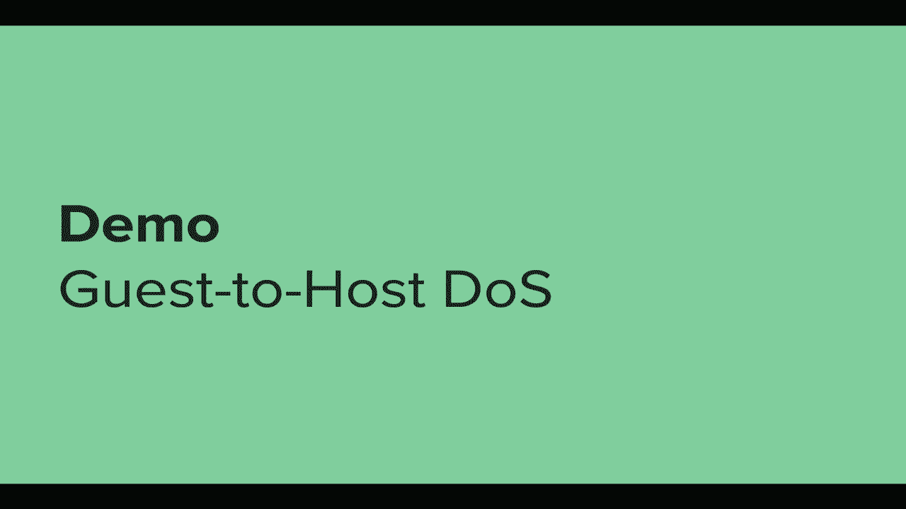

# 【转载】Black Hat USA 2020 会议视频 - P32：33 - Escaping Virtualized Containers - 坤坤武特 - BV1g5411K7fe

 [MUSIC]。

 >> Hi， everyone。 Thank you for joining。 Today we'll be escaping virtualized containers。

 I'm Ivala Varami。 I'm a security researcher at Palo Alto Networks。

 And me and my team's main focus is Cloud Security and Container Security。

 And today I'm going to walk you for a research I conducted on。

 a catacontainers which is a sandboxing solution for， containers that runs virtualized containers。

 It runs each container inside the virtual machine。

 And today we're trying to escape that sandbox and hopefully。

 through that learn a bit about container security。 So a bit about the agenda for today。

 We'll start off by talking about a container and， container security in general。

 And then we'll talk about catacontainers， a sandboxing solution， like I've said。

 Why is that needed and how is it implemented？ And then we'll try to escape the sandbox。

 So we first need to break out of the container and then escape the virtual machine。

 So we have quite a bit of challenges there。 And then we'll wrap it up with some takeaways from the research。

 So let's start with containers。 There's a misconception that containers are just lightweight VMs。

 That's not the case。 Truth on stereo is actually a better description if you're familiar with Linux。

 But when I wanted to really sum up containers in one sentence。

 what I came up with is restricted processes running a separate file system。

 And the key word here is processes。 At the end， containers are just Linux processes running with a couple of。

 isolation primitives applied to them。 And you probably heard about some of those isolation primitives。

 So for example， namespaces define what a process or， what a container can see。

 So the PID namespace will define what other processes may container see。

 And then you have primitives which are more related to what a container can do。

 like capabilities in a second。 So for example， capabilities are basically privileges in Linux。

 So you wouldn't like the container to have the C3 boot capability。

 as that would allow them to shut down the machine。 And of course。

 that's something you don't want the container to be able to do。 Finally。

 the final piece that really ties together are a control group。 So C groups。

 which are all about resource isolation and， limiting the containers access to host resources。

 For example， you wouldn't like the container to be able to exhaust the entire。

 host memory and launch a denial of service attack against the host， right？

 And all of those together give allows to separate a process enough from。

 the system for it to be considered a container。 But you still can't really compare the type of isolation provided by。

 those primitives and isolation of containers to the level of isolation provided by virtual machines。

 And the main difference is that virtual machines run on a separate。

 kernel from the host and containers share the host kernel。

 And that's really a fancy way of saying that containers at the end are just。

 processes and like any process they interact with the kernel quite frequently。

 Either when they invoke system call or if page fault happens in their context。

 And that means that like other processes on the machine and。

 the kernel is quite a large of an attack surface for。

 containers to try and exploit to gain a foothold and a control over the entire host， right？

 And the issue here is that those vulnerabilities don't really have to be。

 related to namespaces or to sygroups or to any of the primitives that really make， up containers。

 Just any privilege escalation vulnerability in the kernel。

 in a code path in the kernel that the container can somehow invoke。

 could allow a container to break out。 And that's quite concerning in a lot of scenarios。

 And to tackle that issue a few tools that， arrives that allow you to sandbox container。

 And Cata containers is one of the first solution to actually try to do that。

 And it takes a pretty straightforward approach at the sandbox in the containers。

 It just runs each container inside the dedicated lightweight virtual machine。

 And by doing that you get two layers of isolation， right？

 You get first the container and then the virtual machine。

 And you also mitigated the breakout which are based on kernel vulnerabilities。

 And because even if the container exploits a vulnerability in the guest kernel。

 he's only compromising the guest， right？ He still doesn't have access to the host。

 And really the idea of Cata is to provide a simple way to sandbox containers where。

 you can just plug Cata into existing solutions like Docker and Kubernetes and。

 have certain containers run with an additional layer of isolation。

 So what's the use case for this type of solution？ So first as I've said， Cata is great for。

 untrusted or targeted containers where you're afraid the container might want。

 to break out and affect the host。 And it's also really useful in multi-tenant environments where you want to。

 segregate a container from several tenants。 And there are a lot of scenarios where those use cases are useful。

 But cloud service provider is one of the prominent ones because those two use cases。

 are really the problem that cloud service providers have， right？

 They run containers from multiple customers on the same platforms。

 Those containers might be malicious， they really don't know。

 And they need a solution to create a stronger isolation boundary。

 between containers of different customers， right？ And Cata really fits that scenario great。

 And several cloud service providers are already using Cata in production。

 to support customer multi-tenancy。 So how do you really use Cata？

 And so in a normal container setup， you have the container engine， so something like Docker。

 and you also have the container runtime。 And that's because container engines don't really know how to run containers。

 And when they actually need to， they defer to their defined runtime。

 And that runtime actually knows how to set up the container。 So normally you would use the Rancie。

 which is the default industry standard runtime。 But you can decide that if you have an untrusted container。

 where you want to sandbox that container， you can just define Cata as the underlying runtime of your container engine。

 say Docker。 And now when you run that container with Cata。

 it will be deployed inside the virtual machine with an additional layer of isolation。

 So we at the end of the day want to break out of this sandbox。 So let's see a bit more in depth。

 how does that look？ So that's how you， that's the command to start a container under Docker with Cata。

 And the way this works is Docker will tell the Cata runtime on the host。

 please set up a container for me。 And the Cata runtime now needs to set up a virtual machine。

 So it will defer to one of the three defined virtual machine monitors。

 Virtual machine monitors are basically software that knows how to set up virtual machines。

 And those are either a Q and mu， a cloud hypervisor by Intel， or， a file called by Amazon。

 And it will use one of those to set up the virtual machine。 Next。

 it will also set up a shared directory between the host and。

 the guest virtual machine to deliver some files to the guest。 For example。

 in order to deploy the container， the guest must have the container image， right？

 And now once that done， a process called the Cata agent will start running in the guest。

 And he is responsible for actually deploying the container inside the guest。

 So it will take the container configuration from the Cata runtime and。

 also the image from the shared directory and use those two to actually deploy the container。

 And there you have it at the end， you have a container running inside。

 a light weight virtual machine， what you expected。 And you get two layers of isolation。

 So now that we know how things work， let's write to escape the sandbox。

 And why would you like to do that？ Well， first it's fun and it's challenging， right？

 You have two isolation layers to break out of。 And second。

 I think it's a great opportunity to learn about container security。 So what's our tax scenario？

 So enterprises use Cata to contain untrusted and targeted containers。

 We're that untrusted container trying to break out and affect the host。

 Cloud service providers use Cata to support customer multi-tenancy。

 So we're that evil customer uploading our malicious containers and。

 trying to break out and affect the entire platform and affect other customers。

 So as a malicious container， what's the plan？ It's pretty straightforward。

 we first need to escape the container and， then break out of the virtual machine。

 So we'll get to that in a second， but I want to discuss scope for a bit。 Cata is very configurable。

 the vulnerabilities I'll show here won't， work in every configuration。

 but we'll be targeting the standard default， configuration that Cata ships with。

 Also we'll be focusing on a single container， guest under Docker。

 With Kubernetes you could have multiple containers in one guest。

 which some exploitation gets complex because of that。 And in one of the attacks I'm going to show。

 I still need to win a race condition for that to work under Kubernetes。 So we'll keep it simple。

 we'll focus on a single container guest under Docker。 And finally。

 I want to say this is not an indictment against Cata。

 Every software will have its share of vulnerabilities。

 I really want to show it just so you could learn about container security。

 So our first job of the day， as I've said， is to escape the container， right？

 So we could rely on the vulnerability in the guest kernel， right？

 And on the privilege escalation of vulnerability in the guest kernel。

 But that really misses the point， right？ We want to learn about container security。

 we want to find an issue that is related to containers。

 So we want to find a native issue with how Cata sets up the container inside。

 the guest virtual machine。 So in order to do that。

 we need to talk about how do those issues even look like？

 How do you approach the task of looking at the container runtime and trying to break it？

 So let's look again at the setup of a containerized environment。 So you have the engine。

 which as I've said， like Docker， which as I've said， doesn't really know how to set up containers。

 And you have the runtime which really knows how to take a configuration and， set up a container。

 So the engine responsibility here is to generate a secure configuration。

 It will tell the runtime what restrictions to set up。

 so which namespaces and which capabilities and so on。

 And the runtime will take that configuration and apply it to create a container。 Now。

 when you're talking about how do you escape containers。

 you're really talking about what issues could be in this process。

 So the first type of issue that could arise in this process is in the initialization。

 of the containerized process。 You have a host process， the runtime。

 trying to use untrusted variables like， the container image in the command and to set up a containerized process。

 That procedure is really complicated and crucial。 And a lot of the issues was found in that process。

 For example， there was an issue with the runtime， briefly exposing host file descriptors to the container。

 which the container could have used to break out。 And that issue really is a runtime issue because the runtime is the one in charge。

 of setting up the container。 And the second type of issue is really an engine issue where you。

 at the end， you finish the initialization of the container。

 And now you have a running container with a couple of restrictions applied to it。

 But there could be a scenario where that container is simply not restricted enough。

 And that really points to a problem with the container configuration。

 and the restrictions supplied by the engine because that's an issue with the engine。

 And it really points to permissive engine defaults or perhaps to a new breakout。

 techniques that wasn't discovered before。 And normally those are the two areas where you will hunt for issues and vulnerabilities in。

 But when I came to look at Kata， I noticed that it's quite a unique case。

 Because Kata is a runtime that actually modifies the configuration received from the engine。

 And the reason it does it is because it turns out that a configuration generated on the host。

 need to be adjusted in order to be valid for use to deploy a container inside a different machine。

 inside a virtual machine， which has a different kernel， a different set of emulated hardware。

 And so on。 But that's really dangerous to do because container engines over the years of vulnerabilities。

 have learned how to create a restricted enough configuration that isn't breakable。 So for us。

 if you want to escape， we can take a look at what Kata does and perhaps find issue。

 with how it modifies the configuration。 And Kata does a couple of things。

 But the main things I want to focus on is that it discards several C groups， several control groups。

 C groups。 And C groups are tied， as I've said， to hardware resources。

 And because the host and the guest have a different set of hardware resources。

 the guest have an emulated set， a virtualized set of hardware resources。

 some C groups just don't make sense in the guest if you generate them on the host。 So for example。

 the device group， the host and the guest have different devices。

 And you might think it's a bit extreme to just discard several C groups。

 But if I wanted to understand the reason behind it。

 I think the reason is that C groups are known to be mainly about the denial of service attacks。

 preventing denial of service attack from the container to the underlying machine。

 But because here the container runs inside the guest virtual machine。

 it's no problem really if the container launches a denial of service attack against the guest。

 Right？ It's only hurting itself， only attacking his own sandbox。

 He's not only closer to gaining code execution on the host。 But the thing is。

 C groups are mainly about preventing denial of service。

 but some people forget that they're not only about that。

 And one C group that is actually quite interesting， which CATA doesn't enforce， is the device group。

 And let's have a look at what the device group does。

 So the device group restricts the container access to system devices， quite simply。

 And CATA doesn't enforce that C groups， as I've said。

 meaning that we inside the container have more access than usual。

 to the devices of the underlying system。 And that system is the guest virtual machine。

 And when you look at those devices and think what device could be interesting to us from the container。

 well， the guest， how this is quite interesting， right？

 We in the container have a view of only a specific file system， the container file system。

 But if we gain access to the entire guest， how this， we can now possibly manipulate it。

 in order to gain code execution on the host， right？ So how do we even access a hard disk in Linux？

 And those type of devices are called block devices。 Well。

 you first need a way to refer to that hard disk， to that device。 And in Linux， everything is a file。

 So of course， you create a device file that refers to that block device or to that hard disk。

 In Linux， every device is identified by two numbers。 You can see in the example here。

 those are eight and one。 So you first use make node to create the device file。

 referring to that device。 And then you mount the device file over some directory in your system。

 And now when you interact with the files under the directory。

 you're actually interacting with the hard disk， right？

 Everything you do in the directory is propagated back to the hard disk。

 And that's really the easy way to interact with the file system。

 But that's actually not very useful for us in the container。 Because in the container。

 we have the make node capability， which is required to create， the device file。

 But we don't have the sysadmin capability， which from the name you may realize that it's good。

 the containers don't have the sysadmin capability。 But because we don't have that capability。

 we can't mount。 And below you can see a cut a container running under Docker， which tries to。

 which can create the device file for the guest hard disk。 But it can mount it。

 So it seems like we're in a bit of a problem， even though we should have more access to the devices。

 Other restrictions are still stopping us。 But there is actually another way to access devices in Linux。

 And that's by directly reading and writing to the device file。 So you don't even need to mount them。

 And why is that useful？ For example， if the hard disk has a corrupted file system and you are not able to mount it correctly。

 you might need some direct access to the device to try to fix things。

 So there are actually build tools like the bug effects， which we can use inside the container。

 to directly interact with the hard disk without needing to mount it。

 And you can see in the example there that we can see the files on the hard disk。

 And we have a great indication that that's really the guest hard disk。

 Because when we inspect the binaries in it， we can see the cut agent。

 which we expect to run to be present on the guest。

 And it's not only reading access to the hard disk， it's only also writing access。

 So because we don't have device a group， we can actually modify the guest hard disk。

 from within the container。 So does that mean we broke out？

 Can we now just easily execute code on the guest？ Well， it turns out that it's not so easy。

 And there are two mechanisms in a way， the page cache and at the end recast。

 And because of those changes that we make at the device level may not really be apparent。

 to a process running on the guest。 So why is that？ In Linux， when a process interacts with a file。

 Linux will read that by reading it， executing it， or whatever。

 Linux will read that file from the hard disk， right？ But that's an expensive operation。

 So it will also keep a cache of that file content in the page cache。

 So the next time a process acts as that file， then Linux doesn't have to go all the way to the hard disk and can simply access the page cache。

 That's great for performance， but it's pretty bad for us。

 Because we're in the container and we are directly writing to the hard disk。

 So if we're in the container， for example， and we modify a stage on the hard disk。

 and then some process on the guest tries to access a stage， if a stage is already in the page cache。

 that process will see the original version of the stage from the page cache。

 and not our malicious version on the hard disk。 And that's not good for us if we want to gain code execution on the guest。

 To make things work， the guest is pretty static。 And beside the Cata agent and system D。

 nothing really else really runs on it。 And it doesn't really invoke and interacts with files。

 So it's even harder for us to gain code execution。 So how do we deal with that problem？

 So as I've said， the guest is static。 So we can't expect it to just run a new executable。

 so we need to replace an already running executable。 So that's either the Cata agent or system D。

 But those， as I've said， are already loaded to the page cache。 So in order for us to--。

 in order for the modification that we make to the hard disk to actually be apparent。

 to guest processes， we need to some way to force the guest kernel to free the page cache。

 And how can we do it？ Well， the page cache uses memory that is currently unused。

 But if a process wants that memory， the kernel will give the process that memory。

 because it will say， OK， later on， I can just read it again from the hard disk。

 And right now that memory is used is a necessary by process。

 So when the container can allocate small chunks of memory to a slowly。

 cheap way at the page cache and the files in it， until we can actually successfully clear。

 Cata agent from the page cache。 And now when something acts as the Cata agent binary。

 it will must go to the hard disk。 So if it's still not completely clear。

 I'll try to explain it by showing， how the attack will work。 So the attack。

 the scenario is that we are in a malicious container， right？

 And we want to gain code execution on the guest。 So what we do。

 we first override the Cata agent binary on the hard disk。

 But nothing really happens because the Cata agent process， the memory is mapped。

 to the version in the page cache， which isn't malicious。

 So in order for us version to be propagated to the process。

 we allocate small chunks of memory in order to clear the Cata agent from the page， cache。

 And now when the execution passes back to the Cata agent process， the kernel realizes， OK， wait。

 I need to get the version， I need to get Cata agent from the hard disk again。

 And now when it does it， it fetches the malicious version that we've put in the hard disk。

 So and now the Cata agent process maps to other malicious version。

 And it runs the code that we wrote to the guest hard disk。

 So it seems like we can get a guest called execution。 But the truth is it's not really that easy。

 Because replacing the binary that the process is running， while it is running， it's quite tricky。

 Because you can imagine that the Cata agent process is now running。

 a specific op-code in a specific function。 And now when we replace the executable that it is running。

 we don't know when that switch will happen。 So we don't know where in the new binary where it will land。

 which op-code it will now， execute in the new binary。

 So it's really hard to get the stable code execution using that。

 And the most likely thing that will happen is that the Cata agent process will just crash。

 So that's not good for us。 We want stable code execution。

 So instead of the Cata agent process crashing being a bag of our exploit。

 we actually make it a feature of our exploit。 And we intentionally crash the Cata agent binary。

 So how do we do it？ We intentionally override the Cata agent binary on hard disk with garbage data。

 But we also override another binary system this shard now。

 with the actual malicious code that we want to run on the guest。

 And then we follow the same procedure as before。 We allocate small chunks of memory to clear the Cata agent from the page cache。

 And now when execution passes back to the Cata agent process on the guest。

 the kernel must read the garbage Cata agent version from the disk， from the hard disk。

 And the Cata agent process now maps to the version。 It's memory now maps to the version。

 And it of course crashes， right？ Because it now maps to garbage data。

 But now once the Cata agent process crashes， a system this shard on sequence， is started。

 which eventually， as you might have guessed， calls the shard on binary。

 Now the shard on binary was never executed before。

 It is only accessed when you want to shut down the machine。 And therefore。

 it is not in the page cache， and we'll need to be directly read from the disk。

 So now the malicious version of the shard on binary that we've put in the hard disk。

 will start executing on the guest。 And it starts executing from the， like a normal process。

 and not switching the middle of execution so that we can actually get stable code execution。

 by doing that。 So let's see of them of how does that work。 And the demo。

 the malicious shard on binary will simply create a file in the shard directory。

 which is supposed to be only accessible from the guest， and not from inside the container。

 And just-- and it just creates that file so we can see that the exploit works。

 So let's see the exploit in action。 So I'm going to show you the code of the shard on binary that I'm going to run on the guest。

 And the code is quite simple。 And as I've said， it just creates a binary in the shard-- a file in the shard directory。

 called the guest is normal issues。 So it's quite simple。

 And then it sleeps so we can see inspect the shard directory。

 So we are now running the exploit with Docker under Catam。

 And the first thing the exploit does is tell us this is my container ID。

 So that's where the shard directory on the whole side should be。

 And we can see that the shard directory has the normal contents， everything is OK。

 But now when the container continues， it gets created the vice file for the guest hard disk。

 And it replaces the shard on binary with the code that I've showed you。

 And also swaps the catam binary on the guest hard disk with garbage data。

 Nothing really happens now， right？ Because the catam is still in the page cache。

 But when we allocate enough memory， we will actually crash the catam agent。

 causing our shard on process to start running。 And we can now see that indeed it ran on the guest。

 And it created the file that we expected。 So that's great。

 And we got a way to break out of the container and execute code on the guest。

 a breakout technique that exploits direct device access， that exploits the lack of sygroups。

 And it really shows you that if you mess around with modified containers， configuration。

 you better be only adding restrictions。 You don't really know what other effects are moving that might happen。

 if you remove a certain restriction。 Researchers might find a way to exploit that breakout。 Now。

 the container does need the make not capability in order to exploit this issue。

 But that's default in most places。 And of course， this issue received the CV。

 So the next thing that we want to do is to escape the virtual machine。

 And that will actually be a bit easier。 So let's talk about the attack surface of the virtual machine。

 So first of all， the catarontime is a process running on the host。

 And it passes messages from the catarontogen。 So if there's a vulnerability in the catarontime。

 a malicious catarontogen might be able to exploit that and gain code execution。

 But catarontime is written in Golang， which is memory safe。

 And none of those messages really are that interesting。 So that's really not relevant。

 Another thing that could happen is the issue with the vulnerability in the virtual machine。

 or the right， which is actually the boundary between the guest virtual machine and the host。

 But we'll not talk about that for now。 What I really want to talk about is the shared directory between the host and the guest。

 Because it's quite an interesting of an attack surface。

 The catarontime on the host side operates on the files in the shared directory。

 But the guest can control those files just as much as the host， right？ It's a shared directory。

 Meaning that we're in a malicious guest， we can manipulate the file in the shared directory。

 in order to maybe affect the catarontime running on the host as well to do some things。

 that it doesn't expect。 And one of the most interesting things that's done with the shared directory is that it is。

 used to deliver the image to the guest。 So let's see how does that work。

 So when the guest virtual machine is started， catarontime bind mounts the container image。

 to the shared directory， then the container starts running inside the guest。 At some point。

 it terminates inside the guest。 And then the catarontime unmounts the container image from the shared directory。

 So that seems quite reasonable， right？ But the problem here is that both mount and arm mount operations follow sim links。

 So in the guest， meaning that a malicious guest could play sim links inside the shared。

 directory and cause the catarontime to target other things on the host that are not in the。

 shared directory。 So it's really easier to see it in action。

 So let's start actually with the unmount redirection because that's easier to understand。

 So that's how the attack looks。 We're in the malicious container and we somehow broken up to the guest。

 maybe using the technique， that I showed earlier。 And now from inside the guest。

 we can create a sim link where we know in the shared directory。

 where we know the catarontime will unmount， will try to unmount。

 And then we can actually kill the container in order to trigger the catarontime to unmount。

 that path in the shared directory。 And now when it does that operation。

 it actually is redirected to a target of the guest's chosen。

 And that's really a really easy way to create an out of service on the host because of the。

 how the catarontime does the unmount operations。 If we tell it。

 if we create a sim links that points to the root directory， it will actually。

 unmount all mount points underneath the root directory making the host very unusable and。

 not able to run any container。 So let's see a demo for this attack。

 So first we will inspect the mount points on the host if the everything is fine。

 And then we will run a container that exploits both the container to guest break out and then。

 the unmount redirection vulnerability。 And it will target the root directory in its attack。

 And once the container is taken down， we can see that those mount points don't contain。

 anything anymore on the host。 And if we try to do other things like run a container。

 you can see that the host is really， unusable and you can't really use it to do anything。

 So that's a host denial of service。

 And that's actually a very nice moment for us because we got the first effect from the。

 container all the way up to the host and the first sort of sandbox breakout。

 And denial of service is nice， right？ But we want to gain code execution。

 So let's look at the mount redirection。 You can also redirect not only the unmount operation of the image but also the mount operation。

 of the image。 That's more interesting because the image， as I've said。

 Qatar is used to run untrusted， images。 So the image possibly is malicious。

 So let's see how that attack will look like。 So we are assuming that the Qatar agent now on the guest is malicious。

 So the Qatar runtime will tell it we're about to create a sandbox。 That's the sandbox ID。

 And now using that message， the Qatar agent can know where in the shared directory the。

 Qatar runtime is about to bind mount the container image and it can create a ceiling at that。

 path that will actually be followed by the Qatar runtime when it tries to bind mount。

 the container image。 And now that untrusted possibly malicious container image will be mounted over a path。

 on the host that the guest decides on。 So those are several very interesting paths that the guest could choose like /bin or /lib。

 which will allow a pretty easy code execution on the host。

 But the problem of this attack is that we assume that the Qatar agent is compromised。

 and that the guest is malicious even before the container starts running on the guest。

 Because if it's before the container image is bind mounted to the shared directory then。

 of course that the container isn't running on the guest。

 So we actually need the way to compromise the guest before the container runs and we don't。

 have a way to do that right now。 We only have a way to gain code execution on the guest from the container。

 And that task， so in order to do that we look at cloud hypervisor and an issue and vulnerability。

 that I found in how Qatar uses it。 So cloud hypervisor to remind you is one of the three virtual machine monitor options。

 of Qatar。 And when I tried the container to guest a breakout on Qatar with cloud hypervisor I noticed that。

 Qatar stopped rocking after that I couldn't run any container。

 And when I inspected the virtual machine image I saw that the Qatar agent binary on that。

 on the virtual machine image actually contained garbage data。

 And that's really concerning because that was the garbage data that I wrote to how this。

 on the from the container。 Meaning that from one in one guest any changes that we make to the guest how this under cloud。

 hypervisor are propagated to the virtual machine image on the host。

 Meaning that one guest can control the hard disk of all future guests。

 And because all virtual machine monitors use the same virtual machine image to set up the。

 guest this means that one guest can control every future guest regardless of what virtual。

 machine monitor it uses。 And that's really bad for multi-tenancy right。

 And besides from being a pretty severe issue by itself that one guest can control all future。

 guests it's also a way for us to gain code execution on the host because we now can exploit。

 the mounted direction right。 We needed a way to for the guest to be compromised even before the container runs。

 But if we have a way to compromise the virtual machine image that means that the guest can。

 be malicious from the moment it boots right。 So we can it can actually create the malicious ceiling before the container is started。

 So if it's still not that clear let's see how that full attack will look like。

 So we are now seeing a full container to host code execution。

 It will require the victim to run our container twice on their system but that's pretty expectable。

 expect that's pretty a pretty normal requirement because most people and automated system if。

 the first container crashes it will just right run it again。 So let's see how it works。

 The first the first time the malicious container is executed is executed under cloud hypervisor。

 and it uses the direct device access vulnerability that we found to change override the cut agent。

 binary on the hardest with a malicious version。 Now because we are running under cloud hypervisor that malicious version is going to be propagated。

 and committed to the virtual machine image meaning that the next time a guest will be。

 run it will run with our malicious cut agent right from the moment it boots。

 So now that malicious cut agent on the second container run can exploit the mounted direction。

 issue create the ceiling and redirect our malicious image to whenever on the host we。

 want to gain code execution on the host。

 So let's see a demo for that attack。

 So we will be trying to mount the container image over slash bin on the host and we can。

 see that slash bin is completely normal right now。

 So we'll run the container under cut with cloud hypervisor and the first container we'll。

 replace the cut agent binary on the virtual machine image exploiting the vulnerabilities。

 that we discussed。 And now the next time our malicious container image is executed it will be running under。

 a malicious guest right and that malicious guest could exploit the redirection vulnerability。

 that we found to redirect the image over bin。 And now if we want to check out what's happening on bin in the content in the host we can see。

 that it has a completely different files and that's actually the files of our malicious。

 container file system。 And if we now try to execute something from inside the binary that is inside bin we can。

 now see that the malicious version of the binary is running on the host and we actually。

 got code execution from the container all the way up to the host。

 So that's great right we set up what we wanted to accomplish in the start we got code execution。

 on the host from inside the container and really the underlying issues here show how。

 the the shared directory is really a big attack surface for virtual machines right we saw。

 two issues with host app with a host applications that interact with the shared directory right。

 the mountain and mount redirection issue that we found that we found that could be exploited。

 and that could be used to trick the cat around time so there could be issues with the host。

 application accessing the shared directory but there could also be issue with the mechanism。

 itself of the shared directory normally there is some process on the host that manages the。

 shared directory and you can actually find the issues with that and I found one of those。

 issues that could allow in catar to launch a denial of service attack but we won't get。

 into that I just wanted to let you know that the mechanism itself could also be abused。

 So what attacks that we saw today we saw a container to guest a breakout using direct。

 device access and exploiting the lack of a device signal using a breakout new breakout。

 technique and we also saw a guest to host and mount operation right with which we could。

 the views to launch the denial of service attack on the on the host we also saw a way。

 for one guest to compromise future guests under cloud hypervisor and we also found a way for。

 one guest to gain code execution on the host by redirecting the malicious image mount and。

 I also briefly discussed a denial of service issue that could be found in the shared directory。

 mechanism itself now all of those attacks could be chained together all of those vulnerabilities。

 can be chained together to perform a number of attacks on the host and I showed some of。

 them today all of those issues I've disclosed them to catar containers maintainers they of。

 course they were fixed and you can read more at this directory and aside from seeing like。

 a cool a a exploit chain and a sandbox a sandbox a a breakout what can we really learn from。

 this research so first of all I want I hope you now understand it more about container security。

 and understand that containers are only as secure as their configuration right and a。

 simple way to improve their their configuration and security is to drop unused privileges。

 and the breakout that we saw today relied on cap make note right and it's a great example。

 for that because cap make note most containers have that capability but almost none of them。

 actually need it right and ngix container doesn't need to create the vice files and。

 interact with them in any way so today with the point is that today we saw a breakout in。

 catar container that relies on the make note capability but tomorrow it's another breakout。

 right in a different container runtime that relies on another one capability that your。

 containers have but they don't use so the point is you really should remove capabilities。

 and privileges from the container which it doesn't use the second thing you need to do。

 is to besides further dropping capabilities is to further restrict the container using。

 some best practices and history shows that all of those vulnerabilities that I've talked。

 all of the types of issues that I've talked about in the container as a scapology part。

 most of them or a lot of them could have been mitigated by simply applying best practices。

 like user namespaces or running the container as a non-hot as the non-hot user and that those。

 type of things should really be the number one thing you do if you're trying to improve。

 the security of your containers but we also saw a we talked about sandbox yesterday and。

 sandboxes do limit the attack surface right but I want to clarify the aren't magical solutions。

 that an attacker's would find way to break out so the point here is don't bet all of。

 your chips on a on one bag right don't only rely on the sandbox you should really be prepared。

 for that sandbox to be broken up broken out of it should be an enhancement and not a replacement。

 of your coin security features and the final thing that if you do decide to use a sandbox。

 you should get you should really get the full potential out of it and enable its security。

 features cut off for example has some security features that aren't enabled by default that。

 could have been useful to mitigate one of the attacks that we saw you today so that's really。

 a all I have for you today I hope that you enjoyed it that you learned about a container。

 security a bit and I'll be happy to take any questions。

 Broken out of it should be an enhancement and not a replacement of your coin security features。

 and final thing that is yep oh I'm live hi guys so I'll just go over any remaining questions。

 is it now better it's a coin hi guys can you win still a coin how bad is it can I。

 so guys it tells me how to make a win so I'll answer any question that you may have on。

 the chat that you may have left I hope you enjoyed it and see you in the rest of the。

 conference bye bye， Bye。