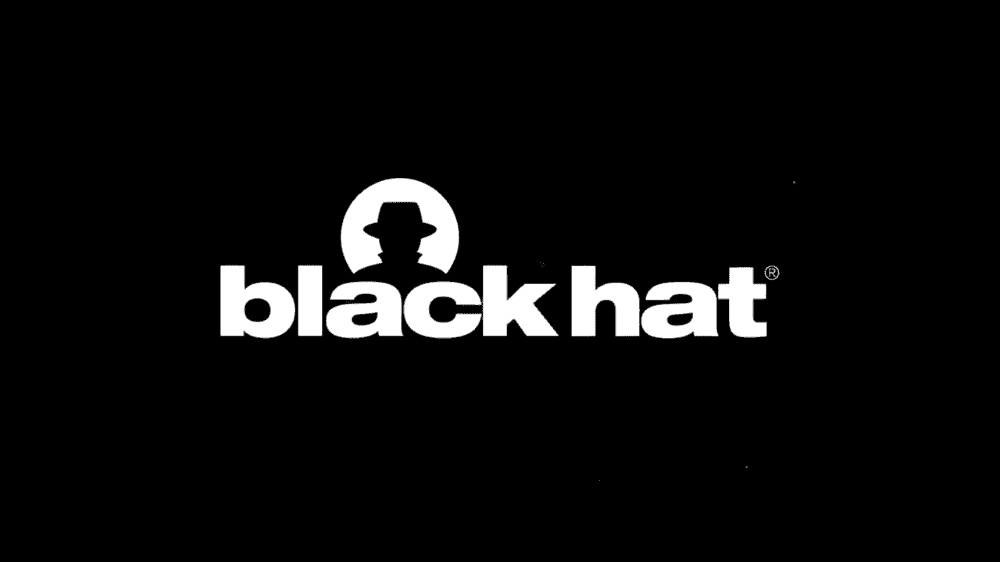
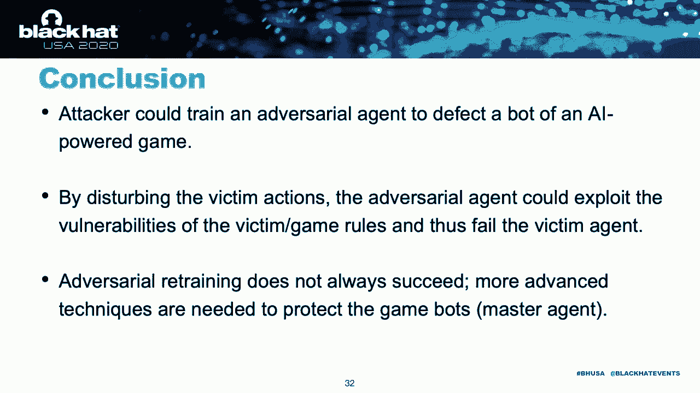

# 【转载】Black Hat USA 2020 会议视频 - P33：34 - Ruling StarCraft Game Spitefully -- Exploiting the Blind Spot of AI-Powered - 坤坤武特 - BV1g5411K7fe

 Today we will be talking about how to attack game modes of AI power games。

 This is a joint work with my old weather and colleagues。

 As we know deep learning has become the hottest ML techniques。

 In the past few years it has dominated many supervised and unsupervised learning fields。

 In security it also outperforms the traditional methods in malware detection and inclusion。

 detection。 Going beyond supervised and unsupervised learning reinforcement learning is a more powerful。

 tool of learning technique that could handle more complex tasks。

 Recently researchers combined IL with DL and developed different types of DIL techniques。

 These techniques has shown extraordinary performance in many decision-making tasks such as robotic。

 control， autonomous vehicle， finance and business management。 In games。

 agents learned by DIL also be professional or even first class human players。 For example。

 deep mind the alpha goal， continuous speed first class go human goal players。

 More recently news showed that besides goal game， DIL agent also could be professional。

 poker game players in different types of poker game such as text that holds them。 Last year。

 deep mind relates an open source package which includes multiple board game。

 environment and the state of art DIL learning technique so users could train their own agent。

 to play with other IL agents or even human players。 In addition to board game。

 DIL also help become the standard method of training a master agent。

 in both simulation games and real time strategy games。 In simulation game。

 open eye release and package called GIM which includes different type of。

 simulation game environment such as the ones shown on the right hand side， the Atari game。

 the robot school game and the musical games。 So the user could test their DIL technique on all of these environments。

 Recent news also reported the effectiveness of DIL in world famous real time strategy。

 games such as StarCraft II and the DIL II。 Along with the rapid development of DIL technique。

 researchers also started to investigate the， security property of DIL especially at the serial attack。

 As you may aware， there are many works about the DIL type on deep learning。

 So this attack can meaning categorize as training phase attack and testing phase attacks。

 This DIL system also have deep learning involved so intuitively this DIL-L algorithm should。

 also be vulnerable to the actual serial attack。 This intuition has been wedded by some recent works。

 Specifically， this work has shown that the attacker could pre-turb an agent's observation。

 or reverse， and fail the agent and force the agent to fail the corresponding tasks。 However。

 as we will show later discussed later， these attacks are not practical meaning because。

 they involve hygienic game system which is time consuming and cannot always guarantee。

 to be succeed。 So in this talk， we will present how to enable a practical at the serial attack against a。

 game bot or master agent in a two-party game environment。 This is a agenda for today's talk。

 We will start with some big background knowledge of DIL。

 Then we will introduce some AI power games and how to train a bot for these games。

 Then we will introduce existing attacks on DIL game bots and discuss their limitation。

 Based on the limitation of existing work， we will elaborate on our attack master knowledge。 Finally。

 we will show the evaluation results and conclude our talk。

 The high level AI problem is the decision-making problem。 Specifically。

 it has an agent who observes and interacts with an environment through a series， of actions。

 Each time this agent takes action， it will receive a reward。 Take this entire game as an example。

 In this game， the agent is the blue bot， the environment is just the game itself。 At each time step。

 the agent absorbs the environment and takes action accordingly。 At this time。

 the agent probably can go right and try to catch the ball。 After taking this action。

 the agent will receive a reward from the environment。 So in this game。

 the reward probably breaks how many breaks the agent has hit。

 Then the game environment will receive this action and transit to the next stick based。

 on the transition dynamics。 This transition dynamic is purely unknown to the learning algorithm。

 Solving an AI problem is equivalent to training an AI agent。

 The goal of this agent is to maximize its total amount of reward。 So in this case。

 the goal of an AI algorithm is to learn an optimal policy， follow which。

 the agent could receive a maximum amount of reward over time。 So as we can see here。

 the total amount of reward is very important for training an AI， agent。 In the final。

 it is represented by value function。 Specifically， it has two forms。

 An AI optimal policy can be obtained by max mass either of the value functions。

 Takes a game on the left hand side as an example。 Here the agent could move within the check bot and the clerk reward based on its move。

 Because with some Paul， knowing the value function shown in the figure in the middle。

 So based on this value function of each state， the agent will then choose this action。 For example。

 on the top left corner， the best move here is to go right because it will collect。

 more reward than going down。 In DIL， an agent is usually modeled as a deep neural network。

 which is called policy network。 This network takes as input the observation and the output the corresponding action。

 Takes a figure on the top right hand side as an example。

 Here the agent is the policy network shown here。 This network then takes as input the game snapshot that is the observation and then。

 output the corresponding action such as going up down and either up down or left and right。

 So in this case， learning a policy is equivalent to solving the parameter of this neural network。

 The method that is used to solve the network parameters are called policy gradient method。

 Recall the goal of a DIL algorithm is to maximize the value function。

 But surely the value function of some complex scheme are usually unknown。 So here in DIL。

 the policy gradient method usually uses another network to approximate， the value function。 As such。

 in each iteration of the algorithm， it will first update the value function network。

 by minimizing the approximation error。 Then， they will update the policy network by maximizing the value function。

 As you should in the example on the bottom right hand side， these two networks are usually。

 shell parameter。 Next， we will introduce some DIL power games considered in our work and the code structure。

 of training and DIL bot for these games。 In this work。

 we focus on both the simulation game and real-time strategy games。 For simulation games。

 we are considering two-party mutual games。 In this game。

 the observation is usually the current status of the environment， including。

 the agents and its opponent's status。 The action of an agent is just the agents movement。

 including like moving direction and， moving speed。

 The reward of a game is the agents' status and the one-dose condition。

 Going beyond simulation games， we also consider a real-time strategy game， StarCraft II。

 In this game， the observation is a special condition of the map and the amount of resources。

 has been collected by the agent。 The action are categorized into four classes。

 building construction， producing units such， as workforce and armies。

 high-resing resources and finally attacking army。 The reward of this game includes the game statistics and the windows condition。

 Recall that the policy gradient framework is the standard way of training a DIL agent。

 Following this framework， researchers have developed different types of learning algorithms。

 Among these algorithms， the way they use the one in training a game bot is the PPO algorithm。

 Here is the algorithm。 Algmatic workflow of PPO algorithm。 First。

 one need to initialize the network parameter for policy network and value function networks。 Then。

 in each iteration， it first clicks a set of trajectory by playing the current policy。

 in the environment。 After clicking this trajectory， as it is mentioned above。

 it will update the policy network and， the value function network by using these trajectories。

 As the code level takes Darkwaff 2 game as an example。 To train a game bot。

 the first we need a programmatic game environment。 With the environment by hand。

 the code structure is shown in the figure on the right-hand side。 So basically。

 we need three major parts。 First is the agent， which defines and construct the two networks。

 the policy network and the， value function network for the agent。

 Then we need to write the environment webber by using the environment package listed above。

 So this environment webber is used to play the agent in the environment and collect the， trajectory。

 Finally， the main file is used to run the agent in the environment and the train network's。

 defineable。 To train a game bot， to train a DRI game bot for two agents or multi-agent game， when。

 standard strategy is the self-play mechanism。 That is。

 train an agent to play against itself until the winning rate for both parties are， 50%。

 Specifically， the main file for training a bot with this strategy is as follows。

 We first need to define game environment by using the environment webber。

 So as you can see from the upper right frame in the right-hand side figure， then we define。

 a runner to run the agent in the environment and collect the trajectory。 Finally。

 we define a learner to receive the trajectory collected by the runner and update。

 the policy network and the value function network。 In the self-play mechanism。

 it will iteratively update the policy for each party until the。

 winning rate for both parties stabilizes at 50%。 After introducing the basics of DRL and the how to train a game bot or master agent by。

 using a DRL algorithm， we now proceed to how to attack the game bot。 Next。

 she and we will introduce the existing attacks on DRL game bot。

 The existing attacks on deep reinforcement learning can be summarized as two categories。

 The first one is the perturbation-based attacks。 The second one is the more practical adversarial-aging attacks。

 Firstly， I will introduce the perturbation-based attacks。 As we can see from the right picture。

 that Vosir can either perturb the observation and。

 thus force the policy network to output a series of suboptimal actions， or directly。

 add perturbations to the output actions of the policy network。 Here is the Pongame example。

 We can see from the bottom image， two agents is playing the pong with each other。

 For the current snapshot， the optimal action for the right agent is done before the attack。

 Then a attacker generates perturbations by using the existing attacks on deep neural networks。

 and adds it to the current observation to induce the right agent。 To output a suboptimal action。

 by doing so， the right agent may fail in this game。

 Although the perturbation-based attacks have achieved some success， it has not limitations。

 in the real-world setting。 In the game set up， it requires the attacker to hijack the game server to illustrate this。

 argument。 We again take for example the aforementioned online games。 In these examples。

 the activities of manipulating the environment means that Adversary breaks。

 into the game server or to the game code and thus influence the environment that has agent。

 interact with。 Considering this， it requires professional handhairs， tremendous effort and time。

 What's more， the perturbation-based attacks is not a practical setup for beating a master。

 agent over a two-party game。 Next， I will talk about the Adversary agent attack。

 As shown in the right picture， the attacker is not allowed to hijack the information flow。

 of the victim agent， but the attacker could trigger Adversary agent by play with the victim， agent。

 Compared with the perturbation-based attack， it's more practical in games， since we need。

 not to hack the game system and any player could play with the master agent freely。

 There is some existing technique in Adversary agent attack。 In this work。

 it treats the victim agent as part of the environment and trains the agent。

 to collect maximum rewards in the environment。 Specifically。

 it uses the PPO algorithm to maximize the training agent's value function。

 and expect to obtain a policy that could beat the victim。 However， as we were shown later。

 it cannot establish a high-game rating rate。 The reason is that it doesn't explicitly disturb the victim agent。

 and the training algorithm， has less guidance for identifying the weakness of the victim。 Next。

 one more we'll talk about。 As is introduced by Xian。

 existing attack either relies on unrealistic assumptions or。

 is not able to achieve a decent attack successfully。 In the following。

 we'll elaborate on our idea of training an Adversary agent to exploit。

 the weakness of its opponent and thus defeat it in a two-part game。

 Our attack's role is the same with the Adversary attack introduced before。

 To tackle the limitation of this existing attack， we propose to argument it with new to new。

 designs。 The goal of this design are the same。 That is。

 train an agent to not only maximize its reward， but also prevent its opponent。

 from collecting more reward at the same time。 In other words。

 we like the Adversary agent learns to how to pre-turb or disturb its opponent。 So specifically。

 our first idea is to directly change the Adversary learning objective to。

 not only maximize its own reward， but also minimize its opponent's reward at the same， time。

 Our second idea is to let the Adversary agent take that action that deviates the victim's。

 next action。 To realize the first design， recall that the value function are unknown to the learning。

 algorithm。 So the first step is to approximate the victim value function with another neural network。

 With this approximation by hand， we then add a term to the Adversary learning objective。

 This term is used to minimize this approximated value function。

 To give you an example of the difference between our objective and the existing attack， which。

 only maximize the Adversary's total expected reward， we use the tracking resources game。

 as an example。 In this game， the goal of an agent is to collect more resources than its opponent。

 Without newly added term， the Adversary agent focuses only on itself。 In other words。

 it will only optimize its policy and try to collect more rewards。 Among resources。 However。

 if the victim agent or opponent agent has a better strategy of collecting resources。

 it will be extremely hard for the Adversary agent to learn the better strategy than the。

 victim and thus beat victim。 However， with the added term， in this case。

 the Adversary agent will learn to block the， victim from collecting more rewards。

 So it will have a higher chance to beat its opponent no matter how good the opponent's， policy is。

 As for the second design， we first leverage model explanation method to expand the action。

 of the victim。 And find out the time step when victim takes action based on the Adversary agent。

 Then， in these critical time steps， we will optimize the Adversary policy to take action。

 that will introduce a maximum deviation in the victim's next action。

 Let me demonstrate this design with an example here。

 This is a robot school punk game in which the master agent， the purple one， is playing。

 against an ideal serial agent， which is the blue one。 Recall。

 the observation of an agent is the current game statics， which includes its opponent。 Here。

 the red frame in this vector indicates that it will zero part in the victim observation。

 So this observation is then given to the victim policy network and outputs the corresponding。

 action。 With the model explanation method， we could calculate the importance or inference of each。

 input dimension on the output prediction。 So as such。

 we could use this technique to identify the inference of the Adversary on， the victim action。

 Just the red part in the victim observation。 So the inference of the red part on the output action。

 And select the time step when Adversary has a large impact on the victim。

 As this selected time steps， if we slightly change the action of the Adversary agent， it。

 will also change the observation of the victim agent。

 So this small change in the victim observation will then trigger a relatively large change。

 in the victim action。 So this process is similar to adding Adversary's probation to a different network's input。

 So here， instead of directly change the vector value， we consider a more practical set of， types。

 That is indirectly change the observation of victim by changing the action of the Adversary。

 In this example， the trajectory in the Greek handvers represent the ordinary trajectory。 So here。

 the master agent could go towards the ball and try to catch it and win a game。 However。

 if we pre-turb the Adversary's action， that is choose a different action in a critical。

 time step selected to evolve。 As those time steps。

 the victim will then take a different action due to the probation。

 Like the trajectory in the white cameras， here， the proper agent， the master agent， no。

 longer move towards the ball due to the probation， as such， it cannot catch the ball and will。

 lose the game。 After introducing our attack message knowledge。

 we now evaluate it on some static games and， showing our interesting findings。 Specifically。

 we choose five games， four of which are from a musical game and one is， real-world， strategic。

 Starcraft 2 game。 At four mutual games， the demonstration of the static game are shown on the right hand。

 side。 The first game， kick hand defend， is just a standard penalty shootout。 In second。

 you should not pass game。 The runner， the blue agent， is running towards the red line。

 the finish line， behind the， red agent。 Then the blocker， the red agent。

 intends to block the blue agent from crossing the line。

 In both human arms and the human-human games， the two agents are fighting against each other。

 on an arena and try to push it is opponent of the arena。 As for the Starcraft 2 game。

 we consider our two-party scenario， Wurzak vs Zag。 Recall。

 a DRL algorithm iteratively updates the policy。 With the matter and report the winning rate of the ideal zero agent。

 each time its policy， is updated during the training process。

 Here is the comparison of the winning rates of the ideal zero agent obtained by different， attacks。

 The red line refers to our attack and the blue line refers to the existing attack。

 As we can observe from these figures， our attack outperforms the existing attack on， most games。

 The only exception is the human arms game。 In this game。

 both attacks cannot improve the attacks' success rate of the ideal zero agent。

 The reason is that the observation in this game is of low dimensionality， which means。

 the perturbation space is relatively small。 As such。

 it is kind of hard to disturb the victim where the adversary acts and defeats。

 the victim accordingly。 However， as is true in the figure below。

 our attack improves the non-low rate of the ideal， zero agent。 As we will explain later。

 this spell cannot influence the action of the victim agent。

 Our attack could give the ideal zero agent some of the one-tages by exploiting the vulnerability。

 of the game design。 After showing the quantitative evaluation。

 we now show some game episodes of our ideal， zero agent play against the victim。 First。

 as we can see from the kick-hand defense and the usual non-pass game， our attack could。

 exploit the victim， the weakness of the victim agent by establishing some weird behaviors。

 In human-human video， the human-human video could help learn better strategy that is initialized。

 itself near the boundary and lure the victim to attacking it and fail from the arena。

 More interestingly， in the human-owned game， we can see that it was seriously intentionally。

 thrown from the arena。 That was zero， intentionally thrown from the arena after the game began。

 In this case， the game ends up with a draw。 This shows that our attack could explore the victim。

 the weakness of the game rule because， one of the rule is that if one player or one party falls from the arena without touching。

 its opponent， the game ends up with a draw。 To hear that our zero agent uses this rule to force the game ends up with a draw。

 In addition to the attack， we also consider our possible defense that widely used that。

 is widely used the adversary training strategy。 Specifically。

 we play the victim agent with our trained adversary agent and the returned。

 the victim agent with our proposed attack。 The results are showing the figure in this slide。

 As we can observe from the figure， as the adversary training process indeed improves the performance。

 of the victim， but we need the usual not pass game and achieving a draw on the other three， games。

 But however， it doesn't work on kick-hand defense game。

 We suspect this is caused by the unfairness of the game design because we have tried that。

 it's relatively hard for the kicker to win the game in general。

 Here are some videos of using the retrune victim agent playing against the ador-serum。

 In the first video， the usual not pass game， the victim learns to ignore the ador-serum。

 and directly go for the finish line， which means the victim agent will be aware of his。

 policy weakness and patch the weakness through the retrune process。 In the second video。

 the victim recognizes the trick played by the ador-serum。

 It will stay where it is so the game will end up with a draw。 So， it means in this human-human game。

 the victim also realizes its policy weakness， and tries to fix it。 In the sumo-owns game。

 since the victim cannot change the intentional behavior of the ador-serum。

 so the retrining process basically still keeps the original behavior of either victim， both。

 victim and ador-serum， so the game still stays as tag games。 Finally， in the K-Kan defense games。

 as we mentioned above， the victim acts even worse， it's more easier to fall into the ground。

 trigger it to lose the game。 Finally， we conclude this talk with three conclusions。 First。

 attacker could train an ador-serum agent to defeat a game bot for an AI-powered， game。

 By disturbing the victim action， the ador-serum agent could exploit the vulnerability of both。

 the victim agent and the game rule， and thus， fill the victim agent more effectively。

 Finally， we show that ador-serum retrining does not always succeed。

 We may need more advanced techniques to protect the game bot and master agent。

 Thank you very much for your attention。 We now open up to answer some questions。 Okay。

 hello everyone， I'm Wombo。 Thanks everyone for attending our session。

 Since at the beginning of this session， there's a self-introduction of this meeting， so I'll。

 just do a reintroduction here。 So I'm Wombo， I'm PhD student at Penn State。

 so this work is a joint work for tonight。 The words are a few on my colleague， Shea， and Jimmy。

 So the main speaker of this talk happened with me， and Shea and Tuko are a small part of it。

 The speakers are Wombo and Shea。 So before I answer any questions。

 there are some questions in the question chat box。 Just one who clearly asks about things。 Okay。

 first this work is about attacking a master agent in deep-reinforced learning。 Like environment。

 as I say， we have so many online games， some of you may wear some news， talking about AI bot。

 AI game bot， beating professional player， dot-hat tools， start-hat， tools， those types of games。

 And with the success of AI and different sports-learning based game bots。

 more and more games are using， this type of bot instead of like Wombo's bot as your master agent。

 maybe there is some， agent trained by deep-reinforced learning。

 The goal of our attack is to attack such type of an operation。 So currently， we have some， like。

 about the code of this attack， we're open to all of。

 the current people are still under construction。 It will be open source like in like one month。

 I think， we will do like as soon as possible。 Okay， so I received some questions in the chat box。

 The first question， I think they are all like wagyu questions。

 The first thing is about whether this attack， so Hanke asked about this， whether it's your。

 type just for multi-party game or like not cooperative games。 So that's correct。

 Our type is only works in the multi-party competitive games scenario。 So to be more specific。

 currently， we're only good to party game。 So we would like to extend the game to multi-party game in the future。

 And then he also asked about the idea of this attack is to affect the learning of the beating。

 So actually， as I just mentioned earlier， since we are attacking master agent， so here our。

 victim agent in our scenario， its policy is pretty true， which means that during the， type process。

 the policy of the victim agent is not worth。 For our type。

 we just learn our own agent and try to preserve or like influence the action， of the victim agent。

 For the people who make some wrong choices and the results lose the game。

 So we are not going to affect the learning process of the beating。

 We are fighting the actions of the beating agent during the game。

 So another question is about are you trying to train both models at your server？

 So that's also a good question。 So as I mentioned earlier， during the attacking process。

 we only want one model。 That's the actual serial model。 So you have two parties。

 the victim party and the actual serial party。 The victim party is pretty true。

 So during the attack process， we only train our average serial model to beat， try to beat。

 the victim model。 But we also tried to defense this attack。 So during the defense attack。

 the defense process， we do this in the attack， we fix that at your。

 serial model and try to return the victim model， save the victim model， and learn to。

 beat the actual serial model。 So just like at one time， we only train one model。

 So another good question is about how to transfer the attack to interface of such API。

 in a real world。 That's also a good question。 So currently， we are doing StarCraft 2。

 which means if there is an API， a real world API， about StarCraft 2， like how long game。

 the way we do that。 We can directly apply our attack to defend the master agent in the StarCraft team。

 because， StarCraft 2 is a real game。 And there are also some other APIs for other games。

 such as Go Game， Poker Game， different， types of poker games。 So the ongoing work for。

 StarCraft 2 games， so if we put the bridge， we can StarCraft 2 and Go and Poker and some。

 other games， so our attack could be potentially a genre， it could be just type of APIs。

 Actually that's all the questions I received in the chat box。 Yes， everyone for your time。

 And if you have any other questions that you want to talk more about this work， you can。

 contact me with any ways you prefer。 since I run for the time。

