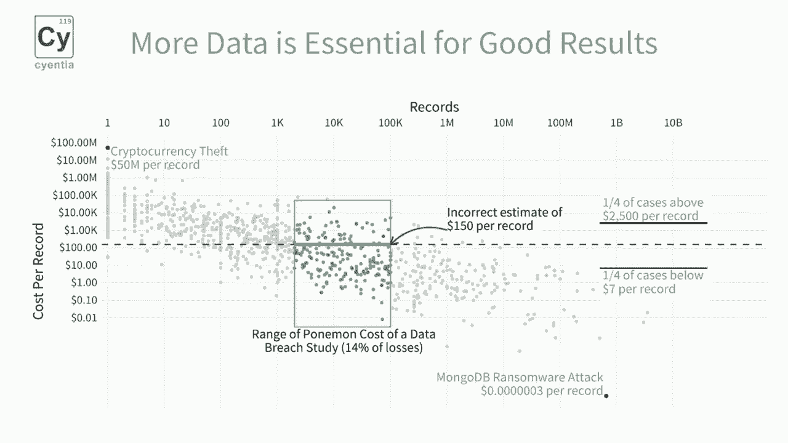
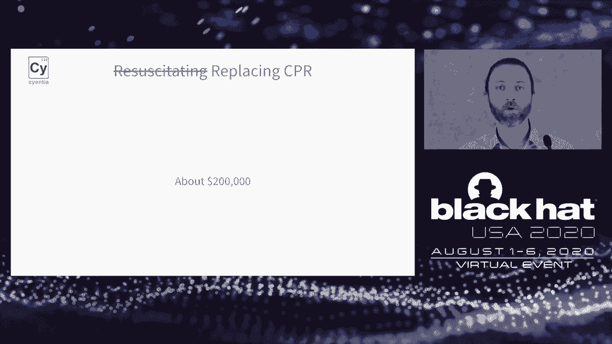
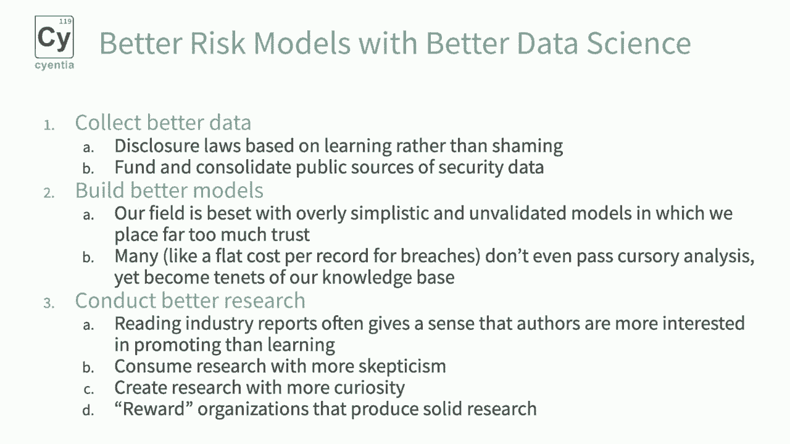

# 【转载】Black Hat USA 2020 会议视频 - P37：38 - Policy Implications of Faulty Cyber Risk Models and How to Fix Them - 坤坤武特 - BV1g5411K7fe

 All right。 Hello， I'm Dr。 Wade Baker。 I am here to talk about policy implications of faulty risk models and how we can fix them。

 I am a professor at Virginia Tech and I am also founder and partner at the Cyantia Institute。

 which is a research firm。 I put both titles on here because I represent both organizations and a lot of the data and。

 research that we'll be talking about today comes from my work at Cyantia。

 So not advertising in any way， but just to let you know the background， Cyantia， we mainly。

 work with security vendors to publish research。 And you can access most of our reports free of charge from our website。

 cyantia。com。 We research a lot of different topics and we have a history of doing data driven research。

 that results in risk modeling。 We really enjoy that kind of thing。

 Some of this goes back to my prior life。 I created Verizon's Data Breach Investigations report years and years ago。

 And that was one of the first data driven reports that looked at a large body of incidents and。

 tried to figure out how often do these things occur， which types of incidents are more common。

 than others， and to a little extent how much they cost。 Recently。

 the Cyantia Institute published the Information Risk Insight Study， or IRIS 2020。

 It was a 10-year study at thousands of incidents， both at a frequency level and the impact of。

 those incidents。 My partner， David Zversky， will talk about those in a little bit。

 so I'll kind of leave， that to that。 I will be talking about another study that we did called Ripples Across the Risk Surface。

 We looked at multi-party security incidents and how they propagate， not just in the organization。

 at which they first occurred， but downstream to affect lots of other third-party organizations。

 as well。 And we'll foreshadow a little bit another study we have coming out that looks at this topic。

 as well in terms of modeling the most extreme or heavy tail， sometimes they're called incidents。

 and losses。 So before we begin， this is a talk on bad policies that result from faulty risk models。

 So it makes sense to give some examples of what in the world we're talking about with。

 faulty risk models。 So here's a headline， we just chose a couple at random almost to demonstrate this。

 but here's， a headline that caught my attention a few years ago。

 60% of small companies that suffer a cyber attack are out of business within six months。 I mean。

 that sounds pretty dire， right？ And clearly， this is talking about the impact of incidents。

 And if you took that at face value， that could drive policy。 I mean。

 if we really thought that over half， almost two thirds of small businesses would。

 go out of business when they had a cyber attack， I think we'd probably change some things。

 You'd see greater regulation。 You'd see a lot of companies and governments taking this seriously。

 And just to put that in perspective， I mean， we're all in this COVID-19 situation here。

 I've seen wildly different estimates on how many small businesses are out of business。

 because of this pandemic。 I've seen two to 5% several times from several studies。

 Those were done a little bit early on。 I've seen up to 50%。 But none of them approaches this。

 So this is kind of in a sense saying that a single cyber attack is more disastrous for。

 a small company than months and months of a lost business from COVID。

 And you can see why this would drive potentially some policy changes。 Well。

 the thing about this is that it quotes a supposed statistic from the US national cyber。

 security alliance that found this 60% of small businesses go out of business。

 But someone from the cyber security alliance says， we don't know where this statistic came， from。

 It's not from us。 We don't know where it is。 And in fact。

 I haven't been able to find the original source for this。

 And it just kind of boggles my mind sometimes to think of how often I see this quoted。

 I guarantee if you Google for this statistic， you'll find all kinds of things quoting it。

 And inevitably， things like this influence the way that we treat， react， regulate， create， policy。

 et cetera， for security incidents。 But there's always some bit of reality in any good myth。

 That's what makes it sticky and believable。 And here are some data that we looked at。

 David will talk about this in more detail in just a few minutes。

 But this shows the cost of incidents for large and small organizations。 So I'll start at the bottom。

 less than 100 K， if that's your annual revenue， the typical。

 the median loss amount for an incident is about $24，000。 That doesn't seem very much。 But again。

 if you compare that to a business that does 100 K in revenue a year， that's about。

 a quarter of their annual revenue。 It's a lot。 Nobody wants to lose a quarter of their annual revenue。

 If you go upstream a little bit to the greater than $100 billion organizations， they have。

 a median loss of 292，000。 That seems like a lot more money。 But when you kind of do the math。

 you realize that that represents a tiny， tiny， tiny fraction。

 of their annual revenues for a $100 billion company。 And again， for that mom and pop shop。

 it's about a quarter of their revenue。 So the point is that while we find no evidence that 60% of businesses。

 small to medium businesses， go out of business after a breach。

 there is good evidence to suggest that they are disproportionately， impacted。

 They feel the pain of incidents to a greater degree。

 And we should take that into consideration as we figure out what controls to put in place。

 how to protect small businesses and policies to do that。

 I'm very pleased to be here speaking with the Black Hat crowd。 For our second myth。

 we're going to talk about a report that came out earlier this year talking。

 about cloud misconfigurations costing companies nearly $5 trillion。

 But when you first hear that about 196 breaches with 33 billion records being exposed， that。

 5 trillion may sound about right。 But if you give that a little additional scrutiny。

 you start to pick away at that number。 For instance， $5 trillion is 25% of the US GDP。 That's huge。

 That's a quarter of the US economy。 From a world economy perspective， that's 3。

5% of the global economy。 Or to put it into a different perspective。

 that is one and a half trillion dollars more， than the US spends on healthcare alone。

 The US spends more in healthcare than any other nation。 We spent $3。5 trillion on healthcare。

 What we're saying is that these breaches cost companies， they actually incurred a real。

 cost of $5 trillion。 At this point， you should be scratching your head and saying。

 "That doesn't add up。 We're not actually seeing that much。"， So where do these numbers come from？

 And they come from， if you read down the report， there's this line about breaches of cost。

 by cloud misconfigurations from 2018 and 2019 that were multiplied by a cost per record。

 value that comes from， that's very well known， comes from the Poneymond Institute 2019 report。

 of $150 per record。 So what was done here is they took 33 billion records multiplied by $150 per record and。

 came up with a 5 trillion mark。 That's a lot and we'll pick some more at that as well。

 This also means that the cost of companies due to breaches by cloud misconferations is。

 more than 12 times the amount of worldwide investments just in cloud services。 So AWS， Alibaba。

 Google， Azure， you put those all together at the cost of using these infrastructures。

 incorrectly was 12 times how much we've actually invested into them。 That just doesn't add up。

 So what's the reality behind this？ So this is a chart we'll talk more about in a few minutes。

 But for right now， what I want you to focus on is that we have all of these， these are。

 10 years of breaches， each dot represents a breach with a number of records and then。

 how much that actually cost。 We're talking about verifiable costs that companies actually incurred from all these breaches。

 And the thing to notice here is that it is very spread out。

 We have cryptocurrency way up there with $50 million per record。

 We have this MongoDB event way down the bottom left hand corner there， bottom right hand corner。

 of the screen there that is three millionths of a cent of a dollar per record。

 Great deals of variety and taking a $150 cost per record is flat out wrong。

 And actually greatly overestimates the cost of small breaches and underestimates the cost。

 of large breaches and overestimates the cost of small breaches。 To put it more succinctly。

 a single cost per record simply doesn't work and should not， be used。 It just is a bad metric。

 It's a bad model。 It underestimates the cost of smaller events and vastly overestimates the cost of large events。

 So now that you've been presented with these two myths about frequency and the cost of。

 these models， you may be thinking， well， everything's terrible and I should just choose。

 a different profession。 And perhaps that's not a bad thing perhaps。

 But I'd like to encourage you to think more positively and that not everything is terrible。

 We can actually do better。 This is a very exciting time in terms of where the industry is from maturity level that risk。

 managers， policy makers， security researchers can do better than this。

 With just a little bit of effort using publicly available data sets， we can create much better。

 models and actually have much better policy decisions that are driving from these models。

 So at San Antonio， we started this effort with a report that we published March of this， year。

 the Information Risk Insight Study or the IRIS 2020。

 And this is our first of a series of efforts that we have underway to help provide data。

 driven models for better estimating the loss side of the risk equation。 To do this。

 we partnered with Advisin who has a feed over 100，000 publicly discoverable， breach events。

 These are all events that can be publicly verified through court records， through SEC， filings。

 through news clippings， et cetera there。 And we chose a 10 year history from the beginning of 2010 to the end of 2019 that contained。

 over 56，000 events with breach data。 We can use this to build some better models and actually make better policy decisions。

 So let's talk through some of these elements and some of these findings。

 The first of which is with a hat tip to Sam Savage and the flow of averages here is we。

 plotted all of those breaches。 So we have a histogram that shows how many losses that we had and then we have a smooth。

 density plot。 Keep in mind that we're looking at a log scale at the bottom of this。

 So we'll go from 100 to 1000 and powers of 10 all the way up to 1 billion or greater， losses。

 If you've been working with COVID data， for instance， fairly recently， these kinds of。

 log charts are going to be very common to you。 The first thing to notice from this is that we have a median loss or a geometric mean。

 which are two measures of typical or ordinary losses are about that $200，000 mark。

 And that's a great finding right there。 We can say for the data that we have in our data set of real publicly-discosable breaches。

 the typical cost is about $200，000。 So there's one takeaway right there。

 Now if you compare that against the average loss， which is just taking all of the losses。

 and dividing it by the number of events that we have， we have an average loss of $19 million。

 That's saying that nine out of 10 breaches are less than what is the average or typical， loss here。

 So using a standard arithmetic mean， if you want to be fancy about it or a typical average。

 is a bad way of estimating losses。 It's a really bad estimation of losses。

 And this is because losses are a highly variable。 The typical loss as we see here and going forward is not that large。

 but there are large， events that are very bad。 There's this tail risk element to it。

 And now we return to our chart。 We're better able to talk about what are some of the things that we see there。

 So what we're looking at here is all of the 56，000 events that we have， the number of。

 records as well as the cost per record estimate for those breaches。

 Each dot represents a single breach。 And we have a single line on here showing the typical cost per record metric of $150。

 per record。 This orange box that we look represents the data set from which that $150 per record was。

 drawn from。 This is the bounds within the pointy-man study there。

 And that tends to be the go-to metric for many people when they're calculating losses。

 That ignores everything that's outside of that box。

 Everything to the right of the box where we have a much lower cost per record and everything。

 to the left of the box where we have much higher cost per record is completely ignored。

 from that average。 And we can say that a quarter of the cases that we have here costs more than $250。

000， per record as well as a quarter of the records are below $7 per record。

 So nearly 50% of the data set is way outside of that $150 cost per record。

 And again just to note that we're using a pseudo log scale here on this chart。

 So the differences of just a little bit vertically have profound impacts upon the actual values。

 involved。 So I don't want to say that the cost per record should never have been used。

 It was a great start but it gets much more attention than it should be used today。

 And we can do much better today and should not be using aesthetic cost per record for。

 anything when we're talking about losses。 We can and must do better and we can do that with just a little bit more data and better。

 analysis。 So we have these measures of what happens at a global scale but ultimately for a risk。

 manager and from people that are doing regulation they care about what happens at an individual。

 company level。 And so we broke this information up by the revenue size of organizations where we have。

 less than $100，000 of annual revenue all the way up to the very largest and large with。

 over $100 billion of record。 And we have two individual measures here。

 We have that measure of typical which is that median or geometric mean of central tendency。

 and then we have an extreme value。 That extreme value represents a 95%。

 So only 5% of the time will we see losses for our largest and large with over $100 billion。

 of annual revenue of $26 million or more。 Most of the time our costs are half a million dollars for these publicly disclosed up reaches。

 You'll notice here there's a general trend here that for the large companies when you。

 start to get up to that $1 billion or more they tend to stabilize their costs。

 And this is interesting from a policy perspective because perhaps there's some stabilization。

 going on from as you get to a certain economy of scale， a certain size you can have dedicated。

 security staff your controls are more mature and you're able to contain those losses more。

 Whereas for those small firms less than $100，000 even a million dollars or less the losses。

 are not that are much smaller but they hurt a lot more。 So a firm with less than $100。

000 of annual revenue has a 95% chance of having a loss， of less than or equal to $109，000。

 You may say well that sounds okay but if you're only bringing in $100，000 per year and you。

 have a 5% chance of having a loss that is greater than your annual revenues that's a。

 firm material size event。 We can turn this around and look at frequency as well。

 So now we're looking at frequency we're taking all of our events and we're comparing against。

 the size of the US economy。 This is a US economy specific figure because those are figures that we have the ready access。

 to how many firms are in each of these buckets。 We use the advise and data set to get this information but you can use it done in Brad。

 Street you can look at the US Census Bureau and you can see that size does matter but perhaps。

 not in as positive a way as it does for losses。 So for those firms that have $100，000。

000 or more they have a 75% chance of having one， of these publicly disposable breaches in any given year。

 Whereas the small firms partly because there's just so many of them out there very small。

 chance you know less than a 0。07% chance of having one of these breaches out there。

 The takeaway from this is to focus and realize that a single estimate cannot represent all。

 the complexity that we have here。 Whether that's a single cost per record etc。

 is just a bad way of representing losses。 So what difference does this really make？

 You may say well you sure David that might sound great from a mathematical perspective。

 but what's the implication from a policy perspective？ Well the difference is really stark。

 If we were to take that $150 cost per record and multiply it across all of our cases。

 In this case we're looking at a total of 1000 different cases。

 That would result in an overestimation of the size of these breaches by $1。7 trillion。

 Let me just read that back。 If you are using the $150 cost per record value against these 10 year history of breaches。

 there is now over $1。7 trillion of error。 You are overestimating the impact of these breaches。

 The case is also present though not as extreme on the underestimation where you're saying。

 there's $5。2 billion in US dollars of losses that were actually experienced by companies。

 that would not have been captured if you use that $150 cost per record。

 We're not saying that breaches aren't as bad as we thought only that using a single。

 cost per record is actually actively harmful。 It's worse than useless here。

 So the question is if cost per record is beyond resuscitation how do we replace it？

 And this is a clip from one of my favorite movies。 I had soccer proxy by the Cohen brothers there。

 We don't necessarily need to have a room full of grace due to the countenance to get to。

 what will a breach cost。 If you are looking to replace a cost per record you can say with a single great degree of confidence。

 that the cost will be about $200，000。 If you just need a fire of something very quickly that is a great metric to use。

 But if you're willing to use a little bit more data and this is information that's publicly。

 available and freely available in our IRIS data set。

 You can say that you can actually say what is the type of loss that we're looking at in。

 terms of the number of records and then what is the probability we will have this loss， or greater。

 So to read this chart you can look at the 10，000 record loss and say there is a 35% chance。

 about a one in three chance that with a 10，000 record loss our losses in terms of cost will。

 be $1 million or greater。 To read another line off of that if you look at the $1 billion firm if you look at the。

 $1 billion record firm they have about a 55% chance of having a $10 million or greater。

 loss for any given public disclosure breach of $1 billion records or more。

 And this is a chart that we actually put in the IRIS and we often recommend that people。

 clip this out laminated and stick it in your wallet。

 It is a handy chart to say how can we do just a little bit better。

 So what does this all mean from a policy perspective？ Well first of all losses aren't limited to。

 excuse me， first of all the small and medium， business impacts are very disproportionate。

 Probably disposable breaches hit the small firms much greater than they do the large。

 firms in terms of the materiality of these breaches。

 While they are not hit as often as their larger peer groups the impact these small firms。

 can be really large because losses are not evenly distributed。

 Most of the time losses are not material but for these small firms and if you hit the。

 heavy tail of losses there is very real costs involved here。

 The regulatory impact is from a disclosure laws。 We have a very punitive attitude generally right now towards most disclosure both from。

 a public press perspective as well as from a fines perspective and then the impact is。

 on cyber insurance and catastrophic modeling。 Is that while the typical losses may not be that large the edge cases the once in a hundred。

 year flood type scenarios are very real。 But we can go even beyond just the single loss event and talk about what is the effect。

 upon multiple organizations when an upstream company has a single loss。

 Single companies are real and it's the area that we tend to make most of our analysis。

 on however we know that companies are networks they have supply chains。

 To talk a little bit more about supply chain effects and how these breaches can spread。

 throughout the whole network that is involved in the organization we'll go over to my East。

 Coast colleague Dr。 Wade Baker。 Alright I appreciate that David。

 I am going to pick up kind of where David left off there he talked a lot about first party。

 risk and cyber losses。 I want to look a little bit at third party risk and how bad models and bad analysis in。

 that domain can kind of skew policies and how we treat that risk。

 So I mentioned a while ago a study that we did called ripples across the risk surface。

 This was in a joint project between us and risk recon。

 It used the same advise in cyber loss data set that David just talked about so I won't。

 go into that in detail again but we chose a different sample of incidents from that data。

 set for this particular study given the focus of this being on third party related risk。

 So in that data set one of the interesting things about it is it shows incidents that。

 are related in some way it has this notion of sets。

 So if an organization is impacted by a breach or suffers a breach and lots of other organizations。

 are also impacted by that it associates those so that we can tell that hey that's that's。

 a multi-party event we kind of call these ripple events that's the hence the title。

 But we identified 813 of these in the advise and data set we isolated those out for study。

 Those 813 events affected 5，430 different organizations which is pretty incredible when。

 you think about again those ripple effects are really spreading out far talk more about。

 that in a minute。 And you know we saw these multi-party events affecting anywhere from 3 to 131 different。

 organizations from a single event again。 Alright so doubling down on this ripple metaphor I don't really like this chart on the left。

 of the slide here but hopefully it's a visual that helps and this is an example of the American。

 medical collections agency。 They suffered a breach and this one got a lot of attention not necessarily for AMCA maybe。

 you've never heard of AMCA but you might have heard about the quest diagnostics breach。

 Well the interesting thing about that it wasn't actually quests breach。

 AMCA was the organization whose systems was breach and from where the data was stolen。

 But it was a multi-party breach because the nature of the business relationship between。

 AMCA and quest diagnostics and lab core and bio-reference and a lot of other organizations。

 in that domain they would provide their customer data to AMCA for collections right。

 And so you have this amassing of data from this data supply chain if you will into AMCA。

 and so AMCA is breached and all of these other organizations suffered loss events。

 And like I said this is an interesting case because those other organizations lost money。

 it impacted their reputation， some senators sent letters saying that hey you know why did。

 you allow this to happen？ What's wrong with your third party risk management？

 This is your responsibility and it was just was not seen as just an isolated event for AMCA。

 It was very much a third party risk incident and seen that way and there's been a lot of。

 discussion in and around regulation policy since then it's kind of maybe a wake up call。

 if you will in that sense。 So kind of the question becomes alright that's an anecdote of what we're talking about here。

 but how actually common are these types of incidents。 And they're becoming increasingly common。

 This is a chart that shows if we rewind back to 2008-2009 we had shy of you know 40-ish。

 events in a year that were these ripple events or multi-party security incidents and then。

 it starts to tick up。 And this is a little misleading in that it looks like it peaks at 2016 and then drops。

 off below 2008 levels in 2019 but that's actually a lag in the reporting process more。

 than an actual trend。 So the gray bars are our best estimate of what the actual data will be once everything is。

 accounted for and once enough time has lapsed to get all of this in the data set for study。

 So bottom line， increasing at about a rate of 20% a year you might ask why？ Well。

 think about all the trends that we see you know very few organizations now do everything。

 they do independently or isolated。 We are very very connected or very interdependent。

 Lots of outsourcing lots it from an IT and non-IT perspective and this basically creates。

 a web of interdependencies where if one organization is impacted almost inevitably others are going。

 to be impacted in some way as well。 And that's the environment that we live in and I think this chart shows that pretty well。

 But that's not the end of the story those main events the center of the ripples are increasing。

 But that's just part of the picture。 There's a real iceberg scenario going here and we see maybe those central events but what。

 we don't always see are the downstream impacts of those events and this shows that in those。

 813 ripple events there are almost 5500 different organizations impacted in secondary or downstream。

 fashion。 And you know understanding that is really the goal of this research trying to account for。

 those kinds of losses。 One thing that's interesting to note is that all sectors don't generate or receive ripple。

 events equally。 In other words some are more prone to generate these kinds of multi-party cyber incidents。

 They're the central AMCA like node。 And then other types of organizations are more prone to be impacted by or receive these。

 ripple events。 So if you look at this slide I'm not going to go into all the detail because you can read。

 the report if you want that but that dotted gray line or dashed gray line industries that。

 are on that line are pretty much equal in terms of generating and receiving to the extent。

 that they're above that line the blue dots in other words they receive proportionally。

 more incidents than they generate。 If you're below that line orange dot then you generate proportionally more than you receive。

 And if you kind of look at some of these you can see some trends you know national security。

 and international affairs are a more often the receiver of these types of events。

 There's several in the manufacturing chemical manufacturing apparel manufacturing etc。

 More often on the receiving in accommodation sector。

 And I put this up here because if you think about this from a policy perspective it ought。

 to change the way that we set corporate policy for dealing with third party and supply chain。

 risk and perhaps at a larger level you know more of a international or societal level。

 Aside from sector there's a size trend going on here and let me set up this chart for you。

 so we're clear on what it means。 Let's just say above the line with the orange bars。

 So the way you read this is that first bar far to the left says 8% of the central the。

 central node firms in ripple events have less than 10 employees and if you go over 36% that。

 tallest bar 36% of the central firms have between 10，000 and 100，000 firms。

 So if you kind of the takeaway here is that for the organizations that tend to generate。

 the ripples the central node they tend to be larger right they are the sourcing type enterprise。

 organizations in a supply chain。 On the bottom side the blue bars are giving the same kind of view for the receiving end。

 of these ripple events whereas on the left it says 17% of downstream firms have less than。

 10 employees and so on so that is skewed over on this side meaning that in general the organizations。

 that receive or are impacted by ripple events tend to be smaller organizations。

 So all of a sudden we have this inequality here the larger organizations are the ones generating。

 these events and the smaller organizations are the ones receiving them and since these。

 are working together they kind of have perverse incentives right they're not aligned。

 What do you do about that especially if those large organizations are the ones that need。

 to secure their systems but they're not feeling the sum total of the impact of those incidents。

 someone else is it's kind of hard to encourage them to improve their security posture。

 And I got a couple more slides here just summing up the losses associated with these events。

 mainly we've looked at frequency。 But this compares the single event losses for these multi-party or ripple event losses。

 So the median just a single isolated security incident the median cost according to this。

 data that's set that we looked at was 77，000 and the 95th percentile a more extreme right。

 tail event was 16 million。 If you compare that to the orange mound therefore the ripple events multi-party events the median。

 was a million dollars and the extreme right tail 95th percentile is 417 million。

 So clearly not even at the same ballpark orders of magnitude higher cost for these multi-party。

 incidents than the single party events。 And this is you know admittedly cheating a little bit because we're summing losses for。

 multiple organizations for those multi-party events。

 But I think it also at the same time accounts for their greater community or societal impact。

 because they do have a larger impact on the economy。

 Perhaps more apples to apples or equitable comparison is in this slide where we duplicate。

 the single party median of 77，000 just like we talked about in the last slide for a single， event。

 And then we compare that in the blue mound to the loss that a downstream organization。

 has in a multi-party incident。 So this is now a single organization compared to a single organization the difference being。

 the central firms versus downstream firms。 And the downstream firms lose their typical or median loss is about half of what the single。

 party firms are。 But the message for me here is it's not all that different。

 And in fact the blue tail is fatter and longer out to the right indicating that there's a。

 higher propensity for these downstream firms to suffer more extreme losses than even single。

 party events。 And that's kind of astounding when you think about it that somebody else's breach can impact。

 your organization about as much as you having your own breach。

 And you can't do anything about it is the other thing。

 You can't lock their systems down so that they're not hacked。

 You can't eliminate vulnerabilities in their infrastructure so that they're more resilient。

 and things like that。 So that's one of the issues here where policy comes into play because you can't control that。

 And that's where I wanted to sum up implications of poor third party risk models here for this。

 last slide。 There's a few takeaways。 First third party risk policy mainly protects sourcing firms the large enterprise buyers。

 from the typically smaller suppliers in their in their supply chain。

 Most of the time that's what it's set up you give them a questionnaire or you assess their。

 security but that's mainly geared toward protecting the sourcing firm rather than protecting。

 the suppliers。 But we've shown in this research that those downstream organizations those smaller suppliers。

 are certainly at risk from their upstream sources sourcing firms。

 But they're not protected in any meaningful way by policy or or many controls。

 And it kind of makes you wonder is there a more equitable and effective approach to managing。

 risk for the entire supply chain rather than every single organization or a central sourcing。

 firm being the one who secures themselves and let everybody else fend for themselves。

 There's also I see the research suggesting a type of bull whip effect for third party。

 risk in supply chain literature the bull bull whip effect has been studied for years。

 Short story there is if you are trying to get products to arrive at a given place at a given。

 time in the right quantity any kind of distortion in ordering and information traveling up and。

 down the supply chain gets worse the farther up the supply chain you go。

 So if a retail store sends a signal send me X number of parts the transportation organization。

 receives that then the supplier receives that then that gets to the manufacturer by the time。

 it gets to the manufacturer they retool their supply chain and they're creating a different。

 number of parts and it's all screwed up in that amplification is called the bull whip。

 effect because it gets worse the farther from the source。

 And I kind of wonder is there a similar thing here in cyber risk management a third party。

 cyber risk and can we from a policy perspective help that with with more aggressive info or。

 intel sharing across a supply chain so that together we are better aware of threats that。

 were more prepared for those threats that that the weakest link in the chain so to speak is。

 isolated and fixed so that you know all organizations don't fall for the insecurity of one。

 And then finally a recognition of data breaches as a form of negative ex externality。

 This is really driven the development of consumer data privacy in other words my organization。

 that's owned by Facebook or Google or Apple or whatever you know regulation has increased。

 over the last decade or two to protect my information and give me more management and。

 control of my information from those organizations that harvest that that and they are regulated。

 to a higher degree。 But there's really no no equal concept for when organizations are the quote consumers。

 you know like we've shown these smaller type suppliers are disproportionately impacted。

 by these multi-party cyber incidents。 What do we do about that you know does there need to be equivalent policy and regulatory。

 work done to protect them give them more ownership of their data and hold the central sourcing。

 firms accountable。 So I'm going to redo a transition there if that's okay。

 So with that I'm going to hand it back over to David Siversky to finish this off with。

 some conclusions in the Seattle office。 So so far we've heard of the common miss from a frequency and loss perspective we've。

 talked at length about the loss implications from firms we've talked about ripple effects。

 and all of what this means from a policy perspective。

 I think you try to wrap this up with three main elements this is on the effects that。

 bad risk models have upon policy and policy decisions how to correct some of these policy。

 choices and how to fix these risk models what's a path forward to actually do something constructive。

 here。 So first little hat tip here to Doug Hubbard's the failure risk management and how to fix。

 it we'll talk about the failure of policy and how to fix that。

 First of all is the realization that the burden of regulation affects smaller firms much more。

 than it does larger firms。 Larger firms can afford dedicated security staff they have more legal staff they can afford。

 the more big ticket enterprise level control work that's out there and they can be very。

 successful they seem to be successful evidently at containing the cost of these breaches。

 The smaller firms tend to be disproportionately affected they don't have the resources to。

 then to deal with this that small doctor's office that has a single administrative assistant。

 that is working scheduling as well as is their HIPAA security officer may just simply be。

 overwhelmed and then when they do have a implication of new regulatory control or a fine they're。

 going to be hit much harder than that large hospital network for instance。

 Our disclosure laws are again very punitively enforced right now between the new cycle and。

 the regulatory fines out there it is not to a firm's advantage to disclose breaches unless。

 they have a regulatory requirement to do so so we can help that out by both continuing。

 along with disclosure but making it less painful and that we are trying to get more information。

 about breaches rather than simply penalizing the firms when they eventually do have one。

 And then finally our policy and contractual remedies for breaches are non-subtle our。

 nature of remedies when we say okay you've had this breach we're going to sign some fines。

 to you there are based upon bad models this cost per record valuation that we spend so。

 much time talking about this actually is a cornerstone of how many people think about。

 losses and they take these very large estimations of losses at face value。

 So how can we go about fixing that well some of it may be fixed through specialization of。

 security concerns so those small organizations there's a well-known metric on saying about。

 don't roll your own crypto maybe the we're seeing more specialization of these security。

 concerns they don't roll your own point of sale system as well use dedicated firms and。

 contractors to work on these things we do know that firms respond to regulatory regimes whether。

 that be something like PCI DSS HIPAA etc。 there these are sometimes slow moving tools but they。

 are effective and that organizations do respond to regulatory requirements that are enforced。

 upon them they they do do work they may not move at the speed of technology but they are。

 effective but most importantly we think we need to get much better risk models to inform。

 policy and we think there are some three or four main steps that we can do to get there。

 today and we do that by getting better risk models with better data science and we do。

 that through three main points the first is to collect better data again this disclosure。

 laws we need them to be based upon learning rather than shaming there's a call that Alex。

 Hutton made several years ago about having a equivalent of a national traffic safety board。

 that investigates accidents but not just on a automobile accidents or an aircraft accent。

 but on cyber accidents as well we actually need to get to a better place where we are。

 learning not just from the actual breaches but the near misses as well the new cycle that。

 we have out there where we are continually reporting early information out there but never。

 go back to actually say what the actual outcomes were doesn't do us any services we also need。

 to fund and consolidate better public sources of security data we do think there's a lot。

 of opportunity here for commercial fees and making enriched data sources available but。

 there also needs to be a public good data set out there where researchers where companies。

 where firms can say here is the repository of breach information and let me use that to。

 make better decisions for my firm how can policy workers use this to make better decisions。

 for their constituencies as well well we do that through building better models our field。

 is currently beset with overly simplistic and frankly unvalidated models in which we。

 place far too much trust we see a report comes out and that looks that may validate our particular。

 prejudices there and we go with that many of these like the cost per record event doesn't。

 pass even a basic analysis yet becomes a really unshakable tenant of the popular zeitgeist。

 and how we look at these events and then finally we need to conduct better research over at。

 San Antonio we think we're part of the solution for this but there are other firms that are。

 doing great research as well in fact as part of the San Antonio Institute we maintain the。

 San Antonio library which is a public index of all the vendors sponsored and self originated。

 research that's out there so this is all the research apart from the academic side that。

 security firms etc are doing right now and a lot of it is really great there is some。

 portions of it though that is often much more in our opinion that is focused more on promoting。

 rather than learning and we like to see that the the learning research gets promoted more。

 by doing better learning that is an indication in our opinion and in the opinion of the organizations。

 that we speak to and the buyers that we talk to that learning through reports is an indication。

 that a company is trustworthy and that the core products that they're producing and then。

 selling are actually more trustworthy as well we want to you know create research that has。

 more curiosity that goes beyond just the service levels and that involves deeper so。

 that we can make this information available to people that are on the front lines that。

 are very busy overworked and need to make a decision we think that we can reward organizations。

 that produce that solid research so with that I'll thank you very much for all of your attention。

 there and I look forward to your questions thank you。

 Hello everyone and thank you for attending today if there's any questions that we didn't get to in。

 the chat please feel free to reach out to us on this or any other questions at research@siantia。com。

 that's research@siantia。com thanks again for attending and enjoy the rest of your conference。

