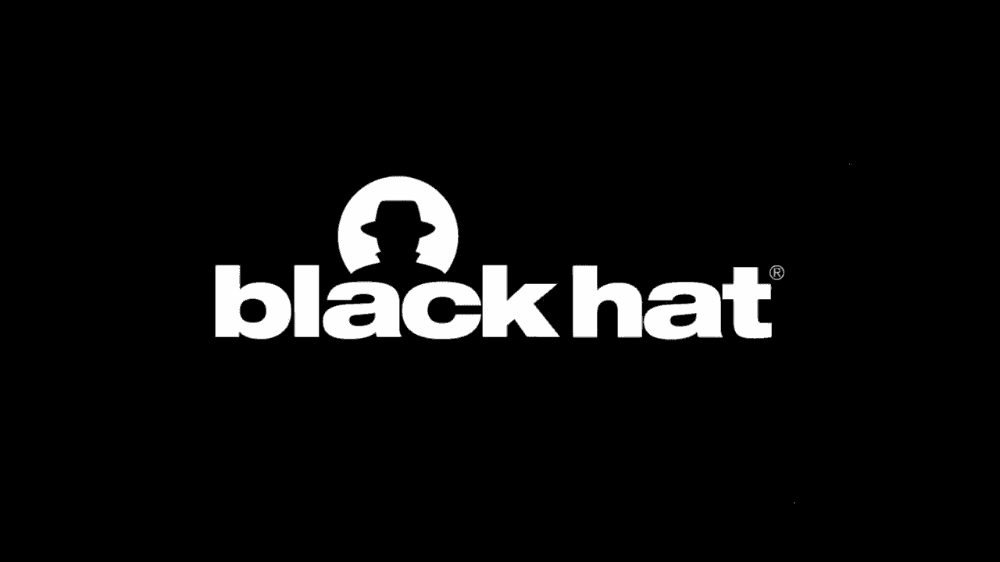
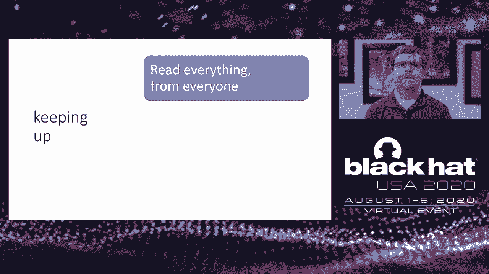

# 【转载】Black Hat USA 2020 会议视频 - P38：39 - A Little Less Speculation, a Little More Action - Deep Dive into Fuchsia's - 坤坤武特 - BV1g5411K7fe

 [MUSIC PLAYING]。

 Hi， folks。 I'm Matthew Riley。 I'm a software engineer at Google。 And today。

 I'm going to talk about the work we've， done to mitigate speculative execution side channel。

 vulnerabilities in Fuchsia。 Before I get started， I want to make sure。

 to recognize the folks who were actually responsible， for most of the work I'll be presenting。

 The mitigations we're going to talk about， were implemented by Venkatesh Srinivas。

 An Anthony Steinhouser wrote most of the tests， in the safe side project that we're going to talk about later。

 Writing on OS has never been easy。 But for a long time now， it at least。

 seemed like something anyone could try。 You know， the docs are right there。

 Go ahead and set up your page tables， put some instructions in the right place， and bam。

 your toy OS can print to the screen。 Start swapping CR3 like the software developers。

 manual told you to， and you'll be on your way， to having two whole processes。

 But with the rise of speculative execution side channel bugs。

 the relationship between the OS and the processor， has gotten a lot more complicated。

 Some boundaries that we used to think the processor would。

 enforce are now joint efforts between the OS and the CPU。

 And every new attack just makes things harder， because it's always easier to find details about the attack。

 than about how to mitigate it。 My hope for this talk is that it could。

 have served as a blueprint when we were first working， on dealing with these attacks in Fuchsia。

 We'll go over a bunch of different vulnerabilities， and talk about what it looks like to fix them。

 First though， let me give a quick overview of Fuchsia。

 Fuchsia is a new open source operating system from Google。 It runs on 64-bit x86 and ARM， and it's。

 built around a microkernel called Zircon。 As a microkernel。

 it's drivers run as user-space processes， rather than in kernel mode。

 And in addition to process-based multitasking， Zircon implements a hypervisor to run VMs。

 with hardware virtualization。 Next， I need to do a really quick tour。

 through some CPU concepts we're going to need later on。

 The job of a CPU is to manage some architectural state--， the contents of registers and memory--。

 and then update that state according， to a sequence of instructions。 Some instructions are slow。

 like a memory access that， needs to go all the way to RAM。 To hide that slowness。

 the CPU reads ahead， and puts a lot of upcoming instructions into a reorder buffer。

 The CPU figures out the dependencies， between these in-flight instructions。

 and schedules them to run as soon as their inputs are ready。

 Instructions that have finished executing， will retire one by one in program order。

 committing their changes back to the architectural state。 This works， and it makes things faster。

 But we can only read so far ahead before we get to a branch。

 and we're not sure which instruction to read next。 To keep the reorder buffer fed。

 we use branch prediction--， a set of heuristics that look at how the program's， behaved so far--。

 to guess where control is going to end up next。 We follow that guess。

 and we start executing instructions， speculatively。 This can happen recursively， and we can end up。

 several predicted branches deep。 The results of the speculatively executed instructions。

 are kept in the reorder buffer。 Eventually， the branch resolves。 If it turns out we guessed right。

 great。 The instructions retire and we keep going。 But if we guessed wrong， we need。

 to throw away the results， rewind， and start again。 In computer architecture terms。

 the misspeculated or transiently， executed instructions are squashed。 Thankfully。

 branch predictors have gotten pretty good， and we don't usually end up throwing away a lot of work。

 Some instructions can fault based on their inputs。 Think of a memory access or a divide。

 Those instructions have an implicit control flow edge out， to a fault handler。

 But CPUs tend to be optimistic。 They assume these instructions won't fault。

 and they go on executing instructions speculatively after them。 If it turns out they do fault。

 remember， that the processor has to wait to raise that fault。

 until all of the previous instructions retire， so that the architectural state is consistent when。

 the fault handler runs。 Now that we've talked about speculative execution。

 let's move on to side channels。 Now， defining side channels is a bit squishy。 But for our purposes。

 we'll say that a side channel occurs， when a system gives off information unintentionally。

 because of details outside its core abstraction。 Some of you have probably heard of VanEck freaking。

 This is an attack that lets you recreate the image。

 from a faraway CRT by capturing the EM radiation， from its scanning electron beam。

 The monitor was designed to be a monitor， and its designers only thought of it as a monitor。

 But it ended up being a pretty effective transmitter， because of the way it was implemented。

 CPUs can leak a lot of information through side channels。

 Some of them require physical measurement of the chip， like watching its temperature or power usage。

 But others can be detected just by running code， on the same machine。

 We call these software observable side channels。 One of the most effective software observable side。

 channels available to us right now is cache timing。 As we know， reading from RAM is slow。

 So to speed things up， CPUs cache recent memory accesses。

 But because the whole point is that reading from cache， is faster。

 you can now tell whether something was accessed， recently by measuring how quickly you can read it。

 You can also bring your own data into cache， and then measure to see which parts of it。

 have been evicted due to memory accesses elsewhere。 Either way， the cache introduces a side channel。

 that leaks memory accesses read by other code， executing on the system。

 How does this become a speculative execution side channel？ Well。

 remember that when branch prediction sends us， somewhere to keep fetching and executing instructions。

 we hold onto all that work in the reorder buffer。 We don't know whether to commit it yet。

 But in the meantime， some of these instructions， are accessing memory。

 Some of those memory accesses are， addresses computed from speculatively loaded data。

 And all of those memory accesses are going through the cache。 They'll stay in the cache。

 even if the processor realizes， it made a bad guess and rewinds things back to try again。

 Putting that all together， we can use the cache side channel。

 to leak values that were computed in the speculative domain， even if they were computed by mistake。

 That turns out to be really powerful， because processors make a lot of simplifying assumptions。

 about how code will run in the common case。 As long as those assumptions are right， often enough。

 And as long as the processor can recognize when， the assumptions were wrong and roll things back。

 there's no harm done。 But now， we have a way to see the values that come out。

 when the assumptions are wrong。 And that is the fundamental basis for all of the attacks。

 we're going to talk about。 Here's a preview of the attacks we'll cover。

 I know everyone has a favorite， and I apologize， if yours didn't make the list。

 But these are the ones where the mitigation meaningfully， affected Fuchs's implementation。

 So they're the ones we think are most interesting to talk about。

 Let's start with one of the most straightforward attacks， meltdown。

 Meltdown affects a lot of Intel processors， and some ARM processors， too。 In a meltdown attack。

 a user process， can cause the CPU to perform a speculative load， of kernel memory。

 then leak that value， through a cache side channel so that it can be read， by the user process。

 This breaks the boundary between user and kernel mode。 Now， you might ask， sir， comes a microkernel。

 All its drivers run in user mode。 What interesting things do we have in kernel memory？ Well。

 we have the FYSMap， which is a full linear mapping。

 of the system's physical memory into the kernel's address， space。 So let's game over。

 But even if we didn't have the FYSMap， there are at least two kinds of data in kernel memory。

 that we want to protect from user mode。 The first is data that's being sent through channels。

 for inter-process communication。 Messages queue in kernel memory before they're。

 delivered to their destination in user space。 The second is state for the system's secure random number。

 generator， which we need to protect， so processes can generate keys that other processes can't guess。

 So we need to repair in the security boundary， and prevent user processes from reading kernel memory。

 How do we do it？ Well， one way is to make sure that user mode can't find， the memory。 On X86。

 an ARM， and pretty much everywhere else， the kernel is responsible for setting up page tables。

 that define the mapping between virtual and physical memory。

 These are the same page tables that had the permission bit， that the processor isn't enforcing。

 Instead of using one set of page tables， with different permissions for user and kernel memory。

 we're going to use two。 One that's active while the user process is running。

 and which has no mappings for the kernel。 And another that's active when the kernel is running。

 and that one can see the whole address space。 The thick sounds easy at a high level。

 but the implementation can be tricky。 For one thing， if the kernel isn't。

 mapped in the user page tables， how does system calls work？

 We actually need to map a small number of kernel code。

 pages into the user mode view to act as trampolines， from user mode to kernel mode。

 They swap in the kernel page tables， then keep going。 The kernel's view also needs to be。

 able to see user memory so that system calls can， read arguments and fill user buffers。

 But for defense and depth， the kernel maps everything， from user mode is no execute。

 So that even if we mess up and return to user mode， without properly swapping the page tables back。

 the process won't be able to do anything but crash。

 It might seem like changing page tables around like this， would be expensive。

 And for older processors， it was。 Changing the page tables used to invalidate the entire TLB。

 That's the translation look-aside buffer， where the processor caches virtual to physical mappings。

 That TLB flush was necessary so that a newly activated process。

 wouldn't happen to see pages that the last process had mapped。 On newer processors though。

 TLB entries， are tagged with a process context or address space identifier。

 Those tags are managed by the OS。 If a lookup happens and the tag in the TLB doesn't match。

 it doesn't return a result。 That makes it safe for us to skip the TLB flush。 So that's meltdown。

 Compromise of the boundary between user and kernel memory。

 that we were able to fix by changing how we use page tables。 Next。

 we're going to talk about some attacks that let you， hijack speculative execution and point it。

 at instructions of your choosing， which usually， means letting a target leak memory for you。

 First up is Rett to spec， an attack， that uses the RSB， the return stack buffer。

 This is a predictor that remembers where function calls。

 came from so that execution can go back there， when we hit a return。

 This can be a lot faster than waiting， for the return address on the stack to get pulled in。

 from cache or from RAM。 The RSB works great when one thread is executing uninterrupted。

 But when a context switch happens， it's possible for the RSB to become unbalanced。 Specifically。

 it's possible to context switch， into a thread that immediately executes a return。

 And that return will end up predicted， to go to an address put in the RSB by the last thread。

 This is a problem， especially if the newly executing thread。

 happens to be running in a more privileged mode， like the kernel。

 The solution is straightforward if not especially elegant。

 We just fill or stuff the RSB with enough entries。

 that it forgets everything from the thread it came from。 We do this with a long。

 chained sequence of calls， with no returns。 In Fuchsia， we do this on every context switch。

 and right after we exit from a virtual machine back， into the hypervisor。

 The virtual machine was running its own code， with its own calls and Rets。

 And we don't want that influencing the hypervisor。

 It might surprise you that we don't need to stuff the RSB， every time we enter the kernel。

 But we're safe because the kernels calls and Rets， are balanced。

 As long as a context switch doesn't happen， the kernel won't ever use an address in the RSB。

 that it didn't put there。 And if we do context switch， we'll stuff the RSB。 Next。

 we're going to talk about Spectre Variant 2， branch target injection。 But first。

 let's touch on another tool the processor uses。

 for speculative execution， the indirect branch predictor。

 The processor uses this predictor to speed up branches， to an address that's computed at runtime。

 Think function pointers used for callbacks， or virtual member functions in C++。

 When the processor executes one of those branches， it notes the source and target addresses。

 in a data structure called the branch target buffer。 Since space is at a premium。

 that buffer probably， doesn't remember the whole source address。 And yes。

 it turns out that code can induce collisions， in the branch target buffer and change the address。

 that indirect calls in other contexts will speculate to。 And that's Spectre Variant 2。

 This is really bad。 It allows a hostile user process to steer， speculative execution in the kernel。

 to an address entirely of the attackers choosing。 The attacker can easily find an instruction sequence。

 to leak the memory they care about。 Other VMs and the hypervisor are vulnerable too。

 Since this is an attack against the branch predictor， implementation， mitigations depend a lot。

 on the specific processor you're on。 Let's talk about x86 first and start with the earliest。

 and most generic mitigation available on that architecture。 Rhett Pulin。

 We want to prevent hostile branch target entries， from steering speculative execution。

 One solution is to control the entries， and we'll get to that。 But if we can't do that。

 the next best thing， is to prevent those entries from being used。 To do that。

 put a pull a crazy trick。 We're gonna convince the processor， to use the wrong predictor。

 This is a Rhett Pulin， a return trampoline。 It implements an indirect branch。

 without using an indirect branch。 Instead， we do a call from here to here。

 which pushes the return address on the stack， and onto the return stack buffer。 Next。

 we replace the return address at the top of the stack， with the address we actually wanna jump to。

 but that doesn't update the return stack buffer。 Finally， we do the return。

 And here's where speculative execution， and the real control flow diverge。

 Speculative execution is always going to follow， the RSB's prediction。

 which tells it to go back here， where speculation will stall in an infinite loop。

 Once the processor catches up， and realizes it went to the wrong place。

 it will end up going to the real target address， that it read from stack memory。

 The branch target buffer was never consulted， and so it can't be used to steer speculative execution。

 to an evil place。 Okay， that's a lie。 It turns out that the branch target buffer could be consulted。

 if we're not careful。 Remember how the return stack buffer can get unbalanced？ Well。

 what if we context switch， into the middle of a ret pulling？ The return stack buffer could be empty。

 And when that happens， some CPUs will go the extra mile， and check the branch target buffer。

 to see where to go next。 That happens on Skylake， and later Intel processors， for example。

 Thankfully， anywhere that could have happened， we've already gone to the trouble of filling the RSB。

 with benign entries， so we know it can underflow。 We're safe。 Okay， no doubt。

 ret pulling is a cute device， but how do we actually apply it， to defend our kernel and hypervisor？

 For that， we need the compiler's help。 The compiler， Quang in our case。

 accepts a new flag that says， whenever you want to compile an indirect jump or call。

 instead put the address in a register， and jump to a ret pulling thunk。

 This solves Spector variant two， for the kernel and the hypervisor。

 We still have at least two problems。 First， we can recompile the OS， but we haven't done anything。

 to protect processes or VMs from each other。 And second， sending speculative execution。

 into a busy loop is not free。 We can see the performance overhead， and compute heavy workloads。

 To address the first problem， cross process and cross VM attacks。

 Intel and AMD shipped microcode updates， to add an IBPB command， indirect branch prediction barrier。

 This command is triggered by tickling a bit in an MSR， the model specific register。

 IBPB clears the state of the predictor， so the code that runs afterward cannot be affected。

 by code that ran before on the same logical processor。

 We use IBPB when switching between processes or VMs。 One thing though。

 is you have to talk about the same logical processor。 As it turns out， a lot of chips share。

 the same indirect branch predictor， across logical processors on a physical core。

 So a hostile user process can influence， any other process that happens to get co-scheduled with。

 To fix this， processors provided another MSR called STIDP， single thread indirect branch predictor。

 Once that's enabled for a logical processor， its indirect branch predictions will never be affected。

 by code running on other logical processors。 Predictors are never shared across physical cores。

 so we don't need to worry about that。 Okay， so we've solved cross process and cross VM。

 but we'd still like to avoid paying the cost， of retplane in the kernel。

 Maybe we can just clear the branch predictor， with IVPV every time we go into the kernel。

 That would work， but the performance cost is tremendous。

 We need a way to keep branch predictor state， without allowing interference across privilege levels。

 To help us along， Intel and AMD provided another command， called IBRS。

 indirect branch restricted speculation。 As long as we trigger this。

 every time we change to a higher privilege level， user to kernel or VM to hypervisor。

 the processor guarantees that previous code， running at a lower privilege level。

 will not influence how indirect branches are predicted。 And that's great。

 On processors that support IVRS， we can stop using retplane。 Even better。

 setting IVRS prevents sibling threads， from influencing our branch predictors。

 so we can say goodbye to STIVP。 Except， we might be running on a processor。

 that didn't get microcode to support IVRS。 So we need to keep all that stuff around。

 and dynamically enable or disable it at boot。 All our indirect branches will still go to thunks。

 but with IVRS， we just swap in a thunk that does the branch。 One thing to be very careful of。

 IVRS is all about changes in privilege levels。 It doesn't do anything to protect processes or VMs。

 from each other。 We still need IVP on context switch。 All right。

 now everyone is keeping their branch predictions， to themselves。 Are we good？ Well。

 it turns out that writing MSR to trigger IVRS， on every privilege transition is still not cheap。

 So some Intel processors now offer enhanced IVRS。 This new and improved mode only needs to be enabled once。

 No more writing MSRs on every switch to higher privilege。 And it still gives us all the STIVP magic。

 But surprise， enhanced IVRS give it， an enhanced IVRS take it the way。

 Processors with enhanced IVRS no longer guarantee， that filling the return stack buffer is enough。

 to prevent it from being used for cross privilege level attacks。 Instead。

 we need to make sure we're using， a different security feature called SMEP。

 supervisor mode execution prevention。 That feature， which is enabled with a bit in CR4。

 prevents code and kernel mode from executing anything， outside the kernel。 Even speculatively。

 Since user code can only put its own addresses into the RSP。

 SMEP prevents user mode from adding any RSP entries， that the kernel will follow。

 So that's back to variant two on x86。 The story on ARM is a lot simpler。

 All the same attacks still apply， processes VMs， the kernel and the hypervisor， are all vulnerable。

 But we have a much smaller set of tools available， really just one。

 An update to the ARM trusted firmware， that clears all branch predictor state， anytime we enter EL3。

 That's the most privileged exception level on ARM， and the place where the firmware runs。

 ARM added an optimized entry point just for this purpose， but right now in Fuchsia， we execute。

 the get firmware version call， and it clears everything for us。

 Clearing the entire predictor is a pretty big hammer。 We only want to do it when we have to。

 ARM says it should be done on context switch， and on exception entry from an exception level。

 where it is judged that code might be used， to attack a higher level。 I have to admit。

 I do not know what that means。 Their docs do provide a bit more detail。

 They say we can map user pages as privileged execute never。

 which is sort of like a finer-grained SMEP。 And then we don't need to worry about speculation。

 from the kernel into user code。 Interestingly though， that note was only added。

 to their documentation in June of this year。 All that said， it's still not obvious。

 if we need to worry about user mode， poisoning kernel branches with unintended kernel targets。

 To try to figure that out， we looked at ARM's commits to the Linux kernel。

 They clear the branch predictor on context switch， just like the docs say。

 They also clear the predictor after a user mode exception。

 where the instruction pointer has ended up in kernel code。 So not a system call。

 just user code jumping， to a kernel page。 This might be what the docs meant by judging。

 that we might be under attack。 Our best inference is that the branch predictor on ARM。

 only remembers exact branch targets。 And the kernel is preventing user mode。

 from training the predictor to go to a kernel address。

 by clearing the predictor state every time user mode， tries to jump into the kernel。 For now。

 we do what Linux does。 If we learn any better， our mitigations will change。 (sighs)。

 That's all for Spectre variant two on x86 and ARM。 We did it。 Take a breath。 Next。

 we're going to talk about an Intel-specific vulnerability， called L1TF， L1 Terminal Fault。

 To understand what's going on here， let's take a quick look at how address translation works。

 on x86。 To start， we have a virtual address。 The page tables managed by the OS map that virtual address。

 to a physical address。 If we're in a VM， that's actually a guest physical address。

 and we will map it to a host physical address， using another layer called extended page tables。

 That last host physical address， is what's actually used to access memory。 In an L1TF attack。

 we craft a page table entry， that has its present bit clear， or which has a reserve bit set。

 which makes it invalid。 When we try to access the corresponding virtual address。

 the processor will walk the page tables， reach our invalid entry and raise a terminal fault。

 that causes translation to stop immediately。 The processor just makes a note。

 that this access should raise a page fault when it retires。

 But because of the special way this translation failed。

 the processor is not prevented from speculating， as though the page walk succeeded。

 and a physical address was found。 Specifically， whatever physical address happened to be。

 in that invalid page table entry。 If that address is in the L1 data cache。

 the data will be loaded speculatively， forwarded to dependent instructions。

 and then can be leaked through a side channel。 This is tremendously bad。 First。

 it means that if an OS kernel， uses the present bit to implement demand paging。

 the process whose page was taken away， will be able to read whatever the OS decides to put。

 in that physical memory。 Much worse though， is that we don't just bypass kernel protections。

 We also skip the EPT mapping， that controls which physical memory a VM can access。

 So now a hostile VM， which has full control over page table entries， can access any data in L1。

 if it happens to find a matching physical address。 This is a full compromise。

 of all memory protection on the system。 Mitigating this attack from a hostile process is pretty easy。

 We just change the code that manages page table entries。 So the physical address is zeroed。

 when the page isn't present。 We can also invert the entry。

 which lets us continue to store the physical address， in the PTE， but neutralizes the threat。

 because addresses with the hybrid set， point outside of physical memory。

 But mitigating L1 TF attacks from hostile VMs， is not as easy。 In fact。

 it turns out there is no way， to prevent a hostile VM from reading anything， it chooses out of L1。

 The only option we have， is to make sure there's nothing for them to read。

 We have to clear L1 cache。 There are already instructions， to evict data from caches。

 but we don't want to empty every cache level， just L1。 To help us do that。

 Intel shipped a microcode update， that adds a new L1D flush command。 As always。

 we trigger it by writing to an MSR。 Our hypervisor uses that command， right before we enter a VM。

 Clearing the L1 cache makes it safe for us， to start the guest VCPU。

 since we won't leave anything behind for it to read。 But unfortunately。

 we're not even close to done。 The L1 cache is shared， across logical processors on a physical core。

 So while that guest VM is running， it will be able to pick up anything。

 that its sibling hyper threads brings into L1。 That means data from other VMs。

 or from the hypervisor。 One option is to turn off hyper threading， so that obviously comes。

 with a pretty significant loss of performance。 Another option is to change our scheduler。

 so that different VMs are never scheduled together， on the same physical core。

 This is called core scheduling， and while it's not free。

 it's generally considered to have less performance impact。

 than turning off hyper threading altogether。 We haven't implemented it in Fuchsia yet。

 but it's a feature in other hypervisors， like KVM， Zen， and Hyper-V。

 L1TF is an attack of opportunity。 It requires data to be brought into L1 to be vulnerable。

 The next attack we'll talk about MDS， is even more time dependent。 MDS。

 microarchitectural data sampling， refers to a whole class of attacks。

 which happen to be unique to Intel processors。 In these attacks。

 different temporary buffers inside the CPU， are made available to speculative execution。

 while they still have old values in them。 As one example， the processor uses the line fill buffer。

 to track requests to bring data into the L1 cache。

 Let's say we issue a read-to-memory that's not an L1。

 When the processor first sees that the read won't hit L1。

 it chooses an entry in the line fill buffer to track it。

 Let's also say that memory read is actually going to fault。 Maybe the permission bits are wrong。

 Once the processor figures out that the read is going to fault。

 it sets a bit in the line fill buffer to say fault， but it doesn't overwrite the entry's data。

 And until the load retires and actually raises the fault， speculative execution can continue。

 and it will see whatever value happened to be， in the entry before。

 There are similar attacks possible， for other buffers in the processor。 Like with L1TF。

 the solution is a micro-hood update， that gives us a new way to clear those buffers。

 before we start running a new threat that might attack us。 In this case， it's not a new MSR。

 Instead， Intel dusted off an old unused instruction， and gave brand new superpowers。 Verw。

 which checks if a memory segment is writable， now clears all of the processor's temporary buffers。

 Remember that L1TF was easy to mitigate within an OS， but hard to fix across VMs？ MDS is worse。

 There's no easy OS mitigation。 We need to apply the fix every time we exit the kernel。

 and every time we're about to enter a guest VM。 Hopefully for the latter case， at least。

 the L1D flush command for L1TF was augmented， so it also flushes buffers vulnerable to MDS。

 And stop me if you've heard this one， we need to worry about hyper-threading。

 A lot of these buffers are shared， across logical processors， and there's no way to partition them。

 For VMs， the answer is core scheduling。 But now we even need core scheduling。

 for processes on the same kernel。 As I mentioned， Fuchsia does not implement core scheduling。

 for VMs yet， and no OS that I know， of implements core scheduling， for processes on a single kernel。

 Although I have reason to believe that's going to change。 Earlier this year。

 Project Zero was able to show， a real-life attack against Chrome。

 that used MDS across hyper-threads。 One last note on MDS as it relates to Fuchsia specifically。

 grabbing all these buffers takes a lot of time， more than 200 nanoseconds on some chips。

 which doubles the fastest round-trip time， for a system call on Fuchsia。

 That's not great for any operating system， but it's especially hard on a microkernel OS。

 because we depend so heavily on message passing， between user mode drivers。 Okay。

 I have one more attack to talk about。 And even though it has the number one in it。

 I saved it for last because it is the hardest to mitigate。 Now， sure。

 the work we've had to do so far， hasn't been trivial。

 Meltdown required us to change how we manage page tables。

 Spector variant two required compiler changes， and L1 TS and MDS required us to build a whole new scheduler。

 But at least we were able to implement， platform-level mitigations for those vulnerabilities。

 As we'll see， Spector variant one is not going away that easily。

 Remember that Spector variant two and Rett to spec。

 let us hijack the speculative control flow of other code， and send it to addresses we chose。

 They let us inject branch targets by attacking the implementation。

 of the branch predictor and creating collisions。 Spector variant one is an attack against branch prediction itself。

 Every implementation is vulnerable almost by definition。 Let's look at a simple example。

 Let's imagine this is a bounce check， early in a system call handler。

 We read a value if it's in bounds。 But what happens if I call this a hundred times。

 with a valid index and then the hundred and first time， with something wildly out of bounds？

 Let's assume it takes a long time to access， that num buffers upper bound。

 Maybe it's often main memory， maybe because an attacker forced it， to be evicted out of the cache。

 If the upper bound isn't immediately available， the branch predictor is going to take over。

 and send us down the path it's been trained， to think is the right one。

 We will end up using that attacker controlled index， to access out of bounds memory。

 and then leaking the contents of that memory， through a cache side channel。

 Let me repeat something important。 This is not an attack against a branch predictor。

 This is an attack against branch prediction。 The only ways we've found to completely mitigate。

 spector variant one end up invalidating decades of gains， in processor performance。

 Since we're talking about kernel code today， I won't get into some of the more advanced。

 application level mitigations that we have available， like speculative load hardening and clang。

 Instead， let's talk about how we make this bounce check safe。 We need to introduce a new primitive。

 that replaces the branch with a conditional move。 Conditional moves aren't predicted。

 at least not an x86 or arm。 This primitive lets us replace the control flow dependency。

 with a data flow dependency。 Why do we have to implement this in assembly though？

 Can't we just use the turn our operator and see， to avoid if else？ Unfortunately。

 the compiler as well within its rights， to introduce a branch， even if we didn't write one。

 we need to use assembly so we control， exactly how this is compiled。 Now。

 I'm sorry to say that writing the primitive， is the easy part。

 The hard part is figuring out where to use it。 Sure， maybe it's obvious that we need it here。

 because we're at the beginning of the system call。

 Here is what it looks like to rewrite this implementation， to be safe against Spectroveriant 1。

 But what if the bounce check is three layers deep。

 in a library function that's used by a driver implementation？

 Tools have been developed to try to find these sites， but in our experience。

 they either underreport， or don't work at scale。 We believe that the right tool for this job。

 will combine dynamic analysis， fuzzing， and data flow tracking to determine。

 what branches are exploitable and trainable， across a security boundary。

 And we're working on that now。

 I should mention one last piece of the mitigation puzzle。

 This one comes up when fighting variant one， but also applies to Spectroveriant two and other attacks。

 where we're taking advantage of speculation behavior， in a victim。 In cases like that。

 we can add speculation barriers。 Instruction sequences that cause the processor。

 to make sure all previous instructions have retired， before even starting on later ones。

 This can be a useful tool， but it's hard to know exactly， where to add them to make things safe。

 And putting them in too many places kills performance。 Oh， and if you run an AMD。

 do make sure to set， the magic MSR that makes L-fences serializing instruction， instead of a no op。

 So those are the attacks I wanted to talk to you about today。

 Here are some of the mitigations we've added， for them in Fuchsia。

 But the engineering work to keep Fuchsia secure， doesn't stop when the mitigations are checked in。

 We need to make sure they work， and we need to make sure they keep working。

 Mitigations are just another kind of OS feature， that add a lot of complicated new code。

 So how do we test them？ To solve that， we've started work on a new project， called SafeSide。

 It's an open source suite of programs， that demonstrate the sort of inconvenient。

 to micro architectural behaviors we talked about today。 These aren't just proofs of concept。

 These are robust engineering quality artifacts， that we can use to test side channel mitigations end to end。

 We're still working on adding coverage， for new side channels and new platforms。

 but our current tests have already found some impactful bugs。

 including a failure in Linux's mitigation， for Spectre variant two that broke isolation。

 between Chrome renderer processes。 I hope you'll take a look。

 and try running it on your OS of choice。 We would also welcome your help。

 in improving what these tests cover。 Wrapping up。 Today， we talked about what it's like。

 to try to build a secure OS， in a world where the architectural manual。

 tells you less and less of what you really need to know。 I walked through how we've mitigated。

 several speculative execution side channel vulnerabilities， in the Zircon microkernel。

 and I told you about SafeSide， a project that we hope will help OS developers。

 build and maintain reliable mitigations。 To close， I'd like to leave you。

 with the three tactics that we found most effective， in building mitigations that we believed in。

 First， read everything you can from every reputable source。

 Read the original attack paper with its awesome name， and very necessary logo。

 Read the responses and deep dives and white papers， from every processor vendor。

 even if you're not targeting all of their architectures。 In at least one case。

 we found the best explanation of one vendor's mitigation， was written by a different vendor。 Second。

 look at what Linux does。

 Maybe that sounds weird in a talk about Fuchsia and Zircon， but at this point。

 Linux is basically the reference implementation kernel。 And fixes for side channel vulnerabilities。

 are often checked into the Linux kernel， by the vendors themselves。

 Those fixes often require some trade-offs， or design choices that aren't made clear。

 from the vendors documentation。 So along with the code and the comments。

 make sure to read the commit messages。 I suppose it's possible there's also useful information。

 on the discussion in the Linux kernel mailing list， but I cannot in good conscience recommend。

 that anyone read LKML。 Third， and finally， test。 You would be astonished how uncommon this is。

 Use safe side or some original proof of concept code， or just something you cooked up。

 to make sure that your mitigation fixes， the problem that you think it does。

 and that it keeps fixing that problem， over time on every platform you support。

 This stuff is subtle and fragile。 And with that， I wanna thank you for listening。

 and for coming along on our journey of discovery。 I wish you many happy。

 accurately predicted returns。 - Thanks。 Hey folks， thanks， past Matt。

 And thanks to all of you for following through， however much of that you did。

 I am very eager for feedback， on what you might wanna learn more about。

 You can get ahold of me mattyr@google。com or Twitter。

 I've been following the chat and the question stream。 I haven't seen anything much。

 but I will be in the text chat for the rest of the hour。 So if anything comes up there。

 please let me know。 But yeah， feedback。 There's a poll on how you like the presentation。

 Let the black hat folks know。 And yeah， thank you again。 [BLANK_AUDIO]。

