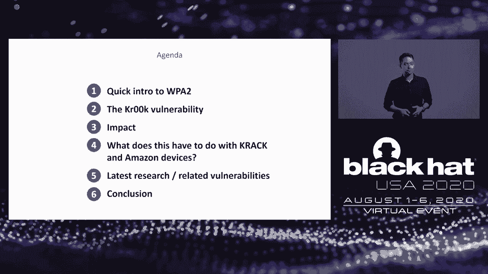

# P39：40 - Kr00k - Serious Vulnerability Affected Encryption of Billion+ Wi-Fi Devices - 坤坤武特 - BV1g5411K7fe

 Do we have any iPhone or MacBook users listening？

 What about Samsung Galaxy， Amazon Echo or Raspberry Pi users？

 I can't see you as we're streaming virtually， but I'm pretty sure a lot of virtual hands。

 were just raised。 Now what if I told you that anyone could break into your encrypted Wi-Fi communication？

 When you connect to a WPA2-protected encrypted Wi-Fi network， then even without TLS on the。

 application layer， no one should be able to read the data exchanged between your device。

 and the wireless access point。 But that was not the case because your devices。

 and not only those that I mentioned， had this， serious Wi-Fi vulnerability。

 That was the discovery of ESET's IoT research team that's dedicated to finding vulnerabilities。

 in popular devices used at home and in the enterprise。

 We feel this type of research is really important。

 We participated on a forest report that went out earlier this year， and the conclusions。

 were that consumer IoT devices are expanding the enterprise attack surface。

 Now a couple of that with the fact that most consumer IoT devices can be exploited and it's。

 a disaster waiting to happen。 Our IoT research team found flaws in a bunch of different devices in smart cameras that。

 allowed an unauthorized adversary to see whatever that camera saw。 You don't want that， right？

 In Amazon Echo， in insecure smart home hubs by various different manufacturers， and smart。

 home hubs are the gateway to your home or potentially your company if you're using them。

 in a small home office。 And the effect of that depends on what's connected to that smart home。

 so you can use your imagination。 But Crug is our most impactful discovery yet。

 That's because it goes beyond IoT in the sense of cool smart gadgets like your smart watch。

 or your smart toaster。 Crug affected billions of Wi-Fi capable devices including your laptops。

 tablets and phones。 I'm Robert Liposki， ESET's senior malware researcher。

 and my co-speaker today is Stefan， Svoranchik。 Hi？

 ESET's head of experimental research and detection。 Our credit also goes to Milos Chermach。

 who was the lead researcher behind this discovery， as well as ESET researcher Martin Kahlogenik。

 This and other types of threat research are in ESET's DNA， and it goes hand in hand with。

 our focus for the past 30 years on proactive detection。 So this is our agenda for today。

 We'll talk about Crug， what it is and how it works。 Its impact。

 how it can affect you and the security of your devices， and what you can， do about it。

 Also for the first time， we're going to disclose our latest findings into vulnerabilities which。

 aren't strictly Crug， but are similar。 Now before we get into the specifics of the vulnerability and its impact。

 let's quickly， go over some Wi-Fi security basics which are needed to understand how Crug works。

 First I'm going to talk about Wi-Fi associations and disassociations and their fore-way handshake。

 So the first thing that happens when you connect your device to an access point is called the。

 association， basically a connection。 For our purpose， when talking about Crug。

 we're mostly going to be interesting in the， reverse。 These are the associations。

 And these happen for a multitude of reasons。 They can actually occur naturally。

 for example when a client roams from one Wi-Fi station。

 to another and then we're talking about a re-association or they happen manually， simply。

 when you turn off the Wi-Fi connection of your device。

 All of these associations and disassociations are governed by so-called management frames。

 and an important thing to note， these are most often unauthenticated and unencrypted and also。

 can be triggered manually。 What could go wrong？ The fore-way handshake establishes secure wireless communication。

 Now without going into the technical details or the group key used for multicast and broadcast。

 I'll just mention that the handshake serves two main purposes。 First， it's authentication。

 To ensure that the client is authorized to connect to the Wi-Fi， for example， knows the。

 Wi-Fi password。 And secondly， for confidentiality and integrity。

 So a unique per-session encryption key is constructed。 It's called the pairwise transient key。

 the PTK。 And a part of that PTK is the TK， which stands for temporal key。

 And this is used to encrypt unicast data exchanged between the client and the access， point。

 So let's take a closer look at how that TK is used， how encryption is done in WPA2 with， CCMP。

 which is the most ubiquitous standard today。 Now I'm going to simplify the scheme。

 not going into the details of counter mode and， CBC Mac。

 Here we have some plaintext data that we are going to transmit and needs to be encrypted。

 The cipher being used in this scheme is AES。 So we have that session key， the TK。

 which was established in the four way handshake。 We have a so-called nonce。

 a number which is only supposed to be used once。 This also includes the packet number。

 These are used to generate the key stream。 That key stream is then exhored with the plaintext data to get the encrypted data。

 Then along with the packet header， this is then transmitted into the air。

 And the decryption is the reverse and Stievel will talk about that in his part。

 So now that we covered the basics， let's get to the main part。 What is CRC， aka CVE 2019 15126？

 This is a typical Wi-Fi connection between a device and an access point secured by the。

 WPA2 protocol。 The communication is encrypted using that TK。

 the pair-wise session key that was established， in the handshake。

 So even if someone else captures those wireless network packets flying through the air， they。

 wouldn't be able to decrypt them and read the content， right？ Well。

 the crook vulnerability breaks that。 Here's an example of how an attacker could exploit the bug。

 They could transmit a crafted disassociation frame addressed to the victim， the victim。

 device accepted， and disassociate and data transmission stops。 Up to this point。

 everything happened as it should have。 But after that disassociation。

 one last fragment of data is transmitted。 Only this time， as you can see。

 it's encrypted with an all zero transient key。 And the attacker can intercept it and easily decrypt the content。

 So how was all that possible？ Well to answer that。

 let's rewind and take a closer look under the hood of that vulnerable， device。

 Spoiler alert， this is the culprit behind crook， a full Mac Wi-Fi chip。 By the way。

 this particular one is from an Amazon Kindle and it's only an eighth of an， inch wide。

 so taking this photograph took a bit of an effort。 Shtayval， tell us more about these chips。

 So every mobile device， your phone， your laptop， your smartwatch， which doesn't stop reminding。

 you that you're going to probably die tomorrow if you don't make those 10，000 steps today。

 And even in your Intel Engine vacuum cleaner， if there ever be intelligent enough to vacuum。

 properly。 Everything has its own Wi-Fi chip， which handles all the Wi-Fi communication。

 In all recent mobile devices， a full Mac chip tend to be the most used kind of chips in。

 the market。 Full Macs offer better performance in terms of power consumption and speed and they are。

 easier to integrate in complete products。 This is a block diagram of one of them。

 as you can see it's fairly complicated。 This one also includes the Bluetooth part but we won't bother with it。

 We'll look only at the small part of it with manages the whole Wi-Fi encryption。

 And this is where the magic happens。 This is a Mac layer。

 short for many access control architecture。 These are the small parts which handle all the communication encryption。

 Buffers are used to store order communication frames for the time they are being encrypted。

 or decrypted。 The transmit engine constitutes the transmit data to and from the transmit buffer。

 Receive engine does the same for the receive buffer。

 The web engine encapsulates all the hardware accelerators to perform the encryption and。

 the encryption。 It implements all cipher algorithms， S-W-E-P-W-P-A， W-P-A-2。

 PSM is a microcontroller that is highly optimized for flow control operation。

 It also determines based on the frame type and association information the appropriate。

 cipher algorithm to be used。 So how the encryption goes？ As Robert explained before。

 every time a device is connected or reconnected to an access， point。

 after authentication and association， a session encryption key is generated， which。

 is then used for all the encryption until the session ends。

 The transit buffer is being filled with data frames which need to be send out。

 Web engine encrypts the data per frame with the generated encryption key and the transit。

 engine sends them away。 So what happens after the association occurs？

 The disassociation frame comes through the receive engine to receive buffer。

 State mission evaluates the frame and sends the information up the ladder。

 There the information is interpreted as okay， we are about to disconnect， let's drop all。

 the encryption keys。 A command to drop generated session encryption key is then sent。

 Since in computing you don't erase anything properly， you just replace it with zeros。

 The session encryption key is after the association over written by zeros。

 Here comes the term all zero encryption key。 This is expected behavior as no further data is supposed to be transmitted after the association。

 And it stays that way until a new session key is generated after the new re-association。

 and a new four-way handshake。 But until that happens， the transmit buffer still may contain data。

 The transmit engine needs to send them away and continues to do so as usual。

 So all data which were left in that buffer after the association occurred are now sent。

 away encrypted with an all zero encryption key。 So when you could grab these frames。

 you can easily decrypt them into public index data。 You know the encryption algorithm。

 you know the encryption key， you get the answer from。

 the header and you can easily decrypt them then。 The question is how do you identify these particular frames in the air？

 The answer is simple， you don't。 You just try to decrypt everything you see within all zero key and those frames which。

 after the encryption match a binary pattern of the plaintext data frames which is something。

 like aa aa a zero three。 Those are the ones which were formerly encrypted within all zero key。

 One can ask how much data can you decrypt after one disassociation？ Well。

 the transit buffer has a memory space of 32 kilobytes。 For comparison。

 1 kilobyte is a couple of hundred words of plaintext。

 So 32 kilobytes will be about 10 to 20 thousand words which is quite a few pages of a book。

 But you must understand that the buffer isn't always full when the disassociation happens。

 It really depends on the timing。 So what can an attack do with this vulnerability？ Well。

 there are two ways an adversary can eavesdrop on these frames。 A passive one and an active one。

 Let's begin with the passive one。 As was already mentioned。

 the disassociation occurs naturally moving around changing access。

 points low single string or just do the single interference。

 Most of the time you won't even notice because of the quick subsequent re-association。

 So let's do the math。 Since this issue concerns many Wi-Fi chips。

 somewhere where there are many of these mobile， devices in one place like a workspace for example。

 there should be a lot of them where， they are vulnerable。

 Combined with the fact that natural disassociation occurs quite often， there should be all zero。

 encrypted frames just flying around。 And yes， they are。 So let's grab them。 So what do you think？

 Have we tried to eavesdrop at our workplace？ Of course we did。 Because you know。

 sticking your own into things of people you know is always interesting。 And what did we do so？

 First we saw all vulnerable devices and access points to which they are connecting。

 But then after the encryption we saw what kind of data are actually exposed。 DNS requests。

 TCP/Http requests， website that people owed。 You name it。

 Actually everything that was until us encrypted。 Because that's another layer of encryption on the IP level。

 Now when we identified all vulnerable devices we can get them to drop even more than they。

 would normally give up for free。 How？ I can trigger disassociation between them and their access points wherever I want。

 And again。 And again。 And just like in America I can do this all day。

 And this is the most interesting thing about this vulnerability。

 Because now you can gather these partial information。 Let me get one thing straight。

 The nature of the data frames which are eventually only a zero key encrypted and can be eventually。

 decrypted to plaintext is quite random。 It really depends on the timing of the disassociation。

 But if you can invoke it over and over again the vulnerability will manifest itself over。

 and over again。 And now you're in the information gathering business。

 Just waiting until someone interesting pops out。 And it always does。

 As much as I enjoyed those animations let's demonstrate that this stuff really works。

 So we prepared a little demo in our lab so you can see the attack in action。

 We're going to use a wireless adapter in a so-called monitor mode。

 Now some of you that played around with Wireshark are surely familiar with promiscuous mode which。

 is also used for packet sniffing。 Monitor mode is similar but it allows packets to be captured without having to be associated。

 with an access point。 In other words an attacker can carry out this attack without knowing the Wi-Fi password。

 Okay so this is our would be victim。 Uses his phone。 It's connected to our work Wi-Fi。

 See work Wi-Fi。 And they're going to check on their smart home。

 So connect to the smart home command interface。 Enter his credentials。 Click on login。

 And if those credentials were correct which they were in a moment he's connected and can。

 check up on his smart home。 See how his nuclear power plant is doing。 Turn it on。 Off。 Whatever。

 Now let's switch over to the perspective of the attacker。

 So the attacker has prepared his script for invoking crook。

 The parameters there are the victim's MAC address which was would have to be known in a different。

 way and also that Wi-Fi that targeted Wi-Fi SSID。 And know that as I mentioned earlier doesn't need to know the Wi-Fi password。

 As you can see some packets were captured and we're letting the script run so it's running。

 continuously so we're continuing to capture more packets。

 Now let's go back and see what happened over there。

 So in the beginning we sent out that the script sent out that disassociation frame to the， victim。

 Now we can see that the victim reconnected to that Wi-Fi so the disassociation frame。

 was accepted and it worked。 And now we figured that the device is vulnerable because we were able to successfully decrypt。

 this packet。 As Stavo mentioned this is that magic identifier AA03 and now we can see we can read it in plain。

 text that we were able to decrypt within all zero key this packet。

 And we just rolled around there's another packet we can choose whichever one is interesting。

 is useful for our needs and more packets continue coming in。

 So let's select this one this HTTP packet。 Wireshark helps us parse some of those fields over there。

 So let's select that session ID。 So this particular one contains the session ID。

 Copy it to the clipboard switch over to our browser and then the attacker is able without。

 knowing the password to the smart home interface without knowing password to the Wi-Fi able。

 to connect to that interface and do whatever malicious mischief。

 And we will be releasing that testing script that we used in the demo on our give hub after。

 the presentation。 Here is a different scenario where it's the access point that is susceptible to this vulnerability。

 Similarly to the previous example an attacker would be able to intercept and the creep-perivit。

 data that was being addressed from the access point to your client device。

 And if your client device wasn't vulnerable itself he can still get information about。

 your connection directly from the access point。 The difference is only that he will get the C only responses now DNS and HTTP responses。

 for example or a document being sent to Wi-Fi peer。

 The fact that virus routers and access points are also affected by this vulnerability greatly。

 increases the scope of the attack。 And it's also more difficult to protect against it since the security of access points is typically。

 beyond your control。 A solution to this is to treat even WPA to protected networks as insecure and make sure。

 you always use encryption on the IP level TLS or VPN。

 Crook affected devices with Cyprus and Broadcom Wi-Fi chips。 And these chips are really prevalent。

 These are just the examples of devices we confirmed to have been vulnerable in our lab。

 but we know there were many more。 And the total number of affected devices was well over a billion。

 When we were doing our initial crook testing last year we did not see the vulnerability。

 manifest itself on devices with Wi-Fi chips from other manufacturers like Qualcomm， RealTec。

 RayLink or MediaTec。 But we later found out that some of those companies had other similar issues and Stefan。

 will tell you more about that in a minute。 So what happened after that discovery？

 Well we work with the affected manufacturers through a responsible disclosure process and。

 considering the complexity of the bug and the two-step patching process involving chip。

 manufacturers and then OEMs or device manufacturers we agreed on a longer than usual grace period。

 of 120 days。 As far as we know most major vendors have released patches。

 Now not only would it be difficult for us to communicate with every individual device。

 manufacturer that could possibly be using these chips in their devices it would also， be impossible。

 I mean there is no public comprehensive list。 Clients of Broadcom and Cyprus that's proprietary information of Broadcom and Cyprus。

 And they didn't tell us。 So what we did in order to ensure that all possibly affected parties became aware of。

 the bug was we work with ICASI an organization that helps coordinate such complicated disclosures。

 and we struggled to encourage other researchers in similar situations to do so they were very。

 helpful。 Now I'm going to go back in time and explain how our research started but more importantly。

 the connections to previous work。 I'm sure for a lot of you all of this probably reminds you of other weaknesses in WPA2 from。

 the past such as crack。 Crack being short for key reinstallation attacks was researched from 2017 by Matthew Fanhof。

 which he also presented at Black Hat Europe 2017。 And the point with crack as the acronym suggests it's all about reinstalling an already in use。

 encryption key about resetting that nance that I mentioned in the beginning。

 And in the beginning of our research we discovered that Amazon Echo the first generation was。

 vulnerable to crack。 So we did responsible disclosure and while Amazon was working on the patch we were looking。

 into the second generation of Echo。 Now the second generation was not vulnerable to the original crack attack but it was vulnerable。

 to a modification of that attack。 And this modification led to an all zero key being installed and the cause of that was。

 you guessed it crook。 So we continued our discussions with Amazon。

 we continued our research until we came to， realize that the problem was actually in the wifi chip itself in the case of this device。

 the chip by Cyprus。 Now Cyprus bought the IoT division of Broadcom and from our perspective or from the perspective。

 of the crook vulnerability the chips are basically the same but since Broadcom chips were so widespread。

 even more so than Cyprus that's when we realized the scale of this vulnerability。

 And that's how cracking Amazon Echo brought us to discover in crook。

 I put together this table to explain how the two are related and how they differ。

 Both of them could lead to similar outcomes unauthorized decryption of encrypted wireless， traffic。

 But there are also two separate issues。 Crack is an attack。

 an exploit and crook as we've explained is a vulnerability， a bug。

 The point with crack is that a nonces being reused to acquire the key stream。

 With crook it's about data being encrypted with an all zero session key。

 Crack is triggered during that four way handshake。 Crook is triggered after a disassociation。

 As far as the impact crack affected most Wi-Fi capable devices because it was about the protocols。

 themselves。 Crook affected most widespread Wi-Fi chips out there by Broadcom and Cyprus。

 Now the most severe manifestation of crack is the installation of an all zero key。

 And crook is also one of the possible reasons why encryption within all zero key can happen。

 So that's something they have in common too。

 I mentioned that our initial scripts for testing crook didn't reveal the vulnerability。

 on other chipsets than Broadcom or Cyprus。 That was true but we did find something nevertheless。

 Stefan will tell you more。 So after our former RSA presentation in February the issue was brought to attention of many。

 other chipset manufacturers。 One of the chips we were looking into aside from Broadcom and Cyprus were from Qualcomm。

 Our investigation found that their Wi-Fi chips are also vulnerable but the exploit manifests。

 itself differently。 This is a via-shark log of our residual frame after the association was invoked on a Qualcomm。

 router。 As you can see protected flag is true and the frame appears to have a CCEMP parameter but。

 the data aren't encrypted at all as they should be。 This frame is an ICMP echo from pin command。

 They reported the issue to them and they approached it as a crook variant and assigned。

 CVE-2020-3702。 The effective chip was QCA 9531 which is a highly integrated and feature-age system on。

 chip for advanced Wi-Fi platforms。 It is used mainly in network routers。

 The result issue with updating their proprietary Linux driver in July。

 The only problem is that not all devices with Qualcomm chips use this proprietary driver。

 In some cases open source Linux drivers are also used such as upstream 8th 9k driver for， example。

 So what word of caution that this may or may not be patched yet？

 The good news is that new mobile devices with integrated system on chips specifically for。

 Android and Windows on Snapdragon should be not affected by this issue。

 Other widespread Wi-Fi chips that we looked into were from Mediateek。

 We observed vulnerable behavior very similar to the one observed on Qualcomm devices and。

 an older access router。 But what was far more interesting？

 We observed it on the current Microsoft Azure Sphere development kit which uses Mediateek。

 MT36 very microcontroller。 The MT3620 is a highly integrated。

 high-performance IoT MCU with the high level of security necessary， for modern。

 robust internet connected devices。 It targets wide range of IoT applications including smart homes。

 commercial， industrial， and many other domains。 We've contacted Mediateek about these discovered vulnerabilities。

 Mediateek has informed us that they are aware of the issue and reviewed all Wi-Fi products。

 and that corresponding software patches to impacted projects have been released to different。

 customers around March and April already。 A separate question remains whether all device manufacturers have implemented these patches。

 With regard to Azure Sphere MT3620 that patch should be integrated into the latest operational。

 system update。 And how the vulnerability manifests itself on Mediateek devices are similar as on the。

 Qualcomm devices。 This is a very sharp lock over a residual frame after the association was invoked on。

 Azure Sphere MT3620。 As you can see the protected flag is said true but the frame doesn't have any CCMP parameters。

 and the beginning of the data is falsely identified as a WEP header。

 Here we didn't use ICMP Echo because of the device limitations but an application now。

 which sends UDP frames with a simple pattern。 First。

 a hat tip to Matthew Fanhoff who's great research on crack brought us here in， the first place。

 Then to all these companies with whom the cooperation went really smoothly and they responded to。

 our disclosures professionally especially Amazon。 The joint efforts trying to get to the bottom of what was going on was Stellar。

 And there are a lot of other companies with whom we did not have that much cooperation。

 but they also handled the situation well released patches and so on。

 We've been providing links to any security advisories we could find to our crook webpage。

 So what are the takeaways for you？ The source of crook and the other related vulnerabilities is the Wi-Fi chip。

 Now fortunately you don't have to go and replace the chips on all your devices。

 How would you do that？ And you don't have to be throwing away your iPhones either。 No。

 you can mitigate the vulnerabilities with a firmware or driver update。

 The obvious advice that arose from our initial crook discovery was make sure that all of。

 your devices with Broadcom or Cypress chips are running the latest software versions。

 Now that device has its limitations though。 First。

 as a regular user you often have no way of knowing what vendor made the chip in， your device。

 And secondly， as it turned out， other similar vulnerabilities affected chips by other manufacturers。

 So we're going back to the almighty advice just better to make sure to keep all of your。

 devices up to date。 And it goes for access points in Wi-Fi routers too because as Stable talked about crook affects。

 those too。 And it also affects WPA2 enterprise。

 Now in case you're a manufacturer of Wi-Fi capable devices yourself and you're hearing。

 about crook for the first time， I highly recommend you get in touch with the Wi-Fi alliance。

 and your chip manufacturer。 A final general note， many of those devices we talked about that were vulnerable。

 like， smartphones， they get over the air updates automatically or the user is at least prompted。

 to install them。 But others like some Wi-Fi routers for example need to be updated manually and this is often。

 problematic。 It could lead to attack scenarios like those Stefan talked about。

 And this is cause for concern in normal situations but even more so when more people are working。

 from home due to COVID-19。 So these are employees accessing corporate resources that are responsible for their own。

 home Wi-Fi security。 So crook is something that companies see so's definitely need to be paying attention to。

 For more technical details on the crook vulnerability check out our research paper。

 For up-to-date information frequently asked questions， the script that we used in the demo。

 and links to vendor advisories go to this webpage we created dedicated to crook。

 Thank you for watching。 Do make sure to check out our labs twitter account at ESET research and our blog we leave。

 security。com for the latest research updates。

 And now we will take questions if there are any。 Okay so thanks for watching the talk。

 To answer the questions I think some were answered already so the first question with， the eight。

 eight thumbs up。 Yes that was answered in the presentation so it was passion software。

 No need to throw your devices away。 Then there was the other question that you need to know the MAC address in order to carry。

 out the attack but that's easy to get。 How do you know short of running the crook script against a device？

 How do you know if it's been patched？ That's a very good question and we're not aware of like any good way apart from testing。

 it or asking your device vendor。 So ask your device vendor。

 We are posting the advisories that we're aware of on the website in case there are。

 any manufacturers in the audience and you want your advisory listed there feel free to reach。

 out to us too。 So what else is there？ Is it also feasible for 802。11AX chips？

 That's also a really good question and it's hard to answer because these are really fast。

 and we did not have the hardware to test that。 I mean the capturing them and basically performing the attack causing the disassociation on。

 these types of chips would require much faster hardware than we had access to。

 We answered that since the packet is still valid for the receiver would have managed the。

 middle would have managed the middle be possible to recreate the original packets and put malicious。

 into the package。 Oh I think they're asking about the injection。 The injection part is not possible。

 We actually broke it up with prop them and they assured us that this is not possible。

 There are other factors that come into play there。

 You need to recreate some parameters of the data frames and injection it requires a lot。

 more 7 is altogether a lot more difficult。 Where will the POC be posted？

 If you go to the links that we have in the presentation that should be available or if。

 you just Google crook ESET it should guide you to a webpage we have dedicated to this。

 and from there you will see that。 Or we also have it on our blog。

 Wheel of Security and then on ESET， ESET Research's GitHub page。 This week we'll be there。

 I believe we answered all the questions。 I was thinking at first that it was a Wi-Fi chip implemented by specific。

 Why it showed up in。 Okay that's a good question。 Well we have to say that crook。

 that specific CVE that we talked about in the beginning that。

 did not manifest itself on Qualcomm and MediaTech。 So that was also assigned a different CVE。

 They're similar but they manifest themselves differently。

 We don't know all the details about the chipset architecture of every single chipset manufacturer。

 of course。 We do think that the source also is similar in that the transmit buffers。 Yeah， yeah。

 yeah。 The thing is in the buffers。 They handle probably the different size of the buffers and that's the point that we saw。

 the mitigation of the attack later on it。 But yeah， they're very similar architecture。

 VNIT is asking TLS。 So T-NIS can help a lot of course because as we mentioned in the presentation crook does。

 not break TLS。 So when you're using TLS or when you're using a VPN that should protect you from this sort。

 of so really crook breaks the level of encryption that WPA2 itself is supposed to give you。

 But TLS that's protection from a different layer。 No。 No。

 It's not plausible for this attack to be executed remotely。

 The attacker needs to be in close proximity of the Wi-Fi signal。

 That's actually actually in Stefan's home in Brantislava， Slovakia。 The hammock。 Okay。

 so that's all the questions I believe。 Thank you very much for listening and enjoy the rest of the conference。

 Bye。 Bye。 (silence)。