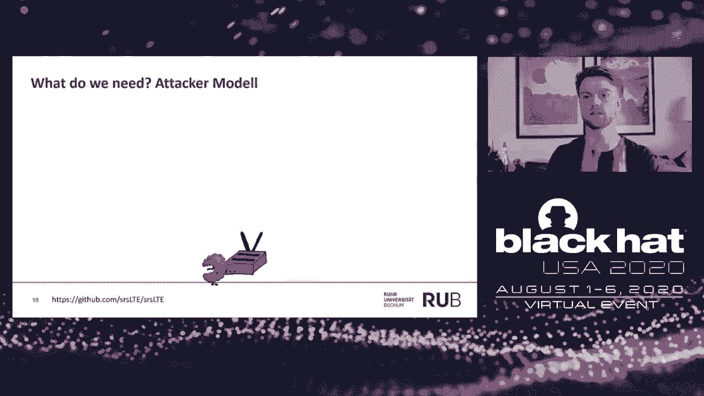
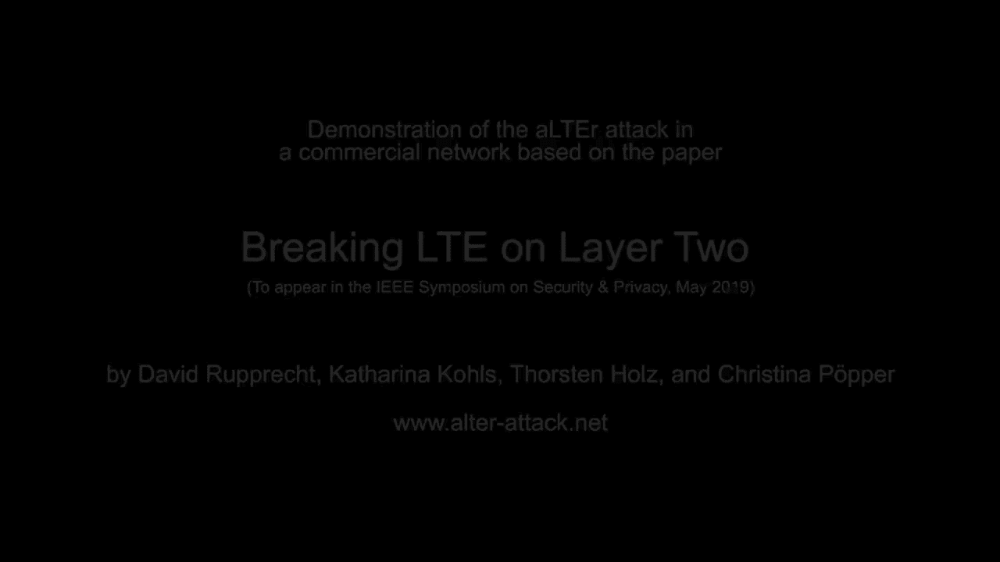
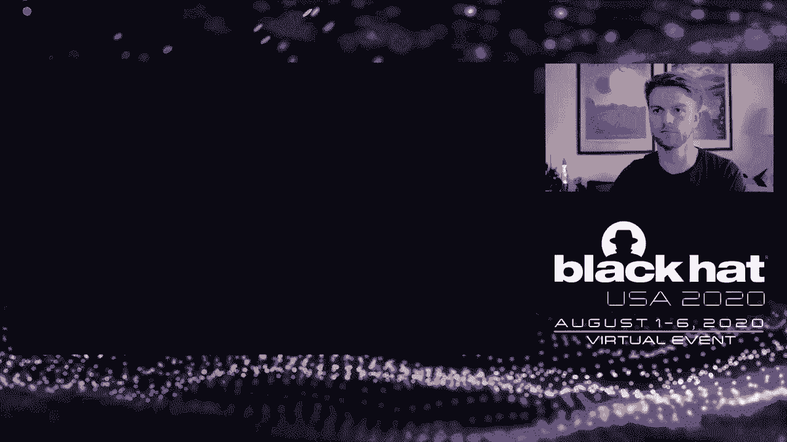
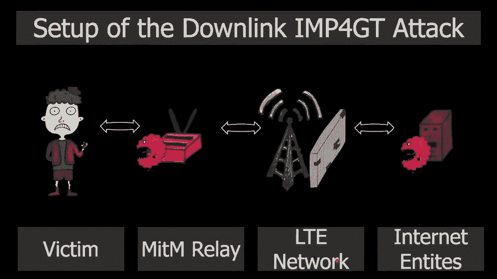

# 【转载】Black Hat USA 2020 会议视频 - P3：03 - IMP4GT - IMPersonation Attacks in 4G NeTworks - 坤坤武特 - BV1g5411K7fe

 Hi everyone and welcome to my talk about the Impact Attack。

 Before we start， let me introduce myself。 I'm David Ruprecht。

 PhD student at the wonderful Royal University of Bohom and my aim is to。

 secure mobile networks by finding flaws and fixing them。 Before we start with the talk。

 let me motivate this topic and I know everyone knows LTE， is everywhere。

 So we use it to stream music， even some serious and buy things on Amazon。

 But also our first responders use it in case of emergencies。

 And there is a second and third use case， the industrial use case where IoT devices or。

 factories are connected via LTE to control units。 This and the fact that LTE is a foundation for our future 5G networks makes it important。

 to leak into the security measures of 5G。 So I will talk today to introduce you to the Impact Attack。

 Impact stands for impersonation attacks in 4G networks and when we talk about impersonation。

 we need a common definition of impersonation。 By impersonation。

 I mean that an attacker is able to act as you towards a network。

 He can send arbitrary IP messages or packets towards a network and even to the internet。

 with your identity。 The aim of this talk is to understand the Impact Attack。

 The attack vectors that are exploited and what implications of this attacks exist。

 Before we get there， we need to pass the basic agenda。 First of all。

 I would like to introduce you to some LTE background information。

 Then we would like to show you the outer attack。 The outer attack uses the same attack vector as the Impact Attack but is more easy to understand。

 than the Impact Attack。 Third， we will look into the Impact Attack。

 We will understand what attack vectors are used and how the attack works。

 We will further discuss the implications of these attacks and in particular see if 5G。

 is secure against these attacks。 So we will start with LTE background information。 So as always。

 we have a small LTE network architecture。 So we got the phone on the left side。

 This phone is connected towards the end-closest base station and this phone is connected towards。

 the closest base station also called "E" and the "L" not "B" or the LTE network itself。

 has many entities。 They are not important for us today。

 The important is that the IP network provided towards the phone is separated via firewall。

 from the rest of the internet。 Firewall or not。 So any incoming IP connection does not pass through the phone。

 So when we talk about LTE or 4G security， we definitely need to talk about the security， aims。

 The first and very important security aim is mutual authentication。

 Mutual authentication ensures that you are talking to the correct provider and the provider。

 knows that you are the correct person。 As some of you might know。

 2G does not provide any network authentication and this is why。

 still so many 2G attacks are possible or MZcatcher attacks。

 The second important security aim is traffic confidentiality。

 Traffic confidentiality ensures that a passive attacker is not able to eavesdrop your phone。

 calls but also even your internet connection。 Here I am not talking about HTTPS or TLS。

 I am talking about the radio connection between， your phone and the base station。

 The third most unique security aim for mobile networks is identity and location confidentiality。

 An attacker should not be able to know who you are just being close to you and also the。

 attacker should not know where you are when you only know your phone number。

 So today we are going to break the mutual authentication aim on the user data because。

 impersonation contradicts mutual authentication。 So how are the security aims basically fulfilled？

 Therefore LTE has some security features and the main part of the security features are。

 based on a shared secret in your SIM card and in the provider's whole network in a secure， location。

 Based on the secret key at the beginning of each connection， a handshake or mutual authentication。

 is established based on an authentication and key agreement protocol。

 This key agreement protocol is secure with mathematics proofs。

 And this AKA also derives some keys which are used for secure the further connection。

 for your internet traffic and even some control traffic。

 Today we are going to look at the security measures which are taken during the connection。

 and how they are protected。 Before we do this we need to distinguish between two kind of traffic。

 First of all we have control LTE specific control traffic。

 This control traffic is again rated when you for example hand over from one cell to another， cell。

 This control traffic is encrypted with a stream cipher and integrity protected。

 Further we have user plan traffic。 This user plan traffic is get generated by your app or your web browser when you visit。

 a website。 It's only IP traffic and this IP traffic is encrypted using a stream cipher。

 However this is not integrity protected like the control plane。

 As I said earlier we use a stream cipher to encrypt packets。 So how does a stream cipher work？

 So we have a plan text which is only 4 bit long and this 4 bits are x-word with a key， screen。

 For example AS encounter mode。 This x-word results in a cipher text。

 This cipher text then sends over the air towards the base station。

 The decryption is quite similar to the encryption so the base station receives the cipher text。

 x or the key screen can are rated with the same input parameters for AS encounter mode。

 and this will result in the plain text。 So we are already done with the LTE background information。

 We will start with the RTI attack。 The aim of the RTI attack is to steal credentials。

 For example when you visit a website you get redirected to a malicious web page where。

 log in prompt is shown and you enter your credentials and the attacker is able to gain。

 the information of this login。 You are not exactly connected to the real network。

 You are connected to something which we will call LTE relay or man in the middle attacker。

 So what kind of attack vector does the attacker exploit？

 The attacker exploits the missing integrity protection of the user plain data which I have。

 shown you in the background。 So missing integrity protection in the combination with the stream cipher leads to malleable encryption。

 and malleable encryption is always a bad thing。 Just assume we have an active man in the middle attacker in the position between the。

 phone and the base station。 This man in the middle attacker can actively change the cipher text by flipping the circuit。

 in this example。 The base station has no means and no measures to detect such bit flips。

 This is the same key stream as generated before which result that the same bit flip is contained。

 in the plain text。 The question is can this be done deterministically？ Yes it can be done。

 Under the assumption the attacker knows the plain text。

 So in this way the attacker can calculate a mask by exploring the wanted plain text here。

 on the right side with a known plain text and the mask can be applied to each packet where。

 the plain text is known to change it to the wanted plain text。

 The question is now where do we get the plain text in particular in the context of LTE？

 So the answer to this question is quite simple。 We will use the DNS server which is set by default during the first attach。

 So each provider has this set on default DNS servers which are known to us or the attacker。

 and we use this IP address to perform a redirection attack。

 Further it's important to note that DNS packets are particular or good identifiable based on。

 the length of the packet。 So they are a good distinguish between normal TCP traffic and DNS requests。

 Knowing the default DNS we got the known plain text and we can basically redirect any DNS。

 request towards the malicious DNS server。 So the aim of the RTI attack now is to redirect the outgoing DNS request with an active attacker。

 which is in the manner in the middle position between your phone and the network and to。

 redirect this DNS request towards the malicious DNS server。

 So the phone will connect to our man in the middle relay because this attack is quite。

 similar to the MC cache attack。 So the relay sends out the identifiers of the network。

 Then the network， the commercial network and the phone will perform the AKA。

 This will happen and the relay will relay all those messages without any modification。

 In this way the phone thinks he is connected to the correct network and the network thinks。

 he is connected to the right customer。 The relay first or fourth words all messages until a DNS request is received by the relay。

 When he receives the DNS request he will detect it based on the shorter length and will ex。

 or the mask he has calculated and this mask can be easily applied due to the missing。

 and technical protection。 He basically sets the destination IP towards the malicious DNS server and forwards it to。

 the network。 The network has no means to detect the manipulation decrypts the packet and routes it towards the。

 internet and basically is received by the malicious DNS server。

 The malicious DNS server receives the DNS request and responds with a spoofed DNS response。

 and sends it back to the network。 Everything is encrypted via the network for the over air transmission and forwarded to。

 the relay on the radio layer and the UE receives the packet on the radio layer and with a spoofed。

 response。 It then uses the spoofed response for the outgoing HTTP request。

 So all the subsequent HTTP connection is directed towards the malicious HTTP server。

 So we need something in the middle position between your phone and the commercial network。

 And on the left side we already know that MZcatcher or fake base dashnet attacks exist。

 So towards the phone the relay must act as INOTP as commercial INOTP by sending out the。

 identifiers and acts as normally INOTP。 However， the relay also requires to act as UE towards commercial INOTP。

 So on the radio layer it looks like it's real UE connecting。

 In between everything is forwarded or layer two frames are forwarded in both directions。

 And only DNS requests are altered。 So we built this relay based on the open source software stack called SLS LTE。

 And I will now show you my setup。 So SLS LTE requires you to send our messages using software defined radios。

 We got here one software defined radio by address that costs about $1，000 and this simulates。

 the UE towards the commercial network。 We got a second INOTP software defined radio here connected via cable towards the shielding。

 box and within the shielding box we got the antennas here and they open up the cell which。

 our commercial phone here next to 5 connects to。 The commercial phone contains a commercial SIM card without any modification except everything。

 is controlled via IDP and USB cable。 We close the shielding box to not interfere with the commercial network so that the providers。

 can use a spectrum。 And so this was the setup and I will now show you the demo video of the Ultra attack。

 So we see the LTE relay here and the DNS server here and the HTTP server here。

 We have the victim's phone here。 We initialize the relay。

 We start both software defined radios and we are going to disable the airplane mode。

 At this point the AKA is performed。 Control traffic is relayed and the phone thinks it is connected to the real commercial network。

 The victim might enter a webpage or website like hotmail。com and here we already got the。

 redirection。 So the relay detects the DNS request based on the links。

 Or some ask and the IP packet gets redirected or routed to the malicious DNS server。

 And the phone sends now the HTTP request to the malicious HTTP server and the HTTP server。

 delivers a fake website where the user might enter the credentials。

 And here you can see that the user entered the credentials and everything is locked by。

 the attacker and he can obtain the credentials。

 So you now have seen that the Ultra attack can be performed in a commercial network for。

 stealing credentials or redirecting people or victims to a malicious site。

 And the question is can it be worse and yes it can be worse with impact。

 So we will proceed now with the impact attack。 As I said impact stands for impersonation in 4G networks。

 The question is or there are two variants of the impact attack。

 First of all we have the uplink variant。 In the uplink variant the user or the victim at the attacker impersonates a victim towards。

 the network on the user plane。 So this is the limitation we only focus on the user plane using IP traffic。

 For example the attacker is capable or able to access a website with the identity or IP。

 address of the victim。 There is a darling variant of this attack and the darling variant enables an attacker to impersonate。

 a network towards the user on the user plane。 Thereby he can circumvent the provider's firewall directly accessing the phone via network connection。

 This both attacks break the aim of mutual authentication on the user plane in both directions。

 The provider does not receive messages from the identity but assumes the identity of another。

 And also the victim or the phone receives messages it should not receive。

 What do we have explored for impact？ We exploit again the effect of missing integrity protection and we combine this attack vector。

 now with something we call reflection。 So I think all of you know the ICMP protocol and the ICMP protocol works as follows。

 When you send an IP packet and the ICMP request and which contains some data the phone will。

 respond with an ICMP response and copying the data from the original packet。

 Thereby the phone the data can be arbitrary long so it can be the full MTU size of the。

 packet and which is replied to the requesting party。

 So the basic principle of the impact attack is that missing integrity protection and combined。

 with the effect of the reflection measurement allows us to build an encryption and decryption。

 oracle and this is because we need to encrypt something towards the network and receive something。

 from the network and both oracles allow an impersonation。

 So we will start with the encryption oracle and basically introduce the idea of the encryption。

 oracle and then we will show you the decryption oracle。

 So from the outer attack you know that the attacker an active attacker and the man in。

 the middle position is capable to flip some bits in the received plaintext when he knows。

 certain parts of the message。 So we have seen that we can flip one bit under the assumption we know this bit。

 However knowing the whole plain text would allow us to change the whole plaintext。

 So the attacker when he knows the whole plaintext he can compute a mask for all bits in the。

 plaintext in the packet and can change everything。

 In other words if the attacker knows the whole plaintext he can extract the key screen and。

 reuse it to encrypt his own packet towards the network。

 And this is something the encryption oracle does。 So we got some entities for the encryption oracle again。

 So we got the victim's phone here we got the relay in the man in the middle position between。

 the network between the conversion network and the phone and we got the key screen generation。

 server。 This is something under the control of the attacker which is basically a server on the。

 internet and the target server。 Aim of the attack is now to send a packet towards the target server with the identity。

 of the victim。 So the key screen generation server will start with this attack。

 It will send an IP packet containing the UDP and known payload towards the network。

 So this payload is particularly important and the attacker will basically note the plaintext。

 the whole time of this attack because the key screen generation server is under his control。

 In this packet towards the network would result usually in the firewall to drop the packet。

 So this is something we need to assume now but there is a firewall or not will already。

 open for this incoming packet。 So I did a shortcut here to do not bore you with the preparation phase and so let's assume。

 that this nut port is open。 The network will route this packet on the logical level to the phone and the network will。

 attribute this packet for the over-air transmission but on the radio layer this packet is sent。

 towards our relay。 The relay can now manipulate the whole content of the traffic but only focuses on the UDP。

 header and changes the UDP header to an ICMP ping request with a known payload here。

 Everything is valid and encrypted and sent towards the UE。

 The UE will now trigger the reflection mechanism or because it's an incoming ICMP request。

 We will respond to this ICMP ping request with an ICMP ping request， which is generated。

 actually by the key screen generation。 So the relay has now the chance to compute the key screen because the plaintext also。

 the ICMP ping reply and we use this key screen to encrypt his own new payload which he would。

 like to send towards the target server。 He also sets the destination IP to the IP of the target server IP。

 Everything is valid and sent towards the network encrypted and the network has no means to detect。

 any manipulation and then decrypts the packet and forwards the packet towards the target， server。

 So the target server has now received the packet and he will respond to it。

 For example if you have an TCP connection which should be built up you got a TCP SIM。

 packet and the target server will respond with a TCP SIM AC towards this packet。

 So we need to receive the SIM AC packet as an attacker to build up a fully functional connection。

 So the idea of the geek scriptu-norecal so this is why we need the geek scriptu-norecal。

 The idea of the geek scriptu-norecal is now that the response of the target server is manipulated。

 in this way and that it also reflects the packet and the reflected packet is also again manipulated。

 and redirected to an entity called decryption server。

 So how does it look like in the sequence diagram？ The target server will respond for example with a TCP SIM AC with an unknown plain text。

 A payload with an unknown payload we would like to receive this payload because we would。

 like to build a valid TCP connection towards the target server。

 The network receives this and it's actually directed on a logical level on an IP level。

 towards the UE towards the phone。 But on the radio layer this packet is sent towards a relay。

 The relay has again the chance to manipulate the plain text or the payload of this packet。

 Now there is also a second reflection mechanism not the ICMP ping reflection。

 This is something we call unreachable reflection。 In case of changing the IP protocol header we can change it to an unsupported protocol。

 and the UE will reflect the packet with the payload of the incoming packet。

 So this is where the reflection mechanism is triggered。

 And this reflection contains a whole TCP packet original coming from the target server。

 And now the relay changes the destination IP towards the decryption server and the network。

 again receives the packet and decrypts it and forwards it or routes it towards the decryption。

 server。 We can now access the original packet from the target server and are able to access the。

 information we need。 So using the uplink and downlink encryption and downlink decryption allows us to fully。

 impersonate a vector。 So we can start with the uplink encryption or record to build a TCP packet。

 receive the， TCP syNAC and perform the uplink encryption again to send some data to the target server。

 and the target server will respond。 So we have performed the experiments using the same setup as shown before with a commercial。

 network with a commercial phone。 And all these attacks do not require any user interaction。

 This is because we use the initial check of Android phones to be intercepted which is。

 Android connectivity and connectivity check。enroid。com and we perform for the uplink impersonation。

 we perform two experiments。 So just to recap the aim of the uplink impersonation。

 The attacker would like to access a website or a server with the identity of the victim。

 And we performed an experiment where we visited a website which is only accessible by the victim。

 and therefore I need to introduce you to server sites。

 Other sites are sites hosted by the providers that allow you to manage your account。

 They allow you to book data plans or even time times to show your phone number。

 The authentication is just based on the IP address。

 So this is something called header enrichment and the provider at the gateway towards the。

 server inserts insert a header and that says okay this is this customer。

 He has his rights to be accessed。 And we performed this experiment and we were able to access the server site without any。

 interaction of the victim。 We further uploaded a 10 kilobyte file to a server with the IP address of the victim。

 We will now see the demonstration of the uplink impact attack where we access the server site。

 with the identity of the victim。 So we again and the man in the middle position between the Nelty E network in the phone。

 And here we see all the internet entities but we focus on the man in the middle relay。

 We see the victim here and we start the relay。 If we let's start it we will disable the airplane mode now。

 And start some management script that perform all things automatically。

 And now the phone is connected again so the AKA has happened and everything is fine。

 And we download the website using an automatic call script。 And here we go。

 We download it in total 35 packets and the victim has still a functional LTE internet connection。

 So we see the HTML source code and we see that we are able to access information how。

 many data volume was used during the last period。 And we are able to book a new data plan which is a day flat where you can have free access。

 for one day for 24 hours。 So we have seen that the uplink impersonation works in a commercial setting and we will also。

 see that the downlink impersonation is possible。 So I didn't talk much about the downlink impersonation however it's quite similar to the uplink impersonation。

 So you got an encryption oracle and a downlink encryption oracle and a decryption oracle。

 The aim is the other way wrong。 So the attacker impersonates a network and is able to send any kind of IP traffic towards。

 your phone。 He can use this to circumvent the firewall。

 For example if you have an app listening on a particular port or an IoT device or something。

 like that and this should be protected by the providers for your wall towards any incoming， traffic。

 And the aim of the downlink impersonation attack is not to circumvent this provider's。

 firewall and send arbitrary IP messages towards your phone。

 So we will see this。 So the aim。

 And we are again in the manual position between the LTE network and the victim。

 And we focus again on the man in the middle relay and here we got the app that listens。

 for incoming traffic。 This is basically netcat just listening for incoming traffic。

 We start the relay。 The relay has found a cell and sends out the identifiers and we disable the airplane mode。

 again。 And so we start some management scripts and disable the airplane mode。

 So the AKA is performed and the UE thinks okay it's connected to the network and already。

 the attack has happened。 Here we see a hello downlink impact which is in string which is sent towards a app。

 So we now have seen that the uplink and downlink impersonation attack is a real attack。

 to commercial networks and it's very important to discuss the implementations。

 So the first question I would like to answer and who is affected。

 And I guess if you are not ordinary person and this is something that should not or will。

 not happen to you。 The attacker needs to have specialized hardware。

 customized LTE stack and conducting this attack， outside our shielding box is quite difficult。

 However for single targets and very high value targets this might be an option。

 So we know that IMSI catchers and stingrays are out there and used by agencies for conducting。

 attacks。 And I recently came about an article or report by MNST International which describes an attack。

 vector or an attack to a journalist where he got some spyware installed on the phone。

 And basically I would like to read out some sentences。

 For the network injection the attacker requires either physical location to the target or。

 access to the target。 And the first sentence of the describes something similar to an MC catch attacks。

 So you need physical approximation to the target。 And there's another sentence which is quite interesting to read。

 The phone's web browser is then redirected to a malicious web page or website。

 And this is exactly the alter attack。 So you get redirected and then might get infected by spyware。

 So an ordinary person might not be affected by this but it might be exploitable now or。

 even in future by some agencies。 Besides the estimation of the risk we would like me to talk about the consequences。

 First of all for providers， providers rely on mutual authentication for billing purposes。

 So for example， use this server site where you can book the data plans。

 But also an attacker is able to generate a lot of data in your name。

 And this would be built for your bill。 And this would result in overbilling。

 And this is something providers should be concerned about。

 I think there are some laws in some countries that allow not to overcharge US customer。

 And there are also the risk of auto-realization。 So accessing the server site for example。

 Consequently， the impact attack is risk for the business model of the providers。 Second。

 law enforcement agencies rely on mutual authentication in case of an investigation。 For example。

 when an attacker visits a website which is only or visits a website， attacks。

 this website or upload illegal content to this webpage。

 And the police investigates in this case and asks the provider for the identity of a particular。

 IP address。 The wrong victim gets blamed。 And this is bad for police investigation。

 And so it's a kind of serious threat for a current and future investigations that are。

 softly based on IP addresses and mobile address。 Last but not least， the consequences for users。

 So what are the consequences for users？ Obviously， this is a privacy threat。 For example。

 when the server site displays your phone number， this phone number can be。

 directly linked to your MC。 And this can be used for further tracking attacks。

 And this is something you don't want。 But also for industrial users like having a factory connected via LTE or IoT devices。

 connected to your control unit， would allow an attacker to circumvent the provider's。

 firewall and thereby directly accessing the port of the IoT device。 For example。

 bad configured IoT devices that have all the main town networks would be open， to such an attack。

 So the question is how can we mitigate the problem？

 And the only valid answer is perform mandatory integrity protection on the user plane。

 And there are two questions。 First of all， is LTE capable of performing this？ And what is above 5G？

 So LTE is already around for 10 years。 Things are deployed。

 And I guess there will be no mandatory integrity protection on the user plane for all devices。

 Backporting would be very expensive。 However， 5G-- yeah， and the situation in 5G is different。

 So in 5G， there is a standalone mode， which will be deployed maybe in 2022。

 And this standalone mode integrity protection of the user plane is optional。

 But it's mandatory to support in full rate for all devices。

 And this is something which is only one month old。 So basically。

 mandatory integrity protection on full rate level is only supported since， the beginning of July。

 But it's still optional to use in 5G。 So we will monitor the providers if they will enable it。

 And this is how I would like to end my talk。 So thank you very much for listening to my talk。

 It's still healthy。 And feel free to contact me if you have any questions。 Hi， everyone。

 And so thank you for listening to my talk。 And I hope you enjoyed it。

 So I don't know if I have much time for answering Q&A。 I guess most of your questions should。

 be set by now， at least in the chat。 So if you feel free to contact me if you have further questions。

 And so thank you for listening again。 Hope you enjoyed it。

