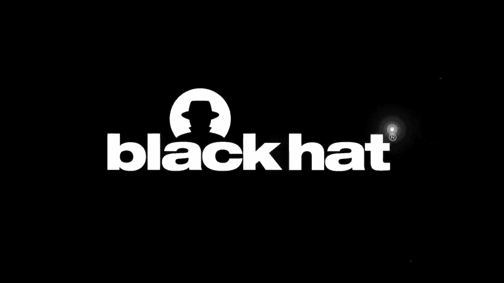
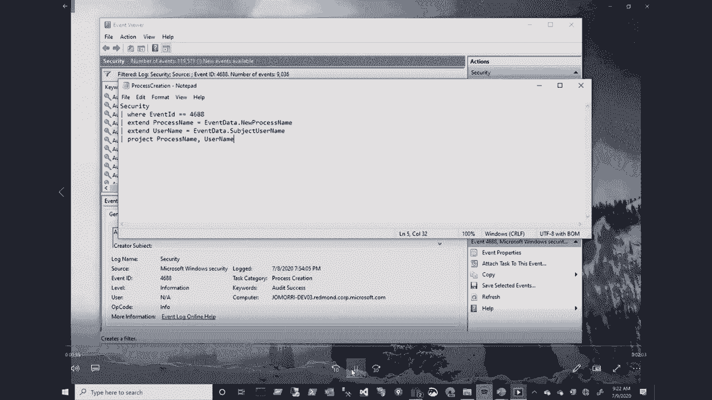
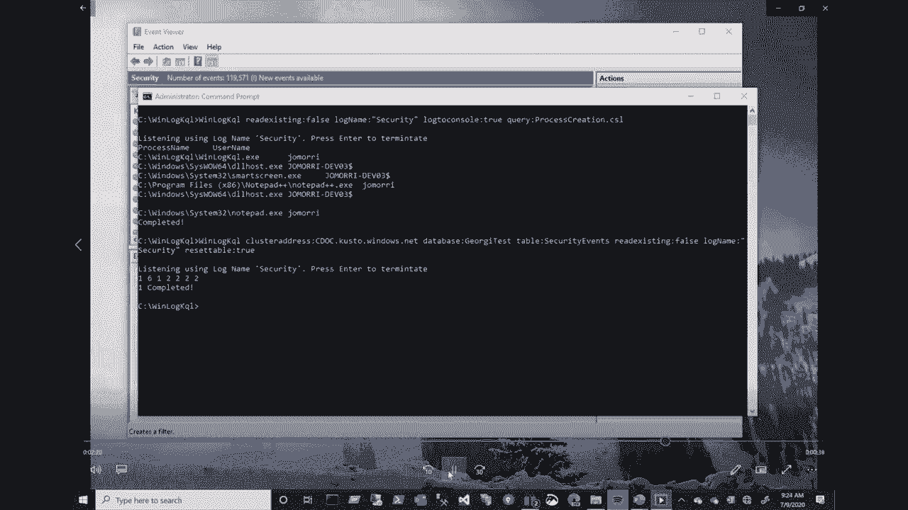
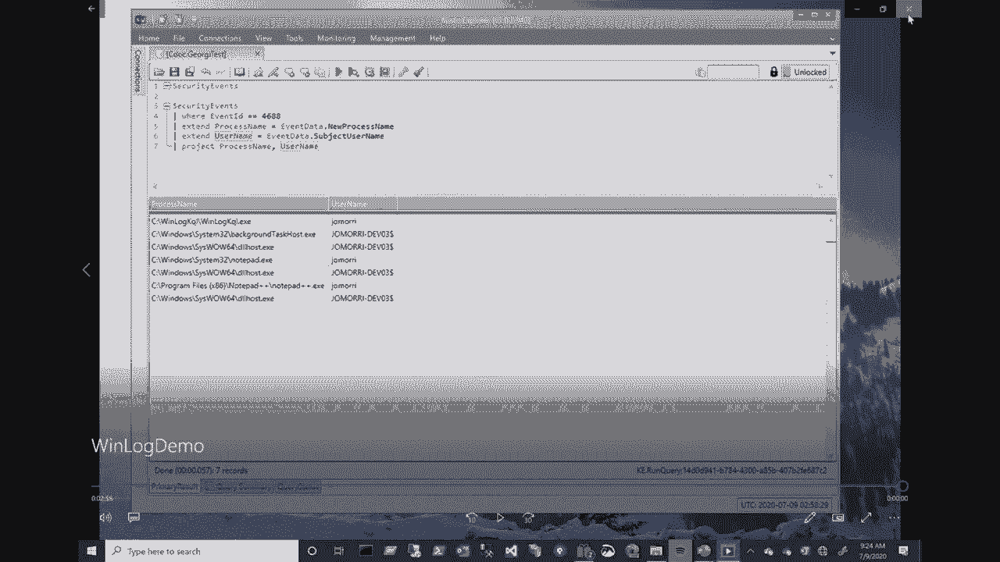
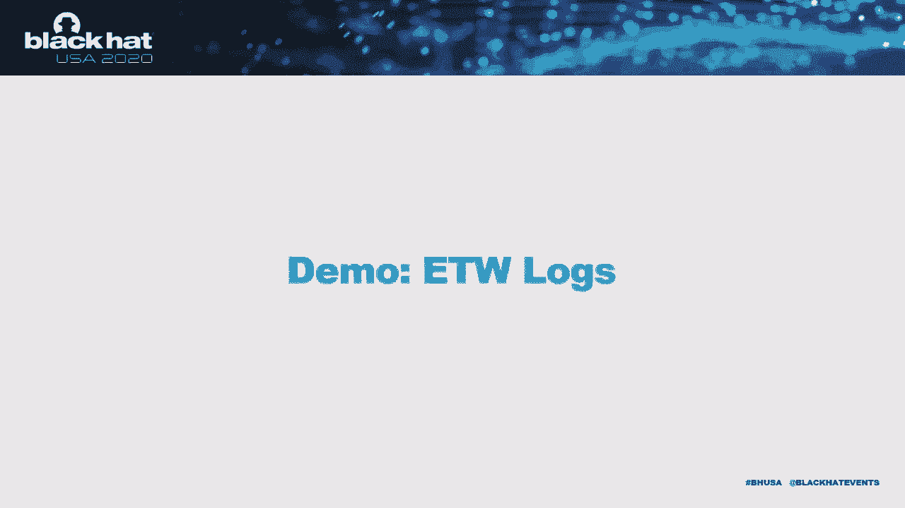
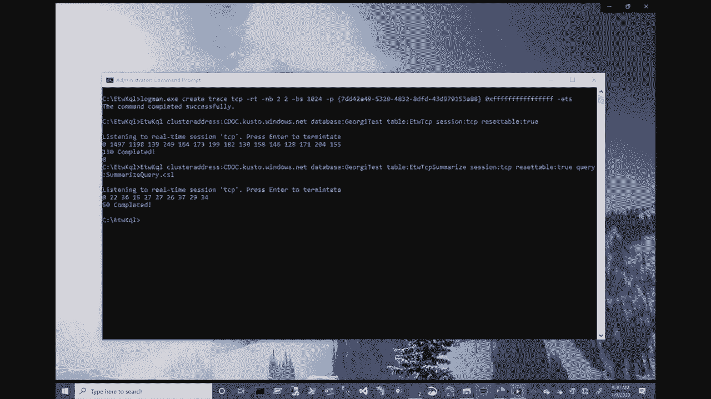
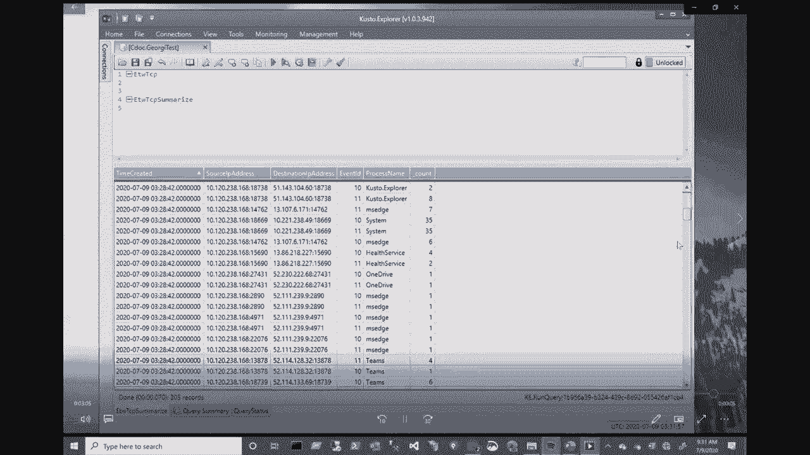

# 【转载】Black Hat USA 2020 会议视频 - P40：41 - Experimenting with Real-Time Event Feeds - 坤坤武特 - BV1g5411K7fe

 Welcome everyone。 The tools are currently available for log analysis in SOC are complicated and。

 inefficient。 I'm Joe Smarris from Microsoft。 I'm here to share our work on real time event。

 feed analysis。 The tools we have developed and releasing today will make it easier for。

 companies to protect their assets。 So let's look at the landscape of the tools that are。

 available for analyzing logs today。 Imagine there is an adversary in the system。 There。

 are a whole bunch of places where you can collect data。 There is operating system log。

 there is application log and then high volume tracing。 The researchers or SOC responders can。

 now either use limited tools like grep on Linux or event viewer to look through the。

 logs or they can even upload it to a database。 That means like they have to now have a high。

 volume database where they can upload all these events。 They also have to make a decision。

 of which exact event they need to upload。 If you look at it this way， there are a whole。

 bunch of events that are available for real stream。 Out of that， only a small subset gets。

 recorded on the machine in the logs and even out of that， only a small subset is currently。

 used by SOC to identify issues。 Let's look at an alternative here， real time query。 Imagine。

 all the data that is flowing as real time event feeds。 Think about an ability to apply。

 filtering on the fly even before the event feed hits the disk。 What this gives us is。

 the ability to filter， transform or aggregate on the fly and only think about storing the。

 relevant data that we need。 The relevant data can now be presented just on the console or。

 as comma separated files or JSON。 The tool that we， the language that we are using for。

 this querying mechanism is KQL。 We like the Custo query language syntax which felt very。

 natural for us to apply on real time event feed。 The same process can also be applied。

 on recorded events in log files and you can either transform or you can simply upload to。

 a database of your choice。 In this case， we are using Custo as a database of our choice。

 The flexibility that's that we are getting here is we are using a similar language， KQL。

 for filtering on real time feed on the local machine before we upload or in case we have。

 uploaded all the data， we can apply the same language syntax on the database too。 So this。

 gives our SOC engineers the ability to just learn one language and use it in both places。

 Let's switch to a demo of how to read Windows logs。 On a Windows machine。

 when an adversary is active on the machine， you have event viewer。

 to look for all the processes that the adversary is creating。 In this case， we are looking at。

 a simple example of looking for process create events。 In this case， what the SOC engineer。

 typically does is he has to go into the filter and apply an ID for process create events and。

 then filter by it and then now he has to look through all the process create events looking。

 just for the one that the adversary actually created。 This makes it more cumbersome to use。

 Now come back， let's switch to a different model here。 The user， the author first creates。

 a query file where he specifies a Custo query where he just says this is the event ID that。

 I am interested in and then projects just the values that he wants and then attaches it。

 to the tool that is running。 Now the tool is printing just the information that the uses。

 of the SOC engineer is looking for。 For example， in this case， he is looking for the process。

 name and the user name and it is printing it on the screen as the adversary is active。

 So it happens real time and the user is having an instantaneous view of what's going on。

 Now let's switch to another sample where we use the same tool but try to upload all the。

 data to Custo。 So this is a command line on the same tool to get all the data up to Custo。

 and here in this case what I'm doing is like I'm simply uploading all security events with。

 all the properties rather than doing a filtering on real time。 Now again the tool is running。

 I'm simulating an adversary trying to open notepad or other applications locally and。

 then you can see that the events are getting uploaded to Custo。 Once this completes I can。

 switch to Custo Explorer and we can look at how the data shows up in Custo。 So here is。

 the Custo Explorer where I can see all the events that are uploaded with the whole of。

 the event data that is uploaded now。 Now here rather than filtering by a specific event。

 I have uploaded all events。 Now let me run the same query that I created and I can now。

 see I can do the similar filtering on the collected data。 So here we have seen a demo。

 where you can either run the query real time on the machine and upload only the data you。

 need or you can upload everything to Custo and then run the same kind of a query on Custo。

 Now let's move on to event tracing for Windows。 Event tracing is a high volume event logging。

 that is available as part of Windows。 Typically SOC engineers don't look into this because。

 the event is really high volume and then if we try to collect such a high volume event。

 it becomes a problem trying to store it locally and then parsing through it。 So let's take。

 some scenarios like some of the event tracing that's available on Windows。 For example you。

 have event logging， ETW logging for IP package send and receive， DNS client request response。

 file creator， deleted， registry key creator， deleted。 So all these events are like you。

 already have them logging but the logging is actually turned off unless the SOC engineer。

 specifically turns them on。 So here we look at the whole of event tracing for Windows and。

 then as we saw like the recorded events in the logs which don't contain everything and。

 currently the same uses only a subset of it。 But by doing a ETW tracing and filtering on。

 the fly we can look at a lot of interesting security data。 Let's now switch to a demo， for ETW logs。

 So here I have a demo for collecting ETW events。 So the first step on this process。

 is to use log man or any such tool to start an ETW session and for this scenario what。

 we are going to look at is imagine an adversary who is on the machine and he is trying to do。

 a lateral move， he is trying to connect to different machines and different IP addresses。

 So what we are trying to do here is like collect all the IP packet send receive events。

 and then summarize by a specific summarize by the IP addresses and then collect the data。

 So first step is to start a log man trace and set it up and once the log man trace is。

 running I can create a ETW like I can start the ETKQL tool and then pass the same log。

 man session name as an input argument and start the tool。

 So now the ETW KQL tool is connected to the log man session and it is collecting all。

 the TCP events and it is uploading in raw format to Cousteau。 Once I run it for a while。

 and let the adversary application do what it is doing now I have all the data collected。

 in Cousteau。 Now I can open Cousteau and then look at all the events so you can see that。

 a whole lot of events have been uploaded in that small time interval。 So now you look。

 at it the event data it shows all the information about each IP address and the port to which。

 it is connecting etc。 Now on top of this I can run a summary query which is very similar。

 to this and bucketize the data in Cousteau。 Now let's switch it to run the same query。

 locally on the machine even before it hits the database and summarize and collect them。

 in real time。 I take the same query and use it to I take the query where I am looking。

 for event ID 10 and 11 alone and then I do a get process name on the event and then I。

 do a summarize by every two seconds。 Once I run the same tool with the query now you。

 can see that the data is getting summarized and then it is getting uploaded to the database。

 I let the adversary do everything that the adversary typically does and then now I go。

 back to look at the data in Cousteau explorer。 In this table now you can see that the data。

 is already summarized and we are even getting the process name which is not part of the。

 provider but we are doing a local lookup and we are able to also insert that in the database。

 So you can see how we can switch between collecting all the data and doing summary on the server。

 or doing it on live stream and then uploading the data。 So far we have seen how we are able。

 to apply the concept of doing query on real time on a Windows machine。 Not all the machines。

 that are available that needs to be protected are Microsoft specific operating systems。 So。

 socks do have to defend the Linux on the network。 So we will look at how the same concept can。

 be applied to a Linux machine。 On Linux we have different type of logging。 So we have。

 EBPF which is very similar to ETW。 So what we are trying to do here is we are trying to。

 take the same high volume EBPF event and apply the same query in concept on top of it and。

 then do filtering on the local machine and then just upload the data that we need for。

 our future investigation。 So this is more of something that we are currently working on。

 So I don't have a demo to show yet but eventually this is how it will look like。 We can run。

 we can start an EBPF trace session and then the user will be able to do a similar filtering。

 on the local machine and he can upload。 Here are the key takeaways from this presentation。

 The current tools for log analysis are inefficient for analyzing large datasets and the event。

 querying tools that we have allows us to explore events on a real time feed or do pre-processing。

 before uploading to the database for analysis。 This allows us to be much more efficient and。

 also we are able to look at different datasets without thinking about how it is going to impact。

 the system。 You can also output the database of your choice。 Right now we have it uploading。

 to Custo but since this is an open source project and we are having that code available you。

 can wire it up to any other database of your choice too。 Feel free to take pieces that。

 you need from this and also you can contribute to this。 Here are some useful links on where。

 the source code is going to be available， the KQL tool source and then Custo query language。

 is part of Azure Data Explorer。 So the full documentation of how the syntax works is available。

 in the syntax in the docs and then we have ETW explorer tool which is written by somebody。

 on a GitHub that allows you to look at all the ETW providers that are available on the。

 machine and start using them。 Thank you。 Okay。 I will give a few minutes。 Yeah。 Okay。

 I will give a few minutes。 Okay。 I will give， a minute。 Okay。

 So this tool is more about like a stand alone。 It's something that's available。

 for anybody to use outside of Sentinel but Sentinel also will have similar capabilities。 Well。

 so for example， like this tooling allows， so the question here is like， can you set。

 up real-time alerts with Custo？ Custo has ability to， like one， well， there is a small lag in。

 getting the data into Custo but then once you get it into Custo， you can run functions。

 on timer which can look at the data that is coming into Custo and then you can create， alerts。

 It's about how you can leverage the different components of Azure and get an。

 alerting functionality working。 So one， one other thing to emphasize in this is that the tool。

 the purpose of the tool is， to take the difficulty of writing code to extract data from the ETW events and win-log。

 events and events is slug。 So we， the， the ability the tool provides is to take the data。

 that is available in all these different formats and be easy to， to convert it into a easy。

 to queryable model。 That's the main thing that we are doing here。 So the next question。

 I can see here is like， when you say it can be used for pre-processing or you suggesting。

 it can be used like a log collector， I see it is for supporting IR investigation after。

 the fact specifically with the event logs。 Well， so the purpose of pre-processing is when。

 let's say like there is a high volume event stream that we are looking at， then the events。

 that we are looking at may be minuscule but the volume of data is large。 So by running。

 a query that is real time， it only extracts the data that matches your criteria and saves， it。

 It doesn't try to save a huge volume of data and then go look for that one event that。

 you are actually interested in。 That's the main benefit of doing this pre-processing。 So this。

 this allows people to look at high volume events where which typically people。

 avoid because they don't want to save a terabyte of data looking for one event。

 So that's it for today。 Thank you。 。 。 。 。 。 。 。 。 。 。 。 。 。 。 。 I don't have it right now with me。

 I can probably get it back to you。 So the next question is like。

 how many types of event logs are you collecting？ Right now we are collecting。

 We have code that is built in for reading syslog， for a ETW logs and win log。 So other log types。

 since the code is open source， it should be fairly easy to see how it can be extended。

 to other log formats。 The main thing that， so continuing on that question itself， like the log gets。

 all the data gets converted， into JSON format that is used in the query filtering。

 So it's like any data that can be translated into JSON， can be used to apply this querying on top。

 So any log format can be fitted into this real time。 The next question is like。

 do you need a cloud account to use it？ There is no need for a cloud account to use this。

 unless you are trying to upload the data into Kubernetes。

 So you can simply run this tool on a standalone machine， that has no internet access。

 and get the output into a text file。 And if you want， you can simply print it to the screen。

 So there are different things that you can do on a machine， without having a cloud account。

 You need a cloud account only when you want to upload， the data to kusto and then do post analysis。

 [ Silence ]， [ Silence ]， [ Silence ]， So here is the link for a kusto explorer。 [ Silence ]， Yes。

 [ Silence ]， [ Silence ]， Okay。 Yeah。 So if anyone has any more questions， I'm available to answer。

 If there are no questions， I can wrap up in a minute。 So the next question I have is。

 are you planning to use any machine learning based， detection model with your tools？

 The purpose of this tool is to collect the data， and then make it available。 So at that point。

 and once you get the data into kusto， you have all the freedom to apply any machine learning。

 on top of the data that's collected。 So that is still a possibility。 Yes， you can do it。

 [ Silence ]， [ Silence ]， Okay。 Thanks。 Thanks everyone for attending this presentation。

 And since the source code is available in the public， GitHub， you guys。

 anyone having a question can post a question， in the GitHub website and we will be happy to answer any questions。

 you have。 And also it's an open source project。 So we welcome everyone's contribution。

 Please feel free to connect to us through GitHub。 Thank you。 Bye。

